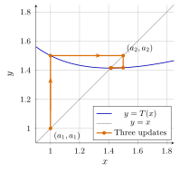
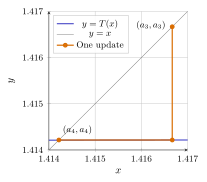
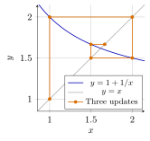

# 第 1 讲　$\sqrt2$ 与牛顿迭代 (Computing $\sqrt2$ by hand)

这门课从一个可以在纸上动手的问题开始：不用计算器上的开方键，怎样把 $\sqrt2$ 算到很多位？我们熟悉正平方根 (positive square root) 的记号， 但熟悉一个记号，与知道怎样计算、怎样检查计算，还是不同的事。 本讲从分数计算开始，逐步检查近似值的精度。

AI 可以协助长除法、列表和画图。使用这些结果时，先估计数量级，再用能独立检查的等式或不等式核对： 近似值的平方离 $2$ 有多远？图上的交点是否满足方程？本讲将给出两种具体的检查方法。

本讲研究由同一递推规则生成的数列 (sequence)，先观察各项的小数变化。 本讲会完整证明一个否定性的事实：没有有理数 (rational number) 的平方等于 $2$。 至于这些分数似乎共同指向的对象，先用熟悉的 $\sqrt2$ 记号称呼它； 实数的构造留到第 14 讲；本讲先研究这些有理近似值。

## 1 Locate the target first

计算之前先知道答案的大小。这里的十进制小数 (decimal expansion) 不必写得很长： 相邻的几个有限小数 (terminating decimals) 已经可以排除荒唐的结果。 若 $0<u<v$，则 $v^2-u^2=(v-u)(v+u)>0$；所以比较正数的平方，就能判断大小的方向。

> [!WARNING] 先猜一猜 (Guess first) — 先写预测，再动笔
>
>
> $\sqrt2$ 在 $1.4$ 与 $1.5$ 之间的什么地方？更靠近哪一端？ 如果只许再做两次平方运算，你会试哪两个小数？ 在纸上画一小段数轴 (number line)，先标出预测的位置。
>

> [!NOTE] 词语提示
>
>
> *endpoint*：端点；*predict*：预测；*finite*：有限的；*exact*：精确的。
>

> [!NOTE] Example 1.1 — A location check with exact decimals
>
>
> Predict which end of each row lies below the target. Then square the endpoints. Every entry in this table is exact.
>
> | Left endpoint |   Its square   | Right endpoint |   Its square   |
> |:-------------:|:--------------:|:--------------:|:--------------:|
> |    $1.4$    |    $1.96$    |    $1.5$     |    $2.25$    |
> |   $1.41$    |   $1.9881$   |    $1.42$    |   $2.0164$   |
> |  $1.4142$   | $1.99996164$ |   $1.4143$   | $2.00024449$ |
>
> The target belongs between the two endpoints in every row. In particular, an answer such as $1.42$ is already visibly too large. These are finite arithmetic checks: no claim about an endless process is needed.
>

我们已经知道该到哪里找。下一步的困难是：逐位试小数能行，但有没有一条规则， 能让一次计算带来不止一位的新信息？

## 2 递推规则 (The iteration rule)

设当前猜测是正数 $x$。我们希望 $x^2=2$，也就是希望 $x$ 与 $2/x$ 相等。 若两者还不同，把它们的算术平均数 (arithmetic mean) 当成新的猜测，是一个值得试的想法。 这给出函数 (function)
$$
T(x)=\frac12\left(x+\frac2x\right),\qquad x>0.
$$
先试算，不急着保证这个办法一定成功。

> [!WARNING] 先猜一猜 (Guess first) — Accuracy after three updates
>
>
> 从 $a_1=1$ 出发，每次取 $a_{n+1}=T(a_n)$。 先猜 $a_4$ 与 $\sqrt2$ 的小数部分会有多少位相同：一位、两位，还是更多？ 注意：从 $a_1$ 到 $a_4$ 是三次更新 (updates)，不是四次。
>

> [!IMPORTANT] 定义 1.2 — 迭代 (Iteration)
>
>
> 给定初值 (initial value) $a_1$，反复使用递推关系 (recurrence relation) $a_{n+1}=T(a_n)$ 产生数列 (sequence)，称为迭代 (iteration)。 本讲研究的牛顿迭代 (Newton iteration) 是
> $$
> \boxed{a_1=1,\qquad a_{n+1}=\frac12\left(a_n+\frac2{a_n}\right).}
> $$
> 这里的下标 (index) $n$ 标明项 (term) 的位置。
>

先把下面的框遮住，亲手算到 $a_4$。保留分数，可以把除法的不确定性推迟到最后。

> [!NOTE] 词语提示
>
>
> *numerator*：分子；*summands*：相加的各项；*updates*：更新次数。
>

> [!NOTE] Example 1.3 — Three updates by hand
>
>
> Starting with $a_1=1$, we obtain
> $$
> \begin{aligned}
> a_2&=\frac12(1+2)=\frac32,\\
> a_3&=\frac12\left(\frac32+\frac43\right)
>      =\frac12\cdot\frac{17}{6}=\frac{17}{12},\\
> a_4&=\frac12\left(\frac{17}{12}+\frac{24}{17}\right)
>      =\frac12\cdot\frac{289+288}{204}=\frac{577}{408}.
> \end{aligned}
> $$
> The two summands in the last numerator differ by only one: $289-288=1$. Keep this near equality in mind. We will check the square of the resulting fraction and its decimal digits separately.
>

这里每一步只有加、乘、除，但除法有没有可能碰到零？这是先于“算得准不准”的问题。

> [!NOTE] 命题 1.4 — 每一步都有意义 (Well-defined iteration)
>
>
> 上述数列 (sequence) 的每一项都是正有理数 (positive rational number)， 因而每一步运算都有意义 (well-defined)。
>

> [!NOTE] 证明
>
>
> 第一项 $1$ 是正有理数。如果 $a_n$ 是正有理数，则 $2/a_n$ 有意义且仍是正有理数， 它与 $a_n$ 的平均数也是正有理数。由数学归纳法 (mathematical induction)，所有项都是正有理数。
>

这一证明保证了我们能一直算下去。它还没有保证位数会稳定，更没有说明最终指向什么。 “每一步合法”与“整个过程达到目标”是两个不同的问题。

## 3 Which digits can we trust?

先把分数写成小数。绝对误差 (absolute error) 指近似值与目标之差的绝对值 (absolute value)，这里记为 $e_n=|a_n-\sqrt2|$。 这只是一次数值比较，不是对无穷过程的定义。

> [!NOTE] 词语提示
>
>
> *comparison*：比较；*rounded*：四舍五入后的。
>

> [!NOTE] Example 1.5 — Read the digits before reading the error
>
>
> The decimal values below are rounded to the displayed places; the fractions are exact. Read the decimals first and predict the size of each error before looking at the last column.
>
> | $n$ |     Exact $a_n$ |         Decimal value | $e_n$ (approximately)  |
> |:-----:|------------------:|----------------------:|:-------------------------|
> | $1$ |             $1$ | $1.000000000000000$ | $4.1421\times10^{-1}$  |
> | $2$ |           $3/2$ | $1.500000000000000$ | $8.5786\times10^{-2}$  |
> | $3$ |         $17/12$ | $1.416666666666667$ | $2.4531\times10^{-3}$  |
> | $4$ |       $577/408$ | $1.414215686274510$ | $2.1239\times10^{-6}$  |
> | $5$ | $665857/470832$ | $1.414213562374690$ | $1.5949\times10^{-12}$ |
>
> For comparison, the target begins
> $$
> \sqrt2=1.414213562373095\ldots.
> $$
> At $a_4$, the first five digits after the decimal point agree with the target: $41421$. The sixth digit does not. At $a_5$, the error is already much smaller than the last error shown for $a_4$. The gain is strikingly uneven.
>

小数点后有五个共同数字，是一个可观察的现象。把它说成“准确到五位”，却可能引起误会： 对小数截断 (truncation)、对小数四舍五入 (rounding)，以及问误差是否小于给定门槛， 是不同的操作。尤其在进位边界附近，不要把它们混用。

> [!WARNING] 先猜一猜 (Guess first) — 同样的前五位，会有同样的舍入吗？
>
>
> 只看 $a_4=1.414215686\ldots$ 与 $\sqrt2=1.414213562\ldots$， 不做新的迭代。把它们四舍五入到小数点后五位，结果相同吗？ 误差小于 $10^{-5}$，能不能保证这两个舍入结果相同？
>

> [!NOTE] 词语提示
>
>
> *absolute error*：绝对误差；*decimal places*：小数位数；*contradiction*：矛盾；*truncating*：截断；*rounding*：四舍五入。
>

> [!NOTE] Example 1.6 — A rounding boundary
>
>
> Truncating both numbers after five decimal places gives $1.41421$. Rounding to five decimal places gives different answers:
> $$
> a_4\rightsquigarrow1.41422,\qquad \sqrt2\rightsquigarrow1.41421.
> $$
> Rounding to six decimal places also gives different answers:
> $$
> a_4\rightsquigarrow1.414216,\qquad \sqrt2\rightsquigarrow1.414214.
> $$
> Yet the absolute error satisfies
> $$
> 10^{-6}<|a_4-\sqrt2|<10^{-5}.
> $$
> There is no contradiction. The two numbers lie on opposite sides of a rounding boundary. A small distance alone does not decide on which side of that boundary each number lies.
>

因此本讲精确地说：$a_4$ 有五位共同小数，误差约为 $2.12\times10^{-6}$； 若把小数点前的数字也算进去，它有六位共同的有效数字 (significant digits)。 **为什么才三次更新就这么准？第 4 讲回答。**

### 3.1 Checking the approximation without a square-root key

刚才的误差表用到了 $\sqrt2$ 的小数值。要独立核对 $a_4$ 的精度，可以用有限小数的平方 夹住目标，再比较两个区间的端点。这样得到的误差保证称为数值证书 (certificate)。

> [!NOTE] 词语提示
>
>
> *cross-multiplication*：交叉相乘；*certificate*：可核验的误差保证；*certified*：有严格保证的；*brackets*：夹住目标的区间；*estimate*：估计。
>

> [!NOTE] Example 1.7 — A decimal certificate made of integer products
>
>
> Treat these decimals as exact fractions. Squaring gives
> $$
> \begin{aligned}
> (1.41421356)^2&=1.9999999932878736<2,\\
> (1.41421357)^2&=2.0000000215721449>2.
> \end{aligned}
> $$
> The target lies between them. Cross-multiplication with $408$ also gives
> $$
> 1.414215<\frac{577}{408}<1.414216.
> $$
> Subtract the outer endpoints of the two brackets. We get the certified estimate
> $$
> 0.00000143<\frac{577}{408}-\sqrt2<0.00000244.
> $$
> This certifies $10^{-6}<e_4<10^{-5}$ without a square-root key.
>

这个检查已经足够说明 $a_4$ 的误差大小。但还有一种更适合手算的检查： 不先展开小数，而是算残差 (residual) $x^2-2$。残差测量的是“平方以后错多少”， 绝对误差测量的是“数本身错多少”。二者不是同一个量。

> [!NOTE] 命题 1.8 — 一个分数给出两边的位置 (A rational bracket)
>
>
> 设 $u$ 是正有理数 (positive rational number)，且 $u^2>2$。 令 $l=2/u$。则 $0<l<u$，并且
> $$
> l^2<2<u^2,\qquad u-l=\frac{u^2-2}{u}.
> $$
> 进一步，*如果*存在正数 $r$ 满足 $r^2=2$（本讲暂用其存在性，第 14 讲补证），则必有 $l<r<u$。
>

> [!NOTE] 证明
>
>
> 由 $u^2>2$ 可得 $2/u<u$，又有 $l^2=4/u^2<2$。 宽度的等式直接通分即可。最后，正数的平方保持大小关系， 所以任何满足 $r^2=2$ 的正数都必须在 $l$ 与 $u$ 之间。
>

> [!NOTE] 词语提示
>
>
> *upper bound*：上界；*iterate*：迭代项；*bracket*：夹住目标的区间；*width*：宽度。
>

> [!NOTE] Example 1.9 — An exact bracket from the fourth iterate
>
>
> Guess the size of $a_4^2-2$ before expanding the two squares. The calculation is
> $$
> 577^2=332929,\qquad 2\cdot408^2=332928,
> \qquad a_4^2-2=\frac1{166464}.
> $$
> Use the proposition with $u=577/408$. It gives
> $$
> \frac{816}{577}<\sqrt2<\frac{577}{408},\qquad
> \frac{577}{408}-\frac{816}{577}=\frac1{235416}
> \approx4.2478\times10^{-6}.
> $$
> The bracket width is a safe upper bound for the error of its right endpoint. It is not the error itself. Here it is about twice as large as the actual error.
>

所有端点都是分数，所有不等式都可以逐项复核。这里没有从一串越来越小的范围中 推出“必然存在一个数”的论证；我们只检查了眼前这一次计算。

## 4 把一次更新画出来 (Draw one update)

表格把大小写清楚，图像 (graph) 把一次更新如何接到下一次写清楚。 在同一个坐标系 (coordinate system) 内画出 $y=T(x)$ 与直线 $y=x$。 先在对角线 (diagonal) 上取 $(a_1,a_1)$，沿竖直方向到函数图像，再水平走回对角线。

> [!WARNING] 先猜一猜 (Guess first) — 竖直一步，水平一步
>
>
> 从 $(1,1)$ 出发，第一段应向上还是向下？第二段应向左还是向右？ 到达 $(a_2,a_2)$ 后，再一次竖直移动会朝哪个方向？ 先画箭头，再看图 [1](#l01-fig:newton)。
>

*先竖直到曲线读取输出，再水平到对角线把输出变成新输入；后两次更新在交点附近很难分开。*

为什么要走回 $y=x$？水平移动不改变纵坐标，到对角线时，横坐标也变成同一个数。 这个动作把“输出”交回给“输入”，于是可以再次使用同一张函数图像。

> [!NOTE] 词语提示
>
>
> *horizontal*：水平的；*segments*：线段；*diagonal*：对角线；*vertical*：竖直的；*update*：更新一次。
>

> [!NOTE] Example 1.10 — Decode the first two corners
>
>
> The first vertical segment ends at
> $$
> (1,T(1))=(1,3/2).
> $$
> Moving horizontally to $y=x$ gives $(3/2,3/2)$. The next vertical segment ends at $(3/2,17/12)$; its endpoint is below the diagonal because $17/12<3/2$. The next horizontal segment ends at $(17/12,17/12)$. Each pair of segments implements one update, not two updates.
>

图中第一项先向上跳，此后的几项往回走。最后几段看不见，不等于它们长度为零： 纸上的分辨率 (resolution) 已经不够。带着这个区别再看局部放大图。

### 4.1 图上的交点意味着什么 (What does an intersection mean?)

图 [2](#l01-fig:zoom) 放大第一张图中看不清的部分。这次不从起点画， 而从 $a_3$ 出发。横纵坐标使用同一比例，避免把方向与大小关系画歪。

*放大后可看见 $a_3$ 到 $a_4$ 的更新。在这个窗口里 $y=T(x)$ 已经几乎是一条水平线，水平那一段几乎压在它上面；$a_4$ 与交点仍难以分辨，精度需要由算式而非线宽决定。*

如果某个输入 $c$ 已经满足 $T(c)=c$，那么折线就没有可走的距离。 这样的输入称为不动点 (fixed point)。这个词先描述“一次更新不改变什么”， 并不保证从别处出发会走到它。

> [!IMPORTANT] 定义 1.11 — 不动点 (Fixed point)
>
>
> 若输入 $c$ 满足 $T(c)=c$，则称 $c$ 为函数 (function) $T$ 的不动点 (fixed point)。 对于本讲的 $T$，输入范围为 $c>0$。
>

> [!NOTE] 命题 1.12 — 停止位置的候选 (A candidate stopping value)
>
>
> 正数 $c$ 是 $T(x)=(x+2/x)/2$ 的不动点 (fixed point) 当且仅当 $c^2=2$。这样的正数至多有一个。
>

> [!NOTE] 证明
>
>
> 对 $c>0$，等式 $c=(c+2/c)/2$ 两边乘以 $2c$，得到 $2c^2=c^2+2$，即 $c^2=2$；这些运算可以逆向进行。 若 $c,d>0$ 且两者平方均为 $2$，则 $(c-d)(c+d)=0$。 因为 $c+d>0$，只能有 $c=d$。
>

不动点方程给出了唯一可能的正目标。迭代是否趋近它留待第 4 讲； 眼下可以先回答一个更具体的问题：某一项能否恰好等于它？

## 5 平方根的无理性 (Irrationality of the square root)

每项都是有理数。如果某一步恰好到达不动点，就会得到一个平方为 $2$ 的有理数。 这样的分数存在吗？分母无论多大，整数的奇偶性都能用于检查这个等式。

> [!WARNING] 先猜一猜 (Guess first) — 大分母能不能消除最后一点误差？
>
>
> 已经算出 $577^2-2\cdot408^2=1$。你猜能否把两个正整数换得更大， 让这个差恰好变成 $0$？如果你认为不能，理由必须适用于未列出来的整数， 而不只是表中这几个数。
>

有理数能写成 $p/q$，其中 $p,q$ 为整数 (integers)，$q\ne0$。 通过约分，可以让它成为最简分数 (fraction in lowest terms)：分子 (numerator) 与分母 (denominator) 没有大于 $1$ 的公因数 (common factor)。 下面只需检查奇偶性 (parity)，即整数为奇数 (odd) 还是偶数 (even)，不需检查分母有多大。

> [!NOTE] 词语提示
>
>
> *identity*：恒等式；*parity*：奇偶性；*even*：偶数的；*odd*：奇数的。
>

> [!NOTE] Example 1.13 — Look at parity, not at size
>
>
> A few squares suggest the right pattern:
> $$
> 9^2=81,\quad10^2=100,\quad11^2=121,\quad12^2=144.
> $$
> The square of an odd integer is odd; the square of an even integer is even. The crucial step is to replace the sample by an identity. If an integer is odd, write it as $2k+1$. Then
> $$
> (2k+1)^2=2(2k^2+2k)+1,
> $$
> which is odd. Therefore an integer whose square is even must itself be even. The four numerical samples suggested the rule; the identity proves it for every integer.
>

注意证明用的方向：“平方为偶数 (even)，所以原数为偶数”。只说“偶数的平方是偶数” 还不够，因为那是另一个方向。

> [!NOTE] 定理 1.14 — $\sqrt2$ 的无理性 (Irrationality of $\sqrt2$)
>
>
> 不存在有理数 (rational number) $r$ 满足 $r^2=2$。 因此，若用 $\sqrt2$ 表示平方为 $2$ 的正数，则它不是有理数， 而是无理数 (irrational number)。
>

> [!NOTE] 证明
>
>
> 假设存在这样的有理数。它不为零，必要时换成它的相反数 (additive inverse)， 便可设它为正数。将它写成最简分数 $p/q$，其中 $p,q$ 为正整数。 由 $(p/q)^2=2$ 得
> $$
> p^2=2q^2.
> $$
> 右侧为偶数，由刚才的奇偶性事实，$p$ 必为偶数。写 $p=2k$，代入得 $4k^2=2q^2$，因而 $q^2=2k^2$。同样，$q$ 也必为偶数。 于是 $p$ 与 $q$ 都能被 $2$ 整除，与最简分数的选择矛盾。 所以不存在这样的有理数。
>

因此，每个有理近似值与目标之间都有非零误差；此前的区间估计则说明，这个误差可以很小。 两种结论分别回答了“能否相等”和“相差多少”。

> [!NOTE] 词语提示
>
>
> *consecutive*：相邻的；*iterates*：迭代项；*display*：显示结果。
>

> [!IMPORTANT] Exercise 1.15 — Turn the theorem back on the computation
>
>
> Suppose that two consecutive exact iterates were equal: $a_{n+1}=a_n$. Predict what the square of $a_n$ would have to be, then use the theorem to rule this out. If a computer prints the same decimal on consecutive lines, what has actually stopped changing: the exact rational number or its display?
>

## 6 Use AI to extend the experiment

下面用程序继续计算，检验前面的速度猜测。精确分数 (exact fractions) 与小数输出分别保存，以便复核残差。

> [!NOTE] 词语提示
>
>
> *scientific notation*：科学记数法；*significant digits*：有效数字；*floating-point*：浮点的；*denominator*：分母；*precision*：计算精度；*magnitude*：数量级；*at least*：至少。
>

> [!NOTE] AI Lab — Part A: keep the fractions exact
>
>
> Before running anything, predict the order of magnitude of the errors at $a_6$ and $a_{10}$. Then give an AI the following request.
>
> *Use exact rational arithmetic to compute $a_1,\ldots,a_{10}$ from $a_1=1$ and $a_{n+1}=(a_n+2/a_n)/2$. Return all ten fractions in a plain-text file. Also return a table of $|a_n-\sqrt2|$ in scientific notation, with at least four significant digits. Use high-precision decimal arithmetic, report the precision, and repeat the error calculation at a higher precision. Do not convert a floating-point decimal into a fraction and call it exact.*
>
> A reproducible outline in Python is:
>
>     from fractions import Fraction
>     from decimal import Decimal, localcontext
>     a = Fraction(1)
>     with localcontext() as ctx:
>         ctx.prec = 1100
>         root = Decimal(2).sqrt()
>         for n in range(1, 11):
>             x = Decimal(a.numerator) / Decimal(a.denominator)
>             error = abs(x - root)
>             print(n, a, format(error, ".8E"))
>             a = (a + 2 / a) / 2
>
> Repeat at precision $1300$; the printed errors should agree. At $a_{10}$, each integer in the fraction has $196$ digits: keep them in a separate file.
>
> **Questions to answer from the output.** Which rows first put the error below $10^{-5}$, $10^{-10}$, and $10^{-20}$? Does each update add roughly the same number of accurate digits, or does the number roughly double once the error is small? Quote two successive pairs of rows as evidence. Finally, explain why this finite table does not prove a law for all future rows.
>

科学记数法 (scientific notation) 的指数 (exponent) 让极小误差仍清晰可读。 请先实验，再用下表核对输出，检查自己的预测从哪一项开始失准。

| $n$ |  $e_n$ (approximately) | $n$  |   $e_n$ (approximately) |
|:-----:|-------------------------:|:------:|--------------------------:|
| $1$ |  $4.1421\times10^{-1}$ | $6$  |  $8.9929\times10^{-25}$ |
| $2$ |  $8.5786\times10^{-2}$ | $7$  |  $2.8593\times10^{-49}$ |
| $3$ |  $2.4531\times10^{-3}$ | $8$  |  $2.8905\times10^{-98}$ |
| $4$ |  $2.1239\times10^{-6}$ | $9$  | $2.9539\times10^{-196}$ |
| $5$ | $1.5949\times10^{-12}$ | $10$ | $3.0849\times10^{-392}$ |

表中指数的变化显示了位数的快速增长。 为什么近似翻倍？第 4 讲回答；这张有限的表还不能证明它。

### 6.1 What if the starting value is far away?

一个办法从幸运的初值出发算得快，还不能说明它面对很差的初值会怎样。 现在把起点向两边推远。为了让“多少步”有确定含义，先选一个误差门槛，再记录首次达到它的项。

> [!WARNING] 先猜一猜 (Guess first) — 远处出发
>
>
> 把起点换成 $100$，需要多少次更新，误差才小于 $10^{-5}$？ 写一个预测。再换成 $0.01$：它离目标比 $100$ 近得多，是否就一定更快？ 先算两个新起点各自的下一项，允许自己修改预测，但保留最初的答案。
>

> [!NOTE] 词语提示
>
>
> *threshold*：门槛；*indices*：下标；*index*：下标。
>

> [!NOTE] 词语提示
>
>
> *checkpoint*：用于核对的中间结果；*restart*：从头重新计算。
>

> [!NOTE] AI Lab — Part B: compare starts, not just final answers
>
>
> Repeat Part A for exact starts $100$ and $1/100$. Save the first ten fractions and errors; continue if the threshold has not been reached. Count updates as $n-1$.
>
> Your first checkpoints are
> $$
> T(100)=50.01,\qquad T(0.01)=100.005.
> $$
> The two checkpoints above are exact. In the table below, values are rounded to nine decimal places; check your starting values and indices against them.
>
> | $n$  | Start $100$: $a_n$ | Start $0.01$: $a_n$ |
> |:------:|-----------------------:|------------------------:|
> | $1$  |      $100.000000000$ |         $0.010000000$ |
> | $2$  |       $50.010000000$ |       $100.005000000$ |
> | $4$  |       $12.552458047$ |        $25.026244751$ |
> | $6$  |        $3.335281609$ |         $6.356201936$ |
> | $8$  |        $1.492000890$ |         $1.967525444$ |
> | $10$ |        $1.414215014$ |         $1.416242067$ |
>
> For the threshold $|a_n-\sqrt2|<10^{-5}$, the first successful indices are $n=4$, $n=10$, and $n=11$ for starts $1$, $100$, and $0.01$, respectively. Thus the update counts are $3$, $9$, and $10$.
>
> **Questions to answer.** Why does “it roughly halves” describe the early start-$100$ run better than the late part? Why does the small start jump upward? For threshold $10^{-6}$, find each first successful index and check the preceding row.
>

从 $100$ 出发，前几步主要减小近似值；接近目标后，误差才开始快速下降。 从 $0.01$ 出发则先跳到了 $100.005$。这解释了为什么仅比较初值与目标的距离， 不足以预测计算需要多少步。

> [!NOTE] 词语提示
>
>
> *residual*：残差；*certify*：给出严格保证；*stored*：存储的。
>

> [!NOTE] Example 1.16 — A display can stop while exact arithmetic continues
>
>
> Suppose a program rounds to three decimal places after every update. Near the target it may store $1.414$. But exact arithmetic gives
> $$
> T(1.414)\approx1.414213578501,
> $$
> which rounds back to $1.414$. Yet its residual is $(1.414)^2-2=-0.000604\ne0$. An unchanged display does not certify a solution: check the residual of the value actually stored.
>

这就是本实验的核查步骤：比较输出之前，先问程序存的是什么。 在 AI 的说明文字里出现“精确”二字，不能替代精确分数和可复算的残差。

## 7 另一种迭代 (A contrasting iteration)

快慢需要对照才能看清。固定作业研究另一个具体数列：
$$
b_1=1,\qquad b_{n+1}=1+\frac1{b_n}.
$$
下面只启动实验，把后面的计算与判断留给你。别让前一个例子的速度成为未经检查的预期。

> [!WARNING] 先猜一猜 (Guess first) — 会一直待在同一边吗？
>
>
> 先心算 $b_2,b_3$。第三项比第二项小，第四项还会继续变小吗？ 你猜它会从一侧接近某个位置，还是在两侧交替出现？
>

> [!NOTE] 词语提示
>
>
> *candidate*：候选值。
>

> [!NOTE] Example 1.17 — Start the comparison
>
>
> The first four terms are
> $$
> b_1=1,\qquad b_2=2,\qquad b_3=\frac32,
> \qquad b_4=\frac53\approx1.666666666667.
> $$
> If a positive input $c$ remains unchanged by this rule, then
> $$
> c=1+\frac1c,\qquad c^2-c-1=0.
> $$
> Completing the square gives $(2c-1)^2=5$. The positive candidate is
> $$
> \varphi=\frac{1+\sqrt5}{2}\approx1.618033988750.
> $$
> The first four terms lie below, above, below, and above this candidate. After the same number of updates, $|b_4-\varphi|\approx4.8633\times10^{-2}$, whereas $|a_4-\sqrt2|\approx2.1239\times10^{-6}$. Predict what another four updates will do before computing them.
>

这个候选值称为黄金比 (golden ratio)。刚才解方程只找出了候选值；上下振荡 (oscillation) 是我们在已算出的项里看到的现象。两者都没有自动回答整个过程将怎样继续。 图 [3](#l01-fig:golden) 把这几项画成折线：请看拐角落在交点的哪一侧，以及每一步跨过的距离。

*折线的拐角在交点两侧交替出现；请在作业中继续画到 $b_8$，比较这张图与牛顿迭代图的步幅。*

同样是“上一项产生下一项”，这次的折线来回折返，而且前三次更新后的误差大得多。 下一步要用自己的表检查：这种对照能否持续？第 4 讲会把两个实验放在一起解释。

## 8 Exercises

以下习题都从一个预测或一次大小比较开始。先在纸上留下猜测，再计算，再解释。 标有 **homework** 的题目提交时，请保留猜错后修改的那一行；它能说明你看到了什么。

> [!NOTE] 词语提示
>
>
> *distinguishable*：可以分辨的；*decimal places*：小数位数；*denominator*：分母；*certificate*：可核验的误差保证；*consecutive*：相邻的；*alternating*：交替的；*error bound*：误差上界；*attainable*：可以达到的；*horizontal*：水平的；*comparison*：比较；*precision*：计算精度；*threshold*：门槛；*candidate*：候选值；*rounding*：四舍五入；*iterates*：迭代项；*residual*：残差；*brackets*：夹住目标的区间；*segments*：线段；*vertical*：竖直的；*predict*：预测；*updates*：更新次数；*certify*：给出严格保证；*display*：显示结果；*justify*：给出理由；*stored*：存储的；*sketch*：草图；画草图；*finite*：有限的；*bounds*：上下界；*verify*：核实；*exact*：精确的；*audit*：核查；*at least*：至少；*index*：下标；*axes*：坐标轴。
>

1. **1.1**  $\bigstar$ **(homework) The fourth term, with a certificate.** Without using a square-root key, compute $a_1,\ldots,a_4$ exactly. Before dividing $577$ by $408$, predict how many decimal places will agree with the target. Certify the two inequalities
    $$
    (1.41421356)^2<2<(1.41421357)^2
    $$
    and use them, together with rational comparisons for $a_4$, to bound its error. State separately the number of common decimal digits, the result of rounding to five decimal places, and whether the error is below $10^{-6}$. Which part of your initial guess needs revision?

1. **1.2**  $\bigstar$ **The two measurements of error.** Before calculating, guess whether the residual $a_n^2-2$ is larger or smaller than $a_n-\sqrt2$ for $n=2,3,4$. Compute the residuals exactly. Explain the comparison by factoring
    $$
    a_n^2-2=(a_n-\sqrt2)(a_n+\sqrt2).
    $$
    Use $1<\sqrt2<3/2$ to give rational upper and lower bounds for each positive error. Are these bounds consistent with your first guess? Keep the distinction between a residual and an error visible in your table headings.

1. **1.3**  $\bigstar\bigstar$ **(homework) The slower, alternating experiment.** Starting with $b_1=1$ and $b_{n+1}=1+1/b_n$, first predict the direction of each of the next three updates. Then compute all terms through $b_8$ as exact fractions and as decimals. Draw $y=1+1/x$ and $y=x$ on the same axes, and add the vertical and horizontal segments through $b_8$. Guess the target from your data before solving the candidate equation $c=1+1/c$. Compare the terms with $(1+\sqrt5)/2$: record the sign and size of the error at every row. Describe both the alternating sides and the speed. Compare $b_4$ with $a_4$, and $b_8$ with $a_8$, using errors rather than the number of digits printed. Bring your table and graph to Lecture 4.

1. **1.4**  $\bigstar$ **One update can make two starts agree.** Predict which of the starts $2/5$ and $5$ has the larger second term under $T(x)=(x+2/x)/2$. Calculate both second terms exactly, and revise your prediction. Find an algebraic reason for what happened by comparing $T(x)$ and $T(2/x)$. Use it to produce a new pair of positive rational starts whose iterates agree from the second term onward. Does equality of the later terms imply equality of the starting values?

1. **1.5**  $\bigstar\bigstar$ **(homework) A bad start and an honest stopping rule.** For each start $1$, $100$, and $1/100$, guess how many updates will be needed for error below $10^{-6}$. Compute exact fractions until the first successful row, then check the preceding row. State both the index and the update count. Keep the fractions in a separate file, and report the precision used for the error calculation. Change the threshold to $10^{-10}$: must every run need more updates? Explain your answer using the actual errors on the deciding rows.

1. **1.6**  $\bigstar$ **Do not confuse two kinds of stopping.** Before running a program, predict whether rounding after each update to three decimal places can make two consecutive stored values equal. Run the experiment from $1$. Find the first repeated stored value, and compute its exact rational residual. Compare the result with the exact-fraction run. Explain why the irrationality theorem rules out one kind of stopping but allows the other. In your report, distinguish rounding only for display from rounding the value fed into the next update.

1. **1.7**  $\bigstar\bigstar$ **A second route to irrationality.** Suppose, only for this problem, that $r=p/q>0$, $r^2=2$, and $p/q$ is in lowest terms with positive integers $p,q$. First use $1<r<2$ to predict the sizes and signs of $2q-p$ and $p-q$. Verify
    $$
    \frac{2q-p}{p-q}=\frac pq.
    $$
    Show that both new integers are positive and that $p-q<q$. Explain why this would give a representation of the same rational number with a smaller positive denominator, and why that contradicts lowest terms. Your explanation should justify the last step, not just say “smaller.”

1. **1.8**  $\bigstar$ **Audit a confident AI answer.** An AI says: “The fourth iterate is correct to six decimal places, since it rounds to $1.414214$, and its error is less than $10^{-6}$.” Before opening a calculator, identify what evidence you already have against this answer. Then check each numerical claim separately. Rewrite the answer in a form that clearly distinguishes shared digits, rounding, and an absolute error bound. Include a finite arithmetic certificate for at least one correction.

1. **1.9**  $\bigstar\bigstar$ **What the graph hides.** Draw the Newton update from $a_3$ to $a_4$ on a window of your choice. Predict whether $a_4$ and the intersection will be visually distinguishable. Then choose a new window narrow enough to separate them, using the rational brackets from this lecture to decide its scale. If plotting software makes the points coincide, use a labeled number-line sketch with exact rational endpoints. Explain why a narrower viewing window supplies information about location but still cannot prove that a later iterate will ever equal the target.

1. **1.10** $\bigstar\bigstar\bigstar$ **A nearby problem with an attainable target.** Change the rule to $c_{n+1}=(c_n+4/c_n)/2$, with $c_1=1$. Predict the positive candidate stopping value and compute through $c_4$. The candidate is rational this time. Does that force this run to hit it exactly? To answer, solve the equation $(x+4/x)/2=2$ for positive $x$. Use your answer to trace what an exact hit at a later step would require at the preceding step. Contrast “the target is rational” with “this iteration reaches it.”

> [!NOTE] 回望 (Looking back)
>
>
> 平方比较和残差给出有理近似的误差界；奇偶性证明不存在平方等于 $2$ 的有理数。下一讲定义数列极限，精确描述近似值的趋近。牛顿迭代的速度与实数构造分别留到第 4、14 讲。
>
