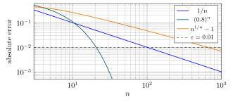
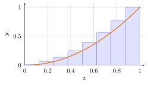
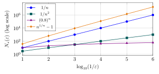

# 第 2 讲　$\varepsilon$-$N$:把“越来越接近”说清楚 (The $\varepsilon$-$N$ language; Stolz's theorem)

第 1 讲的牛顿迭代 (Newton’s iteration) 给出了一串近似值。本讲用误差 (error) 描述它们的趋近：指定精度后，找出一个下标，使其后的每一项都满足要求。

先明说本学期前半段的**朴素 $\mathbb{R}$ 约定**：实数 (real number) 暂时理解为 带无限小数展开的数，有限小数在后面补零。我们沿用它们的四则运算和大小比较。 第 14 讲才从有理数 (rational number) 出发给出精确定义。

> [!WARNING] 欠条 (IOU) — \#1：实数是什么；第 14 讲还
>
>
> 目前使用的小数模型尚未构造。实数运算的合法性、任意正数都有正的 $n$ 次根 (positive $n$th root)，以及自然数能超过任意给定实数，都记在这张欠条上。 本讲不会用“某列有界，所以它一定有极限”来替代证明。
>

这一周的问题是：*同样要求误差小于 $0.01$，为什么有的数列需要几十步， 有的需要几百步？* 数列 (sequence) 的收敛速度 (rate of convergence) 将以一张 $N(\varepsilon)$ 表出现。最后，我们用同一种误差控制处理项数不断增加的和，走到 Stolz 定理。

## 1 误差要求与下标门槛 ($\varepsilon$-$N$ and thresholds)

日常说“对到 $k$ 位小数”，本讲把它落实为**绝对误差 (absolute error)** $|a_n-L|<10^{-k}$。这并不保证显示出来的前 $k$ 位数字完全相同： 跨过进位边界时，字符串会改变。真正稳定、可以运算的是两数的距离 (distance)。

> [!WARNING] 先猜一猜 (Guess first)
>
>
> 先不计算。对于 $a_n=\sqrt[n]{n}$，要使*此后所有项*与 $1$ 的距离小于 $0.01$，你会猜门槛在几十、几百，还是几千？再猜 $1/n$ 与 $(0.8)^n$ 的门槛。 写下自己的数量级判断，再翻到表格。
>

把 $10^{-k}$ 换成任意正精度 $\varepsilon$，得到本讲的核心语言。 只检查小数精度已经足够：给定 $\varepsilon>0$，总能选 $k$ 使 $10^{-k}<\varepsilon$； 反过来，任意精度的承诺当然包括这些小数精度。这一步仍在欠条 \#1 的朴素数系中进行。

> [!IMPORTANT] 定义 2.1 — 数列极限 (Limit of a sequence)
>
>
> 设 $a_n\in\mathbb{R}$，$n=1,2,\ldots$。称 $a_n$ 收敛 (converges) 到极限 (limit) $L\in\mathbb{R}$， 记作 $a_n\to L$ 或 $\lim_{n\to\infty}a_n=L$，当且仅当
> $$
> \text{对每个 }\varepsilon>0,\quad
>  \text{存在非负整数 }N,\quad
>  \text{对每个整数 }n>N,\quad |a_n-L|<\varepsilon.
> $$
> 存在这样的实数 $L$ 时，称此列收敛 (convergent)；不存在时，称此列发散 (divergent)。
>

读这段话时，顺序是 $\varepsilon\longrightarrow N\longrightarrow n$。 $N$ 可以依赖 $\varepsilon$、数列和目标 $L$，但不能看见某一个 $n$ 后才重新选择。 “对充分大的 $n$”说的就是存在这样的统一门槛。 *the tail of the sequence* 指越过某一门槛后的全部项。

本讲一律用 $n>N$。把它写成 $n\ge N$ 不改变收敛的含义，却会改变整数表中的门槛。 若已证明所有 $n\ge N$ 都满足要求，当然也就证明了所有 $n>N$ 都满足； 反过来，把门槛加 $1$ 可从后一种写法得到前一种。它们描述同一收敛概念， 但最小门槛的数值可能相差 $1$，因此下面的门槛表统一采用 $n>N$。

一般证明只需找一个有效 $N$；做速度比较时，我们才特别要求**最小门槛** (least threshold)，记为 $N_*(\varepsilon)$。以下表格的目标极限分别为 $0,0,1$。

> [!NOTE] 词语提示
>
>
> *monotonicity*：单调性；*threshold*：门槛；*rounded*：四舍五入后的；*least*：最小的；*index*：下标；*tail*：从某项开始的尾段。
>

> [!NOTE] Example 2.2 — The last bad index
>
>
> For $a_n=1/n$ and $\varepsilon=0.01$, the term at $n=100$ fails the strict test: $1/100=0.01$. Every term with $n>100$ passes. Thus $N_*(0.01)=100$. In general, $N_*(\varepsilon)=\lfloor1/\varepsilon\rfloor$, where $\lfloor x\rfloor$ is the greatest integer not exceeding $x$.
>
> For $b_n=(0.8)^n$, direct computation gives
> $$
> b_{20}\approx0.011529215046,\qquad b_{21}\approx0.009223372037.
> $$
> The terms decrease, so $N_*(0.01)=20$.
>
> For $c_n=n^{1/n}$, use the error $c_n-1$:
>
> |    $n$ | $c_n-1$ (rounded) | Strict test against $0.01$ |
> |---------:|--------------------:|:-----------------------------|
> |  $100$ |  $0.047128548051$ | fails                        |
> |  $650$ |  $0.010014384535$ | fails                        |
> |  $651$ |  $0.010001309831$ | fails                        |
> |  $652$ |  $0.009988271746$ | passes                       |
> | $1000$ |  $0.006931668852$ | passes                       |
>
> The least threshold is $651$: the first permanently acceptable term is number $652$. The monotonicity check later in the AI Lab certifies the entire tail. Notice that $c_1=1$. Searching for the *first* acceptable term would return a useless answer.
>

这个例子把定义中最容易漏掉的词凸显出来：*每个* $n>N$。 检查几项只是找到线索；证明必须为没有算到的项负责。 下图把误差画在同一坐标系中。曲线用于呈现趋势，实际对象是整数位置上的数列值。

图中请看各条曲线穿过水平虚线的位置；相同的纵向精度，要求的横向工作量差别很大。 几何数列 (geometric sequence) 的曲线很快离开图的下边界，并非停止收敛。

> [!NOTE] 词语提示
>
>
> *tolerance*：允许的误差。
>

> [!IMPORTANT] Exercise 2.3 — Digits versus distance
>
>
> Compute the distance between $1.229999$ and $1.230001$. Truncating to two decimal places gives $1.22$ and $1.23$, respectively. Explain why an error tolerance is more useful than a requirement that printed digits agree. Then decide whether changing the first $100$ terms of a convergent sequence can change its limit; give an explicit new threshold.
>

有限个初始项不影响收敛，但在证明整个数列有界时仍须计入。

## 2 从误差到运算法则 (Error estimates and limit laws)

算出最小门槛通常比证明收敛难得多。工作方法是**适当放大法** (bounding by a simpler expression)：先用一个简单表达式从上方控制误差，再让它小于 $\varepsilon$。 “适当”的意思是：放大后的东西仍然趋向零。把误差一律放大成常数，通常无法完成任务。

> [!WARNING] 先猜一猜 (Guess first)
>
>
> 看 $r_n=(3n^2+2n)/(2n^2+5)$。只看最高次项，你猜它趋近哪里？ 它会一直从同一侧靠近吗？如果只要求证明收敛，是否值得解出最小 $N$？
>

先做一个可以看见误差的计算。分子分母同时变大时，直接说“代入无穷”没有数值意义。

> [!NOTE] 词语提示
>
>
> *numerator*：分子；*exact*：精确的。
>

> [!NOTE] Example 2.4 — Spend algebra to save estimation
>
>
> The leading coefficients suggest $L=3/2$. Here are some values:
> $$
> r_4\approx1.513514,\qquad r_{10}\approx1.560976,\qquad r_{100}\approx1.509623.
> $$
> The error need not decrease from the start. Subtract the proposed limit exactly:
> $$
> r_n-\frac32=\frac{4n-15}{4n^2+10}.
> $$
> For $n\ge4$ the numerator is positive, and
> $$
> 0<r_n-\frac32<\frac{4n}{4n^2}=\frac1n.
> $$
> Given $\varepsilon>0$, choose an integer $N\ge\max\{3,1/\varepsilon\}$. Then every $n>N$ satisfies $|r_n-3/2|<1/n<\varepsilon$. This proves $r_n\to3/2$ without solving the exact threshold problem.
>

上面的计算既找到了候选值，也解释了为什么它可信。下面两个结论使“极限”成为 有意义 (well-defined) 的对象，并给运算法则准备一个大小有统一上界的因子。

> [!IMPORTANT] 定义 2.5 — 有界数列 (Bounded sequence)
>
>
> 若存在 $M>0$，使每个 $n\ge1$ 都满足 $|a_n|\le M$，称数列有界 (bounded)。
>

> [!NOTE] 定理 2.6 — 唯一性与有界性 (Uniqueness and boundedness)
>
>
> 收敛数列 (convergent sequence) 的极限 (limit) 唯一；每个收敛数列都有界 (bounded)。
>

> [!NOTE] 证明
>
>
> 先证唯一性。若 $a_n\to L$ 且 $a_n\to K$，其中 $L\ne K$，取 $\varepsilon=|L-K|/3>0$。两个精度承诺分别给出 $N_1,N_2$。对 $n>\max\{N_1,N_2\}$，由三角不等式 (triangle inequality)，
> $$
> |L-K|\le |L-a_n|+|a_n-K|<\frac23|L-K|,
> $$
> 矛盾。
>
> 再证有界性。用一次精度 $\varepsilon=1$，得到整数 $N\ge1$，使 $n>N$ 时 $|a_n|\le|L|+|a_n-L|<|L|+1$。令
> $$
> M=\max\{|a_1|,\ldots,|a_N|,|L|+1\}.
> $$
> 这是有限个实数的最大值，逐个比较就能选出，不需要实数存在性的新原理。 前 $N$ 项和其后的项都满足 $|a_n|\le M$。
>

要由两个近似值计算和或积，需要知道输入误差会怎样影响结果。加法可直接用三角不等式； 乘法中还会出现输入本身的大小，因此先用刚证明的有界性控制它。

> [!NOTE] 词语提示
>
>
> *error budget*：允许分配的误差；*requested*：要求的；*inputs*：输入值；*bound*：界；估计。
>

> [!NOTE] Example 2.7 — An error budget for a product
>
>
> Suppose $|u_n-1.5|<\delta$ and $|v_n-2|<\delta$. If $\delta\le1$, then $|u_n|<2.5$, and
> $$
> |u_nv_n-3|
>  \le |u_n|\,|v_n-2|+2|u_n-1.5|<4.5\delta.
> $$
> For a requested product error $0.01$, it is enough to request $\delta=0.01/4.5=1/450$ from both inputs. The important choice is to bound $u_n$ first; replacing it by its limit inside an inequality would not be justified.
>

这就是乘法证明所需的全部结构。实际输入可以是上一例的 $r_n$ 和 $2+1/n$； 为了同时满足两个精度承诺，只需取两个门槛的最大值。

> [!NOTE] 定理 2.8 — 极限的运算法则 (Limit laws)
>
>
> 若实数列 $a_n,b_n$ 分别收敛 (converge) 到极限 (limits) $A,B$，$c\in\mathbb{R}$ 为常数，则
> $$
> a_n+b_n\to A+B,\quad a_nb_n\to AB,\quad ca_n\to cA,\quad a_n-b_n\to A-B.
> $$
> 若另有 $B\ne0$，则 $b_n\ne0$ 对充分大的 $n$，且在这段数列上
> $$
> \frac1{b_n}\to\frac1B,\qquad \frac{a_n}{b_n}\to\frac AB.
> $$
>

> [!NOTE] 证明 — 证明（加法与乘法）
>
>
> 加法：给定 $\varepsilon>0$，分别要求 $|a_n-A|<\varepsilon/2$、$|b_n-B|<\varepsilon/2$。 取两个门槛的最大值 $N$。对 $n>N$，
> $$
> |a_n+b_n-(A+B)|\le|a_n-A|+|b_n-B|<\varepsilon.
> $$
> 乘法：由有界性，取 $M>0$，使每个 $n$ 都有 $|a_n|\le M$。 给定 $\varepsilon>0$，同时要求
> $$
> |b_n-B|<\frac{\varepsilon}{2M},\qquad
>  |a_n-A|<\frac{\varepsilon}{2(|B|+1)}.
> $$
> 取相应门槛的最大值。于是
> $$
> |a_nb_n-AB|
>  =|a_n(b_n-B)+B(a_n-A)|
>  \le M|b_n-B|+|B||a_n-A|<\varepsilon.
> $$
> 数乘、减法与倒数的证明留在末节习题；商由乘法与倒数得到。
>

对倒数使用下面的估计：当 $|b_n-B|<|B|/2$ 时， $|b_n|>|B|/2$，从而
$$
\left|\frac1{b_n}-\frac1B\right|
 \le\frac{2|b_n-B|}{|B|^2}.
$$
条件 $B\ne0$ 让分母远离零 (bounded away from zero)。若 $B=0$，这个估计失效； 即使分子也趋于零，商也可能有完全不同的行为。

后面还需要把不等式传到极限。注意，严格不等号可能在极限处变成等号： $0<1/n$ 对每个 $n$ 成立，但两边的极限都是 $0$。

> [!NOTE] 命题 2.9 — 极限保序与绝对值 (Order and absolute values)
>
>
> 若 $a_n\to A$、$b_n\to B$，且充分大的 $n$ 都满足 $a_n\le b_n$，则 $A\le B$。 此外，$|a_n|\to|A|$。
>

> [!NOTE] 证明
>
>
> 若 $A>B$，取 $\varepsilon=(A-B)/3$。充分大的 $n$ 同时满足 $a_n>A-\varepsilon>B+\varepsilon>b_n$，与 $a_n\le b_n$ 矛盾。 三角不等式给出 $|a_n|\le|a_n-A|+|A|$；交换 $a_n,A$ 再用一次，得到 $\bigl||a_n|-|A|\bigr|\le|a_n-A|$，于是 $|a_n|\to|A|$。
>

特别地，若收敛数列的所有项都在闭区间 $[u,v]$ 内，其极限仍在 $[u,v]$ 内。

夹逼定理 (Squeeze Theorem) 把适当放大法变成一个通用工具。我们先看一个 *项数也在变*的例子，防止误用“有限次加法”。

> [!NOTE] 词语提示
>
>
> *interchanging*：交换次序；*denominator*：分母；*error bound*：误差上界；*growing*：不断增加的；*summand*：求和式中的一项。
>

> [!NOTE] Example 2.10 — A growing number of small terms
>
>
> Let
> $$
> T_n=\sum_{k=1}^{n}\frac1{\sqrt{n^2+3k}}.
> $$
> Each summand is about $1/n$, and there are $n$ of them. Guess $T_n\to1$, not zero. Direct sums give $T_{10}\approx0.928396$, $T_{100}\approx0.992537$, and $T_{1000}\approx0.999250$.
>
> Bound *every* denominator between $n$ and $\sqrt{n^2+3n}$:
> $$
> \frac1{\sqrt{1+3/n}}\le T_n\le1.
> $$
> Writing $s=\sqrt{1+3/n}\ge1$ gives the explicit error bound
> $$
> 0\le1-T_n\le1-\frac1s
>  =\frac{3/n}{s(s+1)}\le\frac{3}{2n}.
> $$
> Thus any integer $N\ge3/(2\varepsilon)$ works. No theorem about interchanging a limit with a growing sum has been used.
>

这里每一项虽小，项数却在增加；把“每项趋零”直接写成“总和趋零”会丢掉数量级。

> [!NOTE] 定理 2.11 — 夹逼定理 (Squeeze Theorem)
>
>
> 若 $u_n\le a_n\le v_n$ 对充分大的 $n$，且 $u_n,v_n$ 都收敛 (converge) 到同一极限 (limit) $L$，则 $a_n\to L$。
>

> [!NOTE] 证明
>
>
> 给定 $\varepsilon>0$，选 $N$ 同时越过不等式成立的门槛以及 $u_n,v_n$ 对精度 $\varepsilon$ 的门槛。对每个 $n>N$，有 $L-\varepsilon<u_n\le a_n\le v_n<L+\varepsilon$，即 $|a_n-L|<\varepsilon$。
>

## 3 四种标准极限 (Four standard limits)

下面四种极限是一套可随时用来估计 的标尺。证明不预先假定数列收敛， 而是直接给误差找一个会变小的上界 (upper bound)。 这里的几何式、根式和阶乘 (factorial) 很不相像，误差控制的动作却相通。

> [!WARNING] 先猜一猜 (Guess first)
>
>
> 固定 $a=4$。你猜 $4^n/n!$ 会一直增大吗？先猜转折位置。 再比较 $7^{1/n}$ 与 $n^{1/n}$：它们都似乎接近 $1$，哪个可能需要更大的 $N$？ 把“底数固定”和“底数随 $n$ 变化”的区别说出来。
>

### 3.1 几何衰减 (Geometric decay)

前面的 $(0.8)^n$ 已经给出数值经验。现在我们需要对所有 $|q|<1$ 的统一论证， 包括符号交替的情形。

> [!NOTE] 命题 2.12 — 几何数列的极限 (Geometric limit)
>
>
> 若 $q\in\mathbb{R}$ 且 $|q|<1$，则数列 $q^n$ 收敛 (converges) 到极限 (limit) $0$。
>

> [!NOTE] 证明
>
>
> $q=0$ 时显然成立。否则写 $|q|=1/(1+h)$，其中 $h>0$。 二项式定理 (binomial theorem) 给出 $(1+h)^n\ge1+nh$，因此
> $$
> |q^n|\le\frac1{1+nh}<\frac1{nh}.
> $$
> 给定 $\varepsilon>0$，取整数 $N\ge1/(h\varepsilon)$。则 $n>N$ 时 $|q^n|<\varepsilon$。
>

> [!NOTE] 词语提示
>
>
> *valid*：有效的。
>

> [!NOTE] Example 2.13 — A valid bound can be wasteful
>
>
> For $q=0.8$, we have $h=1/4$, so the proof gives $|q^n|<4/n$. For $\varepsilon=0.01$, this supplies $N=400$, although the least threshold is $20$. The proof is correct; it simply throws away most of the binomial expansion. For $q=-0.8$, the values alternate in sign, but the absolute errors and the thresholds are exactly the same.
>

有效的门槛与 最优的门槛不是同一个要求。先获得一个可证明的保证，再研究怎样改进它。

### 3.2 Roots with increasing indices

$n^{1/n}$ 在 $n=100$ 时仍比 $1$ 大约 $0.0471$，比第一眼猜的慢。 我们要证明它真的趋向 $1$，又不能把待证结论偷偷放进对数运算法则。

> [!WARNING] 欠条 (IOU) — \#1 的本次使用；第 14 讲还
>
>
> 以下把 $n^{1/n}$、$a^{1/n}$ 当作已存在且唯一的正实根。 根的存在性属于实数构造的欠条；以下*根随指数变化的极限*则现在直接证明。
>

> [!NOTE] 命题 2.14 — 底数也增长的根极限 (The limit of $n^{1/n}$)
>
>
> 数列 $n^{1/n}$ 收敛 (converges) 到极限 (limit) $1$。 更具体地，$n\ge2$ 时
> $$
> 0\le n^{1/n}-1\le\sqrt{\frac2{n-1}}.
> $$
>

> [!NOTE] 证明
>
>
> 记 $t_n=n^{1/n}-1\ge0$。二项式展开中所有项非负，保留二次项便有
> $$
> n=(1+t_n)^n\ge\binom n2t_n^2=\frac{n(n-1)}2t_n^2.
> $$
> 除以 $n$ 后得到所述上界。给定 $\varepsilon>0$，取整数 $N\ge1+2/\varepsilon^2$。若 $n>N$，则 $n-1>2/\varepsilon^2$，因而 $0\le t_n<\varepsilon$。 这直接验证定义，并未先假设 $t_n$ 有极限。
>

> [!NOTE] 词语提示
>
>
> *certificate*：可核验的误差保证；*quadratic*：二次的；*finite*：有限的；*linear*：线性的。
>

> [!NOTE] Example 2.15 — Certifying a slow-looking limit
>
>
> At $\varepsilon=0.01$, the binomial proof supplies $N=20001$. The least threshold computed earlier was $651$. Both statements answer useful questions: $651$ measures the actual waiting time; $20001$ is an easy certificate that the wait is finite.
>
> Keeping only the linear term would give $n\ge1+nt_n$, hence $t_n\le1-1/n$. That bound does not approach zero. The quadratic term is the first retained term that proves the desired limit.
>

这次“放大”的选择直接决定成败。太粗的上界只能告诉我们误差有限，不能告诉我们误差消失。

底数固定时，一次项已经够用了。先让数字显示区别。

> [!NOTE] 词语提示
>
>
> *estimate*：估计。
>

> [!NOTE] Example 2.16 — A fixed base above and below one
>
>
> |    $n$ |     $7^{1/n}$ | $(1/7)^{1/n}$ |
> |---------:|----------------:|----------------:|
> |   $10$ | $1.214814044$ | $0.823171254$ |
> |  $100$ | $1.019649664$ | $0.980729005$ |
> | $1000$ | $1.001947805$ | $0.998055982$ |
>
> The two columns approach the same target from opposite sides. The estimate below gives $0\le7^{1/n}-1\le6/n$. The estimate is deliberately simple; the table shows its room for improvement.
>

互为倒数会把 $1$ 的上侧变成下侧，但不会改变这里的目标值。

> [!NOTE] 命题 2.17 — 固定正底数的根极限 (Fixed-base root limit)
>
>
> 对每个固定实数 $a>0$，数列 $a^{1/n}$ 收敛 (converges) 到极限 (limit) $1$。
>

> [!NOTE] 证明
>
>
> $a\ge1$ 时，令 $s_n=a^{1/n}-1\ge0$。由 $a=(1+s_n)^n\ge1+ns_n$ 得 $0\le s_n\le(a-1)/n$。 给定 $\varepsilon>0$，任取整数 $N\ge(a-1)/\varepsilon$，即可保证 $n>N$ 时误差小于 $\varepsilon$ （$a=1$ 时误差恒为零）。
>
> $0<a<1$ 时，令 $b=1/a>1$，$u_n=b^{1/n}\ge1$。 因 $a^{1/n}=1/u_n$，
> $$
> 0\le1-a^{1/n}=\frac{u_n-1}{u_n}\le u_n-1\le\frac{b-1}{n}.
> $$
> 取整数 $N\ge(b-1)/\varepsilon$ 即完成证明。
>

### 3.3 Factorial versus exponential

指数式可能先占优势。若只算开头几项，甚至会猜错最终方向。 比较相邻项的比值 (ratio) 可以告诉我们从哪里开始出现可控的衰减。

> [!NOTE] 词语提示
>
>
> *factor*：因子；*ratio*：比值。
>

> [!NOTE] Example 2.18 — The early rise does not decide the tail
>
>
> For $u_n=4^n/n!$, computation gives
>
> |  $n$ |                      $u_n$ |
> |-------:|-----------------------------:|
> |  $3$ |             $10.666666667$ |
> |  $4$ |             $10.666666667$ |
> |  $8$ |              $1.625396825$ |
> | $12$ |              $0.035025386$ |
> | $20$ | $4.519342021\times10^{-7}$ |
>
> Indeed, $u_{n+1}/u_n=4/(n+1)$. The terms rise up to $n=3$, tie at $n=4$, and then fall. For every $n\ge8$, the next-to-current ratio is at most $1/2$, so
> $$
> u_n\le\frac{4^8}{8!}\,2^{-(n-8)}\qquad(n\ge8).
> $$
> A finite early rise can be absorbed into the fixed factor $4^8/8!$.
>

下面的证明把这个数值实验中的 $4$ 换成任意固定参数。注意“固定”不可删去。

> [!NOTE] 命题 2.19 — 阶乘极限 (Factorial limit)
>
>
> 对每个固定 $a\in\mathbb{R}$，数列 $a^n/n!$ 收敛 (converges) 到极限 (limit) $0$。
>

> [!NOTE] 证明
>
>
> 若 $a=0$，结论直接成立。否则取整数 $m\ge\max\{1,2|a|\}$，记 $C=|a|^m/m!>0$。对 $n\ge m$，逐次使用 $|a|/(n+1)\le1/2$，得到
> $$
> \frac{|a|^n}{n!}\le C\left(\frac12\right)^{n-m}.
> $$
> 给定 $\varepsilon>0$，几何极限给出整数 $K$，使 $k>K$ 时 $2^{-k}<\varepsilon/C$。 取 $N=m+K$。则 $n>N$ 时 $|a^n/n!|<\varepsilon$，证毕。
>

## 4 怎样证明确实不收敛 (How convergence fails)

“没有看出极限”不是发散的证明。我们要找一种固定精度，让任意候选目标都无法作出 永久达标的承诺。有限次试算永远可能漏掉后来的一次反弹。

> [!WARNING] 先猜一猜 (Guess first)
>
>
> 在 $(-1)^n$ 与 $(-1)^n/n$ 中，哪一个发散？ 不要只用“来回摆动”作理由。若图像的摆幅在缩小，摆动本身能否阻止收敛？
>

> [!NOTE] 命题 2.20 — 否定精度承诺 (Negating the $\varepsilon$-$N$ condition)
>
>
> 对固定的候选极限 (candidate limit) $L$，数列 $a_n$ 不收敛 (does not converge) 到 $L$， 当且仅当 存在 $\varepsilon_0>0$，使得*每个*非负整数 $N$ 后面都有某个 $n>N$ 满足 $|a_n-L|\ge\varepsilon_0$。 数列发散 (divergent) 的完整表述是
> $$
> \text{对每个 }L\in\mathbb{R},\quad\text{存在 }\varepsilon_0>0,\quad
>  \text{对每个 }N,\quad\text{存在 }n>N:\quad |a_n-L|\ge\varepsilon_0.
> $$
>

这只是逐字否定定义中的承诺：总有一种精度做不到，而非所有精度都做不到。 一般来说 $\varepsilon_0$ 可以依赖 $L$。证明“不趋于某个 $L$”与证明“发散”之间， 还差着排除*所有*候选目标这一步。

> [!NOTE] 词语提示
>
>
> *oscillation*：振荡；*parity*：奇偶性。
>

> [!NOTE] Example 2.21 — Persistent oscillation versus shrinking oscillation
>
>
> For $a_n=(-1)^n$, let $L$ be any real number. The triangle inequality gives
> $$
> 2=|1-(-1)|\le|1-L|+|-1-L|.
> $$
> At least one of the two distances is at least $1$. Choose that sign. Beyond every $N$ there is an index of its parity, so the test fails with $\varepsilon_0=1$. This excludes every $L$ and proves divergence.
>
> For $b_n=(-1)^n/n$, however, $|b_n|=1/n$. Any integer $N\ge1/\varepsilon$ works. The signs never settle, but the sequence converges to zero. For example, $b_{100}=0.01$ and $b_{101}=-1/101\approx-0.009900990$.
>

幅度而非符号决定了这两个例子的区别。同理，有界只是收敛的必要条件 (necessary condition)：$(-1)^n$ 有界，却不收敛。

> [!IMPORTANT] 定义 2.22 — 趋于正无穷 (Tending to positive infinity)
>
>
> 记 $b_n\to+\infty$，当且仅当 对每个 $H>0$，存在 $N$，使 $n>N$ 时 $b_n>H$。 这里 $+\infty$ 不是实数极限 (real limit)；这样的数列按本讲定义仍是发散 (divergent) 的。
>

比如 $b_n=n$ 取整数 $N\ge H$ 即可。仅仅“无界 (unbounded)”还不够： $(-1)^n n$ 虽然绝对值越来越大，却不会永久超过任意正门槛。 这个区别会出现在 Stolz 定理的分母假设中。

## 5 Stolz’s theorem

前面的 $T_n=\sum_{k=1}^n1/\sqrt{n^2+3k}$ 项数随 $n$ 增加， 是靠每项的统一上下界控制总和。下面的算术平均也有越来越多项，但最初几项 与后面的项差别很大；我们将把有限的开头单独留下，用增量控制后面累积的部分。

极限四则运算处理的是*固定个数*的收敛数列。现在分子可能是一长串和， 分母也可能趋于正无穷；直接写“$\infty/\infty$”没有决定答案。 Stolz 定理让我们看相邻项的增量 (increment)，把一个大比值拆成许多小比值。

> [!WARNING] 先猜一猜 (Guess first)
>
>
> 若每一天新增的费用与新增的产量之比都接近 $L$，累计费用与累计产量之比也会接近 $L$ 吗？ 开头一笔很大的费用会怎样？累计产量若只趋近一个有限数，这笔费用还能被冲淡吗？
>

先做算术平均 (arithmetic mean) 的实验。即使每个新输入已经很准，开头的偏差仍会 留在平均值中；它们被除以一个越来越大的总量。

> [!NOTE] 词语提示
>
>
> *increment*：增量；*predict*：预测。
>

> [!NOTE] Example 2.23 — Averages remember the beginning
>
>
> Take $x_k=2+3/k$ and let $A_n=(x_1+\cdots+x_n)/n$. Before computing, predict whether $A_n$ lies above or below $x_n$. Every earlier input is at least $x_n$, so $A_n\ge x_n>2$.
>
> |    $n$ |   $x_n$ |         $A_n$ |
> |---------:|----------:|----------------:|
> |   $10$ |   $2.3$ | $2.878690476$ |
> |  $100$ |  $2.03$ | $2.155621326$ |
> | $1000$ | $2.003$ | $2.022456413$ |
>
> The average moves toward $2$ more slowly than the newest input does. Write $s_n=x_1+\cdots+x_n$ and $b_n=n$. Then
> $$
> \frac{s_{n+1}-s_n}{b_{n+1}-b_n}=x_{n+1}\longrightarrow2.
> $$
> The increment ratio is far easier to understand than the cumulative ratio $s_n/b_n$.
>

累积比值可以看成增量比值的加权平均 (weighted average)，外加一段固定的历史。 权重必须为正，总权重必须越来越大。下面的假设恰好表达这两点。

> [!NOTE] 定理 2.24 — Stolz 定理 (Stolz's Theorem, $\infty/\infty$ form)
>
>
> 设 $a_n,b_n$ 为实数列，$b_{n+1}>b_n$（严格递增，strictly increasing）， 且 $b_n\to+\infty$。若存在实数 $L$，使增量比值 (increment ratio)
> $$
> d_n=\frac{a_{n+1}-a_n}{b_{n+1}-b_n}\longrightarrow L,
> $$
> 则 $a_n/b_n$ 在分母非零的后段收敛 (converges) 到极限 (limit) $L$。
>

名字中的 $\infty/\infty$ 描述常见用途，*不要求*另行假设 $a_n\to+\infty$。 也不要求 $a_n$ 单调 (monotone)。分母只从某项起严格递增也够用，删去之前的有限段即可。 本讲只处理有限的 $L$。

> [!NOTE] 证明
>
>
> 给定 $\varepsilon>0$。先选整数 $m$，使 $b_m>0$，且每个 $k\ge m$ 都满足 $|d_k-L|<\varepsilon/2$。这是由 $b_n\to+\infty$ 与 $d_n\to L$ 同时保证的。 **从现在开始固定 $m$，不再让它随 $n$ 移动。**
>
> 由于 $b_{k+1}-b_k>0$，对 $n>m$ 有
> $$
> \begin{aligned}
>  |(a_n-a_m)-L(b_n-b_m)|
>  &=\left|\sum_{k=m}^{n-1}(d_k-L)(b_{k+1}-b_k)\right|\\
>  &\le\sum_{k=m}^{n-1}|d_k-L|(b_{k+1}-b_k)\\
>  &<\frac{\varepsilon}{2}\sum_{k=m}^{n-1}(b_{k+1}-b_k)
>  =\frac{\varepsilon}{2}(b_n-b_m).
> \end{aligned}
> $$
> 这里相邻增量累加，中间项相消。把固定的开头加回来，再除以 $b_n>0$：
> $$
> \left|\frac{a_n}{b_n}-L\right|
>  \le\frac{|a_m-Lb_m|}{b_n}
>    +\frac{|(a_n-a_m)-L(b_n-b_m)|}{b_n}
>  <\frac{C}{b_n}+\frac{\varepsilon}{2},
>  \qquad C=|a_m-Lb_m|.
> $$
> 因为 $m$ 已固定，$C$ 是常数。由 $b_n\to+\infty$，再选 $N\ge m$， 使每个 $n>N$ 都有 $b_n>2C/\varepsilon$。当 $C=0$ 时第一项本来就是零。 于是对每个 $n>N$，$|a_n/b_n-L|<\varepsilon$，证明完成。
>

这是本讲适当放大法的集中展示：许多不同误差统一放大到 $\varepsilon/2$， 正权重累加后由总分母抵消，开头那一段则成为 $C/b_n$。 如果把 $m$ 随 $n$ 一起移动，$C$ 就不再是常数，这个证明会失去支点。

> [!NOTE] 推论 2.25 — Cauchy 命题／Cesàro 平均 (Cesàro mean theorem)
>
>
> 若实数列 $x_n$ 收敛 (converges) 到极限 (limit) $L$，则它的算术平均 (arithmetic means) 也收敛到 $L$：
> $$
> \frac{x_1+\cdots+x_n}{n}\longrightarrow L.
> $$
>

> [!NOTE] 证明
>
>
> 取 $a_n=x_1+\cdots+x_n$、$b_n=n$。分母严格递增且趋于正无穷， 增量比值等于 $x_{n+1}\to L$；Stolz 定理即给出结论。
>

平均能保留一个已经存在的极限，却不能倒过来保证原数列收敛。 前面 $(-1)^n$ 的前 $n$ 项之和，在偶数 $n$ 时为零，奇数 $n$ 时为 $-1$， 所以它的平均绝对值不超过 $1/n$，仍趋于零。

下面让新增量有不同的大小。这样可以看见分母递增假设所承担的工作。

> [!NOTE] 词语提示
>
>
> *weights*：权重。
>

> [!NOTE] Example 2.26 — Unequal weights
>
>
> Use the same inputs $x_k=2+3/k$, but assign weight $k$ to the $k$th input:
> $$
> W_n=\frac{\sum_{k=1}^n kx_k}{\sum_{k=1}^n k}.
> $$
> The increment ratio is $((n+1)x_{n+1})/(n+1)=x_{n+1}\to2$. The denominator increases and is at least $n$, so Stolz gives $W_n\to2$. Here we can also calculate exactly:
> $$
> W_n=2+\frac{3n}{n(n+1)/2}=2+\frac6{n+1}.
> $$
> Thus $W_{100}\approx2.059405941$, compared with $A_{100}\approx2.155621326$. Giving more weight to later, more accurate inputs reduces the error in this example.
>

权重的作用不是装饰。若权重变号，误差乘上权重之后的方向就不再受控； 若总权重有上限，开头的影响就未必消失。末节习题会让你亲手破坏一个假设。

## 6 幂和与面积的预告 (Power sums and an area preview)

从增量走回总量，最有代表性的例子是幂和 (power sum)。 先不找精确求和公式，先判断总和有多大。

> [!WARNING] 先猜一猜 (Guess first)
>
>
> $1^p+2^p+\cdots+n^p$ 有 $n$ 项，最大一项是 $n^p$。 所以它不超过 $n^{p+1}$。当 $p$ 是固定非负整数时，除以 $n^{p+1}$ 后， 你猜会留下一个正数吗？$p$ 越大，这个数应该越大还是越小？
>

先比较三个指数。把数值看成目标值的线索，而不是公式表。

> [!NOTE] Example 2.27 — Guessing a coefficient from normalized sums
>
>
> Let $S_{n,p}=\sum_{k=1}^n k^p/n^{p+1}$. Direct finite sums give
>
> |    $n$ |    $p=1$ |       $p=2$ |        $p=3$ |
> |---------:|-----------:|--------------:|---------------:|
> |   $10$ |   $0.55$ |     $0.385$ |     $0.3025$ |
> |  $100$ |  $0.505$ |   $0.33835$ |   $0.255025$ |
> | $1000$ | $0.5005$ | $0.3338335$ | $0.25050025$ |
>
> The likely targets are $1/2$, $1/3$, and $1/4$. For $p=2$, write $a_n=\sum_{k=1}^n k^2$ and $b_n=n^3$. Then
> $$
> \frac{a_{n+1}-a_n}{b_{n+1}-b_n}
>  =\frac{(n+1)^2}{3n^2+3n+1}
>  =\frac{(1+1/n)^2}{3+3/n+1/n^2}\longrightarrow\frac13.
> $$
> The denominator $b_n$ increases to infinity, so Stolz proves $S_{n,2}\to1/3$. No formula for the sum of squares was needed.
>

分母的差分 (finite difference) 把 $n^{p+1}$ 的次数降低一次， 这正好与分子新增加的 $(n+1)^p$ 匹配。

> [!NOTE] 命题 2.28 — 幂和的主尺度 (The leading scale of power sums)
>
>
> 对每个固定非负整数 $p$，归一化幂和 (normalized power sum) 收敛 (converges)：
> $$
> \lim_{n\to\infty}\frac{1^p+2^p+\cdots+n^p}{n^{p+1}}=\frac1{p+1}.
> $$
>

> [!NOTE] 证明
>
>
> $p=0$ 时比值恒为 $1$。设 $p\ge1$。令 $a_n=\sum_{k=1}^n k^p$， $b_n=n^{p+1}$。显然 $b_{n+1}>b_n$，且 $b_n\ge n\to+\infty$。 二项式展开给出
> $$
> \frac{a_{n+1}-a_n}{b_{n+1}-b_n}
>  =\frac{(1+1/n)^p}
>  {(p+1)+\displaystyle\sum_{j=0}^{p-1}\binom{p+1}{j}n^{j-p}}.
> $$
> 这里 $p$ 固定，分子和分母中只有固定个数的项。由 $1/n\to0$ 及极限运算法则， 分子趋于 $1$，分母趋于 $p+1\ne0$。所以增量比值趋于 $1/(p+1)$， Stolz 定理给出结论。
>

为何这个系数自然地与面积 (area) 联系起来？把式子改写为
$$
S_{n,p}=\frac1n\sum_{k=1}^n\left(\frac kn\right)^p.
$$
每个加数是一块宽 $1/n$、高 $(k/n)^p$ 的长方形面积。下图画出 $p=2$、$n=8$ 的情形。

图中请看右端点高度如何使长方形伸到曲线上方；把分割加细，这种多出的部分会变小。 **这是第 15 讲面积计算的前身。** 今天证明的是一个数列极限； 第 15 讲才定义定积分 (definite integral)，并解释这个极限何以计算曲线下面积。 这里没有先借用面积公式来证明幂和。

## 7 An AI Lab on thresholds

现在回头量化开场的速度差别。对数 (logarithm) 在这里作为计算器与绘图坐标的工具； $\log_{10}$ 表示以 $10$ 为底的对数，$\ln$ 表示自然对数 (natural logarithm)。 本讲极限的证明没有依赖对数的微分或极限运算法则。

> [!NOTE] 词语提示
>
>
> *floating-point*：浮点的；*precision*：计算精度；*geometric*：等比的；*certify*：给出严格保证；*indices*：下标；*justify*：给出理由；*slope*：斜率。
>

> [!NOTE] AI Lab — Find the last failure, then certify the tail
>
>
> For the error sequences $1/n$, $1/n^2$, $(0.8)^n$, and $n^{1/n}-1$, find the least nonnegative integer $N_*(\varepsilon)$ such that every integer $n>N_*(\varepsilon)$ passes the strict test. Use $\varepsilon=10^{-1},\ldots,10^{-6}$. Predict the ranking before asking an AI to compute.
>
> Use this workflow:
>
> 1.  State the convention $n>N$ and the strict inequality explicitly in your prompt. Ask for the last failing index and the first permanently passing index, not just a decimal root.
>
> 2.  For the first three sequences, justify that errors decrease. For the fourth, ignore the isolated success at $n=1$ and search on $n\ge3$. Double a trial upper index until it passes, then use integer binary search.
>
> 3.  Test the root error using $\ln n<n\ln(1+\varepsilon)$. In floating-point code use `log1p(eps)`, not a subtraction of two nearly equal roots. Recheck both boundary indices with higher precision.
>
> 4.  Plot $y=\log_{10}N_*(\varepsilon)$ against $x=\log_{10}(1/\varepsilon)$. Compute slopes between neighboring data points. Explain which error law would produce a straight line of slope $1$, and which would produce slope $1/2$.
>
> **Computed checkpoint.** With the columns ordered as above:
>
> | $\varepsilon$ |     $1/n$ | $1/n^2$ | $(0.8)^n$ | $n^{1/n}-1$ |
> |:---------------:|------------:|----------:|------------:|--------------:|
> |   $10^{-1}$   |      $10$ |     $3$ |      $10$ |        $38$ |
> |   $10^{-2}$   |     $100$ |    $10$ |      $20$ |       $651$ |
> |   $10^{-3}$   |    $1000$ |    $31$ |      $30$ |      $9123$ |
> |   $10^{-4}$   |   $10000$ |   $100$ |      $41$ |    $116677$ |
> |   $10^{-5}$   |  $100000$ |   $316$ |      $51$ |   $1416367$ |
> |   $10^{-6}$   | $1000000$ |  $1000$ |      $61$ |  $16626517$ |
>
> The last two neighboring slopes for the root-error column are approximately $1.084191$ and $1.069625$. They suggest a slowly changing correction to slope $1$; they do not prove an asymptotic formula.
>
> **Questions to answer from your output.** Which curve makes a tenfold improvement in accuracy most expensive? Does the geometric-error curve have a constant slope? Why is a good-looking plot, without a tail argument, insufficient to certify $N_*$? Return the table, the boundary checks, the plot, and a short explanation in your own words.
>

AI 可以替我们搜索几千万量级的整数，但“搜索之后不会再反弹”仍需要数学。 为补上这个环节，现在给出 $n^{1/n}$ 在 $n\ge3$ 严格递减 (strictly decreasing) 的初等证明。 二项式系数满足 $\binom nk/n^k\le1/k!$，而 $k\ge2$ 时 $k!\ge2^{k-1}$。 所以对 $n\ge3$，用有限等比和 (finite geometric sum)，
$$
\left(1+\frac1n\right)^n
 \le 2+\sum_{k=2}^n\frac1{k!}
 \le2+\sum_{k=2}^n\frac1{2^{k-1}}<3\le n.
$$
于是 $(n+1)^n<n^{n+1}$，取正的 $n(n+1)$ 次根便得 $(n+1)^{1/(n+1)}<n^{1/n}$。这给每个边界计算补上了整个后段的保证。

图中纵轴用对数刻度，因而等距离表示相同倍数；请看精度每提高一档，各条曲线向上移动多少。 $1/n$ 对应斜率 $1$；$1/n^2$ 的斜率接近 $1/2$，小门槛处还看得见整数取整的影响。 几何误差的门槛随精度档数近似线性增长，故在这张图上逐渐变平。

## 8 Exercises

> [!NOTE] 词语提示
>
>
> *denominator*：分母；*error bound*：误差上界；*reciprocal*：倒数；*threshold*：门槛；*tolerance*：允许的误差；*candidate*：候选值；*geometric*：等比的；*increment*：增量；*quadratic*：二次的；*estimate*：估计；*predict*：预测；*indices*：下标；*sketch*：草图；画草图；*finite*：有限的；*least*：最小的；*valid*：有效的；*ratio*：比值；*index*：下标；*even*：偶数的；*tail*：从某项开始的尾段；*odd*：奇数的。
>

1. **2.1**  $\bigstar$ **(homework)** Before computing, rank the least thresholds for $1/n$, $(0.6)^n$, and $(3+(-1)^n)/n$ at tolerance $0.02$, with target zero. Compute each threshold, then prove it controls every later term. For the last sequence, locate the last failing even and odd indices separately. Explain why its nonmonotonicity matters.

1. **2.2**  $\bigstar$ Construct two sequences that agree with $1/n$ for the first $1000$ terms, one converging to $2$ and one diverging. Sketch both beyond the shared prefix. What exactly does this say about any convergence claim based only on a finite table?

1. **2.3**  $\bigstar\bigstar$ **(homework)** Estimate $\sqrt{n^2+6n}-n$ for $n=10,100,1000$ before using a calculator. Guess its limit, then rationalize the expression. Prove an error bound of the form $C/n$, with an explicit $C$, and give a valid $N(\varepsilon)$. Compare it with the least threshold at $\varepsilon=0.01$. Use the rationalized formula to check for loss of digits in direct subtraction at large $n$.

1. **2.4**  $\bigstar\bigstar$ Take $u_n=3/2+1/n$ and $v_n=2-1/n$. Predict the limits of $u_n-v_n$, $4u_n$, and $u_n/v_n$, then check a few terms. Prove the general scalar-multiple and subtraction laws from the $\varepsilon$-$N$ definition. For general $b_n\to B\ne0$, turn $|1/b_n-1/B|\le2|b_n-B|/|B|^2$ into a complete threshold proof of the reciprocal law. Finally, keep $a_n=1/n$ and choose three different nonzero $b_n\to0$ so that $a_n/b_n$ tends to zero, tends to a nonzero number, and diverges, respectively.

1. **2.5**  $\bigstar\bigstar$ For $n^{1/n}-1$, compare the quadratic-binomial threshold with the least threshold at tolerances $10^{-1}$, $10^{-2}$, and $10^{-3}$. Predict whether keeping the cubic term should improve the power of $1/\varepsilon$ in the sufficient threshold. Derive an explicit bound from $n\ge\binom n3(n^{1/n}-1)^3$ for $n\ge3$; remove the product in the denominator by bounding $n-1$ and $n-2$ for $n\ge4$. Compare the resulting guarantee numerically.

1. **2.6**  $\bigstar$ For $(3/2)^n/n!$, predict where the terms begin to fall and compute through that point. Choose an integer $m$ after which each next-to-current ratio is at most $1/3$. Bound the tail by a geometric expression and produce an explicit threshold for error $10^{-6}$. Explain why choosing $m$ larger can make the ratio bound better but does not automatically give the best final threshold.

1. **2.7**  $\bigstar\bigstar$ Draw the values of $a_n=(-1)^n$, $b_n=(-1)^n/n$, and $c_n=1+(-1)^n/4$ for several indices. For each divergent sequence, exclude *every* candidate limit using the negated $\varepsilon$-$N$ condition. Then find an example where disproving convergence to zero still leaves a different limit possible.

1. **2.8**  $\bigstar\bigstar$ **(homework)** For $x_n=5+(-1)^n$, predict the limit of its arithmetic means and compute them at one even and one odd index. Prove your prediction without assuming that $x_n$ converges. Compare with $x_n=5+1/n$, whose means are covered by the Cesàro theorem. Explain why the converse of that theorem fails.

1. **2.9**  $\bigstar\bigstar\bigstar$ Test the denominator hypothesis in Stolz’s theorem. Set $a_n=1$ and $b_n=3-1/n$. Compute the increment ratio and the limit of $a_n/b_n$. Identify precisely which hypothesis fails. Then take $a_n=(-1)^n$ and $b_n=n$: the quotient converges, but does the increment ratio? Use both examples to distinguish a theorem from its converse and from a version with a missing hypothesis.

1. **2.10** $\bigstar\bigstar\bigstar$ Predict the limit of
    $$
    R_n=\frac{\sum_{k=1}^n(2k+1)^2}{n^3}
    $$
    by comparing the largest terms with the square-sum example. Compute $R_{10}$ and $R_{100}$, then prove the limit with Stolz. For a second prediction, rewrite $n^{-1}\sum_{k=1}^n(k/n)^3$ as a sum of rectangle areas and sketch the rectangles. Explain why increasing $p$ decreases the candidate area on $0\le x\le1$. Do not use integration formulas.

> [!NOTE] 回望 (Looking back)
>
>
> 本讲用 $\varepsilon$-$N$ 定义证明了极限的基本性质，并用 Stolz 定理处理幂和。下一讲研究另一个问题：不先指定极限值，能否由单调性和有界性保证收敛？
>
