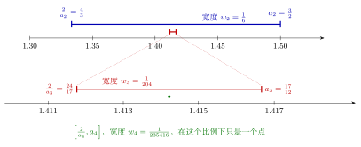
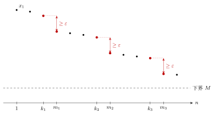

# 第 2 讲　收敛的数列与实数 (Convergent sequences and the real numbers)

第 1 讲用递推 $a_1=1$，$a_{n+1}=\frac12\left(a_n+\frac2{a_n}\right)$ 得到一列有理数；本讲中 $(a_n)$ 始终指这个数列，一般的数列写作 $(x_n)$、$(y_n)$。第 1 讲还证明了没有有理数的平方等于 $2$（定理 1.14）。第 1 讲还量过这些项的误差：第 3 节的表列出 $a_n-\sqrt2$，第 3.1 节不用 $\sqrt2$ 的小数值给出误差的上界，第 6 节问哪一项首次使误差小于 $10^{-5}$、$10^{-10}$、$10^{-20}$。本讲把这些做法写成一般的语言，并回答三个问题：

1. 在 $\sqrt2$ 已知的前提下，“数列接近 $\sqrt2$”的精确说法是什么？
2. 去掉这个前提，上面的说法里还剩下什么？
3. 要让这样的数列都有极限，需要什么样的数？

第 1、2 节回答第一个问题，第 3 节回答第二个，第 4、5 节回答第三个，第 6 节整理极限的运算规则，第 7 节检查高中学过的初等函数在实数集上是否都有依据。

需要的预备知识：第 1 讲的命题 1.4（各项 $a_n$ 都是正有理数）、第 3 节的误差表、第 3.1 节的区间估计、例 1.9、第 6 节与第 6.1 节的误差门槛、定理 1.14 和习题 1.5；绝对值的三角不等式 $|x+y|\le|x|+|y|$。

## 1 第 1 讲的误差界

> [!NOTE] 暂时的假定
>
> 第 1、2 节与第 1 讲一样，把实数当作已知的数来使用，并假定存在一个正实数，它的平方等于 $2$，记作 $\sqrt2$。第 3 节去掉这个假定，第 4 节列出实数集 $\mathbb R$ 的性质，并由这些性质证明这样的数存在。

第 1 讲第 3.1 节的做法是：当 $a_n^2>2$ 时，$\left(\frac2{a_n}\right)^2<2$，所以 $\sqrt2$ 在 $\frac2{a_n}$ 与 $a_n$ 之间，两者之差是 $a_n$ 的误差的一个上界。例 1.9 对 $a_4$ 做了这件事。这一节对所有的 $n$ 做同样的事，并估计这个上界缩小得多快。

### 1.1 每一项的误差都有上界

第 1 讲只对 $a_2,a_3,a_4$ 验证了平方大于 $2$。先证明这对后面每一项都成立。

> [!NOTE] 引理 2.1 — 下一项的平方大于 $2$
>
> 对每个 $n\ge1$，
> $$
> a_{n+1}^2-2=\left(\frac{a_n-2/a_n}{2}\right)^2>0.
> $$

> [!NOTE] 证明
>
> $a_{n+1}$ 是 $a_n$ 与 $\frac2{a_n}$ 的平均数，而这两个数的乘积是 $2$。对任意两个数 $u,v$，有 $\left(\frac{u+v}2\right)^2-uv=\left(\frac{u-v}2\right)^2$。取 $u=a_n$，$v=\frac2{a_n}$，就得到等式。若右边为 $0$，则 $a_n=\frac2{a_n}$，即 $a_n^2=2$；$a_n$ 是有理数（命题 1.4），这与定理 1.14 矛盾。所以右边大于 $0$。

于是从 $a_2$ 起，每一项的平方都大于 $2$，从而 $\frac2{a_n}<a_n$。对每个 $n\ge2$，记
$$
w_n=a_n-\frac2{a_n}=\frac{a_n^2-2}{a_n}>0.
$$
例如 $w_4=\frac{577}{408}-\frac{816}{577}=\frac1{235416}$，就是例 1.9 中的区间宽度。

> [!NOTE] 命题 2.2 — 误差的上界 (An error bound)
>
> 对每个 $n\ge2$，
> $$
> \frac2{a_n}<\sqrt2<a_n,\qquad 0<a_n-\sqrt2<w_n.
> $$

> [!NOTE] 证明
>
> 由引理 2.1，$a_n^2>2$，所以 $\left(\frac2{a_n}\right)^2=\frac4{a_n^2}<2$。三个数 $\frac2{a_n}$、$\sqrt2$、$a_n$ 都是正数，它们的平方依次为 $\frac4{a_n^2}<2<a_n^2$；正数的大小顺序与平方的大小顺序相同，故 $\frac2{a_n}<\sqrt2<a_n$。于是 $0<a_n-\sqrt2<a_n-\frac2{a_n}=w_n$。

$w_n$ 是有理数，可以直接算出；$a_n-\sqrt2$ 则要先知道 $\sqrt2$ 的小数值。命题 2.2 用前者控制后者。

### 1.2 上界缩小得多快

要让命题 2.2 有用，还得知道 $w_n$ 能变得多小。引理 2.1 的右边正是 $\left(\frac{w_n}2\right)^2$，所以
$$
w_{n+1}=\frac{a_{n+1}^2-2}{a_{n+1}}=\frac{w_n^2}{4a_{n+1}}<\frac{w_n^2}4\qquad(n\ge2).
$$
这里用到 $a_{n+1}>1$：因为 $a_{n+1}>0$ 且 $a_{n+1}^2>2>1$。由 $w_2=\frac16<1$ 出发，每个 $w_n$ 都在 $0$ 与 $1$ 之间，所以 $w_n^2<w_n$，从而 $w_{n+1}<\frac{w_n}4$。逐次使用，得到
$$
w_n\le\frac16\cdot\frac1{4^{\,n-2}}\qquad(n\ge2).
$$
比较实际的 $w_n$ 与这个上界：
$$
\begin{array}{c|cccc}
n&2&3&4&5\\\hline
w_n&\dfrac16&\dfrac1{204}&\dfrac1{235416}&\dfrac1{313506783024}\approx3.2\times10^{-12}\\[2mm]
\dfrac16\cdot\dfrac1{4^{\,n-2}}&\dfrac16&\dfrac1{24}&\dfrac1{96}&\dfrac1{384}
\end{array}
$$
实际的 $w_n$ 比第二行小得多。第二行的用处在于它对所有 $n$ 都成立，而且形式简单。合起来，
$$
0<a_n-\sqrt2<\frac16\cdot\frac1{4^{\,n-2}}\qquad(n\ge2).
$$

## 2 收敛于 $A$

第 1 讲问过：哪一项首次使误差小于 $10^{-5}$，哪一项首次小于 $10^{-10}$，哪一项首次小于 $10^{-20}$；换了初值之后做法相同（第 1 讲第 6 节）。先选一个误差门槛，再记录首次达到它的项。把这个做法写成定义，只需改两处。

第一，三个具体的门槛换成任意的正数，用 $\varepsilon$ 表示。眼下 $\varepsilon$ 只取正有理数，因为接下来有一节只允许使用有理数；引入实数以后这个限制就解除，定义的含义不变（第 4.2 节）。

第二，“首次小于”换成“从某一项起一直小于”。这一处不能省略。数列 $1,0,1,0,\ldots$ 每隔一项就等于 $0$，对任何门槛都有“首次达到”的项，但不应当说它接近 $0$。

以下用 $(x_n)$ 表示数列 (sequence) $x_1,x_2,x_3,\ldots$。

> [!IMPORTANT] 定义 2.3 — 收敛于 $A$ (Convergence to $A$)
>
> 设 $(x_n)$ 是一个数列，$A$ 是一个数。若对任意正有理数 $\varepsilon$，存在正整数 $N$，使得只要 $n\ge N$，就有
> $$
> |x_n-A|<\varepsilon,
> $$
> 则称数列 $(x_n)$ **收敛于 $A$** (converges to $A$)，记作 $x_n\to A$ 或 $\lim\limits_{n\to\infty}x_n=A$；$A$ 称为它的极限 (limit)。

定义中 $\varepsilon$ 先给定，$N$ 随后选取，可以依赖于 $\varepsilon$。不等式必须对从第 $N$ 项起的每一项成立。$N$ 不要求是最小的。

> [!NOTE] 例 2.4：$a_n\to\sqrt2$
>
> 把正有理数 $\varepsilon$ 写成 $\frac pq$，其中 $p,q$ 为正整数，则 $\varepsilon\ge\frac1q$。取 $N=q+2$。当 $n\ge N$ 时，由第 1 节，
> $$
> |a_n-\sqrt2|<\frac16\cdot\frac1{4^{\,n-2}}\le\frac16\cdot\frac1{4^{\,q}}<\frac1q\le\varepsilon.
> $$
> 倒数第二步用到 $4^q>q$：$q=1$ 时成立；若 $4^q>q$，则 $4^{q+1}>4q\ge q+1$。
>
> 这里的 $N$ 只是够用，远不是最小的。对照第 1 讲的误差表：
> $$
> \begin{array}{c|ccc}
> \varepsilon&\dfrac1{100}&10^{-5}&10^{-10}\\[2mm]\hline
> \text{首次使误差小于 }\varepsilon\text{ 的项}&a_3&a_4&a_5\\
> \text{上面取的 }N=q+2&102&100002&10^{10}+2
> \end{array}
> $$
> 定义只要求存在一个 $N$。找最小的 $N$ 是另一个问题，通常难得多。

> [!NOTE] 例 2.5：$\frac1n\to0$
>
> 给定正有理数 $\varepsilon=\frac pq$，取 $N=q+1$。当 $n\ge N$ 时，
> $$
> \left|\frac1n-0\right|=\frac1n\le\frac1{q+1}<\frac1q\le\varepsilon.
> $$

> [!NOTE] 例 2.6：$c_n\to2$
>
> 第 1 讲习题 1.5 把递推改成 $c_1=1$，$c_{n+1}=\frac12\left(c_n+\frac4{c_n}\right)$，各项都是正有理数。前几项是 $c_2=\frac52$，$c_3=\frac{41}{20}$，$c_4=\frac{3281}{1640}$，与 $2$ 的差依次为 $\frac12,\ \frac1{20},\ \frac1{1640}$。由
> $$
> c_{n+1}-2=\frac{(c_n-2)^2}{2c_n}
> $$
> 可知从 $c_2$ 起每一项都大于 $2$，于是 $2c_n>4$，$c_{n+1}-2<\frac{(c_n-2)^2}4\le\frac{c_n-2}8$（归纳可知 $c_n-2\le\frac12$）。所以
> $$
> 0<c_n-2\le\frac12\cdot\frac1{8^{\,n-2}}\qquad(n\ge2).
> $$
> 与例 2.4 一样，对 $\varepsilon=\frac pq$ 取 $N=q+2$，就得到 $c_n\to2$。这里的极限是有理数，不需要第 1 节的假定。

> [!NOTE] 例 2.7：$(-1)^n$ 不收敛于任何数
>
> 假设 $(-1)^n\to A$。数列的项只取 $1$ 和 $-1$，这两个值相距 $2$；收敛于 $A$ 却要求后面的项都接近同一个 $A$。
>
> 任给正有理数 $\varepsilon$，存在 $N$，使 $n\ge N$ 时 $|(-1)^n-A|<\varepsilon$。从第 $N$ 项起既有偶数项又有奇数项，所以 $|1-A|<\varepsilon$ 且 $|-1-A|<\varepsilon$。由三角不等式，
> $$
> 2=|1-(-1)|\le|1-A|+|A-(-1)|<2\varepsilon .
> $$
> 这对每个 $\varepsilon$ 都成立。取 $\varepsilon=1$，得到 $2<2$，矛盾。取 $\varepsilon=\frac12$ 也可以；只要 $2\varepsilon\le2$。

**注。** 设 $a,b$ 是有理数。若对每个正有理数 $\varepsilon$ 都有 $|a-b|<\varepsilon$，则 $a=b$。因为若 $a\ne b$，取 $\varepsilon=|a-b|$，就得到 $|a-b|<|a-b|$。这里说的不是两个数相差很小，而是它们的距离小于每一个正数。下面多次这样用。

例 2.7 用了反证法。也可以直接使用定义的否定：要说明数列不收敛于 $A$，只需找到一个 $\varepsilon$，使得无论 $N$ 取多大，从第 $N$ 项起总有某一项不满足 $|x_n-A|<\varepsilon$。

定义 2.3 把 $A$ 称为“极限”，这要求 $A$ 由数列唯一确定。

> [!NOTE] 命题 2.8 — 极限唯一 (Uniqueness of the limit)
>
> 若 $x_n\to A$ 且 $x_n\to B$，则 $A=B$。

> [!NOTE] 证明
>
> 假设 $A\ne B$，取正有理数 $\varepsilon\le\frac{|A-B|}2$。存在 $N_1$，使 $n\ge N_1$ 时 $|x_n-A|<\varepsilon$；存在 $N_2$，使 $n\ge N_2$ 时 $|x_n-B|<\varepsilon$。取一个同时不小于 $N_1,N_2$ 的 $n$，则
> $$
> |A-B|\le|A-x_n|+|x_n-B|<2\varepsilon\le|A-B|,
> $$
> 矛盾。

当 $A,B$ 都是有理数时，可以直接取 $\varepsilon=\frac{|A-B|}2$。一般情形用到这样一件事：每个正实数都不小于某个正有理数。第 4 节的引理 2.18 证明它。

## 3 去掉 $\sqrt2$："有极限的数列" vs "收敛的数列"

第 1 讲证明了没有有理数的平方等于 $2$。如果只承认有理数，$\sqrt2$ 就不存在，例 2.4 的结论也就无从说起。这一节只用有理数，考察例 2.4 的论证里还剩下什么。我们这一节试图说明: 即使不承认"$\sqrt 2$" 存在, 我们依然可以make sense "$a_{n}$是一个收敛数列".

### 3.1 从“小数位稳定”到区间

把前几项写成小数：
$$
\begin{array}{c|l}
n&a_n\\\hline
3&1.41666666666666\cdots\\
4&1.41421568627450\cdots\\
5&1.41421356237468\cdots\\
6&1.41421356237309\cdots
\end{array}
$$
$a_3$ 与 $a_4$ 的前两位小数相同，$a_4$ 与 $a_5$ 的前五位相同，$a_5$ 与 $a_6$ 的前十一位相同。相同的位数越来越多，已经相同的那些位在后面的项里没有再变。看出这一点，不需要知道 $\sqrt2$ 的值。

这是从表里看到的现象，还不是一个数学命题。有两件事要做。第一，要把“小数位稳定”换成不依赖十进制写法的说法。第二，表里只有四项，要对后面所有的项证明这个说法。

先做第一件事。“前 $k$ 位小数不再变”的意思大致是：从某一项起，所有的项彼此相差不到 $10^{-k}$，也就是说，它们都落在一个宽度不到 $10^{-k}$ 的区间里。后一种说法更好用：两个数可以相差很小而小数位不同，例如 $0.49999$ 与 $0.50001$；而“落在同一个短区间里”没有这个问题。所以要找的是一个短区间，使得从某一项起所有的项都在其中。

再做第二件事。这样的区间在第 1 节已经出现过：去掉 $\sqrt2$ 以后，区间 $\left[\frac2{a_n},a_n\right]$ 和它的宽度 $w_n$ 都还在。下面说明后面的项都落在前面的区间里。

> [!NOTE] 命题 2.9 — 区间一个套一个 (Nested intervals)
>
> 对每个 $n\ge2$，
> $$
> \frac2{a_n}<\frac2{a_{n+1}}<a_{n+1}<a_n.
> $$

> [!NOTE] 证明
>
> $a_{n+1}$ 是 $\frac2{a_n}$ 与 $a_n$ 的平均数，而 $\frac2{a_n}<a_n$，所以 $\frac2{a_n}<a_{n+1}<a_n$。各项为正，由 $a_{n+1}<a_n$ 得 $\frac2{a_{n+1}}>\frac2{a_n}$。最后，引理 2.1 给出 $a_{n+1}^2>2$，即 $\frac2{a_{n+1}}<a_{n+1}$。

图 1：区间 $\left[\frac2{a_2},a_2\right]$ 与 $\left[\frac2{a_3},a_3\right]$；下面一行是上面一行中红色部分的放大，绿点是 $\left[\frac2{a_4},a_4\right]$。

反复使用命题 2.9：当 $m\ge n\ge2$ 时，
$$
\frac2{a_n}\le\frac2{a_m}<a_m\le a_n.
$$
从第 $n$ 项起的所有项都落在 $\left[\frac2{a_n},a_n\right]$ 中，并且都大于左端点。设 $m,k\ge n$，不妨设 $a_m\ge a_k$，则
$$
|a_m-a_k|=a_m-a_k\le a_n-a_k<a_n-\frac2{a_n}=w_n.
$$

> [!NOTE] 命题 2.10 — 任意两项的距离
>
> 对任意正有理数 $\varepsilon$，存在正整数 $N$，使得只要 $m,k\ge N$，就有 $|a_m-a_k|<\varepsilon$。

> [!NOTE] 证明
>
> 写 $\varepsilon=\frac pq$，取 $N=q+2$。与例 2.4 相同，$w_N\le\frac16\cdot\frac1{4^{\,q}}<\frac1q\le\varepsilon$。当 $m,k\ge N$ 时，$|a_m-a_k|<w_N<\varepsilon$。

命题 2.10 与例 2.4 的差别只有一处：$|a_n-\sqrt2|$ 换成了 $|a_m-a_k|$。

回到开头的表。从第 4 项起，任意两项相差小于 $w_4<5\times10^{-6}$；表中 $a_4$ 与 $a_5$ 的前五位小数相同，与此相符。从第 5 项起，任意两项相差小于 $w_5<4\times10^{-12}$；$a_5$ 与 $a_6$ 的前十一位相同。表里看到的现象，现在换成了一个对所有的项都成立的说法，其中的区间由数列自己的项算出。

### 3.2 有极限的数列也落在短区间里

第 3.1 节的结论不是 $(a_n)$ 特有的。若 $x_n\to A$，则从某一项起所有的项都落在区间 $\left(A-\frac\varepsilon2,\ A+\frac\varepsilon2\right)$ 里，它的宽度是 $\varepsilon$。

> [!NOTE] 命题 2.11 — 有极限的数列，靠后的项彼此接近
>
> 设 $x_n\to A$。则对任意正有理数 $\varepsilon$，存在正整数 $N$，使得只要 $m,k\ge N$，就有 $|x_m-x_k|<\varepsilon$。

> [!NOTE] 证明
>
> 对 $\frac\varepsilon2$ 使用定义 2.3，存在 $N$，使 $n\ge N$ 时 $|x_n-A|<\frac\varepsilon2$。当 $m,k\ge N$ 时，$|x_m-x_k|\le|x_m-A|+|A-x_k|<\varepsilon$。

例如，$(c_n)$ 从第 3 项起都落在 $\left(2,\ \frac{41}{20}\right]$ 里，任意两项相差小于 $\frac1{20}$。而 $(-1)^n$ 的相邻两项总是相差 $2$，无论从哪一项起，它的项都不可能落在一个宽度小于 $2$ 的区间里。

比较两种情形。$x_n\to A$ 时，短区间以 $A$ 为中心，要先知道 $A$ 才能写出它。对 $(a_n)$，短区间是 $\left[\frac2{a_N},a_N\right]$，不需要知道极限。两种情形共有的是这样一件事：

> 对任意 $\varepsilon$，从某一项起，所有的项都落在一个宽度小于 $\varepsilon$ 的区间里；因此其中任意两项相差小于 $\varepsilon$。

这句话里没有极限。

### 3.3 不提极限的说法

把上面这句话作为定义，用“任意两项相差小于 $\varepsilon$”来陈述，这样不必另外指定区间。

> [!IMPORTANT] 定义 2.12 — 收敛的数列
>
> 设 $(x_n)$ 是一个数列。若对任意正有理数 $\varepsilon$，存在正整数 $N$，使得只要 $m,k\ge N$，就有
> $$
> |x_m-x_k|<\varepsilon,
> $$
> 则称 $(x_n)$ 是**收敛的数列**。

> [!NOTE] 注 — 名称
>
> 这里所说的“收敛的数列”，在多数教材中称为 Cauchy 列 (Cauchy sequence)；那些教材把“收敛”一词留给有极限的数列。本讲把“有极限”与“收敛的”分开说，因为在有理数范围内两者确实不同（第 3.4 节）。到第 4 节，两者成为一回事。

由命题 2.10 和命题 2.11，$(a_n)$ 和每个有极限的数列都是收敛的数列。

### 3.4 在$\mathbb{Q}$ 中, 收敛$\not\implies$有极限

有极限的数列是收敛的数列。反过来，$(a_n)$ 是收敛的数列，有没有一个有理数 $A$ 使 $a_n\to A$？下面证明没有。证明中要用到一个事实：若各项都不超过 $b$，极限也不超过 $b$。

> [!NOTE] 引理 2.13 — 极限保持不等式 (Limits preserve inequalities)
>
> 设 $x_n\to A$。若从某一项起总有 $x_n\le b$，则 $A\le b$；若从某一项起总有 $x_n\ge b$，则 $A\ge b$。

> [!NOTE] 证明
>
> 只证第一句，第二句类似。假设 $A>b$，取正有理数 $\varepsilon\le A-b$。存在 $N$，使 $n\ge N$ 时 $|x_n-A|<\varepsilon$，从而 $x_n>A-\varepsilon\ge b$。题设说从某一项起 $x_n\le b$。取一个 $n$，既不小于 $N$，又在那一项之后，这个 $x_n$ 就同时大于 $b$ 和不超过 $b$，矛盾。

注意结论是 $\le$。各项都严格小于 $b$ 时，极限仍可能等于 $b$：$-\frac1n<0$，而 $-\frac1n\to0$。

> [!NOTE] 命题 2.14 — $(a_n)$ 在有理数中没有极限
>
> 不存在有理数 $A$，使 $a_n\to A$。

> [!NOTE] 证明
>
> 思路是：若 $a_n\to A$，则 $A$ 落在每个区间 $\left[\frac2{a_n},a_n\right]$ 里，于是 $A^2$ 与 $2$ 的差不超过任意小的正数，只能 $A^2=2$，而这不可能。
>
> 假设有理数 $A$ 满足 $a_n\to A$。先固定一个 $n\ge2$，让另一个下标 $m$ 变化：当 $m\ge n$ 时 $\frac2{a_n}<a_m\le a_n$，两端与 $m$ 无关。令 $m$ 增大，由引理 2.13，
> $$
> \frac2{a_n}\le A\le a_n.
> $$
> $n$ 是任取的，所以这对每个 $n\ge2$ 成立。三个数都是正数，平方后大小关系不变：$\left(\frac2{a_n}\right)^2\le A^2\le a_n^2$。另一方面，$\left(\frac2{a_n}\right)^2<2<a_n^2$。$A^2$ 与 $2$ 都在 $\left(\frac2{a_n}\right)^2$ 与 $a_n^2$ 之间，所以
> $$
> |A^2-2|\le a_n^2-\left(\frac2{a_n}\right)^2=\left(a_n-\frac2{a_n}\right)\left(a_n+\frac2{a_n}\right)=w_n\left(a_n+\frac2{a_n}\right)\le3w_n,
> $$
> 最后一步用到 $\frac2{a_n}<a_n\le a_2=\frac32$。
>
> 记 $d=|A^2-2|$，它与 $n$ 无关。上式说：对每个 $n\ge2$，$d\le3w_n$。若 $d>0$，由第 1 节对 $w_n$ 的估计，可以取 $n$ 使 $w_n<\frac d3$，得到 $d<d$，矛盾。所以 $d=0$，即 $A^2=2$，这又与定理 1.14 矛盾。

> [!QUESTION] 一个问题
>
> 闭区间 $\left[\frac2{a_n},a_n\right]$（$n\ge2$）一个套一个，宽度趋于 $0$。这样一串区间理应“捞到”恰好一个点：两个不同的点相隔一段固定的距离，不可能都留在宽度趋于 $0$ 的区间里；而端点 $a_n$ 若有极限 $A$，由引理 2.13，$A$ 就在每个区间里。命题 2.14 说，在有理数里它什么也没有捞到。这就是有理数集的不完备。我们将在第 6、7 讲回到这个问题。

这个证明没有使用第 1 节的假定。所以在有理数范围内，收敛的数列未必有极限：$(c_n)$ 与 $(a_n)$ 都满足定义 2.12，区别只在于有理数里有没有那个极限。

### 3.5 单调递减且有下界的数列收敛

$(a_n)$ 从第 2 项起一项比一项小（命题 2.9），并且每一项都大于 $1$。只凭这两点就能断定它是收敛的数列，不需要估计区间的宽度。这一小节证明：凡是这样的数列都是收敛的数列。

> [!IMPORTANT] 定义 2.15 — 单调与有界 (Monotone and bounded)
>
> 若 $x_{n+1}\le x_n$ 对所有 $n$ 成立，称 $(x_n)$ 单调递减 (decreasing)；若 $x_{n+1}\ge x_n$ 对所有 $n$ 成立，称它单调递增 (increasing)。两者统称单调数列 (monotone sequence)。若存在数 $M$ 使所有的 $x_n\ge M$，称 $(x_n)$ 有下界 (bounded below)，$M$ 是它的一个下界 (lower bound)；有上界 (bounded above) 与上界 (upper bound) 类似定义。既有上界又有下界的数列称为有界的 (bounded)。

> [!NOTE] 命题 2.16 — 单调有界的数列是收敛的数列
>
> 单调递减且有下界的数列是收敛的数列。单调递增且有上界的数列也是收敛的数列。

图 2：递减数列中取出的三对下标。每一对中，后一项比前一项至少小 $\varepsilon$。这样的对取得足够多，下降的总量就超过 $x_1-M$。

证明的想法是：若递减数列不是收敛的数列，就能找到许多对下标，每一对中后一项比前一项至少小 $\varepsilon$；这样的对取得足够多，数列就降到下界以下。

> [!NOTE] 证明
>
> 设 $(x_n)$ 单调递减，$M$ 是它的一个下界。假设 $(x_n)$ 不是收敛的数列。定义 2.12 说：对每个 $\varepsilon$，都有一个 $N$，使得从第 $N$ 项起任意两项相差小于 $\varepsilon$。它不成立，就是说有某一个 $\varepsilon$，对它任何 $N$ 都不合要求：无论 $N$ 取多大，从第 $N$ 项起总有两项相差不小于 $\varepsilon$。所以存在正有理数 $\varepsilon$，使得对每个 $N$，都能找到 $m>k\ge N$ 满足 $x_k-x_m\ge\varepsilon$。（由 $|x_m-x_k|\ge\varepsilon$ 知 $m\ne k$，把较大的下标记作 $m$；因为数列递减，$x_k-x_m=|x_m-x_k|$。）
>
> 取正整数 $J$，使 $J\varepsilon>x_1-M$。（对有理数这总能做到：若 $\varepsilon=\frac pq$，$x_1-M\le\frac uv$，其中 $p,q,u,v$ 为正整数，取 $J=qu+1$。）对 $N=1$ 取出 $k_1<m_1$；对 $N=m_1$ 取出 $m_1\le k_2<m_2$（取 $N=m_1$，是为了让第二对下标排在第一对之后）；这样一共取 $J$ 次，得到
> $$
> k_1<m_1\le k_2<m_2\le\cdots\le k_J<m_J,\qquad x_{k_j}-x_{m_j}\ge\varepsilon\quad(j=1,\ldots,J).
> $$
> 图 2 画出了 $J=3$ 的情形。把 $x_1-x_{m_J}$ 按这些下标分段：
> $$
> x_1-x_{m_J}=(x_1-x_{k_1})+\sum_{j=1}^{J}\left(x_{k_j}-x_{m_j}\right)+\sum_{j=1}^{J-1}\left(x_{m_j}-x_{k_{j+1}}\right).
> $$
> 因为数列递减，第一项和最后一个和式都不小于 $0$，所以
> $$
> x_1-x_{m_J}\ge\sum_{j=1}^{J}\left(x_{k_j}-x_{m_j}\right)\ge J\varepsilon>x_1-M,
> $$
> 即 $x_{m_J}<M$，与 $M$ 是下界矛盾。
>
> 若 $(x_n)$ 单调递增且有上界，则 $(-x_n)$ 单调递减且有下界，而 $|(-x_m)-(-x_k)|=|x_m-x_k|$。

$(a_n)$ 的第一项不满足递减：$a_1=1<a_2$。这不要紧。定义 2.3 和定义 2.12 只涉及从某一项起的各项，去掉数列开头的有限多项，不影响它是否收敛于 $A$，也不影响它是不是收敛的数列。对 $a_2,a_3,\ldots$ 用命题 2.16，就再一次得到：$(a_n)$ 是收敛的数列。

命题 2.16 的用处在于它不需要任何宽度估计。下面的数列递增，没有现成的区间可用。

> [!NOTE] 例 2.17：一个不知道极限的数列
>
> 设
> $$
> s_n=1+\frac1{2^2}+\frac1{3^2}+\cdots+\frac1{n^2}.
> $$
> 前几项是 $s_1=1$，$s_2=\frac54$，$s_3=\frac{49}{36}$，$s_4=\frac{205}{144}\approx1.4236$。每一项都比前一项大。当 $k\ge2$ 时，$\frac1{k^2}<\frac1{(k-1)k}=\frac1{k-1}-\frac1k$，相加后中间各项消去：
> $$
> s_n<1+\left(1-\frac12\right)+\left(\frac12-\frac13\right)+\cdots+\left(\frac1{n-1}-\frac1n\right)=2-\frac1n<2\qquad(n\ge2).
> $$
> 所以 $(s_n)$ 是单调递增且有上界的有理数列。由命题 2.16，它是收敛的数列。这里没有一个现成的数可以当作它的极限。

## 4 实数集 $\mathbb{R}$

$(a_n)$ 是收敛的数列，却没有有理数作它的极限。需要一个更大的数的范围，使每个收敛的数列都有极限。同时，新的数不应当多于需要：每个新的数都应当能用有理数逼近到任意精度。

> [!WARNING] 欠条 (IOU) — 实数集 $\mathbb R$ 存在，第 8 讲还
>
> 存在一个包含全体有理数 $\mathbb Q$ 的数域 $\mathbb R$，它的元素称为实数 (real numbers)。实数可以做加、减、乘、除（除数不为 $0$），可以比较大小；这些运算和大小关系在有理数上与原有的一致，并且满足与有理数相同的运算律和不等式规则（例如不等式两边可以加上同一个数，可以乘以同一个正数）。这些是平常的性质。新的内容是下面两条：
>
> 1. **逼近。** 对每个实数 $x$ 和每个正有理数 $\varepsilon$，存在有理数 $r$，使 $|x-r|<\varepsilon$。
> 2. **完备 (completeness)。** 每个收敛的实数列都有极限，极限是一个实数。
>
> 其中“极限”与“收敛的数列”按定义 2.3 和定义 2.12 理解，数列的项和极限可以是任意实数。

关于这张欠条，说明三点。

1. 它在第 8 讲偿还：那里从有理数出发构造 $\mathbb R$，并验证上面的每一条。
2. 从这里起，本课程的所有讨论都在承认这一条的前提下进行。本课程的欠条只有这一张；后面用到实数的地方，依据都是它，不再另有保留。
3. 下面介绍构造的想法。它不是证明。

### 4.1 构造 $\mathbb R$ 的想法

第 3 节说明，有理数缺的是收敛的有理数列的极限。所以让每个收敛的有理数列表示一个数，就像一个分数表示一个有理数。不同的数列可以表示同一个数：若两个数列的差收敛于 $0$，就规定它们表示同一个数。分数也是这样：$\frac12$ 与 $\frac24$ 是不同的写法，规定 $ps=qr$ 时 $\frac pq$ 与 $\frac rs$ 表示同一个数。有理数 $r$ 由各项都等于 $r$ 的数列表示，这样 $\mathbb Q$ 就包含在 $\mathbb R$ 里。

运算逐项进行：$(x_n)$ 与 $(y_n)$ 表示的两个数之和，由 $(x_n+y_n)$ 表示，乘积由 $(x_ny_n)$ 表示。大小这样规定：若存在正有理数 $c$，使 $(x_n)$ 从某一项起都大于 $c$，就说它表示的数是正的。

要把这个想法变成证明，需要验证三类事情：这些规定不依赖于数列的选取；运算律和不等式规则都成立；逼近与完备两条性质成立。完备性质说的是由新的数组成的数列，验证它要多做几步。这些验证的条目很多，放在第 8 讲。按这个构造，$\sqrt2$ 就是数列 $(a_n)$ 表示的那个数。

### 4.2 由欠条得到的结论

第 2、3 节里关于一般数列的结论（命题 2.8、命题 2.11、引理 2.13、命题 2.16）的证明只用到运算律、不等式规则和三角不等式，所以对实数列同样成立。有两处要补：那些证明里要取一个不超过某个正数的正有理数；命题 2.16 的证明里要取一个足够大的正整数 $J$。两处都由下面的引理得到。

> [!NOTE] 引理 2.18 — 实数与整数的比较 (Archimedean property)
>
> 每个实数都小于某个正整数。每个正实数都大于某个 $\frac1q$，其中 $q$ 是正整数。

> [!NOTE] 证明
>
> 设 $x$ 是实数。由逼近性质，取有理数 $r$ 使 $|x-r|<1$，则 $x<r+1$。有理数 $r+1$ 小于某个正整数 $n$，所以 $x<n$。设 $c$ 是正实数。对 $\frac1c$ 用刚才的结论，$\frac1c<q$，即 $c>\frac1q$。

由引理 2.18，定义 2.3 和 2.12 中的“任意正有理数 $\varepsilon$”换成“任意正实数 $\varepsilon$”，意思不变：对每个正实数 $\varepsilon$，都有正有理数 $\frac1q<\varepsilon$。从现在起，$\varepsilon$ 表示任意正实数。

> [!NOTE] 定理 2.19 — 有极限与收敛是一回事 (Cauchy criterion)
>
> 实数列 $(x_n)$ 有极限，当且仅当它是收敛的数列。

> [!NOTE] 证明
>
> “仅当”是命题 2.11，“当”是完备性质。

从现在起，“$(x_n)$ 有极限”“$(x_n)$ 是收敛的数列”“$(x_n)$ 收敛”是同一个意思。定理 2.19 的用处在于：判断一个数列是否有极限，不必先知道极限是多少。

下面两个命题说明实数与有理数列的关系。

> [!NOTE] 命题 2.20 — 每个实数都是有理数列的极限
>
> 对每个实数 $x$，存在有理数列 $(r_n)$ 使 $r_n\to x$。反过来，每个收敛的有理数列都有唯一的实数作为极限。

所以实数恰好是收敛的有理数列的极限。同一个实数可以是许多不同数列的极限，例如 $\frac1n\to0$，$-\frac1n\to0$。下面的命题给出判别两个数列是否有相同极限的办法：看它们的差。

> [!NOTE] 命题 2.21 — 两个数列何时有相同的极限
>
> 设 $x_n\to A$，$y_n\to B$。则 $A=B$ 当且仅当 $x_n-y_n\to0$。另外，若 $x_n\to A$ 且 $x_n-y_n\to0$，则 $y_n\to A$。

这两个命题的证明留作习题 2.8。

### 4.3 $\sqrt2$ 存在

现在可以收回第 1 节的假定。

> [!NOTE] 定理 2.22 — $\sqrt2$ 存在 (Existence of $\sqrt2$)
>
> 数列 $(a_n)$ 收敛于一个正实数 $A$，且 $A^2=2$。平方等于 $2$ 的正实数只有这一个。

> [!NOTE] 证明
>
> 由命题 2.10，$(a_n)$ 是收敛的数列；由完备性质，它收敛于某个实数 $A$。命题 2.14 的证明中，直到 $|A^2-2|\le3w_n$ 为止，只用到引理 2.1、命题 2.9 和引理 2.13，没有用到 $A$ 是有理数。所以对每个 $n\ge2$，
> $$
> \frac2{a_n}\le A\le a_n,\qquad|A^2-2|\le3w_n.
> $$
> 第一式给出 $A\ge\frac2{a_2}=\frac43>0$。若 $A^2\ne2$，由引理 2.18 取正整数 $q$ 使 $\frac1q<\frac{|A^2-2|}3$，再取 $n$ 使 $w_n<\frac1q$，得到 $|A^2-2|<|A^2-2|$，矛盾。所以 $A^2=2$。
>
> 若正实数 $B$ 也满足 $B^2=2$，则 $(A-B)(A+B)=A^2-B^2=0$，而 $A+B>0$，故 $A=B$。

把这个 $A$ 记作 $\sqrt2$。于是命题 2.2 和例 2.4 不再依赖第 1 节的假定，只依赖本节开头的欠条。这里没有循环：引理 2.1、命题 2.9、命题 2.10、引理 2.13 的证明都没有用到 $\sqrt2$。$\sqrt2$ 是一个实数，它不是有理数；它由有理数列 $(a_n)$ 确定，误差由 $w_n$ 控制。

数列 $\left(\frac2{a_n}\right)$ 与 $(a_n)$ 相差 $w_n$，而 $w_n\to0$。由命题 2.21，$\frac2{a_n}\to\sqrt2$。两个不同的有理数列给出了同一个实数。第 3.4 节的那串闭区间 $\left[\frac2{a_n},a_n\right]$ 现在捞到了一个点，就是 $\sqrt2$。

## 5 单调有界定理

第 3.5 节的命题 2.16 是在不知道极限是否存在的情况下证明的。有了实数，它就成为一条关于极限存在的定理。

> [!NOTE] 定理 2.23 — 单调有界定理 (Monotone Convergence Theorem)
>
> 单调递增且有上界的实数列收敛，它的极限是它的一个上界，并且不大于它的任何上界。单调递减且有下界的实数列收敛，它的极限是它的一个下界，并且不小于它的任何下界。

> [!NOTE] 证明
>
> 设 $(x_n)$ 单调递增，$M$ 是它的任意一个上界。命题 2.16 的证明对实数列逐字成立，其中正整数 $J$ 的存在由引理 2.18 保证。所以 $(x_n)$ 是收敛的数列，由完备性质，它收敛于某个实数 $L$。
>
> 固定 $n$。当 $m\ge n$ 时 $x_m\ge x_n$，由引理 2.13，$L\ge x_n$。所以 $L$ 是上界。又因为所有的 $x_m\le M$，由引理 2.13，$L\le M$。递减的情形对 $(-x_n)$ 使用已证的结论：若 $-x_n\to-L$，则 $x_n\to L$，因为 $|(-x_n)-(-L)|=|x_n-L|$。

定理 2.23 保证极限存在，但不给出极限的数值，也不给出由 $\varepsilon$ 确定 $N$ 的办法。要得到这些，还需对具体的数列作估计。

> [!NOTE] 例 2.24：例 2.17 的数列有极限
>
> $s_n=1+\frac1{2^2}+\cdots+\frac1{n^2}$ 单调递增，$2$ 是它的一个上界。由定理 2.23，$(s_n)$ 收敛于一个实数 $S$，并且对每个 $n$ 有 $s_n\le S\le2$。取 $n=4$，得 $1.4236<S\le2$。
>
> 要把 $S$ 定得更准，需要估计 $S-s_n$。对 $m>n$，与例 2.17 同样地，
> $$
> s_m-s_n=\frac1{(n+1)^2}+\cdots+\frac1{m^2}<\frac1n-\frac1m<\frac1n.
> $$
> 固定 $n$，让 $m$ 变化，由引理 2.13 得 $S-s_n\le\frac1n$。所以 $s_n\le S\le s_n+\frac1n$。取 $n=10$，$s_{10}\approx1.5498$，于是 $1.5497<S<1.6499$。

$S$ 的精确值是 $\frac{\pi^2}6\approx1.6449$。这是 Euler 的定理，本讲不证明，也不使用。

定理 2.23 是第 3 讲的主要工具：那里要研究的数列 $\left(1+\frac1n\right)^n$ 和 $1+\frac12+\cdots+\frac1n-\ln n$ 都是单调有界的数列。

## 6 极限的运算

前面几节每次都回到定义。这一节建立几条规则，使常见的极限可以由已知的极限算出。

### 6.1 有界性

> [!NOTE] 命题 2.25 — 收敛数列有界 (Convergent sequences are bounded)
>
> 若 $(x_n)$ 收敛，则存在 $M$ 使所有的 $|x_n|\le M$。

> [!NOTE] 证明
>
> 设 $x_n\to A$。取 $\varepsilon=1$，存在 $N$ 使 $n\ge N$ 时 $|x_n-A|<1$，从而 $|x_n|<|A|+1$。前面只有 $N-1$ 项。取 $M$ 为 $|x_1|,\ldots,|x_{N-1}|,|A|+1$ 中最大的一个。

反过来不成立：$(-1)^n$ 有界而不收敛（例 2.7）。

### 6.2 四则运算

> [!NOTE] 定理 2.26 — 极限的运算法则 (Limit laws)
>
> 设 $x_n\to A$，$y_n\to B$，$c$ 是一个实数。则
>
> 1. $x_n+y_n\to A+B$，$cx_n\to cA$；
> 2. $x_ny_n\to AB$；
> 3. 若 $B\ne0$，则从某一项起 $y_n\ne0$，且 $\dfrac{x_n}{y_n}\to\dfrac AB$。

每一条的证明都把要估计的差写成已知的两个差的组合。

> [!NOTE] 证明
>
> 给定 $\varepsilon>0$。
>
> **1.** 取 $N$ 使 $n\ge N$ 时 $|x_n-A|<\frac\varepsilon2$ 且 $|y_n-B|<\frac\varepsilon2$，则 $|(x_n+y_n)-(A+B)|\le|x_n-A|+|y_n-B|<\varepsilon$。对 $cx_n$：取 $N$ 使 $n\ge N$ 时 $|x_n-A|<\frac\varepsilon{|c|+1}$，则 $|cx_n-cA|=|c|\,|x_n-A|<\varepsilon$。
>
> **2.** 先把差拆开：
> $$
> x_ny_n-AB=x_n(y_n-B)+B(x_n-A).
> $$
> 由命题 2.25，存在 $M>0$ 使所有的 $|x_n|\le M$。取 $N$ 使 $n\ge N$ 时 $|y_n-B|<\frac\varepsilon{2M}$ 且 $|x_n-A|<\frac\varepsilon{2(|B|+1)}$，则
> $$
> |x_ny_n-AB|\le M\,|y_n-B|+|B|\,|x_n-A|<\frac\varepsilon2+\frac\varepsilon2=\varepsilon.
> $$
>
> **3.** 由第 2 条，只需证明 $\frac1{y_n}\to\frac1B$。取 $N_1$ 使 $n\ge N_1$ 时 $|y_n-B|<\frac{|B|}2$，这时由 $|B|\le|y_n|+|B-y_n|$ 得 $|y_n|\ge|B|-|y_n-B|>\frac{|B|}2$，特别地 $y_n\ne0$。于是当 $n\ge N_1$ 时，
> $$
> \left|\frac1{y_n}-\frac1B\right|=\frac{|B-y_n|}{|y_n|\,|B|}\le\frac{2\,|y_n-B|}{B^2}.
> $$
> 再取 $N\ge N_1$ 使 $n\ge N$ 时 $|y_n-B|<\frac{B^2\varepsilon}2$，右边便小于 $\varepsilon$。

### 6.3 大小关系与夹逼

引理 2.13 比较了极限与一个固定的数。比较两个数列时有同样的结论。

> [!NOTE] 命题 2.27 — 极限保序 (Order is preserved)
>
> 设 $x_n\to A$，$y_n\to B$。若从某一项起 $x_n\le y_n$，则 $A\le B$。

> [!NOTE] 证明
>
> 由定理 2.26，$y_n-x_n\to B-A$。从某一项起 $y_n-x_n\ge0$，由引理 2.13，$B-A\ge0$。

命题 2.27 要求两个极限都已知存在。下面的定理不要求中间的数列事先收敛。

> [!NOTE] 定理 2.28 — 夹逼定理 (Squeeze Theorem)
>
> 设从某一项起 $x_n\le z_n\le y_n$，且 $x_n\to A$，$y_n\to A$。则 $z_n\to A$。

> [!NOTE] 证明
>
> 给定 $\varepsilon>0$。取 $N$ 使 $n\ge N$ 时 $x_n\le z_n\le y_n$，$|x_n-A|<\varepsilon$，$|y_n-A|<\varepsilon$。则 $A-\varepsilon<x_n\le z_n\le y_n<A+\varepsilon$，即 $|z_n-A|<\varepsilon$。

最常用的情形是：若 $|z_n|\le y_n$ 且 $y_n\to0$，则 $z_n\to0$。例如 $\left|\frac{(-1)^n}n\right|\le\frac1n$，所以 $\frac{(-1)^n}n\to0$。

### 6.4 等比数列

第 1 节的上界 $\frac16\cdot\frac1{4^{n-2}}$ 和例 2.6 的 $\frac12\cdot\frac1{8^{n-2}}$ 都是等比数列 (geometric sequence)，公比分别是 $\frac14$ 和 $\frac18$。公比的绝对值小于 $1$ 时，这样的数列总收敛于 $0$。

> [!NOTE] 命题 2.29 — 等比数列的极限 (Geometric limit)
>
> 若 $|r|<1$，则 $r^n\to0$。

> [!NOTE] 证明
>
> 先设 $0<r<1$。$r^{n+1}=r\cdot r^n<r^n$，所以 $(r^n)$ 单调递减，且有下界 $0$。由定理 2.23，$r^n\to L$，其中 $L$ 是某个实数。数列 $(r^{n+1})$ 也收敛于 $L$（定义 2.3 中的 $N$ 照旧可用），而 $r^{n+1}=r\cdot r^n\to rL$。由极限的唯一性，$L=rL$，即 $(1-r)L=0$。因为 $r\ne1$，所以 $L=0$。
>
> 若 $r=0$，结论显然。若 $-1<r<0$，则 $|r^n|=|r|^n\to0$，由夹逼定理，$r^n\to0$。

这个证明先保证极限存在，再由递推关系 $r^{n+1}=r\cdot r^n$ 求出极限。前一步不能省。数列 $x_n=2^n$ 满足 $x_{n+1}=2x_n$；如果不顾极限是否存在就写下 $L=2L$，会得到 $L=0$，而 $2^n$ 并不接近 $0$。

### 6.5 趋于无穷

有些数列不收敛，但它的各项最终超过任何给定的数。

> [!IMPORTANT] 定义 2.30 — 趋于正无穷 (Tending to $+\infty$)
>
> 若对任意实数 $H$，存在正整数 $N$，使得只要 $n\ge N$，就有 $x_n>H$，则称 $(x_n)$ 趋于正无穷，记作 $x_n\to+\infty$。若 $-x_n\to+\infty$，则称 $x_n\to-\infty$。

$+\infty$ 不是实数，趋于正无穷的数列不收敛。例如 $n\to+\infty$（引理 2.18）。第 3 讲比较两个量的增长时要用到下面的命题。

> [!NOTE] 命题 2.31 — 有界量除以趋于无穷的量
>
> 设 $(x_n)$ 有界，$y_n\to+\infty$。则 $\dfrac{x_n}{y_n}\to0$。

> [!NOTE] 证明
>
> 设所有的 $|x_n|\le M$，其中 $M>0$。给定 $\varepsilon>0$，取 $N$ 使 $n\ge N$ 时 $y_n>\frac M\varepsilon$。这时 $y_n>0$，且 $\left|\frac{x_n}{y_n}\right|\le\frac M{y_n}<\varepsilon$。

## 7 初等函数

实数集有了。高中学过的函数，在实数集上是否都有依据？例如高中只对有理数 $r$ 说明了 $2^r$ 的含义，$2^{\sqrt2}$ 是什么？对每一类函数要问两件事。

1. **存在。** 这个函数对定义域里的每个实数是否都有确定的值？
2. **连续。** 若 $x_n\to x$，是否有 $f(x_n)\to f(x)$？具有这个性质的函数称为连续的 (continuous)；有了它，才能把极限代进函数里。第 5、6 讲系统研究连续函数。

第二件事并不总成立。设 $[x]$ 表示不超过 $x$ 的最大整数，$x_n=1-\frac1n$，则 $x_n\to1$，但 $[x_n]=0$ 对每个 $n$ 成立，而 $[1]=1$。

### 7.1 多项式与有理函数

实数可以做加、减、乘、除，所以多项式和有理函数（两个多项式的商，在分母不为 $0$ 的地方）都有定义。反复使用定理 2.26，它们都是连续的。例如 $x_n\to x$ 时 $x_n^2\to x^2$；若 $x\ne0$，则 $\frac1{x_n}\to\frac1x$。

### 7.2 根式

求 $\sqrt[n]c$ 是解方程 $x^n=c$。方程有没有解，要看在哪个范围里找：$x^2=2$ 在有理数中没有解，在实数中有解（定理 2.22）。任意正数的任意次根也都存在。

> [!NOTE] 命题 2.32 — 正 $n$ 次根 (Positive $n$-th roots)
>
> 设 $c>0$，$n$ 是正整数。存在唯一的正实数 $r$ 满足 $r^n=c$，记作 $\sqrt[n]c$。若 $x_k>0$，$x>0$，$x_k\to x$，则 $\sqrt[n]{x_k}\to\sqrt[n]x$。

> [!NOTE] 证明
>
> 存在与唯一见习题 2.9。下面证明连续。记 $r_k=\sqrt[n]{x_k}$，$r=\sqrt[n]x$，它们都是正数。由
> $$
> r_k^n-r^n=(r_k-r)\left(r_k^{n-1}+r_k^{n-2}r+\cdots+r^{n-1}\right),
> $$
> 右边括号里各项都是正数，最后一项是 $r^{n-1}$，所以括号里的和不小于 $r^{n-1}$。两边取绝对值再除以这个和，得
> $$
> \left|\sqrt[n]{x_k}-\sqrt[n]x\right|=|r_k-r|\le\frac{|r_k^n-r^n|}{r^{n-1}}=\frac{|x_k-x|}{r^{n-1}}.
> $$
> $r$ 与 $k$ 无关，右边趋于 $0$。

有了根，有理数次幂就有了定义：对正数 $c$、整数 $p$ 和正整数 $q$，$c^{p/q}=\left(\sqrt[q]c\right)^p$。

### 7.3 对数

理解指数与对数的通常次序是：先有数 $e$，再有指数函数 $e^x$，对数是它的反函数。这仍是我们推荐的理解方式，第 3 讲定义 $e$。但是 $e^x$ 在 $x$ 是无理数时的含义，高中没有说明；按这个次序把它说清楚，需要的工具现在还没有。现有的工具是开平方和单调有界定理，用它们可以先定义对数。这只是次序上的安排：第 7.4 节由对数得到指数函数，第 3 讲证明 $\ln e=1$，那时就能看到这里的 $\ln$ 与 $\exp$ 正是高中的自然对数和 $e^x$。

下面的式子从哪里来？当 $t$ 很小时，$x^t\approx1+t\ln x$，所以 $\frac{x^t-1}t\approx\ln x$。取 $t=\frac1{2^k}$，只需要反复开平方。这一段只说明式子的来历，不作为依据。

对 $x>0$，连续开 $k$ 次平方根得到 $x^{1/2^k}$。考虑数列
$$
2^k\left(x^{1/2^k}-1\right)\qquad(k=0,1,2,\ldots).
$$
$x=2$ 时各项依次为 $1,\ 0.828,\ 0.757,\ 0.724,\ 0.708,\ \ldots$，开 $20$ 次以后是 $0.693147\cdots$。这个数列是递减的：记 $s=x^{1/2^{k+1}}$，则 $s^2=x^{1/2^k}$，相邻两项之差为 $2^k(s^2-1)-2^{k+1}(s-1)=2^k(s-1)^2\ge0$。

> [!NOTE] 命题 2.33 — 对数 (The logarithm)
>
> 对每个 $x>0$，上面的数列单调递减，且有下界 $1-\frac1x$。把它的极限记作 $\ln x$。则
>
> 1. $\ln(xy)=\ln x+\ln y$；
> 2. $1-\dfrac1x\le\ln x\le x-1$；
> 3. 若 $0<x<y$，则 $\ln x<\ln y$。

递减已在上面说明；有下界和三条性质的证明见习题 2.14。由第 1 条，$\ln1=0$，$\ln\frac1x=-\ln x$；对正整数 $n$，$\ln x^n=n\ln x$，从而 $\ln\sqrt[n]x=\frac1n\ln x$。连续性由前两条得到。

> [!NOTE] 命题 2.34 — 对数是连续的
>
> 若 $x_n>0$，$x>0$，$x_n\to x$，则 $\ln x_n\to\ln x$。

> [!NOTE] 证明
>
> 由第 1 条，$\ln x_n-\ln x=\ln\frac{x_n}x$。由第 2 条，
> $$
> 1-\frac x{x_n}\le\ln\frac{x_n}x\le\frac{x_n}x-1.
> $$
> 由定理 2.26，$\frac{x_n}x\to1$，$\frac x{x_n}\to1$，所以两端都趋于 $0$。由夹逼定理，$\ln x_n-\ln x\to0$，即 $\ln x_n\to\ln x$。

### 7.4 指数函数与实指数幂

$\ln$ 严格递增，所以每个值至多取到一次。如果每个实数都被取到，$\ln$ 就有反函数。

> [!NOTE] 命题 2.35 — 对数取到每个实数
>
> 对每个实数 $y$，恰有一个正实数 $x$ 满足 $\ln x=y$。

证明用二分法：先找两个正数，使 $y$ 夹在它们的对数之间；再反复取中点，保留仍然夹住 $y$ 的那一半。

> [!NOTE] 证明
>
> 由命题 2.33 第 2 条，$\ln2\ge\frac12$。由引理 2.18，取正整数 $j$ 使 $j\ln2>|y|$。令 $u_0=2^{-j}$，$v_0=2^j$，则 $\ln u_0=-j\ln2<y<j\ln2=\ln v_0$。
>
> 设已有 $0<u_i<v_i$ 满足 $\ln u_i\le y\le\ln v_i$。取中点 $c=\frac{u_i+v_i}2$。若 $\ln c\le y$，令 $u_{i+1}=c$，$v_{i+1}=v_i$；否则令 $u_{i+1}=u_i$，$v_{i+1}=c$。这样 $\ln u_{i+1}\le y\le\ln v_{i+1}$ 仍然成立，并且
> $$
> u_0\le u_i\le u_{i+1}<v_{i+1}\le v_i\le v_0,\qquad v_i-u_i=\frac{v_0-u_0}{2^i}.
> $$
> 数列 $(u_i)$ 单调递增且有上界 $v_0$。由定理 2.23，$u_i\to x$，并且 $x\ge u_0>0$。由命题 2.29，$v_i-u_i\to0$，所以 $v_i\to x$。由命题 2.34，$\ln u_i\to\ln x$，$\ln v_i\to\ln x$。由引理 2.13，$\ln x\le y\le\ln x$，即 $\ln x=y$。
>
> 唯一性来自命题 2.33 第 3 条。

> [!IMPORTANT] 定义 2.36 — 指数函数与实指数幂 (Exponential function and real powers)
>
> 对实数 $y$，把满足 $\ln x=y$ 的正实数 $x$ 记作 $\exp(y)$。对 $a>0$ 和实数 $x$，令 $a^x=\exp(x\ln a)$。

由定义，$\ln(\exp y)=y$，$\exp(\ln x)=x$。当 $x=\frac pq$ 是有理数时，新的 $a^x$ 与第 7.2 节的一致：$\ln\left(\left(\sqrt[q]a\right)^p\right)=\frac pq\ln a$，所以 $\left(\sqrt[q]a\right)^p=\exp\left(\frac pq\ln a\right)$。

> [!NOTE] 命题 2.37 — 指数函数的性质
>
> 1. $\exp(y+z)=\exp(y)\exp(z)$，$\exp(0)=1$；
> 2. 若 $y<z$，则 $\exp(y)<\exp(z)$；
> 3. $\exp(y)\ge1+y$；当 $y<1$ 时，$\exp(y)\le\dfrac1{1-y}$；
> 4. 若 $y_n\to y$，则 $\exp(y_n)\to\exp(y)$。

> [!NOTE] 证明
>
> **1.** $\ln\bigl(\exp(y)\exp(z)\bigr)=\ln\exp(y)+\ln\exp(z)=y+z$。满足 $\ln x=y+z$ 的正数只有一个，所以 $\exp(y)\exp(z)=\exp(y+z)$。$\ln1=0$ 给出 $\exp(0)=1$。
>
> **2.** 若 $\exp(y)\ge\exp(z)$，由 $\ln$ 递增得 $y\ge z$。
>
> **3.** 在命题 2.33 第 2 条中取 $x=\exp(y)$，得 $1-\frac1{\exp(y)}\le y\le\exp(y)-1$。右半就是 $\exp(y)\ge1+y$。左半是 $\frac1{\exp(y)}\ge1-y$；当 $y<1$ 时两边都是正数，取倒数得 $\exp(y)\le\frac1{1-y}$。
>
> **4.** 记 $h_n=y_n-y$，则 $h_n\to0$，从某一项起 $h_n<1$。由第 3 条，
> $$
> 1+h_n\le\exp(h_n)\le\frac1{1-h_n},
> $$
> 两端都趋于 $1$，所以 $\exp(h_n)\to1$。由第 1 条，$\exp(y_n)=\exp(y)\exp(h_n)\to\exp(y)$。

于是指数函数 $a^x=\exp(x\ln a)$ 和幂函数 $x^\alpha=\exp(\alpha\ln x)$ 都有了定义，并且都是连续的：对 $a^x$，先用定理 2.26 得 $x_n\ln a\to x\ln a$；对 $x^\alpha$，先用命题 2.34 和定理 2.26 得 $\alpha\ln x_n\to\alpha\ln x$；再用命题 2.37 第 4 条。运算法则 $a^{x+y}=a^xa^y$ 来自命题 2.37 第 1 条。

第 3 讲定义数 $e$ 并证明 $\ln e=1$。那时 $e^x=\exp(x\ln e)=\exp(x)$，这里的 $\exp$ 和 $\ln$ 就是高中的 $e^x$ 和自然对数，这就回到了通常的次序。

### 7.5 三角函数

$\sin$ 与 $\cos$ 按高中的定义使用，高中学过的性质（$\sin^2x+\cos^2x=1$、和差公式、$|\sin x|\le|x|$、连续）直接使用。它们的严格定义以后由 $e^{ix}$ 给出，这里不展开。

高中的导数公式不在本节的结论之内。后面若要借用，会在用到的地方说明。

## 回望

> [!NOTE] 本讲的结论
>
> - “数列接近某个数”的精确说法是定义 2.3：对任意 $\varepsilon>0$，从某一项起所有的项与 $A$ 相差小于 $\varepsilon$。
> - 不提极限的说法是定义 2.12：对任意 $\varepsilon>0$，从某一项起任意两项相差小于 $\varepsilon$。在有理数范围内，满足定义 2.12 的数列未必有极限；$(a_n)$ 就是例子。
> - 实数集 $\mathbb R$ 包含有理数，每个实数都能用有理数逼近，每个收敛的数列都有极限。这样的 $\mathbb R$ 存在，是本课程唯一的一张欠条，第 8 讲偿还。
> - 在实数范围内，单调有界的数列有极限（定理 2.23）。
> - 极限与加、减、乘、除及大小关系相容（定理 2.26、命题 2.27、定理 2.28）。
> - 多项式、有理函数、根式、对数、指数函数与实指数幂在各自的定义域上都有定义，并且连续（第 7 节）。对数先由开平方定义，指数函数是它的反函数；这只是次序上的安排。三角函数按高中的定义使用（第 7.5 节）。高中的导数公式不在其内。

## 习题

习题 2.1–2.9 和习题 2.14 配合正文，其中习题 2.9 和习题 2.14 是第 7 节的依据。习题 2.10–2.13 是选做题，给出了分步提示，结论在后面的讲义中会用到。

1. **2.1** **From $\varepsilon$ to $N$.** In each part a sequence $(x_n)$ and a number $A$ are given.

    1. Write $|x_n-A|$ as a single fraction without absolute value signs.
    2. For $\varepsilon=\frac1{10}$ and for $\varepsilon=\frac1{1000}$, find the smallest positive integer $N$ such that $|x_n-A|<\varepsilon$ for every $n\ge N$. Check that the term with index $N-1$ fails.
    3. For a general positive rational $\varepsilon=\frac pq$, give one $N$ that works (it need not be the smallest) and verify it.

    (a) $x_n=\dfrac{2n+1}{n+3}$, $A=2$.

    (b) $x_n=\dfrac{(-1)^n}{n^2}$, $A=0$.

    (c) $x_n=\dfrac n{n^2+1}$, $A=0$. **Hint:** use $\dfrac n{n^2+1}<\dfrac1n$ for part 3. For part 2, the inequality $\dfrac{n+1}{(n+1)^2+1}<\dfrac n{n^2+1}$ ($n\ge1$) shows that the terms decrease, so once one term is below $\varepsilon$ all later terms are.

2. **2.2** **够用的 $N$ 与最小的 $N$。** 例 2.6 证明了 $c_n\to2$，并对 $\varepsilon=\frac pq$ 取了 $N=q+2$。

    (a) 用 $c_{n+1}-2=\dfrac{(c_n-2)^2}{2c_n}$ 算出 $c_5-2$ 与 $c_6-2$，写成分数。$c_6-2$ 的分母有 15 位，用 Python 的 `Fraction` 计算。

    (b) 证明：当 $n\ge2$ 时 $c_{n+1}-2<c_n-2$。由此说明：若某一项满足 $c_n-2<\varepsilon$，则它后面的每一项也满足。

    (c) 填表。“最小的 $N$”指使 $n\ge N$ 时都有 $|c_n-2|<\varepsilon$ 的最小正整数。第二行把 $\varepsilon$ 写成 $\frac1q$。

    | $\varepsilon$ | $10^{-3}$ | $10^{-6}$ | $10^{-12}$ |
    |---|---|---|---|
    | 最小的 $N$ | | | |
    | 例 2.6 取的 $N=q+2$ | | | |

    (d) 例 2.6 用的上界是 $\frac12\cdot\frac1{8^{n-2}}$。对 $n=3,4,5$，分别写出 $c_n-2$ 的实际值和这个上界，各保留两位有效数字。上界每一步缩小到原来的 $\frac18$。再对 $n=3,4$ 算出比值 $\dfrac{c_{n+1}-2}{(c_n-2)^2}$，保留两位有效数字；用 (a) 中的公式说明这个比值为什么接近 $\frac14$。

3. **2.3** **立方根。** 第 1 讲习题 1.7 从 $b_0=1$ 出发，得到 $b_1=\frac43$，$b_{n+1}=\dfrac13\left(2b_n+\dfrac2{b_n^2}\right)$，各项都是正有理数。本题对 $(b_n)$ 重做本讲第 1、3、4 节对 $(a_n)$ 做的事。可以使用：没有有理数的立方等于 $2$；三个正数 $x,y,z$ 满足 $\dfrac{x+y+z}3\ge\sqrt[3]{xyz}$，即 $\left(\dfrac{x+y+z}3\right)^3\ge xyz$，等号只在 $x=y=z$ 时成立。

    (a) $b_{n+1}$ 是 $b_n,\ b_n,\ \dfrac2{b_n^2}$ 这三个数的平均数。由此证明：对每个 $n\ge1$，$b_{n+1}^3>2$。再直接验证 $b_1^3>2$。

    (b) 对 $n\ge1$，记 $u_n=b_n-\dfrac2{b_n^2}$。说明 $u_n>0$，并算出 $u_1$ 与 $u_2$（先算 $b_2$）。

    (c) 证明：对每个 $n\ge1$，
    $$
    \frac2{b_n^2}<\frac2{b_{n+1}^2}<b_{n+1}<b_n.
    $$
    **提示：** 仿照命题 2.9 的证明。$b_{n+1}$ 在 $\dfrac2{b_n^2}$ 与 $b_n$ 之间。

    (d) 验证 $b_{n+1}-\dfrac2{b_n^2}=\dfrac23u_n$。再用 (c) 证明 $u_{n+1}<\dfrac23u_n$，从而 $u_n\le\dfrac5{24}\left(\dfrac23\right)^{n-1}$。

    (e) 证明 $(b_n)$ 是收敛的数列，分三步：由 (c) 说明当 $m,k\ge n$ 时 $|b_m-b_k|<u_n$；由 (d) 和命题 2.29 说明 $u_n\to0$；再按定义 2.12 得出结论。（命题 2.16 也能得出同样的结论，但它不给出 $|b_m-b_k|$ 的大小。）

    (f) 由完备性质，$b_n\to B$，其中 $B$ 是某个实数。证明 $B\ge\dfrac98$。再对递推式两边取极限，证明 $B^3=2$：左边收敛于 $B$，右边由定理 2.26 收敛于 $\dfrac13\left(2B+\dfrac2{B^2}\right)$，再用极限的唯一性（参看命题 2.29 的证明）。

    (g) 用 Python 的 `Fraction` 算出 $b_3$ 和 $u_3=\dfrac{b_3^3-2}{b_3^2}$，写出 $u_3$ 的近似值（两位有效数字）。不要在计算器上直接做 $b_3-\dfrac2{b_3^2}$：两个很接近的数相减会丢失有效数字。再算两个比值 $\dfrac{u_2}{u_1^2}$ 与 $\dfrac{u_3}{u_2^2}$，各保留两位有效数字。(d) 的估计说每一步至多缩小到 $\frac23$；这两个比值说明实际的缩小方式更接近哪一种：每一步乘以一个固定的数，还是每一步大致平方？

4. **2.4** **一个不收敛的数列。** 设 $H_n=1+\dfrac12+\dfrac13+\cdots+\dfrac1n$。

    (a) 算出 $H_2-H_1$，$H_4-H_2$，$H_8-H_4$，写成分数。

    (b) 证明：对每个 $n\ge1$，$H_{2n}-H_n\ge\dfrac12$。**提示：** $H_{2n}-H_n$ 有 $n$ 项，每一项都不小于 $\dfrac1{2n}$。

    (c) 按定义 2.12 的否定，证明 $(H_n)$ 不是收敛的数列：指出一个 $\varepsilon$，并对每个 $N$ 指出两个下标 $m,k\ge N$，使 $|H_m-H_k|\ge\varepsilon$。

    (d) 相邻两项之差 $H_{n+1}-H_n=\dfrac1{n+1}$ 趋于 $0$。结合 (c)，判断下面的说法是否正确，并说明理由：“若 $x_{n+1}-x_n\to0$，则 $(x_n)$ 是收敛的数列。”

    (e) $(H_n)$ 单调递增。由定理 2.23、命题 2.11 和 (c)，$(H_n)$ 有没有上界？它是否趋于 $+\infty$？按定义 2.30 证明你的结论。

5. **2.5** **先证明极限存在，再求它。** 设 $x_1=0$，$x_{n+1}=\dfrac{1+x_n^2}2$。

    (a) 算出 $x_2,\ldots,x_5$，写成分数，并算出 $1-x_n$（$n=1,\ldots,5$）的小数值，保留三位小数。

    (b) 用归纳法证明：对每个 $n\ge1$，$0\le x_n<1$。

    (c) 证明 $x_{n+1}-x_n=\dfrac{(1-x_n)^2}2$，从而 $(x_n)$ 单调递增。

    (d) 由定理 2.23，$x_n\to L$。对递推式两边取极限，求出 $L$（参看命题 2.29 的证明）。

    (e) 证明 $1-x_{n+1}=(1-x_n)\cdot\dfrac{1+x_n}2$。算出 $\dfrac{1-x_{n+1}}{1-x_n}$ 在 $n=1,2,3,4$ 时的值。由 (d)，$\dfrac{1+x_n}2$ 的极限是多少？所以 $1-x_n$ 每一步缩小的比例最终接近哪个数？第 1 节的 $w_n$ 每一步小于原来的平方的 $\frac14$。对照 (a) 的数值与第 1.2 节的表，说明哪个数列接近极限更快。

6. **2.6** **True or false.** For each statement, give a proof if it is true; if it is false, give a counterexample and verify that it is one. All sequences are sequences of real numbers.

    (a) Every bounded sequence converges.

    (b) If $x_n>0$ for all $n$ and $x_n\to A$, then $A>0$.

    (c) If $(x_n+y_n)$ converges, then $(x_n)$ and $(y_n)$ both converge.

    (d) If $x_n\to A$, then $|x_n|\to|A|$. **Hint:** $\bigl||x|-|y|\bigr|\le|x-y|$.

    (e) If $|x_n|\to|A|$, then $x_n\to A$ or $x_n\to-A$.

    (f) If $x_ny_n\to0$, then $x_n\to0$ or $y_n\to0$.

7. **2.7** **$\sqrt2$ 的小数展开。** 对每个正整数 $k$，设 $d_k$ 是满足 $d^2<2$ 的最大的 $k$ 位小数 $d$（即 $d=\dfrac j{10^k}$，$j$ 为正整数）。例如 $1.4^2=1.96<2<2.25=1.5^2$，所以 $d_1=1.4$。

    (a) 用平方比较求出 $d_2,d_3,d_4$。做法：从 $d_{k-1}$ 出发，在它后面添一位数字，依次试 $0,1,\ldots,9$，取平方仍小于 $2$ 的最大的那个。每个 $d_k$ 都要写出两个平方：$d_k^2$ 和 $\left(d_k+10^{-k}\right)^2$。

    (b) 证明：$d_k<\sqrt2<d_k+10^{-k}$，从而 $0<\sqrt2-d_k<10^{-k}$。

    (c) 按定义 2.3 证明 $d_k\to\sqrt2$：对 $\varepsilon=\frac pq$ 给出一个 $N$。可以使用 $10^q>q$。

    (d) $(a_n)$ 与 $(d_n)$ 都收敛于 $\sqrt2$（例 2.4 与 (c)），所以由命题 2.21，$a_n-d_n\to0$；这一句不必另证。算出 $a_4-d_4$ 的小数值（保留两位有效数字），并验证它小于 $w_4+10^{-4}$。说明为什么对每个 $n\ge2$ 都有 $0<a_n-d_n<w_n+10^{-n}$。

    (e) $(a_n)$ 与 $(d_n)$ 是两个不同的有理数列，极限都是 $\sqrt2$。由 (b)，能保证 $\sqrt2-d_k<10^{-10}$ 的最小的 $k$ 是几？$(a_n)$ 中第一个误差小于 $10^{-10}$ 的是第几项（见例 2.4 的表）？

8. **2.8** **两个留给读者的证明。**

    (a) 证明命题 2.20 的第一句。设 $x$ 是实数。对每个正整数 $n$，由逼近性质取有理数 $r_n$ 使 $|x-r_n|<\dfrac1n$。按定义 2.3 证明 $r_n\to x$：对给定的 $\varepsilon>0$ 指出一个 $N$（用引理 2.18 取 $q$ 使 $\frac1q<\varepsilon$）。再说明第二句是由哪两条已知的结论得到的；其中“收敛的有理数列”按定义 2.12 理解。

    (b) 证明命题 2.21 的一个方向：设 $x_n\to A$，$y_n\to A$，证明 $x_n-y_n\to0$。**提示：** $|x_n-y_n|\le|x_n-A|+|A-y_n|$。

    (c) 证明另一个方向：设 $x_n\to A$，$y_n\to B$，$x_n-y_n\to0$。先证明对每个 $\varepsilon>0$ 都有 $|A-B|<\varepsilon$，再由此推出 $A=B$。**提示：** $|A-B|\le|A-x_n|+|x_n-y_n|+|y_n-B|$；让右边三项都小于 $\dfrac\varepsilon3$。

    (d) 证明命题 2.21 的最后一句：设 $x_n\to A$，$x_n-y_n\to0$，证明 $y_n\to A$。

9. **2.9** **正 $n$ 次根存在。** 设 $c>0$，$n$ 是正整数。本题证明：存在唯一的正实数 $r$ 满足 $r^n=c$，记作 $\sqrt[n]c$。做法与命题 2.29 的证明相同：先由定理 2.23 得到极限存在，再对递推式取极限。令 $x_1=1$，
    $$
    x_{k+1}=\frac1n\left((n-1)x_k+\frac c{x_k^{\,n-1}}\right).
    $$

    (a) 用归纳法证明：当 $u\ge-1$，$n\ge1$ 时，$(1+u)^n\ge1+nu$。**提示：** 归纳一步用到 $1+u\ge0$。

    (b) 验证：$n=2$、$c=2$ 时这是第 1 讲的递推；$n=3$、$c=2$ 时这是习题 1.7 的递推，并且 $x_2=\frac43$，即习题 2.3 中的 $b_1$。

    (c) 说明各项都是正数。记 $t=\dfrac c{x_k^n}-1$，验证 $t\ge-1$ 且 $x_{k+1}=x_k\left(1+\dfrac tn\right)$。对 $u=\dfrac tn$ 用 (a)，证明 $x_{k+1}^n\ge c$。

    (d) 由 (c)，当 $k\ge2$ 时 $x_k^n\ge c$。证明这时 $\dfrac c{x_k^{\,n-1}}\le x_k$，从而 $x_{k+1}\le x_k$。

    (e) 数列 $x_2,x_3,\ldots$ 单调递减，$0$ 是它的一个下界。由定理 2.23，$x_k\to L$ 且 $L\ge0$。用定理 2.26 和引理 2.13 证明 $L^n\ge c$，所以 $L\ne0$，从而 $L>0$。

    (f) 对递推式两边取极限，证明 $L^n=c$（参看命题 2.29 的证明）。

    (g) 证明：若 $0<r<s$，则 $r^n<s^n$。由此说明满足 $r^n=c$ 的正实数只有一个。

    有了正 $n$ 次根，有理数次幂就有了定义：对正数 $c$、整数 $p$ 和正整数 $q$，令 $c^{p/q}=\left(\sqrt[q]c\right)^p$。这个值与分数 $\frac pq$ 的写法无关，这里不证。

10. **2.10** **（选做）根的极限。** 由习题 2.9，每个正实数 $a$ 有唯一的正 $n$ 次根 $\sqrt[n]a$；并且当 $0<x<y$ 时 $x^n<y^n$。

    (a) 习题 2.9 (a) 已证明：当 $h\ge0$，$n\ge1$ 时，$(1+h)^n\ge1+nh$。写出这个结论，下面要用。

    (b) 设 $a>1$。记 $h_n=\sqrt[n]a-1$。说明 $h_n>0$，再用 (a) 证明 $h_n\le\dfrac{a-1}n$。由夹逼定理得出 $\sqrt[n]a\to1$。

    (c) 设 $0<a<1$。对 $\dfrac1a$ 使用 (b)，证明 $\sqrt[n]a\to1$。

    (d) 证明：当 $h\ge0$，$n\ge2$ 时，$(1+h)^n\ge\dfrac{n(n-1)}2h^2$。**提示：** 对 $n$ 归纳，或使用二项式展开。

    (e) 记 $g_n=\sqrt[n]n-1$（$n\ge2$）。用 (d) 证明 $g_n^2\le\dfrac2{n-1}$。再按定义 2.3 证明 $g_n\to0$，即 $\sqrt[n]n\to1$：给定 $\varepsilon>0$，$n$ 取多大时能保证 $\dfrac2{n-1}<\varepsilon^2$？

    (f) 算出 $\sqrt[n]n$ 在 $n=16,256,1024$ 时的值（反复开平方），保留四位小数，并与 (e) 给出的上界 $1+\sqrt{\dfrac2{n-1}}$ 比较。

11. **2.11** **（选做）阶乘比幂增长得快。** 设 $a$ 是非零实数，$x_n=\dfrac{a^n}{n!}$。

    (a) 取 $a=10$。用计算器算出 $x_5,x_9,x_{10},x_{11},x_{20},x_{30}$，各保留两位有效数字。哪几项最大？

    (b) 对一般的 $a$，写出 $\dfrac{x_{n+1}}{x_n}$。证明：当 $n\ge2|a|$ 时，$|x_{n+1}|\le\dfrac12|x_n|$。

    (c) 固定一个正整数 $n_0\ge2|a|$。证明：当 $n\ge n_0$ 时 $|x_n|\le|x_{n_0}|\left(\dfrac12\right)^{n-n_0}$。由命题 2.29 和夹逼定理得出 $x_n\to0$。

12. **2.12** **（选做）平均值的极限。** 设 $(x_n)$ 是实数列，$\sigma_n=\dfrac{x_1+x_2+\cdots+x_n}n$。

    (a) 取 $x_n=(-1)^n$。算出 $\sigma_1,\ldots,\sigma_6$，并证明 $\sigma_n\to0$。这说明 $(\sigma_n)$ 收敛时 $(x_n)$ 可以不收敛。

    (b) 设 $x_n\to0$。给定 $\varepsilon>0$。取 $N_1$ 使 $n\ge N_1$ 时 $|x_n|<\dfrac\varepsilon2$，记 $C=|x_1|+\cdots+|x_{N_1-1}|$。证明：当 $n\ge N_1$ 时，
    $$
    |\sigma_n|\le\frac Cn+\frac\varepsilon2.
    $$

    (c) 由 (b) 证明 $\sigma_n\to0$：$n$ 再取多大，就能保证 $|\sigma_n|<\varepsilon$？

    (d) 设 $x_n\to A$。对数列 $(x_n-A)$ 使用 (c)，证明 $\sigma_n\to A$。

13. **2.13** **（选做）Stolz 定理。** 设 $(y_n)$ 严格递增且 $y_n\to+\infty$，$(x_n)$ 是任意实数列。本题证明：若
    $$
    \frac{x_{n+1}-x_n}{y_{n+1}-y_n}\to L,\qquad\text{则}\qquad\frac{x_n}{y_n}\to L.
    $$

    (a) 先看一个例子。取 $x_n=1+2+\cdots+n$，$y_n=n^2$。算出 $\dfrac{x_{n+1}-x_n}{y_{n+1}-y_n}$ 并求它的极限 $L$。再算 $\dfrac{x_n}{y_n}$ 在 $n=10,100$ 时的值，与 $L$ 比较。

    (b) 设 $L=0$。给定 $\varepsilon>0$，取 $N_1$ 使 $y_{N_1}>0$，并且 $n\ge N_1$ 时 $|x_{n+1}-x_n|\le\dfrac\varepsilon2\,(y_{n+1}-y_n)$。（说明为什么这样的 $N_1$ 存在。）把这些不等式从 $N_1$ 加到 $n-1$，证明：当 $n>N_1$ 时，
    $$
    |x_n-x_{N_1}|\le\frac\varepsilon2\,(y_n-y_{N_1})\le\frac\varepsilon2\,y_n.
    $$

    (c) 由 (b) 证明：当 $n>N_1$ 时，$\left|\dfrac{x_n}{y_n}\right|\le\dfrac{|x_{N_1}|}{y_n}+\dfrac\varepsilon2$。用命题 2.31 说明右边第一项趋于 $0$，从而证明 $\dfrac{x_n}{y_n}\to0$。

    (d) 对一般的 $L$，令 $z_n=x_n-Ly_n$。验证 $(z_n)$ 与 $(y_n)$ 满足 $L=0$ 时的条件，并由 (c) 得出 $\dfrac{x_n}{y_n}\to L$。

    (e) 用 Stolz 定理求 $\dfrac{1^2+2^2+\cdots+n^2}{n^3}$ 的极限。不要使用平方和公式。

    (f) 用 Stolz 定理重新证明习题 2.12 (d)。

14. **2.14** **用开平方定义对数。** 由习题 2.9，每个正数有唯一的正平方根。对 $x>0$，记 $x^{1/2^k}$ 为对 $x$ 连续开 $k$ 次平方根的结果（$k=0$ 时就是 $x$），并令
    $$
    \ell_k(x)=2^k\left(x^{1/2^k}-1\right).
    $$
    本题证明命题 2.33，不使用高中的对数。为避免混淆，本题把那里的 $\ln x$ 写作 $L(x)$。下面要用到两件事，都可对 $k$ 用归纳法证明：$\left(x^{1/2^k}\right)^{2^k}=x$；$(xy)^{1/2^k}=x^{1/2^k}\,y^{1/2^k}$。后一件用到正平方根的唯一性：$\sqrt x\sqrt y$ 是正数，它的平方是 $xy$，所以它就是 $\sqrt{xy}$。

    (a) 用计算器算出 $\ell_0(2),\ldots,\ell_5(2)$，保留三位小数：从 $2$ 出发连续按 $k$ 次开平方键得到 $2^{1/2^k}$。

    (b) 证明 $\ell_k(x)\ge\ell_{k+1}(x)$。**提示：** 记 $s=x^{1/2^{k+1}}$，则 $x^{1/2^k}=s^2$；把 $\ell_k(x)-\ell_{k+1}(x)$ 写成一个完全平方。

    (c) 证明 $\ell_k(x)\ge1-\dfrac1x$。**提示：** 记 $s=x^{1/2^k}$，$m=2^k$，则 $s^m=x$。对 $u=\dfrac1s-1$ 用习题 2.9 (a)，得到 $1-\dfrac1x\le m\cdot\dfrac{s-1}s$；再用 $(s-1)-\dfrac{s-1}s=\dfrac{(s-1)^2}s\ge0$。

    (d) 由定理 2.23，极限 $L(x)=\lim\limits_{k\to\infty}\ell_k(x)$ 存在。证明
    $$
    1-\frac1x\le L(x)\le x-1 .
    $$

    (e) 证明：对每个 $y>0$，$y^{1/2^k}\to1$。**提示：** 反复使用 (b) 得 $\ell_k(y)\le\ell_0(y)=y-1$，再由 (c)，$1-\dfrac1y\le2^k\left(y^{1/2^k}-1\right)\le y-1$；两边除以 $2^k$，用命题 2.29（$\frac1{2^k}\to0$）和夹逼定理。

    (f) 证明 $L(xy)=L(x)+L(y)$。**提示：** 记 $s_k=x^{1/2^k}$，$t_k=y^{1/2^k}$，则 $(xy)^{1/2^k}=s_kt_k$（见题首）。再用
    $$
    2^k(s_kt_k-1)=2^k(s_k-1)\,t_k+2^k(t_k-1)
    $$
    和 (e)。

    (g) 证明 $L(1)=0$，$L\!\left(\dfrac1x\right)=-L(x)$；若 $0<x<y$，则 $L(y)-L(x)=L\!\left(\dfrac yx\right)>0$。**提示：** 最后一步用 (d) 的左边。
