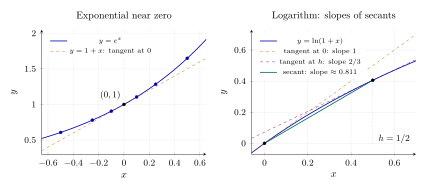
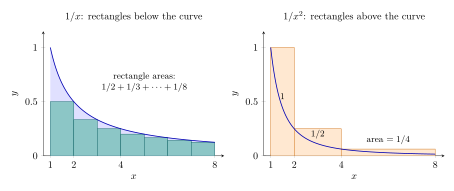
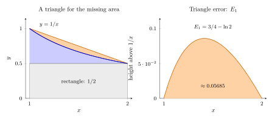

# 第 3 讲　单调数列、上确界、$e$ 与 $\gamma$ — Monotone sequences, the supremum, $e$ and Euler's $\gamma$

## 1 复利增长

设本金为 $1$，约定按如下规则计息：一年结息一次时，利率为 $100\%$；一年等分为 $n$ 期时，每期利率为 $1/n$，当期利息立即计入本金，供下一期计息。各期利率之和始终为 $1$，但年末实际增加的数额可以超过 $1$。

一年结息一次，年末本息为 $2$。每半年结息一次，上半年结束时本息为 $1+1/2=1.5$，下半年的利息便是 $1.5/2=0.75$，所以年末本息为
$$
1\cdot\left(1+\frac12\right)^2=2.25.
$$
多出的 $0.25$ 是上半年所得利息在下半年产生的利息。若一年等分为 $n$ 期，每期利率为 $1/n$，利息计入本金，则年末本息为
$$
a_n=\left(1+\frac1n\right)^n.
$$
结息越频繁，利息越早加入本金并继续生息，因此可以猜测 $a_n$ 随 $n$ 增大。若不断缩短结息间隔，年末本息会无限增大，还是趋于某个有限的数？

> [!WARNING] 先猜一猜 (Guess first)
>
>
> 先算 $a_1,a_2,a_3,a_4,a_5$，再用计算器求 $a_{10},a_{100},a_{1000}$。比较相邻几次计算的增量，猜测这个数列是否有上界。
>

> [!NOTE] 例 3.1：增加计息次数
>
>
> 本金为 $1$，年利率为 $100\%$。将一年等分为 $n$ 期，每期按利率 $1/n$ 计息，所得利息在以后各期继续计息。年末本息如下，非精确小数四舍五入到小数点后六位：
> $$
> \begin{array}{crrrrrrrr}
> n&1&2&3&4&5&10&100&1000\\
> a_n&2&2.25&2.370370&2.441406&2.488320&2.593742&2.704814&2.716924
> \end{array}
> $$
> 算出的这些值依次增加，都小于 $3$，并且似乎趋近于 $2.718$ 附近的某个数。这提示数列可能递增、有上界 $3$ 且收敛；这些判断仍须证明。
>

计算提示 $a_n<3$.

> [!QUESTION] 思考
>
> 能否用数学归纳法证明这个结果? 请仔细思考这个问题. 你将会发现它很困难. 但这是有可能的, 而且它将会引出本讲的另一个展开方式(见section 8). 你可以跳过这个问题来继续本讲的主线. 若你打算继续推进, 可以直接进入section 8.

关于 $a_n$ 的单调性, 在数学研究中, 我们一般会采用一切可用的方法先验证猜测是否成立, 然后再尝试证明. 这里我们可以直接取对数之后, 使用高中知识考察函数 $f(x) = x\ln(1+1/x)$ 的导数, 证明 $f'(x)>0$ 来得到. 但是, 这个证明依赖高中"不加证明给出"的 $(e^x)'=e^x$. 而我们这一讲的主要目的恰是给出 $e$ 的定义. 因此这里不能采用这个"证明", 否则涉嫌循环论证. 我们将在下文给出 $a_n$ 单调性的证明.

现在我们知道复利$a_n$不会趋于无穷大, 而$a_n$又是递增的, 可以想象, 将分期分得"无穷"细之后, 这个收益应当会趋于某个小于$3$的数值. 如何理解这个现象, 是否单调上升且有上界的数列必然收敛于某个实数? 我们将先探讨这个问题.

## 2 最小的上界 (The least upper bound)

数列 $3-2/n$ 的每一项都小于 $3$，却能超过任何小于 $3$ 的数。这里需要区分最大项与最小上界。

> [!WARNING] 先猜一猜 (Guess first)
>
>
> 数列 $3-2/n$ 在 $n=1,2,5$ 时的值是 $1,2,2.6$。你能找出最大的一项吗？ 若把“墙”放在 $2.99$，它能挡住全部项吗？先给出一个能越过它的下标，再想怎样挡住所有项。
>

> [!IMPORTANT] 定义 3.2 — 界与确界 (Bounds and extrema of bounds)
>
>
> 设 $A\subset\mathbb{R}$ 非空。若每个 $x\in A$ 都满足 $x\le M$，称 $M$ 为 $A$ 的 上界 (upper bound)，称 $A$ 有上界 (bounded above)。所有上界中最小的一个，若存在， 称为上确界 (supremum)，记为 $\sup A$。 若每个 $x\in A$ 都满足 $m\le x$，称 $m$ 为下界 (lower bound)；最大的下界称为 下确界 (infimum)，记为 $\inf A$。有下界的集合称为有下界 (bounded below)； 同时有上界和下界的集合称为有界 (bounded)。 若 $s\in A$ 且 $x\le s$ 对所有 $x\in A$ 成立，$s$ 才是最大值 (maximum)； 最小值 (minimum) 类似定义。
>

上确界若存在只能有一个：两个候选数各自不大于所有上界，特别是不大于对方。 定义暂时没有承诺它存在。先在能直接识别答案的例子里练习。

> [!NOTE] 例 3.3：有上确界，没有最大值
>
>
> 设 $A=\{3-2/n:n\ge1\}$。先计算几项：
> $$
> \begin{array}{crrrrr}
> n&1&2&5&20&200\\
> 3-2/n&1&2&2.6&2.9&2.99\\
> \end{array}
> $$
> 每个元素都小于 $3$。若 $M<3$，取整数 $n>2/(3-M)$，则 $3-2/n>M$，所以 $M$ 不是上界。因此 $\sup A=3$。集合中没有元素等于 $3$，故没有最大值。另一方面，$\inf A=1$，且集合确实取到这个值。$2.99$ 不是上界：任取整数 $n>200$，相应的元素就大于它。
>

证明须处理任意 $M<3$：找到一项超过 $M$，才能排除它是上界。

### 2.1 用 $\varepsilon$ 刻画确界

把刚才的 $M$ 写成 $s-\varepsilon$，便得到以后最常用的形式。

> [!NOTE] 命题 3.4 — 确界的 $\varepsilon$-刻画 (Epsilon characterization)
>
>
> 对非空集合 $A\subset\mathbb{R}$，$s=\sup A$ 当且仅当：
> $$
> x\le s\quad(x\in A),\qquad
>  \text{每个 }\varepsilon>0\text{ 都有 }x\in A\text{ 满足 }s-\varepsilon<x\le s.
> $$
> 相应地，$t=\inf A$ 当且仅当：
> $$
> t\le x\quad(x\in A),\qquad
>  \text{每个 }\varepsilon>0\text{ 都有 }x\in A\text{ 满足 }t\le x<t+\varepsilon.
> $$
> 这里的 $\sup$、$\inf$ 分别是上确界 (supremum)、下确界 (infimum)。
>

> [!NOTE] 证明
>
>
> 设 $s=\sup A$。它首先是上界；$s-\varepsilon$ 比它小，不能是上界，故某个 $x\in A$ 大于 $s-\varepsilon$。反过来，设两个条件成立。如果另有上界 $M<s$，取 $\varepsilon=s-M>0$， 第二个条件给出 $x>M$，与 $M$ 为上界矛盾。所以任何上界都不小于 $s$。
>
> 对下确界，若 $t=\inf A$，则 $t+\varepsilon$ 不是下界，故某个 $x\in A$ 小于它。 反过来，若有下界 $m>t$，取 $\varepsilon=m-t$，就会找到 $x<m$，矛盾。
>

这里是“每个精度找到*一项*”。数列收敛则要求“每个精度找到一个位置，其后*每一项*都行”。 下一节的单调性 (monotonicity) 恰好把这两句话接起来。

为了辨认上下两个方向，再把同一个数集反射一次。

> [!NOTE] 例 3.5：从上方逼近下确界
>
>
> 设 $B=\{-3+2/n:n\ge1\}$。取几个下标计算，得到
> $$
> -1,\quad -2,\quad -2.6,\quad -2.9,\quad -2.99
> \qquad(n=1,2,5,20,200).
> $$
> 所有元素都大于 $-3$。给定 $\varepsilon>0$，任取整数 $n>2/\varepsilon$，便有 $-3<-3+2/n<-3+\varepsilon$。因此 $\inf B=-3$，但没有最小值。最大值为 $-1$，它也是上确界。
>
> 可以用取相反数来检查上下界的方向。一般地，若 $A$ 非空且有上界，令 $-A=\{-x:x\in A\}$，则只要 $\sup A$ 存在，就有 $\inf(-A)=-\sup A$。
>

上确界不是数集里的“隐藏成员”，它可以在数集之外；反射后的下确界也是如此。

> [!IMPORTANT] 习题 3.6：一项接近，不等于整个尾段接近
>
>
> 对于 $z_n=(-1)^n(3-2/n)$，先画出前几项的位置，猜测 $\sup\{z_n:n\ge1\}$ 与 $\inf\{z_n:n\ge1\}$。其中任何一个能否成为整个数列的极限？前面的例子具有什么性质，而这个例子不再具有？
>

这道短题让我们保留一个警觉：数集能靠近某个边界，不代表它按下标顺序一直靠近。

## 3 逐位确定上确界

小数算法有一个很有用的视角：不用先知道完整答案，只问“这一位还能再增大吗”。 这不是保证有限时间算出任何集合的确界的程序；它解释确界为什么有一个位置。

> [!WARNING] 先猜一猜 (Guess first)
>
>
> 把所有满足 $x\ge0$ 且 $x^2<3$ 的数放在一起。只用乘法检验： 上边界的小数开头是 $1.7$ 还是 $1.8$？下一位呢？当所有小数位都定下后， 我们依靠什么承认它表示一个实数？
>

先试算，随后再抽出适用于任意数集的步骤。

> [!NOTE] 例 3.7：用平方比较确定上确界的位置
>
>
> 对于 $A=\{x\ge0:x^2<3\}$，逐次检验如下：
> $$
> \begin{array}{ccc}
> \text{精度}&\text{下侧检验}&\text{上侧检验}\\
> 10^{-1}&1.7^2=2.89&1.8^2=3.24\\
> 10^{-2}&1.73^2=2.9929&1.74^2=3.0276\\
> 10^{-3}&1.732^2=2.999824&1.733^2=3.003289\\
> \end{array}
> $$
> 每个左端点都属于 $A$，每个右端点都是上界。左端点不是上界，因为稍加一个足够小的正数，平方仍小于 $3$。具体地，若 $u^2<3$ 且 $u\ge0$，取 $0<h<\min\{1,(3-u^2)/(2u+1)\}$，便有 $(u+h)^2<3$。再考察下一位小数，就可以重复同样的步骤。
>

平方比较使这个集合的每一步选择都能实际算出。对一般数集，“是不是上界”仍是一个 有确定含义的问题。

> [!NOTE] 定理 3.8 — 确界存在性 (Supremum Property)
>
>
> 非空且有上界 (bounded above) 的实数集合有唯一的上确界 (supremum)。 非空且有下界 (bounded below) 的实数集合有唯一的下确界 (infimum)。
>

> [!NOTE] 证明 — 逐位小数论证
>
>
> 设 $A$ 非空且有上界。选择整数 $p$，使 $p$ 不是上界而 $p+1$ 是上界： 先从某个成员左侧的整数开始，走到一个超过已知上界的整数，在这有限串整数中找到第一次变成上界的位置。 令 $l_0=p$。
>
> 若 $l_k$ 不是上界而 $l_k+10^{-k}$ 是上界，把这段距离十等分。 在 $j=0,1,\ldots,9$ 中，选最大的、使 $l_k+j10^{-(k+1)}$ 仍不是上界的 $j$，并将该数记为 $l_{k+1}$。 于是 $l_{k+1}$ 不是上界，而 $l_{k+1}+10^{-(k+1)}$ 是上界。 选择至少有 $j=0$，所以每一步都有意义 (well-defined)。
>
> 这逐位确定一个小数 $s=p+0.d_1d_2\cdots$，即整数 $p$ 加上非负的小数部分， 也适用于负的 $p$。按小数的大小比较规则，
> $$
> l_k\le s\le l_k+10^{-k}\qquad(k\ge0).
> $$
> 允许小数尾部全为 $9$，它与相应的有限小数表示同一个数。
>
> 若某个 $x\in A$ 大于 $s$，选 $10^{-k}<x-s$，就有 $x>s+10^{-k}\ge l_k+10^{-k}$，与右端是上界矛盾。因此 $s$ 是上界。 若 $M<s$，选 $10^{-k}<s-M$，则 $l_k\ge s-10^{-k}>M$。由于 $l_k$ 不是上界，存在 $x\in A$ 满足 $x>l_k>M$， 所以 $M$ 也不是上界。这证明 $s=\sup A$。 唯一性已说明。对 $-A$ 应用上确界结论，再反射回来，便得下确界结论。
>

> [!WARNING] 欠条 (IOU) — \#2：确界存在，第 14 讲还
>
>
> 上述论证在“实数就是无限小数”的朴素约定下是证明。它使用了完备性 (completeness)： 逐位确定的无限小数确实对应实数中的一个位置。第 14 讲从 $\mathbb{Q}$ 的完备化定义出发， 重新推出确界存在性 (Supremum Property)。后面使用单调有界定理时，都沿用这张欠条。
>

## 4 单调数列

若数列递增且以上确界 $s$ 为界，一旦某项大于 $s-\varepsilon$，其后的各项也都在 $(s-\varepsilon,s]$ 内。

> [!IMPORTANT] 定义 3.9 — 单调数列 (Monotone sequence)
>
>
> 若 $x_{n+1}\ge x_n$ 对所有 $n$ 成立，称数列单调递增 (monotonically increasing)， 本讲允许相等；若处处为严格不等式，称严格递增 (strictly increasing)。 单调递减 (monotonically decreasing) 与严格递减 (strictly decreasing) 类似定义。 递增或递减的数列统称单调数列 (monotone sequence)。
>

先看一个可以算出很多项、却不必靠表格保证收敛的例子。

> [!NOTE] 例 3.10：先证明收敛，再求极限
>
>
> 设 $x_n=(3/5)^n$。直接计算得
> $$
> \begin{array}{crrrrr}
> n&1&2&5&10&20\\
> x_n&0.6&0.36&0.07776&0.0060466176&0.00003656158440062976\\
> \end{array}
> $$
> 由于 $x_{n+1}/x_n=3/5<1$，数列递减且各项为正。第 2 讲的几何数列极限已经给出它的极限。也可以用下面的定理先保证极限 $L$ 存在，再由 $x_{n+1}=(3/5)x_n$ 得 $L=(3/5)L$，从而 $L=0$。必须先说明 $L$ 存在，才能通过方程求它。
>

这个例子可用第 2 讲的几何数列极限直接处理。下面的定理把其中的单调性与有界性提取出来， 用于没有现成极限公式的数列；下一节的 $(1+1/n)^n$ 就是这样的应用。

> [!NOTE] 定理 3.11 — 单调有界定理 (Monotone Convergence Theorem)
>
>
> 有上界 (bounded above) 的单调递增数列 (monotonically increasing sequence) 收敛，且
> $$
> \lim_{n\to\infty}x_n=\sup\{x_n:n\ge1\}.
> $$
> 有下界 (bounded below) 的单调递减数列 (monotonically decreasing sequence) 收敛，且 其极限为 $\inf\{x_n:n\ge1\}$。因此单调数列收敛 当且仅当 它有界 (bounded)。
>

> [!NOTE] 证明
>
>
> 在递增情形，用确界存在性取 $s=\sup\{x_n:n\ge1\}$。给定 $\varepsilon>0$， 确界的 $\varepsilon$-刻画给出一个下标 $N$，使 $s-\varepsilon<x_N\le s$。 单调性随即给出
> $$
> n\ge N\quad\Longrightarrow\quad s-\varepsilon<x_N\le x_n\le s,
>  \qquad |x_n-s|<\varepsilon.
> $$
> 这正是收敛到 $s$ 的定义。递减时令 $t=\inf\{x_n:n\ge1\}$，先找 $t\le x_N<t+\varepsilon$，再用 $t\le x_n\le x_N<t+\varepsilon$。 最后，第 2 讲已证明收敛数列有界，故反方向也成立。
>

> [!WARNING] 欠条 (IOU) — \#2 的使用：单调有界定理，第 14 讲还
>
>
> 证明唯一需要的实数存在性是取 $s=\sup\{x_n\}$ 或 $t=\inf\{x_n\}$。 单调性负责将一项的接近推广到其后的整个尾段；确界存在性负责提供目标。
>

单调有界定理保证极限存在；要给出误差门槛 $N(\varepsilon)$，还需对具体数列作估计。

## 5 复利数列的单调性

单调有界定理已经给出收敛的充分条件。现在回到开篇的数列 $a_n=(1+1/n)^n$，分别证明它递增且有上界。

> [!WARNING] 探索：作商与取对数
>
> 分别计算 $a_{n+1}/a_n$ 和 $\ln a_{n+1}-\ln a_n$。只看所得式子，能否确定前者大于 $1$、后者大于 $0$？先自己推导，再展开下面的计算。

> [!NOTE]- 展开计算
>
> 作商得
> $$
> \frac{a_{n+1}}{a_n}
> =\left(\frac{n+2}{n+1}\right)^{n+1}
> \left(\frac n{n+1}\right)^n.
> $$
> 两个因子分别大于、小于 $1$，尚不能据此判断乘积与 $1$ 的大小。
>
> 取对数后，$\ln a_n=n\ln(1+1/n)$。一项因子递增，另一项递减，乘积的单调性仍需判断。相邻两项之差可写为
> $$
> \begin{aligned}
> \ln a_{n+1}-\ln a_n
> &=\ln\left(1+\frac1{n+1}\right)
> +n\ln\left(1-\frac1{(n+1)^2}\right).
> \end{aligned}
> $$
> 第一项为正，第二项为负；还需估计两者的大小，不能只看符号便下结论。

### 5.1 展开后逐项比较

直接作商时，两个幂的底数和次数都在变化。用二项式公式展开，先看前几项：
$$
\begin{aligned}
a_n
&=\sum_{k=0}^{n}\binom nk\frac1{n^k}\\
&=1+1+\frac1{2!}\left(1-\frac1n\right)
+\frac1{3!}\left(1-\frac1n\right)\left(1-\frac2n\right)+\cdots.
\end{aligned}
$$
这里最后一行写到三次项，须有 $n\ge3$。二次项中的 $1-1/n$ 随 $n$ 增大；三次项中的两个因子也都增大。其余各项是否也是如此？

其中，$k!=1\cdot2\cdots k$ 为阶乘 (factorial)，约定 $0!=1$。对 $1\le k\le n$，
$$
\binom nk\frac1{n^k}
=\frac1{k!}\frac{n(n-1)\cdots(n-k+1)}{n^k}
=\frac1{k!}\prod_{j=0}^{k-1}\left(1-\frac jn\right).
$$
乘积符号表示将下标范围内的因子相乘；$k=0$ 时没有因子，约定空乘积为 $1$。

> [!NOTE] 引理 3.12 — 二项展开中的系数 (Coefficients in the binomial expansion)
>
> 对每个正整数 $n$，有
> $$
> a_n=\sum_{k=0}^{n}\frac1{k!}
> \prod_{j=0}^{k-1}\left(1-\frac jn\right).
> $$
> 其中 $k=0$、$k=1$ 的两项都等于 $1$。

> [!NOTE] 记号：二项展开中的乘积因子
>
> 对正整数 $n$ 及 $0\le k\le n$，记
> $$
> \boxed{P_n(k-1):=\prod_{j=0}^{k-1}\left(1-\frac jn\right).}
> $$
> 下标 $n$ 来自 $a_n$；括号中的 $k-1$ 是乘积中最后一个 $j$ 的值。比如
> $$
> P_n(-1)=P_n(0)=1,\qquad
> P_n(1)=1-\frac1n,\qquad
> P_n(2)=\left(1-\frac1n\right)\left(1-\frac2n\right),
> $$
> 后两式分别要求 $n\ge2$、$n\ge3$。于是展开式中第 $k$ 次项为 $P_n(k-1)/k!$；相对于 $1/k!$，乘积因子与 $1$ 的差是 $1-P_n(k-1)$。

^l03-p-product

> [!NOTE] 命题 3.13 — 复利数列严格递增 (Compound growth is strictly increasing)
>
> 数列 $a_n=(1+1/n)^n$ 严格递增。

> [!NOTE] 证明
>
> 先比较两个展开式中都有的项，再看 $a_{n+1}$ 多出的一项。这里用到 [[#^l03-p-product|P 的定义]]。
>
> 固定 $k$，其中 $0\le k\le n$。比较 $P_n(k-1)$ 与 $P_{n+1}(k-1)$ 时，因子仍从 $j=0$ 取到 $j=k-1$，只有分母 $n$ 变成 $n+1$。对其中每个 $j$，
> $$
> 1-\frac j{n+1}\ge1-\frac jn\ge0.
> $$
> 将对应因子相乘，得 $P_{n+1}(k-1)\ge P_n(k-1)$。因此，两个展开式中对应的第 $k$ 次项满足
> $$
> \frac{P_{n+1}(k-1)}{k!}\ge\frac{P_n(k-1)}{k!}.
> $$
> 这适用于所有共同的项 $k=0,1,\ldots,n$。此外，$a_{n+1}$ 还多出 $k=n+1$ 的一项：
> $$
> \frac{P_{n+1}(n)}{(n+1)!}
> =\frac1{(n+1)!}\frac{(n+1)n\cdots1}{(n+1)^{n+1}}
> =\frac1{(n+1)^{n+1}}>0.
> $$
> 故
> $$
> \begin{aligned}
> a_{n+1}
> &=\sum_{k=0}^{n}\frac{P_{n+1}(k-1)}{k!}+\frac1{(n+1)^{n+1}}\\
> &\ge\sum_{k=0}^{n}\frac{P_n(k-1)}{k!}+\frac1{(n+1)^{n+1}}
> >a_n.
> \end{aligned}
> $$

## 6 收敛与自然常数 $e$ (Convergence and Euler's number)

对固定的 $k$，当 $n$ 增大时，$P_n(k-1)$ 中固定的 $k$ 个因子都趋于 $1$，故 $P_n(k-1)\to1$，相应的项 $P_n(k-1)/k!$ 趋于 $1/k!$（[[#^l03-p-product|查看 P 的定义]]）。这提示另一种近似：直接把这些阶乘倒数加起来，是否能更快接近 $a_n$ 的极限？令
$$
S_m=\sum_{k=0}^{m}\frac1{k!}.
$$
先比较两组数值，以下均四舍五入到小数点后九位：
$$
\begin{array}{rcc}
 n&a_n&S_n\\
 5&2.488320000&2.716666667\\
 10&2.593742460&2.718281801\\
 20&2.653297705&2.718281828
\end{array}
$$
阶乘部分和的前几位小数很快稳定下来，而 $a_n$ 在同样的下标处仍有明显变化。它是否真的收敛到同一个数，而且误差更小？有限张表还不能回答；下面先证明共同极限存在，再比较两种近似的误差。

由 $0<P_n(k-1)\le1$，逐项比较得 $a_n\le S_n$。对 $k\ge1$，由 $k!\ge2^{k-1}$ 得
$$
S_m\le 1+\sum_{k=1}^{m}\frac1{2^{k-1}}
=3-2^{1-m}<3\qquad(m\ge1).
$$
这就证明了开篇猜测的上界 $a_n<3$。数列 $(a_n)$ 已证严格递增，$(S_m)$ 也因每次增加一个正项而严格递增。由单调有界定理，两个数列都收敛。

> [!NOTE] 定理 3.14 — 两个数列的共同极限 (A common limit)
>
> 数列 $a_n=(1+1/n)^n$ 与 $S_n=\sum_{k=0}^{n}1/k!$ 的极限相同。

> [!NOTE] 证明
>
> 记 $A=\lim a_n$，$L=\lim S_n$。由 $a_n\le S_n$，得 $A\le L$。
>
> 反过来，固定非负整数 $m$。当 $n\ge\max\{m,1\}$ 时，只保留展开式的前 $m+1$ 项，得
> $$
> a_n\ge\sum_{k=0}^{m}\frac{P_n(k-1)}{k!}.
> $$
> 此时 $m$ 固定，只有 $n$ 趋于无穷。右侧只有 $m+1$ 项，且每个 $P_n(k-1)\to1$（[[#^l03-p-product|查看 P 的定义]]），故有限和的极限为 $S_m$，于是 $A\ge S_m$。这对每个 $m$ 都成立；再令 $m\to\infty$，得 $A\ge L$。因此 $A=L$。

> [!IMPORTANT] 定义 3.15 — 自然常数 $e$ (Euler's number)
>
> 将上述共同极限记为 $e$，即
> $$
> \boxed{e:=\sum_{k=0}^{\infty}\frac1{k!}
> =\lim_{m\to\infty}\sum_{k=0}^{m}\frac1{k!}.}
> $$
> 无穷和表示有限部分和的极限。由前述定理，亦有
> $$
> \lim_{n\to\infty}\left(1+\frac1n\right)^n=e.
> $$

> [!WARNING] 欠条 (IOU) — \#2 的使用：$e$ 存在，第 14 讲还
>
> 两个数列的极限存在性来自单调有界定理，沿用确界存在性的欠条。

### 6.1 收敛有多快？

已知 $a_n\to e$，现在估计有限的 $a_n$ 与 $e$ 相差多少。沿用 [[#^l03-p-product|P 的定义]]，二项展开写成
$$
a_n=\sum_{k=0}^{n}\frac{P_n(k-1)}{k!}.
$$
与 $S_n$ 相比，第 $k$ 次项少了 $(1-P_n(k-1))/k!$。先估计 $1-P_n(k-1)$。

例如，当 $n\ge3$ 时，
$$
\begin{aligned}
1-\left(1-\frac1n\right)\left(1-\frac2n\right)
&=\frac1n+\left(1-\frac1n\right)\frac2n\\
&\le\frac1n+\frac2n.
\end{aligned}
$$
一般地，每多乘一个 $1-j/n$，乘积减少的量等于原来的乘积乘以 $j/n$。当 $k\le n$ 时，涉及的因子都在 $[0,1]$ 内，原来的乘积也不超过 $1$，所以这一步减少的量不超过 $j/n$。将各步减少的量相加：
$$
0\le1-P_n(k-1)
\le\sum_{j=0}^{k-1}\frac jn
=\frac{k(k-1)}{2n}.
$$
$k=0$ 时乘积约定为 $1$，两边均为 $0$。

因此，对 $0\le k\le n$，
$$
P_n(k-1)\ge1-\frac{k(k-1)}{2n},
$$
因此
$$
a_n=2+\sum_{k=2}^{n}\frac{P_n(k-1)}{k!}
\ge2+\sum_{k=2}^{n}\left(1-\frac{k(k-1)}{2n}\right)\frac1{k!}.
$$
当 $k\ge n+1$ 时，$k(k-1)/(2n)\ge(n+1)/2\ge1$，所以补入后面的项只会使右侧减小。这里补入的是下界中的项，不再含有 $P_n(k-1)$。于是
$$
\begin{aligned}
a_n
&\ge2+\sum_{k=2}^{\infty}\left(1-\frac{k(k-1)}{2n}\right)\frac1{k!}\\
&=e-\frac1{2n}\sum_{k=2}^{\infty}\frac1{(k-2)!}
=e\left(1-\frac1{2n}\right).
\end{aligned}
$$
这里可先补到任意有限下标，再取极限；最后两个级数均由 $e$ 的定义收敛。

前面的几何级数比较给出 $e\le3$。在 $k=3$ 处保留固定的差 $1/4-1/6=1/12$，还有 $e\le3-1/12<3$。结合 $a_n<e$，得到
$$
\boxed{0<e-a_n\le\frac e{2n}<\frac3{2n}.}
$$
例如，要保证 $e-a_n<10^{-3}$，取 $n\ge1500$ 即可。这是由误差界给出的充分条件，不一定是最小的取值。

**再多乘一个因子。** $a_n$ 还小于 $e$。若再乘一次原来的增长因子 $1+1/n$，能否超过 $e$？仅知道 $a_n\to e$ 不足以判断；刚才的误差估计给出
$$
\begin{aligned}
\left(1+\frac1n\right)a_n
&\ge e\left(1+\frac1n\right)\left(1-\frac1{2n}\right)\\
&=e\left(1+\frac{n-1}{2n^2}\right)>e\qquad(n\ge2).
\end{aligned}
$$
$n=1$ 时，左侧为 $4>e$，所以对所有 $n\ge1$，
$$
\left(1+\frac1n\right)^n<e<\left(1+\frac1n\right)^{n+1}.
$$
左侧有 $n$ 个相同的因子，补入一个后就超过了 $e$。

对左侧取正 $n$ 次方根，得到
$$
\boxed{e^{1/n}>1+\frac1n.}
$$
对右侧取正 $n+1$ 次方根，再取倒数，则有
$$
e^{-1/(n+1)}>\frac n{n+1}=1-\frac1{n+1}.
$$
令 $m=n+1$，得到
$$
\boxed{e^{-1/m}>1-\frac1m\qquad(m\ge2).}
$$
$m=1$ 时右侧为 $0$，不等式也成立。负指数的下界，就来自正指数这一侧“多乘一个因子”的上估计。这里的有理次幂只涉及正根及其倒数，尚未使用一般指数函数的级数表示。

> [!WARNING] 探索：正指数的不等式能直接推出负指数的情形吗？
>
> 从 $e^{1/n}>1+1/n$ 出发，两边取倒数。得到的是刚证明的下界 $e^{-1/n}>1-1/n$，还是一个上界？取 $n=2$ 检查不等号方向。

> [!WARNING] 探索：用高中导数怎样判断？
>
> 若允许使用 $(e^x)'=e^x$，能否通过 $f(x)=e^x-1-x$ 的单调性，同时得到正、负两侧的不等式？先判断 $f'(x)$ 在零点两侧的符号。第 6.2 节末的折叠旁注给出推演，并列明暂借的结论。

### 6.2 零点附近的指数函数

这些取值越来越接近 $0$。除了判断上下关系，还可以估计 $e^x$ 与 $1+x$ 相差多少。令 $h=1/n$，$n\ge2$。将正、负两侧的不等式分别取倒数，得到
$$
1+h<e^h<\frac1{1-h},
\qquad
1-h<e^{-h}<\frac1{1+h}.
$$
减去相应的一次式，便有
$$
0<e^h-1-h<\frac{h^2}{1-h},
\qquad
0<e^{-h}-1+h<\frac{h^2}{1+h}.
$$
例如 $h=1/100$ 时，两侧的误差分别小于 $1/9900$ 和 $1/10100$。一般地，将误差除以 $h$，上界分别为 $h/(1-h)$ 和 $h/(1+h)$，均趋于 $0$。所以沿这两列取值，
$$
\frac{e^h-1}{h}\longrightarrow1,
\qquad
\frac{e^{-h}-1}{-h}\longrightarrow1.
$$
这提示一般的 $x\to0$ 时也许有 $(e^x-1)/x\to1$，即 $1+x$ 给出指数函数在零点附近的一次近似。目前只验证了 $x=\pm1/n$，还不能据此断言任意趋于零的取值都成立。

用高中函数图像来理解，$e^x-1$ 是曲线从 $(0,1)$ 出发的纵向增量，
$$
\frac{e^x-1}{x}
$$
是连接 $(0,1)$ 与 $(x,e^x)$ 的割线斜率。若曲线在这里的切线为 $y=1+x$，便会预期这个斜率趋于 $1$，也就是 $e^x-1\approx x$。例如，$x=0.01$ 时预期 $e^x\approx1.01$；上面的估计已经给出了这一预测的误差界。

这里先用切线 (tangent line) 预测一般函数的行为；刚才严格证明的是 $x=\pm1/n$ 的情形。导数旁注说明：借用 $(e^x)'=e^x$ 后，怎样确认这条切线。

定义 $e$ 的阶乘级数也提示了一个候选表达式：
$$
E(x)=\sum_{k=0}^{\infty}\frac{x^k}{k!}
=1+x+\frac{x^2}{2!}+\cdots.
$$
这也是分析中定义指数函数的一种标准方式。

它在 $x=1$ 时给出 $e$，前两项是 $1+x$。要完成这个定义，需要先证明级数收敛，再检验 $E(x+y)=E(x)E(y)$，以及 $E(p/q)$ 是否等于已有的有理次幂 $e^{p/q}$。[选做习题 3.12](#l03-ex-series-route) 依次处理这些问题。

> [!WARNING] 探索：代入负数以后，级数发生了什么变化？
>
> 在 $x=-1/2$ 处，候选级数的前几项为
> $$
> 1-\frac12+\frac18-\frac1{48}+\frac1{384}-\cdots.
> $$
> 为什么不能再说 $1+x$ 后的每一项都为正？从 $1/8-1/48$ 开始，将后面的项相邻两项配成一组，检查每组的符号。即使证明了总和大于 $1/2$，要认定它就是 $e^{-1/2}=1/\sqrt e$，还需要证明什么？

> [!NOTE]- 旁注 — 若暂借逐项求导 (A derivative preview)
>
> 若暂借 $e^x=\sum_{k\ge0}x^k/k!$ 及逐项求导的合法性，则
> $$
> \frac{\mathrm d}{\mathrm dx}e^x
> =\sum_{k=1}^{\infty}\frac{kx^{k-1}}{k!}=e^x.
> $$
> 特别地，零点处的导数为 $1$，这便证明了上面关于一次近似的猜测。它还给出不等式的另一种证明：令 $f(x)=e^x-1-x$，则 $f'(x)=e^x-1$ 在 $x<0$ 时为负、在 $x>0$ 时为正，故 $f(x)>f(0)=0$（$x\ne0$）。取 $x=1/n$ 或 $x=-1/n$，就得到前面的两个不等式。
>
> **欠条 (IOU，仅此旁注)：** 指数级数与高中指数函数的对应、无穷级数逐项求导的合法性，留待本套 18 讲之后的幂级数理论建立；导数判别单调性的依据在第 10 讲中值定理部分说明。本节正文不使用这条证明。

### 6.3 从定义计算 $e$

用定义中的部分和 $S_m$ 计算 $e$，需要估计余项 $e-S_m$。

> [!WARNING] 先猜一猜 (Guess first)
>
>
> 若要求绝对误差小于 $10^{-10}$，你猜要算到 $1/10!$、$1/20!$，还是更远？若要求*认证四舍五入到小数点后十位*，同一个误差门槛够不够？
>

> [!NOTE] 例 3.16：阶乘增长与计算精度
>
>
> 有限部分和及候选余项上界如下：
> $$
> \begin{array}{rrr}
> m&S_m\text{（四舍五入）}&1/(m!m)\text{（四舍五入）}\\
> 4&2.708333333333333&1.041666667\times10^{-2}\\
> 8&2.718278769841270&3.100198413\times10^{-6}\\
> 10&2.718281801146384&2.755731922\times10^{-8}\\
> 12&2.718281828286169&1.739729749\times10^{-10}\\
> 13&2.718281828446759&1.235311064\times10^{-11}\\
> 14&2.718281828458230&8.193389713\times10^{-13}\\
> \end{array}
> $$
> 从一行到下一行，精度提高得比 $a_n$ 快得多。表中的四舍五入值只用于观察数量级；若要用最后一列确认所需精度，应使用精确分数或向外舍入的区间端点。
>

> [!NOTE] 定理 3.17 — 阶乘级数的余项 (Remainder of the factorial series)
>
>
> 令
> $$
> R_m=e-S_m.
> $$
> 对 $m\ge1$，有
> $$
> \frac1{(m+1)!}<R_m<\frac1{m!m}.
> $$
>

> [!NOTE] 证明
>
>
> 固定 $m$。对任意整数 $r\ge1$，逐项比较有限和：
> $$
> S_{m+r}-S_m
> \le\frac1{(m+1)!}\sum_{j=0}^{r-1}\frac1{(m+2)^j}
> <\frac1{(m+1)!}\frac{m+2}{m+1}.
> $$
> 让 $r\to\infty$，得到非严格的 $\le$；但
> $$
> R_m\le\frac1{m!}\frac{m+2}{(m+1)^2}
> <\frac1{m!m},
> $$
> 最后的严格不等式来自 $m(m+2)<(m+1)^2$。下界则由下面的不等式得到：
> $$
> e\ge S_{m+2}>S_m+\frac1{(m+1)!}
> $$
>

### 6.4 用哪个数列计算 $e$？

在第 6 节开头的表中，同样取到下标 $20$，$S_{20}$ 的前几位小数已经稳定，$a_{20}$ 却还只有 $2.653\ldots$。先比较它们与 $e$ 的距离。由二项式展开，$n\ge2$ 时有 $a_n<S_n$，而 $S_n<e$，所以
$$
0<e-S_n<e-a_n.
$$
同一下标处，阶乘部分和确实更准确。两者的误差减小得有多快？前面证明了
$$
0<e-a_n<\frac3{2n},\qquad
0<e-S_n<\frac1{n!n}.
$$
先看 $a_n$ 的误差上界。下标从 $n$ 增加到 $n+1$，上界变为原来的
$$
\frac{3/[2(n+1)]}{3/(2n)}=\frac n{n+1}.
$$
当 $n$ 很大时，这个比值接近 $1$，所以上界减小得很少。要把上界缩小到十分之一，须把下标增大到原来的十倍。

对于 $S_n$，增加一项，上界变为原来的
$$
\frac{1/[(n+1)!(n+1)]}{1/(n!n)}
=\frac n{(n+1)^2}.
$$
阶乘多出的因子 $n+1$，使这个比值多了一个除数。例如从 $n=10$ 增加到 $11$，$a_n$ 的误差上界只变为原来的 $10/11$，而 $S_n$ 的变为原来的 $10/121$，已不到十分之一。随着 $n$ 增大，后一比值还会趋于零。

> [!NOTE] 例 3.18：把误差控制在 $10^{-8}$ 以内
>
> 用 $a_n$ 近似 $e$，要求
> $$
> \frac3{2n}\le10^{-8},
> $$
> 取 $n=150000000$ 即可。
>
> 用 $S_m$ 时，比较相邻两个余项上界：
> $$
> \frac1{10!\cdot10}>2.75\times10^{-8},\qquad
> \frac1{11!\cdot11}<2.28\times10^{-9}.
> $$
> 因此取 $m=11$，把 $1/0!$ 到 $1/11!$ 共十二项相加，就能使误差小于 $10^{-8}$。各项可依次计算：从 $1$ 开始，除以 $1$、$2$、$3$，直到 $11$，每次将所得项加到部分和中。
>
> 这里按已证明的误差上界选取下标，不要求找到最小下标；小数计算中的舍入误差还须另行计入。

若要求确认四舍五入后的若干位小数，还应检查误差区间的两个端点是否舍入为同一个数，见习题 3.9。

### 6.5 有理数列的无理极限 (An irrational limit of rational numbers)

第 1 讲遇到 $\sqrt2$ 时，有理近似并不保证极限仍是有理数 (rational number)。 这里每个 $S_m$ 都是有理数，但它们的共同目标是无理数 (irrational number)。 这一次，余项小到能挤在两个相邻整数之间。

> [!NOTE] 定理 3.19 — $e$ 的无理性 (Irrationality of $e$)
>
>
> 数 $e$ 是无理数 (irrational number)。
>

> [!NOTE] 证明
>
>
> 假设 $e=p/q$，其中 $p\in\mathbb{Z}$，$q$ 为正整数。选整数 $m\ge\max\{q,2\}$。 因为 $q$ 整除 $m!$，$m!e$ 是整数；每个 $m!/k!$ 也是整数，所以
> $$
> m!R_m=m!e-\sum_{k=0}^{m}\frac{m!}{k!}
> $$
> 是整数。但余项界给出 $0<m!R_m<1/m<1$。整数不可能严格位于 $0$ 与 $1$ 之间，矛盾。
>

这不是从很长的小数里猜“不会循环”，而是用一个对所有可能分母 $q$ 都有效的误差界，排除所有分数。

## 7 调和和的增长 (The growth of harmonic sums)

考虑调和和 (harmonic sum)
$$
H_n=1+\frac12+\cdots+\frac1n.
$$
先算几项。保留六位小数，得到
$$
\begin{array}{c|rrrrr}
n&10&100&1000&10000&100000\\
H_n&2.928968&5.187378&7.485471&9.787606&12.090146
\end{array}
$$
项数每扩大十倍，和大约增加 $2.3$。每一项虽越来越小，表中的和仍在增长。不过，有限次计算不能判断它是否有上界。

### 7.1 项数翻倍，增加多少？

把项数从 $n$ 增加到 $2n$，新增的部分是
$$
H_{2n}-H_n=\frac1{n+1}+\cdots+\frac1{2n}.
$$
这里有 $n$ 项，每项至少为 $1/(2n)$，又都小于 $1/n$，所以
$$
\frac12\le H_{2n}-H_n<1.
$$
依次取 $n=1,2,4,\ldots,2^{m-1}$，相加得
$$
H_{2^m}\ge1+\frac m2\longrightarrow+\infty.
$$
又因为 $H_n$ 递增，故 $H_n\to+\infty$。这就证明了调和级数 (harmonic series) 发散。

现在知道，每次将项数翻倍，和增加的量始终在 $1/2$ 与 $1$ 之间。这个增量是否趋于某个数？高中学过的对数函数满足
$$
\ln(2n)-\ln n=\ln2.
$$
在 $y=\ln x$ 的图象上，横坐标每翻倍，纵坐标就增加同一个数。这使得 $\ln n$ 成为一个可供比较的数列；要判断比较是否合适，还需计算两者的增量。

### 7.2 比较调和和与对数的增量

对数在相邻整数间的增量为
$$
\ln(k+1)-\ln k=\ln\left(1+\frac1k\right).
$$
将它与 $1/k$ 相除，得到
$$
k\ln\left(1+\frac1k\right)
=\ln\left(1+\frac1k\right)^k=\ln a_k.
$$
第 5 节尝试取对数研究 $a_k$ 的单调性时，得到的正是这个式子：$k$ 变大而 $\ln(1+1/k)$ 变小，仍不能直接判断乘积的单调性。现在所求的是极限，而前面已经由
$$
e=\sum_{j=0}^{\infty}\frac1{j!}
$$
证明了 $a_k\to e$。

这里用到一个对数的极限性质：若 $x_k>0$、$x>0$ 且 $x_k\to x$，则 $\ln x_k\to\ln x$。[习题 3.13](#l03-ex-log-limit) 用对数的单调性证明它，不使用导数。因此
$$
k\ln\left(1+\frac1k\right)=\ln a_k\longrightarrow\ln e=1,
$$
即
$$
\ln\left(1+\frac1k\right)\sim\frac1k.
$$
记号 $u_k\sim v_k$ 表示两者之比趋于 $1$。

从函数图像看，这是 $\ln(1+x)\approx x$ 在 $x=1/k$ 处的表现：曲线 $y=\ln(1+x)$ 经过原点，高中导数公式给出它在原点的斜率为 $1$，因此附近的切线是 $y=x$。于是看到 $\ln(1+1/k)$，可以先预期它与 $1/k$ 的比趋于 $1$。上面的数列证明已经独立确认了这一判断；一般函数版本留待函数极限部分。

这能否用来计算翻倍时的增量？对数增量相加后恰好相消：
$$
\sum_{k=n}^{2n-1}\ln\left(1+\frac1k\right)
=\ln(2n)-\ln n=\ln2.
$$
需要检查的是，把每个对数增量换成 $1/k$ 后，总误差是否趋于零。给定 $\varepsilon>0$，由刚得到的极限，当 $k$ 足够大时，
$$
\left|\frac1k-\ln\left(1+\frac1k\right)\right|<\frac{\varepsilon}{k}.
$$
记 $B_n=\sum_{k=n}^{2n-1}1/k$。它有 $n$ 项，每项不超过 $1/n$，故 $B_n\le1$。当 $n$ 足够大时，上面的误差界对求和范围内的每个 $k$ 都成立，于是
$$
|B_n-\ln2|
\le\sum_{k=n}^{2n-1}\left|\frac1k-\ln\left(1+\frac1k\right)\right|
<\varepsilon B_n\le\varepsilon.
$$
所以 $B_n\to\ln2$。而
$$
H_{2n}-H_n=B_n-\frac1n+\frac1{2n}
=B_n-\frac1{2n},
$$
故
$$
\boxed{H_{2n}-H_n\longrightarrow\ln2.}
$$

### 7.3 用 Stolz 定理确定增长速度

若要比较整个 $H_n$ 与 $\ln n$，第 2 讲的 Stolz 定理允许从相邻增量的比入手。

> [!NOTE] 命题 3.20 — 调和和的相对增长 (Relative growth of harmonic sums)
>
> $$
> \frac{H_n}{\ln n}\longrightarrow1\qquad(n\to\infty,\ n\ge2).
> $$

> [!NOTE] 证明
>
> $\ln n$ 严格递增且趋于 $+\infty$：当 $n\ge2^j$ 时，$\ln n\ge j\ln2$，而 $\ln2>0$。相邻增量的比为
> $$
> \frac{H_{n+1}-H_n}{\ln(n+1)-\ln n}
> =\frac{1/(n+1)}{\ln(1+1/n)}
> =\frac n{n+1}\frac1{n\ln(1+1/n)}\longrightarrow1.
> $$
> 由 Stolz 定理，得到结论。

### 7.4 欧拉常数

$H_n/\ln n\to1$ 说明相对误差趋于零，但不能据此判断差值是否收敛。例如 $\ln n+\sqrt{\ln n}$ 与 $\ln n$ 的比也趋于 $1$，差却趋于无穷。对调和和，另记
$$
d_n=H_n-\ln n,
$$
先计算这个差。

> [!NOTE] 例 3.21：减去 $\ln n$ 后的差值
>
> 先计算差值，再猜测它的极限：
> $$
> \begin{array}{rrrr}
> n&H_n&\ln n&d_n\\
> 10&2.928968254&2.302585093&0.626383161\\
> 100&5.187377518&4.605170186&0.582207332\\
> 1000&7.485470861&6.907755279&0.577715582\\
> 10000&9.787606036&9.210340372&0.577265664\\
> 100000&12.090146130&11.512925465&0.577220665
> \end{array}
> $$
> 表中的差值依次减小，似乎在 $0.5772$ 附近趋于稳定。但 $d_n$ 对所有 $n$ 都递减吗？比较 $d_{n+1}$ 与 $d_n$。

相邻两项的差为
$$
d_{n+1}-d_n=\frac1{n+1}-\ln\left(1+\frac1n\right).
$$
记 $\ell_n=\ln(1+1/n)$。第 6.1 节已证明
$$
e^{1/n}>1+\frac1n,
\qquad
e^{-1/(n+1)}>1-\frac1{n+1}=\frac n{n+1}.
$$
对第二式取倒数，再对两式取对数，得到
$$
\frac1{n+1}<\ell_n<\frac1n.
$$
左侧不等式使 $d_{n+1}-d_n<0$；右侧不等式将在求和后给出 $d_n$ 的下界。

> [!NOTE] 引理 3.22 — 对数增量的估计 (Bounds for a logarithmic increment)
>
> 对每个整数 $n\ge1$，有
> $$
> \frac1{n+1}<\ln\left(1+\frac1n\right)<\frac1n.
> $$

> [!NOTE] 函数图像：为什么对数增量接近 $1/n$
>
> 引理中的 $\ln(1+1/n)=\ln(n+1)-\ln n$，是对数曲线从 $n$ 到 $n+1$ 的纵向增量。横向距离为 $1$，因此它也是这两点之间的割线斜率。由高中导数公式 $(\ln x)'=1/x$，两端的切线斜率分别为 $1/n$ 与 $1/(n+1)$。曲线越来越平，从图上可以预期割线斜率介于两者之间，这与刚证明的增量界一致。
>
> 若想看清零点附近的近似，将横轴改为 $h$，考察 $y=\ln(1+h)$。右图中的割线斜率是 $\ln(1+h)/h$，两端的切线斜率分别为 $1$ 和 $1/(1+h)$。当 $h>0$ 很小时，两条切线的斜率都接近 $1$，所以预期
> $$
> \frac{\ln(1+h)}h\approx1,\qquad \ln(1+h)\approx h.
> $$
> 取 $h=1/n$，就回到本讲的数列近似。左图同样用 $e^x$ 在零点处的切线 $y=1+x$ 解释 $e^x-1\approx x$。图形说明怎样想到这些近似；本讲所需的数列结论已经由前面的不等式证明。

左图：$e^x$ 在 $0$ 附近与 $1+x$ 接近，标出的点取自 $x=\pm1/n$。右图：取 $h=1/2$，割线斜率 $\ln(1+h)/h\approx0.811$ 介于两端切线斜率 $1$ 与 $2/3$ 之间。图像用于观察；它不能替代任意 $n$ 的证明。

> [!NOTE] 定理 3.23 — 欧拉常数的存在及误差 (Euler's constant and the approximation error)
>
> 数列 $d_n=H_n-\ln n$ 严格递减且有正的下界，其极限记为欧拉常数 (Euler–Mascheroni constant) $\gamma$。对 $n\ge1$，有
> $$
> 0<d_n-\gamma<\ln(1+1/n)<\frac1n.
> $$

> [!NOTE] 证明
>
> 对数增量估计给出 $d_{n+1}-d_n<0$，将 $\ell_k<1/k$ 从 $k=1$ 加到 $n$，得 $\ln(n+1)<H_n$，所以 $d_n>0$。由单调有界定理，存在极限 $\gamma\ge0$；严格递减性给出 $d_n>\gamma$。
>
> 为估计误差，对 $m>n$，
> $$
> d_n-d_m=\sum_{k=n}^{m-1}\left(\ell_k-\frac1{k+1}\right).
> $$
> 因 $\ell_{k+1}<1/(k+1)$，每项均小于 $\ell_k-\ell_{k+1}$。为在取极限后保留严格不等式，保留第一项中确定的正差
> $$
> \eta_n=\frac1{n+1}-\ell_{n+1}>0.
> $$
> 相加得
> $$
> d_n-d_m\le\ell_n-\ell_m-\eta_n.
> $$
> 令 $m\to\infty$。由 $0<\ell_m<1/m$，得
> $$
> 0<d_n-\gamma\le\ell_n-\eta_n<\ell_n<\frac1n.
> $$
> 取 $n=1$，还有 $\gamma>d_1-\ell_1=1-\ln2>0$。

> [!WARNING] 欠条 (IOU) — 沿用 \#2：实数完备性，第 14 讲还
>
> 这里用单调有界定理保证 $\gamma$ 存在，沿用实数完备性的欠条。

### 7.5 一百万项究竟有多大？

余项估计给出
$$
d_N-\ln(1+1/N)<\gamma<d_N.
$$
为便于记录计算区间，将左端记作 $c_N$。由对数法则，$c_N=H_N-\ln(N+1)$。

> [!NOTE] 例 3.24：先预测，再核验
>
>
> 在 $N=100000$ 时直接求和，结合对数的上下界，得到
> $$
> c_N=0.577210664943199\ldots,
>  \qquad d_N=0.577220664893199\ldots.
> $$
> 两个端点四舍五入到小数点后四位都得到 $0.5772$，所以 $\gamma$ 精确到小数点后四位为 $0.5772$。这里没有调用数值库中的 $\gamma$。计算保留六十位有效数字并采用有指定方向的舍入；每个对数另加 $10^{-55}$ 的误差余量，最后给出的上下界向外舍入。
>
> 对于 $M=10^6$，定理给出
> $$
> H_M=\ln M+\gamma+r_M,\qquad 0<r_M<10^{-6}.
> $$
> 代入 $\gamma$ 的整个区间，而不只代入四舍五入后的值，并将结果向外舍入，得到
> $$
> 14.3927212229<H_{10^6}<14.3927322229.
> $$
> 因此，$H_{10^6}$ 精确到小数点后四位为 $14.3927$，精确到两位为 $14.39$。作出这个预测以后，再直接求和核验，得到
> $$
> H_{10^6}=14.392726722865723\ldots.
> $$
> 如果只计算 $\ln(10^6)+0.5772$，则得到 $14.392710557964274\ldots$。它可以作粗略估计，但误差不能保证小于 $10^{-6}$，因为对 $\gamma$ 的舍入引入了另一部分误差。
>

计算 $H_M$ 的区间时，须同时计入 $\gamma$ 的近似误差与余项 $r_M$。

为了确认 $\gamma$ 的四位小数，这次直接累加了十万项。若先弄清 $d_n$ 的主要误差，能否用少得多的项达到同样精度？下面从面积图中寻找修正。

### 7.6 从调和和到曲线下的面积

画出 $x\ge1$ 时曲线 $y=1/x$ 与横轴之间的区域。曲线越来越低，但区域一直向右延伸：它的面积会是有限的吗？

左图：浅蓝色表示 $1/x$ 下方的区域，绿色矩形包含在其中。右图：$1/x^2$ 下方的区域包含在橙色矩形中，矩形上标出的是面积。两图只画到 $x=8$，同样的作法可以继续向右延伸。

无限延伸不一定意味着面积无限。先看右图的 $y=1/x^2$，把横轴分成 $[1,2]$、$[2,4]$、$[4,8]$ 等区间。在 $[2^j,2^{j+1}]$ 上，曲线不高于 $1/2^{2j}$，因此可以用宽为 $2^j$、高为 $1/2^{2j}$ 的矩形盖住这一段区域。这个矩形的面积为 $1/2^j$，所有这些矩形的总面积为
$$
1+\frac12+\frac14+\cdots \leq 2.
$$
所以，不论向右延伸多远，$1/x^2$ 下方的面积都不超过 $2$。这个上界只用了矩形面积和等比数列求和，不必先计算曲边区域的精确面积。

再看左图的 $y=1/x$。在 $[k,k+1]$ 上，曲线不低于 $1/(k+1)$，所以高为 $1/(k+1)$、宽为 $1$ 的矩形完全放得进曲线下方。从 $1$ 放到 $n$，这些矩形的总面积为
$$
\frac12+\frac13+\cdots+\frac1n=H_n-1.
$$
前面已经证明 $H_n\to+\infty$。仅这些矩形的面积就可以超过任意给定的数，包含它们的曲边区域当然也没有有限的面积上界。曲线趋于零，并不足以使它下方的总面积有限。

以后，$1/x$ 从 $1$ 到 $R$ 的曲线下面积将记为定积分 (definite integral) $\int_1^R\frac{\mathrm{d}x}{x}$，并证明它等于 $\ln R$。让 $R\to\infty$，就得到广义积分（反常积分，improper integral）
$$
\int_1^\infty\frac{\mathrm{d}x}{x}
:=\lim_{R\to\infty}\int_1^R\frac{\mathrm{d}x}{x}=+\infty.
$$
这里的发散已经由内接矩形说明；积分的定义与面积公式留到后面建立。

### 7.7 把误差再算准一点

由 §7.4 的相邻差公式，
$$
d_k-d_{k+1}
=\ln\left(1+\frac1k\right)-\frac1{k+1}.
$$
按上一节的面积解释，它是 $[k,k+1]$ 上曲线 $1/x$ 下的面积，减去右端点矩形的面积。先看 $k=1$ 的图。

左图：灰色矩形上方的蓝色区域是实际面积差。用连接 $(1,1)$ 与 $(2,1/2)$ 的线段代替曲线，蓝色与橙色区域合起来成为一个三角形。橙色部分是多算的面积 $E_1$。右图把线段与曲线的高度差单独画出，其下面积仍是 $E_1$。

对于一般的 $k$，这个三角形的底为 $1$，高为 $1/k-1/(k+1)$，面积为
$$
\frac12\left(\frac1k-\frac1{k+1}\right).
$$
因此可以猜测
$$
d_k-d_{k+1}\approx
\frac12\left(\frac1k-\frac1{k+1}\right).
$$
从 $k=n$ 加到 $m-1$，右侧的中间项相消，得到 $\frac12(1/n-1/m)$。再想到 $d_m\to\gamma$，便预期
$$
d_n-\gamma\approx\frac1{2n},
\qquad
\gamma\approx H_n-\ln n-\frac1{2n}.
$$
这里的 $1/2$ 来自三角形面积；$1/n$ 来自相邻倒数相减后的求和。下面估计三角形多算的面积，以检验这个近似。

记
$$
E_k=\frac12\left(\frac1k+\frac1{k+1}\right)
-\ln\left(1+\frac1k\right).
$$
它是梯形面积减去曲线下面积，也就是图中的橙色部分。由定义，严格地有
$$
d_k-d_{k+1}
=\frac12\left(\frac1k-\frac1{k+1}\right)-E_k.
$$
所以，对 $m>n$，
$$
\sum_{k=n}^{m-1}E_k
=\frac1{2n}-\frac1{2m}-d_n+d_m.
$$
让 $m\to\infty$，便得到
$$
\gamma-\left(d_n-\frac1{2n}\right)
=\sum_{k=n}^{\infty}E_k.
$$
右侧无穷和的存在来自刚才的有限和等式及 $d_m\to\gamma$，不需要另借无穷求和规则。

**估计每一段多算的面积。** 以下使用高中导数公式 $(\ln(1+x))'=1/(1+x)$，以及导数符号判断单调性；面积图用来提出猜测，估计本身只需下面的代数与求导。

把 $1/k$ 换成变量 $x$，令
$$
E(x)=\frac12\left(x+\frac{x}{1+x}\right)-\ln(1+x),
\qquad x\ge0.
$$
则 $E_k=E(1/k)$，且
$$
E(0)=0,\qquad
E'(x)=\frac12+\frac1{2(1+x)^2}-\frac1{1+x}
=\frac{x^2}{2(1+x)^2}.
$$
故 $E(x)>0$（$x>0$），这也确认了图中三角形确实多算了面积。

当 $x$ 很小时，$E'(x)\approx x^2/2$，而 $(x^3/6)'=x^2/2$，因此可以尝试用 $x^3/6$ 的量级来估计 $E(x)$。为便于对 $k$ 求和，希望把上界写成相邻两项之差。注意
$$
x^2-\frac{x^2}{(1+x)^2}
=\frac{x^3(2+x)}{(1+x)^2}\approx2x^3.
$$
乘以 $1/12$ 后，它与预期的 $x^3/6$ 匹配。因此尝试
$$
B(x)=\frac1{12}\left(x^2-\frac{x^2}{(1+x)^2}\right).
$$
这只是上界的候选式；是否真的大于 $E(x)$，还须验证。两式在零点都为零，而
$$
\begin{aligned}
(B-E)'(x)
&=\frac{x}{6}-\frac{x}{6(1+x)^3}
  -\frac{x^2}{2(1+x)^2}\\
&=\frac{x(1+x)^3-x-3x^2(1+x)}{6(1+x)^3}
=\frac{x^4}{6(1+x)^3}>0\qquad(x>0).
\end{aligned}
$$
所以 $0<E(x)<B(x)$。取 $x=1/k$，得到
$$
0<E_k<\frac1{12}\left(\frac1{k^2}-\frac1{(k+1)^2}\right).
$$

**从局部误差到总误差。** 右侧从 $k=n$ 起求和，中间项再次相消。由于第一项就有确定的正差 $B(1/n)-E_n>0$，取极限后仍保留严格上界。因此
$$
\boxed{
0<\gamma-\left(H_n-\ln n-\frac1{2n}\right)
<\frac1{12n^2}.}
$$
原先 $d_n$ 从上方逼近 $\gamma$；扣除 $1/(2n)$ 后，所得值在 $\gamma$ 下方，误差不超过 $1/(12n^2)$。特别地，这个估计还给出
$$
\frac12-\frac1{12n}<n(d_n-\gamma)<\frac12,
\qquad n(d_n-\gamma)\longrightarrow\frac12.
$$
所以 $1/(2n)$ 确实是主要误差项，不只是一个上界。

> [!NOTE] 例 3.25：先修正误差，再决定算多少项
>
> 比较 $d_n$ 与修正后的 $d_n-1/(2n)$。表中列出的是四舍五入后的近似值，请结合已证明的误差界判断其精度。
> $$
> \begin{array}{rccc}
> n&d_n&d_n-1/(2n)&1/(12n^2)\\
> 5&0.673895421&0.573895421&1/300\\
> 10&0.626383161&0.576383161&1/1200\\
> 20&0.602007384&0.577007384&1/4800\\
> 100&0.582207332&0.577207332&1/120000
> \end{array}
> $$
> 只累加 $100$ 项，并计入数值舍入误差，便得到
> $$
> 0.57720733<\gamma<0.57721567.
> $$
> 两个端点四舍五入到小数点后四位都得到 $0.5772$。
>
> 例 3.24 用 $100000$ 项确认了 $\gamma$ 的四位小数；扣除主要误差后，只用 $100$ 项就达到同样精度。现在回到 $M=10^6$，同一个估计给出
> $$
> \ln M+\gamma+\frac1{2M}-\frac1{12M^2}
> <H_M<\ln M+\gamma+\frac1{2M}.
> $$
> 代入 $\gamma$ 的区间，并将结果向外舍入，得到
> $$
> 14.39271838<H_{10^6}<14.39272673.
> $$
> 因此，不必累加一百万项，就能确认 $H_{10^6}$ 精确到小数点后四位为 $14.3927$。若只使用四舍五入后的 $\gamma\approx0.5772$，就会丢失确认这一结论所需的误差信息。

上述小数区间已将求和、对数计算和最后舍入的误差计入；不能仅把表中四舍五入后的近似值当作精确端点。图形给出修正项的猜测，导数估计给出认证所需的误差界。

### 7.8 总结：什么是数学分析？

本小节通过讨论 $e$ 的定义与调和和的估计，展示了数学分析这门课程的主要框架：如何研究无限，如何估计误差，分析方法如何减少暴力计算，并展示了微分和积分的想法。

从 $e$ 的定义开始，首先遇到的是如何给无限过程一个确定的意义。式子 $e=\sum_{k=0}^{\infty}1/k!$ 不能靠“把所有项加完”来理解，而是通过有限部分和的极限来定义。单调性与有界性保证极限存在；比较部分和与 $(1+1/n)^n$，说明这两个不同的过程趋于同一个数。接着估计余项，才能回答实际计算中的问题：取多少项，能把误差控制在要求之内？存在极限与有效地算出极限，是两个需要分别解决的问题。

调和和则展示了另一种情形：每一项趋于零，累积的结果却趋于无穷。证明发散以后，仍然可以精确描述它的增长。先比较相邻增量，得到 $H_n/\ln n\to1$；再研究差值，得到 $H_n-\ln n\to\gamma$；最后估计这个差值逼近 $\gamma$ 的误差，找出主要修正项 $1/(2n)$，并把剩余误差控制在 $1/(12n^2)$ 以内。对同一个量，逐步辨认主要部分，再研究剩余部分，就能得到越来越精细的描述。

微分与积分的想法也在这些问题中出现。用切线判断 $e^x-1$、$\ln(1+x)$ 在零点附近的大小，是用局部的线性变化理解函数；把调和和画成矩形面积，与曲线下的面积比较，是把离散的累加与连续的累积联系起来。用三角形近似面积差，又将这两种想法结合起来，给出了修正误差的线索；随后用导数验证不等式，使图上的猜测成为有误差保证的结论。

因此，本节的计算不只给出了 $e$ 和 $\gamma$ 的近似值，也说明了分析方法怎样改进计算：先弄清误差来自哪里、主要有多大，再决定如何计算。扣除主要误差以后，原先需要累加十万项才能确认的四位小数，只用一百项就能确认。对无限过程的研究，由此转化成了有限计算中可以使用的精度保证。

## 8 从归纳法寻找上界

回到第1节的问题：能否用数学归纳法证明
$$
a_n=\left(1+\frac1n\right)^n<3\qquad(n\ge1).
$$
§8.1–8.3 先证明上界，不需要先知道 $a_n$ 的极限；§8.4 起沿用前面已证的极限，重新推导双侧估计。

### 8.1 直接归纳遇到了什么问题？

$a_1=2<3$。假设 $a_k<3$，尝试估计下一项。由于 $1/(k+1)<1/k$，
$$
\begin{aligned}
a_{k+1}
&=\left(1+\frac1{k+1}\right)^{k+1}\\
&<\left(1+\frac1k\right)^{k+1}
=\left(1+\frac1k\right)a_k
<3\left(1+\frac1k\right).
\end{aligned}
$$
所得上界大于 $3$，这次估计没有完成归纳。

先保留把 $a_k$ 换成 $3$ 之前的上界，记
$$
b_k:=\left(1+\frac1k\right)^{k+1}.
$$
刚才已经证明 $a_{k+1}<b_k$。如果能够证明 $b_k<3$，便能得到 $a_{k+1}<3$。问题转为：这个辅助数列 (auxiliary sequence) 的大小怎样变化？

### 8.2 辅助数列递减吗？

先算几项：
$$
b_1=4,\qquad b_2=\frac{27}{8}=3.375,\qquad
b_3=\frac{256}{81}\approx3.160494.
$$
这些数值在减小，但还没有小于 $3$。先尝试证明递减性。直接作商，将相同次数的幂合在一起：
$$
\begin{aligned}
\frac{b_k}{b_{k+1}}
&=\frac{((k+1)/k)^{k+1}}{((k+2)/(k+1))^{k+2}}\\
&=\left(\frac{(k+1)^2}{k(k+2)}\right)^{k+1}\frac{k+1}{k+2}\\
&=\left(1+\frac1{k(k+2)}\right)^{k+1}\frac{k+1}{k+2}.
\end{aligned}
$$
要使这个比值大于 $1$，只需证明
$$
\left(1+\frac1{k(k+2)}\right)^{k+1}
>\frac{k+2}{k+1}=1+\frac1{k+1}.
$$
右侧只有一个增量，可以先用下面的不等式估计左侧。

> [!NOTE] Bernoulli 不等式 (Bernoulli's inequality)
>
> 对 $t\ge0$ 和正整数 $m$，有 $(1+t)^m\ge1+mt$。

由二项式公式，当 $t\ge0$ 时，
$$
(1+t)^m=1+mt+\sum_{j=2}^{m}\binom mj t^j\ge1+mt.
$$
$m=1$ 时，上式的求和为空。

因此
$$
\left(1+\frac1{k(k+2)}\right)^{k+1}
\ge1+\frac{k+1}{k(k+2)}
>1+\frac1{k+1}.
$$
最后一步来自 $(k+1)^2=k(k+2)+1>k(k+2)$。代回比值，得到
$$
\frac{b_k}{b_{k+1}}>1,
\qquad\text{即 }b_{k+1}<b_k.
$$

### 8.3 从哪一项开始归纳？

每个 $b_{k+1}$ 都比 $a_{k+1}$ 多乘一个大于 $1$ 的因子，所以
$$
a_{k+1}<b_{k+1}<b_k.
$$
现在，只要某一步已经有 $b_k<3$，下一步便同时得到
$$
\boxed{a_{k+1}<b_{k+1}<b_k<3.}
$$

不过，$b_1=4$，不能从 $k=1$ 开始。继续计算可得
$$
b_4=\left(\frac54\right)^5=\frac{3125}{1024}>3,
\qquad
b_5=\left(\frac65\right)^6
=\frac{46656}{15625}<\frac{46875}{15625}=3.
$$
因此从 $k=5$ 开始归纳：初始情形 $a_5<b_5<3$ 成立；若 $a_k<b_k<3$，上面的不等式便给出 $a_{k+1}<b_{k+1}<3$。故所有 $n\ge5$ 都满足 $a_n<3$。

剩下的前四项直接检查：
$$
a_1=2,\qquad a_2=\frac94,\qquad
 a_3=\frac{64}{27},\qquad a_4=\frac{625}{256},
$$
它们也都小于 $3$。于是 $a_n<3$ 对所有正整数 $n$ 成立。

### 8.4 从两侧趋近同一个数

现在继续研究 $a_n$ 与 $b_n$ 的位置关系。这里沿用第6节已经证明的 $a_n\to e$；$e$ 仍由阶乘级数定义。本节重新推导它的上下界，不再估计阶乘求和的误差。

因为
$$
b_n=\left(1+\frac1n\right)a_n,
$$
由数列极限的乘法法则，
$$
b_n\longrightarrow1\cdot e=e.
$$
所以，前面已证严格递增的 $a_n$ 与本节严格递减的 $b_n$ 趋于同一个数。

固定 $n$。对所有 $m\ge n+1$，由单调性有
$$
a_n<a_{n+1}\le a_m,
\qquad
b_m\le b_{n+1}<b_n.
$$
令 $m\to\infty$，得到
$$
a_n<a_{n+1}\le e\le b_{n+1}<b_n.
$$
这就保留了两端的严格不等号：
$$
\boxed{\left(1+\frac1n\right)^n<e<
\left(1+\frac1n\right)^{n+1}.}
$$

### 8.5 正、负小指数的下界

对左侧不等式取正 $n$ 次方根，得
$$
\boxed{e^{1/n}>1+\frac1n.}
$$
要得到负指数的情形，使用右侧不等式。先取正 $n+1$ 次方根，再取倒数：
$$
e^{1/(n+1)}<1+\frac1n
\quad\Longrightarrow\quad
e^{-1/(n+1)}>\frac1{1+1/n}
=\frac n{n+1}=1-\frac1{n+1}.
$$
记 $q=n+1$，便得到 $e^{-1/q}>1-1/q$，适用于所有 $q\ge2$。$q=1$ 时，$e^{-1}>0=1-1$ 也成立。因此
$$
\boxed{e^{-1/q}>1-\frac1q\qquad(q\ge1).}
$$
这里的 $e^{1/n}$ 只表示 $e$ 的正 $n$ 次方根，负指数表示其倒数；不需要构造一般实数指数的级数。

### 8.6 对数增量的上下界

对 §8.4 的双侧不等式取自然对数，使用对数的单调性、幂的对数法则及 $\ln e=1$，得到
$$
n\ln\left(1+\frac1n\right)<1
<(n+1)\ln\left(1+\frac1n\right).
$$
分别除以 $n$ 与 $n+1$，便有
$$
\boxed{\frac1{n+1}<\ln\left(1+\frac1n\right)<\frac1n.}
$$
这个比较还给出误差：
$$
0<\frac1n-\ln\left(1+\frac1n\right)
<\frac1n-\frac1{n+1}
=\frac1{n(n+1)}.
$$
乘以 $n$ 后，
$$
0<1-n\ln\left(1+\frac1n\right)<\frac1{n+1}\longrightarrow0.
$$
所以 $\ln(1+1/n)\sim1/n$。这正是 [[#7.2 比较调和和与对数的增量|§7.2]] 中比较 $\ln(n+1)-\ln n$ 与 $1/n$ 所需的关系；此处直接用双侧估计得到，不必再对 $a_n\to e$ 使用对数保持极限的性质。

## 9 习题

1. **3.1 没有最大值的集合。** 对于 $A=\{4-3/(n+1):n\ge1\}$，先猜测上确界和下确界，再计算。列出 $n=1,4,9,99$ 时的值。给定任意 $\varepsilon>0$，明确找出集合中的一个元素，使它与上确界的距离小于 $\varepsilon$。上、下确界中，哪些属于 $A$？

1. **3.2 （作业）逐位确定上确界。** 对于 $B=\{x\ge0:x^2<7\}$，用整数乘法把上确界定位在相邻的两个三位小数之间。再对任意非空有上界的集合，重述逐位确定小数的论证。指出哪一步使用了关于实数的朴素约定。

1. **3.3 整个尾段与有限取样。** 画出 $u_n=2+(-1)^n/(n+1)$ 的前十二项，猜测极限、上确界和下确界，并给出逼近极限的误差界。说明这里的收敛为什么不能归因于整个数列的单调性。

1. **3.4 极限存在与收敛速度。** 设 $v_n=1-1/\ln(n+2)$。先估计 $n$ 多大时有 $v_n>0.9$，再用精确不等式给出所有满足条件的整数。证明 $(v_n)$ 递增、有界且趋于 $1$。只用单调有界定理，能否得到所需的具体下标？

1. **3.5 （作业）需要计算多少项？** 要计算 $e$，使绝对误差小于 $10^{-8}$。计算前先比较使用 $a_n$ 与 $S_m$ 大约各需多少项。利用 §6.1 的 $3/(2n)$ 和 $1/(m!m)$，分别给出保证精度的 $n$、$m$。再检查所得阶乘级数区间能否确认四舍五入到小数点后八位的结果。区分“足以保证精度的选择”与“满足要求的最小选择”。

1. **3.6 第一个未计入的项。** 根据阶乘表，猜测 $(m+1)!(e-S_m)$ 的大小。利用证明中更精细的估计
    $$
    \frac1{(m+1)!}<e-S_m\le\frac1{(m+1)!}\frac{m+2}{m+1}
    $$
    证明这个比值趋于 $1$。另用经过误差核验的 $e$ 的区间，计算三个不同 $m$ 对应的比值。

1. **3.7 再增加多少项？** 不直接计算两个长和，先猜测 $H_{10^8}-H_{10^5}$。利用 $H_n=\ln n+\gamma+r_n$ 及 $0<r_n<1/n$，估计它与 $\ln(10^3)$ 的距离，并给出端点向外舍入的小数区间。为什么 $\gamma$ 的不确定性在这里完全抵消了？

1. **3.8 （作业）项数变为三倍。** 设 $T_n=H_{3n}-H_n$。先猜测极限，再计算 $T_2,T_{20},T_{200}$。利用 $H_n-\ln n$ 的收敛证明猜测；不使用积分，证明 $|T_n-\ln3|<1/n$。能否进一步判断所有 $T_n$ 都在 $\ln3$ 的哪一侧？

1. **3.9 一次错误的精度判断。** 某程序给出 $S_{13}$ 的近似值，绝对误差小于 $10^{-13}$，并声称：“因为 $e-S_{13}<1.3\times10^{-11}$，把输出四舍五入到小数点后十位，就得到了 $e$ 的十位小数。”先指出可能出错的原因，再动手计算。用精确有理数端点确定四舍五入分界点的位置，写出正确的精度核验条件，并在 $m=14$ 时检验。

1. **3.10 单调有界数列能收敛得任意慢吗？** 先画一个递增且趋于 $1$ 的数列，让它直到你选定的一个很大的下标都等于 $0$。再解决一般问题：给定任意递增的正整数列 $N_j\to\infty$，构造递增有界数列 $(w_n)$，使 $w_n\to1$，且对每个 $j\ge1$ 都有 $1-w_{N_j}\ge1/(j+1)$。允许相邻若干项相等。说明为什么仅凭单调性和有界性，不能给出统一的收敛速度。

1. **3.11 双侧估计。** 设 $b_n=(1+1/n)^{n+1}$。

    (a) 用高中导数证明 $(b_n)$ 严格递减。**提示：** 先对 $t-\ln(1+t)$ 求导，证明 $\ln(1+t)<t$（$t>0$）。再令 $g(x)=(x+1)\ln(1+1/x)$，计算 $g'(x)=\ln(1+1/x)-1/x$，并注意 $g(n)=\ln b_n$。

    (b) 利用 $b_n=a_n(1+1/n)$ 证明 $b_n\to e$，并推出对所有 $n\ge1$，都有 $a_n<e<b_n$。

    (c) 证明 $b_n-a_n=a_n/n<3/n$，从而分别为 $e-a_n$ 与 $b_n-e$ 给出上界 $3/n$。

    (d) 对 $a_n<e<b_n$ 取对数，得到 $1/(n+1)<\ln(1+1/n)<1/n$。比较这条使用高中导数的路线与 §6.1 的初等误差估计路线。利用所得不等式，证明 $d_n=H_n-\ln n$ 递减，而 $c_n=H_n-\ln(n+1)$ 递增。证明它们的差趋于零，从而趋于同一个极限 $\gamma$。

1. **3.12 （选做）从级数构造指数函数。** 定义
    $$
    E_N(x)=\sum_{k=0}^N\frac{x^k}{k!}.
    $$
    本题构造 $E(x)=\lim_{N\to\infty}E_N(x)$，证明其乘法公式，并重新得到调和和的估计。不要预先假设该级数等于高中学过的指数函数。可以使用有限二项式展开、有限等比求和、数列极限的运算法则和单调有界定理；实数完备性的欠条仍然适用。

    **(a) 级数的存在性。** 对每个固定的实数 $x$，证明 $\sum_{k=0}^N |x|^k/k!$ 关于 $N$ 有界，再证明 $E_N(x)$ 收敛。

    **提示：** 令 $u_k=|x|^k/k!$，选整数 $K\ge\max\{1,2|x|\}$。验证 $k\ge K$ 时有 $u_{k+1}\le u_k/2$。用有限等比求和说明，从第 $K$ 项开始的任意有限尾段之和都不超过 $2u_K$。对 $x<0$，将偶数次项与奇数次项的绝对值分别求和，得到两个非负、递增且有界的部分和数列，再将它们的极限相减。不能只由有界就断言收敛。

    **(b) 乘法公式。** 对任意实数 $x,y$，证明 $E(x+y)=E(x)E(y)$。

    **提示：** 先定义有限和
    $$
    T_N=\sum_{\substack{k,j\ge0\\k+j\le N}}\frac{x^ky^j}{k!j!}.
    $$
    按总次数 $r=k+j$ 分组，用有限二项式公式证明 $T_N=E_N(x+y)$。乘积 $E_N(x)E_N(y)$ 中还含有 $k+j>N$ 的项。令 $m=\lfloor N/2\rfloor$，则每个多出的项都满足 $k>m$ 或 $j>m$。定义
    $$
    R_m(x)=\sum_{k=m+1}^{\infty}\frac{|x|^k}{k!}.
    $$
    由 (a) 得 $R_m(x)\to0$。证明
    $$
    |E_N(x)E_N(y)-T_N|
    \le R_m(x)E(|y|)+E(|x|)R_m(y),
    $$
    再取极限。上界中有些项可能被计算两次，这不影响不等式成立。

    **(c) 正值与单调性。** 证明 $E(x)>0$，$E$ 严格递增，并且对整数 $p$ 和正整数 $q$ 有 $E(p/q)=e^{p/q}$。

    **提示：** 由 $E(x)E(-x)=E(0)=1$ 排除零值，再由 $E(x)=E(x/2)^2$ 得到正值。对 $h>0$，从级数读出 $E(h)>1$，再使用 $E(x+h)=E(x)E(h)$。对有理数自变量，先证明正、负整数 $p$ 都满足 $E(p)=e^p$，再证明 $E(p/q)^q=e^p$，取正的 $q$ 次方根。

    **(d) 从级数得到两个估计。** 证明
    $$
    E(x)>1+x\quad(x>0),\qquad
    E(x)<\frac1{1-x}\quad(0<x<1).
    $$

    **提示：** 对第一个不等式，保留常数项、一次项及另一个正项。对第二个，与 $\sum_{k\ge0}x^k$ 逐项比较。为在取极限后保留严格不等号，注意两个二次项的差为固定的正数 $x^2/2$。这里不需要求导，也没有在 $x<0$ 时任意丢掉带符号的项。

    **(e) 调和级数发散。** 只用 (b)–(d)，证明
    $$
    n+1<E(H_n)<en\qquad(n\ge2),
    $$
    并推出 $H_n\to+\infty$。

    **提示：** 对 $k=1,\ldots,n$，在 $x=1/k$ 处使用下界；使用上界时只取 $k=2,\ldots,n$，将 $E(1)=e$ 单独保留。用于比较的乘积是 $\prod(k+1)/k$ 与 $\prod k/(k-1)$。若 $H_n$ 有上界 $M$，则由 (c) 得 $E(H_n)\le E(M)$。

    **(f) 构造反函数。** 证明：对每个 $y>0$，恰有一个实数 $s$ 满足 $E(s)=y$。定义 $\ln y=s$，证明 $\ln$ 递增且满足 $\ln(uv)=\ln u+\ln v$。

    **提示：** 由 (b)、(d)，对 $0<h<1$ 得
    $$
    1<E(h)<\frac1{1-h},\qquad 1-h<E(-h)<1.
    $$
    因此，$h$ 从两侧趋于 $0$ 时都有 $E(h)\to1$，且 $E(s+h)=E(s)E(h)\to E(s)$。另证 $t\to+\infty$ 时，$E(t)\to+\infty$、$E(-t)\to0$。然后取
    $$
    s=\sup\{x:E(x)\le y\}.
    $$
    这个集合非空且有上界。若 $E(s)<y$，则充分小的正数 $h$ 使 $E(s+h)<y$，与 $s$ 是上界矛盾。若 $E(s)>y$，则充分小的正数 $h$ 使 $E(s-h)>y$；由单调性，$s-h$ 也是上界，与 $s$ 是最小上界矛盾。严格递增性保证唯一性。证明对数法则时，写成 $u=E(a)$、$v=E(b)$。

    **(g) 重新得到与 $\ln n$ 的比较。** 对 (e) 中的不等式取对数。再证明 $H_n-\ln n$ 递减且收敛，不使用导数或数列 $a_n,b_n$。

    **提示：** 在 (d) 中分别取 $x=1/n$ 与 $x=1/(n+1)$，得到
    $$
    1+\frac1n<E(1/n),\qquad
    E(1/(n+1))<1+\frac1n.
    $$
    取对数，估计 $\ln(1+1/n)$，再计算 $H_n-\ln n$ 的相邻两项之差。用 (e) 给出下界，最后应用单调有界定理。

1. **3.13 对数保持正的极限。** 设 $x_n>0$、$x>0$ 且 $x_n\to x$。只用指数、对数的大小关系与代数运算法则，证明 $\ln x_n\to\ln x$。

    **提示：**
    1. 给定 $\varepsilon>0$，所需的不等式 $|\ln x_n-\ln x|<\varepsilon$ 等价于 $xe^{-\varepsilon}<x_n<xe^{\varepsilon}$。
    2. 两个端点与 $x$ 的距离都为正。取
       $$
       \delta=\min\{x-xe^{-\varepsilon},\ xe^{\varepsilon}-x\}>0.
       $$
    3. 利用 $x_n\to x$，使充分大的 $n$ 都满足 $|x_n-x|<\delta$，再取对数。说明为什么必须假设 $x>0$。
