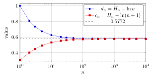

# 第 3 讲　单调数列、上确界、$e$ 与 $\gamma$ — Monotone sequences, the supremum, $e$ and Euler's $\gamma$

第 2 讲交给我们的是数列极限 (limit of a sequence) 的 $\varepsilon$–$N$ 语言、极限运算和 Stolz 定理 (Stolz’s theorem)：一旦知道该猜哪个数，就能检查误差是否最终小于任意给定的 $\varepsilon$。 可是，*不知道答案长什么样时，怎样先保证答案存在？* 本讲从这个缺口开始。

一个递增数列若始终不超过某个数，是否一定有极限？要回答这个问题，先要确定 所有项能接近的上边界。本讲沿用无限小数表示实数 (real number) 的约定； 其中依赖的存在性在欠条中列明，第 14 讲再由实数的构造证明。

单调有界定理将用来定义两个常数。第一个是 $e$：它来自多次微小增长的累积，但计算其小数还有更快的方法。 第二个是 Euler 常数 (Euler–Mascheroni constant) $\gamma$：它藏在一个缓慢增大的有限和与对数的差里。 一路要分清三件事：极限存在、极限是多少、用多少工作量能算准。三者需要不同的理由。

## 1 最小的上界 (The least upper bound)

数列 $3-2/n$ 的每一项都小于 $3$，却能超过任何小于 $3$ 的数。这里需要区分最大项与最小上界。

> [!WARNING] 先猜一猜 (Guess first)
>
>
> 数列 $3-2/n$ 在 $n=1,2,5$ 时的值是 $1,2,2.6$。你能找出最大的一项吗？ 若把“墙”放在 $2.99$，它能挡住全部项吗？先给出一个能越过它的下标，再想怎样挡住所有项。
>

> [!IMPORTANT] 定义 3.1 — 界与确界 (Bounds and extrema of bounds)
>
>
> 设 $A\subset\mathbb{R}$ 非空。若每个 $x\in A$ 都满足 $x\le M$，称 $M$ 为 $A$ 的 上界 (upper bound)，称 $A$ 有上界 (bounded above)。所有上界中最小的一个，若存在， 称为上确界 (supremum)，记为 $\sup A$。 若每个 $x\in A$ 都满足 $m\le x$，称 $m$ 为下界 (lower bound)；最大的下界称为 下确界 (infimum)，记为 $\inf A$。有下界的集合称为有下界 (bounded below)； 同时有上界和下界的集合称为有界 (bounded)。 若 $s\in A$ 且 $x\le s$ 对所有 $x\in A$ 成立，$s$ 才是最大值 (maximum)； 最小值 (minimum) 类似定义。
>

上确界若存在只能有一个：两个候选数各自不大于所有上界，特别是不大于对方。 定义暂时没有承诺它存在。先在能直接识别答案的例子里练习。

> [!NOTE] 词语提示
>
>
> *upper bound*：上界；*attained*：实际取到的；*maximum*：最大值；*member*：集合中的元素。
>

> [!NOTE] Example 3.2 — A wall that is never reached
>
>
> Let $A=\{3-2/n:n\ge1\}$. Here are some actual values:
> $$
> \begin{array}{crrrrr}
> n&1&2&5&20&200\\
> 3-2/n&1&2&2.6&2.9&2.99\\
> \end{array}
> $$
> Every member is below $3$. If $M<3$, choose an integer $n>2/(3-M)$. Then $3-2/n>M$, so $M$ is not an upper bound. Thus $\sup A=3$. No member equals $3$, so there is no maximum. In contrast, $\inf A=1$ is attained. The wall $2.99$ fails: any integer $n>200$ gives a member above it.
>

证明须处理任意 $M<3$：找到一项超过 $M$，才能排除它是上界。

### 1.1 An epsilon characterization

把刚才的 $M$ 写成 $s-\varepsilon$，便得到以后最常用的形式。

> [!NOTE] 命题 3.3 — 确界的 $\varepsilon$-刻画 (Epsilon characterization)
>
>
> 对非空集合 $A\subset\mathbb{R}$，$s=\sup A$ 当且仅当：
> $$
> x\le s\quad(x\in A),\qquad
>  \text{每个 }\varepsilon>0\text{ 都有 }x\in A\text{ 满足 }s-\varepsilon<x\le s.
> $$
> 相应地，$t=\inf A$ 当且仅当：
> $$
> t\le x\quad(x\in A),\qquad
>  \text{每个 }\varepsilon>0\text{ 都有 }x\in A\text{ 满足 }t\le x<t+\varepsilon.
> $$
> 这里的 $\sup$、$\inf$ 分别是上确界 (supremum)、下确界 (infimum)。
>

> [!NOTE] 证明
>
>
> 设 $s=\sup A$。它首先是上界；$s-\varepsilon$ 比它小，不能是上界，故某个 $x\in A$ 大于 $s-\varepsilon$。反过来，设两个条件成立。如果另有上界 $M<s$，取 $\varepsilon=s-M>0$， 第二个条件给出 $x>M$，与 $M$ 为上界矛盾。所以任何上界都不小于 $s$。
>
> 对下确界，若 $t=\inf A$，则 $t+\varepsilon$ 不是下界，故某个 $x\in A$ 小于它。 反过来，若有下界 $m>t$，取 $\varepsilon=m-t$，就会找到 $x<m$，矛盾。
>

这里是“每个精度找到*一项*”。数列收敛则要求“每个精度找到一个位置，其后*每一项*都行”。 下一节的单调性 (monotonicity) 恰好把这两句话接起来。

为了辨认上下两个方向，再把同一个数集反射一次。

> [!NOTE] 词语提示
>
>
> *sanity check*：合理性检查；*reflection*：取相反数的变换；*reverses*：使方向颠倒；*supremum*：上确界；*infimum*：下确界；*minimum*：最小值；*members*：集合中的元素；*sampled*：抽取来观察的；*bounded*：有界的。
>

> [!NOTE] Example 3.4 — Reading an infimum from above
>
>
> Let $B=\{-3+2/n:n\ge1\}$. Its sampled values are
> $$
> -1,\quad -2,\quad -2.6,\quad -2.9,\quad -2.99
> \qquad(n=1,2,5,20,200).
> $$
> All members exceed $-3$. Given $\varepsilon>0$, any integer $n>2/\varepsilon$ gives $-3<-3+2/n<-3+\varepsilon$. Therefore $\inf B=-3$, without a minimum. The maximum is $-1$, and it is also the supremum.
>
> A useful sanity check: reflection reverses order. In general, if $A$ is nonempty and bounded above and $-A=\{-x:x\in A\}$, then $\inf(-A)=-\sup A$, whenever the latter exists.
>

上确界不是数集里的“隐藏成员”，它可以在数集之外；反射后的下确界也是如此。

> [!NOTE] 词语提示
>
>
> *endpoint*：端点；*sketch*：草图；画草图；*tail*：从某项开始的尾段。
>

> [!IMPORTANT] Exercise 3.5 — Do not mistake one close term for a tail
>
>
> For $z_n=(-1)^n(3-2/n)$, first sketch the first few terms. Guess $\sup\{z_n:n\ge1\}$ and $\inf\{z_n:n\ge1\}$. Can either endpoint be the limit of the whole sequence? Explain which extra property was present in the preceding examples and is now missing.
>

这道短题让我们保留一个警觉：数集能靠近某个边界，不代表它按下标顺序一直靠近。

## 2 Building the supremum digit by digit

小数算法有一个很有用的视角：不用先知道完整答案，只问“这一位还能再增大吗”。 这不是保证有限时间算出任何集合的确界的程序；它解释确界为什么有一个位置。

> [!WARNING] 先猜一猜 (Guess first)
>
>
> 把所有满足 $x\ge0$ 且 $x^2<3$ 的数放在一起。只用乘法检验： 上边界的小数开头是 $1.7$ 还是 $1.8$？下一位呢？当所有小数位都定下后， 我们依靠什么承认它表示一个实数？
>

先试算，随后再抽出适用于任意数集的步骤。

> [!NOTE] 词语提示
>
>
> *precision*：计算精度；*increment*：增量；*bound*：界；估计。
>

> [!NOTE] Example 3.6 — Locating a boundary by multiplication
>
>
> For $A=\{x\ge0:x^2<3\}$, the tests are
> $$
> \begin{array}{ccc}
> \text{precision}&\text{below the boundary}&\text{above the boundary}\\
> 10^{-1}&1.7^2=2.89&1.8^2=3.24\\
> 10^{-2}&1.73^2=2.9929&1.74^2=3.0276\\
> 10^{-3}&1.732^2=2.999824&1.733^2=3.003289\\
> \end{array}
> $$
> Each left endpoint belongs to $A$ and each right endpoint is an upper bound. A left endpoint is not an upper bound: a sufficiently small positive increment still has square below $3$. More explicitly, if $u^2<3$ and $u\ge0$, choose $0<h<\min\{1,(3-u^2)/(2u+1)\}$; then $(u+h)^2<3$. The same question can be repeated at the next decimal place.
>

平方比较使这个集合的每一步选择都能实际算出。对一般数集，“是不是上界”仍是一个 有确定含义的问题。

> [!NOTE] 定理 3.7 — 确界存在性 (Supremum Property)
>
>
> 非空且有上界 (bounded above) 的实数集合有唯一的上确界 (supremum)。 非空且有下界 (bounded below) 的实数集合有唯一的下确界 (infimum)。
>

> [!NOTE] 证明 — 逐位小数论证
>
>
> 设 $A$ 非空且有上界。选择整数 $p$，使 $p$ 不是上界而 $p+1$ 是上界： 先从某个成员左侧的整数开始，走到一个超过已知上界的整数，在这有限串整数中找到第一次变成上界的位置。 令 $l_0=p$。
>
> 若 $l_k$ 不是上界而 $l_k+10^{-k}$ 是上界，把这段距离十等分。 在 $j=0,1,\ldots,9$ 中，选最大的、使 $l_k+j10^{-(k+1)}$ 仍不是上界的 $j$，并将该数记为 $l_{k+1}$。 于是 $l_{k+1}$ 不是上界，而 $l_{k+1}+10^{-(k+1)}$ 是上界。 选择至少有 $j=0$，所以每一步都有意义 (well-defined)。
>
> 这逐位确定一个小数 $s=p+0.d_1d_2\cdots$，即整数 $p$ 加上非负的小数部分， 也适用于负的 $p$。按小数的大小比较规则，
> $$
> l_k\le s\le l_k+10^{-k}\qquad(k\ge0).
> $$
> 允许小数尾部全为 $9$，它与相应的有限小数表示同一个数。
>
> 若某个 $x\in A$ 大于 $s$，选 $10^{-k}<x-s$，就有 $x>s+10^{-k}\ge l_k+10^{-k}$，与右端是上界矛盾。因此 $s$ 是上界。 若 $M<s$，选 $10^{-k}<s-M$，则 $l_k\ge s-10^{-k}>M$。由于 $l_k$ 不是上界，存在 $x\in A$ 满足 $x>l_k>M$， 所以 $M$ 也不是上界。这证明 $s=\sup A$。 唯一性已说明。对 $-A$ 应用上确界结论，再反射回来，便得下确界结论。
>

> [!WARNING] 欠条 (IOU) — \#2：确界存在，第 14 讲还
>
>
> 上述论证在“实数就是无限小数”的朴素约定下是证明。它使用了完备性 (completeness)： 逐位确定的无限小数确实对应实数中的一个位置。第 14 讲从 $\mathbb{Q}$ 的完备化定义出发， 重新推出确界存在性 (Supremum Property)。后面使用单调有界定理时，都沿用这张欠条。
>

## 3 Monotone sequences

若数列递增且以上确界 $s$ 为界，一旦某项大于 $s-\varepsilon$，其后的各项也都在 $(s-\varepsilon,s]$ 内。

> [!IMPORTANT] 定义 3.8 — 单调数列 (Monotone sequence)
>
>
> 若 $x_{n+1}\ge x_n$ 对所有 $n$ 成立，称数列单调递增 (monotonically increasing)， 本讲允许相等；若处处为严格不等式，称严格递增 (strictly increasing)。 单调递减 (monotonically decreasing) 与严格递减 (strictly decreasing) 类似定义。 递增或递减的数列统称单调数列 (monotone sequence)。
>

先看一个可以算出很多项、却不必靠表格保证收敛的例子。

> [!NOTE] 词语提示
>
>
> *justify*：给出理由；*ratio*：比值。
>

> [!NOTE] Example 3.9 — A decreasing sequence with an identifiable destination
>
>
> Let $x_n=(3/5)^n$. Direct computation gives
> $$
> \begin{array}{crrrrr}
> n&1&2&5&10&20\\
> x_n&0.6&0.36&0.07776&0.0060466176&0.00003656158440062976\\
> \end{array}
> $$
> The ratio $x_{n+1}/x_n=3/5$ is below $1$, so the sequence decreases and stays positive. The geometric-limit proposition in Lecture 2 already proves this limit. Here is another route: the theorem below guarantees a limit $L$. Then $x_{n+1}=(3/5)x_n$ gives $L=(3/5)L$, hence $L=0$. The order matters: first justify the existence of $L$, then solve its equation.
>

这个例子可用第 2 讲的几何数列极限直接处理。下面的定理把其中的单调性与有界性提取出来， 用于没有现成极限公式的数列；下一节的 $(1+1/n)^n$ 就是这样的应用。

> [!NOTE] 定理 3.10 — 单调有界定理 (Monotone Convergence Theorem)
>
>
> 有上界 (bounded above) 的单调递增数列 (monotonically increasing sequence) 收敛，且
> $$
> \lim_{n\to\infty}x_n=\sup\{x_n:n\ge1\}.
> $$
> 有下界 (bounded below) 的单调递减数列 (monotonically decreasing sequence) 收敛，且 其极限为 $\inf\{x_n:n\ge1\}$。因此单调数列收敛 当且仅当 它有界 (bounded)。
>

> [!NOTE] 证明
>
>
> 在递增情形，用确界存在性取 $s=\sup\{x_n:n\ge1\}$。给定 $\varepsilon>0$， 确界的 $\varepsilon$-刻画给出一个下标 $N$，使 $s-\varepsilon<x_N\le s$。 单调性随即给出
> $$
> n\ge N\quad\Longrightarrow\quad s-\varepsilon<x_N\le x_n\le s,
>  \qquad |x_n-s|<\varepsilon.
> $$
> 这正是收敛到 $s$ 的定义。递减时令 $t=\inf\{x_n:n\ge1\}$，先找 $t\le x_N<t+\varepsilon$，再用 $t\le x_n\le x_N<t+\varepsilon$。 最后，第 2 讲已证明收敛数列有界，故反方向也成立。
>

> [!WARNING] 欠条 (IOU) — \#2 的使用：单调有界定理，第 14 讲还
>
>
> 证明唯一需要的实数存在性是取 $s=\sup\{x_n\}$ 或 $t=\inf\{x_n\}$。 单调性负责将一项的接近推广到其后的整个尾段；确界存在性负责提供目标。
>

单调有界定理保证极限存在；要给出误差门槛 $N(\varepsilon)$，还需对具体数列作估计。

## 4 Two sequences defining $e$

考虑把一次总增长拆成 $n$ 次相同的小增长。每次乘上 $1+1/n$，累计得到
$$
a_n=\left(1+\frac1n\right)^n,\qquad
 b_n=\left(1+\frac1n\right)^{n+1}.
$$
底数变小，指数变大，不能只看其中一部分判断大小。

> [!WARNING] 先猜一猜 (Guess first)
>
>
> 在看表前猜：$a_{1000}$ 能把 $e$ 四舍五入到小数点后几位？ 再猜 $a_n$ 和 $b_n$ 是否从两侧靠近同一个数，$n$ 增加十倍会多获得多少位精度？
>

先以数据确定要证明的方向。表内的 $e$ 参考值由下一节的阶乘算法独立认证。

> [!NOTE] 词语提示
>
>
> *decimal places*：小数位数；*error bound*：误差上界；*rounded*：四舍五入后的。
>

> [!NOTE] Example 3.11 — A slow approach from both sides
>
>
> $$
> \begin{array}{rrrrr}
> n&a_n&b_n&e-a_n&b_n-e\\
> 10&2.593742460100&2.853116706110&0.124539368359&0.134834877651\\
> 100&2.704813829422&2.731861967716&0.013467999038&0.013580139257\\
> 1000&2.716923932236&2.719640856168&0.001357896223&0.001359027709\\
> \end{array}
> $$
> At $n=1000$, both $a_n$ and $e$ round to $2.72$ at two decimal places; at three places they round to $2.717$ and $2.718$. Thus the rounded answers agree through two decimal places. Their raw decimal prefixes agree only through $2.71$.
>
> Multiplying the last two error columns by $n$ gives, respectively,
> $$
> \begin{array}{rrr}
> n&n(e-a_n)&n(b_n-e)\\
> 10&1.245393684&1.348348777\\
> 100&1.346799904&1.358013926\\
> 1000&1.357896223&1.359027709\\
> \end{array}
> $$
> This suggests errors approximately $e/(2n)$ on both sides. The suggestion is a numerical model here; the proved error bound below is different.
>

“对了几位”必须先说明是比较小数开头、绝对误差 (absolute error)，还是比较四舍五入结果。 本讲认证小数位时一律检查整个误差区间。

![灰色竖线表示 $[a_n,b_n]$：上端下降、下端上升，区间越来越短；把它们投到同一竖轴，就能看见逐层包含的关系。](../assets/L03-fig-01.svg)
*灰色竖线表示 $[a_n,b_n]$：上端下降、下端上升，区间越来越短；把它们投到同一竖轴，就能看见逐层包含的关系。*

图 [1](#l03-fig:ebrackets) 中的区间逐层包含，宽度趋于零，称为区间套 (nested intervals)。 接下来将分别证明两端点数列单调有界且极限相同，从而定义 $e$；这里不另用区间套的存在性定理。 第 5 讲还会用类似的二分区间选择子列，那时共同交点的存在性会单独记入欠条。

### 4.1 A common arithmetic mean

下面的证明在乘积中补入一个 $1$，以便比较两组数的算术平均。先证明所需的有限不等式。

> [!NOTE] 引理 3.12 — 算术–几何平均不等式 (AM–GM inequality)
>
>
> 若 $u_1,\ldots,u_m>0$，则
> $$
> (u_1\cdots u_m)^{1/m}\le\frac{u_1+\cdots+u_m}{m}.
> $$
> 等号成立 当且仅当 所有 $u_j$ 相等。
>

> [!NOTE] 证明
>
>
> 两个数的情形来自 $(\sqrt{u_1}-\sqrt{u_2})^2\ge0$。 若结论对 $m$ 个数成立，将 $2m$ 个数分成两组：每组的几何平均不大于本组的算术平均， 再对这两个算术平均使用两个数的情形。于是结论依次对 $2,4,8,\ldots$ 个数成立。
>
> 还需从多的个数退回少的个数。假定结论对 $m$ 个数成立，给定 $m-1$ 个数，令它们的 算术平均为 $A>0$，再补入一个 $A$。由 $m$ 个数的结论， $u_1\cdots u_{m-1}A\le A^m$，消去 $A$ 即得所需结果。 对任意个数，先取一个不小于它的 $2$ 的幂，再逐步退回。 两个数的等号条件以及分组、补入步骤说明：每一步相等要求且只要求原来的数全相等。
>

> [!NOTE] 命题 3.13 — $e$ 的夹逼构造 (A two-sided construction)
>
>
> 数列 $a_n=(1+1/n)^n$ 严格递增 (strictly increasing)， $b_n=(1+1/n)^{n+1}$ 严格递减 (strictly decreasing)。它们收敛到同一极限，定义为 $e$，且
> $$
> a_n<e<b_n,\qquad 0<e-a_n<\frac4n,\qquad 0<b_n-e<\frac4n.
> $$
>

> [!NOTE] 证明
>
>
> 对 $n$ 个 $1+1/n$ 和一个 $1$ 使用 AM–GM。它们的和为 $n+2$，乘积为 $a_n$，且不全相等，故
> $$
> a_n<\left(\frac{n+2}{n+1}\right)^{n+1}=a_{n+1}.
> $$
> 对 $n+1$ 个 $n/(n+1)$ 和一个 $1$ 使用同一不等式，得
> $$
> \frac1{b_n}<\left(\frac{n+1}{n+2}\right)^{n+2}=\frac1{b_{n+1}},
> $$
> 所以 $b_{n+1}<b_n$。又 $a_n<b_n\le b_1=4$，而 $a_n\ge a_1=2$。 单调有界定理给出两个极限。由于
> $$
> 0<b_n-a_n=\frac{a_n}{n}\le\frac4n\longrightarrow0,
> $$
> 它们的极限相同，记为 $e$。严格不等式由 $a_n<a_{n+1}\le e\le b_{n+1}<b_n$ 得到。 每个单侧误差小于整个间距 $a_n/n\le4/n$。
>

> [!WARNING] 欠条 (IOU) — \#2 的使用：$e$ 存在，第 14 讲还
>
>
> 这里用单调有界定理保证两串数有极限；其存在性仍来自确界存在性。 两个边界之间的距离趋于零只负责说明极限相同，不另立存在性定理。
>

这给了一个可用但并非最优的保证：取整数 $N>4/\varepsilon$，则 $n\ge N$ 时两侧误差都小于 $\varepsilon$。 数值提示更好的主项 $e/(2n)$；它的严格渐近推导留给第 10 讲的 Taylor 公式 (Taylor’s theorem)。

## 5 A factorial algorithm

刚才的定义容易理解，但用它算许多位小数太慢。二项式公式 (binomial theorem) 提示另一条路： 固定前面的项，让 $n$ 增大，系数逐项接近阶乘的倒数。 定义阶乘 (factorial) $k!=1\cdot2\cdots k$，约定 $0!=1$，再写
$$
S_m=\sum_{k=0}^{m}\frac1{k!}.
$$
这里每个 $S_m$ 都是*有限和*。我们只研究数列 $(S_m)$，不需要一般的无穷求和理论。

> [!WARNING] 先猜一猜 (Guess first)
>
>
> 若要求绝对误差小于 $10^{-10}$，你猜要算到 $1/10!$、$1/20!$，还是更远？ 若要求*认证四舍五入到小数点后十位*，同一个误差门槛够不够？
>

先看计算结果的大小，再证明它的确在算同一个 $e$。

> [!NOTE] 词语提示
>
>
> *certificate*：可核验的误差保证；*candidate*：候选值；*remainder*：余项；*outward*：向区间外侧的；*finite*：有限的；*bounds*：上下界；*exact*：精确的。
>

> [!NOTE] Example 3.14 — Large denominators buy accuracy
>
>
> The finite sums and candidate remainder bounds are
> $$
> \begin{array}{rrr}
> m&S_m\text{ (rounded)}&1/(m!m)\text{ (rounded)}\\
> 4&2.708333333333333&1.041666667\times10^{-2}\\
> 8&2.718278769841270&3.100198413\times10^{-6}\\
> 10&2.718281801146384&2.755731922\times10^{-8}\\
> 12&2.718281828286169&1.739729749\times10^{-10}\\
> 13&2.718281828446759&1.235311064\times10^{-11}\\
> 14&2.718281828458230&8.193389713\times10^{-13}\\
> \end{array}
> $$
> The improvement from one row to the next is much faster than for $a_n$. These rounded entries show scale; use exact fractions or outward-rounded endpoints when turning the last column into a certificate.
>

要证明算法正确，需要回答两个不同的问题：有限和趋于什么数？遗漏的部分最多多大？

> [!NOTE] 定理 3.15 — 阶乘算法与余项 (Factorial algorithm and remainder)
>
>
> 有限和数列 $S_m=\sum_{k=0}^{m}1/k!$ 收敛到上节定义的 $e$。其余项 (remainder) $R_m=e-S_m$ 满足，对 $m\ge1$，
> $$
> \frac1{(m+1)!}<R_m<\frac1{m!m}.
> $$
> 常用记法 $e=\sum_{k=0}^{\infty}1/k!$ 在这里仅表示 $\lim_{m\to\infty}S_m=e$。
>

> [!NOTE] 证明
>
>
> 首先，$S_m$ 递增。对 $k\ge1$ 有 $k!\ge2^{k-1}$，故有限几何和 (finite geometric sum) 给出
> $$
> S_m\le 1+\sum_{k=1}^{m}2^{-(k-1)}=3-2^{1-m}<3\qquad(m\ge1).
> $$
> 单调有界定理给出 $S_m\to L$。二项式展开写为
> $$
> a_n=\sum_{k=0}^{n}\frac1{k!}\prod_{j=0}^{k-1}\left(1-\frac jn\right),
> $$
> 空乘积 (empty product) 取 $1$。每个乘积介于 $0$ 与 $1$ 之间，所以 $a_n\le S_n$，从而 $e\le L$。 另一方面，固定 $m$，对所有 $n\ge m$ 保留前 $m+1$ 项，得
> $$
> a_n\ge\sum_{k=0}^{m}\frac1{k!}\prod_{j=0}^{k-1}\left(1-\frac jn\right).
> $$
> 右侧只有固定数目的项。让 $n\to\infty$，每个乘积趋于 $1$，故 $e\ge S_m$。 再让 $m\to\infty$，得 $e\ge L$，因此 $L=e$。这里没有交换两个无限过程的次序。
>
> 接着固定 $m$，对任意整数 $r\ge1$，逐项比较有限和：
> $$
> S_{m+r}-S_m
>  \le\frac1{(m+1)!}\sum_{j=0}^{r-1}\frac1{(m+2)^j}
>  <\frac1{(m+1)!}\frac{m+2}{m+1}.
> $$
> 让 $r\to\infty$，得到非严格的 $\le$；但
> $$
> R_m\le\frac1{m!}\frac{m+2}{(m+1)^2}
>  <\frac1{m!m},
> $$
> 最后的严格不等式来自 $m(m+2)<(m+1)^2$。 下界则由 $e\ge S_{m+2}>S_m+1/(m+1)!$ 得到。
>

> [!WARNING] 欠条 (IOU) — \#2 的使用：有限和数列的极限，第 14 讲还
>
>
> 对递增有界的 $(S_m)$ 使用单调有界定理。其余步骤都是有限代数、有限几何和公式和数列极限运算。
>

固定 $m$ 后只有 $m+1$ 项，才能直接使用有限次加法的极限法则； 得到对每个 $m$ 都成立的不等式后，再让 $m$ 增大。

### 5.1 Ten decimal places by hand

前一页的表是算法说明，不必依赖计算器内置的 $e$。用长除法计算阶乘倒数，再保留保护位 (guard digits)，就能自己制造一个包含答案的短区间。

> [!NOTE] 词语提示
>
>
> *denominator*：分母；*reciprocal*：倒数；*rounding*：四舍五入；*certify*：给出严格保证；*even*：甚至。
>

> [!NOTE] 词语提示
>
>
> *straddle*：横跨两侧；*accumulated*：累积的；*guard digits*：保护位。
>

> [!NOTE] Example 3.16 — A reproducible decimal certificate
>
>
> Compute each reciprocal by long division with the exact integer $k!$ as denominator. Rounded to fourteen decimal places, the nontrivial entries through $1/13!$ are
> $$
> \begin{array}{rrrr}
> k&1/k!&k&1/k!\\
> 2&0.50000000000000&8&0.00002480158730\\
> 3&0.16666666666667&9&0.00000275573192\\
> 4&0.04166666666667&10&0.00000027557319\\
> 5&0.00833333333333&11&0.00000002505211\\
> 6&0.00138888888889&12&0.00000000208768\\
> 7&0.00019841269841&13&0.00000000016059\\
> \end{array}
> $$
> Add the two initial terms, both equal to $1$. The displayed sum is $2.71828182844676$. Even allowing rounding in all fourteen terms, the accumulated rounding error is at most $14(0.5\times10^{-14})=7\times10^{-14}$. Thus the hand calculation gives a short interval once the remainder bound is added.
>
> There is a subtle problem: even the *exact* interval at $m=13$ straddles $2.71828182845$, the rounding boundary between $2.7182818284$ and $2.7182818285$. Its endpoints are approximately
> $$
> S_{13}=2.718281828446759\ldots,\qquad
>  S_{13}+\frac1{13!\,13}=2.718281828459112\ldots.
> $$
> So the small error by itself does not certify the rounded answer.
>
> One more term resolves this. For the hand calculation, add $1/14!\approx0.00000000001147$ to obtain $T=2.71828182845823$. Rounding all fifteen terms introduces at most $7.5\times10^{-14}$ of error, so
> $$
> T-7.5\times10^{-14}<e<T+7.5\times10^{-14}+\frac1{14!\,14}.
> $$
> Both endpoints round to the same ten-place decimal. An independent check by exact rational addition gives
> $$
> S_{14}=\frac{47395032961}{17435658240},\qquad
>  R_{14}<\frac1{14!\,14}.
> $$
> Outward rounding of these rational endpoints gives
> $$
> 2.718281828458229<e<2.718281828459050.
> $$
> Every number in this interval rounds to
> $$
> \boxed{e=2.7182818285\quad\text{to ten decimal places}.}
> $$
> This uses fifteen terms, counting $1/0!$ and $1/1!$ separately. Exact fractions also prevent errors from accumulating during repeated decimal division.
>

是否需要再保留一项，取决于误差区间是否跨过舍入边界。 如果只要绝对误差小于 $10^{-10}$，$m=13$ 已足够；要求认证舍入结果，则上面的简单区间需要 $m=14$。

### 5.2 有理数列的无理极限 (An irrational limit of rational numbers)

第 1 讲遇到 $\sqrt2$ 时，有理近似并不保证极限仍是有理数 (rational number)。 这里每个 $S_m$ 都是有理数，但它们的共同目标是无理数 (irrational number)。 这一次，余项小到能挤在两个相邻整数之间。

> [!NOTE] 定理 3.17 — $e$ 的无理性 (Irrationality of $e$)
>
>
> 数 $e$ 是无理数 (irrational number)。
>

> [!NOTE] 证明
>
>
> 假设 $e=p/q$，其中 $p\in\mathbb{Z}$，$q$ 为正整数。选整数 $m\ge\max\{q,2\}$。 因为 $q$ 整除 $m!$，$m!e$ 是整数；每个 $m!/k!$ 也是整数，所以
> $$
> m!R_m=m!e-\sum_{k=0}^{m}\frac{m!}{k!}
> $$
> 是整数。但余项界给出 $0<m!R_m<1/m<1$。整数不可能严格位于 $0$ 与 $1$ 之间，矛盾。
>

这不是从很长的小数里猜“不会循环”，而是用一个对所有可能分母 $q$ 都有效的误差界，排除所有分数。

## 6 Subtracting growth to reveal $\gamma$

令调和和 (harmonic sum) 为
$$
H_n=\sum_{k=1}^{n}\frac1k.
$$
每一项都小了，但加的项越来越多。前面给出的求和–差分工具会帮助我们识别它的增长规模。 本节使用熟悉的自然对数 (natural logarithm) $\ln x=\log_e x$：它严格递增， 满足 $\ln(xy)=\ln x+\ln y$、$\ln(x^r)=r\ln x$（此处只需整数 $r$），以及 $\ln e=1$。 把这些初等对数运算作为已知背景；本节不使用对数的导数或积分表达式。

> [!WARNING] 先猜一猜 (Guess first)
>
>
> 先猜 $H_{10^6}$ 的量级：十几、几百，还是几千？ 再看 $d_n=H_n-\ln n$。你猜它仍会无界增长，趋于零，还是停在一个正数附近？
>

先把两个大一些的量和它们的差放在同一张表里。

> [!NOTE] 词语提示
>
>
> *rule out*：排除。
>

> [!NOTE] Example 3.18 — A stable difference hiding inside growth
>
>
> $$
> \begin{array}{rrrr}
> n&H_n&\ln n&d_n=H_n-\ln n\\
> 10&2.928968254&2.302585093&0.626383161\\
> 100&5.187377518&4.605170186&0.582207332\\
> 1000&7.485470861&6.907755279&0.577715582\\
> 10000&9.787606036&9.210340372&0.577265664\\
> 100000&12.090146130&11.512925465&0.577220665\\
> \end{array}
> $$
> Each tenfold increase of $n$ adds roughly the same amount to $H_n$. The differences decrease and appear to stabilize near $0.5772$. A picture can suggest this; it cannot rule out a very slow later drift.
>

证明要比较相邻的差。恰好，前面夹住 $e$ 的两个幂，取对数后就夹住我们需要的对数增量。

> [!NOTE] 引理 3.19 — 对数增量的夹逼 (Bounds for a logarithmic increment)
>
>
> 对每个整数 $n\ge1$，
> $$
> \frac1{n+1}<\ln\left(1+\frac1n\right)<\frac1n.
> $$
>

> [!NOTE] 证明
>
>
> 对 $a_n<e<b_n$ 使用严格递增的 $\ln$，再用整数幂的对数法则，得
> $$
> n\ln(1+1/n)<1<(n+1)\ln(1+1/n).
> $$
> 分别除以正数 $n$ 与 $n+1$ 即得结论。
>

这是本讲从幂到对数的桥。整个推导只用对数的次序与代数法则，不用面积或斜率。

### 6.1 存在性和一个可用的误差界 (Existence and a usable bound)

> [!NOTE] 定理 3.20 — Euler 常数的存在 (Existence of Euler's constant)
>
>
> 数列 $d_n=H_n-\ln n$ 严格递减 (strictly decreasing) 且有下界 (bounded below)， 其极限记为 $\gamma$。若 $c_n=H_n-\ln(n+1)$，则 $c_n$ 严格递增 (strictly increasing)，且
> $$
> c_n<\gamma<d_n,\qquad
>  0<d_n-\gamma<\ln(1+1/n)<\frac1n.
> $$
>

> [!NOTE] 证明
>
>
> 相邻项相减，用刚才的不等式左半边：
> $$
> d_{n+1}-d_n=\frac1{n+1}-\ln(1+1/n)<0.
> $$
> 用右半边，对 $k=1,\ldots,n$ 相加并消去相邻对数，得
> $$
> \ln(n+1)=\sum_{k=1}^{n}\ln(1+1/k)<H_n,
> $$
> 所以 $d_n>\ln(1+1/n)>0$。单调有界定理给出极限 $\gamma\ge0$。
>
> 再算下边界的增量：
> $$
> c_{n+1}-c_n=\frac1{n+1}-\ln(1+1/(n+1))>0.
> $$
> 同时 $d_n-c_n=\ln(1+1/n)<1/n\to0$，因此 $c_n\to\gamma$。 严格单调性给出 $c_n<c_{n+1}\le\gamma\le d_{n+1}<d_n$。 两侧相减就得到误差界。
>

> [!WARNING] 欠条 (IOU) — \#2 的使用：$\gamma$ 存在，第 14 讲还
>
>
> 这里对递减且有下界的 $(d_n)$ 使用单调有界定理，仍依赖确界存在性。 $\gamma$ 的数值和误差大小是其后的计算问题，不是存在性假设。
>

证明给出了可检验的区间。现在再画图，图中的“共同高度”就有了依据。

*横轴按倍数展开，观察上下两串值如何夹住共同高度；虚线只是四位小数近似，实线连接的是实际计算的离散点。*

区间宽度小于 $1/n$ 已经够用。更精确的首项 $1/(2n)$ 将在实验中出现；此处不把拟合当作证明。

### 6.2 一百万项究竟有多大 (How large is a million-term sum?)

先用较小的计算认证 $\gamma$，再用误差界预测更大的和，最后直接求和核对。

> [!NOTE] 词语提示
>
>
> *significant digits*：有效数字；*directed rounding*：有指定方向的舍入；*comparison*：比较；*logarithm*：对数；*estimate*：估计；*predict*：预测。
>

> [!NOTE] Example 3.21 — Predict first, then check
>
>
> Direct summation at $N=100000$, together with the logarithmic bounds, gives
> $$
> c_N=0.577210664943199\ldots,
>  \qquad d_N=0.577220664893199\ldots.
> $$
> Both endpoints round to $0.5772$ at four decimal places, so $\gamma=0.5772$ to four decimal places. No library value of $\gamma$ is needed. For this certificate, the sums were computed with sixty significant digits and directed rounding; each logarithm was enclosed with an additional $10^{-55}$ margin. The final displayed bounds are rounded outward.
>
> For $M=10^6$, the theorem says
> $$
> H_M=\ln M+\gamma+r_M,\qquad 0<r_M<10^{-6}.
> $$
> Using the entire interval for $\gamma$, rather than just its rounded value, produces the outward-rounded certificate
> $$
> 14.3927212229<H_{10^6}<14.3927322229.
> $$
> Thus $H_{10^6}$ rounds to $14.3927$ at four decimal places, and to $14.39$ at two. Direct summation, performed only after making this prediction, gives
> $$
> H_{10^6}=14.392726722865723\ldots.
> $$
> By comparison, using only $\ln(10^6)+0.5772$ gives $14.392710557964274\ldots$. It is a useful rough estimate, but its error is not bounded by $10^{-6}$: rounding $\gamma$ has already introduced another source of error.
>

一个常数即使只知道几位，也能解释庞大计算的主要结构。不过，必须分别记住常数的误差与公式的误差。 这里一百万项的答案只有十几，不是因为后面没有贡献，而是因为贡献按倍数区间逐渐趋于稳定。

### 6.3 Stolz and the growth rate

表中的 $H_n$ 与 $\ln n$ 接近，但相差一个非零常数。相对比较时，这个常数会消失。

> [!NOTE] 推论 3.22 — 调和和的相对增长 (Relative growth of harmonic sums)
>
>
> $$
> \frac{H_n}{\ln n}\longrightarrow1\qquad(n\to\infty, n\ge2).
> $$
>

> [!NOTE] 证明
>
>
> 先检查 Stolz 定理的分母条件。$\ln n$ 严格递增且趋于 $+\infty$：当 $n\ge2^j$ 时， $\ln n\ge j\ln2$，而 $\ln2>0$。相邻增量的比为
> $$
> \frac{H_{n+1}-H_n}{\ln(n+1)-\ln n}
>  =\frac{1/(n+1)}{\ln(1+1/n)}.
> $$
> 对数增量界给出
> $$
> \frac n{n+1}<\frac{1/(n+1)}{\ln(1+1/n)}<1.
> $$
> 两端趋于 $1$，故中间趋于 $1$。第 2 讲的 Stolz 定理给出结论。
>

也可以从 $H_n=\ln n+d_n$ 和 $d_n\to\gamma$ 立即读出结论。 两条路看见不同的信息：Stolz 比较增量，$\gamma$ 则留下绝对差。

## 7 Fitting and certification

同一幅图可以支持好几种猜测。实验中要保留没有参与拟合的数据，检查猜测是否还有效； 要求精确小数时，则必须返回证明过的误差界。

> [!NOTE] 词语提示
>
>
> *horizontal*：水平的；*certified*：有严格保证的；*width*：宽度；*at least*：至少。
>

> [!NOTE] 词语提示
>
>
> *fit*：拟合；*intercept*：截距；*proxy*：替代估计量；*diagnostic*：用于检查的量。
>

> [!NOTE] AI Lab — Two constants, two kinds of evidence
>
>
> **Part A: fit the approach to $\gamma$.** Ask an AI to write code that directly computes $H_n$, $d_n=H_n-\ln n$, and $c_n=H_n-\ln(n+1)$ using at least forty working decimal digits. Use a logarithmic horizontal axis for $n=10,100,1000,10000,100000$. Do not supply a built-in value of $\gamma$ to the fit.
>
> Fit the model $d_n\approx G+C/n$ using the larger sample sizes, then test it on unused intermediate sizes. Report both $G$ and $C$, and how they change when you remove the smallest sample. Does $C$ appear close to $1/2$? Require $G$ to be compared with the certified interval $(c_{100000},d_{100000})$. Explain why a plausible fit is not a proof of an asymptotic formula.
>
> A second diagnostic avoids fitting an intercept. Set $M=10^6$ and examine $n(d_n-d_M)$ for $n\ll M$. Direct computation gives
> $$
> \begin{array}{rrrr}
> n&10&100&1000\\
> n(d_n-d_M)&0.491669961&0.499116675&0.499416667\\
> \end{array}
> $$
> Since $0<d_M-\gamma<1/M$, the true scaled error $n(d_n-\gamma)$ lies between the displayed diagnostic and that diagnostic plus $n/M$, before allowing for rounding of the displayed values. Why must this proxy fail when $n$ becomes comparable with $M$?
>
> **Part B: certify thirty decimal places of $e$.** Ask the AI to use exact rational arithmetic for $S_m$ and $1/(m!m)$. Increase $m$ until *both* endpoints of $[S_m,S_m+1/(m!m)]$ round to the same thirty-place decimal. Report $m$, the number of terms, the interval width, and the rounded result. Then repeat with high-precision decimal arithmetic, retaining enough guard digits. Do the certified digits agree?
>
> **Check values, to inspect after running your code.** The choice $m=28$ works (twenty-nine terms). The interval width is less than $1.172\times10^{-31}$, and both endpoints round to
> $$
> 2.718281828459045235360287471353.
> $$
> The lower endpoint is already above the relevant rounding boundary. Do not replace this check by asking the AI whether it is confident.
>
> **Questions to answer in your report.** Which assertions are observations, which are proved inequalities, and which are claims about the arithmetic used by the program? If you change the working precision, which digits in the output remain certified?
>

AI 可以承担大量求和、绘图和寻找模式的工作。数学上的责任仍很明确：知道图画的是什么， 知道误差区间从哪里来，知道某一条看似精确的输出究竟经过了哪种检验。

## 8 Exercises

> [!NOTE] 词语提示
>
>
> *absolute error*：绝对误差；*certification*：严格误差核验；*monotonicity*：单调性；*certificate*：可核验的误差保证；*arbitrarily*：任意地；*error bound*：误差上界；*certified*：有严格保证的；*threshold*：门槛；*factorial*：阶乘；*endpoint*：端点；*rounding*：四舍五入；*monotone*：单调的；*supremum*：上确界；*estimate*：估计；*predict*：预测；*infimum*：下确界；*maximum*：最大值；*outward*：向区间外侧的；*bounded*：有界的；*sketch*：草图；画草图；*member*：集合中的元素；*exact*：精确的；*index*：下标；*tail*：从某项开始的尾段。
>

1. **3.1**  **A missing maximum.** For $A=\{4-3/(n+1):n\ge1\}$, predict its supremum and infimum before computing. Tabulate the terms with $n=1,4,9,99$. For an arbitrary $\varepsilon>0$, give an explicit member within $\varepsilon$ of the supremum. Which endpoint belongs to $A$?

1. **3.2**  **(homework) Decimal walls.** For $B=\{x\ge0:x^2<7\}$, locate the supremum between two adjacent three-place decimals using integer multiplication. Then reconstruct the digit-by-digit argument for an arbitrary nonempty bounded-above set. Explain the exact point where the naive real-number convention is used.

1. **3.3**  **A tail is stronger than a sample.** Sketch the first twelve terms of $u_n=2+(-1)^n/(n+1)$. Guess its limit, its supremum, and its infimum. Give an error bound for the limit. Explain why convergence here does not come from monotonicity of the whole sequence.

1. **3.4**  **Rate versus existence.** Let $v_n=1-1/\ln(n+2)$. First estimate how large $n$ must be for $v_n>0.9$, then obtain an exact inequality describing the allowable integers. Prove that $(v_n)$ is increasing, bounded, and converges to $1$. Does the Monotone Convergence Theorem alone provide your numerical threshold?

1. **3.5**  **(homework) A computational budget.** Suppose the target is absolute error below $10^{-8}$ in computing $e$. Before computing, compare the likely cost of $a_n$ with that of $S_m$. Use $4/n$ and $1/(m!m)$ to give rigorous sufficient choices of $n$ and $m$. Then check whether the resulting factorial interval certifies eight-place rounding. Distinguish a sufficient choice from a smallest possible choice.

1. **3.6**  **The first omitted term.** Predict the size of $(m+1)!(e-S_m)$ from the factorial table. Use the proof’s sharper bound
    $$
    \frac1{(m+1)!}<e-S_m\le\frac1{(m+1)!}\frac{m+2}{m+1}
    $$
    to prove that this scaled error tends to $1$. Compute it for three values of $m$ using a separately certified interval for $e$.

1. **3.7**  **How many more terms?** Guess $H_{10^8}-H_{10^5}$ before evaluating either long sum. Use $H_n=\ln n+\gamma+r_n$ with $0<r_n<1/n$ to bound its distance from $\ln(10^3)$. Give a decimal interval with outward rounding. Why does the uncertainty in $\gamma$ cancel completely?

1. **3.8**  **(homework) Threefold blocks.** Set $T_n=H_{3n}-H_n$. Predict its limit, then compute $T_2,T_{20},T_{200}$. Prove your prediction using the convergence of $H_n-\ln n$. Show that $|T_n-\ln3|<1/n$ without using an integral. Can you determine which side of $\ln3$ contains every $T_n$?

1. **3.9**  **An attractive but false certificate.** A program reports $S_{13}$ with absolute error less than $10^{-13}$ and claims: “Since $e-S_{13}<1.3\times10^{-11}$, rounding my output to ten places gives $e$.” Predict the failure before doing the arithmetic. Use exact rational endpoints to locate the rounding boundary and write a corrected certification rule. Then test your rule at $m=14$.

1. **3.10** **Can an increasing bounded sequence be arbitrarily slow?** First sketch an increasing sequence approaching $1$ that stays at $0$ until a chosen, extremely large index. Now make the challenge indefinite: given any increasing positive integer sequence $N_j\to\infty$, construct an increasing bounded sequence $(w_n)$ with $w_n\to1$ and $1-w_{N_j}\ge1/(j+1)$ for every $j\ge1$. Plateaus are allowed. Explain why no universal rate follows from monotonicity and boundedness alone.

> [!NOTE] 回望 (Looking back)
>
>
> 上确界的 $\varepsilon$-刻画与单调性给出单调有界定理，并用于定义 $e$ 与 $\gamma$。其存在性仍记在欠条 \#2 中。下一讲用这些工具研究 $x_{n+1}=f(x_n)$ 的收敛性与误差。
>
