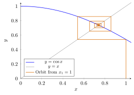
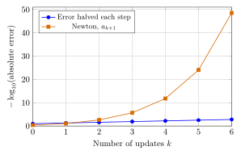
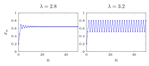
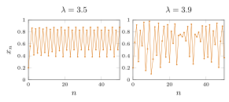
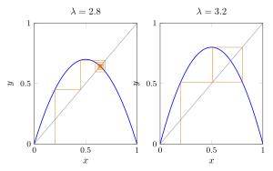
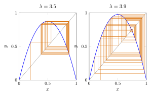

# 第 4 讲　迭代数列：蜘蛛网、压缩与牛顿法的速度 — (Iterated sequences: cobwebs, contractions, and Newton's speed)

第 3 讲交给我们单调有界定理 (Monotone Convergence Theorem)：数列 (sequence) 若一直朝同一方向走，又有一道越不过去的界，就有极限 (limit)。 这一讲要把这件工具带回计算现场。一个算法 (algorithm) 反复执行同一条指令， 前几步看起来越来越稳定，这究竟是可靠的规律，还是屏幕上的错觉？

我们的对象是迭代数列 (iterated sequence)：从一个初值 (initial value) 出发， 反复计算 $x_{n+1}=f(x_n)$。我们关心三件不同的事：它是否收敛 (converge)， 收敛到哪里，以及还要算多少步才够准。解出一个方程只能回答第二件事的候选答案； 一张图能帮助猜第一件事；第三件事需要可计算的误差界 (error bound)。

第 1 讲留下了两个很不一样的轨迹：求平方根的牛顿法 (Newton’s method) 突然算得极准，$b_{n+1}=1+1/b_n$ 却反复越过目标。 这次我们要解释这种差别。先看轨迹，再找可反复使用的不等式；证明的任务， 是把眼睛看见的趋势变成对任意精度都有效的保证。

## 1 把迭代画出来 (Drawing an iteration)

所有三角函数的输入都用弧度 (radians)。先不要解方程，也不要调用软件的求根按钮。 让计算器只做一件事：把刚算出的答案送回同一个函数。

> [!WARNING] 先猜一猜 (Guess first) — Repeated cosine updates
>
>
> 从 $x_1=1$ 开始，计算 $x_{n+1}=\cos x_n$。先猜：它会单调下降， 来回振荡 (oscillate)，还是越走越远？如果两个相邻小数很接近， 你愿意把哪几位当作已经可靠？先画一个大概的轨迹，再看表。
>

> [!NOTE] 词语提示
>
>
> *alternating*：交替的；*rounded*：四舍五入后的；*indices*：下标；*even*：偶数的；*odd*：奇数的。
>

> [!NOTE] Example 4.1 — Pressing the cosine button
>
>
> Starting with $x_1=1$, use the unrounded output as the next input. Only the displayed values are rounded.
>
> |   $n$ |        1 |        2 |        3 |        4 |        5 |
> |--------:|---------:|---------:|---------:|---------:|---------:|
> | $x_n$ | 1.000000 | 0.540302 | 0.857553 | 0.654290 | 0.793480 |
>
> The first move is downward, but the next move is upward. The values suggest an alternating approach to a number between $0.7$ and $0.8$. This is a prediction, not a convergence proof. A sensible next computation is to separate the odd and even indices, rather than simply print more digits.
>

这里的振荡并没有否定收敛。它否定的是“整个数列一直往同一方向走”。 我们需要一种图，把函数的形状和数列的移动连起来。

> [!IMPORTANT] 定义 4.2 — 蜘蛛网图 (Cobweb diagram) 与不动点 (Fixed point)
>
>
> 给定函数 (function) $f$ 和初值 $x_1$，在同一坐标系画 $y=f(x)$ 与 $y=x$。 从 $(x_1,0)$ 竖直走到 $(x_1,f(x_1))=(x_1,x_2)$， 再水平走到 $(x_2,x_2)$；重复“竖直到曲线，水平到对角线”，所得折线称为 蜘蛛网图 (cobweb diagram)。满足 $f(r)=r$ 的数 $r$ 称为不动点 (fixed point)。 它对应两条曲线交点的横坐标。
>

图：每一条水平线把输出变成下一次输入；留意折线怎样反复跨过对角线的交点。

图上每次水平转弯都在 $y=x$ 上，因为那里横、纵坐标相同。蜘蛛网不是随手画的 螺旋：它的每一个角点都有递推式 (recurrence relation) 作依据。 $y=f(x)$ 高于 $y=x$ 的位置满足 $f(x)>x$，所以下一步向右；低于对角线则向左。 但“向着交点走”和“不会跨得太远”是两回事。

> [!NOTE] 词语提示
>
>
> *horizontal*：水平的；*endpoint*：端点；*diagonal*：对角线；*vertical*：竖直的；*predict*：预测。
>

> [!IMPORTANT] Exercise 4.3 — Read a corner before drawing the next one
>
>
> In the cosine diagram, start at $(x_2,x_2)$ with $x_2\approx0.540302$. Predict the direction of the next vertical segment, then calculate its endpoint. Explain why the following horizontal segment ends at $(x_3,x_3)$. Finally, label one corner that lies on the curve and one that lies on the diagonal.
>

画图时最容易出错的不是函数图像，而是把“水平到对角线”误画成“水平到纵轴”。 能逐点读出坐标，才算会使用这张图。

## 2 Increasing maps preserve direction

“函数递增”和“数列递增”不是同一句话。前者比较不同输入，后者比较相邻时间。 连接它们的桥梁，是第一次移动的方向。

> [!WARNING] 先猜一猜 (Guess first) — 方向由谁决定？
>
>
> 对 $f(x)=\sqrt{3+x}$，分别从 $1$ 与 $3$ 出发。两条轨迹都会递增吗？ 先用 $f(x)-x$ 的正负猜，再各算几步。函数递增是否允许两条轨迹朝相反方向移动？
>

先看一个可以用整数界控制的实例。根号使直接比较小数不方便， 但把式子平方以后，迭代的结构反而更清楚。

> [!NOTE] 词语提示
>
>
> *monotonicity*：单调性；*increments*：增量；*comparison*：比较；*candidate*：候选值。
>

> [!NOTE] Example 4.4 — A radical iteration with a visible ceiling
>
>
> Let $u_0=1$ and $u_{n+1}=\sqrt{3+u_n}$. Computation gives
>
> |   $n$ |        0 |        1 |        2 |        3 |        4 |
> |--------:|---------:|---------:|---------:|---------:|---------:|
> | $u_n$ | 1.000000 | 2.000000 | 2.236068 | 2.288246 | 2.299619 |
>
> The increments shrink. Guess a limit near $2.3$, but first find a ceiling: if $1\le u_n\le3$, then $1\le\sqrt{3+u_n}\le\sqrt6<3$. Also $u_1>u_0$, and the square-root map preserves inequalities. Thus each comparison $u_n\ge u_{n-1}$ produces the next one.
>
> Once convergence to $L$ is justified, use $u_{n+1}^2=3+u_n$ and the limit rules from Lecture 2: $L^2=3+L$. The positive candidate is
> $$
> L=\frac{1+\sqrt{13}}2\approx2.302775638.
> $$
> The equation identifies the limit only after monotonicity and boundedness have established that a limit exists.
>

这个例子先后用了三个条件：找不会逃出的区间 (interval)，传递第一次的比较， 最后才取极限。方程 $L^2=L+3$ 本身并没有证明轨迹会到达 $L$ 附近。

> [!NOTE] 定理 4.5 — 递增迭代的单调性 (Monotonicity of increasing iterations)
>
>
> 设 $f$ 把区间 $I$ 映到自身，且递增 (increasing，此处允许相等)： $x\le y$ 蕴含 $f(x)\le f(y)$。对迭代数列 (iterated sequence) $x_{n+1}=f(x_n)$，若 $x_2\ge x_1$，则数列单调递增 (monotone increasing)； 若 $x_2\le x_1$，则数列单调递减 (monotone decreasing)。 若该数列还有界 (bounded)，则它收敛 (converges)。
>

> [!NOTE] 证明
>
>
> 以 $x_2\ge x_1$ 为例。若 $x_{n+1}\ge x_n$，则 $x_{n+2}=f(x_{n+1})\ge f(x_n)=x_{n+1}$。 数学归纳法 (mathematical induction) 把第一次比较传到每一步。 把所有不等号反向，就得到另一种情形。最后应用第 3 讲的单调有界定理。
>

> [!WARNING] 欠条 (IOU) — \#2 的使用：第 14 讲还
>
>
> 这里的“单调有界数列收敛”沿用第 3 讲由上确界 (supremum) 得到的结论。 上例的 $u_n$ 与本定理的收敛都经过这一处。没有新欠条；第 14 讲还。
>

定理保证收敛。要由递推式求出极限，还需检查能否把极限代入函数。

### 2.1 什么时候可以把极限代回去？ (When may we pass to the limit?)

若 $x_n\to L$，则去掉首项不改变极限，所以 $x_{n+1}\to L$。 可是从 $x_n\to L$ 到 $f(x_n)\to f(L)$，不能只靠符号长得相像。 下一例故意在极限处改变函数值，检查我们的论证是否真的用到了它。

> [!NOTE] 词语提示
>
>
> *nondecreasing*：单调不减的；*fixed point*：不动点；*induction*：数学归纳法；*iterate*：迭代项；*orbit*：迭代轨迹。
>

> [!NOTE] Example 4.6 — A limit that is not a fixed point
>
>
> On $[0,2]$, define
> $$
> f(x)=\begin{cases}(x+1)/2,&0\le x<1,\\[2pt]2,&1\le x\le2.\end{cases}
> $$
> This function is nondecreasing and maps $[0,2]$ into itself. Starting with $x_0=0$ gives
> $$
> 0,\quad 0.5,\quad 0.75,\quad 0.875,\quad 0.9375,\quad\ldots,
> \qquad x_n=1-2^{-n}.
> $$
> The formula follows by substitution and induction; it proves $x_n\to1$. Every term lies below $1$, so every iterate is defined. Nevertheless $f(1)=2\ne1$. Along this orbit, $f(x_n)\to1$, not $f(1)$.
>

问题发生在终点的一次跳跃 (jump)，不是发生在数列的单调性上。 我们会在第 7 讲正式研究连续性 (continuity)。本讲只使用下面明确的保极限条件， 每遇到一个函数就说明为什么满足。

> [!NOTE] 命题 4.7 — 识别极限 (Identifying a limit)
>
>
> 设迭代数列 (iterated sequence) $x_{n+1}=f(x_n)$ 收敛到定义域内的 $L$。 如果 $f(x_n)\to f(L)$，则 $L$ 是不动点 (fixed point)。 更一般地，若 $f$ 在 $L$ 具有保极限性质：任意定义域内数列 $t_n\to L$ 均满足 $f(t_n)\to f(L)$，则此结论适用。
>

> [!NOTE] 证明
>
>
> 由递推式，$f(x_n)$ 与 $x_{n+1}$ 是同一个数列。前者的极限是 $f(L)$， 后者的极限是 $L$。由第 2 讲的极限唯一性 (uniqueness of limits)，$f(L)=L$。
>

对于根号例子，我们使用平方后的等式及四则运算的极限法则，绕开了任何尚未证明的 一般函数定理。另一个常用办法是找到常数 $C$ 使
$$
|f(x)-f(y)|\le C|x-y|.
$$
代入 $x=x_n,y=L$，右端趋于零，左端也趋于零。 这不仅允许代回极限，还能告诉我们差距如何传播；稍后会用它控制整个算法。

> [!NOTE] 词语提示
>
>
> *audit*：核查。
>

> [!IMPORTANT] Exercise 4.8 — Audit a tempting proof
>
>
> A program finds a solution of $f(r)=r$ and reports: “Therefore every iteration of $f$ converges to $r$.” Test this sentence with $f(x)=2x$ and $x_0=1$. Compute four terms, identify the fixed point, and write one sentence explaining exactly which missing step the computation exposes.
>

存在一个目标，并不意味着每一个初值都会接近它。这是迭代问题最基本的核查。

## 3 Decreasing maps and parity

现在回收第 1 讲的作业。函数 $f(x)=1+1/x$ 在正数上递减 (decreasing)， 一次迭代会反转输入的大小关系；做两次，又会把大小关系转回来。

> [!WARNING] 先猜一猜 (Guess first) — 隔一步看，会不会更整齐？
>
>
> 把 $b_1=1,\ b_{n+1}=1+1/b_n$ 的前几项分成奇数位置和偶数位置。 猜哪一组在上升，哪一组在下降。即使两组各有极限，它们会不会不同？ 不要让这一个例子的答案代替一般结论。
>

> [!NOTE] 词语提示
>
>
> *bracket*：夹住目标的区间；*parity*：奇偶性；*tracks*：分支；*exact*：精确的。
>

> [!NOTE] Example 4.9 — Recovering the oscillating homework orbit
>
>
> Exact fractions keep the alternation visible:
>
> |   $n$ |     1 |     2 |       3 |       4 |       5 |        6 |         7 |         8 |
> |--------:|------:|------:|--------:|--------:|--------:|---------:|----------:|----------:|
> | $b_n$ | $1$ | $2$ | $3/2$ | $5/3$ | $8/5$ | $13/8$ | $21/13$ | $34/21$ |
>
> Thus $b_7\approx1.615385$ and $b_8\approx1.619048$ already give a narrow visual bracket. The odd terms appear to increase; the even terms appear to decrease. The interval $[1,2]$ is invariant: $1\le x\le2$ implies $3/2\le1+1/x\le2$.
>
> To see the mechanism, calculate two steps at once:
> $$
> f(f(x))=1+\frac{x}{x+1}=2-\frac1{x+1}.
> $$
> This expression is increasing. Both parity tracks follow this same increasing map, with different starting values.
>

只取某些位置并保留原来顺序，得到子列 (subsequence)。本讲只需奇数项子列和偶数项 子列；它们让一条振荡轨迹变成两条有方向的轨迹。

> [!NOTE] 定理 4.10 — 奇偶单调性 (Monotonicity of parity subsequences)
>
>
> 设 $f:I\to I$ 递减 (decreasing，允许相等)。则迭代数列 (iterated sequence) 的奇数项子列和偶数项子列 (odd and even subsequences) 各自单调 (monotone)， 方向相反或其中一条成为常数。若原数列有界 (bounded)，则两条子列各自收敛。
>

> [!NOTE] 证明
>
>
> 若 $x\le y$，则 $f(x)\ge f(y)$，再次使用递减性得到 $f(f(x))\le f(f(y))$。因此 $g=f\circ f$ 递增。 奇数项和偶数项都是 $g$ 的迭代，由前一定理各自单调。 若 $x_3\ge x_1$，则 $x_4=f(x_3)\le f(x_1)=x_2$； 若 $x_3\le x_1$，则反向。若有界，对两条子列分别应用单调有界定理即可。
>

> [!WARNING] 欠条 (IOU) — \#2 的使用：第 14 讲还
>
>
> 奇偶两条子列的极限存在，再次使用第 3 讲的单调有界定理；第 14 讲还。 这一步尚未断言两个极限相等。
>

### 3.1 Do the odd and even subsequences have the same limit?

在 $b_n$ 的例子里，单调有界给了两个候选终点。要让整个数列收敛， 必须再证明它们是同一个数；“看上去很近”不能代替这一步。

> [!NOTE] 词语提示
>
>
> *oscillation*：振荡；*eventually*：从某一项起始终；*reciprocal*：倒数；*magnitude*：数量级；*factor*：因子；*gap*：两项之差的绝对值。
>

> [!NOTE] Example 4.11 — Closing the gap between odd and even terms
>
>
> Write $b_{2k-1}\to\alpha$ and $b_{2k}\to\beta$. Both limits lie in $[1,2]$, so the reciprocal limit rule is applicable. Passing to the limit in the two one-step relations gives
> $$
> \beta=1+\frac1\alpha,\qquad \alpha=1+\frac1\beta.
> $$
> Multiplying the first equation by $\alpha$ and the second by $\beta$ yields $\alpha\beta=\alpha+1=\beta+1$, hence $\alpha=\beta$. The common value is
> $$
> r=\frac{1+\sqrt5}{2}\approx1.618033989.
> $$
> For a direct check on the oscillation, subtract $r=1+1/r$:
> $$
> b_{n+1}-r=-\frac{b_n-r}{b_n r}.
> $$
> The sign changes at every step. The magnitude is eventually multiplied by a factor near $1/r^2\approx0.381966011$. For comparison, the errors at $n=4,8,12$ are approximately $4.863268\times10^{-2}$, $1.013630\times10^{-3}$, and $2.156681\times10^{-5}$. More steps buy more accuracy, but no sudden squaring of the error occurs.
>

两个极限相等之后，还需把结论装回整个数列。下面这一小段是往后使用子列时 会反复出现的 $\varepsilon$–$N$ 动作。

> [!NOTE] 证明 — 合并奇偶项的证明
>
>
> 设两条子列都趋于 $r$。给定 $\varepsilon>0$，选 $K$ 使 $k\ge K$ 时同时有 $|b_{2k-1}-r|<\varepsilon$ 和 $|b_{2k}-r|<\varepsilon$。 取 $N=2K$。每个 $n\ge N$ 必属于其中一组，且对应的 $k\ge K$， 所以 $|b_n-r|<\varepsilon$。这就是 $b_n\to r$。
>

奇偶分组是证明工具，不是收敛的保证。递减函数也可能把两个不同的数永远互换。

> [!NOTE] 词语提示
>
>
> *monotone*：单调的；*inputs*：输入值；*cobweb*：蜘蛛网图。
>

> [!NOTE] Example 4.12 — A cobweb that never closes in
>
>
> Let $f(x)=1-x$ on $[0,1]$ and start at $x_0=1/5$. The orbit is
> $$
> \frac15,\ \frac45,\ \frac15,\ \frac45,\ldots.
> $$
> Both parity tracks are constant, hence monotone and convergent, but their limits differ. The fixed point $1/2$ exists and is unique; this orbit still does not converge to it. Its cobweb is a rectangle traversed forever. The distance between two inputs is preserved: $|f(x)-f(y)|=|x-y|$.
>

这种轮流返回两个不同数的现象叫二周期 (two-cycle)。下一节要加入一个条件， 使距离每次都必须减少一个固定比例，从而排除这样的长久分离。

## 4 Contractions and error bounds

看见相邻两项越来越近，还不知道后面总共能走多远。 若能统一控制相邻两项距离的衰减比例，就可以估计后续各步的总长度。

> [!WARNING] 先猜一猜 (Guess first) — 步子变小，够不够？
>
>
> 从 $x_0$ 出发，设 $|x_{n+1}-x_n|\le dq^n$（$n\ge0$）， 其中 $d=|x_1-x_0|$，$0<q<1$。猜从 $x_n$ 起还可能走多远。各步可以任意改变方向。 先用 $q=1/2$ 算前几步的总长度，再写一个与方向无关的界。
>

先看一个可求出通项的迭代，比较剩余误差与相邻项的差。

> [!NOTE] 词语提示
>
>
> *error budget*：允许分配的误差；*remaining*：剩余的；*iterates*：迭代项；*attained*：实际取到的。
>

> [!NOTE] Example 4.13 — An error budget that is attained
>
>
> Take $f(x)=1+x/2$ on $[0,2]$ and $x_0=0$. The first iterates are
> $$
> 0,\quad1,\quad\frac32,\quad\frac74,\quad\frac{15}8.
> $$
> Induction gives $x_n=2-2^{1-n}$. Thus the limit is $2$, and
> $$
> |x_{n+1}-x_n|=2^{-n},\qquad |x_n-2|=2^{1-n}.
> $$
> At $n=4$, the last gap is $1/8$, but the remaining error is also $1/8$; the next gap is $1/16$. Be explicit about which gap you are using. For every $n\ge1$, the remaining error equals the last completed gap. Each new gap is half the preceding one.
>

这里的剩余误差等于刚走完的一步，也是下一步长度的两倍。 一般情况下可以把后续各步的长度相加，估计剩余误差；若步长按固定比例递减，就能用等比和控制。

> [!IMPORTANT] 定义 4.14 — 压缩映射 (Contraction mapping)
>
>
> 设 $I=[A,B]$ 是闭区间 (closed interval)。若 $f(I)\subseteq I$， 且存在 $0\le q<1$ 使所有 $x,y\in I$ 满足
> $$
> |f(x)-f(y)|\le q|x-y|,
> $$
> 则称 $f$ 是 $I$ 上的压缩映射 (contraction mapping)，$q$ 是一个压缩常数 (contraction constant)。常数不必是最小的可用值，但必须统一适用于整个区间。
>

$f(I)\subseteq I$ 保证每一次输入都仍在允许的区域，因此迭代有意义 (well-defined)。 闭区间的两个端点都保留，保证极限不会恰好落在被删除的端点上。 例如 $f(x)=x/2$ 在 $(0,1)$ 上会把距离减半，但它的不动点 $0$ 不在该区间内。 这个例子并不否定实数数列的收敛，只是否定“极限仍在指定定义域内”。

> [!NOTE] 词语提示
>
>
> *invariant interval*：迭代后仍留在其中的区间；*conservative*：偏保守的；*optimistic*：偏乐观的；*estimate*：估计。
>

> [!IMPORTANT] Exercise 4.15 — Two inexpensive checks
>
>
> Before iterating $f(x)=(x+3)/4$, predict a convenient invariant interval containing $0$, and estimate the step count needed for error below $10^{-3}$. Then compute five iterates. Determine $q$ algebraically and check whether your initial prediction was optimistic or conservative.
>

> [!NOTE] 定理 4.16 — 一维压缩映射原理 (One-dimensional Contraction Mapping Theorem)
>
>
> 设 $f:[A,B]\to[A,B]$ 为压缩映射 (contraction mapping)，常数 $0\le q<1$。 任取 $x_0\in[A,B]$，令 $x_{n+1}=f(x_n)$，并记 $d=|x_1-x_0|$。 则区间内存在唯一的不动点 (fixed point) $x^*$，所有这些迭代数列均收敛到它。若 $0<q<1$，还有
> 
> 
> $$
> \begin{aligned}
> |x_{n+1}-x_n|&\le q^n d,\\
> |x_n-x^*|&\le\frac{q^n}{1-q}d\qquad(n\ge0).
> \end{aligned}
> $$
>

> [!NOTE] 注 4.17
>
>
> 当 $q=0$ 时，$f$ 为常值函数，$x_1=x^*$，以后各项不再改变； 初始误差为 $|x_0-x^*|=d$，$n\ge1$ 时误差为零。这样无需解释公式中的 $0^0$。 下面证明 $0<q<1$ 的情形。
>

> [!NOTE] 证明
>
>
> 先反复使用压缩条件： $|x_{n+1}-x_n|\le q|x_n-x_{n-1}|$。归纳即得 [(4.1)](#l04-eq:increments)。 接下来不能以“步子趋于零”为理由直接宣告收敛。我们要利用几何速度， 先用步长的绝对值控制总路程，回应前面“方向任意改变”的问题。 但总路程有界还不是本课程已经证明的收敛判据；为应用单调有界定理， 再把向右与向左的移动分别累加。
>
> 令 $\Delta_k=x_{k+1}-x_k$，正部 (positive part) 和负部 (negative part) 为
> $$
> p_k=\max(\Delta_k,0),\qquad m_k=\max(-\Delta_k,0).
> $$
> 于是 $\Delta_k=p_k-m_k$，且 $0\le p_k,m_k\le dq^k$。 定义两个*有限*部分和 (finite partial sums)
> $$
> P_n=\sum_{k=0}^{n-1}p_k,\qquad M_n=\sum_{k=0}^{n-1}m_k,
> \qquad P_0=M_0=0.
> $$
> 它们都单调递增，并由有限等比求和公式得到
> $$
> 0\le P_n,M_n\le d\frac{1-q^n}{1-q}\le\frac d{1-q}.
> $$
> 第 3 讲的单调有界定理给出 $P_n\to P$ 和 $M_n\to M$。 望远镜相消 (telescoping cancellation) 给出 $x_n=x_0+P_n-M_n$，因此 $x_n\to x^*:=x_0+P-M$。 所有 $x_n\in[A,B]$，由第 2 讲的极限保序性得 $x^*\in[A,B]$。
>
> 压缩不等式直接给出 $|f(x_n)-f(x^*)|\le q|x_n-x^*|\to0$。 由 $f(x_n)=x_{n+1}\to x^*$ 可知 $f(x^*)=x^*$。 若 $u,v$ 都是不动点，则 $|u-v|\le q|u-v|$， 所以 $(1-q)|u-v|\le0$；因 $1-q>0$，只能 $u=v$。
>
> 最后，对任意整数 $m>n$，只做有限求和：
> $$
> |x_m-x_n|\le\sum_{k=n}^{m-1}|\Delta_k|
> \le d\,q^n\frac{1-q^{m-n}}{1-q}\le\frac{dq^n}{1-q}.
> $$
> 固定 $n$，让已经证明收敛的 $x_m$ 趋于 $x^*$，得到 [(4.2)](#l04-eq:prior)。 若 $q=0$，任意 $x,y$ 都有 $f(x)=f(y)=c\in[A,B]$，且 $f(c)=c$，结论直接成立。
>

> [!WARNING] 欠条 (IOU) — \#2 的使用：没有新债，第 14 讲还
>
>
> 证明中仅有的极限存在步骤是 $P_n,M_n$ 单调有界，沿用第 3 讲的欠条 \#2；第 14 讲还。 我们没有预先使用柯西列 (Cauchy sequence) 的收敛定理，也没有使用无穷求和的理论。
>

### 4.1 一个能执行的停止规则 (A usable stopping rule)

证明给出的不只是“有一个终点”，还有“尾部总共走不了多远”。 相邻项差几何衰减带来的这个现象，在第 14 讲会得到正式语言： 柯西列 (Cauchy sequence) 要求足够靠后的*任意两项*都接近。 现在先保留刚才的有限和估计，不提前调用那一定理。

> [!NOTE] 推论 4.18 — 由已算数据控制误差 (A posteriori error bound)
>
>
> 在压缩映射原理的条件下，$n\ge1$ 时有
> $$
> |x_n-x^*|\le\frac q{1-q}|x_n-x_{n-1}|.
> $$
> 同时 $|x_{n+1}-x^*|\le q|x_n-x^*|$。
>

> [!NOTE] 证明
>
>
> 最后一句是把压缩条件用于 $x_n,x^*$。 记 $e_n=|x_n-x^*|$，则 $e_n\le q|x_{n-1}-x^*|\le q(|x_{n-1}-x_n|+e_n)$。 移项并除以 $1-q$ 即得第一式。
>

式 [(4.2)](#l04-eq:prior) 是先验误差界 (a priori bound)，算之前即可安排步数； 上面的后验误差界 (a posteriori bound) 用到刚算出来的差，常常能更早停下。 两者都是保证，并不声称实际误差一定等于右端。 对于 $0<q<1$，$q^n\to0$：写 $1/q=1+h$，其中 $h>0$， 用 $(1+h)^n\ge1+nh$ 得 $q^n\le1/(1+nh)\to0$。 所以给定 $\varepsilon>0$，总能选 $N$ 使 $dq^N/(1-q)<\varepsilon$， 之后所有 $n\ge N$ 都满足要求。这也把定理的误差保证写成了 $\varepsilon$–$N$ 语言。

### 4.2 余弦迭代的收敛与误差 (Certifying the cosine orbit)

先检查区间：$x\in[0,1]$ 时 $0\le\cos x\le1$。 其次需要一个严格小于 $1$ 的统一常数。直接用 $|\cos x-\cos y|\le|x-y|$ 只给 $q=1$，还不够。 这里可以不用导数 (derivative)。单位圆的弦长不超过弧长，给出 $|\sin t|\le|t|$；在 $[0,\pi/2]$ 上，$\sin$ 随角度递增。 结合加法公式，对 $x,y\in[0,1]$ 有
$$
\begin{aligned}
|\cos x-\cos y|
&=2\left|\sin\frac{x+y}{2}\sin\frac{x-y}{2}\right|\\
&\le \sin1\,|x-y|\le\frac78|x-y|.
\end{aligned}
$$
最后一步有几何的严格依据：$\pi>3$（内接正六边形的周长小于圆周长）， 故 $1<\pi/3$，从而 $\sin1<\sin(\pi/3)=\sqrt3/2<7/8$； 最后一个不等式平方后就是 $48<49$。 这里用的是初等圆几何和三角恒等式，没有用均值定理。

因此 $\cos$ 在 $[0,1]$ 上是压缩映射，它有唯一不动点，且本讲开头的轨迹收敛到它。

> [!WARNING] 欠条 (IOU) — \#2 的使用：第 14 讲还
>
>
> 余弦迭代的极限存在由已证的压缩映射原理提供，最终仍来自单调有界定理。 沿用欠条 \#2，第 14 讲还。
>

把 $q$ 换成更小的可证明常数，误差保证会改善；本讲故意保留易验证的 $7/8$。

数值图像现在有了理论保障。接着比较“实际已经达到的精度”和“某个界能够认证的精度”。 比较实际误差与保证上界，可以看出估计还留有多少余量。

> [!NOTE] 词语提示
>
>
> *a posteriori*：后验的（由已算数据给出的）；*certificate*：可核验的误差保证；*precision*：计算精度；*tolerance*：允许的误差；*a priori*：先验的（计算前给出的）；*bounds*：上下界；*index*：下标。
>

> [!NOTE] Example 4.19 — How conservative is the certificate?
>
>
> Return to the indexing $x_1=1$, $x_{n+1}=\cos x_n$. The fixed point is approximately $r=0.7390851332151606$. With $q=7/8$, the bounds become
> $$
> |x_n-r|\le 8(7/8)^{n-1}(1-\cos1),\qquad
> |x_n-r|\le7|x_n-x_{n-1}|\quad(n\ge2).
> $$
> The exponent is $n-1$, because this orbit starts at index $1$. High-precision computation gives the following errors:
>
> | $n$ | $x_n$ (rounded) |     $|x_n-r|$ (approx.) |
> |------:|------------------:|--------------------------:|
> |    10 |    0.731404042423 | $7.681091\times10^{-3}$ |
> |    20 |    0.738937756715 | $1.473765\times10^{-4}$ |
> |    40 |    0.739085078689 | $5.452604\times10^{-8}$ |
>
> For each tolerance, record the first index at which the specified test is at most that tolerance:
>
> |   Tolerance | A priori test | A posteriori test | Actual error |
> |------------:|--------------:|------------------:|-------------:|
> | $10^{-3}$ |            63 |                23 |           16 |
> | $10^{-6}$ |           115 |                40 |           33 |
> | $10^{-9}$ |           166 |                58 |           51 |
>
> The last column uses a separately computed high-precision reference; it is a diagnostic, not a stopping rule when the root is unknown. The middle test can be executed using only two successive iterates.
>

停止规则依据误差上界，而不是屏幕上的数字是否重复。若上界比实际误差大很多， 可以尝试缩小不变区间，重新估计压缩常数。

换成 $f(x)=2\sin x$，从 $1$ 出发：先在草图上猜它会收敛、振荡还是远离目标， 再算下面的数值，看看我们是否会过度推广。

> [!NOTE] 词语提示
>
>
> *contraction*：压缩。
>

> [!NOTE] Example 4.20 — A similar picture is a new problem
>
>
> For $z_1=1$ and $z_{n+1}=2\sin z_n$, computation gives
> $$
> \begin{array}{c|rrrrrr}
> n&2&3&4&5&20&50\\\hline
> z_n&1.682942&1.987437&1.828908&1.933748&1.895448&1.895494
> \end{array}
> $$
> The values suggest a limit near $1.89549$ after an initial rise. However, the map is not monotone on $[0,2]$ and the cosine contraction certificate does not apply. Also $0$ is a fixed point and the initial value $0$ stays there forever. A numerical experiment from one initial value cannot establish a conclusion for all initial values. Treat convergence of the displayed orbit as an observation here.
>

相似的蜘蛛网可以产生一个值得证明的猜想，不能把另一个函数的证明直接移植过来。

## 5 牛顿法为什么突然变快 (Why Newton accelerates)

压缩条件告诉我们误差至多乘一个固定比例。牛顿法却像在每一步改变比例： 已经越准，下一步就越省力。我们先把这种感觉变成表格，再做代数。

> [!WARNING] 先猜一猜 (Guess first) — 下一步会在哪个数量级？
>
>
> 设某一步误差约为 $10^{-3}$。若每步误差乘 $1/2$，下一步大约多出多少位精度？ 若下一步误差约为本步误差的平方再乘一个固定正数呢？ 先写数量级，再看牛顿表中连续几行。
>

> [!NOTE] 词语提示
>
>
> *display*：显示结果。
>

> [!NOTE] Example 4.21 — Errors that nearly square themselves
>
>
> Use the original initialization
> $$
> a_1=1,\qquad a_{n+1}=\frac12\left(a_n+\frac2{a_n}\right),
> \qquad s=\sqrt2.
> $$
> The first exact fractions are $a_2=3/2$, $a_3=17/12$, and $a_4=577/408$. Compute each iterate as an exact fraction and only then convert it to a decimal. Define $E_n=|a_n-s|$ and $D_n=-\log_{10}E_n$.
>
> | $n$ | $a_n$ (rounded) |          $E_n$ (approx.) | $D_n$ (approx.) |
> |------:|------------------:|---------------------------:|------------------:|
> |     1 | 1.000000000000000 |  $4.142136\times10^{-1}$ |            0.3828 |
> |     2 | 1.500000000000000 |  $8.578644\times10^{-2}$ |            1.0666 |
> |     3 | 1.416666666666667 |  $2.453104\times10^{-3}$ |            2.6103 |
> |     4 | 1.414215686274510 |  $2.123901\times10^{-6}$ |            5.6729 |
> |     5 | 1.414213562374690 | $1.594862\times10^{-12}$ |           11.7973 |
> |     6 | 1.414213562373095 | $8.992928\times10^{-25}$ |           24.0461 |
> |     7 | 1.414213562373095 | $2.859284\times10^{-49}$ |           48.5437 |
>
> The last two displayed iterates look identical because the display has far fewer digits than the calculation. Their true errors differ dramatically. A zero obtained by subtracting two identical rounded displays is not a zero mathematical error.
>
> The values $D_n$ approximately double after the first few steps. Here $D_n$ measures decimal error size: $E_n=10^{-D_n}$. It is not a literal count of matching printed digits.
>

这个区分很重要。若小数恰好跨过进位边界，匹配的字符数可能突变； $-\log_{10}E_n$ 衡量的是绝对误差 (absolute error) 的数量级， 因而更适合比较算法。所谓“正确位数翻倍”，本讲采用的就是这种精度意义。

我们还需要回答：这些误差何以能够这样小？下面不使用导数或 Taylor 公式， 只利用 $s^2=2$。一般牛顿法的构造和更普遍的解释留到微分学部分。

> [!NOTE] 命题 4.22 — 平方根牛顿迭代的误差恒等式 (Newton error identity)
>
>
> 设 $s=\sqrt2$，$a_1=1$，$a_{n+1}=(a_n+2/a_n)/2$。 则迭代有意义 (well-defined)，且
> $$
> a_{n+1}-s=\frac{(a_n-s)^2}{2a_n}.
> $$
> 从 $n=2$ 起，$a_n\ge s$ 且单调递减 (monotone decreasing)，数列收敛到 $s$。 其绝对误差 (absolute error) $E_n=|a_n-s|$ 满足
> $$
> E_{n+1}=\frac{E_n^2}{2a_n}.
> $$
>

> [!NOTE] 证明
>
>
> $a_1>0$，正数经这一步仍为正数，所以所有分母都非零。 由 $s^2=2$，直接通分得到
> $$
> \frac12\left(a_n+\frac2{a_n}\right)-s
> =\frac{a_n^2-2a_ns+s^2}{2a_n}
> =\frac{(a_n-s)^2}{2a_n}\ge0.
> $$
> 故从 $a_2$ 起都在 $s$ 上方。对于 $n\ge2$，
> $$
> a_{n+1}-a_n=\frac{2-a_n^2}{2a_n}\le0.
> $$
> 单调有界定理给出极限 $L\ge s>0$。由倒数与四则运算的极限法则， $L=(L+2/L)/2$，所以 $L^2=2$，从而 $L=s$。 对误差恒等式取绝对值便得最后一句。
>

> [!WARNING] 欠条 (IOU) — \#2 的使用：第 14 讲还
>
>
> 这里重走一次第 1 讲牛顿轨迹的收敛论证，以便把“收敛”和“速度”分开。 极限存在仍来自第 3 讲的单调有界定理，沿用欠条 \#2，第 14 讲还。 $s=\sqrt2$ 按此前朴素实数约定使用，不在这里另建实数理论。
>

现在可以解释第 1 讲观察到的精度增长：新误差等于旧误差的平方除以 $2a_n$。 从 $n=2$ 起 $a_n\ge s>1$，于是
$$
0\le E_{n+1}\le\tfrac12 E_n^2.
$$
例如若已经认证 $E_n\le10^{-3}$，就能认证 $E_{n+1}\le5\times10^{-7}$。 对 $0<E_n<1$，平方会大幅减少误差；误差越小，这个作用越明显。

> [!IMPORTANT] 定义 4.23 — 线性与二次收敛 (Linear and quadratic convergence)
>
>
> 设数列收敛到 $r$，且 对充分大的 $n$ 误差 $E_n=|x_n-r|$ 非零。 若 $E_{n+1}/E_n\to c$，其中 $0<c<1$，称为线性收敛 (linear convergence)。 若 $E_{n+1}/E_n^2\to C$，其中 $0<C<\infty$，称为二次收敛 (quadratic convergence)。这是收敛阶 (order of convergence) 的两种情形。 若迭代有限步到达目标，就直接记录该事实，不强行使用分母为零的比值。
>

牛顿恒等式给出 $E_{n+1}/E_n^2=1/(2a_n)\to1/(2\sqrt2)$。 它是二次收敛，而不是仅有一个二次上界。一般压缩条件只保证 $E_{n+1}\le qE_n$；它也容许更快的收敛，不能单靠这个上界断言恰为线性。

### 5.1 Plotting accuracy growth

现在把两个算法的纵轴换成精度，而不是原来的数值。原轨迹在屏幕上已经分不开时， 这样的图仍能显示每一次计算的价值。

> [!NOTE] 词语提示
>
>
> *identity*：恒等式；*update*：更新一次；*linear*：线性的。
>

> [!NOTE] Example 4.24 — Adding digits versus doubling digits
>
>
> For the exact model $E_k=10^{-1}2^{-k}$,
> $$
> D_k=-\log_{10}E_k=1+k\log_{10}2,
> \qquad\log_{10}2\approx0.301030.
> $$
> Each step adds about $0.301$ decimal digits of accuracy. After six steps, $E_6=0.0015625$ and $D_6\approx2.806180$. For Newton’s method, in contrast, the exact error identity gives
> $$
> D_{n+1}=2D_n+\log_{10}(2a_n).
> $$
> The additive correction tends to $\log_{10}(2\sqrt2)\approx0.451545$. Thus “doubling digits” describes an asymptotic pattern with an additive correction, not the exact equation $D_{n+1}=2D_n$.
>
> Now place the two regimes side by side. Each row is one update, and $\Delta D$ is the number of decimal digits of accuracy bought by that update.
>
> | Update | $\Delta D$, halving | $\Delta D$, Newton | $D_{n+1}/D_n$, Newton |
> |---:|---:|---:|---:|
> | $1\to2$ | 0.3010 | 0.6838 | 2.7864 |
> | $2\to3$ | 0.3010 | 1.5437 | 2.4473 |
> | $3\to4$ | 0.3010 | 3.0626 | 2.1733 |
> | $4\to5$ | 0.3010 | 6.1244 | 2.0796 |
> | $5\to6$ | 0.3010 | 12.2488 | 2.0383 |
> | $6\to7$ | 0.3010 | 24.4976 | 2.0188 |
>
> The halving column never changes: a linear method buys the same accuracy every time, so reaching $10^{-12}$ costs roughly four times the work of reaching $10^{-3}$. The Newton column doubles from row to row, and the last column approaches $2$. Estimate the size of these two columns before running any code; that estimate already decides which method to use for high accuracy.
>

图：纵轴是误差的小数数量级；蓝线每步增加固定高度，橙线的高度则近乎翻倍。 两条曲线的初始误差不同，此图比较增长规律，不比较相同精度下的运行时间。

回看 $b_n$：我们已得到 $|b_{n+1}-r|/|b_n-r|=1/(b_nr)\to1/r^2$， 所以它是线性收敛。慢与快不是“是否振荡”的同义词：一个不振荡的压缩模型也能 只是线性速度，而一次跨过目标的牛顿法随后可以是二次速度。

> [!NOTE] 词语提示
>
>
> *quadratic*：二次的。
>

> [!IMPORTANT] Exercise 4.25 — Detect the speed without trusting the label
>
>
> An AI labels an iteration “quadratic.” Ask it for a high-precision error table and compute both $E_{n+1}/E_n$ and $E_{n+1}/E_n^2$. Describe which column should approach a positive constant in each of the two convergence regimes. Explain why a table of rounded iterates alone may be insufficient to make either diagnosis.
>

## 6 One formula, four behaviours

到这里的证明依赖可检验的条件。接下来故意离开这些充分条件， 只观察一个简单多项式 (polynomial) 怎样改变轨迹，不为每一幅图建立理论。 取 $x_0=0.2$，令 $x_{n+1}=\lambda x_n(1-x_n)$。 当 $0\le x\le1$ 且 $0\le\lambda\le4$ 时， $0\le\lambda x(1-x)\le\lambda/4\le1$，所以轨迹留在 $[0,1]$。

图：从初值到第 $50$ 次更新，依次观察靠近单一高度、两个高度、四个高度，以及没有 明显短周期的轨迹；连线只是连接计算点，不表示其间还做了其他迭代。

前面的短图足够提出问题，不足够断言永远的行为。 例如初始过渡 (transient) 可能掩盖周期，显示精度也可能制造假的重复。 “看到了什么”和“证明了什么”必须分别写在实验记录里。

> [!WARNING] 先猜一猜 (Guess first) — Predict the long-term behaviour
>
>
> 四幅图中，哪一幅最像收敛？哪几幅适合按位置取余分组？ 若只看最后两个点，最容易错判哪一幅？先写自己的描述，再看蜘蛛网并运行后面的实验。
>

### 6.1 Reading the four cobwebs

同一批计算点换成蜘蛛网，便能看出轨迹与函数图像的关系。先找对角线上的交点， 再追踪折线；即使看见交点，也不要预先认定轨迹必然在那里停下。

图：蓝线为 $y=\lambda x(1-x)$，灰线为 $y=x$，橙线记录从 $x_0=0.2$ 开始的 前 $50$ 次更新。留意折线是靠近一点、近乎重复一个框形、近乎重复更多转角， 还是在更宽区域内持续穿行。

在 $\lambda=3.2$ 的图里，一个矩形的两个对角顶点分别代表两个交替出现的输入。 这和整条轨迹收敛到对角线上的一个点不同。$\lambda=3.5$ 的转角更多， 只靠重叠的线条不容易数清；回看按时间排列的点，再按位置分组，才更容易辨认。

下面的实验要求把图像判断与数值间距相互核对。蜘蛛网帮助提出猜想， 而提高精度、延长计算和更换初值，帮助发现猜想中哪些部分还不可靠。

> [!NOTE] 词语提示
>
>
> *floating-point*：浮点的；*rounding*：四舍五入；*updates*：更新次数；*chaotic*：混沌的；*finite*：有限的；*period*：周期；*at least*：至少。
>

> [!NOTE] 词语提示
>
>
> *cobweb*：蜘蛛网图；*transient*：初始过渡阶段；*regime*：所呈现的行为类型；*limiting cycle*：极限周期轨道。
>

> [!NOTE] AI Lab — Cobwebs, transients, and claims you can defend
>
>
> Use $x_0=0.2$ and $f_\lambda(x)=\lambda x(1-x)$ for $\lambda=2.8,3.2,3.5,3.9$. Give an AI the following instructions, and require the code as well as its plots.
>
> 1.  Compute $x_0,\ldots,x_{50}$ without rounding between updates. For each parameter, plot both the first 50 updates and a cobweb with $y=f_\lambda(x)$ and $y=x$. Keep identical axis ranges across parameters.
>
> 2.  Extend the calculation to 1,000 updates with at least 80 decimal digits of working precision. Inspect the last 100 terms separately. Do not replace this longer run by a smooth curve through 50 points.
>
> 3.  For $p=1,2,4$, inspect the gaps $|x_{n+p}-x_n|$ across a late block of indices. Which value of $p$ is the smallest one consistent with your observed repeating pattern? Check all positions, not just one lucky pair.
>
> 4.  Repeat with $x_0=0.200000000001$ and with a different working precision. For $\lambda=3.9$, compare early agreement and later disagreement. Report whether your qualitative description persists, even when the late terms themselves change. Do not treat one floating-point orbit as exact.
>
> A reference run suggests the following descriptions. The numbers below are rounded samples of the apparent attracting values, not a proof of a limiting cycle.
>
> | $\lambda$ | Observed late values or pattern                               |
> |------------:|:--------------------------------------------------------------|
> |         2.8 | $0.642857$                                                  |
> |         3.2 | $0.513045,\ 0.799455$ alternating                           |
> |         3.5 | $0.500884,\ 0.874997,\ 0.382820,\ 0.826941$ repeating       |
> |         3.9 | Irregular motion; no visible period of $1$, $2$, or $4$ |
>
> The irregular regime is commonly described as chaotic. In this lab, that word is only a description of the experiment, not a theorem you have proved.
>
> **Answer from the output.** Which parameter values are consistent with convergence to one number? Which appear to need two or four separate tracks? For the irregular case, state one conclusion supported by the finite data and one stronger claim the data cannot establish. Your submission should contain a prediction, the plots, and a short revision of your prediction after inspecting the longer run.
>

本讲只把混沌 (chaos) 当作需要谨慎描述的实验现象，不引入其形式定义或判别定理。 特别是，有限次计算不能证明“永远不重复”，也不能证明某个参数的每一个初值都有 同一种行为。事实上，上述公式从 $x_0=0$ 出发始终为零。

实验把下一讲的问题得到来了：整个数列可能不收敛，但按某种规律挑出的项却可能 接近一个稳定的数。奇偶分组只是最容易看见的一种；更不规则的分组怎样描述？ 我们需要把“好像有好几个极限”变成准确的数学句子。

## 7 Exercises

> [!NOTE] 词语提示
>
>
> *invariant interval*：迭代后仍留在其中的区间；*decimal places*：小数位数；*error budget*：允许分配的误差；*a posteriori*：后验的（由已算数据给出的）；*perturbation*：扰动；*certificate*：可核验的误差保证；*fixed point*：不动点；*contraction*：压缩；*recurrence*：递推关系；*certified*：有严格保证的；*geometric*：等比的；*induction*：数学归纳法；*remaining*：剩余的；*quadratic*：二次的；*perturbed*：受到扰动的；*identity*：恒等式；*diagonal*：对角线；*self-map*：映到自身的映射；*a priori*：先验的（计算前给出的）；*logistic*：逻辑斯蒂映射的；*estimate*：估计；*predict*：预测；*updates*：更新次数；*certify*：给出严格保证；*bracket*：夹住目标的区间；*display*：显示结果；*growing*：不断增加的；*indices*：下标；*bounded*：有界的；*parity*：奇偶性；*sketch*：草图；画草图；*finite*：有限的；*bounds*：上下界；*factor*：因子；*cobweb*：蜘蛛网图；*linear*：线性的；*modulo*：取余数；*exact*：精确的；*width*：宽度；*at least*：至少；*ratio*：比值；*orbit*：迭代轨迹；*track*：分支；*index*：下标。
>

1. **4.1**  $\bigstar$ **Draw, then predict.** For $x_{n+1}=\sqrt{5+x_n}$, compare $x_0=0$ and $x_0=4$. Sketch the two cobwebs before computing. Calculate six updates, predict the common limiting value, and then prove your prediction using an invariant interval and the sign of the first step. Explain why an increasing map need not produce an increasing orbit.

1. **4.2**  $\bigstar$ **Decide by eye first.** Four iterations, each started at the value shown: (a) $x_{n+1}=(x_n+4)/3$, $x_0=0$; (b) $x_{n+1}=3-2x_n$, $x_0=9/10$; (c) $x_{n+1}=\sqrt{2+x_n}$, $x_0=0$; (d) $x_{n+1}=1/x_n$, $x_0=3$. Solve $f(r)=r$ in each case. Then, *before computing any orbit*, sketch $y=f(x)$ against $y=x$ near that crossing and predict — from how fast the graph rises or falls compared with the diagonal — which orbits approach the crossing, which move away from it, and which do neither. Write down all four predictions first, then compute ten updates of each and compare. For the orbit that neither approaches nor escapes, describe its cobweb. Which of the four maps is a contraction on an interval you can name?

1. **4.3**  $\bigstar\bigstar$ **(homework) A bracket from two directions.** Return to $b_1=1$, $b_{n+1}=1+1/b_n$. Before computing further, predict how many additional updates will reduce the width of the bracket $[b_7,b_8]$ by a factor of $100$. Compute until you can decide. Prove that $[b_{2k-1},b_{2k}]$ contains the limit and derive a bound for the error of its midpoint using the width alone. Which is a better stopping rule: a stable display or a certified narrow bracket?

1. **4.4**  $\bigstar$ **A ceiling is not a destination.** Consider the increasing self-map on $[0,2]$ defined by $f(x)=(x+1)/2$ for $0\le x<1$ and $f(x)=2$ for $1\le x\le2$. Predict the limits for initial values $0$, $1$, and $3/2$ before computing. Draw a cobweb with the jump shown explicitly. Explain which of these limits are fixed points and why the orbit starting at $0$ is the exception.

1. **4.5**  $\bigstar\bigstar$ **(homework) Design a certificate.** Let $x_0=0$ and $x_{n+1}=(3-x_n)/4$. Predict whether the errors change sign. Find an invariant interval, a contraction constant, and the fixed point. For tolerances $10^{-3}$ and $10^{-6}$, compare the first indices certified by the a priori and a posteriori bounds with the actual first successful indices. Explain any equalities or gaps between these three answers.

1. **4.6**  $\bigstar\bigstar$ **How much can a small step hide?** For $0<q<1$, use $x_{n+1}=1+qx_n$ and $x_0=0$. Derive the remaining error from a finite geometric sum and its limit. Guess which of $q=1/2$ and $q=9/10$ makes a last-step size of $10^{-4}$ less reassuring, then quantify the difference using $q/(1-q)$. Show that the universal factor $q/(1-q)$ cannot be decreased for all contractions with that constant.

1. **4.7**  $\bigstar\bigstar$ **Opposite steps, two growing accounts.** Set $x_0=0$ and $x_{n+1}=x_n+(-1)^n(3/5)^n$. Predict the side of the limit on which each parity lies, then compute six updates. Construct the finite sums $P_n$ and $M_n$ from the proof of the contraction theorem. Show explicitly that both are increasing and bounded. Find the limit of $x_n$ and compare the actual error with the bound obtained by adding the magnitudes of all remaining steps.

1. **4.8**  $\bigstar\bigstar$ **(homework) Newton with a different target.** Use $a_0=2$ and $a_{n+1}=(a_n+3/a_n)/2$. Predict the error size after three updates, then compute using at least 50 decimal digits. Prove an exact error identity relative to $\sqrt3$, establish convergence, and compare $E_{n+1}/E_n$ with $E_{n+1}/E_n^2$. Explain in what precise sense the number of accurate decimal places doubles.

1. **4.9**  $\bigstar\bigstar\bigstar$ **Squaring an error without a square root.** Let $v_0=1/5$ and $v_{n+1}=v_n(2-v_n)$. Guess the limit after calculating four updates. Find a recurrence for $1-v_n$ and then an exact formula. Estimate how many updates suffice for error below $10^{-12}$ before doing them. Is the convergence linear or quadratic? Identify the constant in the relevant error ratio.

1. **4.10** $\bigstar\bigstar$ **Perturbed computation.** Suppose an exact contraction $f$ has constant $q=1/2$, but a computer produces $y_{n+1}=f(y_n)+\eta_n$, with $|\eta_n|\le10^{-8}$. Assume every computed input stays in the interval on which the contraction bound holds. Guess whether indefinite iteration guarantees arbitrary accuracy. Prove, by induction using only finite sums, that
    $$
    |y_n-x^*|\le q^n|y_0-x^*|+
    10^{-8}\frac{1-q^n}{1-q}.
    $$
    What limiting error budget does this certify? Give a constant perturbation and an affine map for which continued iteration really does approach a nonzero error. Distinguish a guarantee from a claim about every run.

1. **4.11** $\bigstar\bigstar$ **Observe before naming.** Repeat the logistic-map lab at $\lambda=3.2$ and $3.5$ from $x_0=0.27$. Predict whether the apparent long-term sets will change; then compare 50 updates with a longer run. Group the late terms by index modulo $2$ and modulo $4$. Which grouping makes each track appear to settle? State clearly what would still require proof. Explain why $x_0=0$ prevents a claim about all initial values.

> [!NOTE] 回望 (Looking back)
>
>
> 单调性与压缩估计分别给出迭代收敛的条件；牛顿法的误差恒等式解释了快速收敛。下一讲研究振荡数列的子列、部分极限与上下极限。
>
