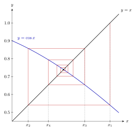

# 第 4 讲　来回跳动的迭代 (An oscillating iteration)

把计算器调到弧度制，输入 $1$，然后反复按 $\cos$ 键。屏幕上的数来回跳动，跳动的幅度越来越小，最后停在 $0.739085\ldots$ 上不再变化。本讲要弄清楚这是怎么回事。第 1 讲第 7 节留下的数列 $b_{n+1}=1+\frac1{b_n}$ 是同一类现象，那里也没有答完。本讲先处理 $(b_n)$，再回到 $\cos$ 键。

需要的预备知识：第 1 讲第 7 节；第 2 讲的定义 2.12（收敛的数列）、引理 2.13（极限保持不等式）、定理 2.19、定理 2.23（单调有界定理）、命题 2.29（等比数列的极限），以及极限的唯一性（命题 2.8）、四则运算（定理 2.26）、夹逼定理（定理 2.28）和正的平方根的存在（命题 2.32）；等比数列的求和公式。第 6 节用到第 2 讲第 7.5 节的三角函数。

## 1 按 $\cos$ 键

按键得到的数列是
$$
x_1=1,\qquad x_{n+1}=\cos x_n ,
$$
$x_n$ 是按了 $n-1$ 次之后屏幕上的数。下表列出前 13 项。第三列是相邻两项的差 $d_n=x_{n+1}-x_n$，即下一行的 $x$ 减去这一行的 $x$；第四列是相邻两个差的比 $d_n/d_{n-1}$，用未舍入的值算出。最后一行的差要用到表中没有列出的 $x_{14}$。

| $n$ | $x_n$ | $d_n=x_{n+1}-x_n$ | $d_n/d_{n-1}$ |
|---|---|---|---|
| 1 | $1$ | $-0.4597$ | |
| 2 | $0.540302$ | $\phantom{-}0.3173$ | $-0.690$ |
| 3 | $0.857553$ | $-0.2033$ | $-0.641$ |
| 4 | $0.654290$ | $\phantom{-}0.1392$ | $-0.685$ |
| 5 | $0.793480$ | $-0.0921$ | $-0.662$ |
| 6 | $0.701369$ | $\phantom{-}0.0626$ | $-0.680$ |
| 7 | $0.763960$ | $-0.0419$ | $-0.669$ |
| 8 | $0.722102$ | $\phantom{-}0.0283$ | $-0.676$ |
| 9 | $0.750418$ | $-0.0190$ | $-0.671$ |
| 10 | $0.731404$ | $\phantom{-}0.0128$ | $-0.675$ |
| 11 | $0.744237$ | $-0.0086$ | $-0.673$ |
| 12 | $0.735605$ | $\phantom{-}0.0058$ | $-0.674$ |
| 13 | $0.741425$ | $-0.0039$ | $-0.673$ |

图 1：从对角线 $y=x$ 上的点 $(x_1,x_1)$ 出发，竖直走到曲线 $y=\cos x$ 上，得到高度 $x_2$；再水平走到对角线上，把 $x_2$ 变成下一次的横坐标。如此反复。黑点是曲线与对角线的交点。

从表和图里读出三件事。

1. 数列不单调：$d_n$ 的符号一正一负，图上的折线绕着交点转。第 2 讲的单调有界定理不能直接用在它上面。
2. 相邻两项的差在缩小，每一步大约缩小到上一步的 $0.67$ 倍。
3. 进展很慢。第 12、13 项是 $0.7356$ 与 $0.7414$，小数点后第二位还没有稳定。第 1 讲的 $a_5$ 已经有 11 位小数与 $\sqrt2$ 相同。

这些都是观察。要回答的问题是：

1. 这个数列收敛吗？
2. 如果收敛，极限是什么数？
3. 要保证与极限相差小于 $10^{-3}$、$10^{-6}$、$10^{-9}$，各要算到第几项？

图上的黑点满足 $x=\cos x$，极限应当是它。但这个方程解不出来，$\cos$ 的值也只能由计算器给出。第 1 讲留下的数列 $(b_n)$ 有同样的表现，而它的每一步都是分数的运算。下面三节先对 $(b_n)$ 回答这三个问题，第 6 节再回到 $(x_n)$。

## 2 第 1 讲留下的数列

第 1 讲第 7 节的数列是
$$
b_1=1,\qquad b_{n+1}=1+\frac1{b_n}.
$$
那里算了前几项，看到它在某个位置的两侧来回跳动，并由方程 $x=1+\frac1x$ 找出了一个候选值 $\varphi=\frac{1+\sqrt5}2$。候选值是从“一个数经过这条规则不变”解出来的；数列是否收敛，是否收敛于它，那里没有回答。那里还看到它比 $(a_n)$ 慢得多，也没有说明原因。

下表列出前 12 项。第四列是相邻两项的差，仍记作 $d_n$，现在 $d_n=b_{n+1}-b_n$；第五列是相邻两个差的比 $d_n/d_{n-1}$。最后一行的差要用到 $b_{13}=\frac{377}{233}$。

| $n$ | $b_n$ | 小数 | $d_n=b_{n+1}-b_n$ | $d_n/d_{n-1}$ |
|---|---|---|---|---|
| 1 | $1$ | $1.000000$ | $1$ | |
| 2 | $2$ | $2.000000$ | $-\frac12$ | $-\frac12=-0.500$ |
| 3 | $\frac32$ | $1.500000$ | $\frac16$ | $-\frac13=-0.333$ |
| 4 | $\frac53$ | $1.666667$ | $-\frac1{15}$ | $-\frac25=-0.400$ |
| 5 | $\frac85$ | $1.600000$ | $\frac1{40}$ | $-\frac38=-0.375$ |
| 6 | $\frac{13}8$ | $1.625000$ | $-\frac1{104}$ | $-\frac5{13}=-0.385$ |
| 7 | $\frac{21}{13}$ | $1.615385$ | $\frac1{273}$ | $-\frac8{21}=-0.381$ |
| 8 | $\frac{34}{21}$ | $1.619048$ | $-\frac1{714}$ | $-\frac{13}{34}=-0.382$ |
| 9 | $\frac{55}{34}$ | $1.617647$ | $\frac1{1870}$ | $-\frac{21}{55}=-0.382$ |
| 10 | $\frac{89}{55}$ | $1.618182$ | $-\frac1{4895}$ | $-\frac{34}{89}=-0.382$ |
| 11 | $\frac{144}{89}$ | $1.617978$ | $\frac1{12816}$ | $-\frac{55}{144}=-0.382$ |
| 12 | $\frac{233}{144}$ | $1.618056$ | $-\frac1{33552}$ | $-\frac{89}{233}=-0.382$ |

与第 1 节的表对照，情形相同。

1. 数列不单调：$d_n$ 的符号一正一负。
2. 相邻两项的差在缩小；从表的第 5 行起，比值都在 $-0.38$ 附近。
3. 进展很慢。第 11、12 项是 $1.617978$ 与 $1.618056$，小数点后第三位还没有稳定。第 1 讲的 $a_5$ 已经有 11 位小数与 $\sqrt2$ 相同。

第 2 条只是对表中这些比值的观察。下面把它变成对所有 $n$ 成立的不等式。

## 3 需要一个什么样的不等式

对 $(b_n)$，候选值 $\varphi$ 是已知的，可以直接比较 $b_n$ 与 $\varphi$（第 5 节的 (2) 就是这样做的）。但第 1 节的 $(x_n)$ 没有这样一个写得出来的候选值，连方程 $x=\cos x$ 有没有解都还不知道。所以这里用一个不提极限的办法，它对两个数列都适用。

按定义 2.12，要证明 $(b_n)$ 是收敛的数列，需要控制任意两项的差 $|b_m-b_n|$。把它拆成相邻两项的差：对 $m>n$，
$$
b_m-b_n=d_n+d_{n+1}+\cdots+d_{m-1},\qquad |b_m-b_n|\le|d_n|+|d_{n+1}|+\cdots+|d_{m-1}|.
$$
假如有一个数 $q$，$0<q<1$，使得从某一项 $n_0$ 起，对每个 $n\ge n_0$ 都有
$$
|d_{n+1}|\le q\,|d_n|, \tag{$*$}
$$
那么对 $n\ge n_0$ 有 $|d_n|\le q^{n-n_0}|d_{n_0}|$，于是
$$
|b_m-b_n|\le|d_{n_0}|\left(q^{n-n_0}+\cdots+q^{m-1-n_0}\right)=|d_{n_0}|\,q^{n-n_0}\cdot\frac{1-q^{m-n}}{1-q}\le\frac{|d_{n_0}|}{1-q}\,q^{n-n_0}.
$$
右边与 $m$ 无关，并且当 $n$ 增大时趋于 $0$（命题 2.29）。这正是定义 2.12 所要求的。

所以问题归结为 $(*)$。表中第 $n$ 行的比值是 $d_n/d_{n-1}$，所以 $(*)$ 说的是：从第 $n_0+1$ 行起，每个比值的绝对值都不超过 $q$。它要求同一个 $q$ 对所有的 $n$ 适用，而且 $q$ 必须小于 $1$。只知道每个比值小于 $1$ 是不够的：上面用的是公比为 $q$ 的等比数列的和，比值如果越来越接近 $1$，就没有这样的 $q$（习题 4.8）。

对 $(b_n)$，比值可以直接算出来。各项都是正数，并且
$$
d_{n+1}=b_{n+2}-b_{n+1}=\left(1+\frac1{b_{n+1}}\right)-\left(1+\frac1{b_n}\right)=\frac1{b_{n+1}}-\frac1{b_n}=-\frac{b_{n+1}-b_n}{b_n\,b_{n+1}}=-\frac{d_n}{b_n\,b_{n+1}} . \tag{1}
$$
所以只要知道 $b_n b_{n+1}$ 不小于某个大于 $1$ 的数。

## 4 收敛，极限是 $\varphi$

> [!NOTE] 命题 4.1 — 各项的范围与相邻差的比
>
> 1. 对每个 $n\ge2$，$\dfrac32\le b_n\le2$。
> 2. 对每个 $n\ge2$，$|d_{n+1}|\le\dfrac49\,|d_n|$。

> [!NOTE] 证明
>
> 1. $b_2=2$。若 $\frac32\le b_n\le2$，则 $\frac12\le\frac1{b_n}\le\frac23$，所以 $\frac32\le b_{n+1}\le\frac53\le2$。
>
> 2. 当 $n\ge2$ 时 $b_n b_{n+1}\ge\frac32\cdot\frac32=\frac94$。代入 (1) 即得。

$b_1=1$ 不在 $\left[\frac32,2\right]$ 中，第一个比值 $\frac{d_2}{d_1}=-\frac12$ 的绝对值也大于 $\frac49$。从第 2 项起，$(*)$ 成立，$q=\frac49$，$n_0=2$，$|d_2|=\frac12$。

> [!NOTE] 定理 4.2 — $(b_n)$ 收敛于 $\varphi$
>
> 1. 对 $m>n\ge2$，$|b_m-b_n|\le\dfrac9{10}\left(\dfrac49\right)^{n-2}$。
> 2. $(b_n)$ 收敛，极限是 $\varphi=\dfrac{1+\sqrt5}2=1.6180339\ldots$。

> [!NOTE] 证明
>
> 1. 在第 3 节的估计中取 $q=\frac49$，$n_0=2$：$\frac{|d_2|}{1-q}=\frac12\cdot\frac95=\frac9{10}$。
>
> 2. 给定 $\varepsilon>0$。由命题 2.29，存在 $N\ge2$ 使 $\frac9{10}\left(\frac49\right)^{N-2}<\varepsilon$。定义 2.12 中的两项可以交换，相等时差为 $0$，所以只需考虑 $m>n\ge N$；这时由第 1 条，$|b_m-b_n|<\varepsilon$。所以 $(b_n)$ 是收敛的数列，由定理 2.19，它有极限 $L$。由引理 2.13 和命题 4.1，$\frac32\le L\le2$。
>
>    $b_{n+1}\to L$（定义 2.3 中的 $N$ 照旧可用）；另一方面，由定理 2.26，$b_{n+1}=1+\frac1{b_n}\to1+\frac1L$。由极限的唯一性，$L=1+\frac1L$，即 $L^2-L-1=0$。配方得 $\left(L-\frac12\right)^2=\frac54$。因为 $L-\frac12>0$，而正的平方根是唯一的（命题 2.32），所以 $L-\frac12=\frac{\sqrt5}2$，即 $L=\varphi$。

第 1 讲的候选值现在有了依据。对 $(b_n)$，前两个问题有了答案。

## 5 要算到第几项，为什么慢

由 $\varphi=1+\frac1\varphi$，
$$
b_{n+1}-\varphi=\frac1{b_n}-\frac1\varphi=-\frac{b_n-\varphi}{b_n\,\varphi} . \tag{2}
$$

> [!NOTE] 命题 4.3 — 三个误差估计
>
> 1. 对每个 $n\ge2$，$|b_{n+1}-\varphi|\le\dfrac49\,|b_n-\varphi|$。
> 2. 对每个 $n\ge2$，$|b_n-\varphi|\le\dfrac9{10}\left(\dfrac49\right)^{n-2}$。
> 3. 对每个 $n\ge3$，$|b_n-\varphi|\le\dfrac45\,|b_n-b_{n-1}|$。

> [!NOTE] 证明
>
> 1. 当 $n\ge2$ 时 $b_n\ge\frac32$，又 $\varphi\ge\frac32$（定理 4.2 的证明），所以 $b_n\varphi\ge\frac94$。代入 (2)。
>
> 2. 记 $C=\frac9{10}\left(\frac49\right)^{n-2}$。定理 4.2 第 1 条说：对每个 $m>n$ 有 $b_n-C\le b_m\le b_n+C$。固定 $n$，让 $m$ 变化。因为 $b_m\to\varphi$，由引理 2.13，$b_n-C\le\varphi\le b_n+C$，即 $|b_n-\varphi|\le C$。
>
> 3. 设 $n\ge3$。命题 4.1 第 2 条（把其中的 $n$ 换成 $n-1$）给出 $|b_{n+1}-b_n|\le\frac49|b_n-b_{n-1}|$。由它、三角不等式和本命题第 1 条，
> $$
> |b_n-\varphi|\le|b_n-b_{n+1}|+|b_{n+1}-\varphi|\le\frac49\,|b_n-b_{n-1}|+\frac49\,|b_n-\varphi| .
> $$
> 移项得 $\frac59|b_n-\varphi|\le\frac49|b_n-b_{n-1}|$。

第 2 条的右边在计算之前就能写出来，由它可以事先算出要算到第几项。第 3 条的右边要等算到 $b_n$ 才知道：它用刚刚走过的一步的长度估计剩下的距离。计算时每算一项就可以用它检查一次，一旦 $\frac45|b_n-b_{n-1}|<\varepsilon$ 就停下。第 2 条这样的估计称为先验估计 (a priori estimate)，第 3 条这样的称为后验估计 (a posteriori estimate)。

下表对三个门槛列出：按第 2 条，保证 $|b_n-\varphi|<\varepsilon$ 的最小的 $n$；按第 3 条，第一次检查通过的 $n$；实际上第一个使 $|b_n-\varphi|<\varepsilon$ 的 $n$。最后一行是第 1 讲的 $(a_n)$ 与 $\sqrt2$ 相差小于 $\varepsilon$ 的第一个 $n$。第二、三行要把数列算到二十几项，相邻差小到 $10^{-9}$，要用精确的分数或 12 位以上的小数（例如 Python 的 `Fraction`）。

| $\varepsilon$ | $10^{-3}$ | $10^{-6}$ | $10^{-9}$ |
|---|---|---|---|
| 先验估计给出的 $n$ | $11$ | $19$ | $28$ |
| 后验估计通过的 $n$ | $10$ | $17$ | $24$ |
| 实际的 $n$ | $9$ | $16$ | $23$ |
| $(a_n)$：实际的 $n$ | $4$ | $5$ | $5$ |

对 $(b_n)$，第三个问题有了答案：算到 $b_{28}$，误差保证小于 $10^{-9}$；如果边算边检查，到 $b_{24}$ 就可以停。两种估计给出的 $n$ 都比实际需要的大，但相差不多。原因是：由 (2)，误差每一步乘以 $-\frac1{b_n\varphi}$，它趋于 $-\frac1{\varphi^2}=-0.3819\ldots$；我们用的 $\frac49=0.444\ldots$ 与它相差不大。

$(b_n)$ 为什么比 $(a_n)$ 慢，也有了答案。由 (2)，$(b_n)$ 的误差每一步乘以一个接近 $-0.38$ 的数，所以大约每 $2.4$ 项多一位准确的小数，要多三位就要多算 $7$ 项。$(a_n)$ 的误差满足
$$
a_{n+1}-\sqrt2=\frac{a_n^2+2}{2a_n}-\sqrt2=\frac{a_n^2-2\sqrt2\,a_n+2}{2a_n}=\frac{(a_n-\sqrt2)^2}{2a_n},
$$
即每一步大约把误差平方，准确的位数每一步大约翻一倍。两种迭代的差别在于，误差的下一个值是上一个值乘以常数，还是上一个值的平方。

$b_1=1\ne\varphi$，由 (2)，每个 $b_n$ 都不等于 $\varphi$。(2) 的右边带负号，所以 $b_n-\varphi$ 的符号一正一负，$\varphi$ 总在 $b_n$ 与 $b_{n+1}$ 之间。这就是第 2 节看到的来回跳动。

## 6 回到 $\cos$ 键

对 $(b_n)$，极限可以由二次方程解出，比值可以由 (1) 直接算出。第 3 节的办法并不依赖这两件方便的事。现在用它处理第 1 节的数列 $x_1=1$，$x_{n+1}=\cos x_n$，其中 $d_n=x_{n+1}-x_n$。

这里的 $\cos$ 按高中的定义理解：在单位圆上从点 $(1,0)$ 出发，沿逆时针方向走过长为 $\alpha$ 的一段弧，到达点 $P$；$\cos\alpha$ 是 $P$ 的横坐标，$\sin\alpha$ 是 $P$ 的纵坐标。$\alpha<0$ 时沿顺时针方向走 $|\alpha|$。下面只用到它们的三条性质：

1. $\sin^2\alpha+\cos^2\alpha=1$，因为 $P$ 在单位圆上；
2. 和差公式 $\cos(s\pm t)=\cos s\cos t\mp\sin s\sin t$；
3. $|\sin\alpha|\le|\alpha|$：$|\sin\alpha|$ 是 $P$ 到横轴的距离，它不超过 $P$ 到点 $(1,0)$ 的线段的长，线段的长又不超过两点之间的弧长。

这些都在第 2 讲第 7.5 节说过。

记号 $d_n$ 现在又指 $x_{n+1}-x_n$。这里没有 (1) 那样的公式。$(*)$ 的两边是
$$
d_{n+1}=\cos x_{n+1}-\cos x_n,\qquad d_n=x_{n+1}-x_n ,
$$
所以只要对数列所在范围内的任意两个数 $x,y$ 证明 $|\cos x-\cos y|\le q\,|x-y|$ 就够了，其中 $q$ 是一个小于 $1$ 的数。

> [!NOTE] 引理 4.4 — $\cos$ 与 $\sin$ 的大小
>
> 1. 对每个实数 $u$，$1-\dfrac{u^2}2\le\cos u\le1$。
> 2. 若 $|u|\le1$，则 $\cos u\ge\dfrac12$，并且 $|\sin u|\le\dfrac{\sqrt3}2$。

> [!NOTE] 证明
>
> 由和角公式与 $\sin^2v+\cos^2v=1$，
> $$
> \cos u=\cos^2\frac u2-\sin^2\frac u2=1-2\sin^2\frac u2 .
> $$
> 所以 $\cos u\le1$。又 $\left|\sin\frac u2\right|\le\frac{|u|}2$，所以 $2\sin^2\frac u2\le\frac{u^2}2$，即 $\cos u\ge1-\frac{u^2}2$。
>
> 若 $|u|\le1$，则 $\cos u\ge1-\frac12=\frac12$，于是 $\sin^2u=1-\cos^2u\le1-\frac14=\frac34$。

> [!NOTE] 命题 4.5 — $\cos$ 在 $[0,1]$ 上把距离缩小
>
> 记 $q=\dfrac{\sqrt3}2\approx0.866$。对 $[0,1]$ 中的任意两个数 $x,y$，
> $$
> |\cos x-\cos y|\le q\,|x-y| .
> $$

> [!NOTE] 证明
>
> 记 $s=\frac{x+y}2$，$t=\frac{x-y}2$，则 $x=s+t$，$y=s-t$。由和差公式，
> $$
> \cos x-\cos y=\cos(s+t)-\cos(s-t)=-2\sin s\,\sin t .
> $$
> 因为 $0\le s\le1$，由引理 4.4，$|\sin s|\le q$。又 $|\sin t|\le|t|=\frac{|x-y|}2$。所以 $|\cos x-\cos y|\le2\cdot q\cdot\frac{|x-y|}2=q\,|x-y|$。

由引理 4.4，当 $0\le u\le1$ 时 $\frac12\le\cos u\le1$。$x_1=1$ 在 $[0,1]$ 中，所以 $x_2=\cos x_1$ 也在 $[0,1]$ 中，依次类推，所有的 $x_n$ 都在 $[0,1]$ 中，并且从 $x_2$ 起都在 $\left[\frac12,1\right]$ 中。于是命题 4.5 可以用在任意两项上：$|d_{n+1}|=|\cos x_{n+1}-\cos x_n|\le q\,|d_n|$，即 $(*)$ 从 $n_0=1$ 起成立。

记 $d=|d_1|=1-\cos1\approx0.4597$；不带下标的 $d$ 是一个固定的数。

> [!NOTE] 定理 4.6 — 数列 $(x_n)$ 收敛，极限是方程 $x=\cos x$ 唯一的解
>
> 1. 对 $m>n\ge1$，$|x_m-x_n|\le\dfrac d{1-q}\,q^{n-1}$。
> 2. $(x_n)$ 收敛。记它的极限为 $x^*$，则 $\frac12\le x^*\le1$，并且 $\cos x^*=x^*$。
> 3. 满足 $\cos y=y$ 的实数 $y$ 只有 $x^*$ 一个。
> 4. 对每个 $n\ge1$，$|x_n-x^*|\le\dfrac d{1-q}\,q^{n-1}$；对每个 $n\ge2$，$|x_n-x^*|\le\dfrac q{1-q}\,|x_n-x_{n-1}|$。

> [!NOTE] 证明
>
> 1. 上面已经说明 $(*)$ 从 $n_0=1$ 起成立，代入第 3 节的估计。
>
> 2. 与定理 4.2 第 2 条证明的第一段相同（各项的范围见命题 4.5 后面的一段），得到极限 $x^*$，$\frac12\le x^*\le1$。$x^*$ 与每个 $x_n$ 都在 $[0,1]$ 中，由命题 4.5，$|x_{n+1}-\cos x^*|=|\cos x_n-\cos x^*|\le q\,|x_n-x^*|\to0$。由夹逼定理，$x_{n+1}\to\cos x^*$。另一方面 $x_{n+1}\to x^*$。由极限的唯一性，$\cos x^*=x^*$。
>
> 3. 设 $\cos y=y$。由 $\sin^2y+\cos^2y=1$ 得 $y^2=\cos^2y\le1$，于是 $|y|\le1$，再由引理 4.4，$y=\cos y\ge\frac12$。所以 $y$ 在 $[0,1]$ 中。由命题 4.5，$|x^*-y|=|\cos x^*-\cos y|\le q\,|x^*-y|$，即 $(1-q)|x^*-y|\le0$。因为 $q<1$，所以 $y=x^*$。
>
> 4. 第一个估计由第 1 条和引理 2.13 得到，做法与命题 4.3 第 2 条相同。第二个估计的证明与命题 4.3 第 3 条相同：那里用到的是 $|d_{n+1}|\le q|d_n|$ 和 $|x_{n+1}-x^*|\le q|x_n-x^*|$；这里前者由命题 4.5 得到，后者由命题 4.5 和 $\cos x^*=x^*$ 得到。同样移项，得 $(1-q)|x_n-x^*|\le q\,|x_n-x_{n-1}|$。

第 1 节的三个问题现在都有了答案（第三个见下表）。这个证明顺便说明了方程 $x=\cos x$ 有解。$x^*$ 没有已知的用根式、对数或 $\pi$ 写出的表达式；它的数值要靠数列 $(x_n)$ 这样的办法来算。证明里没有用到 $\cos$ 是连续的；$x_{n+1}\to\cos x^*$ 这一步是由命题 4.5 直接得到的。

这里 $\frac d{1-q}\approx3.43$，$\frac q{1-q}\approx6.46$。下表的三行与第 5 节的表的前三行意思相同。最后一行用到 $x^*=0.739085133215\ldots$；这个值是把迭代继续做下去，直到后验估计小于 $10^{-13}$ 得到的。

| $\varepsilon$ | $10^{-3}$ | $10^{-6}$ | $10^{-9}$ |
|---|---|---|---|
| 先验估计给出的 $n$ | $58$ | $106$ | $154$ |
| 后验估计通过的 $n$ | $23$ | $40$ | $58$ |
| 实际的 $n$ | $16$ | $33$ | $51$ |

后两行同样要用 12 位以上的小数来算。这一次保证与实际相差很远。我们证明的是每一步误差至多乘以 $q\approx0.866$，按这个速度每 $16$ 步才多一位准确的小数；相邻差的比值在 $0.67$ 附近，误差的比值也是如此，大约每 $6$ 步多一位。先验估计从头到尾按 $0.866$ 计算，所以给出的步数约是实际的三倍。后验估计用的是实际走出的步长，只在系数 $\frac q{1-q}$ 上保守，所以只多 $7$ 步。$q=\frac{\sqrt3}2$ 是对整个区间 $[0,1]$ 取的；数列从第 2 项起只在一个更短的区间里活动，在那里可以取更小的 $q$（习题 4.5）。

对 $(b_n)$，比值的极限 $-\frac1{\varphi^2}$ 可以由 (1) 读出。这里比值稳定在 $-0.673$ 附近，$-0.673$ 是什么数？由命题 4.5 的证明，只要 $d_n\ne0$，就有
$$
\frac{d_{n+1}}{d_n}=\frac{\cos x_{n+1}-\cos x_n}{x_{n+1}-x_n}=-\sin\frac{x_{n+1}+x_n}2\cdot\frac{\sin t_n}{t_n},\qquad t_n=\frac{x_{n+1}-x_n}2 .
$$
第一个因子里，$\frac{x_{n+1}+x_n}2\to x^*$，$\sin$ 是连续的（第 2 讲第 7.5 节），所以它趋于 $\sin x^*=0.6736\ldots$。第二个因子是 $\frac{\sin t}t$ 在 $t$ 接近 $0$ 时的值。$\left|\frac{\sin t}t\right|$ 不超过 $1$；它是否趋于 $1$，要到后面讲函数的极限时才能回答。

## 7 压缩

回头看 $(b_n)$ 和 $(x_n)$ 的两次推导。两个数列都是由一个函数反复作用得到的：$b_{n+1}=f(b_n)$，$f(x)=1+\frac1x$；$x_{n+1}=\cos x_n$。关于这个函数，两次都只用到两件事：

- 它把某个区间里的数变成同一个区间里的数：$f$ 对 $\left[\frac32,2\right]$，$\cos$ 对 $[0,1]$；
- 在这个区间上，任意两个数经过它之后，距离不超过原来的 $q$ 倍，$q<1$：对 $f$，$|f(x)-f(y)|=\frac{|x-y|}{xy}\le\frac49|x-y|$；对 $\cos$，命题 4.5。

所以同样的结论对满足这两条的任何函数都成立。

> [!IMPORTANT] 定义 4.7 — 压缩 (Contraction)
>
> 设 $I=[a,b]$，$f$ 是定义在 $I$ 上的函数。若
>
> 1. 对每个 $x\in I$ 有 $f(x)\in I$；
> 2. 存在数 $q$，$0\le q<1$，使得对 $I$ 中任意的 $x,y$ 都有 $|f(x)-f(y)|\le q\,|x-y|$，
>
> 则称 $f$ 是 $I$ 上的压缩，$q$ 称为它的一个压缩常数。满足 $f(x)=x$ 的数 $x$ 称为 $f$ 的不动点 (fixed point)。

> [!NOTE] 定理 4.8 — 压缩的迭代 (Contraction principle)
>
> 设 $f$ 是 $I=[a,b]$ 上的压缩，$q$ 是它的一个压缩常数。任取 $x_1\in I$，令 $x_{n+1}=f(x_n)$。则
>
> 1. $(x_n)$ 收敛，极限 $x^*$ 在 $I$ 中，并且 $f(x^*)=x^*$；
> 2. $f$ 在 $I$ 中没有别的不动点；
> 3. 对每个 $n\ge1$，$|x_n-x^*|\le\dfrac{|x_2-x_1|}{1-q}\,q^{n-1}$；
> 4. 对每个 $n\ge2$，$|x_n-x^*|\le\dfrac q{1-q}\,|x_n-x_{n-1}|$。

> [!NOTE] 证明
>
> 第 1、3、4 条：由定义 4.7 第 1 条，所有的 $x_n$ 都在 $I$ 中；由定义 4.7 第 2 条，$|x_{n+2}-x_{n+1}|\le q\,|x_{n+1}-x_n|$ 对每个 $n\ge1$ 成立。于是可以把定理 4.6 第 1、2、4 条的证明中的 $\cos$ 换成 $f$，$[0,1]$ 换成 $I$，命题 4.5 换成定义 4.7 的第 2 条，$d$ 换成 $|x_2-x_1|$。极限在 $I$ 中，是因为 $a\le x_n\le b$ 对每个 $n$ 成立（引理 2.13）。若 $q=0$，则 $f$ 在 $I$ 上是常数，从第 2 项起 $x_n=x^*$，结论是显然的（第 3 条中 $n=1$ 时，$q^{0}$ 按 $1$ 计）。
>
> 第 2 条：设 $y\in I$，$f(y)=y$。则 $|x^*-y|=|f(x^*)-f(y)|\le q\,|x^*-y|$，因为 $q<1$，所以 $y=x^*$。

结论对 $I$ 中的每个初值都成立，极限与初值无关。以后遇到别的函数，只要验证定义 4.7 的两条，就得到收敛和两个误差估计，不必重做证明。把 $b_2$ 当作初值，对 $f(x)=1+\frac1x$ 和 $I=\left[\frac32,2\right]$ 使用定理 4.8，就得到 $(b_n)$ 收敛以及命题 4.3 的第 2、3 条；极限是 $\varphi$，仍要解方程 $x=1+\frac1x$ 才知道。

下面两个例子说明：后验估计中的系数不能普遍地改小；$q<1$ 这个要求去掉以后会怎样。

> [!NOTE] Example 4.9: the a posteriori bound can be attained
>
> Let $f(x)=1+\frac x2$ on $I=[0,2]$; it maps $I$ into $[1,2]$. Then $|f(x)-f(y)|=\frac12|x-y|$, so $q=\frac12$ and $\frac q{1-q}=1$. Starting from $x_1=0$ we get $0,\ 1,\ \frac32,\ \frac74,\ \frac{15}8,\ldots$, that is, $x_n=2-2^{2-n}$, and $x^*=2$. Here
> $$
> |x_n-x^*|=2^{2-n}=|x_n-x_{n-1}| ,
> $$
> so part 4 of Theorem 4.8 holds with equality for every $n\ge2$.

定义 4.7 要求有一个小于 $1$ 的 $q$。如果只有 $|f(x)-f(y)|<|x-y|$，定理 4.8 的误差估计就没有了（例 4.10）；在无界的区间上，不动点也可以不存在（习题 4.9）。

> [!NOTE] 例 4.10：距离每次都缩小，但没有压缩常数
>
> 令 $g(x)=\frac{x^2+1}2$，$I=[0,1]$。当 $0\le x\le1$ 时 $\frac12\le g(x)\le1$。对 $I$ 中不相等的 $x,y$，
> $$
> |g(x)-g(y)|=\frac{x+y}2\,|x-y|<|x-y| ,
> $$
> 但 $x,y$ 都接近 $1$ 时，$\frac{x+y}2$ 可以任意接近 $1$，所以没有小于 $1$ 的 $q$ 适用于整个区间。
>
> 取 $x_1=0$，$x_{n+1}=g(x_n)$。因为 $x_{n+1}-x_n=\frac{(1-x_n)^2}2\ge0$，数列单调递增，且有上界 $1$。由定理 2.23，它收敛于某个 $L$，$L=\frac{L^2+1}2$，即 $L=1$。但是收敛极慢：
>
> | $n$ | $11$ | $101$ | $1001$ |
> |---|---|---|---|
> | $1-x_n$ | $0.139$ | $0.0188$ | $0.00198$ |
>
> 这三项分别是迭代 $10$、$100$、$1000$ 次的结果。迭代次数乘以 $10$，误差大约除以 $10$。压缩的迭代每一步把误差乘以一个固定的 $q<1$，这里做不到；定理 4.8 的两个误差估计在这里都没有。

## 回望

> [!NOTE] 本讲的结论
>
> - 反复按 $\cos$ 键得到的数列和第 1 讲留下的数列 $b_{n+1}=1+\frac1{b_n}$ 都不单调。后者收敛于 $\varphi=\frac{1+\sqrt5}2$，是因为从第 2 项起相邻两项的差每一步至多乘以 $\frac49$：相邻差不超过一个等比数列，任意两项的差由等比数列的和控制。
> - 误差有两种估计。先验估计在计算之前给出要算到第几项；后验估计在计算过程中告诉我们何时可以停。
> - $(b_n)$ 的误差每一步乘以一个接近 $-0.38$ 的数；$(a_n)$ 的误差每一步大约平方一次。这是两者快慢不同的原因。
> - 同样的办法适用于 $\cos$ 键：$x_{n+1}=\cos x_n$ 收敛于方程 $x=\cos x$ 唯一的实数解 $0.739085\ldots$，这就是屏幕上最后停住的数。这个方程解不出来，它的解只能这样算。
> - 两次推导只用到函数的两条性质，满足这两条的函数称为压缩（定义 4.7、定理 4.8）。只有“距离缩小”而没有小于 $1$ 的 $q$ 时，这两个误差估计就没有了（例 4.10）。

本讲留下两个问题。第一，$\cos$ 迭代的相邻差的比值趋于 $-\sin x^*$ 吗？这要用到 $\frac{\sin t}t$ 在 $t$ 接近 $0$ 时的行为，留给后面讲函数的极限时。第二，$(b_n)$ 的比值 $-\frac1{\varphi^2}$ 是从公式 (1) 读出来的；对一般的函数，这个比值由函数的什么性质决定，为什么 $(a_n)$ 的迭代没有这样一个非零的比值？这要等到有了导数。

## 习题

习题 4.1–4.11 配合正文。习题 4.12 是选做题。需要小数值的地方用计算器或 Python；三角函数一律用弧度，习题 4.2 除外。习题 4.2 (e)、4.4 (f)、4.5 (c) 需要 12 位以上的小数或上百项，用 Python 的 `decimal` 模块。

1. **4.1** **A monotone example.** Let $x_1=0$, $x_{n+1}=\sqrt{2+x_n}$, and $f(x)=\sqrt{2+x}$.

    (a) Compute $x_2,\ldots,x_7$ to six decimal places.

    (b) Show that for $x,y\ge0$,
    $$
    f(x)-f(y)=\frac{x-y}{\sqrt{2+x}+\sqrt{2+y}} .
    $$
    Deduce that $f$ is a contraction on $[0,2]$ with $q=\dfrac1{2\sqrt2}$. Do not forget to check that $f(x)\in[0,2]$ when $x\in[0,2]$.

    (c) Find the fixed point of $f$ in $[0,2]$. What is $\lim x_n$?

    (d) Use part 3 of Theorem 4.8 to find the smallest $n$ for which the bound is less than $10^{-6}$ (take $q=0.35355$). Then find, by computing, the first $n$ with $|x_n-2|<10^{-6}$.

    (e) Compute $\dfrac{2-x_{n+1}}{2-x_n}$ for $n=2,\ldots,6$ to three decimal places. Use (b) with $y=2$ to explain the value these ratios approach. Why is $q$ in (b) larger than this value?

    (f) The sequence is increasing and bounded above by $2$, so Theorem 2.23 also shows that it converges. Does Theorem 2.23 tell you, before computing, how many terms suffice for an error below $10^{-6}$?

2. **4.2** **角度制下按 $\cos$ 键。** 计算器在角度制下把输入 $y$ 当作 $y$ 度，算出的是 $\cos\dfrac{\pi y}{180}$。记 $k=\dfrac\pi{180}\approx0.0174533$，$g(y)=\cos(ky)$，$y_1=1$，$y_{n+1}=g(y_n)$。

    (a) 算出 $y_2,y_3,y_4$，保留 11 位小数。从第几项起前 9 位小数不再变化？

    (b) 证明：对任意实数 $a,b$ 有 $|\cos a-\cos b|\le|a-b|$。（看命题 4.5 的证明，其中 $|\sin s|\le1$。）由此证明 $g$ 是 $[0,1]$ 上的压缩，$q=k$；先检查 $y\in[0,1]$ 时 $g(y)\in[0,1]$。

    (c) (b) 的 $q$ 还可以改小。对 $[0,1]$ 中的 $y,z$，命题 4.5 的证明中的 $s$ 等于 $\dfrac{k(y+z)}2$。用 $|\sin s|\le|s|$ 证明 $g$ 的压缩常数可以取 $q=k^2\approx0.000305$。

    (d) 用定理 4.8 第 3 条和 $q=k^2$，求保证 $|y_n-y^*|<10^{-9}$ 的最小的 $n$。

    (e) 算出比值 $\dfrac{y_4-y_3}{y_3-y_2}$，保留三位有效数字，与 $k^2$ 比较。

    (f) 弧度制下每一步误差大约乘以 $0.67$，角度制下大约乘以 $0.0003$。用 (c) 的证明说明这个差别是怎么来的。

3. **4.3** **Kepler 方程。** 行星沿椭圆绕太阳运行，椭圆的扁平程度用离心率 $e$ 表示，$0\le e<1$；$e=0$ 是圆。要算出某一时刻行星在轨道上的位置，需要解方程
    $$
    x=M+e\sin x ,
    $$
    其中 $M$ 是与时间成正比的已知数，$x$ 是未知数，行星的位置由 $x$ 用公式算出。这个方程不能用公式解出 $x$。Kepler 的办法是迭代：$x_1=M$，$x_{n+1}=M+e\sin x_n$。设 $0<e<1$，记 $f(x)=M+e\sin x$。

    (a) 证明：对任意实数 $x,y$ 有 $|\sin x-\sin y|\le|x-y|$。（令 $s=\frac{x+y}2$，$t=\frac{x-y}2$，用高中的和差公式 $\sin(s\pm t)=\sin s\cos t\pm\cos s\sin t$ 化简 $\sin(s+t)-\sin(s-t)$。）

    (b) 证明 $f$ 是 $I=[M-1,M+1]$ 上的压缩，$q=e$。再证明 $|x_2-x_1|\le e$，从而由定理 4.8 第 3 条，
    $$
    |x_n-x^*|\le\frac{e^n}{1-e}.
    $$

    (c) 用 (b) 的估计填表：保证 $|x_n-x^*|<10^{-6}$ 的最小的 $n$。

    | | 地球 | 水星 | 哈雷彗星 |
    |---|---|---|---|
    | $e$ | $0.0167$ | $0.2056$ | $0.967$ |
    | 最小的 $n$ | | | |

4. **4.4** **只用单调有界定理能走多远。** 本题不用压缩，重新研究第 1 节的 $x_1=1$，$x_{n+1}=\cos x_n$，看定理 2.23 在哪一步不够用。

    (a) 证明 $\cos$ 在 $[0,1]$ 上严格递减：若 $0\le y<x\le1$，则 $\cos x<\cos y$。可以使用：当 $0<\alpha<\pi$ 时 $\sin\alpha>0$（这时点 $P$ 在上半圆上），以及 $1<\pi$。

    (b) 令 $h(x)=\cos(\cos x)$。证明 $h$ 在 $[0,1]$ 上递增。记 $u_k=x_{2k-1}$，$v_k=x_{2k}$，则 $u_{k+1}=h(u_k)$，$v_{k+1}=h(v_k)$。由 $x_3<x_1$ 证明 $(u_k)$ 单调递减；由 $x_4>x_2$ 证明 $(v_k)$ 单调递增。

    (c) 由定理 2.23，$u_k\to\alpha$，$v_k\to\beta$。说明 $\alpha,\beta$ 都在 $\left[\frac12,1\right]$ 中。

    (d) 由 $v_k=\cos u_k$，$u_{k+1}=\cos v_k$ 和习题 4.2 (b) 的不等式 $|\cos a-\cos b|\le|a-b|$，证明 $\beta=\cos\alpha$，$\alpha=\cos\beta$。

    (e) 到这一步为止没有用过小于 $1$ 的 $q$。只凭 (d) 不能断定 $\alpha=\beta$：函数 $p(x)=1-x$ 在 $[0,1]$ 上也递减，写出两个不相等的数 $\alpha,\beta$ 使 $\beta=p(\alpha)$，$\alpha=p(\beta)$。再用命题 4.5 证明：对 $\cos$，由 (d) 可得 $\alpha=\beta$。

    (f) 用 (a) 证明：若 $x_n>x^*$，则 $x_{n+1}<x^*$；若 $x_n<x^*$，则 $x_{n+1}>x^*$。所以 $x^*$ 在 $x_n$ 与 $x_{n+1}$ 之间，并且
    $$
    |x_n-x^*|\le|x_{n+1}-x_n| .
    $$
    这个估计里没有 $q$。对 $\varepsilon=10^{-3}$、$10^{-6}$、$10^{-9}$，求第一个使 $|x_{n+1}-x_n|<\varepsilon$ 的 $n$，与第 6 节的表中“后验估计通过的 $n$”一行比较。这个估计与第 1 讲中用区间 $\left[\frac2{a_n},a_n\right]$ 估计误差的做法有什么共同之处？

5. **4.5** **缩小区间，改进 $q$。** 命题 4.5 的 $q=\frac{\sqrt3}2$ 是对整个 $[0,1]$ 取的。本题在 $J=[0.54,\,0.86]$ 上重做。可以使用习题 4.4 (a) 和计算器给出的 $\cos0.54=0.8577\ldots$，$\cos0.86=0.6524\ldots$。

    (a) 证明：当 $x\in J$ 时 $\cos x\in J$。检查 $x_2\in J$。

    (b) 设 $s\in J$。由 $\cos s\ge\cos0.86>0.652$ 证明 $|\sin s|<0.76$。于是对 $J$ 中的 $x,y$ 有 $|\cos x-\cos y|\le q'|x-y|$，$q'=0.76$。

    (c) 把 $x_2$ 当作初值，用定理 4.8 和 $q'$ 重新填第 6 节的表的前两行。先验估计现在是 $|x_n-x^*|\le\dfrac{|x_3-x_2|}{1-q'}\,q'^{\,n-2}$（$n\ge2$）。

    | $\varepsilon$ | $10^{-3}$ | $10^{-6}$ | $10^{-9}$ |
    |---|---|---|---|
    | 先验估计给出的 $n$ | | | |
    | 后验估计通过的 $n$ | | | |

    (d) 设 $\cos$ 在某个区间上有压缩常数 $q$，并且从某一项起所有的 $x_n$ 都在这个区间里。证明：从这一项起 $\left|\dfrac{d_{n+1}}{d_n}\right|\le q$。第 1 节的表中 $n\ge9$ 的比值的绝对值都大于 $0.67$；再算出 $n=20,30,40$ 的比值。按这些数据，$q$ 能小于 $0.67$ 吗？

6. **4.6** **Reciprocal without division.** Let $A>0$. Starting from $v_1$, define $v_{n+1}=v_n(2-Av_n)$. Only multiplication and subtraction are used.

    (a) Let $r_n=1-Av_n$. Show that $r_{n+1}=r_n^2$.

    (b) Take $A=3$, $v_1=0.3$. Write down $r_1,\ldots,r_5$ and $v_1,\ldots,v_5$. What is the first $n$ with $\left|v_n-\frac13\right|<10^{-12}$?

    (c) For which starting values $v_1$ does $v_n\to\frac1A$? Answer in terms of $r_1$.

    (d) A contraction with $q=\frac12$ whose first error is $\frac1{30}$ is only guaranteed to have error at most $\frac1{30}\cdot2^{-(n-1)}$ at step $n$. Find the first $n$ for which this is less than $10^{-12}$ and compare with (b).

7. **4.7** **How sharp are the bounds?**

    (a) For $f(x)=1+\frac x2$, $x_1=0$ (Example 4.9), show that part 3 of Theorem 4.8 also holds with equality for every $n$.

    (b) For the sequence $(b_n)$, part 3 of Proposition 4.3 reads $|b_n-\varphi|\le\frac45|b_n-b_{n-1}|$. For $n=6$ and $n=10$ compute both sides to three significant figures. By what factor does the bound overestimate the error?

8. **4.8** **相邻两项的差趋于 $0$ 是不够的。** 第 3 讲第 7 节的调和和是 $H_n=1+\frac12+\cdots+\frac1n$。记 $d_n=H_{n+1}-H_n$。

    (a) 写出 $d_n$ 和比值 $\dfrac{d_{n+1}}{d_n}$。验证 $d_n\to0$，并且每个比值都小于 $1$。

    (b) 第 3 讲第 7.1 节证明了 $H_{2n}-H_n\ge\frac12$。由此说明 $(H_n)$ 不是收敛的数列。

    (c) 第 3 节由 $(*)$ 推出了数列收敛。指出对 $(H_n)$ 这个推导在哪里不成立：证明对任何 $q<1$，都有 $n$ 使 $\dfrac{d_{n+1}}{d_n}>q$。

9. **4.9** **Distances shrink, but there is no fixed point.** Let $f(x)=x+\dfrac1x$ for $x\ge1$.

    (a) Show that $f(x)\ge1$ for $x\ge1$, and that for $x,y\ge1$ with $x\ne y$,
    $$
    |f(x)-f(y)|=|x-y|\left(1-\frac1{xy}\right)<|x-y| .
    $$

    (b) Show that $f$ has no fixed point.

    (c) Let $x_1=1$, $x_{n+1}=f(x_n)$. Show that $x_{n+1}^2\ge x_n^2+2$ and deduce $x_n\to+\infty$.

    (d) Definition 4.7 asks for an interval $[a,b]$ and a constant $q<1$. Show that on $[1,+\infty)$ no constant $q<1$ works. Show that on $[1,b]$ the constant $q=1-\dfrac1{b^2}$ works, but $f(b)\notin[1,b]$.

10. **4.10** **每一步都有舍入。** 计算器只保留有限位小数，实际得到的数列不是 $x_{n+1}=f(x_n)$，而是
    $$
    \tilde x_{n+1}=f(\tilde x_n)+\delta_n,\qquad|\delta_n|\le\eta ,
    $$
    其中 $\delta_n$ 是第 $n$ 步的舍入误差，$\eta$ 是它的上界。设 $f$ 是 $I$ 上的压缩，压缩常数为 $q$，不动点为 $x^*$，并设每个 $\tilde x_n$ 都在 $I$ 中。记 $e_n=|\tilde x_n-x^*|$。

    (a) 证明 $e_{n+1}\le q\,e_n+\eta$。

    (b) 用归纳法证明
    $$
    e_n\le q^{n-1}e_1+\eta\left(1+q+\cdots+q^{n-2}\right)\le q^{n-1}e_1+\frac\eta{1-q}\qquad(n\ge2).
    $$

    (c) 右边第一项随 $n$ 趋于 $0$，第二项不变。对显示 8 位小数的计算器上的 $\cos$ 迭代，取 $\eta=5\times10^{-9}$，$q=\frac{\sqrt3}2$，算出 $\frac\eta{1-q}$，保留两位有效数字。不论按多少次，(b) 能保证的误差上界都不小于这个数。

    (d) (b) 中的 $\frac\eta{1-q}$ 不能改小。取 $f(x)=\frac x2$，$I=[-1,1]$，$\tilde x_1=0$，每一步 $\delta_n=\eta$，其中 $0<\eta\le\frac12$。写出 $\tilde x_n$ 的公式，求它的极限，并与 $x^*+\frac\eta{1-q}$ 比较。

11. **4.11** **连接两点的线段的斜率。** 对函数 $f$ 和不相等的两个数 $x,y$，$\dfrac{f(x)-f(y)}{x-y}$ 是 $f$ 的图像上两点连线的斜率。定义 4.7 的第 2 条说的是：这些斜率的绝对值都不超过 $q$。考虑四个函数
    $$
    f_1(x)=\frac{x+4}3,\qquad f_2(x)=3-2x,\qquad f_3(x)=\sqrt{2+x},\qquad f_4(x)=\frac1x .
    $$

    (a) 对每个函数，把 $\dfrac{f(x)-f(y)}{x-y}$ 化简成不含减法的式子（$f_3$ 见习题 4.1；$f_4$ 中设 $x,y>0$）。

    (b) 四个函数各有一个正的不动点，求出它们。

    (c) 对每个函数，从 $x_1=1.5$ 出发算出 $x_2,\ldots,x_6$，说明数列的表现：接近不动点、离开不动点，还是别的情形。

    (d) 对照 (a) 与 (c)：$f_2$ 的斜率的绝对值是多少，它的误差每一步怎样变化？$f_4$ 在不动点附近斜率的绝对值接近多少，数列怎样表现？

    (e) $f_4$ 把 $\left[\frac12,2\right]$ 中的数变成 $\left[\frac12,2\right]$ 中的数。它是这个区间上的压缩吗？有没有一个包含不动点的区间 $[a,b]$（$a<b$），使 $f_4$ 是它上面的压缩？

12. **4.12**（选做）**嵌套的根号。** 考虑
    $$
    x_1=\sqrt7,\quad x_2=\sqrt{7-\sqrt7},\quad x_3=\sqrt{7-\sqrt{7+\sqrt7}},\quad x_4=\sqrt{7-\sqrt{7+\sqrt{7-\sqrt7}}},\ \ldots
    $$
    规律是 $x_{n+2}=h(x_n)$，其中 $h(x)=\sqrt{7-\sqrt{7+x}}$。

    (a) 算出 $x_1,\ldots,x_8$，保留五位小数。

    (b) 证明：当 $1\le x\le3$ 时 $1.9<h(x)<2.1$。（$2.8<\sqrt8$，$\sqrt{10}<3.2$。）检查 $x_1,x_2$ 都在 $[1,3]$ 中。

    (c) 证明：对 $[1,3]$ 中的 $x,y$，
    $$
    |h(x)-h(y)|=\frac{|x-y|}{\left(\sqrt{7+x}+\sqrt{7+y}\right)\left(h(x)+h(y)\right)}\le\frac{|x-y|}{20}.
    $$

    (d) 验证 $h(2)=2$。由定理 4.8，$u_k=x_{2k-1}$ 与 $v_k=x_{2k}$ 都收敛于 $2$。按定义 2.3 证明 $x_n\to2$。

    (e) 算出 $\dfrac{x_5-2}{x_3-2}$ 与 $\dfrac{x_6-2}{x_4-2}$，保留两位有效数字（用未舍入的值）。用 (c) 中的等式说明它们为什么接近 $-\dfrac1{24}$。
