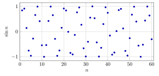
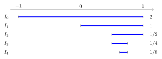
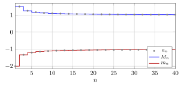
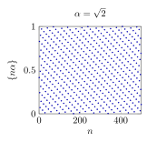
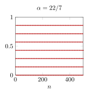

# 第 5 讲　子列、Bolzano–Weierstrass、上下极限 — (Subsequences, Bolzano–Weierstrass, limsup and liminf)

上一讲用迭代数列 (iterated sequences) 追踪误差：一旦误差按确定的比例缩小，整条数列便走向同一个极限 (limit)。但其他递推式产生的数列未必收敛。有些数据在两条轨道之间跳动，有些像在一个区间里到处走。看到它们不收敛 (do not converge)，并不等于已经读懂它们。

本讲的问题是：*数列不收敛时，能否选出一部分项，使它们按原来的次序组成收敛数列？*这样的选择叫子列 (subsequence)，子列的极限叫部分极限 (subsequential limit / cluster value)。我们将先认出不同的轨道，再使用 Bolzano–Weierstrass 定理保证有界数据至少有一条收敛的轨道。对有界数列，再考察最大与最小的部分极限，得到上极限 (limit superior) 与下极限 (limit inferior)。

这两个数保留了振荡 (oscillation) 的幅度，却丢掉了振荡发生的时间。这种压缩有用，也有代价：两列各自最高的项，可能从不在同一个时刻出现。我们会用实际数值看清这个问题，再研究相邻比值怎样控制长期增长。全讲数列从 $n=1$ 开始，三角函数的自变量一律用弧度 (radians)。

## 1 Selecting a subsequence

我们先看一个幅度逐渐增大、符号交替变化的数列。虽然整列不收敛，奇数项和偶数项却分别趋向两个数。

> [!WARNING] 先猜一猜 (Guess first)
>
>
> 对 $a_n=(-1)^n n/(n+1)$，先猜奇数编号与偶数编号的项各自走向哪里。若删去前面的许多项，这两条轨道会消失吗？若把编号按大小重新排列，和挑选子列是一回事吗？
>

> [!NOTE] 词语提示
>
>
> *decimal places*：小数位数；*rounded*：四舍五入后的；*tracks*：分支；*index*：下标；*even*：偶数的；*odd*：奇数的。
>

> [!NOTE] Example 5.1 — Two tracks, one sequence
>
>
> For $a_n=(-1)^n n/(n+1)$, the following values are rounded to six decimal places.
>
> | $n$ |       $a_n$ | $n$ |      $a_n$ |
> |------:|--------------:|------:|-------------:|
> |     1 | $-0.500000$ |     2 | $0.666667$ |
> |     3 | $-0.750000$ |     4 | $0.800000$ |
> |    19 | $-0.950000$ |    20 | $0.952381$ |
> |    99 | $-0.990000$ |   100 | $0.990099$ |
>
> The even terms approach $1$ from below; the odd terms approach $-1$ from above. In fact,
> $$
> a_{2j}=1-\frac1{2j+1},\qquad
>  a_{2j-1}=-1+\frac1{2j}.
> $$
> The errors are visible in the formulas: to make either error smaller than $\varepsilon$, it is enough to take $j>1/(2\varepsilon)$. Increasing the index is essential; repeatedly selecting the same early term would manufacture a constant sequence with no information about late behavior.
>

两条轨道各自稳定，整列却没有稳定。这正是需要给“挑选”规定次序的原因。

> [!IMPORTANT] 定义 5.2 — 子列 (Subsequence)
>
>
> 设 $(a_n)$ 为实数列 (real sequence)。若正整数编号满足
> $$
> n_1<n_2<\cdots<n_j<\cdots,
> $$
> 则 $(a_{n_j})_{j\ge1}$ 称为 $(a_n)$ 的子列 (subsequence)。$j$ 是新编号，$n_j$ 是原编号；由严格递增 (strictly increasing) 可得 $n_j\ge j$。
>

保留全部项也是一种选择，因此整列本身是自己的子列。这里不允许倒着挑，也不允许反复使用同一编号；允许跳过任意多项。

> [!NOTE] 定理 5.3 — 收敛与子列 (Convergence and subsequences)
>
>
> 实数列 $(a_n)$ 收敛 (converges) 到 $L$ 当且仅当 它的每一条子列 (subsequence) 都收敛到 $L$。
>

> [!NOTE] 证明
>
>
> 若 $a_n\to L$，给定 $\varepsilon>0$，取 $N$ 使得 $n\ge N$ 时 $|a_n-L|<\varepsilon$。任取子列 $a_{n_j}$，当 $j\ge N$ 时，$n_j\ge j\ge N$，故 $|a_{n_j}-L|<\varepsilon$。反方向只需选择 $n_j=j$，因为假设也包括整列本身。
>

这个定理的实用方向通常是：找出两条极限不同的子列，就能否定整列收敛。相反，只检查两条子列，通常还不足以确认整列收敛；要检查它们是否已经管住全部编号。

> [!IMPORTANT] 定义 5.4 — 部分极限 (Subsequential limit)
>
>
> 若存在子列 (subsequence) $a_{n_j}\to c\in\mathbb{R}$，则 $c$ 称为 $(a_n)$ 的部分极限 (subsequential limit / cluster value)。记所有这样的实数构成的集合为 $\mathcal{C}(a)$。本讲说“部分极限”时默认是有限实数；$+\infty,-\infty$ 的记号稍后另作约定。
>

> [!NOTE] 命题 5.5 — 反复接近的判据 (Repeated approach)
>
>
> 实数 $c$ 是部分极限 (subsequential limit) 当且仅当：对每个 $\varepsilon>0$ 和每个正整数 $N$，都能找到 $n\ge N$ 使 $|a_n-c|<\varepsilon$。
>

> [!NOTE] 证明
>
>
> 若 $a_{n_j}\to c$，取充分大的 $j$，同时满足 $j\ge N$ 和 $|a_{n_j}-c|<\varepsilon$，则 $n_j\ge N$。反之，令 $n_0=0$，依次在 $N=n_{j-1}+1$ 后挑选满足 $|a_{n_j}-c|<1/j$ 的项。假设保证每次都挑得到，而且编号严格递增。给定 $\varepsilon>0$，取整数 $J>1/\varepsilon$，当 $j\ge J$ 时误差小于 $\varepsilon$，故所选子列收敛到 $c$。
>

“反复接近”要求在任意晚的地方仍能找到项。哪怕某个早期数值恰好等于 $c$，也不能替代这个要求。反过来，部分极限也不必是数列实际取到过的值。

## 2 有限几个，还是整个区间？ (How many cluster values?)

周期 (period) 很短的数据，可以按余数分类；没有明显周期的数据，可以先用图像寻找规律，但不能让一幅有限图像替我们证明无限结论。

> [!WARNING] 先猜一猜 (Guess first)
>
>
> 先不画曲线：$\cos(n\pi/3)$ 有多少个不同的值？这些值中哪些会反复出现？再看图中的 $\sin n$：它像沿着有限条轨道走，还是有可能靠近区间内的任意位置？
>

> [!NOTE] 词语提示
>
>
> *arithmetic progression*：等差数列；*cluster values*：部分极限；*subsequence*：子列；*error band*：误差范围；*infinite*：无穷的；*minimum*：最小值；*indices*：下标；*period*：周期。
>

> [!NOTE] Example 5.6 — Count a whole period
>
>
> The first full period of $c_n=\cos(n\pi/3)$ is
> $$
> \begin{array}{c|rrrrrr}
> n\bmod 6&1&2&3&4&5&0\\\hline
> c_n&1/2&-1/2&-1&-1/2&1/2&1
> \end{array}
> $$
> Thus there are four cluster values:
> $$
> \mathcal{C}(c)=\{-1,-1/2,1/2,1\}.
> $$
> Each displayed value occurs along an infinite arithmetic progression of indices, giving a constant subsequence. If $c$ is outside this finite set, its minimum distance from the four values is positive. No term can enter a smaller error band around $c$, so there are no other cluster values.
>
> For the previous example, $\mathcal{C}(a)=\{-1,1\}$. To exclude every other value at once, note that $|a_n|=n/(n+1)\to1$. If $a_{n_j}\to c$, then $\bigl||a_{n_j}|-|c|\bigr|\le |a_{n_j}-c|$, so $|c|=1$.
>

按一个周期计数，可以防止把“出现的分支数”与“不同取值数”混淆。以下散点则没有这样短的重复模式。

图中是 $\sin n$ 的前 $60$ 项；请看点能否支持“只有少数几个可能的部分极限”的猜测，而不要把相邻点连线后的形状当成数列本身。

> [!NOTE] 词语提示
>
>
> *absolute error*：绝对误差；*index window*：一段下标范围；*arbitrarily*：任意地；*recurrence*：递推关系；*discarding*：舍去；*disjoint*：互不相交的；*finite*：有限的。
>

> [!NOTE] Example 5.7 — Search again after discarding the beginning
>
>
> To test whether $0$ and $0.6$ might be cluster values of $\sin n$, search for the closest value separately in three disjoint index windows. The entries below give the best index and the absolute error in that window.
>
> <table>
> <tbody>
> <tr>
> <td style="text-align: center;">Index window</td>
> <td colspan="2" style="text-align: center;">Target 0</td>
> <td colspan="2" style="text-align: center;">Target 0.6</td>
> </tr>
> <tr>
> <td style="text-align: center;"></td>
> <td style="text-align: right;">Index</td>
> <td style="text-align: right;">Error</td>
> <td style="text-align: right;">Index</td>
> <td style="text-align: right;">Error</td>
> </tr>
> <tr>
> <td style="text-align: center;">1–60</td>
> <td style="text-align: right;">22</td>
> <td style="text-align: right;">0.00885131</td>
> <td style="text-align: right;">59</td>
> <td style="text-align: right;">0.03673801</td>
> </tr>
> <tr>
> <td style="text-align: center;">61–600</td>
> <td style="text-align: right;">355</td>
> <td style="text-align: right;">0.00003014</td>
> <td style="text-align: right;">524</td>
> <td style="text-align: right;">0.00197580</td>
> </tr>
> <tr>
> <td style="text-align: center;">601–6000</td>
> <td style="text-align: right;">710</td>
> <td style="text-align: right;">0.00006029</td>
> <td style="text-align: right;">5494</td>
> <td style="text-align: right;">0.00163875</td>
> </tr>
> </tbody>
> </table>
>
> The best error for target $0$ gets *worse* in the last window. A cluster-value claim does not promise steady improvement in every finite window. It promises arbitrarily accurate returns at arbitrarily late indices. This table suggests recurrence, but it does not prove that promise.
>

这里直接陈述一个事实，不在本讲证明：$\sin n$ 的部分极限恰好是整个 $[-1,1]$。这是关于整数角度反复接近的结论；有限计算只能展示，不能确立它。特别是，观察到前面的点都在 $[-1,1]$ 内，只能排除区间外的部分极限，不能自动证明区间内的每个数都能达到。

> [!NOTE] 词语提示
>
>
> *estimate*：估计。
>

> [!IMPORTANT] Exercise 5.8 — The same limit along two tracks
>
>
> Guess the behavior of $b_n=(-1)^n/n$. Estimate how far apart the positive and negative tracks are after index $100$. Then prove that both tracks converge to $0$ and explain why, in this case, they account for every term. Contrast this with checking only the indices divisible by $2$ or $3$.
>

这个练习把“发现一些收敛子列”和“控制整列”放在同一幅图里：前者是挑选，后者还需要没有遗漏。

## 3 Bolzano–Weierstrass

一列点可以永远跳动，却不能在一个固定有限区间里永远逃离所有候选位置。下面的定理直接作为本讲的工具；我们用二分图像解释它的机制，并明确保留尚未偿还的一步。

> [!WARNING] 先猜一猜 (Guess first)
>
>
> $\sin n$ 有界 (bounded)，$n\sin n$ 无界 (unbounded)。后者还能有收敛子列吗？先把“整列有很大的项”和“能挑到一条稳定轨道”分开判断。再猜 $n^{(-1)^n}$ 与 $n$ 的情形。
>

> [!NOTE] 定理 5.9 — Bolzano–Weierstrass 定理 (Bolzano–Weierstrass theorem)
>
>
> 每个有界实数列 (bounded real sequence) 都有一条收敛子列 (convergent subsequence)，其极限是有限实数。
>

> [!WARNING] 欠条 (IOU) — \#3：第 14 讲还
>
>
> 本讲直接使用 Bolzano–Weierstrass。下面二分解释所欠的实数完备性 (completeness) 是：不断缩短、前后相套的非空闭区间 (nested closed intervals)，若长度趋于零，必共同包含一个实数点。图能表现长度变小，不能代替“那个点存在”的保证。第 14 讲还。
>

设所有项都在 $I_0=[A,B]$ 中，$A<B$。把它分成左右两个闭区间，至少一个含有无穷多个*编号*的项；否则两边都只有有限个编号，加起来也有限。选含无穷多项的一半为 $I_1$，再对 $I_1$ 重复。于是
$$
I_0\supset I_1\supset I_2\supset\cdots,
 \qquad |I_j|=(B-A)2^{-j}.
$$
这里数的是编号，不是不同取值：一个常数列也有无穷多个编号。

图示从 $[-1,1]$ 开始的一条可能选择路径，右侧标出长度；关键是每一层仍保留无穷多个编号，左右选择不必固定。

*借用欠条中的点 $c\in I_j$ 后*，余下的选择可以完全说清：在 $I_j$ 内选 $a_{n_j}$，且要求 $n_j>n_{j-1}$。有限个早期编号不可能耗尽该区间的无穷多项，所以选得出来。此时
$$
|a_{n_j}-c|\le |I_j|=(B-A)2^{-j}\longrightarrow0.
$$
给定 $\varepsilon>0$，选 $J$ 使 $(B-A)2^{-J}<\varepsilon$，便有 $j\ge J$ 时误差小于 $\varepsilon$。除区间交点的存在性外，子列的选择和误差估计都已完成；存在性由本节欠条记账。

> [!NOTE] 词语提示
>
>
> *cluster value*：部分极限；*eventually*：从某一项起始终；*unbounded*：无界的；*track*：分支。
>

> [!NOTE] Example 5.10 — Unbounded does not mean every track escapes
>
>
> Let $u_n=n^{(-1)^n}$. Then
> $$
> u_{2j}=2j\longrightarrow+\infty,\qquad
>  u_{2j-1}=\frac1{2j-1}\longrightarrow0.
> $$
> The sequence is unbounded, yet its odd-index subsequence converges. Its only finite cluster value is $0$: a convergent subsequence is bounded, so it contains only finitely many even indices, whose values grow without bound. Eventually it must use odd indices.
>
> By contrast, every subsequence of $v_n=n$ satisfies $v_{n_j}=n_j\ge j$ and tends to $+\infty$. Thus unboundedness alone decides neither the existence nor the absence of a convergent subsequence.
>
> For the more demanding probe $w_n=n\sin n$, direct computation gives
> $$
> \begin{array}{c|rrrr}
> n&3&22&355&710\\\hline
> w_n&0.423360&-0.194729&-0.010701&0.042805
> \end{array}
> $$
> These small returns warn against declaring that every subsequence escapes. They do not by themselves produce an infinite bounded subsequence.
>

$n\sin n$ 无界可由上一节陈述的事实看出：沿一条 $\sin n_j\to1$ 的子列，乘积趋于 $+\infty$。但它也确实有收敛子列。下面补足这个较难的猜测；关键是返回零附近的速度必须足以抵消前面的 $n$，只有 $\sin n_j\to0$ 还不够。

> [!NOTE] 命题 5.11 — 无界数列的收敛子列 (A convergent subsequence of an unbounded sequence)
>
>
> 无界数列 (unbounded sequence) $(n\sin n)$ 仍有收敛子列 (convergent subsequence)。
>

> [!NOTE] 证明
>
>
> 固定正整数 $Q$，把 $[0,1)$ 分成 $Q$ 个长度为 $1/Q$ 的半开区间。考察 $0,\pi,2\pi,\ldots,Q\pi$ 的小数部分 (fractional parts)，即每个数减去不超过它的最大整数后所剩的部分。 共有 $Q+1$ 个点，至少两个落在同一小段；这是抽屉原理 (pigeonhole principle)。两数相减，得到整数 $q,p$ 满足
> $$
> 1\le q\le Q,\qquad |q\pi-p|<1/Q.
> $$
> 这里使用 $\pi$ 是无理数 (irrational number) 这一外部事实；本课程不证明它，它也不属于第 14 讲要偿还的完备性欠条。由此，任意有限组正整数 $q$ 所对应的 $q\pi$ 到整数的距离都有正的最小值。因此随着 $Q$ 增大，这样选出的 $q$ 不可能始终有界；相应的正整数 $p$ 也不可能始终有界。我们便能挑出严格递增的 $p_j$。
>
> 用初等三角不等式 $|\sin t|\le |t|$（弧度制），每一对 $q,p$ 都给出
> $$
> |p\sin p|=p|\sin(p-q\pi)|
>  \le p|p-q\pi|<\frac pQ
>  <\pi+\frac1Q\le\pi+1.
> $$
> 所以 $(p_j\sin p_j)$ 是原列的一条有界子列；再用 Bolzano–Weierstrass，便能从它挑出收敛子列。注意：这证明某个有限部分极限存在，并没有证明该极限等于零。
>

> [!WARNING] 欠条 (IOU) — \#3 的一次使用：第 14 讲还
>
>
> 上面的有限分组只负责挑出有界子列；从有界子列再挑出收敛子列的存在性来自 Bolzano–Weierstrass，沿用欠条 \#3，第 14 讲还。
>

这段论证可以在初读时略过，但应记住它的任务：在无界数列里先找一条有界轨道，再使用工具。有限表格里的小数值本身不能完成这一步。

> [!NOTE] 推论 5.12 — 唯一部分极限判据 (A unique cluster value)
>
>
> 有界实数列 (bounded real sequence) 若恰好只有一个部分极限 (subsequential limit) $L$，则整列收敛 (converges) 到 $L$。
>

> [!NOTE] 证明
>
>
> 若不收敛到 $L$，则存在 $\varepsilon_0>0$，在任意晚的地方都能选到 $|a_n-L|\ge\varepsilon_0$ 的项。递归选出这样的子列 $a_{n_j}$。它仍有界，故由 Bolzano–Weierstrass 可再选一条子列收敛到某个 $c$。取极限得 $|c-L|\ge\varepsilon_0$，这与唯一性矛盾。
>

> [!WARNING] 欠条 (IOU) — \#3 的一次使用：第 14 讲还
>
>
> 刚才从那条远离 $L$ 的有界子列中再选收敛子列，使用了 Bolzano–Weierstrass，沿用欠条 \#3。没有有界性，$n^{(-1)^n}$ 已经给出反例。
>

## 4 振荡的上下边界 (Limsup and liminf)

上、下极限并不追踪“最大的一项”。它们要忽略任意有限段开头，记住始终还会回来的最高、最低位置。先看极值随删除早期数据怎样移动。

> [!WARNING] 先猜一猜 (Guess first)
>
>
> 对 $a_n=(-1)^n(1+1/n)$，整列最大的值和最小的值是什么？删掉前 $25$ 项后，剩下的值仍会靠近这两个极值吗？再对 $b_n=\sin(n\pi/4)+1/n$ 猜长期的上下边界。
>

> [!NOTE] 词语提示
>
>
> *exact*：精确的；*at least*：至少。
>

> [!NOTE] Example 5.13 — Moving ceilings and floors
>
>
> For $a_n=(-1)^n(1+1/n)$, let $e(n)$ be the first even integer at least $n$, and $o(n)$ the first odd integer at least $n$. Among all terms from index $n$ onward, the exact highest and lowest values are
> $$
> M_n=1+\frac1{e(n)},\qquad m_n=-1-\frac1{o(n)}.
> $$
>
> | $n$ |       $a_n$ |       $m_n$ |      $M_n$ |
> |------:|--------------:|--------------:|-------------:|
> |     1 | $-2.000000$ | $-2.000000$ | $1.500000$ |
> |     2 |  $1.500000$ | $-1.333333$ | $1.500000$ |
> |     3 | $-1.333333$ | $-1.333333$ | $1.250000$ |
> |    10 |  $1.100000$ | $-1.090909$ | $1.100000$ |
> |    25 | $-1.040000$ | $-1.040000$ | $1.038462$ |
> |   100 |  $1.010000$ | $-1.009901$ | $1.010000$ |
>
> The ceiling falls toward $1$ and the floor rises toward $-1$. The extreme early values $1.5$ and $-2$ do not survive as cluster values. Both limiting boundaries do survive, along the even and odd indices respectively.
>

这个例子的尾段最大、最小值恰好都能取到。一般数列未必如此，例如 $1-1/n$ 的任何尾段都没有最大的一项。因此需要第 3 讲的上确界 (supremum) 与下确界 (infimum)。

图中灰点持续跳动，两条边界却单调移动；上下极限记录的是边界最后到哪里，而非灰点最后到哪里。

> [!IMPORTANT] 定义 5.14 — 上极限与下极限 (Limit superior and limit inferior)
>
>
> 对有界数列 (bounded sequence) $(a_n)$，把最大的部分极限 (subsequential limit) 称为上极限 (limit superior)，把最小的部分极限称为下极限 (limit inferior)，记为
> $$
> \limsup_{n\to\infty}a_n=\max\mathcal{C}(a),\qquad
>  \liminf_{n\to\infty}a_n=\min\mathcal{C}(a).
> $$
> 下面证明这两个极端部分极限确实存在，使定义有意义 (well-defined)。
>

> [!NOTE] 定理 5.15 — 尾段公式 (Tail formulas)
>
>
> 设 $(a_n)$ 有界 (bounded)，定义尾段上确界 (tail supremum) 与尾段下确界 (tail infimum)
> $$
> M_n=\sup_{k\ge n}a_k,\qquad m_n=\inf_{k\ge n}a_k.
> $$
> 则最大的、最小的部分极限 (subsequential limits) 都存在，且
> $$
> \limsup a_n=\lim_{n\to\infty}M_n=\inf_n M_n,
>  \qquad
>  \liminf a_n=\lim_{n\to\infty}m_n=\sup_n m_n.
> $$
>

> [!WARNING] 欠条 (IOU) — 旧欠条 \#2 的使用：第 14 讲还
>
>
> 以下尾段论证使用第 3 讲已借用的确界存在性 (existence of suprema) 与单调有界定理 (Monotone Convergence Theorem)，沿用旧欠条 \#2，第 14 讲还。本讲的新欠条 \#3 专门记录 Bolzano–Weierstrass 二分解释中共同点的存在性。
>

> [!NOTE] 证明
>
>
> 删去一项不会增加上确界，也不会减小下确界，因此
> $$
> m_n\le m_{n+1}\le M_{n+1}\le M_n.
> $$
> 两列有界而单调，故 $M_n\to U$、$m_n\to\ell$，其中 $\ell\le U$，且 $U=\inf_nM_n$、$\ell=\sup_nm_n$。
>
> 现在关键不是 $U$ 存在，而是能否挑到趋近 $U$ 的*原列项*。令 $n_0=0$，第 $j$ 步取整数 $r_j\ge n_{j-1}+1$，且使 $M_{r_j}<U+1/j$。由上确界的定义，可以选 $n_j\ge r_j$ 满足
> $$
> M_{r_j}-1/j<a_{n_j}\le M_{r_j}.
> $$
> 因为 $M_{r_j}\ge U$，得到 $U-1/j<a_{n_j}<U+1/j$，所以 $a_{n_j}\to U$。用下确界同样选择：使 $m_{r_j}>\ell-1/j$，再选 $m_{r_j}\le a_{n_j}<m_{r_j}+1/j$，即可得趋于 $\ell$ 的子列。
>
> 最后，若 $a_{k_j}\to c$，固定任意 $n$，对充分大的 $j$ 有 $k_j\ge n$，于是 $m_n\le a_{k_j}\le M_n$。先让 $j\to\infty$，再让 $n\to\infty$，得 $\ell\le c\le U$。所以 $U$、$\ell$ 确实是最大的、最小的部分极限。
>

证明里必须让所选编号严格增大；如果只写“在整个数列中找一个接近上确界的项”，就可能一直挑到同一个早期峰值。

> [!NOTE] 命题 5.16 — 两种误差要求 (Two error requirements)
>
>
> 对有界数列 (bounded sequence)，$U$ 是其上极限 (limit superior)，即 $U=\limsup a_n$，当且仅当 对每个 $\varepsilon>0$ 都有：
>
> 1.  $a_n<U+\varepsilon$，对充分大的 $n$；
>
> 2.  在任意晚的编号之后，仍有一项 $a_n>U-\varepsilon$。
>
> 下极限 (limit inferior) 的判据对应为：最终所有项大于 $\ell-\varepsilon$，且任意晚仍有项小于 $\ell+\varepsilon$。
>

> [!NOTE] 证明
>
>
> 若 $U=\lim M_n$，第一条由 $M_n\to U$ 得到。第二条若失败，就有某个尾段的上确界不超过 $U-\varepsilon$，与所有 $M_n\ge U$ 矛盾。反之，第一条保证尾段上确界的极限不超过 $U+\varepsilon$；第二条保证每个 $M_n\ge U-\varepsilon$。让 $\varepsilon$ 任意小，即得该极限为 $U$。下极限的论证把不等号方向反过来即可。
>

一个条件挡住过高的项，另一个保证不会过早把边界压低。只满足其中之一，不足以确定上极限。

> [!NOTE] 词语提示
>
>
> *subsequences*：子列；*remainder*：余项；*periodic*：周期的；*limsup*：上极限；*liminf*：下极限；*modulo*：取余数。
>

> [!NOTE] Example 5.17 — A periodic signal with a vanishing drift
>
>
> Let $b_n=\sin(n\pi/4)+1/n$. The subsequences at the top and bottom of the periodic signal give
>
> | Top index |      $b_n$ | Bottom index |       $b_n$ |
> |----------:|-------------:|-------------:|--------------:|
> |         2 | $1.500000$ |            6 | $-0.833333$ |
> |        10 | $1.100000$ |           14 | $-0.928571$ |
> |        50 | $1.020000$ |           54 | $-0.981481$ |
> |        98 | $1.010204$ |          102 | $-0.990196$ |
>
> Since $-1+1/n\le b_n\le1+1/n$, every cluster value lies in $[-1,1]$. Along $n=8j+2$ the values tend to $1$, and along $n=8j+6$ they tend to $-1$, where $j=0,1,\ldots$. Hence
> $$
> \limsup b_n=1,\qquad \liminf b_n=-1.
> $$
> In fact, the cluster values are exactly $-1,-\sqrt2/2,0,\sqrt2/2,1$. Classifying indices by their remainder modulo $8$ proves this: any infinite selection has an infinite sub-selection in one remainder class. The drift $1/n$ changes the early heights but not the limiting levels.
>

不能把这个例子误读为“上下极限之间的每个点都是部分极限”。上下边界相同的两列，内部可能只有少数部分极限，也可能填满整个区间。

### 4.1 无界时的约定 (The unbounded case)

为讨论增长率，需要让上下极限也能取 $+\infty,-\infty$。这是扩充实数 (extended real numbers) 的记号，不是把它们当普通实数做任意运算。

> [!IMPORTANT] 定义 5.18 — 无界数列的上下极限 (Extended limsup and liminf)
>
>
> 对任意实数列，仍令 $M_n=\sup_{k\ge n}a_k$、$m_n=\inf_{k\ge n}a_k$。尾段无上界 (unbounded above) 时约定 $M_n=+\infty$；无下界 (unbounded below) 时约定 $m_n=-\infty$。定义
> $$
> \limsup a_n=\lim_nM_n,\qquad \liminf a_n=\lim_nm_n,
> $$
> 允许极限为无穷；趋于 $+\infty$ 指最终超过每个给定实数，趋于 $-\infty$ 类似。
>

这些单调尾段量总有扩充实数意义的极限：有有限边界时用单调有界定理，没有有限边界时直接满足相应的无穷极限定义。有界情形与先前定义一致。比如 $n^{(-1)^n}$ 的下极限是 $0$、上极限是 $+\infty$；$n$ 的二者都是 $+\infty$。二者同为无穷不叫收敛到实数。

> [!WARNING] 欠条 (IOU) — 旧欠条 \#2 的使用：第 14 讲还
>
>
> 无界情形中，只要尾段确界的极限是有限实数，就仍调用确界存在性与单调有界定理，沿用第 3 讲的欠条 \#2，第 14 讲还。无穷极限的判断本身只用“最终超过任意给定界”的定义。
>

## 5 能做哪些运算？ (What survives arithmetic?)

上下极限能比较两条数列，却通常不能像普通极限那样随意拆开加法。先用最简单的错峰现象检查直觉。

> [!WARNING] 先猜一猜 (Guess first)
>
>
> 若两列的上极限都是 $1$，它们的和的上极限一定是 $2$ 吗？先让两列峰值同时出现，再让它们错开出现。哪个实验给出 the worst case？
>

> [!NOTE] Example 5.19 — Peaks that never meet
>
>
> Take $a_n=(-1)^n$ and $b_n=-(-1)^n$. Both have limsup $1$ and liminf $-1$, but $a_n+b_n=0$ at every index. Thus
> $$
> \limsup(a_n+b_n)=0<2=\limsup a_n+\limsup b_n.
> $$
> If instead $b_n=a_n$, the sum alternates between $-2$ and $2$, and equality holds. The individual upper boundaries do not record whether the peaks arrive together. This is why an inequality, rather than an equality, is the correct general rule.
>

下面先把所有量限制为有界实数列，避免未定义的无穷运算遮住核心现象。

> [!NOTE] 命题 5.20 — 基本运算 (Basic rules)
>
>
> 设 $(a_n),(b_n)$ 为有界数列 (bounded sequences)，记 $U_a=\limsup a_n$、$\ell_a=\liminf a_n$，对 $b$ 类似。
>
> 1.  $\inf_n a_n\le\ell_a\le U_a\le\sup_n a_n$。改变有限项或删去有限项不改变上下极限 (limsup and liminf)。
>
> 2.  若 $a_n\le b_n$，对充分大的 $n$，则 $\ell_a\le\ell_b$、$U_a\le U_b$。
>
> 3.  $\limsup(-a_n)=-\ell_a$、$\liminf(-a_n)=-U_a$。若 $t\ge0$、$d\in\mathbb{R}$，则 $\limsup(ta_n+d)=tU_a+d$，$\liminf(ta_n+d)=t\ell_a+d$。
>
> 4.  $a_n$ 收敛 (converges) 到实数 $L$ 当且仅当 $\ell_a=U_a=L$。
>
> 5.  加法满足
>     $$
>     \ell_a+\ell_b\le\liminf(a_n+b_n)
>      \le\limsup(a_n+b_n)\le U_a+U_b.
>     $$
>     若 $b_n\to b$，则 $\limsup(a_n+b_n)=U_a+b$，$\liminf(a_n+b_n)=\ell_a+b$。
>

> [!NOTE] 证明
>
>
> 第一条由尾段上下确界的夹逼关系得到。有限次改变之后的尾段完全相同，所以其极限不变。对于第二条，在足够晚的每个尾段上取上确界、下确界，再取极限即可。
>
> 第三条中，取负号把每个上界变成下界，故 $\sup_{k\ge n}(-a_k)=-\inf_{k\ge n}a_k$；同理交换另一对。对 $t>0$，乘 $t$ 再加 $d$ 保持大小次序，尾段确界也乘 $t$ 再加 $d$；$t=0$ 是常数列。
>
> 若 $\ell_a=U_a=L$，由 $m_n\le a_n\le M_n$ 与两边趋于 $L$ 得 $a_n\to L$。反之，若 $a_n\to L$，给定 $\varepsilon>0$，足够晚的每个尾段都包含于 $[L-\varepsilon,L+\varepsilon]$，故其上下确界以及它们的极限也在这个区间。$\varepsilon$ 任意，得 $\ell_a=U_a=L$。
>
> 对于加法，给定 $\varepsilon>0$，最终同时有 $a_n<U_a+\varepsilon/2$、$b_n<U_b+\varepsilon/2$，从而 $a_n+b_n<U_a+U_b+\varepsilon$。尾段公式给出 $\limsup(a_n+b_n)\le U_a+U_b+\varepsilon$，再让 $\varepsilon$ 任意小。用最终下界作同样估计，得下极限的不等式。中间的不等式是第一条。
>
> 若 $b_n\to b$，已有 $\limsup(a_n+b_n)\le U_a+b$。把 $a_n=(a_n+b_n)+(-b_n)$ 再用一次刚证的不等式，得 $U_a\le\limsup(a_n+b_n)-b$，两边合起来即为等式。下极限用相同的下界论证，或整体取负号。
>

这些结论的共同基础是数列的尾段。尤其当 $r_n\to0$ 时，$a_n+r_n$ 与 $a_n$ 的上下极限相同；这解释了上一节的漂移为何最后消失。

上、下极限还有一个用途：尚未知道整列收敛时，可以先追踪它可能留下的振荡宽度。下面用一个相邻项混合后的输出，反推原来的轨道。

> [!NOTE] 词语提示
>
>
> *oscillation*：振荡；*induction*：数学归纳法；*shift*：平移；移动；*bound*：界；估计。
>

> [!NOTE] Example 5.21 — A stable output can force a stable input
>
>
> Starting with $x_1=0$, generate the sequence by
> $$
> x_n+3x_{n+1}=8+\frac1n=:y_n.
> $$
> Before computing, guess whether the negative coefficient in $x_{n+1}=(y_n-x_n)/3$ will preserve or damp oscillation.
>
> | $n$ |      $x_n$ |      $y_n$ |
> |------:|-------------:|-------------:|
> |     1 | $0.000000$ | $9.000000$ |
> |     2 | $3.000000$ | $8.500000$ |
> |     3 | $1.833333$ | $8.333333$ |
> |     4 | $2.166667$ | $8.250000$ |
> |     5 | $2.027778$ | $8.200000$ |
> |    10 | $2.027090$ | $8.100000$ |
> |    20 | $2.012980$ | $8.050000$ |
>
> First establish a bound instead of assuming convergence. Since $|y_n|\le9$ and $x_1=0$, induction gives $|x_n|\le9/2$: if this holds at $n$, then
> $$
> |x_{n+1}|\le\frac{9+9/2}{3}=\frac92.
> $$
> Now write $U=\limsup x_n$ and $\ell=\liminf x_n$. A shift of one index changes neither boundary. Since $y_n\to8$, the arithmetic rules give
> $$
> U=\frac{8-\ell}{3},\qquad \ell=\frac{8-U}{3}.
> $$
> Subtracting yields $U-\ell=(U-\ell)/3$, hence $U=\ell$. Substitution gives $4U=8$, so $x_n\to2$. The computation is consistent with the proof, but the proof never assumed a limit for $x_n$ in advance.
>

这个过程是一次 bootstrap：先取得有界性，才有有限的上下极限；再让方程迫使振荡宽度为零。直接在原递推式两边写“取极限”，会把最需要证明的存在性偷放进起点。

> [!WARNING] 欠条 (IOU) — 旧欠条 \#2 的使用：第 14 讲还
>
>
> 此例对有界 $(x_n)$ 使用已建立的有限上下极限，其存在性沿用尾段公式中的确界与单调有界性借用；没有额外假设 $x_n$ 已经收敛。第 14 讲还。
>

## 6 Ratios and roots

正数列 (positive sequence) 的相邻比值 (successive ratio) $a_{n+1}/a_n$ 看一步增长，$n$ 次根 (nth root) $\sqrt[n]{a_n}$ 看从起点累积到现在的平均增长。一步步变化很剧烈时，长期平均能稳定吗？

> [!WARNING] 先猜一猜 (Guess first)
>
>
> 令 $a_n=2^n3^{(-1)^n}$。先猜相邻比值是否有极限，再猜 $\sqrt[n]{a_n}$ 是否有极限。哪种量对一个固定倍数的干扰更敏感？
>

> [!NOTE] 词语提示
>
>
> *alternating*：交替的；*bounds*：上下界；*sharp*：不能改进的；最优的。
>

> [!NOTE] Example 5.22 — Violent ratios, stable roots
>
>
> For $a_n=2^n3^{(-1)^n}$,
> $$
> \frac{a_{n+1}}{a_n}=2\,3^{-2(-1)^n}
>  =\begin{cases}18,&n\text{ odd},\\2/9,&n\text{ even},\end{cases}
>  \qquad \sqrt[n]{a_n}=2\,3^{(-1)^n/n}.
> $$
>
> | $n$ | $\sqrt[n]{a_n}$ | $a_{n+1}/a_n$ |
> |------:|------------------:|----------------:|
> |    10 |      $2.232246$ |         $2/9$ |
> |    11 |      $1.809903$ |          $18$ |
> |   100 |      $2.022093$ |         $2/9$ |
> |   101 |      $1.978363$ |          $18$ |
>
> The roots approach $2$ from alternating sides, although the ratios never settle down. The prospective bounds are $2/9\le2\le18$; neither outside bound is sharp in this example.
>

这个例子中，相邻比值在 $2/9$ 与 $18$ 之间切换，根值却趋于 $2$。 若只知道足够晚的比值不超过 $s$，连乘便得到 $a_n\le a_Ns^{n-N}$。 开 $n$ 次根后，固定的初始因子会消失；第 2 讲的“固定正底数的根极限”已经给出了所需结论。

具体地，对每个固定的 $C>0$，有 $C^{1/n}\to1$。下面把这个结论用于连乘得到的不等式。

> [!NOTE] 定理 5.23 — 比值与根值的比较 (Ratio–root bounds)
>
>
> 设 $a_n>0$，则在非负扩充实数 (nonnegative extended real numbers) 的意义下，
> $$
> \boxed{\displaystyle
>  \liminf_{n\to\infty}\frac{a_{n+1}}{a_n}
>  \le \liminf_{n\to\infty}\sqrt[n]{a_n}
>  \le \limsup_{n\to\infty}\sqrt[n]{a_n}
>  \le \limsup_{n\to\infty}\frac{a_{n+1}}{a_n}.}
> $$
> 特别地，若相邻比值 (successive ratio) 趋于 $r\in[0,+\infty]$，则根值 (nth root) 也趋于 $r$。
>

> [!NOTE] 证明
>
>
> 记比值上下极限为 $\alpha,\beta$。若 $\beta<+\infty$，任取正数 $s>\beta$。由尾段公式，存在 $N$，使 $a_{k+1}/a_k\le s$ 对所有 $k\ge N$ 成立。于是对 $n>N$，连乘得
> $$
> a_n=a_N\prod_{k=N}^{n-1}\frac{a_{k+1}}{a_k}
>  \le a_Ns^{n-N},\qquad
>  \sqrt[n]{a_n}\le s\,(a_Ns^{-N})^{1/n}.
> $$
> 右端趋于 $s$，所以根值上极限不超过 $s$。因任意正数 $s>\beta$ 都可以，得 $\limsup\sqrt[n]{a_n}\le\beta$，也包括 $\beta=0$。若 $\beta=+\infty$，这个上界本来就成立。
>
> 对下界，若 $\alpha>0$，任取 $0<t<\alpha$；当 $\alpha=+\infty$ 时 $t$ 可取任意正实数。足够晚有 $a_{k+1}/a_k\ge t$，故同样连乘得
> $$
> \sqrt[n]{a_n}\ge t\,(a_Nt^{-N})^{1/n},
> $$
> 从而根值下极限至少为 $t$。遍取这些 $t$，便得所需下界；若 $\alpha=0$，由根值为正，下界自动成立。中间的不等式由上下极限的定义得到。若 $\alpha=\beta=r$，夹逼即给出最后的断言，包括趋于零与趋于正无穷的情况。
>

关键是只对足够晚的比值提出要求。前面的有限项只影响固定因子 $a_Ns^{-N}$ 或 $a_Nt^{-N}$，开 $n$ 次根后它们都趋于 $1$。

我们把这个定理用在阶乘 (factorial) 上。直接看 $n!$ 会得到越来越大的比值，读不出细致的增长尺度；先除去猜测的主要尺度，才有合适的对象。

> [!NOTE] 词语提示
>
>
> *cancellation*：相消；*logarithms*：对数；*factorial*：阶乘；*geometric*：等比的；*normalize*：归一化；*ratio*：比值。
>

> [!NOTE] Example 5.24 — Normalize before taking ratios
>
>
> Estimate $q_n=\sqrt[n]{n!}/n$. It is the geometric mean of $1/n,2/n,\ldots,n/n$, so it lies between $1/n$ and $1$. The following values suggest a positive limit well below $1$:
>
> | $n$ |      $q_n$ | $(n/(n+1))^n$ |
> |------:|-------------:|----------------:|
> |     5 | $0.521034$ |    $0.401878$ |
> |    10 | $0.452873$ |    $0.385543$ |
> |    50 | $0.389665$ |    $0.371528$ |
> |   100 | $0.379927$ |    $0.369711$ |
> |   500 | $0.370854$ |    $0.368247$ |
> |  1000 | $0.369492$ |    $0.368063$ |
>
> Set $b_n=n!/n^n$. The key cancellation is exact:
> $$
> \frac{b_{n+1}}{b_n}
>  =\frac{(n+1)!}{(n+1)^{n+1}}\frac{n^n}{n!}
>  =\left(\frac n{n+1}\right)^n
>  =\frac1{(1+1/n)^n}\longrightarrow\frac1e.
> $$
> Here we use the defining sequence for $e$ from Lecture 3. Ratio–root bounds now give
> $$
> \frac{\sqrt[n]{n!}}{n}=\sqrt[n]{b_n}\longrightarrow\frac1e,
>  \qquad \frac1e\approx0.3678794412.
> $$
> For numerical work, compute $q_n$ as $\exp(\log(n!)/n-\log n)$, accumulating the logarithms or using a log-factorial routine. Forming the huge factorial in floating point first is unnecessary. This computational choice is not part of the proof.
>

阶乘例子中的归一化 (normalization) 是决定性的一步：我们要估计的是相对于 $n$ 的根值规模，而不是阶乘本身。表里根值比相邻比值靠近极限慢，也提醒我们：定理给出相同的极限，并没有许诺相同的误差速度。

> [!WARNING] 欠条 (IOU) — 旧欠条 \#2 的使用：第 14 讲还
>
>
> 本节的上下极限沿用尾段存在性；阶乘应用还使用第 3 讲已建立、其存在性尚借用单调有界定理的 $e=\lim(1+1/n)^n$。两处都沿用旧欠条 \#2，第 14 讲还。
>

## 7 An AI experiment

下面比较无理数与有理数 (rational number) 的整数倍小数部分。小数部分记作 $\{x\}=x-\lfloor x\rfloor$，其中 $\lfloor x\rfloor$ 是不超过 $x$ 的最大整数。这是在 $[0,1)$ 中不断走动的另一种模型。

> [!NOTE] 词语提示
>
>
> *floating-point*：浮点的；*horizontal*：水平的；*precision*：计算精度；*predict*：预测。
>

> [!NOTE] 词语提示
>
>
> *histogram*：直方图；*bin*：统计分组区间；*benchmark*：核对用的参考结果；*significand*：有效数部分；*binary64*：64位二进制浮点格式；*residue class*：同余类，即除以同一整数后余数相同的一组整数。
>

> [!NOTE] AI Lab — Repeated visits or seven exact levels?
>
>
> Ask an AI to plot $z_n=\{n\alpha\}$ for $1\le n\le500$, using $\alpha=\sqrt2$ and $\alpha=22/7$. Request a scatter plot against $n$, a histogram with ten equal bins in $[0,1)$, and a second plot after discarding the first half of the data.
>
> **Before running it:** predict which plot has finitely many horizontal levels. Predict whether a target very close to $1$ can be approached even though every fractional part is strictly below $1$.
>
> **Implementation requirements.** Use exact rational arithmetic for $22/7$: compute $((22n)\bmod7)/7$, not a floating-point remainder of an approximate decimal. For $\sqrt2$, state the numerical precision. A minimal Python core is:
>
>     from math import sqrt
>     from fractions import Fraction
>     N = 500
>     irr = [(n * sqrt(2)) % 1 for n in range(1, N+1)]
>     rat = [Fraction((22*n) % 7, 7) for n in range(1, N+1)]
>
> **Benchmarks from an actual run.** This run uses binary64 arithmetic with a 53-bit significand; its bin counts and rounded extremes were also checked with 60-digit decimal arithmetic. The rational case has exactly seven values $0,1/7,\ldots,6/7$. Their counts, in that order, are
> $$
> 71,\ 72,\ 72,\ 72,\ 71,\ 71,\ 71.
> $$
> For $\sqrt2$, the counts in bins $[j/10,(j+1)/10)$, $j=0,\ldots,9$, are
> $$
> 50,\ 49,\ 51,\ 50,\ 51,\ 48,\ 51,\ 50,\ 51,\ 49.
> $$
> The smallest and largest observed values are approximately $0.0020920411$ and $0.9991334482$.
>
> **Answer from the output.** Which features survive deletion of the first half? Does the histogram prove that every point is a cluster value? Why does a finite search that misses a tiny interval fail to disprove that claim? Explain why a floating-point program reporting more than seven rational levels has computed the wrong exact object.
>
> **What can be proved immediately.** Since $22n\equiv n\pmod7$, every residue class occurs periodically, and the seven displayed rational values are precisely its cluster values. For irrational $\alpha$, use the following stated fact without proving it here: every interval of positive length inside $[0,1]$ is visited at arbitrarily late indices. Consequently every point of $[0,1]$, including both endpoints, is a cluster value. The experiment illustrates this fact; it does not establish it.
>

这里“稠密 (dense)”只描述一个具体的区间现象：任意短的正长度区间里，任意晚仍能找到项；我们不引入一般空间的语言。$500$ 个点有 $500$ 个不同取值，也不能推出有无穷多个部分极限，因为有限数据还没有规定后面的行为。

两图使用相同坐标范围；右图的七条水平线来自精确余数运算，左图的覆盖状况则只是一段有限记录。请特别看靠近上边界的位置，而不只看中间区域。

## 8 Exercises

> [!NOTE] 词语提示
>
>
> *cluster values*：部分极限；*oscillation*：振荡；*subsequence*：子列；*threshold*：门槛；*supremum*：上确界；*periodic*：周期的；*estimate*：估计；*predict*：预测；*maximum*：最大值；*indices*：下标；*bounded*：有界的；*justify*：给出理由；*parity*：奇偶性；*finite*：有限的；*tracks*：分支；*limsup*：上极限；*liminf*：下极限；*exact*：精确的；*at least*：至少；*ratio*：比值；*index*：下标；*tail*：从某项开始的尾段。
>

> [!NOTE] 词语提示
>
>
> *parity-dependent*：随下标奇偶性而定的；*concatenate*：依次首尾相接；*nearest-grid-point error*：与最近网格点的距离；*obstruct*：排除这种可能性。
>

1. **5.1**  $\bigstar$ **(homework)** For $a_n=(-1)^n n/(n+1)$, predict the two tracks and compute the first index from which each term lies within $0.015$ of its parity-dependent target. Give a proof of your threshold. Explain why this is not convergence of the whole sequence.

1. **5.2**  $\bigstar$ Compare $\cos(n\pi/3)$ and $\cos(2n\pi/3)$. Guess their numbers of cluster values before listing a period. Identify which values disappear in the second sequence and explain the change using the selected indices.

1. **5.3**  $\bigstar$ Draw rough plots for $a_n=n^{(-1)^n}$ and $b_n=(-1)^n n$. Decide by eye whether either has a finite cluster value. Then justify all finite cluster values, limsups, and liminfs. Which example refutes the claim that a unique finite cluster value guarantees convergence?

1. **5.4**  $\bigstar$$\bigstar$ **(homework)** Let $a_n=(-1)^n(1+2/n)$. Predict its tail ceilings and floors, then compute them for $n=1,4,11,40$. Find exact formulas and estimate an index after which each boundary is within $0.01$ of its limit. Explain why a maximum over $n\le k\le100$ is not the definition of a tail supremum.

1. **5.5**  $\bigstar$$\bigstar$ Design two bounded sequences with limsup $2$ and $3$ respectively such that the limsup of their sum is $5$. Then design another pair with the same individual limsups whose sum has limsup $1$. Use short periodic patterns and draw the peaks before proving the claims.

1. **5.6**  $\bigstar$$\bigstar$ For $x_1=1$ and $x_n+4x_{n+1}=15+2/n$, guess the limit and compute enough terms to see the initial oscillation. Prove boundedness, then use limsup and liminf to prove your guess. Compare with the equation $x_n+x_{n+1}=0$: what feature of the oscillation argument fails?

1. **5.7**  $\bigstar$$\bigstar$ **(homework)** Before computing, compare the roots and successive ratios of $a_n=5^n2^{(-1)^n}$ and $b_n=n!/n^n$. Make a table at $n=20,21,200,201$. Prove the limits or limiting boundaries you predict. Explain why failure of ratio convergence does not imply failure of root convergence.

1. **5.8**  $\bigstar$$\bigstar$ Reproduce the AI Lab using exact rational arithmetic for $22/7$. Then compare the first $500$ values with the next $500$. For target $0.97$, report the best error in each block for each choice of $\alpha$. State separately what the finite data establish and what uses the stated irrational-rotation fact.

1. **5.9**  $\bigstar$$\bigstar$$\bigstar$ Construct one bounded sequence whose cluster values are exactly $\{-1,0,1\}$ and another whose cluster values are all of $[-1,1]$. For the second, concatenate the finite grids
    $$
    -1+\frac{2k}{m}\quad(k=0,1,\ldots,m),\qquad m=1,2,3,\ldots
    $$
    Plot the first few blocks. Given a target $c\in[-1,1]$, estimate the nearest-grid-point error and use one point from each block to prove convergence to $c$. Do both sequences have the same limsup and liminf?

1. **5.10** $\bigstar$$\bigstar$$\bigstar$ A bounded sequence has the property that every convergent subsequence tends to $L$. First try to draw a sequence with infinitely many points at distance at least $0.1$ from $L$. Explain why Bolzano–Weierstrass obstructs the drawing. Then replace $0.1$ by a suitable $\varepsilon_0>0$ and prove convergence. Mark the exact step at which boundedness is used.

> [!NOTE] 回望 (Looking back)
>
>
> 子列用于描述部分项的极限，上下极限用于估计整个尾段。Bolzano–Weierstrass 的存在性仍记入欠条 \#3。下一讲用数列检验函数极限。
>
