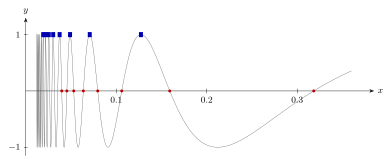

# 第 5 讲　函数的极限 (Limits of functions)

前两讲各留下一个没有答完的问题。

第 3 讲第 6.2 节证明了：当 $h=\pm\frac1n$ 时，$\frac{e^h-1}h\to1$。那里写道：“目前只验证了 $x=\pm1/n$，还不能据此断言任意趋于零的取值都成立。”

第 4 讲第 6 节里，$\cos$ 迭代的相邻差的比值稳定在 $-0.673$ 附近。它等于 $-\sin\frac{x_{n+1}+x_n}2\cdot\frac{\sin t_n}{t_n}$，其中 $t_n\to0$。$\frac{\sin t}t$ 在 $t$ 接近 $0$ 时是否趋于 $1$，那里没有回答。

两个问题是同一种：一个式子在 $0$ 处没有意义，要知道自变量接近 $0$ 时它的值接近什么。本讲要回答：

1. “$x$ 趋于 $a$ 时 $f(x)$ 趋于 $L$”的精确说法是什么？
2. 上面两个式子是否趋于 $1$？相差多少？
3. 两个量相减，主要的部分互相抵消时，剩下的有多大？

需要的预备知识：第 2 讲的定义 2.3、命题 2.8（极限唯一）、定理 2.26（极限的运算）、定理 2.28（夹逼定理）、命题 2.33（对数）、命题 2.37（指数函数）和第 7 节；命题 2.27、定义 2.36 和第 6.5 节；第 3 讲的定义 3.15（$e$）；第 4 讲的定理 4.6。三角函数按高中的定义使用（第 2 讲第 7.5 节）；本讲另外用到两条高中学过的事实：$0<t<\frac\pi2$ 时 $\sin t<t<\tan t$；$\cos$ 在 $[0,1]$ 上严格递减。

## 1 三张表

先算几个值。前两张表里的数都只用加减乘除和开平方算出，开平方是第 1 讲的事。

**对数与指数。** 第 2 讲的 $\ln$ 由反复开平方定义：$\ln x$ 是数列 $2^k\left(x^{1/2^k}-1\right)$ 的极限。把命题 2.33 第 2 条用于 $x^{1/2^k}$，得到 $2^k\left(1-x^{-1/2^k}\right)\le\ln x\le2^k\left(x^{1/2^k}-1\right)$，所以开 $k$ 次平方就把 $\ln x$ 夹在两个算得出的数之间。例如 $x=1.1$，$k=10$ 时两端是 $0.095306$ 与 $0.095315$。表里的六位小数要开 $20$ 次左右才定得出。$\ln$ 就是这样定义的，所以表也这样算，不借用计算器上的 $\ln$ 键：

| $h$ | $0.1$ | $0.01$ | $0.001$ | $-0.001$ | $-0.01$ | $-0.1$ |
|---|---|---|---|---|---|---|
| $\dfrac{\ln(1+h)}h$ | $0.953102$ | $0.995033$ | $0.999500$ | $1.000500$ | $1.005034$ | $1.053605$ |

表里的值都接近 $1$，与 $1$ 相差大约 $\frac{|h|}2$。指数函数是对数的反函数，它的比值 $\frac{\exp(h)-1}h$ 放到第 4 节一起看。

**正弦。** 取 $t=\frac\pi n$，$n=6,12,24,48,96$，每次把角对半分。从 $\sin\frac\pi6=\frac12$，$\cos\frac\pi6=\frac{\sqrt3}2$ 出发，用半角公式 $\cos\frac t2=\sqrt{\frac{1+\cos t}2}$，$\sin\frac t2=\frac{\sin t}{2\cos\frac t2}$ 逐个算出。

| $n$ | $6$ | $12$ | $24$ | $48$ | $96$ |
|---|---|---|---|---|---|
| $n\sin\dfrac\pi n$ | $3$ | $3.105829$ | $3.132629$ | $3.139350$ | $3.141032$ |
| $n\tan\dfrac\pi n$ | $3.464102$ | $3.215390$ | $3.159660$ | $3.146086$ | $3.142715$ |
| $\cos\dfrac\pi n$ | $0.866025$ | $0.965926$ | $0.991445$ | $0.997859$ | $0.999465$ |

由 $\sin t<t<\tan t$，取 $t=\frac\pi n$ 再乘以 $n$：$\pi$ 在第一行与第二行之间。这张表没有用到 $\pi$ 的值，反过来它给出 $3.1410<\pi<3.1428$。

取 $t=\frac\pi n$，第一行是 $n\sin\frac\pi n=\pi\cdot\frac{\sin t}t$，第二行是 $n\tan\frac\pi n=\pi\cdot\frac{\tan t}t$。所以 $\frac{\sin t}t$ 是否趋于 $1$，就是问这两行是否合拢。两行的比是第三行 $\cos\frac\pi n$，它接近 $1$。

两张表都只列了几个点。第 3 讲对 $h=\pm\frac1n$ 这一串点做了证明。只看一串点是不够的，第三张表说明原因。考虑 $\sin\frac1x$。

| $n$ | $1$ | $2$ | $3$ | $10$ | $100$ |
|---|---|---|---|---|---|
| $x=\dfrac1{n\pi}$ | $0.3183$ | $0.1592$ | $0.1061$ | $0.0318$ | $0.00318$ |
| $\sin\dfrac1x$ | $0$ | $0$ | $0$ | $0$ | $0$ |
| $x'=\dfrac1{2n\pi+\pi/2}$ | $0.1273$ | $0.0707$ | $0.0490$ | $0.0155$ | $0.00159$ |
| $\sin\dfrac1{x'}$ | $1$ | $1$ | $1$ | $1$ | $1$ |

沿着第一串点，$\sin\frac1x$ 恒等于 $0$；沿着第二串点，它恒等于 $1$。两串点都趋于 $0$（图 1）。

图 1：$y=\sin\frac1x$。圆点是第一串点，方点是第二串点。

所以“$x$ 趋于 $0$ 时函数值趋于 $L$”应当对每一串趋于 $0$ 的点都成立，不能只挑一串来看。

## 2 定义

下面 $f$ 是定义在数集 $D$ 上的函数，$a$ 是一个实数。$a$ 可以不在 $D$ 中，但要求 $D$ 中有不等于 $a$ 的点组成的数列收敛于 $a$；否则谈不上“$x$ 趋于 $a$”。

> [!IMPORTANT] 定义 5.1 — 函数的极限 (Limit of a function)
>
> 若对 $D$ 中任何满足 $x_n\ne a$、$x_n\to a$ 的数列 $(x_n)$，都有 $f(x_n)\to L$，则称 $x$ 趋于 $a$ 时 $f(x)$ 的极限是 $L$，记作
> $$
> \lim_{x\to a}f(x)=L .
> $$

定义不看 $f$ 在 $a$ 处的值，$f$ 在 $a$ 处甚至可以没有定义。由数列极限的唯一性，$L$ 至多有一个。

这个定义把函数的极限归结为数列的极限，第 2 讲的结论可以直接搬过来。

> [!NOTE] 命题 5.2 — 极限的运算与大小关系
>
> 设 $\lim\limits_{x\to a}f(x)=L$，$\lim\limits_{x\to a}g(x)=M$。则
>
> 1. $\lim\limits_{x\to a}\bigl(f(x)\pm g(x)\bigr)=L\pm M$，$\lim\limits_{x\to a}f(x)g(x)=LM$；若 $M\ne0$，则 $\lim\limits_{x\to a}\dfrac{f(x)}{g(x)}=\dfrac LM$。
> 2. 若在 $a$ 附近（$a$ 除外）$f(x)\le g(x)$，则 $L\le M$。
> 3. （夹逼）若在 $a$ 附近（$a$ 除外）$f(x)\le u(x)\le g(x)$，并且 $L=M$，则 $\lim\limits_{x\to a}u(x)=L$。

> [!NOTE] 证明
>
> 任取 $D$ 中满足 $x_n\ne a$、$x_n\to a$ 的数列。则 $f(x_n)\to L$，$g(x_n)\to M$。对这两个数列用定理 2.26、命题 2.27 和定理 2.28。第 1 条的商：$M\ne0$ 时 $g(x_n)$ 从某一项起不为 $0$。

> [!NOTE] 例 5.3：$\sin\frac1x$ 在 $0$ 处没有极限
>
> 第 1 节的两串点都趋于 $0$，函数值分别趋于 $0$ 和 $1$。若极限 $L$ 存在，它既等于 $0$ 又等于 $1$，矛盾。
>
> 要说明极限不存在，找出两串点使函数值趋于不同的数就够了。

## 3 另一种说法

定义 5.1 适合用来否定，也便于搬用数列的结论。但它没有回答“$x$ 要离 $a$ 多近，$f(x)$ 才离 $L$ 不到 $\varepsilon$”。第 1、2 讲对数列问的是“从第几项起”，对函数相应的问题是“在多大的范围内”。

> [!NOTE] 定理 5.4 — $\varepsilon$–$\delta$ 的说法
>
> $\lim\limits_{x\to a}f(x)=L$ 当且仅当：对任意 $\varepsilon>0$，存在 $\delta>0$，使 $D$ 中满足 $0<|x-a|<\delta$ 的 $x$ 都有 $|f(x)-L|<\varepsilon$。

> [!NOTE] 证明
>
> 设 $\varepsilon$–$\delta$ 的条件成立，$(x_n)$ 是 $D$ 中的数列，$x_n\ne a$，$x_n\to a$。给定 $\varepsilon$，取相应的 $\delta$。因为 $x_n\to a$，存在 $N$ 使 $n\ge N$ 时 $|x_n-a|<\delta$；又 $x_n\ne a$，所以 $0<|x_n-a|<\delta$，从而 $|f(x_n)-L|<\varepsilon$。这就是 $f(x_n)\to L$。
>
> 反过来，设 $\varepsilon$–$\delta$ 的条件不成立：有某个 $\varepsilon>0$，任何 $\delta$ 对它都不管用。依次取 $\delta=1,\frac12,\frac13,\ldots$：对每个 $n$，存在 $x_n\in D$，$0<|x_n-a|<\frac1n$，而 $|f(x_n)-L|\ge\varepsilon$。于是 $x_n\ne a$，$x_n\to a$，但 $f(x_n)$ 不趋于 $L$。所以 $\lim\limits_{x\to a}f(x)=L$ 不成立。

两种说法各有用处。要证明极限不存在，或者要用第 2 讲的运算法则，用数列的说法。要回答“多近才够”，用 $\varepsilon$–$\delta$ 的说法：下一节的每个估计都直接给出 $\delta$。

先在一个简单的函数上用一次：$\lim\limits_{x\to2}x^3=8$。把 $|x^3-8|$ 写成 $|x-2|$ 乘一个因子：
$$
|x^3-8|=|x-2|\cdot\left|x^2+2x+4\right| .
$$
这个因子随 $x$ 变化。先限制 $|x-2|<1$，这时 $1<x<3$，$x^2+2x+4<19$，于是 $|x^3-8|<19\,|x-2|$。给定 $\varepsilon$，取 $\delta$ 为 $1$ 与 $\frac\varepsilon{19}$ 中较小的一个，则 $0<|x-2|<\delta$ 时 $|x^3-8|<19\delta\le\varepsilon$。

这里做了两件事：把 $|f(x)-L|$ 写成 $|x-a|$ 乘一个因子；在 $a$ 附近给这个因子一个上界。下一节的三个估计都是这个样子，只是那里的上界要用第 2 讲的不等式。更多简单的例子见习题 5.1。

## 4 两个问题的答案

> [!NOTE] 命题 5.5 — $\dfrac{\exp(h)-1}h$
>
> 当 $0<|h|\le\frac12$ 时，
> $$
> \left|\frac{\exp(h)-1}h-1\right|\le2|h| .
> $$
> 所以 $\lim\limits_{h\to0}\dfrac{\exp(h)-1}h=1$。

> [!NOTE] 证明
>
> 由命题 2.37 第 3 条，$h<1$ 时 $1+h\le\exp(h)\le\frac1{1-h}$，即
> $$
> h\le\exp(h)-1\le\frac h{1-h}.
> $$
> 若 $h>0$，除以 $h$ 得 $1\le\frac{\exp(h)-1}h\le\frac1{1-h}$。若 $h<0$，除以 $h$ 时不等号反向，得 $\frac1{1-h}\le\frac{\exp(h)-1}h\le1$。两种情形下，$\frac{\exp(h)-1}h$ 都在 $1$ 与 $\frac1{1-h}$ 之间，所以它与 $1$ 的差不超过 $\left|\frac1{1-h}-1\right|=\frac{|h|}{1-h}$。当 $|h|\le\frac12$ 时 $1-h\ge\frac12$，这个量不超过 $2|h|$。
>
> 给定 $\varepsilon$，取 $\delta$ 为 $\frac12$ 与 $\frac\varepsilon2$ 中较小的一个。由定理 5.4，极限是 $1$。

不只是 $h=\pm\frac1n$，任何趋于 $0$ 的取法都给出 $1$。用第 1 节的表验算：$\exp$ 的值不直接算，记 $h=\ln(1+k)$，则 $\frac{\exp(h)-1}h=\frac k{\ln(1+k)}$ 是表中那一项的倒数。$k=0.1$ 时 $h=0.09531$，比值是 $1.049206$；$k=0.01$ 时 $h=0.00995$，比值是 $1.004992$。实际的差约为 $\frac{|h|}2$，估计 $2|h|$ 是它的四倍左右。第 3 讲的问题是对 $e^h$ 提的；$\exp(h)$ 就是 $e^h$，见定理 5.12。

> [!NOTE] 命题 5.6 — $\dfrac{\ln(1+h)}h$
>
> 当 $0<|h|\le\frac12$ 时，$\left|\dfrac{\ln(1+h)}h-1\right|\le2|h|$。所以 $\lim\limits_{h\to0}\dfrac{\ln(1+h)}h=1$。

> [!NOTE] 证明
>
> 在命题 2.33 第 2 条中取 $x=1+h$（$h>-1$），得 $\frac h{1+h}\le\ln(1+h)\le h$。与上一个证明同样地除以 $h$：$\frac{\ln(1+h)}h$ 在 $\frac1{1+h}$ 与 $1$ 之间，与 $1$ 的差不超过 $\frac{|h|}{1+h}\le2|h|$。

> [!NOTE] 命题 5.7 — $\dfrac{\sin t}t$ 与 $\dfrac{1-\cos t}{t^2}$
>
> 当 $0<|t|<\frac\pi2$ 时，
> $$
> 0<1-\frac{\sin t}t<\frac{t^2}2 .
> $$
> 所以 $\lim\limits_{t\to0}\dfrac{\sin t}t=1$。并且 $\lim\limits_{t\to0}\dfrac{1-\cos t}{t^2}=\dfrac12$。

> [!NOTE] 证明
>
> $\frac{\sin t}t$ 与 $\cos t$ 在把 $t$ 换成 $-t$ 时不变，所以只需考虑 $0<t<\frac\pi2$。这时 $\sin t<t<\tan t=\frac{\sin t}{\cos t}$。左半给出 $\frac{\sin t}t<1$；右半两边乘以 $\frac{\cos t}t>0$，给出 $\cos t<\frac{\sin t}t$。所以
> $$
> 0<1-\frac{\sin t}t<1-\cos t=2\sin^2\frac t2\le2\left(\frac t2\right)^2=\frac{t^2}2 .
> $$
> 由夹逼，$\frac{\sin t}t\to1$。
>
> 对第二个极限，$\dfrac{1-\cos t}{t^2}=\dfrac{2\sin^2\frac t2}{t^2}=\dfrac12\left(\dfrac{\sin\frac t2}{\frac t2}\right)^2$。若 $t_n\ne0$，$t_n\to0$，则 $\frac{t_n}2\ne0$，$\frac{t_n}2\to0$，括号里的数趋于 $1$。

这与第 1 节的表一致：$\frac{\sin t}t$ 在 $\cos t$ 与 $1$ 之间。$1-\frac{\sin t}t$ 其实比 $\frac{t^2}2$ 小：$\frac1{t^2}\left(1-\frac{\sin t}t\right)\to\frac16$。上面的夹逼定不出常数 $\frac16$；习题 5.5 (d) 用另外的办法得到上界 $\frac{t^2}6$，习题 5.8 证明这个极限。

> [!NOTE] 例 5.8：第 4 讲留下的比值
>
> 第 4 讲第 6 节得到，$\cos$ 迭代的相邻差 $d_n=x_{n+1}-x_n$ 满足
> $$
> \frac{d_{n+1}}{d_n}=-\sin\frac{x_{n+1}+x_n}2\cdot\frac{\sin t_n}{t_n},\qquad t_n=\frac{d_n}2 .
> $$
> 要用命题 5.7，先得知道 $t_n\ne0$，即 $d_n\ne0$。$d_1=\cos1-1\ne0$。若某个 $n\ge2$ 使 $d_n=0$，则 $x_{n+1}=x_n$，$x_n$ 是 $\cos$ 的不动点，由定理 4.6 第 3 条它等于 $x^*$；而 $\cos$ 在 $[0,1]$ 上严格递减，由 $\cos x_{n-1}=x^*=\cos x^*$ 得 $x_{n-1}=x^*$，逐项倒推得 $x_1=x^*$，但 $x_1=1$ 不是不动点。
>
> 于是 $t_n\ne0$；又 $d_n\to0$，所以 $t_n\to0$，由命题 5.7，$\frac{\sin t_n}{t_n}\to1$。又 $\frac{x_{n+1}+x_n}2\to x^*$，$\sin$ 连续，所以
> $$
> \frac{d_{n+1}}{d_n}\to-\sin x^*=-0.6736\ldots
> $$
> 这就是第 4 讲的表中比值稳定下来的那个数。

## 5 在一点连续

第 2 讲第 7 节说过，函数 $f$ 称为连续的，如果 $x_n\to x$ 时 $f(x_n)\to f(x)$。现在可以把它与极限联系起来。

> [!IMPORTANT] 定义 5.9 — 在一点连续 (Continuity at a point)
>
> 设 $a\in D$。若对 $D$ 中任何收敛于 $a$ 的数列 $(x_n)$ 都有 $f(x_n)\to f(a)$，则称 $f$ 在点 $a$ 连续。

与定义 5.1 比较：这里 $a$ 必须在定义域里，数列的项可以等于 $a$，极限必须是 $f(a)$。

这个定义有很实际的含义。实际得到的数都是测量出来的，测量值只是真值的近似。$f$ 在 $a$ 连续，是说用 $a$ 的近似值算出的函数值是 $f(a)$ 的近似值，近似得越好，函数值越接近。在不连续的点，这样算出的数可以与 $f(a)$ 毫无关系：例 5.3 的 $\sin\frac1x$ 在 $0$ 处不论规定什么值，沿两串趋于 $0$ 的点算出的函数值一串是 $0$，一串是 $1$。

> [!NOTE] 命题 5.10 — 连续的两种说法
>
> 设 $a\in D$。下面两条等价：
>
> 1. $f$ 在 $a$ 连续；
> 2. 对任意 $\varepsilon>0$，存在 $\delta>0$，使 $D$ 中满足 $|x-a|<\delta$ 的 $x$ 都有 $|f(x)-f(a)|<\varepsilon$。
>
> 若 $D$ 中有不等于 $a$ 的点组成的数列收敛于 $a$，它们还等价于 $\lim\limits_{x\to a}f(x)=f(a)$。

> [!NOTE] 证明
>
> 第 1、2 条的等价与定理 5.4 的证明相同，只是不再要求 $x_n\ne a$、$x\ne a$。若 $\lim\limits_{x\to a}f(x)=f(a)$，由定理 5.4 得到第 2 条对 $x\ne a$ 成立，而 $x=a$ 时 $|f(x)-f(a)|=0$；反过来，第 1 条包含了定义 5.1 的要求。

第 2 讲第 7 节的结论现在可以说成：多项式、有理函数、根式、$\ln$、$\exp$、$a^x$、$x^\alpha$、$\sin$、$\cos$ 在各自定义域的每一点连续。（第 2 讲对 $\sqrt[n]x$ 只说了 $x>0$ 处；在 $0$ 处，$0\le x<\varepsilon^n$ 时 $\sqrt[n]x<\varepsilon$。）对定义 5.9 中的数列用定理 2.26，可知连续函数的和、差、积、商（分母不为 $0$ 处）仍连续。

> [!NOTE] 命题 5.11 — 把极限代进连续函数
>
> 设 $\lim\limits_{x\to a}g(x)=b$，$f$ 在 $b$ 连续，并且 $f(g(x))$ 有意义。则 $\lim\limits_{x\to a}f(g(x))=f(b)$。

> [!NOTE] 证明
>
> 设 $x_n\ne a$，$x_n\to a$。则 $g(x_n)\to b$；$f$ 在 $b$ 连续，所以 $f(g(x_n))\to f(b)$。

同样的一行证明说明两个连续函数的复合仍连续。命题 5.11 还可以把第 3 讲的 $e$ 与第 2 讲的 $\exp$ 接起来。

> [!NOTE] 定理 5.12 — $e=\exp(1)$
>
> 1. $\lim\limits_{h\to0}(1+h)^{1/h}=\exp(1)$。
> 2. $\exp(1)=e$，即 $\ln e=1$（第 3 讲第 7.2 节已经证明；这里是另一个证明）。所以对每个实数 $x$，$e^x=\exp(x)$。
> 3. 对每个实数 $x$，$\left(1+\dfrac xn\right)^n\to e^x$。

> [!NOTE] 证明
>
> 1. 当 $h>-1$，$h\ne0$ 时，$(1+h)^{1/h}=\exp\left(\frac{\ln(1+h)}h\right)$（定义 2.36；指数是整数时它与通常的整数次幂一致，见定义 2.36 后面的说明）。由命题 5.6，$\frac{\ln(1+h)}h\to1$；$\exp$ 在 $1$ 处连续；由命题 5.11 得结论。
>
> 2. 取 $h_n=\frac1n$，由第 1 条，$\left(1+\frac1n\right)^n\to\exp(1)$。按定义 3.15，这个数列的极限是 $e$。由极限的唯一性，$\exp(1)=e$，于是 $\ln e=1$，$e^x=\exp(x\ln e)=\exp(x)$。
>
> 3. $x=0$ 时显然。设 $x\ne0$，$h_n=\frac xn$，则 $h_n\ne0$，$h_n\to0$，从某一项起 $1+h_n>0$，并且
> $$
> \left(1+\frac xn\right)^n=\exp\bigl(n\ln(1+h_n)\bigr)=\exp\left(x\cdot\frac{\ln(1+h_n)}{h_n}\right)\to\exp(x).
> $$

第 2 讲由开平方定义 $\ln$，再定义 $\exp$ 为它的反函数；第 3 讲定义了 $e$，它是复利数列的极限。两条路得到的是同一个东西：$\exp(x)$ 就是 $e$ 的 $x$ 次幂。从现在起写 $e^x$。命题 5.5 说的是 $\lim\limits_{h\to0}\frac{e^h-1}h=1$。

## 6 相差多少：阶与主部

命题 5.7 不只说 $\frac{\sin t}t\to1$，还说相差不超过 $\frac{t^2}2$。“趋于 $0$”有快有慢，快慢可以用 $x$ 的幂来量。

> [!IMPORTANT] 定义 5.13 — 阶与主部 (Order and principal part)
>
> 设 $k$ 是正整数，$c\ne0$。若 $\lim\limits_{x\to0}\dfrac{f(x)}{x^k}=c$，则称 $x\to0$ 时 $f(x)$ 是 $k$ 阶的，$cx^k$ 称为它的主部。

主部是 $f$ 在 $0$ 附近的近似式：$f(x)$ 与 $cx^k$ 之比趋于 $1$。一个函数至多有一个阶：若 $\frac{f(x)}{x^k}\to c$，$m<k$，则 $\frac{f(x)}{x^m}=\frac{f(x)}{x^k}\cdot x^{k-m}\to0$。由第 4 节：

| $f(x)$ | $\sin x$ | $e^x-1$ | $\ln(1+x)$ | $\tan x$ | $1-\cos x$ |
|---|---|---|---|---|---|
| 阶 | $1$ | $1$ | $1$ | $1$ | $2$ |
| 主部 | $x$ | $x$ | $x$ | $x$ | $\frac12x^2$ |

其中 $\frac{\tan x}x=\frac{\sin x}x\cdot\frac1{\cos x}\to1$。

阶在数值上看得出来。接着第 1 节的表：

| $x$ | $\frac\pi6$ | $\frac\pi{12}$ | $\frac\pi{24}$ | $\frac\pi{48}$ | $\frac\pi{96}$ |
|---|---|---|---|---|---|
| $1-\cos x$ | $0.133975$ | $0.034074$ | $0.008555$ | $0.002141$ | $0.000535$ |

$x$ 减半，$1-\cos x$ 大约缩小到四分之一；$1$ 阶的量缩小到二分之一。

> [!NOTE] 命题 5.14 — 乘积与和的主部
>
> 设 $f$ 是 $k$ 阶的，主部 $cx^k$；$g$ 是 $m$ 阶的，主部 $dx^m$。
>
> 1. $fg$ 是 $k+m$ 阶的，主部 $cd\,x^{k+m}$。
> 2. 若 $k<m$，则 $f+g$ 是 $k$ 阶的，主部 $cx^k$。
> 3. 若 $k=m$ 且 $c+d\ne0$，则 $f+g$ 是 $k$ 阶的，主部 $(c+d)x^k$。

> [!NOTE] 证明
>
> 都由命题 5.2 得到：$\frac{f(x)g(x)}{x^{k+m}}=\frac{f(x)}{x^k}\cdot\frac{g(x)}{x^m}\to cd$；$k<m$ 时 $\frac{f(x)+g(x)}{x^k}=\frac{f(x)}{x^k}+\frac{g(x)}{x^m}\cdot x^{m-k}\to c+d\cdot0$；$k=m$ 时 $\frac{f(x)+g(x)}{x^k}\to c+d$。

命题没有说 $k=m$ 且 $c+d=0$ 时怎样。这时两个主部互相抵消，$f+g$ 的大小由主部之外的部分决定，只知道主部是不够的。

> [!NOTE] 例 5.15：$\tan x-\sin x$
>
> $\tan x$ 与 $\sin x$ 的主部都是 $x$。把它们各换成 $x$，得到 $x-x=0$。但 $\tan x-\sin x$ 并不是 $0$：
>
> | $x$ | $\frac\pi6$ | $\frac\pi{12}$ | $\frac\pi{24}$ | $\frac\pi{48}$ | $\frac\pi{96}$ |
> |---|---|---|---|---|---|
> | $\tan x$ | $0.577350$ | $0.267949$ | $0.131652$ | $0.065543$ | $0.032737$ |
> | $\sin x$ | $0.500000$ | $0.258819$ | $0.130526$ | $0.065403$ | $0.032719$ |
> | $\tan x-\sin x$ | $0.077350$ | $0.009130$ | $0.001126$ | $0.000140$ | $0.0000175$ |
>
> 表中的值由第 1 节的半角公式算出。相邻两个差的比是 $8.47$、$8.11$、$8.03$、$8.01$：$x$ 减半，差大约缩小到八分之一，像 $x^3$ 那样。
>
> 这是命题 5.14 没有管到的情形。换一个写法就清楚了：
> $$
> \tan x-\sin x=\tan x\,(1-\cos x).
> $$
> 由命题 5.14 第 1 条，它是 $1+2=3$ 阶的，主部 $1\cdot\frac12\,x^3=\frac12x^3$。
>
> 这件事在计算中也会出现。用通常的双精度浮点数直接计算 $\tan x-\sin x$，在 $x=10^{-6}$ 时得到 $4.9996\times10^{-19}$，与正确的 $5.0000\times10^{-19}$ 相比只准到四位；在 $x=10^{-8}$ 时得到 $0$。原因相同：两个几乎相等的数相减，前面的十几位互相抵消，剩下的只有舍入误差。写成 $\tan x\,(1-\cos x)$ 还不够，因为 $1-\cos x$ 仍是两个几乎相等的数相减，$x=10^{-8}$ 时照样得到 $0$。把它再写成 $2\tan x\sin^2\frac x2$，式子里没有减法了，$x=10^{-8}$ 时得到 $5.0000\times10^{-25}$，是对的。

> [!NOTE] Example 5.16: tending to $0$ without an order
>
> Let $f(x)=x\sin\frac1x$ for $x\ne0$. Since $|f(x)|\le|x|$, we have $f(x)\to0$ as $x\to0$. But $\frac{f(x)}{x}=\sin\frac1x$ has no limit (Example 5.3), and for an integer $k\ge2$ the quotient $\frac{f(x)}{x^k}=\frac1{x^{k-1}}\sin\frac1x$ is unbounded along $x'=\frac1{2n\pi+\pi/2}$. So $f$ has no order.

> [!NOTE] 例 5.17：夹逼定不出的常数
>
> $e^x-1$ 的主部是 $x$。$e^x-1-x$ 有多大？由命题 5.5 的证明，$x<1$ 时
> $$
> 0\le e^x-1-x\le\frac x{1-x}-x=\frac{x^2}{1-x}.
> $$
> 所以 $\dfrac{e^x-1-x}{x^2}$ 在 $0$ 与 $\dfrac1{1-x}$ 之间。要算它的值，取 $x=\ln(1+h)$，则 $e^x-1-x=h-\ln(1+h)$，只需要第 1 节算过的对数：
>
> | $h$ | $0.5$ | $0.1$ | $0.01$ | $0.001$ |
> |---|---|---|---|---|
> | $x=\ln(1+h)$ | $0.405465$ | $0.095310$ | $0.009950$ | $0.0009995$ |
> | $\dfrac{e^x-1-x}{x^2}$ | $0.57502$ | $0.51627$ | $0.50166$ | $0.50017$ |
>
> 看起来极限是 $\frac12$，也就是 $e^x-1-x$ 是 $2$ 阶的，主部 $\frac12x^2$。上面的不等式只能把这个比值夹在 $0$ 与一个接近 $1$ 的数之间，定不出 $\frac12$。习题 5.7 用 $e^{2x}=(e^x)^2$ 把它定出来。

命题 5.7 后面的 $\frac16$ 和这里的 $\frac12$ 都要靠专门的办法才能得到。以后有了 Taylor 公式，这类常数可以统一地算出来。

## 7 其他情形

定义 5.1 里“$x_n\to a$，$f(x_n)\to L$”的两处都可以换掉，得到几种常用的变化。它们都仍然归结为数列的极限（趋于无穷的数列见第 2 讲第 6.5 节）。

- $\lim\limits_{x\to+\infty}f(x)=L$：对 $D$ 中任何趋于 $+\infty$ 的数列 $(x_n)$，$f(x_n)\to L$。$x\to-\infty$ 类似。数列的极限是 $D$ 为正整数集的情形。
- $\lim\limits_{x\to a^+}f(x)=L$（右极限）：只考虑 $x_n>a$ 的数列。左极限 $x\to a^-$ 类似。
- $\lim\limits_{x\to a}f(x)=+\infty$：$f(x_n)\to+\infty$。

命题 5.2 和命题 5.11 对前两种变化照样成立，证明不变。例如 $\frac1x$ 在 $0$ 处的右极限是 $+\infty$，左极限是 $-\infty$；取整函数 $[x]$ 在 $1$ 处的左极限是 $0$，右极限是 $1$，所以 $\lim\limits_{x\to1}[x]$ 不存在。

> [!NOTE] 例 5.18：对数比任何正的幂增长得慢
>
> 设 $\mu>0$。当 $x>1$ 时，由命题 2.33，
> $$
> \ln x=\frac2\mu\ln\left(x^{\mu/2}\right)\le\frac2\mu\left(x^{\mu/2}-1\right)<\frac2\mu\,x^{\mu/2},
> \qquad\text{所以}\qquad
> 0<\frac{\ln x}{x^\mu}<\frac2\mu\cdot\frac1{x^{\mu/2}}.
> $$
> 对 $s>0$，$x^s=\exp(s\ln x)\ge1+s\ln x$（命题 2.37），而 $x\ge2^j$ 时 $\ln x\ge j\ln2\ge\frac j2$；所以 $x\to+\infty$ 时 $x^s\to+\infty$。于是上式右边趋于 $0$，$\lim\limits_{x\to+\infty}\dfrac{\ln x}{x^\mu}=0$。
>
> 取 $\mu=\frac18$，这时 $x^\mu$ 是开三次平方。$\ln10=2.302585$（第 1 节的办法），$10^{1/8}=1.333521$。
>
> | $x$ | $10$ | $10^2$ | $10^4$ | $10^8$ | $10^{16}$ | $10^{40}$ |
> |---|---|---|---|---|---|---|
> | $\dfrac{\ln x}{x^{1/8}}$ | $1.727$ | $2.590$ | $2.913$ | $1.842$ | $0.368$ | $0.00092$ |
>
> 表中的值先增大后减小。只看前三个值，会以为它趋于无穷。其实这个比值不会超过 $\frac8e\approx2.943$：令 $u=\frac18\ln x$，它等于 $8u\,e^{-u}$，而 $e^{u-1}\ge u$（命题 2.37）。$u=1$ 即 $x=e^8\approx2981$ 时取到这个值。

> [!NOTE] Example 5.19: $\left(1+\frac1x\right)^x$ as $x\to\pm\infty$
>
> The function is defined for $x>0$ and for $x<-1$. If $x_n\to+\infty$ or $x_n\to-\infty$, then $h_n=\frac1{x_n}\ne0$ and $h_n\to0$, so by Theorem 5.12, $\left(1+\frac1{x_n}\right)^{x_n}=(1+h_n)^{1/h_n}\to e$. Hence $\lim\limits_{x\to\pm\infty}\left(1+\frac1x\right)^x=e$. Lecture 3 had this only for $x=n$.

## 回望

> [!NOTE] 本讲的结论
>
> - $\lim\limits_{x\to a}f(x)=L$ 的意思是：对每一串趋于 $a$（且不等于 $a$）的点，函数值都趋于 $L$。等价地：对任意 $\varepsilon$ 有 $\delta$，$0<|x-a|<\delta$ 时 $|f(x)-L|<\varepsilon$。
> - 数列的说法用来否定极限的存在、搬用第 2 讲的运算法则；$\varepsilon$–$\delta$ 的说法回答“多近才够”。
> - $\dfrac{e^h-1}h\to1$，$\dfrac{\ln(1+h)}h\to1$，$\dfrac{\sin t}t\to1$，前三个都有明确的误差估计；$\dfrac{1-\cos t}{t^2}\to\dfrac12$。第 3、4 讲留下的两个问题由此解决。
> - $f$ 在 $a$ 连续：$a$ 在定义域里，并且沿定义域中每一串趋于 $a$ 的点，函数值趋于 $f(a)$。极限可以代进连续函数。
> - $\exp(1)=e$，所以 $\exp(x)=e^x$；$\left(1+\frac xn\right)^n\to e^x$。
> - 阶与主部用 $x$ 的幂量出一个量趋于 $0$ 的快慢。乘积的主部是主部的乘积；主部互相抵消的和，要另想办法。

有两个常数正文的夹逼定不出来：$1-\frac{\sin t}t$ 约为 $\frac{t^2}6$，$e^x-1-x$ 约为 $\frac{x^2}2$。习题里各用一个专门的办法证明了它们；系统的办法是以后的导数和 Taylor 公式。

本讲的连续只说了一个点。下一讲考虑在整个区间上连续的函数，从一个具体的方程开始。

## 习题

习题 5.5 (d)、5.7 和 5.8 回答正文留下的两个问题：$1-\frac{\sin t}t$ 与 $\frac{t^2}6$ 的关系，$e^x-1-x$ 与 $\frac{x^2}2$ 的关系。习题 5.8 是选做题。题目里的表和要算的数，都只用四则运算、开平方和第 1 节的两个办法（反复开平方算对数，半角公式算 $\frac\pi6,\frac\pi{12},\ldots$ 处的三角函数值）；这些运算本身可以交给计算器或 Python 去做。需要 $\pi$ 的地方取 $\pi=3.14159265$。三角函数一律用弧度。题目中给出的表都四舍五入到所写的位数。

1. **5.1** **From $\varepsilon$ to $\delta$.** In each part a function $f$, a point $a$ and a number $L$ are given.

    1. Write $|f(x)-L|$ as $|x-a|$ times a factor, and bound the factor for $|x-a|<1$.
    2. Use step 1 to give, for every $\varepsilon>0$, one $\delta>0$ such that $0<|x-a|<\delta$ implies $|f(x)-L|<\varepsilon$.
    3. For $\varepsilon=0.1$ and for $\varepsilon=0.001$, find the largest $\delta$ that works, to four significant digits, by solving $|f(x)-L|<\varepsilon$ exactly. Compare it with the $\delta$ of step 2.

    (a) $f(x)=x^2$, $a=3$, $L=9$.

    (b) $f(x)=\dfrac1x$, $a=2$, $L=\dfrac12$.

    (c) $f(x)=\sqrt x$, $a=4$, $L=2$. **Hint:** $\sqrt x-2=\dfrac{x-4}{\sqrt x+2}$.

2. **5.2** **八个极限。** 把 $\sin u$ 与 $u$ 相乘或相除，$u$ 取 $x$ 或 $\dfrac1x$，再让 $x\to0$ 或 $x\to+\infty$，得到八个式子：

    $$
    \begin{array}{llll}
    (1)\ \lim\limits_{x\to0}\dfrac{\sin x}x, & (2)\ \lim\limits_{x\to+\infty}\dfrac{\sin x}x, & (3)\ \lim\limits_{x\to0}x\sin\dfrac1x, & (4)\ \lim\limits_{x\to+\infty}x\sin\dfrac1x,\\[2ex]
    (5)\ \lim\limits_{x\to0}x\sin x, & (6)\ \lim\limits_{x\to+\infty}x\sin x, & (7)\ \lim\limits_{x\to0}\dfrac1x\sin\dfrac1x, & (8)\ \lim\limits_{x\to+\infty}\dfrac1x\sin\dfrac1x .
    \end{array}
    $$

    (a) 对 (2)、(3)、(5)、(8)，各写出一个形如 $|f(x)|\le g(x)$ 的不等式，其中 $g$ 的极限是 $0$，由夹逼得出极限。可以用 $|\sin u|\le1$ 和 $|\sin u|\le|u|$。

    (b) (1) 是命题 5.7。对 (4)，令 $h=\dfrac1x$，求出极限，并证明：当 $x>\dfrac2\pi$ 时 $0<1-x\sin\dfrac1x<\dfrac1{2x^2}$。取 $x=\dfrac{12}\pi$，由第 1 节的表算出不等式的中间一项和右端，各保留三位有效数字。

    (c) 对 (6)，取 $x_n=2n\pi$ 和 $x_n'=2n\pi+\dfrac\pi2$，对 $n=1,2,3$ 算出 $x\sin x$ 在这六个点的值。由此说明极限不存在，并且 $x\sin x$ 也不趋于 $+\infty$。

    (d) 令 $F(x)=x\sin\dfrac1x$（$x\ne0$），$F(0)=0$。按命题 5.10 的第 2 条证明 $F$ 在 $0$ 连续：对给定的 $\varepsilon$ 写出一个 $\delta$。再令 $G(x)=\sin\dfrac1x$（$x\ne0$），$G(0)=c$。证明：不论 $c$ 取什么数，$G$ 在 $0$ 都不连续。

    <!-- 来源: 谢惠民 §4.4.2 思考题 2 与图 4.2，第 118 页；(d) 取自菲赫金哥尔茨 n° 54 例 9)、10) 及其后的 Замечание，第 125–128 页 ; 已核对: xie-135.png；f1-134.png 至 f1-137.png ; 与书的差异: 谢书只问“是否存在，等于什么”并让学生看图；这里每个式子指定了办法和要算的点，(4) 加了误差界，谢书 (4)(6)(8) 写的是 $x\to\infty$，这里改为 $x\to+\infty$ -->

3. **5.3** **True or false, and find the mistake.** In (a) and (b), prove the statement or give a counterexample and verify it. All functions are defined on $\mathbb R$ or on $\mathbb R$ without one point.

    (a) If $\lim\limits_{x\to0}f(x^2)=L$, then $\lim\limits_{x\to0}f(x)=L$. Then answer the same question with $x^3$ in place of $x^2$. **Hint:** $x^2$ takes only non-negative values.

    (b) If $\lim\limits_{x\to a}g(x)=b$ and $\lim\limits_{y\to b}f(y)=L$, then $\lim\limits_{x\to a}f(g(x))=L$. **Hint:** take $g(x)=0$ for all $x$, and $f(y)=0$ for $y\ne0$, $f(0)=1$. After settling the question, show that the statement becomes true if in addition $g(x)\ne b$ for all $x\ne a$. Which hypothesis of 命题 5.11 fails for your counterexample?

    (c) Find the mistake:
    $$
    \lim_{x\to+\infty}\frac{\sin x}x=\lim_{x\to+\infty}\frac1x\cdot\lim_{x\to+\infty}\sin x=0\cdot\lim_{x\to+\infty}\sin x=0 .
    $$
    Is the final value correct?

    (d) Let $D(x)=1$ for rational $x$ and $D(x)=0$ for irrational $x$, and let $h(x)=(x-1)D(x)$. You may use: every real number $a$ is the limit of a sequence of rational numbers different from $a$, and of a sequence of irrational numbers different from $a$. Show that $\lim\limits_{x\to1}h(x)=0$, that $h$ is continuous at $1$, and that $\lim\limits_{x\to a}h(x)$ does not exist for any $a\ne1$.

    <!-- 来源: (a) 谢惠民 §4.1.5 练习题 9、10，第 103 页；(b) 谢惠民 命题 4.1.1 之前的反例，第 101 页；(c)(f) 谢惠民 §4.2.3 思考题 3，第 107 页；(d) 谢惠民 §4.1.5 练习题 11、12，第 103 页；(a)(b) 自拟 ; 已核对: xie-118.png, xie-120.png, xie-124.png ; 与书的差异: 谢书对 (f) 只要求找出运算中的错误，没有说明最后的值也不对，也没有提分母有零点；这里给出了定义域和两串点。(d) 谢书只说“试举出一个函数”，这里给出了函数 -->

4. **5.4** **$\dfrac{e^h-1}h$ 的界是否最好；$n\left(\sqrt[n]a-1\right)$。** 记 $q(h)=\dfrac{e^h-1}h$。命题 5.5 给出 $|q(h)-1|\le2|h|$（$0<|h|\le\frac12$）。

    $e^h$ 的值不直接算；取 $h=\ln(1+k)$，则 $q(h)=\dfrac k{\ln(1+k)}$，只需要对数。

    | $k$ | $0.1$ | $0.01$ | $0.001$ | $-0.001$ | $-0.01$ | $-0.1$ |
    |---|---|---|---|---|---|---|
    | $h=\ln(1+k)$ | $0.0953102$ | $0.00995033$ | $0.000999500$ | $-0.00100050$ | $-0.0100503$ | $-0.105361$ |
    | $q(h)-1$ | $0.0492059$ | $0.00499171$ | $0.000499917$ | $-0.000500083$ | $-0.00500838$ | $-0.0508778$ |

    (a) 算出表中六个 $h$ 处的 $\dfrac{q(h)-1}h$，保留四位小数。它们接近哪个数？命题 5.5 的上界 $2|h|$ 大约是 $|q(h)-1|$ 的几倍？

    (b) 回到命题 5.5 的证明，证明更细的估计：当 $0<h<1$ 时 $0\le q(h)-1\le\dfrac h{1-h}$；当 $h<0$ 时 $0\le1-q(h)\le\dfrac{|h|}{1+|h|}$。这两个上界大约是 $|q(h)-1|$ 的几倍？

    (c) 设 $a>1$。由 $a^{1/n}=\exp\left(\frac{\ln a}n\right)$ 和 (b) 证明：当 $n>\ln a$ 时
    $$
    0\le n\left(\sqrt[n]a-1\right)-\ln a\le\frac{(\ln a)^2}{n-\ln a},
    $$
    从而 $n\left(\sqrt[n]a-1\right)\to\ln a$。取 $a=2$（$\ln2=0.69314718$），对 $n=16,256,1024$（开 $4$、$8$、$10$ 次平方）算出 $n\left(\sqrt[n]2-1\right)$（六位小数）和 $n$ 乘以它与 $\ln2$ 的差（四位小数）。后一个数接近 $(\ln2)^2=0.4805$ 还是它的一半？

    (d) 设 $a>0$，$a\ne1$。证明 $\lim\limits_{h\to0}\dfrac{a^h-1}h=\ln a$，并由命题 5.5 写出一个误差估计：当 $0<|h\ln a|\le\frac12$ 时，$\left|\dfrac{a^h-1}h-\ln a\right|\le$ 多少？

5. **5.5** **Viète 的乘积。** 设 $0<\varphi\le\pi$，
    $$
    P_n=\cos\frac\varphi2\cdot\cos\frac\varphi4\cdots\cos\frac\varphi{2^n}.
    $$

    (a) 反复使用 $\sin2\alpha=2\sin\alpha\cos\alpha$，证明 $\sin\varphi=2^n\,P_n\,\sin\dfrac\varphi{2^n}$。

    (b) 记 $u_n=\dfrac\varphi{2^n}$。由 (a)，$P_n=\dfrac{\sin\varphi}\varphi\cdot\dfrac{u_n}{\sin u_n}$。用 $\dfrac{\sin t}t\to1$ 的数列说法证明 $P_n\to\dfrac{\sin\varphi}\varphi$。

    (c) 取 $\varphi=\dfrac\pi2$，记 $c_k=\cos\dfrac\pi{2^{k+1}}$。由 $\cos^2\alpha=\dfrac{1+\cos2\alpha}2$ 说明 $c_1=\sqrt{\tfrac12}$，$c_{k+1}=\sqrt{\dfrac{1+c_k}2}$。只用加法、乘法、除以 $2$ 和开平方，算出 $P_1,\ldots,P_6$，保留六位小数。极限是 $\dfrac2\pi=0.636620$。算出误差 $P_n-\dfrac2\pi$（$n=1,\ldots,6$）和相邻两个误差的比，比值接近哪个数？

    (d) 用归纳法证明：若 $0\le a_k\le1$（$k=1,\ldots,n$），则 $(1-a_1)(1-a_2)\cdots(1-a_n)\ge1-(a_1+\cdots+a_n)$。取 $a_k=1-\cos\dfrac t{2^k}$，其中 $0<t\le\pi$。由引理 4.4，$a_k\le\dfrac{t^2}{2\cdot4^k}$。证明 $P_n>1-\dfrac{t^2}6$（这里 $\varphi=t$），再令 $n\to\infty$，得到
    $$
    0<1-\frac{\sin t}t\le\frac{t^2}6\qquad(0<t\le\pi).
    $$
    左边的不等号在 $\frac\pi2\le t\le\pi$ 时由 $\sin t\le1<t$ 得到。正文的 $\dfrac{t^2}2$ 改进成了 $\dfrac{t^2}6$。$\dfrac16$ 还能换成更小的常数吗？（见习题 5.8。）

    <!-- 来源: 菲赫金哥尔茨 n° 54 例 7a)，第 123–124 页（池中 F54.e）；谢惠民 §4.3.4 练习题 5（Viète 公式，1593 年），第 114 页 ; 已核对: f1-132.png, f1-133.png, xie-131.png ; 与书的差异: 两本书都只求极限，没有数值，没有误差；这里加了 $\varphi=\frac\pi2$ 的数值表、误差估计 (d)、用它算 $\pi$ 的速度 (e)，以及书中没有的 (d)：由乘积得到 $\frac{t^2}6$ -->

6. **5.6** **和式里的替换：三个错误的答案。** 记
    $$
    A(x)=\frac{\sin x-\tan x}{x^3},\qquad B(x)=\frac{x-\tan x}{x^3},\qquad C(x)=\frac{\sin x-x}{x^3}.
    $$
    由例 5.15，$\lim\limits_{x\to0}A(x)=-\dfrac12$。

    | $x$ | $\frac\pi6$ | $\frac\pi{12}$ | $\frac\pi{24}$ | $\frac\pi{48}$ |
    |---|---|---|---|---|
    | $A(x)$ | $-0.538848$ | $-0.508829$ | $-0.502158$ | $-0.500536$ |
    | $B(x)$ | $-0.374451$ | $-0.342733$ | $-0.335634$ | $-0.333906$ |
    | $C(x)$ | $-0.164397$ | $-0.166096$ | $-0.166524$ | $-0.166631$ |

    表中的值由半角公式和 $\pi=3.14159265$ 算出。

    (a) 验证 $A(x)=B(x)+C(x)$，并在表的四列上检查（表中的数经过四舍五入，末位可以差 $1$）。

    (b) 一本习题课讲义列出求 $\lim A(x)$ 的三个错误做法：把分子中的 $\tan x$ 换成 $\sin x$，得 $0$；把 $\sin x$ 换成 $x$，得 $\lim B(x)$；把 $\tan x$ 换成 $x$，得 $\lim C(x)$。按表中的数值，后两个极限看起来各是多少？第二个做法把所求的式子改变了多少（用 $A,B,C$ 表示）？这个改变量趋于 $0$ 吗？

    (c) 证明：设 $x\to0$ 时 $\dfrac{u(x)}{u_1(x)}\to1$。若 $\lim u_1(x)v(x)$ 存在，则 $\lim u(x)v(x)$ 存在，并且两者相等。所以乘积中的因子可以换成主部。把 $A(x)$ 写成 $\dfrac{\sin x\,(\cos x-1)}{x^3\cos x}$，用这个结论再求一次 $\lim A(x)$。

    (d) 证明：设 $\dfrac u{u_1}\to1$，$\dfrac v{v_1}\to1$，$\dfrac{u_1}{v_1}\to c$，并且 $c\ne-1$。则 $\dfrac{u+v}{u_1+v_1}\to1$。对 $u=\sin x$，$v=-\tan x$，$u_1=x$，$v_1=-x$，$c$ 等于多少？

7. **5.7** **$e^x-1-x$ 的主部。** 记 $q(x)=\dfrac{e^x-1}x$，$\varphi(x)=\dfrac{e^x-1-x}{x^2}$（$x\ne0$）。例 5.17 得到：$x<1$ 时 $0\le\varphi(x)\le\dfrac1{1-x}$，并取 $x=\ln(1+h)$ 来算它的值。下表同样算出；注意 $\ln1.21=2\ln1.1$，$\ln1.0201=2\ln1.01$。

    | $x$ | $\ln1.21$ | $\ln1.1$ | $\ln1.0201$ | $\ln1.01$ |
    |---|---|---|---|---|
    | $x$ 的小数值 | $0.190620$ | $0.095310$ | $0.019901$ | $0.009950$ |
    | $\varphi(x)$ | $0.533344$ | $0.516271$ | $0.503333$ | $0.501663$ |

    那里用夹逼定不出极限。本题换一个办法。

    (a) 由 $e^{2x}=(e^x)^2$ 验证 $e^{2x}-1-2x=(e^x-1)^2+2(e^x-1-x)$，从而
    $$
    \varphi(2x)=\frac14\,q(x)^2+\frac12\,\varphi(x).
    $$
    用 $x=\ln1.1$ 检查：$q(\ln1.1)=\dfrac{0.1}{\ln1.1}=1.049206$。

    (b) 假设 $\lim\limits_{x\to0}\varphi(x)=L$ 存在。在 (a) 的等式两边取极限，求出 $L$。与命题 2.29 的证明后面关于 $x_n=2^n$ 的那段话对照：这一步之前还缺什么？

    (c) 记 $\psi(x)=\varphi(x)-\dfrac12$，$r(x)=\dfrac{q(x)^2-1}4$。由 (a)，$\psi(x)=\dfrac12\psi\!\left(\dfrac x2\right)+r\!\left(\dfrac x2\right)$。证明：当 $0<|y|\le\frac12$ 时，$|r(y)|\le\dfrac32|y|$，并且 $|\psi(y)|\le\dfrac32$。**提示：** $|q(y)-1|\le2|y|\le1$，所以 $|q(y)+1|\le3$。

    (d) 设 $0<|x|\le\frac12$。把 (c) 的等式用 $n$ 次，证明
    $$
    |\psi(x)|\le\frac3{2^{n+1}}+\frac34|x|\left(1+\frac14+\cdots+\frac1{4^{n-1}}\right)\le\frac3{2^{n+1}}+|x| .
    $$
    令 $n\to\infty$，得到
    $$
    \left|\frac{e^x-1-x}{x^2}-\frac12\right|\le|x|\qquad\left(0<|x|\le\tfrac12\right).
    $$
    所以 $\lim\limits_{x\to0}\varphi(x)=\dfrac12$，$e^x-1-x$ 是 $2$ 阶的，主部 $\dfrac12x^2$。对表中的四个 $x$ 检查这个估计；实际的 $\left|\varphi(x)-\frac12\right|$ 大约是 $|x|$ 的几分之一？

    (e) 由 (d) 证明 $\lim\limits_{h\to0}\dfrac{h-\ln(1+h)}{h^2}=\dfrac12$。**提示：** 令 $y=\ln(1+h)$，则 $h=e^y-1$，$\dfrac{h-\ln(1+h)}{h^2}=\varphi(y)\cdot\left(\dfrac yh\right)^2$；$h_n\to0$ 且 $h_n\ne0$ 时 $y_n\to0$ 且 $y_n\ne0$。

8. **5.8**（选做）**$x-\sin x$ 的主部。** 记 $s(t)=\dfrac{\sin t}t$，$\sigma(t)=\dfrac{t-\sin t}{t^3}$（$t\ne0$）。由命题 5.7，当 $0<|t|<\frac\pi2$ 时 $0<1-s(t)<\dfrac{t^2}2$，即 $0<\sigma(t)<\dfrac12$。

    (a) 由和角公式推出 $\sin3y=3\sin y-4\sin^3y$。令 $t=3y$，验证 $t-\sin t=3(y-\sin y)+4\sin^3y$，从而
    $$
    \sigma(t)=\frac19\,\sigma\!\left(\frac t3\right)+\frac4{27}\,s\!\left(\frac t3\right)^3 .
    $$
    用 $t=\dfrac\pi4$ 检查：$\sigma\left(\frac\pi4\right)=0.161601$，$\sigma\left(\frac\pi{12}\right)=0.166096$，$s\left(\frac\pi{12}\right)=0.988616$。

    (b) 假设 $\lim\limits_{t\to0}\sigma(t)=L$ 存在，由 (a) 求出 $L$。

    (c) 记 $w(t)=\sigma(t)-\dfrac16$。由 (a)，$w(t)=\dfrac19w\!\left(\dfrac t3\right)-\dfrac4{27}\left(1-s\!\left(\dfrac t3\right)^3\right)$。证明：当 $0<|y|<\frac\pi2$ 时 $0<1-s(y)^3<\dfrac32y^2$。**提示：** $1-s^3=(1-s)(1+s+s^2)$，$0<s<1$。

    (d) 设 $0<|t|<\frac\pi2$。仿照习题 5.7 (d)，把 (c) 的等式用 $n$ 次，再令 $n\to\infty$，证明
    $$
    \frac16-\frac{t^2}{40}\le\frac{t-\sin t}{t^3}\le\frac16 .
    $$
    所以 $\lim\limits_{t\to0}\sigma(t)=\dfrac16$。对 $t=\dfrac\pi6,\ \dfrac\pi{12},\ \dfrac\pi{24}$ 检查（$\sigma=-C$，值见习题 5.6 的表）。右半与习题 5.5 (d) 一致。

    (e) 写出 $x\to0$ 时 $x-\sin x$ 和 $1-\dfrac{\sin x}x$ 的阶与主部。再由 $\tan x-x=(\tan x-\sin x)-(x-\sin x)$ 和命题 5.14 的第 3 条，求 $\tan x-x$ 的阶与主部。习题 5.6 的 $\lim B(x)$ 和 $\lim C(x)$ 现在有了证明。

9. **5.9** **$(1+h)^{1/h}$ 离 $e$ 有多远；$\left(1+\frac xn\right)^n$。** 记 $v(h)=(1+h)^{1/h}$（$h>-1$，$h\ne0$）。$e=2.718282$。

    | $h$ | $0.1$ | $0.01$ | $0.001$ | $-0.001$ | $-0.01$ | $-0.1$ |
    |---|---|---|---|---|---|---|
    | $v(h)$ | $2.593742$ | $2.704814$ | $2.716924$ | $2.719642$ | $2.731999$ | $2.867972$ |

    (a) 算出六个 $h$ 处的 $\dfrac{e-v(h)}h$，保留三位小数。它们接近 $e$，还是 $\dfrac e2=1.359$？

    (b) 设 $h>0$。由 $\dfrac1{1+h}\le\dfrac{\ln(1+h)}h\le1$ 和 $e^{-y}\ge1-y$ 证明
    $$
    0\le e-v(h)\le\frac{e\,h}{1+h}.
    $$
    取 $h=\dfrac1n$，得到 $0\le e-\left(1+\dfrac1n\right)^n\le\dfrac e{n+1}$。第 3 讲第 6.1 节的估计是 $\dfrac e{2n}$。哪一个更好？

    (c) 用习题 5.7 (e) 证明 $\lim\limits_{h\to0}\dfrac{e-v(h)}h=\dfrac e2$。**提示：** 记 $w=\dfrac{\ln(1+h)}h-1$，则 $v(h)=e\cdot e^w$，$\dfrac wh\to-\dfrac12$（所以 $h$ 接近 $0$ 时 $w\ne0$），$\dfrac{e-v(h)}h=-e\cdot\dfrac{e^w-1}w\cdot\dfrac wh$。取 $h=\dfrac1n$：$n\left(e-\left(1+\dfrac1n\right)^n\right)\to\dfrac e2$。第 3 讲的估计 $e-\left(1+\dfrac1n\right)^n\le\dfrac e{2n}$ 中的常数 $\dfrac e2$ 还能改小吗？

10. **5.10** **增长的快慢。** 本题用例 5.18 中的不等式：$x>1$，$\mu>0$ 时 $\ln x<\dfrac2\mu\,x^{\mu/2}$。

    (a) 下表是 $\dfrac{2^x}{x^{10}}$ 的值。

    | $x$ | $10$ | $14$ | $15$ | $20$ | $30$ | $50$ | $58$ | $59$ | $100$ |
    |---|---|---|---|---|---|---|---|---|---|
    | $\dfrac{2^x}{x^{10}}$ | $1.0\times10^{-7}$ | $5.66\times10^{-8}$ | $5.68\times10^{-8}$ | $1.0\times10^{-7}$ | $1.8\times10^{-6}$ | $0.012$ | $0.67$ | $1.13$ | $1.3\times10^{10}$ |

    只看 $x=10$、$14$ 两列，这个比值在减小；到 $x=15$ 才开始增大。取 $\mu=1$，得 $\ln x<2\sqrt x$。可以使用 $\ln2=0.693147$。证明：当 $\sqrt x\ge\dfrac{40}{\ln2}$ 时 $x\ln2-10\ln x\ge\dfrac{x\ln2}2$，从而 $\lim\limits_{x\to+\infty}\dfrac{2^x}{x^{10}}=+\infty$。$\left(\dfrac{40}{\ln2}\right)^2$ 约是多少？按表，比值实际上在哪两个整数之间超过 $1$？

    (b) 证明：当 $0<x<1$ 时 $|x\ln x|<2\sqrt x$，从而 $\lim\limits_{x\to0^+}x\ln x=0$。**提示：** 对 $\dfrac1x$ 用 $\ln y<2\sqrt y$。再对任意 $\mu>0$ 证明 $\lim\limits_{x\to0^+}x^\mu\ln x=0$。

    (c) 由 (b) 求 $\lim\limits_{x\to0^+}x^x$ 和 $\lim\limits_{x\to0^+}x^{\sin x}$，并算出 $x^x$ 在 $x=\dfrac12,\ \dfrac14,\ \dfrac1{16},\ \dfrac1{256}$ 的值（四位小数；它们都是 $2$ 的反复开平方的倒数）。

