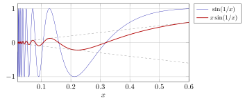
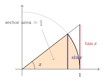
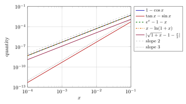
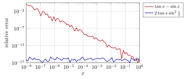

# 第 6 讲　函数极限与无穷小的阶 — (Limits of functions; orders of smallness)

第 5 讲研究数列的子列与部分极限。本讲转向函数极限 (limit of a function)：当 $x$ 以不同方式趋于 $a$ 时，$f(x)$ 是否都趋于同一个数？Heine 归结原理 (Heine’s sequential criterion) 将把函数极限与数列极限联系起来。

随后比较 $\sin x$、$1-\cos x$、$\tan x-\sin x$ 等趋零量。把 $x$ 缩小十倍时，各量缩小几倍？这些计算引出无穷小的阶 (orders of smallness)。

等价无穷小 (equivalent infinitesimals) 在乘除与加减中有不同的替换条件。例子将说明主部相消时为何需要保留更高阶误差。

全讲三角函数的自变量一律用弧度 (radians)；$\log$ 一律指自然对数 $\ln$。所有数值都是实际算出来的。

> [!NOTE] 注 6.1 — 本讲直接使用的初等事实 (Elementary facts taken as known)
>
>
> 与第 3 讲一样，初等函数的代数性质不在本课程重证。本讲只用到三条： (E1) $\sin,\cos$ 的加法公式，以及几何不等式 $\sin x<x<\tan x\ (0<x<\pi/2)$ 与 $|\sin u|\le|u|$； (E2) $\exp$ 与 $\ln$ 互为反函数、严格递增 (strictly increasing)，满足 $\ln(xy)=\ln x+\ln y$、$\ln(x^r)=r\ln x$，以及 $e^t\ge1+t\quad(t\in\mathbb{R})$，等号仅在 $t=0$ 成立（这是 $\exp$ 的凸性 (convexity)，第 12 讲正式证明）； (E3) 平方根的通常代数运算。
>

## 从 $\varepsilon$-$N$ 到 $\varepsilon$-$\delta$ (From $\varepsilon$-$N$ to $\varepsilon$-$\delta$)

第 2 讲的 $\varepsilon$-$N$ 语言说的是：误差目标 $\varepsilon$ 一旦给定，就要交出一个*时刻* $N$，从那以后误差始终小于 $\varepsilon$。函数的自变量不是时刻而是位置，所以要交出的不是时刻而是一个*半径* $\delta$：只要 $x$ 落在 $a$ 的 $\delta$ 邻域里（但不等于 $a$），就保证 $|f(x)-L|<\varepsilon$。除此之外，一个字也不用改。

> [!WARNING] 先猜一猜 (Guess first)
>
>
> 对 $f(x)=x^2$，要让 $|f(x)-9|<0.01$，$x$ 与 $3$ 的距离大约要小到什么量级？$0.01$？$0.003$？$0.0017$？先写下你的猜测和理由（提示：想想 $x^2$ 在 $x=3$ 附近变化得有多快），再看下面的表。把 $\varepsilon$ 缩小 $10$ 倍，$\delta$ 大致缩小几倍？
>

> [!IMPORTANT] 定义 6.2 — 函数极限 (Limit of a function)
>
>
> 设 $r>0$，函数 $f$ 在去心邻域 (punctured neighbourhood) $\{x:0<|x-a|<r\}$ 上有定义，$L\in\mathbb{R}$。若
> $$
> \forall\varepsilon>0\ \exists\delta>0:\quad 0<|x-a|<\delta\ \Longrightarrow\ |f(x)-L|<\varepsilon,
> $$
> 则称 $f$ 在 $x\to a$ 时以 $L$ 为极限 (limit)，记作 $\lim_{x\to a}f(x)=L$，或 $f(x)\to L\ (x\to a)$。 这里始终可以把 $\delta$ 取得不超过 $r$，所以定义中的 $x$ 都落在 $f$ 的定义域内。
>

两点必须说清楚。第一，条件里写的是 $0<|x-a|$：$f$ 在 $a$ 点的值（甚至 $f$ 在 $a$ 点是否有定义）与极限*完全无关*。第二，$\delta$ 依赖于 $\varepsilon$，也依赖于 $a$；同一个函数在不同的点上，同样的 $\varepsilon$ 可能需要差别很大的 $\delta$。

| 数列 (第 2 讲)              | 函数 (本讲)                       |
|:----------------------------|:----------------------------------|
| $\forall\varepsilon>0$    | $\forall\varepsilon>0$          |
| $\exists N$（一个*时刻*） | $\exists\delta>0$（一个*半径*） |
| $n\ge N$                  | $0<|x-a|<\delta$                |
| $|a_n-L|<\varepsilon$     | $|f(x)-L|<\varepsilon$          |

逐行对照只有第二、三行不同。第 2 讲里所有“先给 $\varepsilon$、再造 $N$”的技巧，在这里都变成“先给 $\varepsilon$、再造 $\delta$”。

> [!NOTE] 词语提示
>
>
> *admissible*：允许的；*sufficient*：充分的；*derivative*：导数；*optimal*：最优的；*factor*：因子；*linear*：线性的；*capped*：限制上界的。
>

> [!NOTE] 词语提示
>
>
> *bound*：界；估计。
>

> [!NOTE] Example 6.3 — Solving for $\delta$ exactly, and settling for less
>
>
> Take $f(x)=x^2$, $a=3$, $L=9$. For $|x-3|<\delta\le1$ we have $2<x<4$, hence
> $$
> |x^2-9|=|x-3|\,|x+3|<7\delta .
> $$
> So $\delta=\varepsilon/7$ (capped at $1$) always works: a *sufficient* radius, obtained by bounding the nuisance factor $|x+3|$ by its worst case on the interval.
>
> For $0<\varepsilon<9$, the *largest* admissible radius is the smaller of $3-\sqrt{9-\varepsilon}$ and $\sqrt{9+\varepsilon}-3$; the right-hand one is smaller, because $x^2$ grows faster to the right of $3$.
>
> | $\varepsilon$ | largest $\delta$ | $\sqrt{9-\varepsilon}$ side | simple $\delta=\varepsilon/7$ |
> |---:|---:|---:|---:|
> | $10^{-1}$ | $0.01662062580$ | $0.01671322196$ | $0.01428571429$ |
> | $10^{-2}$ | $0.001666203961$ | $0.001667129887$ | $0.001428571429$ |
> | $10^{-3}$ | $0.0001666620373$ | $0.0001666712966$ | $0.0001428571429$ |
>
> Two things to read off. First, dividing $\varepsilon$ by $10$ divides $\delta$ by $10$ as well: the response is *linear* in $\varepsilon$, and the proportionality constant $0.16666\ldots$ is $1/6$, which is $1/f'(3)$ — the derivative is already visible here, three lectures before we define it. Second, the cheap bound $\varepsilon/7$ is smaller than the optimal radius by a factor $6/7$ only. Solving the inequality exactly is almost never worth the work; a bound that is correct and within a constant factor is the normal goal.
>

证明只需给出一个有效的 $\delta$，不必求最大的半径。下面比较两个振荡函数。

> [!WARNING] 先猜一猜 (Guess first)
>
>
> $g(x)=\sin(1/x)$ 在 $x\to0$ 时有没有极限？如果你认为没有，你打算用哪两串具体的 $x$ 值来说服别人？再看 $h(x)=x\sin(1/x)$：乘上一个趋于 $0$ 的因子之后，答案会不会改变？
>

> [!NOTE] 词语提示
>
>
> *oscillation*：振荡；*punctured*：去心的；*exhibit*：给出具体例子。
>

> [!NOTE] Example 6.4 — An oscillation that never settles
>
>
> Let $g(x)=\sin(1/x)$. Choose three families of points shrinking to $0$:
> $$
> u_k=\frac{1}{2k\pi},\qquad v_k=\frac{1}{(2k+\tfrac12)\pi},\qquad w_k=\frac{1}{(2k+\tfrac32)\pi}.
> $$
> Computed to the digits shown:
>
> | $k$ | $u_k$ | $g(u_k)$ | $v_k$ | $g(v_k)$ | $w_k$ | $g(w_k)$ |
> |---:|---:|---:|---:|---:|---:|---:|
> | $1$ | $0.15915494$ | $0$ | $0.12732395$ | $1.000$ | $0.090945682$ | $-1.000$ |
> | $5$ | $0.031830989$ | $0$ | $0.030315227$ | $1.000$ | $0.027679121$ | $-1.000$ |
> | $50$ | $0.0031830989$ | $0$ | $0.0031672625$ | $1.000$ | $0.0031360580$ | $-1.000$ |
>
> Inside *every* punctured interval $0<|x|<\delta$ the function takes the values $-1$, $0$ and $1$. So no single $L$ can be within $\varepsilon=\tfrac12$ of $g(x)$ for all such $x$, and the limit does not exist. Note what the table does *not* do: it does not exhibit a "limit along three different routes". It exhibits three routes whose limits disagree, which is enough.
>
> For $h(x)=x\sin(1/x)$ the oscillation survives but the amplitude does not: $|h(x)|\le|x|$, so $\delta=\varepsilon$ works and $h(x)\to0$. Here the value at $0$ is not defined at all, and the limit does not care.
>

图中两条曲线在 $[0.02,0.6]$ 上用 $3001$ 个点画出。请看左端：细线的振荡越往左越密，幅度始终是 $1$；粗线的振荡同样密，但被两条虚线 $y=\pm x$ 夹住，所以被压向 $0$。决定有没有极限的是*幅度*，不是振荡的快慢。

## 1 Heine 归结原理 (Heine’s sequential criterion)

上例沿 $u_k,v_k,w_k\to0$ 比较函数值。下面证明：检验所有趋于 $a$ 的数列，与函数极限的定义等价。

> [!WARNING] 先猜一猜 (Guess first)
>
>
> “对某一串 $x_n\to a$ 有 $f(x_n)\to L$”显然弱于函数极限。若把“某一串”改成“每一串”呢？先猜：这时还需要额外条件吗？如果需要，你猜是哪一条。$x_n\ne a$，还是 $x_n$ 单调，还是 $f$ 有界？
>

> [!NOTE] 定理 6.5 — Heine 归结原理 (Heine's sequential criterion)
>
>
> 设 $f$ 在去心邻域 (punctured neighbourhood) $\{x:0<|x-a|<r\}$ 上有定义，$L\in\mathbb{R}$。则
> $$
> \lim_{x\to a}f(x)=L
> $$
> if and only if：对*每一条*满足 $x_n\to a$ 且 $x_n\ne a$（且 $|x_n-a|<r$）的数列 (sequence) $(x_n)$，都有 $f(x_n)\to L$。
>

> [!NOTE] 证明
>
>
> （$\Rightarrow$）设 $\lim_{x\to a}f(x)=L$，取定 $\varepsilon>0$ 及相应的 $\delta>0$。设 $x_n\to a$ 且 $x_n\ne a$。由 $\varepsilon$-$N$ 定义，存在 $N$ 使 $n\ge N$ 时 $|x_n-a|<\delta$；又 $x_n\ne a$ 给出 $0<|x_n-a|<\delta$，于是 $|f(x_n)-L|<\varepsilon$。这正是 $f(x_n)\to L$。
>
> （$\Leftarrow$）取逆否命题。设函数极限*不*成立，即存在 $\varepsilon_0>0$，使得任何半径都失败：对每个 $\delta>0$，都能找到 $x$ 满足 $0<|x-a|<\delta$ 而 $|f(x)-L|\ge\varepsilon_0$。对 $n=1,2,\dots$ 取 $\delta=\min\{r,1/n\}$，得到一点 $x_n$，满足
> $$
> 0<|x_n-a|<\frac1n,\qquad |f(x_n)-L|\ge\varepsilon_0 .
> $$
> 由 $0<|x_n-a|<1/n$ 得 $x_n\to a$ 且 $x_n\ne a$；但 $|f(x_n)-L|\ge\varepsilon_0$ 对一切 $n$ 成立，故 $f(x_n)\not\to L$。这样就否定了“每一条数列都行”。
>

条件 $x_n\ne a$ 不可省略：否则常数列 $x_n=a$ 会额外要求 $f(a)=L$，而函数极限并不限制 $f(a)$。

> [!NOTE] 推论 6.6 — 从第 2 讲免费搬来的结论 (What comes for free)
>
>
> 设 $x\to a$ 时 $f(x)\to L$，$g(x)\to M$。则
> $$
> f\pm g\to L\pm M,\qquad fg\to LM,\qquad \frac fg\to\frac LM\ (M\ne0),
> $$
> 极限唯一 (unique)，$f$ 在 $a$ 的某个去心邻域上有界 (bounded)；并且夹逼定理 (Squeeze Theorem) 成立：若在某去心邻域上 $f\le h\le g$ 且 $L=M$，则 $h(x)\to L$。以上对单侧极限与 $x\to\pm\infty$ 同样成立。
>

> [!NOTE] 证明
>
>
> 逐条化为数列。任取 $x_n\to a$，$x_n\ne a$。由 Heine 归结原理，$f(x_n)\to L$，$g(x_n)\to M$。第 2 讲的数列四则运算、唯一性、有界性与夹逼定理给出相应结论对 $(x_n)$ 成立；由于 $(x_n)$ 是任取的，再用一次 Heine 归结原理即得函数形式。局部有界性也可直接由定义得到：取 $\varepsilon=1$，则充分接近 $a$ 时 $|f(x)|\le |L|+1$。
>

Heine 归结原理使数列的极限法则适用于函数极限。

> [!NOTE] 命题 6.7 — 复合的极限 (Limits of a composition)
>
>
> 设 $\lim_{x\to a}g(x)=b$，且在 $a$ 的某去心邻域上 $g(x)\ne b$；又设 $\lim_{y\to b}f(y)=L$。则
> $$
> \lim_{x\to a}f(g(x))=L .
> $$
>

> [!NOTE] 证明
>
>
> 取 $x_n\to a$，$x_n\ne a$。由 Heine 归结原理 $g(x_n)\to b$；由假设 $g(x_n)\ne b$（对充分大的 $n$）。于是 $(g(x_n))$ 是一条合格的检验数列，再用一次 Heine 归结原理得 $f(g(x_n))\to L$。
>

> [!NOTE] 注 6.8
>
>
> $g(x)\ne b$ 这个条件不是装饰。取 $g\equiv0$，$a=b=0$，并令 $f(0)=1$、$f(y)=0\ (y\ne0)$。则 $\lim_{y\to0}f(y)=0$，$\lim_{x\to0}g(x)=0$，但 $f(g(x))\equiv1$。换元法 (substitution) 在极限计算里天天用，用的就是这条命题；它的适用条件就是这个 $g(x)\ne b$。
>

> [!IMPORTANT] 定义 6.9 — 单侧极限与无穷远处的极限 (One-sided limits; limits at infinity)
>
>
> 把定义中的 $0<|x-a|<\delta$ 换成 $a<x<a+\delta$，得到右极限 (right-hand limit) $\lim_{x\to a^+}f(x)$；换成 $a-\delta<x<a$，得到左极限 (left-hand limit) $\lim_{x\to a^-}f(x)$。 把它换成 $x>M$（$M$ 取代 $\delta$ 的角色），得到 $\lim_{x\to+\infty}f(x)$；换成 $x<-M$，得到 $\lim_{x\to-\infty}f(x)$。
>

> [!NOTE] 命题 6.10
>
>
> $\lim_{x\to a}f(x)=L$ if and only if 两个单侧极限都存在且都等于 $L$。
>

> [!NOTE] 证明
>
>
> 必要性显然。充分性：给定 $\varepsilon>0$，分别取 $\delta_1,\delta_2$，令 $\delta=\min\{\delta_1,\delta_2\}$；每个满足 $0<|x-a|<\delta$ 的 $x$ 或在右侧或在左侧。
>

> [!NOTE] 词语提示
>
>
> *unbounded*：无界的。
>

> [!NOTE] Example 6.11 — Where the two sides disagree
>
>
> Let $f(x)=\dfrac{x}{|x|}$ for $x\ne0$. Then $f(x)=1$ for $x>0$ and $f(x)=-1$ for $x<0$, so $f(0+)=1$ and $f(0-)=-1$ and $\lim_{x\to0}f(x)$ does not exist. Heine says the same thing with one sequence pair: $f(1/n)=1$ while $f(-1/n)=-1$.
>
> Now let $p(x)=2^{1/x}$ for $x\ne0$. Here $p(0+)$ does not exist as a real number ($p(1/n)=2^{n}$ is unbounded), while $p(0-)=0$ since $p(-1/n)=2^{-n}\to0$; more precisely, for $-\delta<x<0$ with $\delta=1/\log_2(1/\varepsilon)$ for $0<\varepsilon<1$ we get $0<p(x)<\varepsilon$. One side can be perfectly well behaved while the other blows up.
>

两侧的信息必须分开收集，这是后面讨论单调函数与反函数（第 8 讲）时的基本工具。

## 2 两个重要极限 (Two fundamental limits)

下面两个极限将用于确定无穷小的阶和主部。

> [!WARNING] 先猜一猜 (Guess first)
>
>
> $x=0.1$（弧度）时，$\dfrac{\sin x}{x}$ 等于多少？请猜到小数点后四位。再猜：$1-\dfrac{\sin x}{x}$ 与 $x^2$ 的比值约为多少。$1$、$1/2$、还是 $1/6$？
>

> [!NOTE] Example 6.12 — Reading the first limit off a table
>
>
> All values below are computed to the digits shown.
>
> |     $x$ | $\sin x$            | $\sin x/x$       | $(1-\sin x/x)/x^2$ |
> |----------:|:----------------------|:-------------------|:---------------------|
> |     $1$ | $0.841470984808$    | $0.841470984808$ | $0.1585290152$     |
> |   $0.5$ | $0.479425538604$    | $0.958851077208$ | $0.1645956912$     |
> |   $0.1$ | $0.0998334166468$   | $0.998334166468$ | $0.1665833532$     |
> |  $0.01$ | $0.00999983333417$  | $0.999983333417$ | $0.1666658333$     |
> | $0.001$ | $0.000999999833333$ | $0.999999833333$ | $0.1666666583$     |
>
> The middle column converges to $1$. The last column is the interesting one: the defect $1-\sin x/x$ is not just small, it is proportional to $x^2$, with constant approaching $0.16666\ldots=1/6$. We prove the limit $1$ now; the constant $1/6$ is left for Exercise 6.9, and it will also fall out of Taylor’s theorem in Lecture 10.
>

> [!NOTE] 定理 6.13 — 第一个重要极限 (The limit of $\sin x/x$)
>
>
> $$
> \lim_{x\to0}\frac{\sin x}{x}=1,\qquad\text{并且}\qquad 0<1-\frac{\sin x}{x}<\frac{x^2}{2}\quad(0<|x|<\pi/2).
> $$
>

> [!NOTE] 证明
>
>
> 先设 $0<x<\pi/2$。由几何不等式 (E1)，$\sin x<x<\tan x$。左边一式除以 $x$ 得 $\sin x/x<1$；右边一式改写为 $x<\sin x/\cos x$，即
> $$
> \cos x<\frac{\sin x}{x}<1 .
> $$
> 再用 $1-\cos x=2\sin^2(x/2)$ 与 $|\sin u|\le|u|$：
> $$
> 0<1-\cos x=2\sin^2\frac x2\le2\Bigl(\frac x2\Bigr)^2=\frac{x^2}{2}.
> $$
> 于是 $1-x^2/2\le\cos x<\sin x/x<1$，给出 $0<1-\sin x/x<x^2/2$。函数 $\sin x/x$ 是偶函数 (even)，故 $-\pi/2<x<0$ 时同一估计成立。最后，给定 $\varepsilon>0$ 取 $\delta=\min\{\pi/2,\sqrt{2\varepsilon}\}$ 即可。
>

图中单位圆的扇形（橙色）面积是 $x/2$，它夹在两个三角形之间：内接三角形面积 $\tfrac12\sin x$，外切三角形面积 $\tfrac12\tan x$。请看的是三条长度 $\sin x<x<\tan x$ 随 $x$ 变小如何互相靠拢。这三条长度的比值正是上表的内容。注意我们把“扇形面积 $=x/2$”当作几何事实直接使用；把它化归为严格的弧长定义，要等到积分（第 15 讲）。

> [!NOTE] 推论 6.14
>
>
> $\displaystyle\lim_{x\to0}\frac{1-\cos x}{x^2}=\frac12$，$\displaystyle\lim_{x\to0}\frac{\tan x}{x}=1$。
>

> [!NOTE] 证明
>
>
> $\dfrac{1-\cos x}{x^2}=\dfrac{2\sin^2(x/2)}{x^2}=\dfrac12\Bigl(\dfrac{\sin(x/2)}{x/2}\Bigr)^2\to\dfrac12\cdot1^2$（用复合的极限，$g(x)=x/2\ne0$）。 又 $\dfrac{\tan x}{x}=\dfrac{\sin x}{x}\cdot\dfrac1{\cos x}$，而 $\cos x\to1$。
>

第二个重要极限把第 3 讲的数列结果搬到函数上。搬运并不自动：第 3 讲的两列 $a_n=(1+1/n)^n$ 与 $b_n=(1+1/n)^{n+1}$ 只在整数点有定义，而现在的自变量是连续变化的实数。Heine 归结原理正好用来做这件事。

> [!WARNING] 先猜一猜 (Guess first)
>
>
> $(1+1/x)^x$ 在 $x=10$、$x=100$ 时分别约等于多少？它们与 $e=2.71828\ldots$ 的差距，随 $x$ 增大按什么速度缩小。像 $1/x$，还是像 $1/x^2$？再猜：$x=10$ 与 $x=10.5$ 的值差多少？
>

> [!NOTE] 词语提示
>
>
> *sanity check*：合理性检查；*gap*：两项之差的绝对值。
>

> [!NOTE] Example 6.15 — The second limit is slow
>
>
> |     $x$ | $(1+1/x)^x$     | $e-(1+1/x)^x$   |
> |----------:|:------------------|:------------------|
> |    $10$ | $2.59374246010$ | $0.12453937$    |
> |  $10.5$ | $2.59919991107$ | $0.11908192$    |
> |   $100$ | $2.70481382942$ | $0.013467999$   |
> | $100.5$ | $2.70488022921$ | $0.013401599$   |
> |  $1000$ | $2.71692393224$ | $0.0013578962$  |
> | $10000$ | $2.71814592683$ | $0.00013590163$ |
>
> $e=2.71828182845905$
>
> Each tenfold increase of $x$ divides the gap by $10$: the gap behaves like $c/x$. Reading $c$ off the last row, $c\approx1.3590$; and $e/2=1.35914\ldots$, so the gap is about $e/(2x)$. Non-integer arguments fit into the same pattern: $x=10.5$ sits between $x=10$ and $x=100$ exactly where one expects. This is a *slow* limit — to get three correct decimals one needs $x=1359$, as the sanity check below confirms.
>

> [!NOTE] 定理 6.16 — 第二个重要极限 (The limit defining $e$)
>
>
> $$
> \lim_{x\to+\infty}\Bigl(1+\frac1x\Bigr)^{x}=e,\qquad
>  \lim_{x\to0}(1+x)^{1/x}=e .
> $$
>

> [!NOTE] 证明
>
>
> 先证 $x\to0^+$ 的情形。设 $0<x<1$，令 $n=\lfloor1/x\rfloor\ge1$，于是
> $$
> n\le\frac1x<n+1,\qquad \frac1{n+1}<x\le\frac1n .
> $$
> 底数与指数都被夹住，而 $t\mapsto t^{s}$ 对 $t>0$、$s>0$ 递增，故
> $$
> \Bigl(1+\frac1{n+1}\Bigr)^{n}<(1+x)^{1/x}<\Bigl(1+\frac1n\Bigr)^{n+1}=b_n .
> $$
> 左端等于 $a_{n+1}\big/\bigl(1+\frac1{n+1}\bigr)$，其中 $a_{n+1}=(1+\frac1{n+1})^{n+1}$。
>
> 现在用 Heine 归结原理。任取 $x_k\to0^+$，$x_k>0$。令 $n_k=\lfloor1/x_k\rfloor$，则 $n_k\to\infty$。由第 3 讲的单调有界定理 (Monotone Convergence Theorem)，$a_{n}\to e$ 且 $b_{n}\to e$，因此由 $n_k\to\infty$，也有 $a_{n_k+1}\to e$、$b_{n_k}\to e$（直接使用收敛定义）。于是上式两端都趋于 $e$，数列的夹逼定理 (Squeeze Theorem) 给出 $(1+x_k)^{1/x_k}\to e$。数列 $(x_k)$ 是任取的，故 $\lim_{x\to0^+}(1+x)^{1/x}=e$。
>
> 再证 $x\to0^-$。令 $x=-u$，$0<u<1/2$，并令 $v=\dfrac{u}{1-u}>0$，则 $u=\dfrac{v}{1+v}$，$\dfrac1u=\dfrac{1+v}{v}$，而且 $u\to0^+ \iff v\to0^+$。直接计算
> $$
> (1-u)^{-1/u}=\Bigl(1+\frac{u}{1-u}\Bigr)^{1/u}=(1+v)^{(1+v)/v}=(1+v)^{1/v}\cdot(1+v)\longrightarrow e\cdot1=e .
> $$
> 两个单侧极限相等，故 $\lim_{x\to0}(1+x)^{1/x}=e$。最后令 $x=1/t$：$t\to+\infty$ 时 $x\to0^+$ 且 $x\ne0$，复合的极限给出第一式。
>

> [!NOTE] 注 6.17
>
>
> 这里 $n_k\to\infty$ 已足够，不要求下标严格递增。对任意误差 $\varepsilon$，先由 $a_n\to e$ 取门槛 $N$；再由 $n_k\to\infty$ 取 $K$，保证 $k>K$ 时 $n_k>N$，从而仍可应用同一误差估计。
>

> [!NOTE] 词语提示
>
>
> *threshold*：门槛。
>

> [!NOTE] Example 6.18 — Sanity check on the threshold
>
>
> How large must $x$ be for $(1+1/x)^x$ to be within $10^{-3}$ of $e$? From Lecture 3 we know $a_n<e<b_n$ and $b_n-a_n=a_n/n<e/n$, so $e-a_n<e/n$, and $e/n<10^{-3}$ forces $n>2718.28\ldots$, i.e. $n\ge2719$. A direct search gives the true threshold: the gap first drops below $10^{-3}$ at $x=1359$, where it equals $0.000999430$, while at $x=1358$ it is $0.00100017$. The cheap bound overshoots by a factor of exactly about $2$ — which is the same factor $e/(2x)$ versus $e/x$ seen in the previous table. A bound that is off by a factor of $2$ is a good bound.
>

> [!NOTE] 推论 6.19 — 对数与指数的第一阶 (First-order behaviour of $\ln$ and $\exp$)
>
>
> $$
> \lim_{x\to0}\frac{\ln(1+x)}{x}=1,\qquad \lim_{x\to0}\frac{e^x-1}{x}=1 .
> $$
>

> [!NOTE] 证明
>
>
> 由 (E2) 的 $e^t\ge1+t$。令 $u=\ln(1+x)$（$x>-1$），则 $1+x=e^u\ge1+u$，故 $u\le x$。再把 $t=-u$ 代入：$e^{-u}\ge1-u$，即 $\dfrac1{1+x}\ge1-u$，故 $u\ge1-\dfrac1{1+x}=\dfrac{x}{1+x}$。合起来
> $$
> \frac{x}{1+x}\le\ln(1+x)\le x\qquad(x>-1).
> $$
> $x>0$ 时除以 $x$ 得 $\dfrac1{1+x}\le\dfrac{\ln(1+x)}{x}\le1$；$-1<x<0$ 时不等号方向反转，得到同样的夹逼。两端都趋于 $1$。
>
> 第二式换元：令 $t=e^x-1$，则 $x=\ln(1+t)$，$x\to0$ 时 $t\to0$ 且 $x\ne0\Rightarrow t\ne0$，于是 $\dfrac{e^x-1}{x}=\dfrac{t}{\ln(1+t)}\to1$（复合的极限）。
>

估计 $x/(1+x)\le\ln(1+x)\le x$ 将继续用于比较对数余项。

## 3 无穷小的阶 (Orders of smallness)

下面比较五个趋于零的量，观察把 $x$ 缩小十倍时各量的变化比例。

> [!WARNING] 先猜一猜 (Guess first)
>
>
> 下面五个量，当 $x\to0$ 时都趋于 $0$：
> $$
> \sin x,\qquad 1-\cos x,\qquad \tan x-\sin x,\qquad e^x-1-x,\qquad x-\ln(1+x).
> $$
> 请*在看下面的表之前*，对每一个写下你猜的 $k$：它大致像 $x^k$ 一样小，$k=1$？$2$？$3$？把五个猜测写在纸上。做完这一步再往下读。先猜再看，这一讲的全部价值都在这个顺序里。
>

> [!NOTE] 词语提示
>
>
> *convergence*：收敛；*rounded*：四舍五入后的；*finite*：有限的；*sharp*：不能改进的；最优的；*ratio*：比值。
>

> [!NOTE] Example 6.20 — The order table
>
>
> Every entry below was computed in $60$-digit arithmetic and rounded to the digits shown.
>
> |  | $x=0.1$ | $x=0.01$ | $x=0.001$ |
> |:---|:---|:---|:---|
> | $\sin x$ | $0.099833417$ | $0.0099998333$ | $0.00099999983$ |
> | $1-\cos x$ | $0.0049958347$ | $0.000049999583$ | $4.9999996\cdot10^{-7}$ |
> | $\tan x-\sin x$ | $0.00050125544$ | $5.0001250\cdot10^{-7}$ | $5.0000013\cdot10^{-10}$ |
> | $e^x-1-x$ | $0.0051709181$ | $0.000050167084$ | $5.0016671\cdot10^{-7}$ |
> | $x-\ln(1+x)$ | $0.0046898202$ | $0.000049669147$ | $4.9966692\cdot10^{-7}$ |
>
> Do not look for the order in the values themselves; look at how each row *shrinks* when $x$ is divided by $10$. The quotient value$(x)/$value$(x/10)$ is
>
> |                   |     $x=0.1$ |    $x=0.01$ |
> |:------------------|--------------:|--------------:|
> | $\sin x$        | $9.9835081$ | $9.9998350$ |
> | $1-\cos x$      | $99.917527$ | $99.999175$ |
> | $\tan x-\sin x$ | $1002.4858$ | $1000.0248$ |
> | $e^x-1-x$       | $103.07392$ | $100.30073$ |
> | $x-\ln(1+x)$    | $94.421195$ | $99.404514$ |
>
> The quotients are $10$, $100$, $1000$, $100$, $100$: the orders are $1,2,3,2,2$. Now divide each value by $x^{k}$ with the $k$ just found:
>
> |                         | $x=0.1$      | $x=0.01$     | $x=0.001$    |
> |:------------------------|:---------------|:---------------|:---------------|
> | $\sin x/x$            | $0.99833417$ | $0.99998333$ | $0.99999983$ |
> | $(1-\cos x)/x^2$      | $0.49958347$ | $0.49999583$ | $0.49999996$ |
> | $(\tan x-\sin x)/x^3$ | $0.50125544$ | $0.50001250$ | $0.50000013$ |
> | $(e^x-1-x)/x^2$       | $0.51709181$ | $0.50167084$ | $0.50016671$ |
> | $(x-\ln(1+x))/x^2$    | $0.46898202$ | $0.49669147$ | $0.49966692$ |
>
> Each column stabilises at a finite non-zero number: $1,\ \tfrac12,\ \tfrac12,\ \tfrac12,\ \tfrac12$. Note how differently the last two rows converge: they are still off in the second decimal at $x=0.1$ and need $x=0.001$ to show three correct digits, whereas the first three rows are already sharp at $x=0.01$. Slow convergence of the ratio is not a different order; it is a larger next-order correction.
>

大多数人猜错的是第二行和第三行：$1-\cos x$ 常被猜成一阶，$\tan x-\sin x$ 常被猜成一阶或二阶。表格立刻纠正了直觉，而纠正之后的直觉才是可靠的。现在给这些现象命名。

> [!IMPORTANT] 定义 6.21 — $o$、$O$ 与等价 ($o$, $O$, and equivalence)
>
>
> 设 $x\to a$（也可以是 $x\to a^\pm$ 或 $x\to\pm\infty$），$f,g$ 在相应的去心邻域上有定义且 $g\ne0$。
>
> - $f=o(g)$：$\dfrac fg\to0$。读作“$f$ 是比 $g$ 高阶的无穷小 (higher order)”。
>
> - $f=O(g)$：$\dfrac fg$ 在某个去心邻域上有界 (bounded)。
>
> - $f\sim g$：$\dfrac fg\to1$，称 $f$ 与 $g$ 等价 (equivalent)。
>
> 若 $f\to0$，称 $f$ 为无穷小 (infinitesimal)。若 $f$ 与 $g$ 都是无穷小，$f\sim g$ if and only if $f-g=o(g)$。
>

> [!IMPORTANT] 定义 6.22 — 尺度与阶 (Scale and order)；主部 (Principal part)
>
>
> 固定一个*基本无穷小 (base infinitesimal)* $\alpha$：$x\to0$ 时取 $\alpha=x$，$x\to a$ 时取 $\alpha=x-a$，$x\to\pm\infty$ 时取 $\alpha=1/x$。幂 $\alpha,\alpha^2,\alpha^3,\dots$ 构成一把*尺子*，叫做尺度 (scale)。 若存在 $k>0$ 与有限非零常数 $c$，使
> $$
> \lim\frac{f}{\alpha^k}=c\ne0,
> $$
> 则称 $f$ 关于 $\alpha$ 是 $k$ 阶无穷小 (infinitesimal of order $k$)，并称 $c\,\alpha^k$ 为 $f$ 的主部 (principal part)。此时 $f\sim c\alpha^k$，且 $f-c\alpha^k=o(\alpha^k)$。
>

> [!NOTE] 注 6.23 — 含 $o$、$O$ 的等式只能从左往右读 (Read these equations left to right)
>
>
> $x\to0$ 时，$o(x^2)=o(x)$ 是对的：比 $x^2$ 高阶当然比 $x$ 高阶。但 $o(x)=o(x^2)$ 是错的：$x^{3/2}=o(x)$ 而 $x^{3/2}\ne o(x^2)$。等号在这里不是相等，而是“属于”：左边写下的每一个量都具有右边描述的性质。同理 $o(x)=O(x)$ 成立，$O(x)=o(x)$ 不成立。写 $f=g+o(\alpha^k)$ 时，这个约定意味着“$f-g$ 是比 $\alpha^k$ 高阶的某个量”，不指定是哪一个。
>

> [!NOTE] 词语提示
>
>
> *neighbourhood*：邻域；*infinitesimal*：无穷小；*bounded*：有界的。
>

> [!NOTE] Example 6.24 — Not every infinitesimal has an order
>
>
> Let $f(x)=x\sin(1/x)$, so $f(x)\to0$ as $x\to0$. Take the scale $\alpha=x$ and test every exponent $k>0$:
> $$
> \frac{f(x)}{x^{k}}=x^{1-k}\sin\frac1x .
> $$
> For $k<1$ this tends to $0$ (bounded times infinitesimal), so $f=o(x^k)$. For $k>1$ it is unbounded on every punctured neighbourhood (take $x=1/((2m+\tfrac12)\pi)$, where the sine equals $1$). For $k=1$ it is $\sin(1/x)$, which has no limit — we proved this in Section 1. So no exponent gives a finite non-zero limit: $f$ has *no order* on this scale. We can still record what is true:
> $$
> x\sin\frac1x=O(x),\qquad x\sin\frac1x=o(x^{k})\ \ \text{for every }0<k<1 .
> $$
> The scale is a ruler with gaps in it; some quantities fall between the marks.
>

所以“阶”不是每个无穷小都有的属性。但对本讲关心的初等组合，阶总是存在，而且能算出来。

> [!NOTE] 命题 6.25 — 三个可以徒手证明的阶 (Three orders proved by hand)
>
>
> 当 $x\to0$ 时
> $$
> \sin x\sim x,\qquad 1-\cos x\sim\frac{x^2}{2},\qquad \tan x-\sin x\sim\frac{x^3}{2},
>  \qquad \sqrt{1+x}-1-\frac x2\sim-\frac{x^2}{8}.
> $$
>

> [!NOTE] 证明
>
>
> 前两条就是第 4 节的定理与推论。第三条把差写成积：
> $$
> \tan x-\sin x=\sin x\Bigl(\frac1{\cos x}-1\Bigr)=\frac{\sin x\,(1-\cos x)}{\cos x},
> $$
> 于是
> $$
> \frac{\tan x-\sin x}{x^3}=\frac{\sin x}{x}\cdot\frac{1-\cos x}{x^2}\cdot\frac1{\cos x}\longrightarrow1\cdot\frac12\cdot1=\frac12 .
> $$
> 第四条用有理化。记 $A=\sqrt{1+x}$，则
> $$
> A-1-\frac x2=\frac{A^2-\bigl(1+\frac x2\bigr)^2}{A+1+\frac x2}
>  =\frac{(1+x)-\bigl(1+x+\frac{x^2}4\bigr)}{A+1+\frac x2}
>  =\frac{-x^2/4}{A+1+\frac x2},
> $$
> 除以 $x^2$ 后分母趋于 $2$，故极限为 $-1/8$。
>

余下两行。$e^x-1-x$ 与 $x-\ln(1+x)$。的阶同样可以徒手证明，但主部的系数不行。把这两件事分开，是理解 Taylor 公式 (Taylor’s theorem，第 10 讲) 为什么必要的最好入口。

> [!NOTE] 命题 6.26 — $x-\ln(1+x)$ 的阶是 $2$ (The order is 2)
>
>
> 记 $g(x)=x-\ln(1+x)$。则对 $|x|<1/2$，$x\ne0$，
> $$
> \frac1{\bigl(\sqrt{1+x}+1\bigr)^2}\ \le\ \frac{g(x)}{x^2}\ \le\ \frac1{1+x}.
> $$
> 两端分别趋于 $1/4$ 与 $1$，故 $g$ 是二阶无穷小；而且 $e^x-1-x$ 也是二阶的。
>

> [!NOTE] 证明
>
>
> 上界：由 $\frac{x}{1+x}\le\ln(1+x)$ 得 $g(x)\le x-\frac{x}{1+x}=\frac{x^2}{1+x}$。
>
> 下界用一个*减半恒等式*。令 $y=\sqrt{1+x}-1$，则 $(1+y)^2=1+x$，故 $x=2y+y^2$ 且 $\ln(1+x)=2\ln(1+y)$，于是
> $$
> g(x)=2y+y^2-2\ln(1+y)=2g(y)+y^2 .
> $$
> 由 $\ln(1+t)\le t$ 知 $g\ge0$，所以 $g(x)\ge y^2$。又 $y=\sqrt{1+x}-1=\dfrac{x}{\sqrt{1+x}+1}$，代入即得下界。
>
> 对 $e^x-1-x$：令 $t=e^x-1$，则 $x=\ln(1+t)$，$e^x-1-x=t-\ln(1+t)=g(t)$，而 $t/x\to1$（第 4 节推论），故 $\dfrac{e^x-1-x}{x^2}=\dfrac{g(t)}{t^2}\cdot\Bigl(\dfrac tx\Bigr)^2$ 也被夹在两个趋于 $1/4$ 与 $1$ 的量之间。
>

> [!WARNING] 欠条 (IOU) — \#2 的使用：确界存在性，第 14 讲还
>
>
> 上面的减半恒等式本身不用完备性。但“夹在 $1/4$ 与 $1$ 之间”只给出阶，不给出主部；要把系数钉死在 $1/2$，最短的路是第 10 讲的 Taylor 公式，而 Taylor 公式的余项估计要用中值定理 (Mean Value Theorem)，中值定理要用闭区间上的最值存在性。那一步用的正是确界存在性 (Supremum Property)，即欠条 \#2。本讲把系数 $1/2$ 只作为*表里读出来的数*使用，不作为已证事实使用。习题 6.10 给出一条不用 Taylor 的替代路线。
>

> [!NOTE] 词语提示
>
>
> *upper bound*：上界；*lower bound*：下界；*identity*：恒等式；*strictly*：严格地；*bounds*：上下界。
>

> [!NOTE] Example 6.27 — How far apart are the two bounds?
>
>
> For $g(x)=x-\ln(1+x)$ the sandwich of the proposition reads
>
> |     $x$ | lower bound    | true $g(x)/x^2$ | upper bound    |
> |----------:|:---------------|:------------------|:---------------|
> |   $0.1$ | $0.23823037$ | $0.46898202$    | $0.90909091$ |
> |  $0.01$ | $0.24875776$ | $0.49669147$    | $0.99009901$ |
> | $0.001$ | $0.24987508$ | $0.49966692$    | $0.99900100$ |
>
> The bounds pin the order but nothing else: they close on the interval $[\tfrac14,1]$, and the truth $\tfrac12$ sits strictly inside. This is exactly the gap that Taylor’s theorem is built to close — and it is worth seeing the gap before seeing the tool. Exercise 6.10 closes it by hand, by applying the halving identity $n$ times instead of once.
>

下面在双对数坐标中比较各量与 $x^2$、$x^3$ 的大小。

图用 $61$ 个对数等距的 $x$ 值画成。请看*斜率*而不是高度：四条曲线与虚线（斜率 $2$）平行，一条与点线（斜率 $3$）平行。平行的曲线之间的竖直距离就是主部系数之比：$1-\cos x$、$e^x-1-x$、$x-\ln(1+x)$ 三条几乎重合（系数都是 $1/2$），而 $|\sqrt{1+x}-1-x/2|$ 低了一截（系数 $1/8$，是 $1/2$ 的四分之一）。在 log–log 图上，阶是斜率，系数是截距。

## 4 等价替换：什么时候可以，什么时候不行 (Substitution: when it is legal)

由 $\sin x\sim x$ 可以处理乘除中的替换；若两项相减，还需检查被舍去的误差是否影响结果。

> [!WARNING] 先猜一猜 (Guess first)
>
>
> $x\to0$ 时，$\sqrt{1+x}\sim1+\dfrac x2$ 且 $\sqrt{1-x}\sim1-\dfrac x2$。据此“推出”
> $$
> \sqrt{1+x}-\sqrt{1-x}-x\ \sim\ \Bigl(1+\frac x2\Bigr)-\Bigl(1-\frac x2\Bigr)-x=0 .
> $$
> 先猜：这个量真的是 $o(x^k)$ 对一切 $k$ 成立吗？它究竟是几阶的？再猜 $\dfrac{\tan x-\sin x}{x^3}$ 的极限。如果把 $\tan x$ 和 $\sin x$ 都换成 $x$，你会得到 $0$；表里是什么？
>

> [!NOTE] 词语提示
>
>
> *rationalising*：有理化；*remainder*：余项；*infinite*：无穷的。
>

> [!NOTE] Example 6.28 — A substitution that destroys the answer
>
>
> Two differences, each of which the naive substitution reports as $0$:
>
> | $x$ | $(\tan x-\sin x)/x^3$ | $\bigl(\sqrt{1+x}-\sqrt{1-x}-x\bigr)/x^3$ |
> |---:|:---|:---|
> | $0.5$ | $0.5350156099$ | — |
> | $0.1$ | $0.5012554386$ | $0.1255501196$ |
> | $0.01$ | $0.5000125005$ | $0.1250054691$ |
> | $0.001$ | $0.5000001250$ | $0.1250000547$ |
>
> The true limits are $\tfrac12$ and $\tfrac18$, not $0$. Both quantities are infinitesimals of order exactly $3$, and the naive substitution missed them by an infinite factor.
>
> The diagnosis is the same in both cases. The two principal parts being subtracted are $x$ and $x$ (respectively $1+\frac x2$ and $1-\frac x2$, whose difference is $x$, cancelled by the third term). They cancel *exactly*, so what survives is the next-order remainder — precisely the part that "$\sim$" throws away. Replacing $u$ by $u_1$ discards an error of size $o(u_1)$; that error is negligible against $u_1$, but it is *not* negligible against $u+v$ when $u_1+v_1=0$.
>
> Second proof that the order is $3$, by hand. With $A=\sqrt{1+x}$, $B=\sqrt{1-x}$ we have $A-B=\dfrac{2x}{A+B}$, so
> $$
> A-B-x=x\cdot\frac{2-(A+B)}{A+B}.
> $$
> Now $2-(A+B)=(1-A)+(1-B)=-\dfrac{x}{A+1}+\dfrac{x}{B+1}=x\cdot\dfrac{A-B}{(A+1)(B+1)}=\dfrac{2x^2}{(A+B)(A+1)(B+1)}$, hence
> $$
> A-B-x=\frac{2x^3}{(A+B)^2(A+1)(B+1)}.
> $$
> Therefore
> $$
> \frac{A-B-x}{x^3}=\frac{2}{(A+B)^2(A+1)(B+1)}\longrightarrow\frac{2}{4\cdot4}=\frac18.
> $$
> Rationalising twice turns two cancelling differences into one honest product.
>

错误的根源不是“等价替换”这件事本身，而是替换发生在一个会*抵消 (cancellation)* 的位置上。把这句话写成判据。

> [!NOTE] 定理 6.29 — 乘除法中的替换总是合法 (Substitution is legal in products and quotients)
>
>
> 设 $x\to a$ 时 $u\sim u_1$，$v\sim v_1$（各量在某去心邻域上非零）。则
> $$
> uv\sim u_1v_1,\qquad \frac uv\sim\frac{u_1}{v_1},
> $$
> 并且对任意函数 $w$，$\lim\dfrac{u\,w}{v}$ 与 $\lim\dfrac{u_1w}{v_1}$ 同时存在或同时不存在，存在时相等。
>

> [!NOTE] 证明
>
>
> $\dfrac{uv}{u_1v_1}=\dfrac{u}{u_1}\cdot\dfrac{v}{v_1}\to1\cdot1$，商同理。最后一条把 $\dfrac{uw}{v}=\dfrac{u_1w}{v_1}\cdot\dfrac{u/u_1}{v/v_1}$，第二个因子趋于 $1$。
>

> [!NOTE] 定理 6.30 — 加减法中的替换：无抵消条件 (No-cancellation condition)
>
>
> 设 $x\to a$ 时 $u\sim u_1$，$v\sim v_1$，且存在常数 $\kappa>0$ 与一个去心邻域，使其上
> $$
> |u_1+v_1|\ \ge\ \kappa\bigl(|u_1|+|v_1|\bigr).
> $$
> 则 $u+v\sim u_1+v_1$。特别地，若 $u_1$ 与 $v_1$ 在该邻域上同号 (same sign)，可取 $\kappa=1$，替换永远安全。
>

> [!NOTE] 证明
>
>
> 写 $u=u_1(1+\alpha)$，$v=v_1(1+\beta)$，其中 $\alpha=\frac u{u_1}-1\to0$，$\beta=\frac v{v_1}-1\to0$。则 $(u+v)-(u_1+v_1)=u_1\alpha+v_1\beta$，于是
> $$
> \Bigl|\frac{u+v}{u_1+v_1}-1\Bigr|
>  \le\frac{|u_1||\alpha|+|v_1||\beta|}{|u_1+v_1|}
>  \le\frac{\bigl(|u_1|+|v_1|\bigr)\max\{|\alpha|,|\beta|\}}{\kappa\bigl(|u_1|+|v_1|\bigr)}
>  =\frac{\max\{|\alpha|,|\beta|\}}{\kappa}\longrightarrow0 .
> $$
> 同号时 $|u_1+v_1|=|u_1|+|v_1|$。
>

在两个失败的例子里，主部是 $x$ 与 $-x$：异号而且完全抵消，$|u_1+v_1|=0$，条件以最坏的方式失效。判据也解释了为什么 $\sin x+\tan x\sim2x$ 是安全的：两个主部都是 $+x$，同号。

> [!NOTE] 词语提示
>
>
> *principal part*：主部。
>

> [!IMPORTANT] Exercise 6.31 — Test the criterion, then break it
>
>
> Decide, *before computing*, which of the following are correct as $x\to0$, and for the incorrect ones say what $\kappa$ does: (a) $\sin x+\tan x\sim2x$; (b) $\tan x-\sin x\sim x-x=0$; (c) $\sin x+x^2\sim x$; (d) $\sin(2x)-2\sin x\sim 0$; (e) $e^x-1+\ln(1-x)\sim 0$. Then compute each left-hand side at $x=10^{-2}$ and $10^{-3}$, divide by $x$, $x^2$, $x^3$ in turn, and report the order you actually observe. For (d) and (e), state the order and the principal part you obtained from the data.
>

当两个主部相消时，可尝试因式分解或有理化。例如 $\tan x-\sin x=\sin x(1-\cos x)/\cos x$ 保留了决定三阶大小的因子。

## 5 An AI experiment: reading slopes

下面用高精度计算估计双对数图的斜率，并比较不同表达式的阶。

> [!NOTE] 词语提示
>
>
> *significant digits*：有效数字；*benchmarks*：核对用的参考结果；*precision*：计算精度；*estimate*：估计；*at least*：至少；*exact*：精确的；*slope*：斜率。
>

> [!NOTE] 词语提示
>
>
> *grid*：网格。
>

> [!NOTE] AI Lab — Measure the order of anything
>
>
> **Setup.** Ask an AI to evaluate, in high-precision arithmetic (at least $40$ significant digits — see the second lab for why this matters), the quantities
> $$
> 1-\cos x,\quad \tan x-\sin x,\quad e^x-1-x,\quad x-\ln(1+x),\quad \Bigl|\sqrt{1+x}-1-\tfrac x2\Bigr|
> $$
> at $61$ values of $x$ equally spaced on a logarithmic grid from $10^{-4}$ to $10^{-1}$. Have it plot $\log_{10}$(value) against $\log_{10}x$, and also report, for each quantity, the slope
> $$
> s=\frac{\log f(10^{-3})-\log f(10^{-4})}{\log 10^{-3}-\log 10^{-4}}
> $$
> and then the quotient $f(10^{-3})/(10^{-3})^{\mathrm{round}(s)}$.
>
> **Benchmarks from an actual run.** Slopes: $2.0000$, $3.0000$, $2.0001$, $1.9997$, $1.9998$. Quotients: $0.500000$, $0.500000$, $0.500167$, $0.499667$, $0.124938$. So four of the five have order $2$, one has order $3$, and the principal-part coefficients are $\tfrac12,\tfrac12,\tfrac12,\tfrac12,-\tfrac18$.
>
> **Your own expression.** Now invent one. Two suggestions, each with a benchmark you can check against: $\sqrt[3]{1+x}-1-\tfrac x3$ gives slope $1.9998$ and quotient $0.111049$; $\tfrac1{\sqrt{1+x}}-1+\tfrac x2$ gives slope $1.9997$ and quotient $0.374688$. Guess the exact coefficients from those decimals ($0.111049\approx\,$? and $0.374688\approx\,$?) before asking the AI, then prove your guesses by rationalising (use $a^3-b^3=(a-b)(a^2+ab+b^2)$ for the first).
>
> **Answer from the output.** (i) Why does the slope estimate for $\tan x-\sin x$ come out cleaner than the one for $x-\ln(1+x)$, even though both are exact power laws in the limit? (ii) If a quantity’s measured slope drifts steadily from $1.7$ at $x=10^{-1}$ to $1.95$ at $x=10^{-4}$, what should you suspect — a non-integer order, or a large next-order term? Construct one example of each and test it. (iii) Invent an expression with *no* order and explain what the slope estimate does for it.
>

第二个实验比较同一表达式在双精度与高精度下的计算结果。

> [!NOTE] 词语提示
>
>
> *significand*：有效数部分；*binary64*：64位二进制浮点格式。
>

> [!NOTE] AI Lab — When the computer loses the answer
>
>
> **Setup.** Ask an AI to compute $\tan x-\sin x$ in ordinary double precision (binary64, $53$-bit significand) at $x=10^{-1},10^{-2},\dots,10^{-8}$, and to compare each result with the high-precision value. Then have it repeat the computation with the algebraically identical formula
> $$
> \tan x-\sin x=2\tan x\,\sin^2\frac x2 .
> $$
>
> **Benchmarks from an actual run.** Relative error of the naive difference: $2.44\cdot10^{-14}$, $1.31\cdot10^{-12}$, $1.41\cdot10^{-10}$, $6.50\cdot10^{-9}$, $3.21\cdot10^{-7}$, $7.76\cdot10^{-5}$, $5.85\cdot10^{-3}$, $1.00$ — that is, correct digits $14,12,10,8,6,4,2,0$. At $x=10^{-8}$ the naive formula returns exactly $0.0$, while the true value is $5.00000000000\cdot10^{-25}$. The product form has relative error below $4\cdot10^{-16}$ at every one of the eight points.
>
> **Answer from the output.** (i) Two correct digits are lost per decade. Explain this from the order table: $\tan x$ and $\sin x$ agree to about $\log_{10}(x^{-2})$ digits, and binary64 carries about $16$. (ii) At which $x$ does the naive formula keep only half of its digits? (iii) The AI’s plot of the naive result on a log–log scale will look like a line of slope $3$ that breaks up into noise. Where does the break happen, and does it agree with your answer to (ii)? (iv) The product form is not more accurate by luck: name the operation it avoids.
>

图中两条曲线用同一台机器、同一种双精度浮点算术得到，代数上它们是同一个表达式。请看红线：每向左一个数量级，相对误差上升约 $100$ 倍，到 $x=10^{-8}$ 时答案一个正确数字也不剩；蓝线始终贴在 $10^{-16}$ 附近。差的地方会抵消，抵消的地方会丢数字。这是第 6 节那条判据在机器上的投影。

## 6 Exercises

请先记录猜测，再计算并证明；若猜测改变，保留修改的理由。

> [!NOTE] 词语提示
>
>
> *counterexample*：反例；*cancellation*：相消；*convergent*：收敛的；*hypothesis*：假设；*geometric*：等比的；*divergent*：发散的；*residual*：残差。
>

> [!NOTE] 词语提示
>
>
> *predict*：预测；*iterate*：迭代项；*verify*：核实；*shrink*：缩小；*least*：最小的；*valid*：有效的。
>

1. **6.1**  $\bigstar$ **(homework)** For $f(x)=1/x$ and $a=2$, first *guess* how small $|x-2|$ must be to force $|f(x)-\tfrac12|<0.01$. Then solve the inequality exactly and find the two one-sided radii; then produce a $\delta$ of the form $c\varepsilon$ valid for all $0<\varepsilon\le\tfrac14$ and compare it with the exact one at $\varepsilon=0.01$. Why is the exact radius not symmetric about $2$, and on which side is it smaller? Predict the answer before computing.

1. **6.2**  $\bigstar$ Decide by eye, then prove with Heine’s criterion, which of
    $$
    \sin\frac1x,\qquad x\sin\frac1x,\qquad \sqrt{|x|}\,\sin\frac1x,\qquad \frac1x\sin\frac1x,\qquad \cos\frac1{x^{2}}
    $$
    have a limit as $x\to0$. For each divergent one, exhibit two explicit sequences and compute three terms of each. For each convergent one, give $\delta(\varepsilon)$.

1. **6.3**  $\bigstar$ Before computing anything, guess the order (and if you dare, the principal part) of each of
    $$
    1-\cos3x,\qquad \sin(x^{2}),\qquad \frac1{1-x}-1-x,\qquad \sqrt[3]{1+x}-1-\frac x3,\qquad \tan x-x
    $$
    as $x\to0$. Then build a table at $x=0.1,0.01,0.001$, read off the orders from the shrink quotients, and prove the ones you can by algebra alone. Which one resists, and why?

1. **6.4**  $\bigstar$$\bigstar$ **(homework)** A trap and its repair. Guess $\lim_{x\to0}\dfrac{\sqrt{1+2x}-\sqrt{1-2x}-2x}{x^{3}}$ by replacing each square root by its principal part, and write down the answer you get. Then compute the quotient at $x=10^{-1},10^{-2},10^{-3}$ and see that the guess is wrong. Finally prove the true value by rationalising twice. State precisely which hypothesis of the no-cancellation criterion fails, and what $\kappa$ would have to be.

1. **6.5**  $\bigstar$$\bigstar$ Build your own counterexample. Find infinitesimals $u\sim u_1$ and $v\sim v_1$ as $x\to0$ such that $u+v$ and $u_1+v_1$ have *different orders*, with the gap between the two orders as large as you can make it. Verify numerically at $x=10^{-2}$ and $10^{-3}$, then prove your claim. Can the gap be made infinite?

1. **6.6**  $\bigstar$$\bigstar$ How slow is the second fundamental limit? Guess how large $x$ must be for $(1+1/x)^{x}$ to be within $10^{-4}$ of $e$. Then find the threshold numerically. Then prove an upper bound for the threshold using only $a_n<e<b_n$ and $b_n-a_n=a_n/n$ from Lecture 3, and explain the factor of about $2$ between your bound and the truth. (The same question for $10^{-3}$ has answer $1359$; use it as a sanity check on your method.)

1. **6.7**  $\bigstar$$\bigstar$ **(homework)** Recover a principal part from data alone. For
    $$
    p(x)=\frac1{1-x}-1-x,\qquad q(x)=\frac1{\sqrt{1+x}}-1+\frac x2,
    $$
    compute the values at $x=10^{-1},10^{-2},10^{-3}$, read the order from the shrink quotients and the coefficient from $f(x)/x^{k}$, and *then* prove both principal parts exactly. One of the two converges visibly faster than the other; say which, and explain the difference in terms of the next-order term.

1. **6.8**  $\bigstar$$\bigstar$ Orders at infinity. Using the scale $\alpha=1/x$ as $x\to+\infty$, guess the order and principal part of
    $$
    \sqrt{x^{2}+1}-x,\qquad \sqrt{x^{2}+x}-x-\frac12,\qquad \frac{x}{x+1}-1,\qquad x\ln\Bigl(1+\frac1x\Bigr)-1 .
    $$
    Then test your guesses at $x=10,10^{3},10^{6}$. Three of the four principal parts can be proved exactly with the tools of this lecture; prove them. For the fourth, say what the order is, why the order is provable, and why the coefficient is not. Explain why the substitution $x=1/t$ turns every one of these into a problem of the kind treated in Section 6.

1. **6.9**  $\bigstar$$\bigstar$$\bigstar$ The constant $1/6$. The first table in the section on fundamental limits suggests $1-\dfrac{\sin x}{x}\sim\dfrac{x^{2}}{6}$, i.e. $x-\sin x\sim\dfrac{x^{3}}{6}$. Prove it without Taylor’s theorem, as follows. (a) Use $\sin x=3\sin\frac x3-4\sin^{3}\frac x3$ to derive the identity $h(x)=3h\bigl(\frac x3\bigr)+4\sin^{3}\frac x3$ for $h(x)=x-\sin x$. (b) Iterate it $n$ times and use $|\sin t|\le|t|$ together with a finite geometric sum to prove $0\le h(x)\le\frac{x^{3}}6$ for $x\ge0$. (c) Iterate again, this time keeping the terms $4\sin^{3}(x/3^{j})$, for $0<x<1$, divide by $x^3$, and first let $x\to0^+$ with $n$ fixed. Show that the lower limit is at least $\frac16(1-9^{-n})$; then let $n\to\infty$. Use oddness to obtain the two-sided limit. Check each stage numerically at $x=0.1$.

1. **6.10** $\bigstar$$\bigstar$$\bigstar$ Determine the coefficient in the logarithmic estimate. With $g(x)=x-\ln(1+x)$ and the halving identity $g(x)=2g(y)+y^{2}$, $y=\sqrt{1+x}-1$: (a) iterate $n$ times to get $g(x)=2^{n}g(y_{n})+\sum_{j=1}^{n}2^{j-1}y_{j}^{2}$, where $y_{0}=x$ and $y_{j+1}=\sqrt{1+y_{j}}-1$; (b) for each fixed $j$, show $y_j/x\to2^{-j}$ as $x\to0$; (c) using $0\le g(t)\le C t^2$ for all sufficiently small $|t|$, bound the residual $2^ng(y_n)/x^2$. First let $x\to0$ with $n$ fixed, and then let $n\to\infty$, to conclude $g(x)\sim x^2/2$. Before doing any of this, compute the partial lower bounds $\sum_{j\le n}2^{j-1}/4^{j}$ for $n=1,\dots,8$ and watch them climb toward $\tfrac12$; report the first $n$ for which the bound exceeds $0.49$.

1. **6.11** $\bigstar$$\bigstar$ Trust the output? Ask an AI for $\lim_{x\to0}\dfrac{e^{x}-1-x-\frac{x^{2}}2}{x^{3}}$ and for a table of the quotient at $x=10^{-2},10^{-4},10^{-6}$ computed in ordinary double precision. Guess the limit first from the pattern of Section 5. Then explain, using the second AI Lab, why the $x=10^{-6}$ entry of the table is worthless, and design a high-precision check that is not.

> [!NOTE] 回望 (Looking back)
>
>
> Heine 归结原理把函数极限化为数列极限；阶与主部用于比较趋零速度。加减中的等价替换还须检查抵消。下一讲研究函数极限等于该点函数值时的连续性。
>
