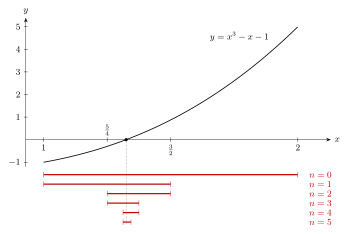
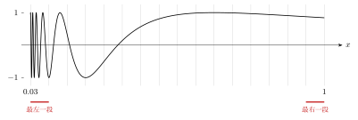
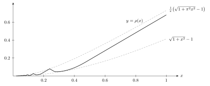
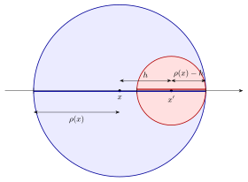

# 第 6 讲　连续函数：二分法搜索 (Continuous functions: bisection search)

前几讲求过三个方程的根。$x^2=2$ 用的是第 1 讲的迭代；$x=1+\frac1x$ 和 $x=\cos x$ 用的是第 4 讲的迭代。三次都要先把方程写成 $x=g(x)$ 的样子，并且 $g$ 要碰巧合用。

本讲从方程
$$
x^3-x-1=0
$$
出发。它不必改写成 $x=g(x)$；只要会算 $x^3-x-1$ 的正负，就能把根找出来，办法是每次把区间切成两半，留下根所在的那一半。本讲要回答：

1. 这样留下的区间缩向哪里？
2. 缩向的那个点为什么是根？
3. 同样的搜索还能找到什么？
4. 要把 $f(x)$ 算到指定的精度，$x$ 要准到多少？

第 1–3 节回答前两个问题。第 4 节用同样的搜索证明闭区间上的连续函数有界、取到最大值。第 5–7 节回答第四个问题，办法是把第 4 节的结论用在一个新的函数上。

需要的预备知识：第 2 讲的引理 2.13（极限保持不等式）、定理 2.23（单调有界定理）、定理 2.26（极限的运算）、命题 2.29（等比数列的极限）；第 3 讲的上确界；第 5 讲的函数在一点连续的两种说法；第 2 讲第 7 节（初等函数连续）。函数 $f$ 在点 $x$ 连续是指：

- （数列的说法）定义域中任何收敛于 $x$ 的数列 $(x_n)$ 都满足 $f(x_n)\to f(x)$；
- （$\varepsilon$–$\delta$ 的说法）对任意 $\varepsilon>0$，存在 $r>0$，使定义域中满足 $|y-x|<r$ 的 $y$ 都有 $|f(y)-f(x)|<\varepsilon$。

第 5 讲证明了两种说法等价。全讲中 $a<b$。

## 1 二分法搜索

记 $f(x)=x^3-x-1$。$f(1)=-1<0$，$f(2)=5>0$。函数值从负变到正，中间应当有一个根。取中点 $\frac32$：$f\left(\frac32\right)=\frac78>0$。于是在 $1$ 处为负，在 $\frac32$ 处为正，留下 $\left[1,\frac32\right]$。再取中点 $\frac54$：$f\left(\frac54\right)=-\frac{19}{64}<0$，留下 $\left[\frac54,\frac32\right]$。

一般地，设已有区间 $[u_n,v_n]$，$f(u_n)<0<f(v_n)$。取中点 $m_n=\frac{u_n+v_n}2$，算 $f(m_n)$ 的正负：为正则留下左半 $[u_n,m_n]$，为负则留下右半 $[m_n,v_n]$。中点都是分母为 $2$ 的幂的分数，$f(m_n)$ 的正负可以用整数运算准确地判断。$f(m_n)$ 不会恰好等于 $0$：若最简分数 $\frac pq$ 是 $x^3-x-1=0$ 的根，则 $p^3=pq^2+q^3$，于是 $q$ 整除 $p^3$，$p$ 整除 $q^3$，只能 $p=\pm1$，$q=\pm1$；而 $\pm1$ 都不是根。

| $n$ | $u_n$ | $v_n$ | 中点 $m_n$ | $f(m_n)$ 的正负 | 区间长度 |
|---|---|---|---|---|---|
| 0 | $1$ | $2$ | $\frac32$ | $+$ | $1$ |
| 1 | $1$ | $\frac32$ | $\frac54$ | $-$ | $\frac12$ |
| 2 | $\frac54$ | $\frac32$ | $\frac{11}8$ | $+$ | $\frac14$ |
| 3 | $\frac54$ | $\frac{11}8$ | $\frac{21}{16}$ | $-$ | $\frac18$ |
| 4 | $\frac{21}{16}$ | $\frac{11}8$ | $\frac{43}{32}$ | $+$ | $\frac1{16}$ |
| 5 | $\frac{21}{16}$ | $\frac{43}{32}$ | $\frac{85}{64}$ | $+$ | $\frac1{32}$ |
| 6 | $\frac{21}{16}$ | $\frac{85}{64}$ | $\frac{169}{128}$ | $-$ | $\frac1{64}$ |
| 7 | $\frac{169}{128}$ | $\frac{85}{64}$ | $\frac{339}{256}$ | $-$ | $\frac1{128}$ |
| 8 | $\frac{339}{256}$ | $\frac{85}{64}$ | $\frac{679}{512}$ | $+$ | $\frac1{256}$ |
| 9 | $\frac{339}{256}$ | $\frac{679}{512}$ | $\frac{1357}{1024}$ | $+$ | $\frac1{512}$ |
| 10 | $\frac{339}{256}$ | $\frac{1357}{1024}$ | | | $\frac1{1024}$ |

第 10 行的区间是 $[1.32421875,\ 1.3251953125]$。如果根存在，它就在这个区间里，前两位小数是 $1.32$。

图 1：$y=x^3-x-1$ 在 $[1,2]$ 上的图像，以及最初的区间和前五次留下的区间。

从表里读出两件事。

1. 第 $n$ 步留下的区间长度是 $\frac1{2^n}$。区间里任何一点与根相差不超过 $\frac1{2^n}$，所以要误差小于 $\varepsilon$，只要 $\frac1{2^n}<\varepsilon$。步数在计算之前就知道：

    | $\varepsilon$ | $10^{-3}$ | $10^{-6}$ | $10^{-9}$ |
    |---|---|---|---|
    | 步数 $n$ | $10$ | $20$ | $30$ |

2. 每一步误差的上界乘以 $\frac12$。这比第 4 讲的 $\cos$ 迭代（每步约乘 $0.67$）快，比 $(b_n)$（每步约乘 $0.38$）慢，比第 1 讲的 $(a_n)$（每步大约平方）慢得多。

这个办法对函数的要求很少：只用到 $f$ 在两端异号，以及能判断 $f$ 在一点的正负。但上面说“如果根存在”。表只告诉我们：有一串区间，一个套一个，越来越短，$f$ 在每个区间的左端为负、右端为正。还有两件事没有说清：这串区间是否缩向一个确定的数；$f$ 在那个数处是否等于 $0$。

## 2 留下的区间缩向一点

第 1 节的表给出两串数：左端点 $1,1,\frac54,\frac54,\frac{21}{16},\ldots$ 只增不减，右端点 $2,\frac32,\frac32,\frac{11}8,\ldots$ 只减不增，两者相差 $\frac1{2^n}$。第 2 讲的单调有界定理正好用得上。

> [!NOTE] 命题 6.1 — 二分法搜索留下的区间缩向一点
>
> 设 $I_0=[a,b]$，对每个 $n$，$I_{n+1}$ 是 $I_n$ 的左半或右半（都是闭区间）。记 $I_n=[u_n,v_n]$。则
>
> 1. 恰有一个实数 $c$ 属于每一个 $I_n$；
> 2. $u_n\to c$，$v_n\to c$；
> 3. 对任意 $r>0$，存在 $n$ 使 $I_n\subset(c-r,\,c+r)$。

> [!NOTE] 证明
>
> 每次留下一半，所以 $u_n\le u_{n+1}\le v_{n+1}\le v_n$，并且 $v_n-u_n=\frac{b-a}{2^n}$。$(u_n)$ 单调递增，有上界 $b$；由定理 2.23，$u_n\to c$，其中 $c$ 是某个实数。由命题 2.29，$v_n-u_n\to0$，所以由定理 2.26，$v_n=u_n+(v_n-u_n)\to c$。这是第 2 条。
>
> 固定 $n$。当 $m\ge n$ 时 $u_n\le u_m\le v_m\le v_n$。让 $m$ 变化，由引理 2.13，$u_n\le c\le v_n$，即 $c\in I_n$。若 $c'$ 也属于每个 $I_n$，则 $|c-c'|\le\frac{b-a}{2^n}$ 对每个 $n$ 成立，右边趋于 $0$，所以 $c'=c$。这是第 1 条。
>
> 给定 $r>0$，取 $n$ 使 $\frac{b-a}{2^n}<r$。$I_n$ 含有 $c$，长度小于 $r$，所以 $I_n$ 中每一点与 $c$ 相距小于 $r$。这是第 3 条。

所以第 1 节的区间缩向一个确定的实数 $c$，$1.32421875\le c\le1.3251953125$。

命题里有两处不能马虎。

- $c$ 属于闭区间 $[a,b]$，但未必属于一个去掉了端点的区间。在 $(0,1]$ 上每次留下左半，$\left(0,\frac12\right],\left(0,\frac14\right],\ldots$ 缩向 $0$，而 $0$ 不在 $(0,1]$ 里。
- 证明用到了实数的完备性（经由定理 2.23）。只在有理数里看，对 $x^2-2$ 在 $[1,2]$ 上做二分法搜索，留下的区间里的有理数没有一个属于全部这些区间：它们缩向 $\sqrt2$。

第 2 讲第 3.4 节问过：一个套一个、宽度趋于 $0$ 的闭区间理应捞到恰好一个点，而 $\left[\frac2{a_n},a_n\right]$（$n\ge2$）在有理数里什么也没有捞到。命题 6.1 的证明里，“每次留下一半”只用在一处：区间的长度趋于 $0$。所以对任何一串一个套一个、长度趋于 $0$ 的闭区间，同样的证明都成立（细节见习题 6.4）。这就回答了第 2 讲的那个问题：在实数里，收缩的闭区间套捞到恰好一个点。第 2 讲的那串区间捞到的是 $\sqrt2$。

## 3 那个点是根：零点定理

设 $c$ 是第 1 节的区间缩向的点。$f(u_n)<0$ 对每个 $n$ 成立，而 $u_n\to c$。如果 $f(u_n)\to f(c)$，那么由引理 2.13，$f(c)\le0$。同样由 $f(v_n)>0$ 和 $v_n\to c$ 得 $f(c)\ge0$。两者合起来就是 $f(c)=0$。

这里用到的正是 $f$ 在 $c$ 连续。事先不知道 $c$ 在哪里，所以需要 $f$ 在区间的每一点连续。

> [!IMPORTANT] 定义 6.2 — 在区间上连续
>
> 设 $f$ 定义在区间 $I$ 上。若 $f$ 在 $I$ 的每一点连续，就说 $f$ 在 $I$ 上连续。

这里的数列和 $\varepsilon$–$\delta$ 说法里的点都只取 $I$ 中的。多项式、有理函数（在分母不为 $0$ 的区间上）、根式、对数、指数函数、$\sin$ 与 $\cos$ 在各自定义的区间上都连续（第 2 讲第 7 节）。

> [!NOTE] 定理 6.3 — 零点定理 (Zero theorem)
>
> 设 $f$ 在 $[a,b]$ 上连续，$f(a)<0<f(b)$。则存在 $c\in(a,b)$ 使 $f(c)=0$。二分法搜索或者在某一步的中点处恰好碰到这样的 $c$，或者一直做下去；它每一步留下的区间 $[u_n,v_n]$ 都满足
> $$
> u_n\le c\le v_n,\qquad v_n-u_n=\frac{b-a}{2^n}.
> $$

> [!NOTE] 证明
>
> 令 $[u_0,v_0]=[a,b]$。设已有 $[u_n,v_n]$，$f(u_n)<0<f(v_n)$。取中点 $m_n$。若 $f(m_n)=0$，则 $c=m_n$ 就是所求，搜索结束。若 $f(m_n)>0$，令 $[u_{n+1},v_{n+1}]=[u_n,m_n]$；若 $f(m_n)<0$，令 $[u_{n+1},v_{n+1}]=[m_n,v_n]$。两种情形都有 $f(u_{n+1})<0<f(v_{n+1})$。
>
> 如果搜索没有在有限步结束，就得到一串闭区间，一个套一个，长度 $\frac{b-a}{2^n}\to0$。由命题 6.1，有一点 $c$ 属于每个 $[u_n,v_n]$，并且 $u_n\to c$，$v_n\to c$。$f$ 在 $c$ 连续，所以 $f(u_n)\to f(c)$，$f(v_n)\to f(c)$。由 $f(u_n)<0$ 和引理 2.13，$f(c)\le0$；由 $f(v_n)>0$，$f(c)\ge0$。所以 $f(c)=0$。$f(a)$ 与 $f(b)$ 都不是 $0$，所以 $c\ne a,b$。

定理同时给出了算法和误差：$u_n$ 与 $v_n$ 都是 $c$ 的近似值，误差不超过 $\frac{b-a}{2^n}$。

回到 $x^3-x-1=0$：多项式连续，所以第 1 节的 $c$ 是根；把搜索继续做下去，得 $c=1.3247\ldots$。在 $[1,2]$ 上它是唯一的根：若 $1\le x<y\le2$，则 $f(y)-f(x)=(y-x)(y^2+xy+x^2-1)>0$，$f$ 严格递增。零点定理本身不保证唯一。

定理的条件“连续”不能去掉。在 $[-1,1]$ 上令 $g(x)=-1$（$x<0$），$g(x)=1$（$x\ge0$）。$g(-1)<0<g(1)$，但 $g$ 没有零点。二分法搜索照样可以做，留下的区间缩向 $0$，而 $g$ 在 $0$ 处不连续，$g(u_n)\to-1\ne g(0)$。证明还经由命题 6.1 用到了实数的完备性，见第 2 节末尾的例子。

> [!NOTE] 推论 6.4 — 介值定理 (Intermediate value theorem)
>
> 设 $f$ 在 $[a,b]$ 上连续，$y$ 是 $f(a)$ 与 $f(b)$ 之间的一个数。则存在 $c\in[a,b]$ 使 $f(c)=y$。

> [!NOTE] 证明
>
> 若 $y=f(a)$ 或 $y=f(b)$，取 $c=a$ 或 $c=b$。若 $f(a)<y<f(b)$，对 $f(x)-y$ 用定理 6.3；若 $f(a)>y>f(b)$，对 $y-f(x)$ 用定理 6.3。

连续函数从一个值变到另一个值，中间的值都要取到。第 2 讲有两处已经是这样证的：命题 2.35（对数取到每个实数）用的就是二分法搜索；习题 2.9（正数 $A$ 的正 $n$ 次根存在）现在可以由推论 6.4 直接得到：$x^n$ 在 $[0,1+A]$ 上连续，$0<A<(1+A)^n$。

> [!NOTE] 例 6.5：再求 $x=\cos x$ 的根
>
> 令 $h(x)=x-\cos x$。$h$ 在 $[0,1]$ 上连续，$h(0)=-1<0$，$h(1)=1-\cos1>0$。由定理 6.3，方程 $x=\cos x$ 在 $(0,1)$ 中有根。要误差小于 $10^{-9}$，二分法搜索要 $30$ 步；第 4 讲的迭代实际要算到第 $51$ 项，按那里的先验估计则要 $154$ 项。
>
> 第 4 讲证明根存在，用的是压缩；这里只用了连续和两端异号。

> [!NOTE] Example 6.6: a fixed point without contraction
>
> Let $f$ be continuous on $[a,b]$ with $a\le f(x)\le b$ for all $x$. Then $f$ has a fixed point: the function $f(x)-x$ is $\ge0$ at $a$ and $\le0$ at $b$, so it vanishes somewhere by Corollary 6.4. Unlike Theorem 4.8, this needs no constant $q<1$; but it says nothing about iteration. For $f(x)=1-x$ on $[0,1]$ the fixed point is $\frac12$, while the iteration starting from $0$ gives $0,1,0,1,\ldots$

## 4 搜索最大值

二分法搜索能找的不只是零点。每次留下“还含有所找之物”的那一半，由命题 6.1 得到一点，再用连续性说明这一点正是要找的。下面用它回答两个问题：闭区间上的连续函数有没有界，取不取得到最大值。

这两件事不是自动成立的。

- $\frac1x$ 在 $(0,1]$ 上连续，没有上界。
- $x$ 在 $[0,1)$ 上连续，有上界，上确界是 $1$，但没有一点取到它。

> [!NOTE] 定理 6.7 — 闭区间上的连续函数有界
>
> 设 $f$ 在 $[a,b]$ 上连续。则存在 $K$，使 $|f(x)|\le K$ 对每个 $x\in[a,b]$ 成立。

> [!NOTE] 证明
>
> 假设 $f$ 在 $[a,b]$ 上无界。去找它在哪里无界。
>
> 把 $[a,b]$ 对半切。若 $f$ 在左半上有界 $K_1$，在右半上有界 $K_2$，则它在 $[a,b]$ 上有界 $\max\{K_1,K_2\}$。所以 $f$ 至少在一半上无界。留下这一半，记作 $I_1$。同样，$f$ 至少在 $I_1$ 的一半上无界，留下它，记作 $I_2$。这样得到一串闭区间 $I_n$，$f$ 在每一个上都无界。由命题 6.1，它们缩向一点 $c\in[a,b]$。
>
> $f$ 在 $c$ 连续，所以存在 $r>0$，使 $[a,b]$ 中满足 $|x-c|<r$ 的 $x$ 都有 $|f(x)-f(c)|<1$，从而 $|f(x)|<|f(c)|+1$。由命题 6.1 第 3 条，某个 $I_n$ 整个落在 $(c-r,c+r)$ 里，于是 $f$ 在 $I_n$ 上有界。矛盾。

对 $(0,1]$ 上的 $\frac1x$ 做同样的搜索，每次留下左半，区间缩向 $0$。$0$ 不在 $(0,1]$ 里，$\frac1x$ 在那里没有定义，谈不上连续，搜索不产生矛盾。

由定理 6.7，$f$ 在 $[a,b]$ 上的函数值有上界，所以有上确界。

> [!NOTE] 定理 6.8 — 最值定理 (Extreme value theorem)
>
> 设 $f$ 在 $[a,b]$ 上连续。则存在 $c,d\in[a,b]$，使对每个 $x\in[a,b]$ 有
> $$
> f(d)\le f(x)\le f(c).
> $$

> [!NOTE] 证明
>
> 设 $M$ 是 $f$ 在 $[a,b]$ 上的函数值的上确界。去找函数值接近 $M$ 的地方。
>
> 把 $[a,b]$ 对半切。$M$ 是 $f$ 在每一半上的函数值的一个上界，所以 $f$ 在两半上的上确界都不超过 $M$；如果都小于 $M$，那么较大的一个是 $f$ 在整个 $[a,b]$ 上的一个上界，它小于 $M$，与 $M$ 是最小的上界矛盾。所以至少在一半上，$f$ 的上确界等于 $M$。留下这一半，记作 $I_1$。同样，至少在 $I_1$ 的一半上 $f$ 的上确界等于 $M$，留下它，记作 $I_2$。这样得到一串闭区间 $I_n$，$f$ 在每一个上的上确界都是 $M$。由命题 6.1，它们缩向一点 $c\in[a,b]$。
>
> $f(c)\le M$。假设 $f(c)<M$，令 $\varepsilon=\frac{M-f(c)}2>0$。$f$ 在 $c$ 连续，所以存在 $r>0$，使 $[a,b]$ 中满足 $|x-c|<r$ 的 $x$ 都有 $f(x)<f(c)+\varepsilon=M-\varepsilon$。某个 $I_n$ 整个落在 $(c-r,c+r)$ 里，于是 $f$ 在 $I_n$ 上的上确界不超过 $M-\varepsilon$。矛盾。所以 $f(c)=M$。
>
> 对 $-f$ 用已证的结论，得到 $d$。

对 $[0,1)$ 上的函数 $x$ 做同样的搜索，每次留下右半，区间缩向 $1$，它不在 $[0,1)$ 里。

这两次搜索与第 1 节的搜索有一点不同。求根时，留下哪一半只要算一个函数值的正负。这里要判断 $f$ 在哪一半上无界，或者在哪一半上的上确界等于 $M$，这一般不是算有限个函数值就能判断的。所以定理 6.7 和 6.8 只说明界和最大值点存在，并不给出求它们的算法。

> [!NOTE] 推论 6.9 — 处处为正则有正的下界
>
> 设 $f$ 在 $[a,b]$ 上连续，并且对每个 $x\in[a,b]$ 有 $f(x)>0$。则存在 $m>0$，使 $f(x)\ge m$ 对每个 $x\in[a,b]$ 成立。

> [!NOTE] 证明
>
> 取定理 6.8 的 $d$，令 $m=f(d)$。$m$ 是一个函数值，所以 $m>0$。

推论 6.9 把“每一点都大于 $0$”变成了“有一个共同的正的下界”。在 $(0,1]$ 上这不成立：$x$ 本身处处为正，却可以任意接近 $0$。第 5–7 节要做的也是这种从逐点到整体的过渡。

$f$ 在 $[a,b]$ 上取到的值都在 $f(d)$ 与 $f(c)$ 之间（定理 6.8）；反过来，对以 $c,d$ 为端点的闭区间用推论 6.4，这两个数之间的每个值都取得到。所以 $f$ 在 $[a,b]$ 上取到的值恰好是 $[f(d),f(c)]$ 中的全部数：闭区间上的连续函数把闭区间变成闭区间（$f$ 是常数时变成一个点）。

## 5 $x$ 要准到多少

实际得到的数都是测量出来的，测量值只是真值的近似。$f$ 在 $x$ 连续，是说用近似的 $x$ 算出的函数值接近 $f(x)$。接下来要问数量：要把 $f(x)$ 算到误差小于 $\varepsilon$，$x$ 要准到多少？

把 $[a,b]$ 对半切，每一段再对半切，这样切 $n$ 次，就把它等分成 $2^n$ 小段。知道 $x$ 落在哪一小段，就是把 $x$ 定到了 $\frac{b-a}{2^n}$ 的精度。如果每一小段里任意两点的函数值相差都小于 $\varepsilon$，那么知道 $x$ 在哪一小段，$f(x)$ 就定到了 $\varepsilon$ 以内。所以要问的是：**切多少次，才能使每一小段里任意两点的函数值相差都小于 $\varepsilon$？**

取 $\varepsilon=0.1$，对几个函数数出这个次数。

| 函数与区间 | $x^3-x-1$，$[1,2]$ | $\sqrt x$，$[0,1]$ | $\frac1x$，$\left[\frac14,1\right]$ |
|---|---|---|---|
| 需要切的次数 | $7$ | $7$ | $7$ |

再看第 5 讲的 $\sin\frac1x$。它在 $0$ 处没有极限，但在每个 $[a,1]$（$a>0$）上是连续的。

| 区间 | $[0.1,\,1]$ | $[0.01,\,1]$ | $[0.001,\,1]$ |
|---|---|---|---|
| 需要切的次数 | $10$ | $17$ | $24$ |
| 小段的个数 | $1024$ | 约 $1.3\times10^5$ | 约 $1.7\times10^7$ |

图 2：$y=\sin\frac1x$ 在 $[0.03,1]$ 上，竖线把区间等分成 $16$ 段。

从图 2 看得很清楚：同样宽的一小段，在右边，里面的函数值几乎不变；在左边，里面的函数值从 $-1$ 到 $1$ 都取到。在右边，$x$ 测得粗一点不要紧；在左边，$x$ 差一点点，$\sin\frac1x$ 就面目全非。整个区间只能按最坏的地方来定精度。左端点 $a$ 每缩小到十分之一，要多切 $7$ 次。$a$ 越接近 $0$，次数越多，没有上限：在 $(0,1]$ 上，切多少次都不够。在 $0$ 处，不论规定什么函数值，都无法用近似值来计算它。

如果需要的精度随 $x$ 变化，就得先知道 $x$ 在哪里，才知道该测到多准。对 $\sin\frac1x$，每个 $[a,1]$ 上有一个对整个区间都够用的精度，$(0,1]$ 上没有。这是巧合，还是一般的规律？

**问题。** 设 $f$ 在闭区间 $[a,b]$ 上连续，$\varepsilon>0$。是不是总能切有限次，使每一小段里任意两点的函数值相差都小于 $\varepsilon$？

连续的定义回答不了这个问题。它说的是一个点：对点 $x$ 和 $\varepsilon$ 有一个 $\delta$。问题问的是有没有一个对所有点都管用的 $\delta$。这件事有一个名字。

> [!IMPORTANT] 定义 6.10 — 一致连续 (Uniform continuity)
>
> 设 $f$ 定义在数集 $D$ 上。若对任意 $\varepsilon>0$，存在 $\delta>0$，使得 $D$ 中任意满足 $|y-z|<\delta$ 的 $y,z$ 都有 $|f(y)-f(z)|<\varepsilon$，则称 $f$ 在 $D$ 上一致连续。

在区间 $[a,b]$ 上，“一致连续”与“对每个 $\varepsilon$ 都能切有限次，使每一小段里函数值相差小于 $\varepsilon$”是同一件事。若 $\delta$ 对 $\varepsilon$ 管用，取 $n$ 使小段的长度小于 $\delta$。反过来，若切 $n$ 次对 $\frac\varepsilon2$ 够用，取 $\delta$ 为小段的长度：相距小于 $\delta$ 的两点或者在同一小段，或者在相邻的两小段；后一种情形经过公共的分点比较，函数值相差小于 $\frac\varepsilon2+\frac\varepsilon2$。

## 6 每一点需要的精度

固定 $\varepsilon$。第 5 节的表说明，需要的精度随位置变化。先把每一点处需要的精度量出来。

设 $f$ 定义在 $D$ 上，$x\in D$，$r>0$。$D$ 中与 $x$ 相距小于 $r$ 的点组成以 $x$ 为中心、半宽为 $r$ 的窗口。如果窗口里任意两点 $y,z$ 都满足 $|f(y)-f(z)|<\varepsilon$，就说这个窗口是合格的。落在合格窗口里的窗口仍然合格；特别地，合格的窗口缩窄以后仍然合格。为了使下面的上确界总有意义，窗口的半宽只考虑不超过 $1$ 的。记
$$
\rho(x)=\text{以 }x\text{ 为中心的合格窗口的半宽的上确界}
$$
（没有合格的窗口时记 $\rho(x)=0$）。半宽小于 $\rho(x)$ 的窗口都合格。$\rho(x)$ 就是点 $x$ 处允许的误差：$x$ 的近似值只要与 $x$ 相差小于 $\rho(x)$，算出的函数值就与 $f(x)$ 相差小于 $\varepsilon$。

这里要求的是窗口里任意两点的函数值相差小于 $\varepsilon$，不只是每一点与中心相差小于 $\varepsilon$。这样规定，合格窗口里面的任何一个窗口就仍然合格，不论它的中心在哪里；下面的引理 6.11 要用到这一点。

以 $x$ 为中心、半宽恰为 $\rho(x)$ 的窗口本身是合格的：其中任意两点到 $x$ 的距离都小于 $\rho(x)$，所以它们同在某个半宽更小的合格窗口里。把它称为 $x$ 的大窗口；它是以 $x$ 为中心的最宽的合格窗口。

取第 5 节的 $f(x)=\sin\frac1x$，定义域是全体正数，$\varepsilon=1$，$0<x\le1$。它的 $\rho(x)$ 没有一个统一的公式，但可以从两边估计。

半宽 $r\ge x$ 的窗口伸到 $0$ 的旁边，那里函数值从 $-1$ 到 $1$ 都取到，不合格。设 $r<x$。$y$ 在窗口 $(x-r,x+r)$ 里变化时，$\frac1y$ 跑遍区间 $\left(\frac1{x+r},\frac1{x-r}\right)$，它的长度是
$$
\ell=\frac1{x-r}-\frac1{x+r}=\frac{2r}{x^2-r^2}.
$$

- **$\ell\le1$ 时窗口合格。** 由 $\sin u-\sin v=2\cos\frac{u+v}2\sin\frac{u-v}2$ 和 $|\sin t|\le|t|$，$|\sin u-\sin v|\le|u-v|$；窗口里任意两点处 $\frac1y$ 相差小于 $\ell$。条件 $\ell\le1$ 就是 $r^2+2r-x^2\le0$，即 $r\le\sqrt{1+x^2}-1$。
- **$\ell>\pi$ 时窗口不合格。** 长度大于 $\pi$ 的区间里有一个使 $\sin=\pm1$ 的点，并且区间在这个点的某一侧伸出超过 $\frac\pi2$，那里正弦已经变号。所以区间里有两点的正弦值相差大于 $1$。条件 $\ell>\pi$ 就是 $r>\frac1\pi\left(\sqrt{1+\pi^2x^2}-1\right)$。

于是
$$
\sqrt{1+x^2}-1\ \le\ \rho(x)\ \le\ \frac{\sqrt{1+\pi^2x^2}-1}\pi ,\qquad\text{从而}\qquad 0.41\,x^2\le\rho(x)\le1.58\,x^2\quad(0<x\le1).
$$
后一个式子用到 $\sqrt{1+s}-1=\frac s{\sqrt{1+s}+1}$：左端不小于 $\frac{x^2}{\sqrt2+1}$，右端不大于 $\frac{\pi x^2}2$。

| $x$ | $0.1$ | $0.5$ | $1$ |
|---|---|---|---|
| 下界 | $0.0050$ | $0.118$ | $0.414$ |
| $\rho(x)$ | $0.0066$ | $\frac12-\frac1\pi=0.182$ | $1-\frac1\pi=0.682$ |
| 上界 | $0.0153$ | $0.274$ | $0.731$ |

图 3：$\sin\frac1x$ 的 $\rho(x)$（$\varepsilon=1$，实线，由数值计算画出）和它的上下界（虚线）。右边直的一段上 $\rho(x)=x-\frac1\pi$：窗口的左端正好伸到零点 $\frac1\pi$。

$\rho(x)$ 随着函数的振荡上下摆动，但大小就是 $x^2$ 那么大。左端的下界 $\sqrt{1+x^2}-1$ 恰好是函数 $\frac1x$ 的 $\rho$：对 $\frac1x$，窗口合格就是 $\ell\le1$。

用 $\rho$ 来说：

- $f$ 在点 $x$ 连续，是说对每个 $\varepsilon$ 有 $\rho(x)>0$。
- $f$ 一致连续，是说对每个 $\varepsilon$，$\rho$ 有一个正的下界 $\delta$。这时每一点处半宽小于 $\delta$ 的窗口都合格，所以相距小于 $\delta$ 的两点函数值相差小于 $\varepsilon$；反过来，若 $\delta$ 对 $\varepsilon$ 管用，则半宽 $\frac\delta2$ 的窗口都合格。

所以问题是：**曲线 $y=\rho(x)$ 离横轴有没有一段距离？**

对 $\sin\frac1x$ 可以从估计读出答案。在 $[a,1]$ 上，$\rho(x)\ge0.41\,a^2$，所以 $\delta=0.41\,a^2$ 对整个区间都管用。在 $(0,1]$ 上，$\rho(x)\le1.58\,x^2\to0$，$\rho$ 的每个值都是正的，却没有正的下界。这与第 5 节的表相符：$a$ 缩小到十分之一，$\rho$ 的下界缩小到百分之一，要多切 $\log_2100\approx6.6$ 次，表里每次多 $7$ 次。

上面的 $\rho$ 是把窗口取在全体正数里算的。如果把定义域限制为 $[a,1]$，靠近两端的窗口被端点截掉一部分，合格的窗口只会更宽，$0.41\,a^2$ 仍然管用。

对一般的连续函数没有这样的估计。但是第 4 节的推论 6.9 说：闭区间上处处为正的连续函数有正的下界。所以只要 $\rho$ 处处为正，并且是连续的，问题就解决了。图 3 里它是一条连续的曲线。一般也是这样吗？

设 $f$ 在 $[a,b]$ 上连续，窗口取在 $[a,b]$ 里。

> [!NOTE] 引理 6.11 — $\rho$ 处处为正，并且连续
>
> 1. 对每个 $x\in[a,b]$，$\rho(x)>0$。
> 2. 若 $x'$ 在 $x$ 的大窗口里，则 $\rho(x')\ge\rho(x)-|x-x'|$。
> 3. $\rho$ 是 $[a,b]$ 上的连续函数。

> [!NOTE] 证明
>
> 1. $f$ 在 $x$ 连续，所以存在 $r>0$（不妨设 $r\le1$），使 $[a,b]$ 中满足 $|y-x|<r$ 的 $y$ 都有 $|f(y)-f(x)|<\frac\varepsilon2$。这个窗口里任意两点的函数值相差小于 $\varepsilon$，所以它合格，$\rho(x)\ge r>0$。
>
> 2. $x'$ 在 $x$ 的大窗口里，离 $x$ 的距离是 $h=|x-x'|$，离大窗口的边缘还有 $\rho(x)-h$。以 $x'$ 为中心、半宽 $\rho(x)-h$ 的窗口整个落在大窗口里面（图 4）：若 $|y-x'|<\rho(x)-h$，则 $|y-x|\le|y-x'|+h<\rho(x)$。大窗口合格，所以这个小窗口也合格。于是 $x'$ 的大窗口至少有这么宽。
>
> 3. 设 $x_n\to x$，记 $h_n=|x_n-x|$。从某一项起 $h_n<\frac{\rho(x)}2$。这时 $x_n$ 在 $x$ 的大窗口里，由第 2 条，$\rho(x_n)\ge\rho(x)-h_n>\frac{\rho(x)}2>h_n$。$x_n$ 在 $x$ 的大窗口里并不自动说明 $x$ 在 $x_n$ 的大窗口里（见证明后面的例子）；这里有 $h_n<\rho(x_n)$，所以 $x$ 也在 $x_n$ 的大窗口里，再由第 2 条，$\rho(x)\ge\rho(x_n)-h_n$。两式合起来，$|\rho(x_n)-\rho(x)|\le h_n\to0$。

图 4：$x'$ 在 $x$ 的大窗口里。以 $x'$ 为圆心、内切于大圆的小圆整个在大圆里面；数轴上的两段粗线是两个圆截出的窗口。

第 2 条说：从 $x$ 挪动一段距离，允许的误差至多减少这段距离。图 4 只说明 $x'$ 的大窗口不比内切的小窗口窄，并不说明 $x$ 落在 $x'$ 的大窗口里。例如对 $\sin\frac1x$，$\rho(0.5)=0.18$，$x'=0.35$ 在 $0.5$ 的大窗口 $(0.32,0.68)$ 里，内切的小窗口半宽是 $0.03$；而 $\rho(0.35)=0.063$（数值计算），$0.35$ 的大窗口 $(0.29,0.41)$ 并不含有 $0.5$。

## 7 要求精度最高的地方

> [!NOTE] 命题 6.12 — 闭区间上 $\rho$ 有正的下界
>
> 设 $f$ 在 $[a,b]$ 上连续，$\varepsilon>0$。则 $\rho$ 在 $[a,b]$ 的某一点 $d$ 取到最小值，并且 $\delta=\rho(d)>0$。于是 $\rho(x)\ge\delta$ 对每个 $x\in[a,b]$ 成立。

> [!NOTE] 证明
>
> 由引理 6.11，$\rho$ 在 $[a,b]$ 上连续。由定理 6.8，它在某一点 $d$ 取到最小值。由引理 6.11 第 1 条，$\rho(d)>0$。

$d$ 就是要求精度最高的地方：按它来定精度，对整个区间都够用。对 $[a,1]$ 上的 $\sin\frac1x$，这个地方靠近左端。在 $(0,1]$ 上，$\rho$ 仍然连续，仍然处处为正，但定理 6.8 用不上，$\rho$ 没有最小值。

这样，一致连续是最值定理用在 $\rho$ 上的结果，不必再搜一次。也可以像定理 6.7 那样直接搜 $\rho$ 没有正下界的地方，见习题 6.7。

> [!NOTE] 定理 6.13 — 闭区间上的连续函数一致连续
>
> 设 $f$ 在 $[a,b]$ 上连续，则 $f$ 在 $[a,b]$ 上一致连续。

> [!NOTE] 证明
>
> 给定 $\varepsilon>0$，取命题 6.12 的 $\delta$。设 $y,z\in[a,b]$，$|y-z|<\delta$。因为 $|y-z|<\delta\le\rho(y)$，$z$ 在 $y$ 的大窗口里。大窗口合格，所以 $|f(y)-f(z)|<\varepsilon$。

定理 6.8 只说明最小值点存在，所以这里也只说明 $\delta$ 存在，并不给出它的数值。对具体的函数，$\delta$ 要靠估计算出来，例如 $\sin\frac1x$ 在 $[a,1]$ 上，$\varepsilon=1$ 时可取 $\delta=0.41\,a^2$。

> [!NOTE] 推论 6.14 — 切有限次就够
>
> 设 $f$ 在 $[a,b]$ 上连续，$\varepsilon>0$。则可以把 $[a,b]$ 对半切有限次（每一段都切），使每一小段里任意两点的函数值相差都小于 $\varepsilon$。

> [!NOTE] 证明
>
> 取定理 6.13 给出的 $\delta$，再取 $n$ 使 $\frac{b-a}{2^n}<\delta$。同一小段中的两点相距不超过 $\frac{b-a}{2^n}<\delta$。

推论 6.14 回答了第 5 节的问题：闭区间上的连续函数，总有一个对整个区间都够用的精度。它有两个直接的用处。

- **搜最大值可以算到任意的精度。** 第 4 节说，定理 6.8 不给出求最大值的算法。现在给定 $\varepsilon$，只要知道一个管用的 $\delta$，把 $[a,b]$ 等分到每一小段里函数值相差小于 $\varepsilon$，在各个分点处算函数值，取最大的一个。最大值点落在某一小段里，所以这个数与最大值 $M$ 相差小于 $\varepsilon$。
- **分成有限段。** 把 $[a,b]$ 分成有限段，使同一段里函数值相差小于 $\varepsilon$。后面讲积分时要用这个形式。

对 $x^3-x-1$ 可以直接估计：在 $[1,2]$ 上，$|f(y)-f(z)|=|y-z|\cdot\left|y^2+yz+z^2-1\right|\le11\,|y-z|$，所以小段的长度小于 $\frac\varepsilon{11}$ 就够了；$\varepsilon=0.1$ 时 $\frac1{2^7}<\frac{0.1}{11}$，与第 5 节表中的 $7$ 相符。

## 8 换一个区间，结论在哪里坏掉

> [!NOTE] 例 6.15：$(0,1]$ 上的 $\frac1x$ 与 $\sin\frac1x$
>
> 取 $y=\frac1n$，$z=\frac1{2n}$，则 $|y-z|=\frac1{2n}$ 可以任意小，而 $\left|\frac1y-\frac1z\right|=n\ge1$。所以 $\frac1x$ 在 $(0,1]$ 上不一致连续；$\varepsilon=1$、窗口取在全体正数里时，它的 $\rho(x)=\sqrt{1+x^2}-1$ 处处为正，$x\to0$ 时趋于 $0$。$\sin\frac1x$ 也不是：$y=\frac1{k\pi}$ 与 $z=\frac1{k\pi+\pi/2}$ 相距可以任意小，函数值相差 $1$。两个函数都在 $0$ 的旁边坏掉，而 $0$ 不在区间里。

> [!NOTE] 例 6.16：$[0,+\infty)$ 上的 $x^2$
>
> 取 $y=n+\frac1n$，$z=n$，则 $|y-z|=\frac1n$ 可以任意小，而 $y^2-z^2=2+\frac1{n^2}>1$。所以 $x^2$ 在 $[0,+\infty)$ 上不一致连续：$x$ 越大，要把 $x^2$ 算到同样的精度，$x$ 就要测得越准。区间无界。
>
> 在每个有界的闭区间 $[0,b]$ 上，$x^2$ 一致连续：$|y^2-z^2|=|y-z|\,|y+z|\le2b\,|y-z|$，取 $\delta=\frac\varepsilon{2b}$。$b$ 越大，$\delta$ 越小。

> [!NOTE] Example 6.17: $\sqrt x$ on $[0,1]$
>
> The graph of $\sqrt x$ is vertical at $0$, and one might expect trouble there. There is none: $[0,1]$ is closed, so Theorem 6.13 applies. In fact for $0\le z<y$ we have $(\sqrt y-\sqrt z)^2\le(\sqrt y-\sqrt z)(\sqrt y+\sqrt z)=y-z$, so $|\sqrt y-\sqrt z|\le\sqrt{|y-z|}$ and $\delta=\varepsilon^2$ works at every point, even on $[0,+\infty)$.

例 6.17 说明曲线陡不妨碍一致连续，区间无界也不一定妨碍。定理 6.13 给的是一个充分条件：区间闭且有界。

## 回望

> [!NOTE] 本讲的结论
>
> - 二分法搜索：每次把区间切成两半，留下仍含有所找之物的那一半。留下的闭区间一个套一个，长度是 $\frac{b-a}{2^n}$，它们缩向 $[a,b]$ 中的一个点 $c$，并且任给 $r>0$，某一个区间整个落在 $(c-r,c+r)$ 里（命题 6.1）。
> - 搜索的最后一步总是在 $c$ 处用连续性。这要求 $c$ 在函数的定义域里；有界的闭区间保证了这一点。
>
> | 找什么 | 留下哪一半 | 结论 |
> |---|---|---|
> | 零点 | 两端函数值异号的一半 | 零点定理、介值定理 |
> | 函数无界的地方 | 函数在其上无界的一半 | 闭区间上的连续函数有界 |
> | 函数值接近上确界的地方 | 上确界仍等于 $M$ 的一半 | 最值定理 |
>
> - 第一种搜索是算法，第 $n$ 步的误差不超过 $\frac{b-a}{2^n}$。后两种只证明存在。
> - 实际的数都是近似值。连续是说近似的 $x$ 给出近似的 $f(x)$；一致连续是说，要 $f(x)$ 准到 $\varepsilon$，$x$ 要准到多少，有一个对整个范围都够用的答案。点 $x$ 处允许的误差是 $\rho(x)$；连续是 $\rho(x)>0$，一致连续是 $\rho$ 有正的下界。$\rho$ 自己是连续函数，在闭区间上取到最小值，所以闭区间上的连续函数一致连续。$\sin\frac1x$ 在每个 $[a,1]$（$a>0$）上都是这样，但 $a$ 越小要的精度越高；在 $(0,1]$ 上没有够用的精度。

二分法搜索求根，每步把误差减半。它比第 1 讲的迭代慢得多，与第 4 讲的两个迭代相当，但只要求函数连续、两端异号。

三次搜索的最后一步都是“搜到的点在区间里，在那里用连续性”；一致连续又是由最值定理得到的。下一讲把这个共同点单独拿出来研究：闭区间 $[a,b]$ 本身有什么性质，使有界、最值、一致连续这三条定理成立？零点定理靠的又是什么？

## 习题

习题 6.1–6.5 配合第 1–4 节，习题 6.6–6.9 配合第 5–8 节。要算的数都只用四则运算、开平方和由它们得到的量（第 5 讲第 1 节）；这些运算本身可以交给计算器或 Python 去做。三角函数一律用弧度。记号 $[x]$ 表示不超过 $x$ 的最大整数。

1. **6.1** **十等分与二分法。** 一本教科书这样求方程 $x^4-x-1=0$ 的根。记 $f(x)=x^4-x-1$，$f(1)=-1$，$f(2)=13$。把 $[1,2]$ 十等分，从左到右依次算分点处的函数值，直到变号；再把变号的那一格十等分，同样做：

    | $x$ | $1.1$ | $1.2$ | $1.3$ | $1.21$ | $1.22$ | $1.23$ |
    |---|---|---|---|---|---|---|
    | $f(x)$ | $-0.63\ldots$ | $-0.12\ldots$ | $+0.55\ldots$ | $-0.06\ldots$ | $-0.004\ldots$ | $+0.058\ldots$ |

    书上的结论是：根在 $1.22$ 与 $1.23$ 之间。

    (a) 用分数算出 $f(1.22)$ 与 $f(1.23)$ 的准确值，核对表的最后两格。由哪个定理知道 $(1.22,\,1.23)$ 中确有一个根？

    (b) 在 $[1,2]$ 上对 $f$ 做二分法搜索，仿照第 1 节列表，做到区间长度不超过 $0.01$ 为止。一共算了几个函数值（已经给出的 $f(1)$、$f(2)$ 不算）？书上的办法得到 $[1.22,1.23]$ 算了几个？

    (c) 正根是 $1.220744\ldots$。按书上的办法（每一格从左到右依次算分点处的值，一变号就停）求出这六位小数。数的办法是：每算一个分点处的函数值记一个，变号的那一点也算；已经算过的分点不重复算。各位分别要算几个函数值，一共几个？最坏的情形（每一位都要算到第 $9$ 个分点）要算几个？二分法搜索达到误差小于 $10^{-6}$ 要算几个？

<!-- 来源: 菲赫金哥尔茨第 1 卷 n° 81（方程 x^4-x-1=0，十等分表）; 已核对: 书第 170–171 页 / f1-179.png, f1-180.png ; 与书的差异: 书只做十等分到 0.01，表中数字是截断的小数，与书一致；(b)(c)(d)(e)(f) 为新增，书未提负根，书在脚注里说此法实际不划算而没有给出比较 -->

2. **6.2** **Odd degree.** Let $p(x)=x^{2n+1}+a_1x^{2n}+\cdots+a_{2n}x+a_{2n+1}$ with real coefficients, and let $R=1+|a_1|+\cdots+|a_{2n+1}|$.

    (a) Show that $p(R)>0>p(-R)$, so $p$ has a root in $(-R,R)$. **Hint:** if $|x|=R$ then $|a_1x^{2n}+\cdots+a_{2n+1}|\le(R-1)R^{2n}$.

    (b) Let $g(x)=x^{17}+\dfrac{215}{1+\cos^2 3x}-18$. Using $1.30^{17}<89.5$ and $1.37^{17}>197$, show that every real root of $g$ lies in $(-1.37,\,-1.30)$ and that there is at least one.

<!-- 来源: 菲赫金哥尔茨第 1 卷 n° 81（奇次方程必有实根）; 谢惠民上册练习题 5.2.3-5(1)、5.2.3-6 ; 已核对: 菲书第 170 页 / f1-179.png ; 谢书第 133 页 / xie-150.png ; 与书的差异: 两书都只说“|x| 充分大时与首项同号”，这里给出明确的 R；谢书 5.2.3-6 只要求证明有实根，这里加了根的范围和两位小数的数值；谢书 5.2.3-5(2)（偶次）未用 -->

3. **6.3** **两个陷阱。**

    (a) 令 $f(x)=[x]-\frac12$，$0\le x\le1$。$f(0)=-\frac12$，$f(1)=\frac12$。按定理 6.3 的证明做二分法搜索：写出 $u_n,v_n$ 的公式和区间缩向的点 $c$，算出 $f(u_n)$、$f(v_n)$、$f(c)$。证明中的哪一句话在这里不成立？

    (b) 令 $s(x)=\sin\dfrac1x$（$x\ne0$），$s(0)=0$。记 $p_n=\dfrac2{(4n+1)\pi}$，$q_n=\dfrac2{(4n+3)\pi}$。算出 $s(p_n)$ 与 $s(q_n)$。证明：对任意 $r>0$ 和任意 $y\in[-1,1]$，$[0,r]$ 中有一点 $x$ 使 $s(x)=y$。再证明 $s$ 在 $0$ 处不连续。所以“取到两个值之间的每一个值”的函数不一定连续。

<!-- 来源: (a) 菲赫金哥尔茨第 1 卷 n° 80 末尾的例子 E(x)-1/2 ; (b) 菲书 n° 82 末尾（sin(1/x) 取遍 [-1,1]），谢惠民上册第 132 页思考题、练习题 5.3.3-4 ; (c)–(e) 自编 ; 已核对: 菲书第 170 页 / f1-179.png，第 172 页 / f1-181.png ; 谢书第 132 页 / xie-149.png，第 136 页 / xie-153.png ; 与书的差异: 菲书只说该函数不取 0，这里要求把搜索做出来并指出失效的一句；菲书只断言 sin(1/x) 的值填满 [-1,1]，这里给出点列并要求证明；谢书的思考题要的是处处不连续的例子，未用 -->

4. **6.4** **区间套。** 命题 6.1 中每次恰好留下一半。本题去掉这个要求。设闭区间 $[u_n,v_n]$（$n=0,1,2,\ldots$）满足
    $$
    u_n\le u_{n+1}\le v_{n+1}\le v_n\ \ (n\ge0),\qquad v_n-u_n\to0 .
    $$

    (a) 证明命题 6.1 的三条结论仍然成立：恰有一个实数 $c$ 属于每个 $[u_n,v_n]$；$u_n\to c$，$v_n\to c$；对任意 $r>0$，存在 $n$ 使 $[u_n,v_n]\subset(c-r,c+r)$。指出命题 6.1 的证明中哪一处用了“恰好一半”，现在用什么代替。

    (b) 第 2 讲的区间 $\left[\frac2{a_n},a_n\right]$（$n\ge2$）满足上面的条件：用命题 2.9 和 $w_n\to0$ 说明。设它们的公共点是 $c$。由 $a_n\to c$ 和 $\frac2{a_n}\to c$ 证明 $c^2=2$。

    (c) 第 2 讲给出 $w_5<4\times10^{-12}$。从 $[1,2]$ 出发的二分法搜索，第几步留下的区间长度才小于 $4\times10^{-12}$？

    (d) 下面三串区间各自一个套一个。对每一串，求出属于所有区间的点的全体，并指出 (a) 的证明在哪一步用不上。

    - $\left(0,\frac1n\right)$，$n=1,2,\ldots$；
    - $[n,+\infty)$，$n=1,2,\ldots$；
    - $\left[-1-\frac1n,\ 1+\frac1n\right]$，$n=1,2,\ldots$。

<!-- 来源: 本讲提纲 6.8（正文第 2 节末尾引用“习题 6.8”）; 区间套引理即菲赫金哥尔茨 n° 38、谢惠民上册的闭区间套定理，两书在零点定理的证明中都直接引用它 ; 已核对: 菲书第 169 页引用 [38] / f1-178.png ; 谢书第 129–130 页 / xie-146.png, xie-147.png（n° 38 本身的页面未核对）; 与书的差异: 两书先证区间套再证零点定理；本讲先做对半的特殊情形，一般情形留作本题 -->

5. **6.5** **有界与最值：条件和另一个证明。**

    (a) 令 $f(x)=\dfrac1x$（$0<x\le1$），$f(0)=0$。$f$ 在闭区间 $[0,1]$ 的每一点都有定义，却无界。按定理 6.7 的证明做搜索：第 $n$ 次留下哪个区间？$f$ 在被舍去的一半上的界是多少？区间缩向哪个点 $c$？证明中的哪一句话在这里不成立？用一串点说明。

    (b) 令 $f(x)=x-[x]$，$0\le x\le\frac32$。画出它的图像，求它的上确界 $M$，说明没有一点取到 $M$。按定理 6.8 的证明做搜索，填表到 $I_4$：

    | 区间 | $f$ 在左半上的上确界 | $f$ 在右半上的上确界 | 留下 |
    |---|---|---|---|
    | $\left[0,\frac32\right]$ | $\frac34$ | $1$ | $I_1=\left[\frac34,\frac32\right]$ |
    | $I_1$ | | | $I_2=$ |
    | $I_2$ | | | $I_3=$ |
    | $I_3$ | | | $I_4=$ |

    区间缩向哪个点 $c$？$f(c)$ 是多少？证明中的哪一句话不成立？

    (c) 定理 6.8 可以由定理 6.7 直接推出，不必再搜索。设 $f$ 在 $[a,b]$ 上连续，$M$ 是函数值的上确界。假设 $f(x)<M$ 对每个 $x$ 成立，令 $\varphi(x)=\dfrac1{M-f(x)}$。说明 $\varphi$ 在 $[a,b]$ 上连续；对 $\varphi$ 用定理 6.7 得 $\varphi(x)\le\mu$，推出 $f(x)\le M-\dfrac1\mu$，导出矛盾。

<!-- 来源: (a) 菲赫金哥尔茨第 1 卷 n° 84 的例子 ; (b) n° 85 的例子 x-E(x) ; (c) 谢惠民上册练习题 5.3.3-3 ; (d) 菲书 n° 85 第一个证明，即谢书例题 5.3.2 ; 已核对: 菲书第 175 页 / f1-184.png，第 176 页 / f1-185.png ; 谢书第 135 页 / xie-152.png，第 136 页 / xie-153.png ; 与书的差异: 菲书的 x-E(x) 取在 [0,b]（b≥1）上，这里取 b=3/2；两书都只陈述反例，这里要求把正文的搜索在反例上做出来；谢书 5.3.3-3 没有提示，三个例子是补的；(e) 为新增 -->

6. **6.6** **$\frac1x$ 要准到多少。** 本题对 $\frac1x$ 把第 5 节的问题算出来。

    (a) 设 $x>0$，$\varepsilon>0$。证明：使得“$y>0$，$|y-x|<\delta$ 时 $\left|\frac1y-\frac1x\right|<\varepsilon$”成立的最大的 $\delta$ 是 $\delta(x)=\dfrac{\varepsilon x^2}{1+\varepsilon x}$。取 $\varepsilon=1$，对 $x=1,\frac12,\frac14,\frac1{10},\frac1{100}$ 算出 $\delta(x)$。$x$ 从 $\frac1{10}$ 缩小到 $\frac1{100}$ 时，$\delta(x)$ 大约缩小到原来的几分之一？

    (b) 设 $0<\eta<1$，$0<\varepsilon\le\frac1\eta-1$。这里说 $\delta$ 管用，是指区间中任意两点 $y,z$ 只要 $|y-z|<\delta$ 就有 $\left|\frac1y-\frac1z\right|<\varepsilon$。一本习题课讲义对 $[\eta,1)$ 上的 $\frac1x$ 取 $\delta=\eta^2\varepsilon$：验证它管用。再证明：在 $[\eta,1]$ 上管用的最大的 $\delta$ 是 $\dfrac{\eta^2\varepsilon}{1-\eta\varepsilon}$。对 $\eta=\frac14$，分别取 $\varepsilon=1$ 和 $\varepsilon=0.1$，列出这两个 $\delta$ 的值。**提示：** 最坏的一对点是 $y=\eta$，$z=\eta+\delta$；条件 $\varepsilon\le\frac1\eta-1$ 保证这时 $z\le1$。

<!-- 来源: 本讲提纲 6.11、6.15 ; 谢惠民上册例题 5.4.3（δ=η²ε）; 已核对: 谢书第 139 页 / xie-156.png ; 与书的差异: 谢书的区间是 [η,1)，只给公式 δ=η²ε，没有代入数值，也没有问它是不是最大的；(a)(b)(d)(e) 为本讲自有；(c) 的最大 δ 为新增 -->

7. **6.7** **命题 6.12 的另一个证明。** 沿用第 6 节的记号。不用定理 6.8，用二分法搜索证明命题 6.12 中“$\rho$ 有正的下界”：假设没有，每次留下 $\rho$ 没有正下界的一半，搜到点 $c$；用引理 6.11 第 1、2 条说明，某个留下的区间上 $\rho>\frac{\rho(c)}2$。这个证明与定理 6.7 的证明有什么相同之处？

<!-- 来源: 正文第 7 节留下的步骤（2026-10-08 以前是正文里命题 6.12 的证明） -->

8. **6.8** **True or false.** For each statement, give a proof if it is true; if it is false, give a counterexample and verify that it is one. Here $a<b<c$.

    (a) If $f$ is continuous on $[a,b)$, then $f$ is uniformly continuous on $[a,b)$.

    (b) If $f$ and $g$ are uniformly continuous on an interval $I$, then so is $fg$.

    (c) Show that if $f$ is uniformly continuous on $(a,b]$ and on $[b,c)$, then $f$ is uniformly continuous on $(a,c)$. Is this still true when $(a,b]$ is replaced by $(a,b)$?

    (d) If $f$ is uniformly continuous on $[0,1]$, then there is a number $L$ with $|f(y)-f(z)|\le L\,|y-z|$ for all $y,z$ in $[0,1]$.

    (e) If the set of values of $f$ on $[a,b]$ is a closed interval, then $f$ is continuous on $[a,b]$.

<!-- 来源: 谢惠民上册 §5.4 思考题 2、4（(a)(b)），练习题 5.4.5-3(1)（(c)），例题 5.4.4 与练习题 5.4.5-8(2)（(d)(e)），练习题 5.4.5-1、5.4.5-2（(f)(h)），练习题 5.3.3-4（(i)）; (g) 来自本讲提纲 6.17 ; 已核对: 书第 136 页 / xie-153.png，第 138 页 / xie-155.png，第 140 页 / xie-157.png，第 142–143 页 / xie-159.png, xie-160.png ; 与书的差异: 书中分散在思考题、例题和练习里，这里合成一道判断题；5.4.5-2 原题的区间是 (a,b)，这里取 (0,1] 并加了提示；思考题 3 未用 -->

9. **6.9** **盖得住与盖不住。** 本题的例子下一讲要用。

    (a) 开区间 $\left(\dfrac1{2^n},\dfrac3{2^n}\right)$（$n=1,2,\ldots$）合起来盖住 $(0,1]$：对 $x\in(0,1]$ 指出一个含有 $x$ 的区间。证明其中任何有限个都盖不住 $(0,1]$。

    (b) 在 (a) 的区间之外再添一个 $(-0.01,\ 0.01)$。现在要盖住 $[0,1]$，最少要取其中几个（新添的那个也算）？是哪几个？把 $0.01$ 换成任意 $r>0$ 呢？

<!-- 来源: 本讲提纲 6.21、6.22 ; (d)(e) 菲赫金哥尔茨第 1 卷 n° 88（博雷尔引理之后的反例）; 已核对: 书第 182 页 / f1-191.png ; 与书的差异: 书用这组区间说明“闭”不能去掉，没有 (e) 的添一个区间后数个数；(a)(b)(c)(f) 为本讲自有；本题不使用子列、有限覆盖定理的名称和结论 -->
