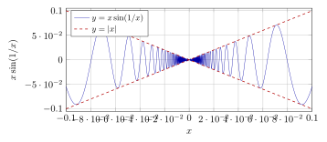
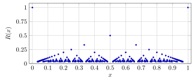
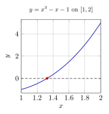
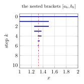
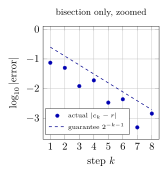
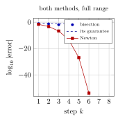

# 第 7 讲　连续函数 I：零点与介值 — (Continuity I: zeros and the intermediate value theorem)

本讲研究连续 (continuity)，即函数极限等于该点函数值的情形。问题从方程 $x^3-x-1=0$ 开始：它有没有实根？怎样确定根的位置，并给出误差保证？

先比较连续与间断的例子，再用连续性的运算法则验证具体函数。随后证明零点定理 (zero theorem)：连续函数在区间两端异号时，区间内存在零点。证明中的二分步骤同时给出求根算法，并导出介值定理 (Intermediate Value Theorem)。三角函数均使用弧度 (radians)。

## 1 一点处的连续性 (Continuity at a point)

函数极限用 $\delta$ 控制 $f(x)$ 与目标值的距离。连续性把目标值指定为 $f(a)$。先比较一个多项式在 $a$ 附近的输入、输出误差。

> [!WARNING] 先猜一猜 (Guess first)
>
>
> 取 $f(x)=x^3-x-1$，$x_0=1.3$。先算出 $f(1.3)$。若要求 $|f(x)-f(1.3)|<0.01$，你估计 $x$ 可以在 $1.3$ 两侧走多远？先猜一个数量级：是 $0.01$、$0.002$，还是 $0.0005$？再猜：把 $\varepsilon$ 缩小到十分之一，$\delta$ 大约缩小多少倍？
>

> [!IMPORTANT] 定义 7.1 — 在一点连续 (Continuity at a point)
>
>
> 设 $I\subseteq\mathbb{R}$，$f:I\to\mathbb{R}$，$a\in I$。若对每个 $\varepsilon>0$，存在 $\delta>0$，使得
> $$
> x\in I,\ |x-a|<\delta \ \Longrightarrow\ |f(x)-f(a)|<\varepsilon,
> $$
> 则称 $f$ 在 $a$ 处连续 (continuous at $a$)。若 $f$ 在 $I$ 的每一点都连续，则称 $f$ 在 $I$ 上连续 (continuous on $I$)。否则称 $f$ 在该点间断 (discontinuous at $a$)。
>

与函数极限的定义比较，这里有两处差别，都要记住。第一，不再挖去 $x=a$：定义里允许 $x=a$，而此时 $|f(a)-f(a)|=0<\varepsilon$ 自动成立，所以这一处放宽并不带来新的负担。第二，极限值不是任给的 $L$，而是被钉死为 $f(a)$。换句话说，连续 $=$ 极限存在 $+$ 极限等于函数值。

> [!NOTE] 词语提示
>
>
> *sanity check*：合理性检查；*derivative*：导数；*tolerance*：允许的误差；*bisection*：二分法；*strictly*：严格地；*exact*：精确的。
>

> [!NOTE] Example 7.2 — How large may $\delta$ be? A table at one point
>
>
> Let $f(x)=x^3-x-1$ and $a=1.3$. Exact arithmetic gives
> $$
> f(1.3)=\tfrac{2197}{1000}-\tfrac{13}{10}-1=-\tfrac{103}{1000}=-0.103 .
> $$
> On $[1,2]$ the function is strictly increasing, so for a given $\varepsilon$ the *largest* usable $\delta$ is the smaller of the two distances from $1.3$ to the solutions of $f(x)=-0.103\pm\varepsilon$. Solving each equation by bisection to $9$ decimals:
>
> | $\varepsilon$ | $x_-$ | $x_+$ | $x_0-x_-$ | $x_+-x_0$ | largest $\delta$ |
> |---:|---:|---:|---:|---:|---:|
> | $0.1$ | $1.274826667$ | $1.324014035$ | $0.025173333$ | $0.024014035$ | $0.024014035$ |
> | $0.01$ | $1.297537189$ | $1.302451241$ | $0.002462811$ | $0.002451241$ | $0.002451241$ |
> | $0.001$ | $1.299754242$ | $1.300245642$ | $0.000245758$ | $0.000245642$ | $0.000245642$ |
>
> Two things to read off. First, dividing $\varepsilon$ by $10$ divides $\delta$ by almost exactly $10$: the three values of $\delta/\varepsilon$ are $0.2401$, $0.2451$, $0.2456$. Second, those ratios are converging to $1/4.07=0.245700\ldots$, and $4.07$ is the value of $3x^2-1$ at $x=1.3$. The local steepness of the graph is what converts an output tolerance into an input tolerance. We will not use this observation yet, but it is the first appearance of the derivative in this course.
>
> A *sanity check* worth doing once: $\delta=0.002451241$ is the largest $\delta$ for $\varepsilon=0.01$, so $\delta=0.002$ also works, and so does $\delta=0.001$. The definition asks for *some* $\delta$, never the best one.
>

表里的最后一列是“最大可用的 $\delta$”，但定义只要求存在一个 $\delta$。在证明里我们几乎从不去求最大值。能写出一个够用的 $\delta$ 就够了。求最大值属于数值实验的范围，它的价值是让人看见 $\delta$ 与 $\varepsilon$ 的比例从哪里来。

上一讲的 Heine 归结原理把函数极限换算成数列极限。连续性作为极限的特例，自然也有数列形式。它是本讲最常用的工具：凡是要否定连续性，几乎都用它。

> [!NOTE] 定理 7.3 — 连续的数列刻画 (Sequential characterization of continuity)
>
>
> 设 $f:I\to\mathbb{R}$，$a\in I$。则 $f$ 在 $a$ 处连续 (continuous at $a$) if and only if：对 $I$ 中每个满足 $x_n\to a$ 的数列 $(x_n)$，都有 $f(x_n)\to f(a)$。
>

> [!NOTE] 证明
>
>
> 设 $f$ 在 $a$ 连续，$x_n\to a$，$x_n\in I$。给定 $\varepsilon>0$，取连续性给出的 $\delta>0$；再对这个 $\delta$ 取 $N$，使 $n\ge N$ 时 $|x_n-a|<\delta$。于是 $n\ge N$ 时 $|f(x_n)-f(a)|<\varepsilon$，即 $f(x_n)\to f(a)$。
>
> 反过来用逆否命题。设 $f$ 在 $a$ 不连续，则存在一个 $\varepsilon_0>0$，使得*任何* $\delta>0$ 都不够用：对每个 $\delta>0$，总能找到 $x\in I$ 满足 $|x-a|<\delta$ 而 $|f(x)-f(a)|\ge\varepsilon_0$。对 $n=1,2,\dots$ 取 $\delta=1/n$，得到 $x_n\in I$ 满足
> $$
> |x_n-a|<\tfrac1n,\qquad |f(x_n)-f(a)|\ge\varepsilon_0 .
> $$
> 第一式给出 $x_n\to a$，第二式说明 $f(x_n)$ 不可能收敛到 $f(a)$。这与假设矛盾。
>

证明在每个半径 $1/n$ 内选取一个误差至少为 $\varepsilon_0$ 的点，得到趋于 $a$、但函数值不趋于 $f(a)$ 的数列。

> [!NOTE] 词语提示
>
>
> *continuous*：连续的；*continuity*：连续性；*convergent*：收敛的；*finite*：有限的。
>

> [!NOTE] Example 7.4 — The Dirichlet function is continuous at no point
>
>
> Define $D:\mathbb{R}\to\mathbb{R}$ by $D(x)=1$ if $x\in\mathbb{Q}$ and $D(x)=0$ if $x\notin\mathbb{Q}$. Fix any $a\in\mathbb{R}$. Build two sequences converging to $a$:
> $$
> p_n=\frac{\lfloor 10^n a\rfloor}{10^n}\in\mathbb{Q},\qquad
>  q_n=a+\frac{\sqrt2}{n}\ \ (\text{irrational whenever }a\in\mathbb{Q}).
> $$
> For a concrete instance take $a=1/3$:
>
> |    $n$ | $p_n$ (rational, $D=1$) | $q_n$ (irrational, $D=0$) |
> |---------:|:----------------------------|:------------------------------|
> |   $10$ | $0.333333333$             | $0.474754690$               |
> |  $100$ | $0.343333333$             | $0.347475469$               |
> | $1000$ | $0.334333333$             | $0.334747547$               |
>
> (For readability the second column shows $1/3+1/n$, which is rational as well and equally convergent.) Both columns converge to $1/3$, but $D$ takes the value $1$ along the first and $0$ along the second. If $D$ were continuous at $a$, the sequential characterization would force $1=D(a)=0$. So $D$ is continuous nowhere.
>
> Note what the table does *not* do: no finite table can prove nowhere-continuity. The proof is the two-sequence argument; the table only shows that the two approaches really do coexist at every scale.
>

任意开区间都含有有理数和无理数，因此在每个 $a$ 附近都能选取上述两列点。

## 2 Three types of discontinuity

间断点可按左右极限分类。以下先讨论内点 (interior point)，函数在该点两侧附近均有定义。

> [!WARNING] 先猜一猜 (Guess first)
>
>
> 考虑 $\sin(1/x)$，$x\ne0$。先猜：在区间 $[0.001,\,0.1]$ 上，$\sin(1/x)$ 有多少个零点？是几十个、几百个，还是无穷多个？再猜：把 $\sin(1/x)$ 乘上 $x$ 以后，$x\to0$ 时会发生什么变化？
>

> [!IMPORTANT] 定义 7.5 — 单侧极限与间断点的分类 (One-sided limits; classification of discontinuities)
>
>
> 记 $f(a+0)=\lim_{x\to a^+}f(x)$，$f(a-0)=\lim_{x\to a^-}f(x)$，称为右极限 (right-hand limit) 与左极限 (left-hand limit)。设 $f$ 在 $a$ 处不连续。
>
> - 若 $f(a+0)$ 与 $f(a-0)$ 都存在、有限且相等，则称 $a$ 是可去间断点 (removable discontinuity)。此时重新规定 $f(a)$ 为这个公共值，就能把函数改成在 $a$ 连续。
>
> - 若 $f(a+0)$ 与 $f(a-0)$ 都存在、有限但不相等，则称 $a$ 是跳跃间断点 (jump discontinuity)，并称 $f(a+0)-f(a-0)$ 为跃度 (jump)。
>
> - 若两个单侧极限中至少有一个不作为有限数存在（趋于 $\pm\infty$，或根本不存在），则称 $a$ 是本性间断点 (essential discontinuity)，也称第二类间断点。
>

前两类合称第一类间断点 (discontinuity of the first kind)，其左右极限都存在且有限。

> [!NOTE] 词语提示
>
>
> *consecutive*：相邻的；*removable*：可去的；*infinite*：无穷的；*sampled*：抽取来观察的；*bounded*：有界的；*jump*：跳跃。
>

> [!NOTE] Example 7.6 — A catalogue, with numbers
>
>
> All values below are computed, not quoted.
>
> 1.  **Jump.** $\operatorname{sgn} x$ equals $-1,0,1$ for $x<0$, $x=0$, $x>0$. Here $\operatorname{sgn}(0+0)=1$, $\operatorname{sgn}(0-0)=-1$, jump $=2$. Redefining $\operatorname{sgn}(0)$ cannot help: no single value equals both $1$ and $-1$.
>
> 2.  **Removable.** $g(x)=(x^2-1)/(x-1)$ is undefined at $x=1$, and $g(x)=x+1$ elsewhere:
>     $$
>     g(0.999)=1.999,\quad g(1.001)=2.001,\quad g(0.99)=1.99,\quad g(1.01)=2.01 .
>     $$
>     Both one-sided limits are $2$; setting $g(1):=2$ repairs the function.
>
> 3.  **Essential, of infinite type on one side.** $h(x)=2^{1/x}$ for $x\ne0$:
>     $$
>     h(0.1)=1.024000\times10^{3},\quad h(0.01)=1.267651\times10^{30},\quad h(0.001)=1.071509\times10^{301},
>     $$
>     while $h(-0.1)=9.765625\times10^{-4}$, $h(-0.01)=7.888609\times10^{-31}$, $h(-0.001)=9.332636\times10^{-302}$. So $h(0-0)=0$ but $h(0+0)$ does not exist as a finite number: $h$ blows up from the right.
>
> 4.  **Jump built from a bounded transcendental function.** $u(x)=\arctan(1/x)$:
>     $$
>     u(0.001)=1.56979633,\quad u(-0.001)=-1.56979633,\qquad \pi/2=1.57079633 .
>     $$
>     Both one-sided limits exist and are finite, $\pm\pi/2$, so the jump is $\pi$.
>
> 5.  **Essential, of oscillating type.** $s(x)=\sin(1/x)$. Its zeros in $(0,\infty)$ are exactly $x=1/(k\pi)$, $k\in\mathbb{N}$. In the window $[0.001,0.1]$ this means $k$ from $4$ to $318$, i.e. $315$ zeros; in $[10^{-6},10^{-3}]$ it means $k$ from $319$ to $318\,309$, i.e. $317\,991$ zeros. Between consecutive zeros $s$ reaches $+1$ or $-1$. Neither one-sided limit exists.
>
> 6.  **Repaired by damping.** $v(x)=x\sin(1/x)$ for $x\ne0$. Since $|v(x)|\le|x|$, the squeeze theorem gives $v(0+0)=v(0-0)=0$, so $x=0$ is removable: set $v(0):=0$. Sampled values:
>     $$
>     v(0.1)=-0.054402111,\quad v(0.01)=-0.005063656,\quad v(0.001)=+0.000826880 .
>     $$
>     The sign still changes infinitely often; only the size is controlled.
>

$\sin(1/x)$ 与 $x\sin(1/x)$ 的零点相同，但后者满足 $|x\sin(1/x)|\le|x|$，因而在 $0$ 处的极限为零。

请看两条虚线（$y=\pm|x|$）如何把曲线夹住。曲线在任何一个包含 $0$ 的区间里都穿越水平轴无穷多次，但它被迫随 $|x|$ 一起收口。这就是“可去”在图上的样子。图的中段看上去像实心的，那只是有限分辨率的假象，不是函数的性质。

最后一个例子只陈述、不证明，但要看清它的数值面貌。它说明间断点可以多到“每个有理数都是”，而连续点也可以多到“每个无理数都是”。

> [!IMPORTANT] 定义 7.7 — Riemann 函数 (Riemann's function)
>
>
> 在 $[0,1]$ 上定义
> $$
> R(x)=\begin{cases}
>  1/q, & x=p/q \text{ 为既约分数 (in lowest terms)},\ q\in\mathbb{N},\ p\in\mathbb{Z},\\
>  0, & x \text{ 为无理数 (irrational)} .
>  \end{cases}
> $$
> （约定 $0=0/1$，$1=1/1$，故 $R(0)=R(1)=1$。）
>

> [!NOTE] 定理 7.8 — Riemann 函数的连续点 (Continuity points of $R$)
>
>
> $R$ 在 $[0,1]$ 的每个无理点连续 (continuous at every irrational point)，在每个有理点间断，且每个有理点都是可去间断点 (removable discontinuity)。
>

本讲只陈述这个定理，把证明留作习题。先看数值：下面的散点图画出所有分母 $q\le30$ 的既约分数 $p/q$ 处的函数值。

图中画出 $q\le30$ 的 $279$ 个既约分数处的函数值。对任意固定 $\varepsilon>0$，值不小于 $\varepsilon$ 的点只有有限个：它们的分母满足 $q\le1/\varepsilon$。

> [!NOTE] 词语提示
>
>
> *comparison*：比较。
>

> [!NOTE] Example 7.9 — Finding $\delta$ at one irrational point
>
>
> Take $\alpha=\sqrt2/2=0.7071067811865476$ and $\varepsilon=1/20$. We must find $\delta>0$ so that $|x-\alpha|<\delta$ forces $R(x)<1/20$ (recall $R(\alpha)=0$). Now $R(x)\ge1/20$ happens only at $x=p/q$ with $q\le20$. In $[0,1]$ there are exactly $129$ such fractions, and the one closest to $\alpha$ is
> $$
> \frac{12}{17}=0.705882352941\ldots,\qquad \Bigl|\frac{12}{17}-\alpha\Bigr|=0.00122443\ldots
> $$
> So any $\delta\le0.0012$ works; $\delta=0.001$ is a clean choice. Two smaller values of $\varepsilon$, for comparison: with $\varepsilon=1/10$ only $33$ fractions are dangerous and the nearest is $7/10$ at distance $0.00710678$; with $\varepsilon=1/5$ only $11$ are dangerous and the nearest is $2/3$ at distance $0.04044011$.
>
> **The mechanism.** For each $\varepsilon>0$ only *finitely many* fractions have $R\ge\varepsilon$, and $\alpha$ is none of them; a finite set of points that misses $\alpha$ has a positive distance from $\alpha$. That distance is the $\delta$. This is the whole proof, and the table is the whole proof written with numbers.
>

注意这里 $\delta$ 对 $\alpha$ 的依赖有多剧烈：换一个无理点，最近的“危险分数”可能近得多，$\delta$ 也就小得多。$\delta$ 既依赖 $\varepsilon$ 也依赖点的位置。这是第 8 讲要正面处理的问题。

> [!NOTE] 词语提示
>
>
> *simultaneously*：同时；*discontinuity*：间断。
>

> [!IMPORTANT] Exercise 7.10 — Why the repair cannot be done everywhere at once
>
>
> Every rational point of $R$ is a removable discontinuity. Explain, in one or two sentences, why one nevertheless cannot produce a function continuous on all of $[0,1]$ by redefining $R$ at every rational simultaneously. (Hint: what would the repaired function have to equal at each rational, and what function would you then be looking at?)
>

## 3 连续性怎样传递 (How continuity propagates)

要用连续性，先得有一批连续函数。这一节把材料准备好：四则运算、复合、多项式与有理函数、$\sin$ 与 $\cos$。证明都很短，因为力气在上一讲的极限法则里已经花过了。

> [!NOTE] 定理 7.11 — 四则运算保持连续 (Arithmetic preserves continuity)
>
>
> 设 $f,g:I\to\mathbb{R}$ 都在 $a\in I$ 处连续 (continuous at $a$)。则 $f+g$、$f-g$、$fg$ 在 $a$ 处连续；若 $g(a)\ne0$，则 $f/g$ 在 $a$ 的某个邻域内有定义且在 $a$ 处连续。
>

> [!NOTE] 证明
>
>
> 用数列刻画。设 $x_n\to a$，$x_n\in I$。由假设 $f(x_n)\to f(a)$，$g(x_n)\to g(a)$。第 2 讲的极限法则 (limit laws) 给出 $f(x_n)\pm g(x_n)\to f(a)\pm g(a)$ 以及 $f(x_n)g(x_n)\to f(a)g(a)$。再用一次数列刻画即得前三条。
>
> 商的情形先要保证分母不为零。由下面的局部保号性引理，存在 $\delta>0$ 使 $|g(x)|>|g(a)|/2>0$ 对一切满足 $|x-a|<\delta$ 的 $x\in I$ 成立；在这个范围内 $f/g$ 有定义，再用极限法则的商形式即可。
>

> [!NOTE] 引理 7.12 — 局部保号性 (Local sign preservation)
>
>
> 设 $f$ 在 $a$ 处连续且 $f(a)>0$。则存在 $\delta>0$，使得对一切满足 $|x-a|<\delta$ 的 $x\in I$ 都有 $f(x)>f(a)/2>0$。$f(a)<0$ 时有对称的结论。
>

> [!NOTE] 证明
>
>
> 在连续性定义中取 $\varepsilon=f(a)/2>0$，得到相应的 $\delta$。此时 $|f(x)-f(a)|<f(a)/2$，故 $f(x)>f(a)-f(a)/2=f(a)/2$。
>

> [!NOTE] 定理 7.13 — 复合保持连续 (Composition preserves continuity)
>
>
> 设 $f:I\to J$ 在 $a\in I$ 处连续 (continuous at $a$)，$g:J\to\mathbb{R}$ 在 $b=f(a)$ 处连续。则 $g\circ f$ 在 $a$ 处连续。
>

> [!NOTE] 证明
>
>
> 给定 $\varepsilon>0$。由 $g$ 在 $b$ 连续，存在 $\eta>0$，使 $y\in J$、$|y-b|<\eta$ 时 $|g(y)-g(b)|<\varepsilon$。再由 $f$ 在 $a$ 连续，对这个 $\eta$ 存在 $\delta>0$，使 $x\in I$、$|x-a|<\delta$ 时 $|f(x)-f(a)|<\eta$。把 $y=f(x)$ 代入，即得 $|g(f(x))-g(f(a))|<\varepsilon$。
>

这里先按输出误差 $\varepsilon$ 选择 $\eta$，再用这个 $\eta$ 选择内层函数所需的 $\delta$。

> [!NOTE] 命题 7.14 — 多项式与有理函数 (Polynomials and rational functions)
>
>
> 常值函数与恒等函数 $x\mapsto x$ 在 $\mathbb{R}$ 上连续 (continuous on $\mathbb{R}$)。因此每个多项式 (polynomial) 在 $\mathbb{R}$ 上连续；两个多项式之商在分母不为零的每一点连续。
>

> [!NOTE] 证明
>
>
> 常值函数：任取 $\delta=1$ 即可。恒等函数：取 $\delta=\varepsilon$。多项式由这两类函数经有限次加法与乘法得到，反复使用四则定理。商的情形同理。
>

> [!NOTE] 命题 7.15 — 正弦与余弦 (Sine and cosine)
>
>
> 对一切实数 $x,y$ 有 $|\sin x-\sin y|\le|x-y|$ 与 $|\cos x-\cos y|\le|x-y|$。因此 $\sin$ 与 $\cos$ 在 $\mathbb{R}$ 上连续 (continuous on $\mathbb{R}$)。
>

> [!NOTE] 证明
>
>
> 由和差化积，
> $$
> \sin x-\sin y=2\sin\frac{x-y}{2}\cos\frac{x+y}{2}.
> $$
> 用上一讲的 $|\sin t|\le|t|$ 与 $|\cos t|\le1$ 得
> $$
> |\sin x-\sin y|\le2\cdot\frac{|x-y|}{2}\cdot1=|x-y| .
> $$
> 余弦同理。于是在连续性定义中取 $\delta=\varepsilon$ 即可。这里 $\delta$ 与点的位置无关，这一点本身可用于后续计算，第 8 讲会给它一个名字。
>

> [!NOTE] 词语提示
>
>
> *factor*：因子；*sharp*：不能改进的；最优的；*bound*：界；估计；*ratio*：比值。
>

> [!NOTE] Example 7.16 — The inequality is far from sharp, and that is fine
>
>
> Numerically, with all values computed to nine decimals:
>
> | $x$   | $y$     | $|\sin x-\sin y|$ |       $|x-y|$ |           ratio |
> |:--------|:----------|--------------------:|----------------:|----------------:|
> | $1.0$ | $1.02$  |     $0.010637037$ | $0.020000000$ | $0.531851857$ |
> | $0.3$ | $0.9$   |     $0.487806703$ | $0.600000000$ | $0.813011172$ |
> | $2.0$ | $2.5$   |     $0.310825283$ | $0.500000000$ | $0.621650565$ |
> | $0.0$ | $0.001$ |     $0.001000000$ | $0.001000000$ | $0.999999833$ |
>
> The ratio is always below $1$ and approaches $1$ only near $x=y=0$, where $\cos$ equals $1$. A bound that is loose by a factor of two costs us nothing here: we only need *some* usable $\delta$, and $\delta=\varepsilon$ is usable everywhere at once.
>

还差一类函数：指数与对数。这里必须停下来记一笔账。

> [!WARNING] 欠条 (IOU) — \#4：实指数幂 $a^x$，第 8 讲与第 14 讲还
>
>
> 对有理指数 $r=p/q$，$a^{r}$ 的定义是代数的：$a^{p/q}$ 是 $a^{p}$ 的 $q$ 次算术根。对无理指数 $x$，我们本讲沿用第 2 讲的朴素实数 (naive $\mathbb{R}$) 约定：把 $a^{x}$ 理解为“用趋于 $x$ 的有理数 $r_n$ 算出的 $a^{r_n}$ 所趋向的那个小数”。本讲在两处用到它：间断点目录里的 $2^{1/x}$，以及后面 $2^{x}=x^{2}$ 的例子。
>
> 欠的是两件事：(i) 这个极限确实存在、且与有理数列的选取无关（well-defined）；(ii) $x\mapsto a^{x}$ 连续。第 8 讲用单调性给出定义并证明连续性，第 14 讲在完备化的框架里补齐存在性。记为欠条 \#4。
>

## 4 零点定理：二分法既是证明也是算法 (The zero theorem, proved by bisection)

现在回到开场的问题。$f(x)=x^3-x-1$ 是多项式，因而处处连续；$f(1)=-1<0$，$f(2)=5>0$。图像从水平轴下方走到上方，凭直觉它必须穿过去。要把这句直觉变成定理，还要变成可以在纸上执行的步骤。

> [!WARNING] 先猜一猜 (Guess first)
>
>
> 先不算：$x^3-x-1=0$ 的实根在哪两个相邻整数之间？（试 $x=1$ 与 $x=2$。）然后猜两件事：(a) 用对半分的办法，每一步能把答案多确定几位小数？(b) 要把根定到三位小数，大约要分多少次？写下你的两个数字，再往下读。
>

> [!NOTE] 词语提示
>
>
> *decimal places*：小数位数；*error bound*：误差上界；*estimate*：估计；*midpoint*：中点；*bracket*：夹住目标的区间。
>

> [!NOTE] Example 7.17 — Ten bisections of $x^3-x-1$, by hand, in exact fractions
>
>
> Start from $[a_0,b_0]=[1,2]$ with $f(1)=-1<0<5=f(2)$. At each step take the midpoint $m_k$, evaluate the sign of $f(m_k)$, and keep the half whose endpoints still carry opposite signs. All fractions below are exact.
>
> | $k$ | $m_k$ | $m_k$ (decimal) | $f(m_k)$ | sign | new bracket $[a_k,b_k]$ |
> |---:|:--:|---:|---:|:--:|:---|
> | $1$ | $3/2$ | $1.5000000$ | $+0.875000$ | $+$ | $[1,\,3/2]$ |
> | $2$ | $5/4$ | $1.2500000$ | $-0.296875$ | $-$ | $[5/4,\,3/2]$ |
> | $3$ | $11/8$ | $1.3750000$ | $+0.224609$ | $+$ | $[5/4,\,11/8]$ |
> | $4$ | $21/16$ | $1.3125000$ | $-0.051514$ | $-$ | $[21/16,\,11/8]$ |
> | $5$ | $43/32$ | $1.3437500$ | $+0.082611$ | $+$ | $[21/16,\,43/32]$ |
> | $6$ | $85/64$ | $1.3281250$ | $+0.014576$ | $+$ | $[21/16,\,85/64]$ |
> | $7$ | $169/128$ | $1.3203125$ | $-0.018711$ | $-$ | $[169/128,\,85/64]$ |
> | $8$ | $339/256$ | $1.3242188$ | $-0.002128$ | $-$ | $[339/256,\,85/64]$ |
> | $9$ | $679/512$ | $1.3261719$ | $+0.006209$ | $+$ | $[339/256,\,679/512]$ |
> | $10$ | $1357/1024$ | $1.3251953$ | $+0.002037$ | $+$ | $[339/256,\,1357/1024]$ |
>
> After ten steps the bracket is
> $$
> \Bigl[\frac{339}{256},\ \frac{1357}{1024}\Bigr]=[1.32421875,\ 1.3251953125],\qquad \text{length}=\frac1{1024}=0.0009765625 .
> $$
> The best single estimate is the midpoint $2713/2048=1.32470703125$, and every point of the bracket is within $1/2048=0.00048828125$ of the root. Since $1/2048<0.5\times10^{-3}$, three decimals are now certain: the root is $1.325$ to three decimal places. (To higher accuracy it is $1.3247179572\ldots$, so the midpoint above is actually off by only $1.09\times10^{-5}$ — better than guaranteed, which is typical and must never be relied on.)
>
> **Ten is the right answer to the guess.** The bracket length after $k$ steps is $2^{-k}$ and the error bound is $2^{-k-1}$. Three decimals means error $<5\times10^{-4}$, i.e. $2^{k+1}>2000$, i.e. $k\ge10$. Each step buys $\log_{10}2=0.30102999\ldots$ decimal digits: about one digit every three and a third steps.
>

表中做了 $10$ 次中点符号判断。下面证明二分过程始终保留一个零点，并给出区间长度的估计。

> [!NOTE] 定理 7.18 — 零点定理 (Zero theorem)
>
>
> 设 $f$ 在闭区间 $[a,b]$ 上连续 (continuous on $[a,b]$)，且 $f(a)f(b)<0$。则存在 $\xi\in(a,b)$ 使 $f(\xi)=0$。
>

> [!NOTE] 证明
>
>
> 令 $[a_0,b_0]=[a,b]$。假设已得 $[a_k,b_k]\subseteq[a,b]$ 满足 $f(a_k)f(b_k)<0$ 且 $b_k-a_k=(b-a)2^{-k}$。取中点 $m=(a_k+b_k)/2$。
>
> 若 $f(m)=0$，则 $\xi=m$ 已是零点，证毕。否则 $f(m)$ 与 $f(a_k),f(b_k)$ 之一异号：若 $f(a_k)f(m)<0$ 取 $[a_{k+1},b_{k+1}]=[a_k,m]$，否则必有 $f(m)f(b_k)<0$，取 $[a_{k+1},b_{k+1}]=[m,b_k]$。两种情形下新区间都保持假设，且长度减半。
>
> 于是得到一列前后相套的闭区间 (nested closed intervals)
> $$
> [a_0,b_0]\supseteq[a_1,b_1]\supseteq\cdots,\qquad b_k-a_k=(b-a)2^{-k}\to0 .
> $$
> 它们有唯一的公共点 $\xi$（见下面的欠条），并且 $a_k\to\xi$，$b_k\to\xi$。
>
> 由 $f$ 在 $\xi$ 处连续与数列刻画，$f(a_k)\to f(\xi)$ 与 $f(b_k)\to f(\xi)$。再由乘积的极限法则，
> $$
> f(a_k)f(b_k)\longrightarrow f(\xi)^2 .
> $$
> 但左边每一项都 $<0$，故由极限的比较性质 $f(\xi)^2\le0$，因此 $f(\xi)=0$。
>
> 最后 $\xi\ne a$ 且 $\xi\ne b$，因为 $f(a)\ne0\ne f(b)$。故 $\xi\in(a,b)$。
>

> [!WARNING] 欠条 (IOU) — 旧欠条 \#3 的使用：第 14 讲还
>
>
> 证明中“长度趋于零的相套闭区间有唯一公共点”这一步，是第 5 讲使用 Bolzano–Weierstrass 时记下的同一笔账（欠条 \#3）。它是实数完备性 (completeness of $\mathbb{R}$) 的一种表述，在朴素实数的约定下我们暂时直接使用。唯一性倒是不欠的：若 $\xi,\xi'$ 都是公共点，则 $|\xi-\xi'|\le b_k-a_k\to0$，故 $\xi=\xi'$。第 14 讲还。
>

区间公共点的存在依赖于实数的完备性。在有理数中，同样的二分过程未必有公共点。

> [!NOTE] 注 7.19 — 同一个算法，在 $\mathbb{Q}$ 里会失败
>
>
> 把上面的二分法逐字搬到有理数中：$f(x)=x^3-x-1$ 的系数是有理数，每个中点也是有理数，符号判断一次也不会出错，区间长度照样是 $2^{-k}$。但这一列有理区间没有有理的公共点。因为 $x^3-x-1=0$ 没有有理根：既约分数根的分子整除 $1$、分母整除 $1$，只剩 $x=\pm1$，而 $f(1)=-1$，$f(-1)=-1$，都不是零。
>
> 这列有理端点的距离趋于零，但其共同极限不在 $\mathbb{Q}$ 中。欠条 \#3 保证公共点在 $\mathbb{R}$ 中存在。
>

左图是曲线与它唯一的实根（红点，$1.3247179572\ldots$）；右图把十一层区间按步数自上而下排开，竖直虚线是同一个根。请注意右图里每一层都完整地包含下一层，而且每层长度正好是上一层的一半。这两条性质就是证明里用到的全部信息。

> [!NOTE] 词语提示
>
>
> *optimal*：最优的；*slope*：斜率。
>

> [!NOTE] Example 7.20 — Bisection is cheaper per digit than decimal search
>
>
> A natural competitor: cut $[1,2]$ into ten equal parts, evaluate $f$ at the nine interior points, and keep the subinterval where the sign changes. That round produces one exact decimal digit and costs nine evaluations of $f$. Bisection costs one evaluation per step and produces $\log_{10}2=0.301$ digits. Per evaluation:
> $$
> \text{bisection: } 0.301\ \text{digits},\qquad \text{decimal search: } 1/9=0.111\ \text{digits}.
> $$
> To reach six correct decimals starting from a bracket of length $1$: bisection needs $\lceil\log_2 10^{6}\rceil=20$ evaluations, decimal search needs $9\times6=54$. The method that feels more natural to a human is the more expensive one, by a factor of $2.7$.
>
> **Why the comparison is fair.** Both methods only ever use the *sign* of $f$, never its size. Among all such methods, halving is optimal, because one sign gives one bit and a bit is exactly a halving. Newton’s method from Lecture 4 escapes this bound only because it reads the value and the slope, not just the sign.
>

“只用符号”与“也用数值”的分界，是理解一切求根方法速度的起点。本讲末的 AI Lab 会把两条速度曲线并排画出来。

> [!NOTE] 词语提示
>
>
> *hypothesis*：假设。
>

> [!NOTE] Example 7.21 — Where the hypothesis really bites
>
>
> Consider $\varphi(x)=\tan x-x$ on $[1.4,\,1.8]$. Computation gives
> $$
> \varphi(1.4)=+4.397883715,\qquad \varphi(1.8)=-6.086261675 .
> $$
> The signs are opposite, yet $\varphi$ has no zero in $[1.4,1.8]$: the only solutions of $\tan x=x$ are $x=0$ and points near $4.493409458$, $7.725\ldots$, and so on. The obstruction is that $\varphi$ is not defined — hence not continuous — at $\pi/2=1.570796327\in(1.4,1.8)$.
>
> Contrast a genuine bracket for the same equation: $\varphi(4.4)=-1.303676219$ and $\varphi(4.5)=+0.137332055$, with $\varphi$ continuous on $[4.4,4.5]$ because $\pi/2$ and $3\pi/2=4.712388980$ are both outside. Bisection here converges to $4.493409458$.
>
> **Moral.** “Sign change” is cheap to check and proves nothing by itself. The hypothesis that has to be verified — and the one a careless computation silently skips — is continuity on the *whole* closed interval.
>

一个纯粹的符号检查程序不会察觉 $\pi/2$ 处的断裂，它会照样二分下去，收敛到 $\pi/2$，并报告那里有一个根。这是把算法与定理分开看时最容易犯的错误：算法总会给你一个答案，只有定理能告诉你答案是否有意义。

## 5 介值定理及其用处 (The IVT and what it buys)

零点定理说的是“取到 $0$”。把函数上下平移一下，立刻就得到“取到任何中间值”。

> [!NOTE] 定理 7.22 — 介值定理 (Intermediate Value Theorem)
>
>
> 设 $f$ 在 $[a,b]$ 上连续 (continuous on $[a,b]$)，$C$ 是介于 $f(a)$ 与 $f(b)$ 之间的任一实数。则存在 $c\in[a,b]$ 使 $f(c)=C$。
>

> [!NOTE] 证明
>
>
> 若 $C=f(a)$ 或 $C=f(b)$，取 $c=a$ 或 $c=b$。否则 $C$ 严格介于两者之间。令 $g(x)=f(x)-C$；由四则定理 $g$ 在 $[a,b]$ 上连续，且 $g(a)=f(a)-C$ 与 $g(b)=f(b)-C$ 异号，即 $g(a)g(b)<0$。由零点定理存在 $c\in(a,b)$ 使 $g(c)=0$，即 $f(c)=C$。
>

介值定理的用法几乎总是同一个套路：把要证明的“存在某个东西”改写成“某个连续函数取到 $0$”，再去两端找相反的符号。下面四个应用都是这样。

> [!WARNING] 先猜一猜 (Guess first)
>
>
> 方程 $2^{x}=x^{2}$ 有几个实数解？两个明显的解是 $x=2$ 与 $x=4$。先猜：是不是只有这两个？在写下答案之前，请分别想一想 $x$ 很大、$x$ 在 $0$ 附近、$x$ 为负时两边各自的大小。
>

> [!NOTE] 词语提示
>
>
> *convergence*：收敛。
>

> [!NOTE] Example 7.23 — $2^{x}=x^{2}$ has a third root, and it is negative
>
>
> Let $g(x)=2^{x}-x^{2}$. Obvious roots: $g(2)=4-4=0$ and $g(4)=16-16=0$. Now look to the left of $0$. For $x<0$ we have $2^{x}\in(0,1)$ while $x^{2}>0$ grows, so a crossing is plausible. Computation:
> $$
> g(-1)=0.5-1=-0.500000000,\qquad g(0)=1-0=+1.000000000 .
> $$
> Opposite signs, and $g$ is continuous on $[-1,0]$ (using IOU \#4 for $2^{x}$). So there is a root in $(-1,0)$. Tightening by hand:
> $$
> g(-0.8)=-0.065650823<0,\qquad g(-0.7)=+0.125572207>0 ,
> $$
> so the root lies in $(-0.8,-0.7)$. Bisecting to convergence gives
> $$
> x_{*}=-0.766664696,\qquad 2^{x_{*}}=0.5877747560,\quad x_{*}^{2}=0.5877747560 .
> $$
> **Answer to the guess:** three real solutions, not two. The negative one is invisible if you only look at the picture on $[0,5]$, which is where most people look.
>

除 $x=2,4$ 外，负半轴上也有解：比较 $2^x-x^2$ 在 $x=-1$ 与 $x=0$ 的符号即可。

> [!NOTE] 推论 7.24 — 奇次多项式必有实根 (Odd-degree polynomials have a real root)
>
>
> 设
> $$
> p(x)=x^{2m+1}+a_{2m}x^{2m}+\cdots+a_1x+a_0
> $$
> 的系数都是实数。令 $R=1+|a_{2m}|+\cdots+|a_1|+|a_0|$。则 $p(-R)<0<p(R)$，因而 $p$ 在 $(-R,R)$ 内至少有一个实根。
>

> [!NOTE] 证明
>
>
> 因 $R\ge1$，当 $|x|=R$ 时对每个 $j\le 2m$ 有 $|x|^{j}\le R^{2m}$，故
> $$
> \Bigl|\sum_{j=0}^{2m}a_jx^{j}\Bigr|\le\Bigl(\sum_{j=0}^{2m}|a_j|\Bigr)R^{2m}=(R-1)R^{2m}<R^{2m+1}=|x|^{2m+1}.
> $$
> 于是 $p(R)=R^{2m+1}+(\cdots)>0$ 而 $p(-R)=-R^{2m+1}+(\cdots)<0$。$p$ 是多项式故连续，用零点定理即可。
>

> [!NOTE] Example 7.25 — A crude bound that works, and a sharper search that pays
>
>
> Take $p(x)=x^{5}-5x+2$. Here $\sum|a_j|=5+2=7$, so $R=8$, and indeed
> $$
> p(-8)=-32768+40+2=-32726<0,\qquad p(8)=32768-40+2=+32730>0 .
> $$
> The guaranteed bracket $[-8,8]$ is enormous compared with the roots, but it is a *proof*, obtained with two evaluations and no picture.
>
> Now search inside it on the integers:
> $$
> p(-2)=-20,\quad p(-1)=+6,\quad p(0)=+2,\quad p(1)=-2,\quad p(2)=+24 .
> $$
> Three sign changes, hence three roots, one in each of $(-2,-1)$, $(0,1)$, $(1,2)$. Bisecting each to nine decimals:
> $$
> -1.582035769,\qquad 0.402102390,\qquad 1.371881783 .
> $$
> The corollary promised one; five integer evaluations found three. *The theorem gives existence; only computation gives the count.*
>

符号变化可以保证零点存在；要排除其他零点，还需单调性等条件。

第 4 讲用蜘蛛网图观察过迭代 $x_{n+1}=\varphi(x_n)$ 的不动点。当时我们靠压缩条件同时得到存在性与收敛性。介值定理给出一个弱得多、也宽得多的存在性结论：只要 $\varphi$ 把区间映回自身，不动点就一定有，哪怕迭代根本不收敛。

> [!NOTE] 推论 7.26 — 不动点的存在 (Existence of a fixed point)
>
>
> 设 $\varphi:[a,b]\to[a,b]$ 连续 (continuous)。则存在 $x_{*}\in[a,b]$ 使 $\varphi(x_{*})=x_{*}$。
>

> [!NOTE] 证明
>
>
> 令 $\psi(x)=\varphi(x)-x$，它在 $[a,b]$ 上连续。因 $\varphi(a)\in[a,b]$ 有 $\psi(a)=\varphi(a)-a\ge0$；同理 $\psi(b)=\varphi(b)-b\le0$。若两者之一为零，端点即是不动点。否则 $\psi(a)>0>\psi(b)$，由零点定理得 $\psi(x_{*})=0$。
>

> [!NOTE] 词语提示
>
>
> *fixed point*：不动点；*contraction*：压缩；*orbit*：迭代轨迹；*grid*：网格。
>

> [!NOTE] Example 7.27 — A fixed point located by hand
>
>
> Let $\varphi(x)=\dfrac{\cos x+x^{2}}{2}$ on $[0,1]$. Both $\cos x$ and $x^{2}$ are continuous, so $\varphi$ is. Does $\varphi$ map $[0,1]$ into itself? On $[0,1]$ both $\cos x$ and $x^2$ lie in $[0,1]$, so $\varphi(x)\in[0,1]$; a scan of $100\,001$ grid points confirms the actual range is $[0.5,\,0.7701511529]$, with
> $$
> \varphi(0)=0.5,\qquad \varphi(1)=0.7701511529 .
> $$
> Then $\psi(x)=\varphi(x)-x$ satisfies $\psi(0)=+0.5$ and $\psi(1)=-0.2298488471$. Bisection gives
> $$
> x_{*}=0.589303208,\qquad \varphi(x_{*})=0.589303208 .
> $$
> **Compare with Lecture 4.** There, existence came bundled with a contraction estimate that also told us how fast the orbit converges. Here we get existence and nothing else — no rate, no uniqueness. That is the price of assuming only continuity, and it is often the right price to pay.
>

最后一个应用回答了一个结构性的问题：连续函数把区间送到什么地方去？

> [!NOTE] 推论 7.28 — 区间的像仍是区间 (The image of an interval is an interval)
>
>
> 设 $I\subseteq\mathbb{R}$ 是区间 (interval)，$f$ 在 $I$ 上连续 (continuous on $I$)。则像集 $f(I)=\{f(x):x\in I\}$ 也是区间。
>

> [!NOTE] 证明
>
>
> 一个集合 $J\subseteq\mathbb{R}$ 是区间，当且仅当：只要 $u,v\in J$ 且 $u<w<v$，就有 $w\in J$。取 $u=f(x_1)$、$v=f(x_2)\in f(I)$ 与 $u<w<v$。不妨设 $x_1<x_2$（否则交换）。因 $I$ 是区间，$[x_1,x_2]\subseteq I$，$f$ 在其上连续。由介值定理存在 $c\in[x_1,x_2]$ 使 $f(c)=w$，故 $w\in f(I)$。
>

> [!NOTE] 注 7.29 — Does a closed interval have a closed image?
>
>
> 这个推论没有说 $f([a,b])$ 是*闭*区间。事实上对本讲的 $f(x)=x^3-x-1$，$f$ 在 $[1,2]$ 上严格增（因为那里 $3x^2-1\ge2>0$，这要到第 9 讲才能名正言顺地用），像恰好是 $[-1,5]$。但“闭”从哪里来？它需要最大值与最小值真的被取到，而这一步本讲证不出来。它要用第 5 讲的取子列。第 8 讲补上。
>

> [!NOTE] 词语提示
>
>
> *intermediate*：中间的；*attained*：能取到的。
>

> [!NOTE] Example 7.30 — An intermediate value picked out of an average
>
>
> For $f(x)=x^{3}-x-1$ take the three points $x_1=1$, $x_2=1.5$, $x_3=2$ of $[1,2]$:
> $$
> f(1)=-1,\qquad f(1.5)=0.875,\qquad f(2)=5,\qquad \frac{-1+0.875+5}{3}=1.625 .
> $$
> The mean $1.625$ lies between $\min f(x_i)=-1$ and $\max f(x_i)=5$, so the IVT applied on $[1,2]$ produces a point where $f$ equals it:
> $$
> \xi=1.619049585,\qquad f(\xi)=1.625 .
> $$
> **Why this is not a trick.** The same argument works for any finite list $x_1<\cdots<x_n$ in $[a,b]$ and any continuous $f$: the arithmetic mean of $f(x_1),\ldots,f(x_n)$ always lies between the smallest and the largest of them, and both of those are values of $f$. The IVT converts “between two attained values” into “attained”. Problem [**7.6**](#l07-ex:mean) at the end of the lecture asks you to write this out.
>

“平均值也是函数值”这个现象，在积分那几讲会以积分中值定理的形式再次出现。它们用的是同一个介值定理。

## 6 An AI experiment on convergence rates

下面比较二分法与牛顿法的误差随迭代次数的变化。二分法每步把误差上界减半；牛顿法在本例中接近根后收敛更快。

> [!NOTE] 词语提示
>
>
> *logarithms*：对数；*benchmarks*：核对用的参考结果；*binary64*：64位二进制浮点格式；*at least*：至少；*predict*：预测。
>

> [!NOTE] AI Lab — Bisection versus Newton on the same equation
>
>
> Work with $f(x)=x^{3}-x-1$, whose root is $r=1.3247179572447460259609\ldots$ (computed to $40$ digits by bisection in $60$-digit decimal arithmetic).
>
> **Before running anything:** predict how many steps each method needs to reach $10$ correct decimals. Write both numbers down.
>
> **What to ask the AI for.**
>
> 1.  Run bisection on $[1,2]$ for $8$ steps. After step $k$ report the bracket and its midpoint $c_k$.
>
> 2.  Run Newton’s iteration $x_{k+1}=x_k-\dfrac{x_k^{3}-x_k-1}{3x_k^{2}-1}$ from $x_0=1.5$ for $8$ steps.
>
> 3.  Tabulate $|c_k-r|$ and $|x_k-r|$, and plot $\log_{10}$ of both against $k$.
>
> **Implementation requirement.** Newton’s error drops below $10^{-16}$ at step $4$, so binary64 floating point cannot show the pattern. Use decimal arithmetic with at least $60$ digits:
>
>     from decimal import Decimal, getcontext
>     getcontext().prec = 80
>     x = Decimal("1.5")
>     for k in range(8):
>         x = x - (x**3 - x - 1) / (3*x**2 - 1)
>
> **Benchmarks from an actual run** (errors, not values):
>
> | $k$ | bisection $|c_k-r|$   | Newton $|x_k-r|$       |
> |------:|:------------------------|:-------------------------|
> | $1$ | $7.4718\times10^{-2}$ | $2.3108\times10^{-2}$  |
> | $2$ | $5.0282\times10^{-2}$ | $4.8244\times10^{-4}$  |
> | $3$ | $1.2218\times10^{-2}$ | $2.1675\times10^{-7}$  |
> | $4$ | $1.9032\times10^{-2}$ | $4.3782\times10^{-14}$ |
> | $5$ | $3.4070\times10^{-3}$ | $1.7863\times10^{-27}$ |
> | $6$ | $4.4055\times10^{-3}$ | $2.9736\times10^{-54}$ |
> | $7$ | $4.9921\times10^{-4}$ | $<10^{-79}$            |
> | $8$ | $1.4539\times10^{-3}$ | $<10^{-79}$            |
>
> **Three questions to answer from the output.**
>
> 1.  The bisection column is *not* decreasing: $|c_4-r|>|c_3-r|$ and $|c_8-r|>|c_7-r|$. What *is* decreasing monotonically, and by exactly what factor? Which of the two is the thing the theorem guarantees?
>
> 2.  Take logarithms of the Newton column: $-1.64,\ -3.32,\ -6.66,\ -13.36,\ -26.75,\ -53.53$. Compute the ratio of each to the previous one. You should get $2.03,\ 2.01,\ 2.00,\ 2.00,\ 2.00$. State in one sentence what this says about the number of correct digits.
>
> 3.  Restart Newton from $x_0=0.5$ instead. Report what happens and explain it from the formula $3x^{2}-1$. Then say which of the two methods you would hand to someone who knows nothing about the function except two points where it has opposite signs.
>

左图只放大二分法：虚线是保证，一条斜率为 $-\log_{10}2=-0.301$ 的直线；蓝点是实际误差，始终在虚线下方，但上下起伏。保证是单调的，实际误差不是。右图把两种方法放在同一纵轴上，$\log_{10}$ 从 $0$ 一直到 $-56$：二分法的八个点几乎全部挤在顶端，红色方块则沿着一条越来越陡的曲线掉下去，每一步的 $\log_{10}$ 误差大约翻倍。这两种下落方式的区别，就是“稳但慢”与“快但要好起点”的全部内容。

> [!NOTE] 词语提示
>
>
> *oscillation*：振荡；*vertical*：竖直的；*exhibit*：给出具体例子；*rescale*：重新缩放；*nested*：逐层包含的；*least*：最小的；*axes*：坐标轴。
>

> [!NOTE] AI Lab — Zooming into $x\sin(1/x)$ at the origin
>
>
> Ask an AI to plot $v(x)=x\sin(1/x)$ (with $v(0)=0$) on three nested windows: $[-0.1,0.1]$, $[-0.01,0.01]$, and $[-0.001,0.001]$. Require at least $20\,000$ sample points in each window, and ask for the envelopes $y=\pm|x|$ on the same axes.
>
> **Predict first:** will the three pictures look different from one another, after you rescale the vertical axis to match each window? How many zeros does $v$ have in $[0.001,0.1]$? (Count solutions of $1/x=k\pi$; the answer is an exact integer, and it is $315$.)
>
> **Then ask the AI the question it is most likely to get wrong:** “Is $v$ continuous at $0$?” Many systems answer by describing the oscillation and conclude “no”. Judge the answer by the definition, not by the picture: given $\varepsilon>0$, exhibit a $\delta$. Then ask the same question about $s(x)=\sin(1/x)$ with $s(0):=0$, where the honest answer is different, and check that the system’s reasoning changed for the right reason.
>
> **What to report.** For each of $\varepsilon=0.1,\,0.01,\,0.001$, the largest $\delta$ that works for $v$ at $0$ (you can read it off the inequality $|v(x)|\le|x|$ without any computation — say what it is and why it is exactly $\varepsilon$). Then state what goes wrong when you try to do the same for $s$.
>

第二个实验比较图像与定义的判断。对 $v(x)=x\sin(1/x)$，估计 $|v(x)|\le|x|$ 直接给出 $\delta=\varepsilon$，不受绘图分辨率影响。

## 7 Exercises

> [!NOTE] 词语提示
>
>
> *counterexample*：反例；*discontinuous*：不连续的；*sketch*：草图；画草图。
>

1. **7.1**  $\bigstar$ **(homework)** Consider $x^{3}-3x-1=0$. First, *without computing*, predict how many real roots it has and in which pairs of consecutive integers they lie; write your guess down. Then evaluate the polynomial at $x=-2,-1,0,1,2,3$ and compare with your guess. Pick the root in $(1,2)$ and bisect by hand for $6$ steps, keeping exact fractions. Before starting, predict how many decimals $6$ steps will secure; afterwards, state the guaranteed error bound and the actual error (compare against a longer run).

1. **7.2**  $\bigstar$ For $f(x)=x^{3}-x-1$ at $x_0=1.6$: estimate the largest usable $\delta$ for $\varepsilon=0.01$ using the rule of thumb $\delta\approx\varepsilon/(3x_0^{2}-1)$ suggested by Example 7.2, then compute the true largest $\delta$ to $9$ decimals by solving $f(x)=f(1.6)\pm0.01$. Report both numbers and the relative discrepancy. Explain why the rule of thumb is an *estimate* and not a theorem at this stage of the course.

1. **7.3**  $\bigstar$ Each of the following fails to be continuous at $x=0$. Decide by eye which kind of discontinuity it is, write your three answers down, and only then compute one-sided limits to check:
    $$
    \frac{|x|}{x},\qquad \frac{\sin x}{x},\qquad \frac{1}{1+2^{1/x}},\qquad x^{2}\sin\frac1{x^{3}} .
    $$
    For each of the removable ones, state the value that repairs it. For the essential one, exhibit two sequences $x_n\to0$ along which the function tends to different limits.

1. **7.4**  $\bigstar$$\bigstar$ **(homework)** How many real solutions does $2^{x}=x^{3}$ have? Guess first (the honest guess is hard; commit to a number). Then decide the question by evaluating both sides at $x=0,1,2,8,9,10$ and by arguing separately about $x<0$. Bracket each root between consecutive integers and bisect one of them to $3$ decimals. Finally, explain why a plot on $[0,3]$ alone would have misled you.

1. **7.5**  $\bigstar$$\bigstar$ Let $f$ be continuous on $[0,1]$ with $f(0)=f(1)$. Draw two or three such graphs and guess whether there must exist $x\in[0,\tfrac12]$ with $f(x)=f(x+\tfrac12)$. Then prove your guess by applying the zero theorem to $g(x)=f(x+\tfrac12)-f(x)$ on $[0,\tfrac12]$. Does the same argument work with $\tfrac12$ replaced by $\tfrac13$? By $0.4$? Test your answer on $f(x)=\sin(2\pi x)+ \sin(4\pi x)$ numerically before deciding.

1. **7.6**  $\bigstar$$\bigstar$ Let $f$ be continuous on $[a,b]$ and let $a\le x_1<x_2<\cdots<x_n\le b$. Prove that there exists $\xi\in[x_1,x_n]$ with
    $$
    f(\xi)=\frac{f(x_1)+f(x_2)+\cdots+f(x_n)}{n} .
    $$
    Then take $f(x)=x^{3}-x-1$ on $[1,2]$ with $x_1=1,\ x_2=1.25,\ x_3=1.5,\ x_4=2$: predict whether $\xi$ will be to the left or to the right of the midpoint $1.5$ before computing, then find $\xi$ to $6$ decimals.

1. **7.7**  $\bigstar$$\bigstar$ **(homework)** A root-finding cost comparison. Starting from a bracket of length $1$, count the evaluations of $f$ needed to guarantee $k$ correct decimals by (a) bisection, (b) cutting into ten equal parts each round, (c) cutting into four equal parts each round (three interior evaluations per round). Predict which of (b) and (c) is cheaper before computing. Produce a table for $k=3,6,12$, and find the general formula for (c). Which method is best, and does the answer depend on $k$?

1. **7.8**  $\bigstar$$\bigstar$ Suppose $f$ is continuous on $\mathbb{R}$ and every value $f(x)$ is a rational number. Guess what $f$ must be, then prove it. (Hint: if $f$ took two different values, what does the image of an interval contain?) Next, give an example of a function $\mathbb{R}\to\mathbb{Q}$ that is not constant, and identify exactly which hypothesis it violates.

1. **7.9**  $\bigstar$$\bigstar$ Study $F(x)=\dfrac1{x-1}+\dfrac2{x-3}+\dfrac3{x-6}$. Before computing: how many real roots do you expect, and where? Then compute $F$ at $x=1.5,\,2,\,2.5,\,3.5,\,4,\,5,\,5.5$ and locate the roots. Prove that there is exactly one root in $(1,3)$ and exactly one in $(3,6)$ — and be careful: the zero theorem needs a *closed* interval on which $F$ is continuous, so state which closed subinterval you apply it to and why the sign there is what you claim.

1. **7.10** $\bigstar$$\bigstar$$\bigstar$ Prove the theorem stated in this lecture about Riemann’s function $R$: it is continuous at every irrational point of $[0,1]$ and discontinuous at every rational point, with every rational point a removable discontinuity. Before writing the proof, do the numerical version: for $\alpha=\pi-3=0.14159265\ldots$ and $\varepsilon=1/12$, find by computation the nearest fraction $p/q$ with $q\le12$ and report a usable $\delta$. Then explain which finite set your proof uses, and where the irrationality of $\alpha$ enters.

1. **7.11** $\bigstar$$\bigstar$$\bigstar$ Fixed points, three questions. (a) Give a continuous $\varphi:[0,1]\to[0,1]$ with exactly three fixed points, and one with infinitely many; sketch both against the line $y=x$ first. (b) Give a *discontinuous* $\varphi:[0,1]\to[0,1]$ with no fixed point at all, and say precisely where the proof of the corollary breaks down for it. (c) If $\varphi:[0,1]\to[0,1]$ is continuous, must $\varphi\circ\varphi$ have a fixed point? Must every fixed point of $\varphi\circ\varphi$ be a fixed point of $\varphi$? Decide each by first trying to build a counterexample.

> [!NOTE] 回望 (Looking back)
>
>
> 连续性与区间套存在性给出零点定理，二分法同时给出误差上界。介值定理保证区间的像仍是区间。下一讲证明闭区间上的最值定理，并研究一致连续性。
>
