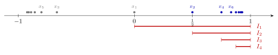

# 第 7 讲　闭区间的紧性 (Compactness of a closed interval)

第 5 讲的 $\sin\frac1x$ 在 $0$ 处没有极限。第 6 讲发现，在每个 $[a,1]$（$a>0$）上，把它算到指定的精度有一个对整个区间都够用的要求，而在 $(0,1]$ 上没有。同样，$\frac1x$ 在 $[a,1]$ 上有界，在 $(0,1]$ 上无界；函数 $x$ 在 $[0,1]$ 上取到最大值，在 $[0,1)$ 上取不到。

三件事是同一个原因。第 6 讲证明有界和最值的两次搜索，样子完全相同：去找一个特别的地方（函数无界的地方，函数值接近上确界的地方）；搜到一点 $c$；在 $c$ 处用连续性，得出结论。一致连续又是把最值定理用在 $\rho$ 上得到的。在闭区间 $[a,b]$ 上，搜到的 $c$ 就在区间里。在 $(0,1]$ 上，搜到的是 $0$，它不在区间里，在那里谈不上连续；在 $[0,+\infty)$ 上根本无从搜起。

可见有界、取到最大值、一致连续这三条定理依赖的是 $[a,b]$ 本身的一条性质，与具体的函数无关。第 2 讲第 3.4 节问过它的一个侧面：一串收缩的闭区间理应捞到一个点。第 6 讲的命题 6.1 说在实数里对半留下的区间确实如此；本讲把这条性质单独拿出来。要回答：

1. 不提任何函数，这条性质怎么说？
2. 用它重新证明这三条定理，证明是什么样子？
3. 除了闭区间，还有哪些数集有这条性质？零点定理为什么不在这三条之列？

需要的预备知识：第 6 讲的命题 6.1、定理 6.3、6.7、6.8、6.13 和引理 6.11；第 2 讲的命题 2.8（极限唯一）、引理 2.13（极限保持不等式）、命题 2.25（收敛的数列有界）、定理 2.26（极限的运算）、定理 2.28（夹逼定理）、命题 2.29；第 3 讲的上确界；函数在一点连续的两种说法。全讲中 $a<b$。

## 1 一串点聚到哪里

第 6 讲搜的都是与一个函数有关的点。现在手里没有函数，只有 $[a,b]$ 中的一串点 $x_1,x_2,x_3,\ldots$。这串点可以不收敛，例如
$$
x_n=(-1)^n\left(1-\frac1n\right):\qquad 0,\ \tfrac12,\ -\tfrac23,\ \tfrac34,\ -\tfrac45,\ \tfrac56,\ -\tfrac67,\ \tfrac78,\ \ldots
$$
在 $[-1,1]$ 中来回跳。但偶数项 $\frac12,\frac34,\frac56,\frac78,\ldots$ 趋于 $1$，奇数项趋于 $-1$。第 4 讲习题 4.4 里 $\cos$ 迭代的奇数项和偶数项也是这样各自单调地走。

问题是：$[a,b]$ 中任意一串点，是否总有一部分聚向某处？用二分法搜索去找聚集的地方。

把 $[a,b]$ 对半切。数列有无穷多项，所以至少有一半含有其中无穷多项（两半都只含有限多项的话，总共就只有有限多项）。留下这一半；两半都含无穷多项时留下右半。再对半切，再留下含无穷多项的一半。由命题 6.1，留下的区间 $I_1,I_2,\ldots$ 缩向一点 $c\in[a,b]$。

对上面的例子，留下的区间依次是 $[0,1],\left[\frac12,1\right],\left[\frac34,1\right],\left[\frac78,1\right],\ldots$，缩向 $1$（图 1）。

图 1：数列 $x_n=(-1)^n\left(1-\frac1n\right)$ 的前十四项，以及前四次留下的区间。

$c$ 的旁边聚着数列的无穷多项，但数列本身未必收敛于 $c$。要得到一个收敛于 $c$ 的数列，从留下的区间里依次挑项：从 $I_1$ 里挑一项 $x_{n_1}$；从 $I_2$ 里挑一项 $x_{n_2}$，要求 $n_2>n_1$；从 $I_3$ 里挑一项 $x_{n_3}$，要求 $n_3>n_2$。每次都挑得出来，因为每个 $I_k$ 含有无穷多项。例子中前四次可以依次挑出 $x_2=\frac12$，$x_4=\frac34$，$x_6=\frac56$，$x_8=\frac78$。第五次留下的区间是 $\left[\frac{15}{16},1\right]$，其中下标最小的项是 $x_{16}=\frac{15}{16}$，挑它。挑出的都是偶数项，但不是全部偶数项。

> [!IMPORTANT] 定义 7.1 — 子列 (Subsequence)
>
> 设 $(x_n)$ 是一个数列，$n_1<n_2<n_3<\cdots$ 是一串严格递增的正整数。数列 $x_{n_1},x_{n_2},x_{n_3},\ldots$ 称为 $(x_n)$ 的一个子列，记作 $(x_{n_k})$。

子列就是从原数列中按原来的先后次序挑出无穷多项。因为下标严格递增，$n_k\ge k$。偶数项、奇数项都是子列。

> [!NOTE] 定理 7.2 — 收敛子列 (Bolzano–Weierstrass)
>
> $[a,b]$ 中的任何数列都有一个子列收敛到 $[a,b]$ 中的点。

> [!NOTE] 证明
>
> 按上面的办法得到闭区间 $I_k$（每个含有数列的无穷多项，长度 $\frac{b-a}{2^k}$）、点 $c\in[a,b]$ 和子列 $(x_{n_k})$，$x_{n_k}\in I_k$。因为 $c$ 与 $x_{n_k}$ 都在 $I_k$ 中，$|x_{n_k}-c|\le\frac{b-a}{2^k}\to0$。所以 $x_{n_k}\to c$。

因为每个有界的数列都落在某个闭区间里，定理也可以说成：有界的数列必有收敛的子列。

> [!NOTE] 命题 7.3 — 收敛数列的子列
>
> 若 $x_n\to L$，则 $(x_n)$ 的每个子列都收敛于 $L$。

> [!NOTE] 证明
>
> 给定 $\varepsilon>0$，取 $N$ 使 $n\ge N$ 时 $|x_n-L|<\varepsilon$。当 $k\ge N$ 时 $n_k\ge k\ge N$，所以 $|x_{n_k}-L|<\varepsilon$。

由命题 7.3，一个数列若有两个子列收敛于不同的数，它就不收敛。上面的例子就是这样。

这与第 5 讲的做法是同一个。数列 $(x_n)$ 是 $n$ 的函数，子列 $(x_{n_k})$ 是把一串趋于 $+\infty$ 的下标 $n_1<n_2<\cdots$ 代进去。定义 5.1 要求沿每一串点函数值都趋于 $L$（这里对应的是第 5 讲第 7 节 $x\to+\infty$ 的情形），命题 7.3 说沿每一串下标数列的项都趋于 $L$；例 5.3 用两串点说明 $\sin\frac1x$ 没有极限，这里用两个子列说明数列不收敛。

定理 7.2 说的是有界的闭区间。两个条件都不能少：

- $x_n=n$ 无界，它的任何子列都无界，由命题 2.25 不收敛。
- $x_n=\frac1n$ 在 $(0,1]$ 中，由命题 7.3，它的每个子列都收敛于 $0$，而 $0$ 不在 $(0,1]$ 里。$\sin\frac1x$ 的零点 $\frac1{k\pi}$ 也是这样的一串点：它们聚向 $0$，而函数正是在那里坏掉的。

与第 6 讲证明有界和最值的搜索一样，“哪一半含有无穷多项”一般不是有限次计算能判断的。定理 7.2 只保证收敛的子列存在。

## 2 坏点聚到哪里

定理 7.2 就是开头所问的那条性质的一种说法：它只谈 $[a,b]$ 和其中的点，不提函数。现在用它重证第 6 讲的三条定理。三个证明的步骤相同：

1. 假设结论不成立，取一串越来越坏的点；
2. 由定理 7.2，取一个子列，它收敛到 $[a,b]$ 中的某个点 $c$；
3. 在 $c$ 处用连续性，得到矛盾。

设 $f$ 在 $[a,b]$ 上连续。

> [!NOTE] 定理 6.7 的第二个证明：有界
>
> 假设 $f$ 无界。则对每个 $n$，存在 $x_n\in[a,b]$ 使 $|f(x_n)|>n$。取子列 $x_{n_k}\to c\in[a,b]$。$f$ 在 $c$ 连续，所以 $f(x_{n_k})\to f(c)$；收敛的数列有界（命题 2.25）。但 $|f(x_{n_k})|>n_k\ge k$，无界。矛盾。

> [!NOTE] 定理 6.8 的第二个证明：取到最大值
>
> 刚才证明了 $f$ 有界，所以它的函数值有上确界 $M$。对每个 $n$，$M-\frac1n$ 不是上界，所以存在 $x_n\in[a,b]$ 使 $M-\frac1n<f(x_n)\le M$。取子列 $x_{n_k}\to c\in[a,b]$。一方面 $f(x_{n_k})\to f(c)$；另一方面 $M-\frac1{n_k}<f(x_{n_k})\le M$，由夹逼定理 $f(x_{n_k})\to M$。所以 $f(c)=M$。

这个证明不是反证：它直接取一串函数值趋于 $M$ 的点，聚集点就是最大值点。

> [!NOTE] 定理 6.13 的第二个证明：一致连续
>
> 假设 $f$ 不一致连续。则有某个 $\varepsilon>0$，任何 $\delta$ 对它都不管用。依次取 $\delta=\frac1n$：存在 $y_n,z_n\in[a,b]$，$|y_n-z_n|<\frac1n$，而 $|f(y_n)-f(z_n)|\ge\varepsilon$。
>
> 取 $(y_n)$ 的子列 $y_{n_k}\to c\in[a,b]$。因为 $|y_{n_k}-z_{n_k}|<\frac1{n_k}\to0$，也有 $z_{n_k}\to c$。$f$ 在 $c$ 连续，所以 $f(y_{n_k})\to f(c)$，$f(z_{n_k})\to f(c)$，从而 $f(y_{n_k})-f(z_{n_k})\to0$。这与 $|f(y_{n_k})-f(z_{n_k})|\ge\varepsilon$ 矛盾。

第 6 讲里，有界和最值各搜了一次，每次都要说明“至少有一半仍然是坏的”；一致连续还要先研究 $\rho$。现在搜索只做了一次，做在定理 7.2 的证明里；三条定理的证明各剩三四行，而且彼此相像。

## 3 紧集

上面三个证明对 $[a,b]$ 只用了定理 7.2 的结论，没有用到它是一个区间。所以有同样性质的数集上，三条定理照样成立。给这条性质一个名字。

> [!IMPORTANT] 定义 7.4 — 闭集与紧集 (Closed sets and compact sets)
>
> 设 $K$ 是一个由实数组成的集合。
>
> 1. 若 $K$ 中的数列只要收敛，极限就在 $K$ 中，则称 $K$ 是闭的。
> 2. 若 $K$ 中的任何数列都有一个子列收敛到 $K$ 中的点，则称 $K$ 是紧的。

$[a,b]$ 是闭的（引理 2.13），也是紧的（定理 7.2）。$(0,1]$ 不是闭的：$\frac1n\to0$。

> [!NOTE] 定理 7.5 — 实数的集合何时是紧的
>
> 实数的集合 $K$ 是紧的，当且仅当它有界并且是闭的。

> [!NOTE] 证明
>
> 设 $K$ 有界且闭，$K\subset[a,b]$。$K$ 中的数列也是 $[a,b]$ 中的数列，由定理 7.2，它有子列收敛到某个 $c$。这个子列在 $K$ 中，$K$ 是闭的，所以 $c\in K$。
>
> 反过来设 $K$ 是紧的。若 $K$ 无界，对每个 $n$ 取 $x_n\in K$ 使 $|x_n|>n$；它的任何子列都无界，不收敛，矛盾。若 $K$ 不是闭的，则有 $K$ 中的数列收敛于某个 $L\notin K$；由命题 7.3，它的每个子列都收敛于 $L$，没有一个收敛到 $K$ 中的点，矛盾。

定理 7.5 是识别实数的紧集的办法，不是紧的定义。紧的定义是定义 7.4 的第 2 条：其中的数列总有子列收敛到集合里面。“有界且闭”之所以够用，是因为定理 7.2，也就是因为实数是完备的。换一个范围它就不对了：只在有理数里看，$[1,2]$ 中的全体有理数是有界的，其中的数列若收敛于一个有理数，这个有理数仍在 $[1,2]$ 中；但第 1 讲的 $(a_n)$ 在其中，却没有子列收敛到有理数。

由定理 7.5，下面这些集合都是紧的：$[a,b]$；两个闭区间的并 $[0,1]\cup[2,3]$；有限个点；$\left\{0,1,\frac12,\frac13,\frac14,\ldots\right\}$。下面这些不是：$(0,1]$、$\left\{1,\frac12,\frac13,\ldots\right\}$（不闭）；$[0,+\infty)$、全体整数（无界）。

函数在数集 $K$ 上连续，仍指它在 $K$ 的每一点连续，数列都取在 $K$ 中。

> [!NOTE] 定理 7.6 — 紧集上的连续函数
>
> 设 $K$ 是非空的紧集，$f$ 在 $K$ 上连续。则
>
> 1. $f$ 在 $K$ 上有界；
> 2. $f$ 在 $K$ 上取到最大值和最小值；
> 3. $f$ 在 $K$ 上一致连续。

> [!NOTE] 证明
>
> 把第 2 节的三个证明中的 $[a,b]$ 换成 $K$，“由定理 7.2”换成“因为 $K$ 是紧的”。

第 6 讲的三条定理是定理 7.6 在 $K=[a,b]$ 时的情形。

零点定理不在定理 7.6 里，它也确实不是紧集的性质。

> [!NOTE] 例 7.7：紧集上的零点定理不成立
>
> 取 $K=[0,1]\cup[2,3]$，在 $[0,1]$ 上令 $f(x)=-1$，在 $[2,3]$ 上令 $f(x)=1$。$K$ 中收敛于 $x$ 的数列从某一项起与 $x$ 在同一段里，所以 $f$ 在 $K$ 上连续。$f(0)<0<f(3)$，但 $f$ 没有零点。
>
> 另一方面，零点定理在不紧的区间上照样可用：若 $f$ 在 $(0,+\infty)$ 上连续，$p<q$，$f(p)<0<f(q)$，对闭区间 $[p,q]$ 用定理 6.3 即可。

所以第 6 讲的定理分属两类。有界、最值、一致连续靠的是 $[a,b]$ 是紧的。零点定理、介值定理靠的是 $[a,b]$ 是一个区间，中间没有缺口；第 6 讲的求根搜索每次留下的一半仍是一个完整的区间，用的正是这一点。

## 4 有限覆盖定理

紧性还可以换一个角度来用。第 6 讲证一致连续时，每一点 $x$ 有一个窗口，在窗口里事情是清楚的；困难在于点有无穷多个，窗口的宽度未必有最小的。如果只用有限个窗口就能把 $[a,b]$ 盖住，困难就没有了：有限个正数里有最小的一个。

设 $I_1,I_2,I_3,\ldots$ 是一列开区间。如果 $[a,b]$ 中的每一点都至少属于其中一个，就说它们盖住 $[a,b]$。

> [!NOTE] 定理 7.8 — 有限覆盖定理 (Heine–Borel)
>
> 设开区间 $I_1,I_2,I_3,\ldots$ 盖住 $[a,b]$。则存在 $N$，使 $I_1,\ldots,I_N$ 已经盖住 $[a,b]$。

> [!NOTE] 证明
>
> 假设不然。则对每个 $n$，存在 $x_n\in[a,b]$ 不在 $I_1\cup\cdots\cup I_n$ 中。由定理 7.2，取子列 $x_{n_k}\to c\in[a,b]$。
>
> $c$ 属于某个 $I_m=(p,q)$。因为 $p<c<q$ 而 $x_{n_k}\to c$，当 $k$ 足够大时 $p<x_{n_k}<q$，即 $x_{n_k}\in I_m$。再让 $k\ge m$，则 $n_k\ge m$，而 $x_{n_k}$ 不在 $I_1\cup\cdots\cup I_{n_k}$ 中，其中包括 $I_m$。矛盾。

证明还是第 2 节的三步：没有被盖住的点是坏点；它们的聚集点 $c$ 自己被某个 $I_m$ 盖着，连同它旁边的一小段；聚向 $c$ 的点迟早落进这一小段。

定理 7.8 还可以不经过子列，用第 6 讲的二分法搜索直接证明。

> [!NOTE] 定理 7.8 的第二个证明：二分法搜索
>
> 称 $[a,b]$ 的一个闭子区间是盖得住的，如果 $I_1,I_2,\ldots$ 中的有限个就盖住了它。假设 $[a,b]$ 盖不住。
>
> 把 $[a,b]$ 对半切。若两半都盖得住，把盖住它们的两组区间合起来，仍是有限个，$[a,b]$ 就盖住了。所以至少有一半盖不住，留下它。这样得到一串闭区间 $J_1,J_2,\ldots$，每一个都盖不住。由命题 6.1，它们缩向一点 $c\in[a,b]$。
>
> $c$ 属于某个 $I_m=(p,q)$。取 $r>0$ 使 $(c-r,c+r)\subset(p,q)$。由命题 6.1 第 3 条，某个 $J_k$ 整个落在 $(c-r,c+r)$ 里，从而落在 $I_m$ 里：它被一个区间盖住了。矛盾。

两个证明并排着看：第一个取一串没有被盖住的点，看它们聚向哪里；第二个去搜盖不住的那一半。两个证明找到的是同一种点 $c$，最后一步都是“$c$ 自己被某个 $I_m$ 盖着，连同它旁边的一小段”。第 6 讲的二分法搜索与本讲的子列，是 $[a,b]$ 的同一条性质的两种用法。

第二个证明没有用到这些区间排成一列，所以定理对任意多个开区间同样成立（习题 7.10 给出另一个办法）。把“盖得住”换成“切有限次以后每一小段里函数值相差小于 $\varepsilon$”，同样的搜索稍加改动，就给出第 6 讲的推论 6.14。

证明对开区间只用了一条性质：区间里的每个点都带着它旁边的一小段。所以第一个证明照样给出一个更便于使用的形式。

> [!NOTE] 命题 7.9 — 有限覆盖定理的递增形式
>
> 设 $G_1\subset G_2\subset G_3\subset\cdots$ 是 $[a,b]$ 的一列子集，满足
>
> 1. $[a,b]$ 中每一点都属于某个 $G_n$；
> 2. 对 $G_n$ 中的每一点 $x$，存在 $r>0$，使 $[a,b]$ 中与 $x$ 相距小于 $r$ 的点都在 $G_n$ 中。
>
> 则存在 $N$ 使 $G_N=[a,b]$。

> [!NOTE] 证明
>
> 假设不然。对每个 $n$ 取 $x_n\in[a,b]$ 不在 $G_n$ 中，再取子列 $x_{n_k}\to c\in[a,b]$。$c$ 属于某个 $G_m$；由条件 2，$k$ 足够大时 $x_{n_k}\in G_m$。再让 $k\ge m$，则 $G_m\subset G_{n_k}$，所以 $x_{n_k}\in G_{n_k}$。矛盾。

取 $G_n=I_1\cup\cdots\cup I_n$（与 $[a,b]$ 的公共部分），命题 7.9 就回到定理 7.8；条件 2 说的是：$G_n$ 里的每个点都带着它旁边的一小段。

用命题 7.9 再证一遍那三条定理。这一次每个证明只需要说明 $G_n$ 是什么，以及条件 2 为什么成立。设 $f$ 在 $[a,b]$ 上连续。

- **有界。** 令 $G_n=\{x:\ |f(x)|<n\}$。每个 $x$ 属于某个 $G_n$。若 $|f(x)|<n$，由连续性，$x$ 旁边的点 $y$ 满足 $|f(y)-f(x)|<n-|f(x)|$，从而 $|f(y)|<n$。由命题 7.9，某个 $G_N=[a,b]$：$|f|<N$ 处处成立。
- **取到最大值。** 设 $M$ 是上确界，假设没有一点取到它。令 $G_n=\left\{x:\ f(x)<M-\frac1n\right\}$。每个 $x$ 满足 $f(x)<M$，所以属于某个 $G_n$；条件 2 同样由连续性得到。于是某个 $G_N=[a,b]$：$f<M-\frac1N$ 处处成立，与 $M$ 是最小的上界矛盾。
- **一致连续。** 固定 $\varepsilon$，令 $G_n=\left\{x:\ \rho(x)>\frac1n\right\}$，其中 $\rho$ 是第 6 讲的窗口半宽。每个 $x$ 属于某个 $G_n$，因为 $\rho(x)>0$；条件 2 来自引理 6.11 第 2 条：若 $\rho(x)>\frac1n$，与 $x$ 相距小于 $\rho(x)-\frac1n$ 的点 $x'$ 满足 $\rho(x')>\frac1n$。于是某个 $G_N=[a,b]$：$\rho>\frac1N$ 处处成立，取 $\delta=\frac1N$。

三个证明都是同一句话：一件事在每一点附近成立，并且成立的程度可以用 $n$ 来分级；闭区间上，某一级已经包括了所有的点。这就是从“每一点附近”到“整个区间上一致地”的过渡。

定理 7.8 对三个条件都有要求。

- **不闭。** $(0,1]$ 被开区间 $I_n=\left(\frac1n,2\right)$ 盖住，任何有限个都盖不住。没有被 $I_1,\ldots,I_n$ 盖住的点 $x_n=\frac1n$ 聚向 $0$，它不在 $(0,1]$ 里。
- **无界。** $[0,+\infty)$ 被开区间 $I_n=(n-2,n)$ 盖住，任何有限个都盖不住。没有被盖住的点 $x_n=n$ 没有收敛的子列。
- **只有有理数。** 考虑 $[1,2]$ 中的全体有理数，$(a_n)$ 是第 1 讲的数列，$\frac2{a_n}$ 从下方、$a_n$ 从上方趋于 $\sqrt2$。开区间 $\left(0,\frac2{a_n}\right)$ 与 $(a_n,3)$（$n=2,3,\ldots$）排成一列，盖住 $[1,2]$ 中的每个有理数。但任取其中有限个，设出现的最大下标是 $N$，它们漏掉 $\frac2{a_N}$ 与 $a_N$ 之间的有理数，例如 $a_{N+1}$。没有被盖住的点聚向 $\sqrt2$，它不是有理数。

这里只对排成一列的开区间陈述了定理。上面的第二个证明说明，对任意多个开区间它也成立；本课程用不到这一点。

## 回望

> [!NOTE] 本讲的结论
>
> - 子列：从数列中按原来的次序挑出无穷多项。收敛数列的每个子列收敛于同一个极限。
> - 收敛子列定理（定理 7.2）：$[a,b]$ 中的任何数列都有子列收敛到 $[a,b]$ 中的点。证明是一次二分法搜索，留下含有无穷多项的那一半。
> - 具有这条性质的数集称为紧集。对实数的集合，可以用“有界且闭”来识别它（定理 7.5）；这靠的是实数的完备性。
> - 紧集上的连续函数有界、取到最大值和最小值、一致连续（定理 7.6）。证明都是三步：取一串越来越坏的点，取收敛的子列，在聚集点用连续性。
> - 有限覆盖定理（定理 7.8、命题 7.9）由收敛子列定理推出：盖住 $[a,b]$ 的一列开区间里，有限个就够了。反过来由它也能推回收敛子列定理（习题 7.8 (d)）。
> - 零点定理与介值定理不是紧集的性质；它们靠的是区间中间没有缺口。

| | 第 6 讲 | 本讲 |
|---|---|---|
| 工具 | 二分法搜索；一致连续经由 $\rho$ 和最值定理 | 收敛子列定理，搜索只做一次 |
| 适用的范围 | 闭区间 $[a,b]$ | 任何紧集（定理 7.6） |
| 证明的样子 | 找坏事发生的那一半 | 坏点聚到哪里；或者：好的邻域有限个就够 |

本讲由二分法搜索得到收敛子列，由收敛子列得到有限覆盖；三者是同一件事的三种用法，都依赖实数的完备性。以后遇到“在每一点附近成立”的结论，要把它变成“在整个闭区间上一致地成立”，就用本讲的两条定理之一。

## 习题

习题 7.1–7.4 配合第 1 节，习题 7.5、7.6 配合第 2 节（7.6 (c) 用到第 4 节的命题 7.9），习题 7.7 配合第 3 节，习题 7.8–7.10 配合第 4 节。习题 7.4 和 7.10 是选做题。要算的数都只用四则运算、开平方和由它们得到的量（第 5 讲第 1 节）；这些运算本身可以交给计算器或 Python 去做。三角函数一律用弧度。可以使用 $3.14<\pi<3.15$。

1. **7.1** **Subsequence tests.**

    (a) Use Proposition 7.3 to show that $(-1)^n$ and $\cos\frac{n\pi}3$ do not converge: for each, name two subsequences and their limits.

    (b) Prove: if $x_{2k}\to L$ and $x_{2k-1}\to L$, then $x_n\to L$.

    (c) Prove: if the three subsequences $(x_{2k})$, $(x_{2k-1})$ and $(x_{3k})$ all converge, then $(x_n)$ converges. **Hint:** $(x_{6k})$ is a subsequence of two of them, and so is $(x_{6k-3})$.

<!-- 来源: 提纲 7.2；(b) 谢惠民 §2.2.4 练习题 1；(c) 谢惠民第二章 §2.7.3 第一组参考题 1；(d) 自拟 ; 已核对: 谢惠民第 25 页（xie-042.png）、第 55 页（xie-072.png） ; 与书的差异: 书上 (b) 是充分必要条件，这里只留充分性（必要性就是命题 7.3）；(c) 书上无提示，这里加了提示；(d) 的反例书上没有 -->

2. **7.2** **$\sin n$ 不收敛。** 记 $x_n=\sin n$。$\sin n$ 的值不容易算，但 $n$ 落在哪两个 $\pi$ 的倍数之间是容易算的。下表是 $\dfrac n\pi$，保留三位小数。

    | $n$ | 1 | 2 | 3 | 4 | 5 | 6 | 7 | 8 | 9 | 10 | 11 |
    |---|---|---|---|---|---|---|---|---|---|---|---|
    | $\dfrac n\pi$ | $0.318$ | $0.637$ | $0.955$ | $1.273$ | $1.592$ | $1.910$ | $2.228$ | $2.546$ | $2.865$ | $3.183$ | $3.501$ |

    | $n$ | 12 | 13 | 14 | 15 | 16 | 17 | 18 | 19 | 20 | 21 | 22 |
    |---|---|---|---|---|---|---|---|---|---|---|---|
    | $\dfrac n\pi$ | $3.820$ | $4.138$ | $4.456$ | $4.775$ | $5.093$ | $5.411$ | $5.730$ | $6.048$ | $6.366$ | $6.685$ | $7.003$ |

    例如 $\dfrac{11}\pi$ 很接近 $3.5$，所以 $\sin11$ 很接近 $-1$；$\dfrac{22}\pi$ 很接近 $7$，所以 $\sin22$ 很接近 $0$。

    (a) 对 $k=0,1,2,\ldots$，记 $A_k=\left[2k\pi+\frac\pi4,\ 2k\pi+\frac{3\pi}4\right]$，$B_k=[(2k+1)\pi,\ (2k+2)\pi]$。说明每个 $A_k$ 和每个 $B_k$ 中都至少有一个正整数。用表对 $k=0,1,2$ 列出 $A_k$ 和 $B_k$ 中的全部正整数。说明 $A_k$ 中的 $n$ 满足 $\sin n\ge\frac{\sqrt2}2$，$B_k$ 中的 $n$ 满足 $\sin n\le0$。

    (b) 在每个 $A_k$ 中取一个正整数 $n'_k$，在每个 $B_k$ 中取一个正整数 $n''_k$。说明 $(x_{n'_k})$ 与 $(x_{n''_k})$ 都是 $(x_n)$ 的子列。用命题 7.3 和引理 2.13 证明 $(x_n)$ 不收敛。

    (c) 不用子列再证一次：由 (a) 指出一个 $\varepsilon$，使得对每个 $N$ 都有 $m,k\ge N$ 满足 $|x_m-x_k|\ge\varepsilon$，从而 $(x_n)$ 不满足定义 2.12。

    (d) 第三个证明。假设 $\sin n\to a$，分三步导出矛盾。

    1. 由 $\sin(n+1)-\sin(n-1)=2\sin1\cos n$ 证明 $\cos n\to0$。这一步中哪里用了命题 7.3？
    2. 由 $\cos(n+1)-\cos(n-1)=-2\sin1\sin n$ 证明 $a=0$。
    3. 与 $\sin^2n+\cos^2n=1$ 比较，得到矛盾。

<!-- 来源: 谢惠民例题 2.2.7（证 1、证 2）、例题 3.4.3；(c) 是为定理 7.2 加的；(f) 自拟 ; 已核对: 谢惠民第 23 页（xie-040.png）、第 77 页（xie-094.png） ; 与书的差异: 书上没有 $\sin n$ 的任何数值；证 1 只引图 2.2，说“区间长度大于 1 因此一定存在一个正整数”，这里让学生写出理由并列出前几个整数；证 2 书上用 $\sin(n+1)-\sin(n-1)=2\sin1\cos n$，与这里相同；第三章第二组参考题 9（子列极限充满 $[-1,1]$）要用 $\pi$ 是无理数，没有用 -->

3. **7.3** **由下标的数字写成的数列。** 把正整数 $n$ 的十进制数字依次写在小数点后面，得到的数记作 $x_n$：$x_7=0.7$，$x_{13}=0.13$，$x_{4035}=0.4035$。也就是说，若 $n$ 有 $d$ 位数字，则 $x_n=\dfrac n{10^d}$。前 30 项是

    $$
    0.1,\ 0.2,\ \ldots,\ 0.9,\ 0.1,\ 0.11,\ 0.12,\ \ldots,\ 0.19,\ 0.2,\ 0.21,\ \ldots,\ 0.29,\ 0.3 .
    $$

    把 $[0,1)$ 等分成十段，前 $10^6$ 项落在各段里的项数是

    | 段 | $[0,0.1)$ | $[0.1,0.2)$ | $[0.2,0.3)$ | $\cdots$ | $[0.9,1)$ |
    |---|---|---|---|---|---|
    | 项数 | $0$ | $111112$ | $111111$ | $\cdots$ | $111111$ |

    (a) 证明 $0.1\le x_n<1$，并且 $x_{10n}=x_n$。$0.217$ 在数列中出现在哪些位置？

    (b) 用命题 7.3 证明 $(x_n)$ 不收敛。

    (c) 设 $0.1\le t<1$。令 $n_k$ 为不超过 $10^kt$ 的最大整数。证明 $n_k$ 恰有 $k$ 位数字，$n_1<n_2<\cdots$，并且 $0\le t-x_{n_k}<\dfrac1{10^k}$。所以 $x_{n_k}\to t$。对 $t=\frac13$、$t=\frac17$、$t=\sqrt2-1$ 写出 $n_1,\ldots,n_4$。

    (d) 证明：$(x_n)$ 的子列的极限恰好是 $[0.1,\,1]$ 中的全部数。（$t=1$ 时另取一个子列；小于 $0.1$ 或大于 $1$ 的数用引理 2.13 排除。）

<!-- 来源: 菲赫金哥尔茨 n° 40 的小字例（矿 F40.a） ; 已核对: 菲赫金哥尔茨第 86–87 页（f1-095.png, f1-096.png） ; 与书的差异: 书上只有 $x_{13}=0{,}13$、$x_{4035}=0{,}4035$ 和“$0{,}217$ 出现在第 217、2170、21700 位”三个数，结论是子列极限充满 $[0{,}1;\ 1]$；项数表、两条规则下的二分法搜索、用取整代替“无穷小数展开”的 (f) 都是自拟的。摘录索引的标题写成 $[0,1]$，与书不符 -->

4. **7.4** **（选做）单调的子列。** 数列 $(x_n)$ 的一项 $x_n$ 如果不小于它后面的每一项，即 $x_n\ge x_i$ 对所有 $i>n$ 成立，就称它为一个峰项。

    (a) 对下面四个数列，分别指出哪些项是峰项：$\dfrac1n$；$1-\dfrac1n$；$(-1)^n\left(1+\dfrac1n\right)$；$(-1)^n\left(1-\dfrac1n\right)$。

    (b) 证明：若 $(x_n)$ 有无穷多个峰项，则它们按下标的次序排成一个单调递减的子列。对 (a) 的第三个数列写出这个子列的前四项。

    (c) 证明：若 $(x_n)$ 只有有限多个峰项，则它有一个严格递增的子列。**提示：** 取 $n_1$ 大于所有峰项的下标。$x_{n_1}$ 不是峰项，所以后面有一项比它大，取作 $x_{n_2}$；$x_{n_2}$ 也不是峰项。对 (a) 的第四个数列，从 $n_1=1$ 起每次取下标最小的可用项，写出这个子列的前四项。

    (d) 由 (b)、(c)，每个数列都有单调的子列。由此用定理 2.23 和引理 2.13 证明定理 7.2。这个证明里实数的完备性是在哪一步用到的？第 1 节的证明呢？

<!-- 来源: 提纲 7.4；谢惠民例题 3.3.1 及其前后的说明 ; 已核对: 谢惠民第 73 页（xie-090.png） ; 与书的差异: 书上称“性质 (M)”，没有例子；证明分的两种情形与这里的 (b)、(c) 相同。书上说“这个结论与实数系无关”，(e) 把这句话变成一问。(a) 的四个数列和 (f) 的数值是自拟的 -->

5. **7.5** **坏点，以及一致连续的数列判别法。**

    (a) 取 $f(x)=\dfrac1x$，定义在 $(0,1]$ 上。对第 2 节中有界和一致连续的两个证明，各写出证明第 1 步里的那串坏点：一串 $x_n\in(0,1]$ 使 $|f(x_n)|>n$；两串 $y_n,z_n\in(0,1]$ 使 $|y_n-z_n|<\frac1n$ 而 $|f(y_n)-f(z_n)|\ge1$。说明它们的每个子列都收敛于 $0$，并指出两个证明各在哪一步失效。

    (b) 设 $f$ 定义在数集 $D$ 上。证明：$f$ 在 $D$ 上一致连续，当且仅当对 $D$ 中任意两个满足 $y_n-z_n\to0$ 的数列 $(y_n)$、$(z_n)$ 都有 $f(y_n)-f(z_n)\to0$。**提示：** “仅当”直接由定义 6.10 得到；“当”用反证，照抄定理 6.13 的第二个证明的第一段。

    (c) 用 (b) 说明下面两个函数不一致连续。先核对表中的数，再对一般的 $n$ 算出 $|y_n-z_n|$ 的公式和 $|f(y_n)-f(z_n)|$。

    | 函数与定义域 | $y_n$ | $z_n$ | $n=1$ 时 $\lvert y_n-z_n\rvert$ | $n=100$ 时 | $n=10^4$ 时 |
    |---|---|---|---|---|---|
    | $\sin\dfrac1x$，$\left(0,\frac2\pi\right]$ | $\dfrac2{(2n+1)\pi}$ | $\dfrac1{n\pi}$ | $0.106$ | $1.58\times10^{-5}$ | $1.59\times10^{-9}$ |
    | $\sin x^2$，全体实数 | $\sqrt{n\pi}$ | $\sqrt{n\pi+\frac\pi2}$ | $0.398$ | $0.0443$ | $0.00443$ |

    (d) 设 $f$ 在 $D$ 上一致连续，$(x_n)$ 是 $D$ 中的数列，并且是定义 2.12 意义下收敛的数列（它的极限不必在 $D$ 中）。证明 $(f(x_n))$ 也是收敛的数列。对 $(0,1]$ 上的 $\dfrac1x$ 取 $x_n=\dfrac1n$，对 $\sin\dfrac1x$ 取 $x_n=\dfrac2{n\pi}$，写出 $f(x_n)$ 的前六项，说明这又一次表明它们不一致连续。

<!-- 来源: 提纲 7.16、7.5；(a) 的两串点见谢惠民例题 5.4.3 (2)；(b) 谢惠民第五章第一组参考题 17；(c) 第一行是菲赫金哥尔茨 n° 86 的例，第二行是谢惠民例题 5.4.8；(g) 谢惠民第五章第一组参考题 18 的一半 ; 已核对: 菲赫金哥尔茨第 178–180 页（f1-187.png, f1-188.png, f1-189.png）；谢惠民第 138–139 页（xie-155.png, xie-156.png）、第 142 页（xie-159.png）、第 154 页（xie-171.png） ; 与书的差异: 菲赫金哥尔茨取 $x_0=\frac2{(2n+1)\pi}$、$x=\frac1{n\pi}$，给出 $|x-x_0|=\frac1{n(2n+1)\pi}$，没有数值；谢取 $x_1=\sqrt{n\pi}$、$x_2=\sqrt{n\pi+\frac\pi2}$，给出差的公式，没有数值。谢的例题 5.4.3 取 $x'=\frac1n$、$x''=\frac1{2n}$ 并要求 $n\ge2$，这里 $n\ge1$ 即可。参考题 18 是有界区间上的充分必要条件，这里只取必要性。(e)(f) 用的 $\rho$ 是本课程自己的工具，两本书都没有 -->

6. **7.6** **从每一点附近到整个区间。** 设 $f$ 是定义在 $[a,b]$ 上的函数，不假定连续。如果对点 $x$ 存在 $r>0$ 和 $M$，使 $[a,b]$ 中与 $x$ 相距小于 $r$ 的点 $t$ 都满足 $|f(t)|\le M$，就说 $f$ 在 $x$ 附近有界。

    (a) 在 $[0,1]$ 上令 $f(x)=\dfrac1x$（$0<x\le1$），$f(0)=0$。对 $x=\frac12$ 和 $x=\frac1{10}$ 各给出一组 $r$ 和 $M$。说明 $f$ 在 $0$ 附近不是有界的。

    (b) 证明：若 $f$ 在 $[a,b]$ 的每一点附近有界，则 $f$ 在 $[a,b]$ 上有界。用第 2 节的三步（取一串坏点；取收敛的子列；在聚集点处用条件）。

    (c) 用命题 7.9 再证一次 (b)：令 $G_n$ 为这样的点 $x$ 的全体：存在 $r>0$，使 $[a,b]$ 中与 $x$ 相距小于 $r$ 的点 $t$ 都满足 $|f(t)|\le n$。验证命题 7.9 的条件。

    (d) 由 (b)：$[a,b]$ 上无界的函数必在某一点的附近无界。对 (a) 的函数，这是哪一点？再看 $(0,1)$ 上的 $\dfrac1x$：它无界，却在 $(0,1)$ 的每一点附近有界。(b) 的证明用到这里，哪一步失效？

<!-- 来源: (a) 菲赫金哥尔茨 n° 84 开头的例；(b)(c)(d) 谢惠民例题 3.7.1（证 1、证 5）与第三章第一组参考题 3；(e)(f) 菲赫金哥尔茨 n° 89 的 1°（用博雷尔引理证零点定理），改写成用推论 6.9 和推论 6.14；提纲 7.6 的内容并入 (e) 第 1 步 ; 已核对: 菲赫金哥尔茨第 174–175 页（f1-183.png, f1-184.png）、第 182–185 页（f1-191.png 至 f1-194.png）；谢惠民第 93–95 页（xie-110.png, xie-111.png, xie-112.png） ; 与书的差异: 谢给了六个证明，没有例子；这里只取凝聚定理和覆盖定理的两个，覆盖的一个换成命题 7.9 的形式。菲赫金哥尔茨的证明是：每点取一个 $f$ 保持符号的邻域，取有限个，从 $a$ 出发沿着互相重叠的邻域一个接一个走到 $b$；这里把“有限个互相重叠的邻域”换成“有限段、相邻两段有公共端点”，这样只需要排成一列的情形。(f) 是为例 7.7 加的，书上没有 -->

7. **7.7** **紧集上的连续函数取到的值。** 设 $K$ 是非空的紧集，$f$ 在 $K$ 上连续，$f(K)$ 表示 $f$ 在 $K$ 上取到的值的全体。

    (a) 直接由定义 7.4 证明 $f(K)$ 是紧集。

    (b) 由 (a) 和定理 7.5，$f(K)$ 有界并且是闭的。由此再得到定理 7.6 的第 1、2 条。**提示：** 上确界 $M$ 是 $f(K)$ 中某个数列的极限。

    (c) 有没有 $[0,1]$ 上的连续函数取到每一个实数？

    (d) $(0,1)$ 不是紧集，上面的结论对它都可以不成立。令 $h(x)=\dfrac1{1-x}-\dfrac1x$。算出 $h\left(\frac1{100}\right)$ 和 $h\left(\frac{99}{100}\right)$；对正整数 $n\ge2$ 算出 $h\left(\frac1{n+1}\right)$ 和 $h\left(\frac n{n+1}\right)$；用推论 6.4 证明 $h$ 在 $(0,1)$ 上取到每一个实数。

<!-- 来源: 提纲 7.9、7.7；(d)(e)(f) 谢惠民 §5.3.3 练习题 3 ; 已核对: 谢惠民第 136 页（xie-153.png） ; 与书的差异: 书上只问“是否存在从 $(0,1)$、$[0,1]$、$(0,1]$ 映射到整个 $\mathbf R$ 的连续函数”，要求举例或证明，没有给函数；这里给出两个具体函数和数值。同页的例题 5.3.5 和练习题 4 没有用 -->

8. **7.8** **命题 7.9 的另外两个用处。**

    (a) 设闭区间 $[u_1,v_1]\supset[u_2,v_2]\supset[u_3,v_3]\supset\cdots$ 一个套一个，不假定长度趋于 $0$。用定理 7.2 证明它们有公共点：取 $x_n=u_n$，取收敛的子列，对固定的 $m$ 用引理 2.13。

    (b) 用命题 7.9 再证一次 (a)。假设没有公共点，令 $G_n$ 为 $[u_1,v_1]$ 中不属于 $[u_n,v_n]$ 的点的全体。验证命题 7.9 的条件，得到矛盾。

    (c) 设 $u_1<u_2<u_3<\cdots$，$v_1>v_2>v_3>\cdots$，并且 $u_n<v_n$。证明开区间 $(u_n,v_n)$ 有公共点。**提示：** $[u_{n+1},v_{n+1}]\subset(u_n,v_n)$。

    (d) 只用命题 7.9 推出定理 7.2。设 $(x_k)$ 是 $[a,b]$ 中的数列，假设它没有收敛的子列。

    1. 证明：对 $[a,b]$ 中的每一点 $x$，存在 $r>0$，使满足 $|x_k-x|<r$ 的下标 $k$ 只有有限多个。**提示：** 若不然，对 $r=1,\frac12,\frac13,\ldots$ 依次挑出下标递增的项，得到收敛于 $x$ 的子列。
    2. 令 $G_n$ 为这样的点 $x$ 的全体：存在 $r>0$，使 $|x_k-x|\ge r$ 对所有 $k\ge n$ 成立。验证命题 7.9 的条件。
    3. 于是某个 $G_N=[a,b]$。$x_N$ 属于不属于 $G_N$？

<!-- 来源: 提纲 7.11、7.13；(a) 的结论是菲赫金哥尔茨 n° 38 的区间套引理；(d) 谢惠民 §3.2.3 练习题 3，(c) 即练习题 2；(e) 谢惠民 §3.5.3 练习题 4 与 §3.3.3 练习题 1；(b) 即谢惠民 §3.5.3 练习题 3 ; 已核对: 菲赫金哥尔茨第 82–83 页（f1-091.png, f1-092.png）；谢惠民第 72 页（xie-089.png）、第 74 页（xie-091.png）、第 83 页（xie-100.png） ; 与书的差异: 菲赫金哥尔茨由“两个相向的单调数列”证明区间套引理，并且假定长度趋于 $0$；谢的练习只有一句话“用覆盖定理证明闭区间套定理”“用覆盖定理证明凝聚定理”，没有提示。这里的覆盖都换成命题 7.9 的递增形式，$G_n$ 的取法是自拟的 -->

9. **7.9** **盖得住与盖不住。**

    (a) 正文用 $I_n=\left(\frac1n,2\right)$ 盖住 $(0,1]$。另取 $J_n=\left(\dfrac1{2^n},\dfrac3{2^n}\right)$，$n=1,2,\ldots$：$\left(\frac12,\frac32\right),\ \left(\frac14,\frac34\right),\ \left(\frac18,\frac38\right),\ldots$。证明 $J_1,J_2,\ldots$ 也盖住 $(0,1]$，并且 $J_1\cup\cdots\cup J_N=\left(\dfrac1{2^N},\dfrac32\right)$。

    (b) 设 $0<\delta<1$。闭区间 $[\delta,1]$ 被这两列开区间盖住，由定理 7.8，各有一个最小的 $N$ 使前 $N$ 个已经盖住它。填表。

    | $\delta$ | $0.3$ | $0.01$ | $10^{-6}$ |
    |---|---|---|---|
    | $I_1,\ldots,I_N$ 盖住 $[\delta,1]$ 的最小的 $N$ | | | |
    | $J_1,\ldots,J_N$ 盖住 $[\delta,1]$ 的最小的 $N$ | | | |

    (c) $I_1,\ldots,I_N$ 中只留一个就够了，是哪一个？$J_1,\ldots,J_N$ 中一个也不能少：证明点 $1$ 只属于 $J_1$，点 $\dfrac1{2^n}$ 只属于 $J_{n+1}$，并说明对 (b) 中最小的 $N$，这些点都在 $[\delta,1]$ 里。

    (d) 由 (a) 和 (b) 说明：两列开区间中任何有限个都盖不住 $(0,1]$。各写出一串没有被前 $N$ 个盖住的点 $x_N$，它们聚向哪里？定理 7.8 的证明用到 $(0,1]$ 上，哪一步失效？

<!-- 来源: 提纲 7.14、7.15；(a) 的 $J_n$ 和 (f) 的闭区间是菲赫金哥尔茨 n° 88 末尾的两个例子；(e) 参看谢惠民 §3.5.3 练习题 1 与 §3.5.1 第 4 条 ; 已核对: 菲赫金哥尔茨第 182 页（f1-191.png）；谢惠民第 81 页（xie-098.png）、第 83 页（xie-100.png） ; 与书的差异: 菲赫金哥尔茨只列出两族区间并断言不能取出有限子族，没有证明，也没有数值；(b)(c) 的计数是自拟的。书上把 $[1,2]$ 写在最后，这里为了排成一列把它放在第一个。提纲 7.15 用的 $\left[\frac1{n+1},\frac1n\right]$ 与单点区间 $[0,0]$ 换成了书上的例子，避免退化的区间。谢的练习题 1 只要求对 $(0,1)$ 构造一个开覆盖 -->

10. **7.10** **（选做）任意多个开区间。** 定理 7.8 对排成一列的开区间陈述。现在设 $\mathcal F$ 是一族开区间，可以有任意多个，不必排成一列，$[a,b]$ 中每一点都至少属于其中一个。本题证明：$\mathcal F$ 中有限个开区间已经盖住 $[a,b]$。

    对 $x\in[a,b]$，考虑满足下面条件的 $r$：$0<r\le1$，并且开区间 $(x-r,x+r)$ 整个落在 $\mathcal F$ 的某一个区间里。记 $\lambda(x)$ 为这样的 $r$ 的上确界。

    (a) 证明 $\lambda(x)>0$，并且每个小于 $\lambda(x)$ 的正数 $r$ 都满足上面的条件。

    (b) 证明 $\lambda(x')\ge\lambda(x)-|x-x'|$。证明与引理 6.11 第 2 条相同；指出那里的“合格的窗口”在这里换成了什么。

    (c) 用第 2 节的三步（取一串坏点；取收敛的子列；在聚集点处用条件）证明：$\lambda$ 在 $[a,b]$ 上有正的下界 $m$。

    (d) 取正整数 $N$ 使 $h=\dfrac{b-a}N<m$，令 $t_i=a+ih$（$i=0,1,\ldots,N$）。对每个 $i$，$(t_i-h,t_i+h)$ 落在 $\mathcal F$ 的某个区间 $J_i$ 里。证明 $J_0,\ldots,J_N$ 盖住 $[a,b]$。

    (e) 证明：$[a,b]$ 中相距小于 $m$ 的任意两点属于 $\mathcal F$ 的同一个区间。

<!-- 来源: 提纲 7.12；结论是菲赫金哥尔茨 n° 88 的博雷尔引理、谢惠民 §3.5 的覆盖定理；(e) 是谢惠民例题 3.5.3（Lebesgue 数）；(g) 对应谢惠民例题 5.4.1 与菲赫金哥尔茨 n° 89 的 3° ; 已核对: 菲赫金哥尔茨第 181–182 页（f1-190.png, f1-191.png）、第 184–185 页（f1-193.png, f1-194.png）；谢惠民第 80–83 页（xie-097.png, xie-098.png, xie-100.png；第 82 页 xie-099.png 未重读，例题 3.5.3 的证明据摘录）、第 138 页（xie-155.png） ; 与书的差异: 菲赫金哥尔茨给两个证明：对半分“不能被有限个盖住”的一半；勒贝格的办法，取能被有限个盖住的 $[a,x^*]$ 的右端点的上确界。谢用勒贝格的办法，再由有限子覆盖的端点排序得到 Lebesgue 数。这里反过来：先用 $\lambda$ 和三步证明得到 Lebesgue 数 $m$，再等距取点得到有限个区间；$\lambda$ 与第 6 讲的 $\rho$ 是同一种量。(f) 的例子是自拟的 -->
