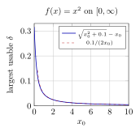
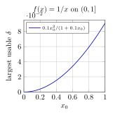
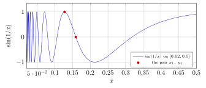
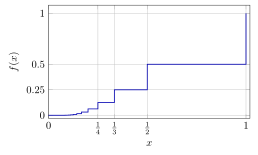
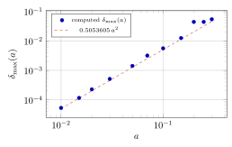

# 第 8 讲　连续函数 II：最值、一致连续、单调与反函数 — (Continuity II: extreme values, uniform continuity, monotone and inverse functions)

上一讲把连续 (continuity) 用在一个具体任务上：找零点。二分法 (bisection) 每一步只用到“函数在区间两端异号”，它不关心函数在区间内部有多剧烈。第 7 讲结束时留下两个问题：闭区间 (closed interval) 上的连续函数一定有界 (bounded) 吗？最大值一定被某个点取到吗？

有界性与最值的证明都用第 5 讲的 Bolzano–Weierstrass 定理：选取适当的点列，再取收敛子列，用连续性处理其函数值。闭区间保证子列的极限仍在定义域内。

接着固定 $\varepsilon$，计算 $x^2$、$1/x$ 与 $\sin(1/x)$ 在不同位置可用的 $\delta$。这些计算引出一致连续 (uniform continuity)：能否让同一个 $\delta$ 适用于整个定义域？最后研究单调函数与连续反函数，并定义实指数幂 $a^x$，处理欠条 \#4 的定义与连续性部分。三角函数均使用弧度 (radians)。

## 1 闭区间上：有界与取到最值 (Boundedness and extreme values)

先看反面。把定义域从闭区间换成开区间，或者换成无限长的区间，结论就会一条一条坏掉；坏掉的方式还不止一种。请在读下面的表之前先判断。

> [!WARNING] 先猜一猜 (Guess first)
>
>
> 下面四个函数在各自定义域上都连续 (continuous)。不要计算，先判断：哪些有界 (bounded)？哪些取到最大值 (attains its maximum)？
> $$
> \text{(a) } \tfrac1x \text{ on } (0,1);\quad
> \text{(b) } x \text{ on } (0,1);\quad
> \text{(c) } \tfrac1{1+x^2} \text{ on } [0,\infty);\quad
> \text{(d) } \sin x+\sin(\sqrt2\,x) \text{ on } [0,20].
> $$
> 对 (d) 再猜一个数：它的最大值是多少？$2$ 吗？
>

> [!NOTE] 词语提示
>
>
> *continuous*：连续的；*hypotheses*：假设；*candidate*：候选值；*unbounded*：无界的；*endpoint*：端点；*attained*：能取到的；*maximum*：最大值。
>

> [!NOTE] 词语提示
>
>
> *minimum*：最小值；*bounds*：上下界。
>

> [!NOTE] Example 8.1 — Three different ways to fail
>
>
> All four functions below are continuous on the set indicated.
>
> **(a) Unbounded.** $f(x)=1/x$ on $(0,1)$:
>
> |   $x$ | $0.1$ | $0.01$ |     $10^{-6}$ |
> |--------:|--------:|---------:|----------------:|
> | $1/x$ |  $10$ |  $100$ | $1\,000\,000$ |
>
> No number $M$ bounds $f$, since $x=1/(2M)$ already gives $f(x)=2M$. The domain is bounded but does not contain its endpoint $0$.
>
> **(b) Bounded, neither extreme attained.** $f(x)=x$ on $(0,1)$ satisfies $0<f(x)<1$, so $\sup f=1$ and $\inf f=0$; neither value is a value of $f$. Nothing is wrong with $f$ — the two candidate points are simply not in the domain.
>
> **(c) Maximum attained, minimum not.** $f(x)=1/(1+x^2)$ on $[0,\infty)$:
> $$
> f(0)=1,\quad f(1)=0.5,\quad f(10)=\tfrac1{101}=0.00990099,\quad f(100)=\tfrac1{10001}=0.000099990.
> $$
> The maximum $1$ is attained at $x=0$; $\inf f=0$ is not attained, because $f(x)>0$ everywhere. Here the domain is closed but unbounded.
>
> **(d) Both attained.** $[0,20]$ is closed and bounded, and the next example computes the extremes.
>
> **Reading.** Three failures, three different missing hypotheses: a missing endpoint, an unbounded domain, and (in (b)) both extremes lost at once. The theorem we are heading for must therefore ask for *closed and bounded*.
>

失败的三种方式提示了定理该怎么写。下面这条定理的证明不告诉你界是多少，只告诉你界存在。这是一个 indirect proof，它的代价和好处都要说清楚。

> [!NOTE] 定理 8.2 — 有界性定理 (Boundedness Theorem)
>
>
> 设 $a<b$，$f$ 在闭区间 (closed interval) $[a,b]$ 上连续 (continuous)。则 $f$ 在 $[a,b]$ 上有界 (bounded)：存在 $M$ 使 $|f(x)|\le M$ 对一切 $x\in[a,b]$ 成立。
>

> [!WARNING] 欠条 (IOU) — \#3 的一次使用：第 14 讲还
>
>
> 下面的证明调用第 5 讲的 Bolzano–Weierstrass 定理（有界数列必有收敛子列）。它的“越来越短的闭区间套住一个点”那一步是第 5 讲记下的欠条 \#3，第 14 讲还。本讲不产生新欠条。
>

> [!NOTE] 证明
>
>
> 反证。假设 $f$ 无界，则对每个正整数 $n$，$M=n$ 都不是界，于是存在 $x_n\in[a,b]$ 使
> $$
> |f(x_n)|\ge n .
> $$
> 这就是一列“坏点”。数列 $(x_n)$ 全部落在 $[a,b]$ 内，因此有界；由 Bolzano–Weierstrass 定理，存在子列 $x_{n_j}\to\xi$。因为 $a\le x_{n_j}\le b$，取极限保持不等号，所以 $\xi\in[a,b]$，于是 $f$ 在 $\xi$ 处有定义且连续。
>
> 用第 7 讲的连续性数列刻画 (sequential criterion for continuity)：
> $$
> \lim_{j\to\infty}f(x_{n_j})=f(\xi).
> $$
> 收敛数列必有界，所以 $(f(x_{n_j}))_j$ 有界。但由构造，$|f(x_{n_j})|\ge n_j\ge j$，当 $j$ 充分大时它超过任何给定的界。矛盾。
>

> [!NOTE] 注 8.3 — 闭区间的作用
>
>
> 有界性用于选取收敛子列；闭性保证子列的极限仍在区间内，因而可以使用该点的连续性。
>

有界还不够。“上确界存在”和“上确界被取到”是两件事。上面的 (b) 就是有界却取不到。下面把差距补上。

> [!NOTE] 定理 8.4 — 最值定理 (Extreme Value Theorem)
>
>
> 设 $a<b$，$f$ 在闭区间 (closed interval) $[a,b]$ 上连续 (continuous)。则存在 $\xi,\eta\in[a,b]$ 使
> $$
> f(\eta)\le f(x)\le f(\xi)\qquad\text{对一切 }x\in[a,b].
> $$
> 也就是说 $f$ 在 $[a,b]$ 上取到最大值 (attains its maximum) 与最小值 (attains its minimum)。
>

> [!WARNING] 欠条 (IOU) — 旧欠条 \#2、\#3 的使用：第 14 讲还
>
>
> 下面用到两件尚未证明的事：值域非空有上界时上确界 (supremum) 存在（第 3 讲的欠条 \#2），以及 Bolzano–Weierstrass（欠条 \#3）。两张都在第 14 讲一并偿还。
>

> [!NOTE] 证明
>
>
> 由有界性定理，值集 $E=\{f(x):x\in[a,b]\}$ 非空且有上界，故 $M=\sup E$ 是一个实数。目标是找到 $\xi$ 使 $f(\xi)=M$。
>
> 对每个正整数 $n$，$M-\tfrac1n<M$，而 $M$ 是*最小*的上界，所以 $M-\tfrac1n$ 不是上界：存在 $x_n\in[a,b]$ 使
> $$
> M-\frac1n<f(x_n)\le M .
> $$
> $(x_n)$ 在 $[a,b]$ 中有界，由 Bolzano–Weierstrass 取子列 $x_{n_j}\to\xi$，且 $\xi\in[a,b]$。由连续性 $f(x_{n_j})\to f(\xi)$。另一方面 $n_j\ge j$，故
> $$
> M-\frac1j\le M-\frac1{n_j}<f(x_{n_j})\le M .
> $$
> 两边夹，$f(x_{n_j})\to M$。极限唯一，所以 $f(\xi)=M$。
>
> 最小值：对 $-f$ 重复上述论证，$-f$ 在 $[a,b]$ 上连续，其最大值点即 $f$ 的最小值点 $\eta$。
>

把最值定理与第 7 讲的介值定理 (Intermediate Value Theorem) 合起来，闭区间的像就完全确定了。

> [!NOTE] 推论 8.5 — 闭区间的像仍是闭区间 (The image is a closed interval)
>
>
> 设 $f$ 在 $[a,b]$ 上连续，记 $m=\min_{[a,b]}f$，$M=\max_{[a,b]}f$。则 $f([a,b])=[m,M]$。
>

> [!NOTE] 证明
>
>
> 由最值定理，$m,M$ 是取到的值，且 $f([a,b])\subset[m,M]$。反之任取 $c\in(m,M)$，设 $f(\eta)=m$、$f(\xi)=M$，在以 $\eta,\xi$ 为端点的闭区间上用介值定理，得某点处 $f=c$。
>

最值定理保证最大值存在，但不指定取值点。下面用数值计算确定其位置。

> [!NOTE] 词语提示
>
>
> *comparison*：比较；*refinement*：加细分割；*rule out*：排除；*bounded*：有界的；*spike*：尖峰；*grid*：网格。
>

> [!NOTE] Example 8.6 — Hunting a maximum that no formula gives
>
>
> Let $g(x)=\sin x+\sin(\sqrt2\,x)$ on $[0,20]$. Since $g$ is continuous and $[0,20]$ is closed and bounded, the Extreme Value Theorem guarantees a maximum. Finding it is a separate, numerical job.
>
> A grid of $20\,000\,001$ equally spaced points on $[0,20]$ gives
> $$
> \max g\approx1.96964364 \ \text{ near } x\approx14.338865,\qquad
>  \min g\approx-1.87421159\ \text{ near } x\approx16.864765 .
> $$
> A golden-section refinement inside $[14.33,14.35]$ and $[16.85,16.88]$ sharpens these to
> $$
> g(14.33886491)=1.9696436426,\qquad g(16.86476295)=-1.8742115901 .
> $$
> For comparison, the endpoint values are $g(0)=0$ and $g(20)=0.9030080491$, so neither extreme sits at an endpoint.
>
> **Why the maximum is not $2$.** The value $2$ would need $\sin x=1$ and $\sin(\sqrt2\,x)=1$ at the same $x$, i.e.
> $$
> x=\tfrac{\pi}{2}+2k\pi\quad\text{and}\quad \sqrt2\,x=\tfrac{\pi}{2}+2m\pi
> $$
> for integers $k,m$. Dividing, $\sqrt2=(1+4m)/(1+4k)$, a rational number — impossible. So $g<2$ everywhere on $\mathbb{R}$, and the bound $2$ is approached but never reached.
>
> **Reading.** The theorem and the computation do different jobs. The theorem says “a maximiser exists in $[0,20]$”, which is what licenses the search to stop; the grid says “it is near $14.3389$”, which no theorem would have told us. A grid alone could never rule out a taller spike between two of its points.
>

本例的最大值点在区间内部，所以改用 $(0,20)$ 仍取到同一最大值；但开区间上的一般连续函数未必取到最大值。

## 2 How small must delta be?

$\varepsilon$-$\delta$ 定义的写法是：*给定* $x_0$ 和 $\varepsilon$，*再找* $\delta$。所以 $\delta$ 一开始就被允许依赖 $x_0$。它到底依不依赖？依赖到什么程度？这不是一个可以靠感觉回答的问题。下面固定 $\varepsilon=0.1$，对具体函数把“最大可用的 $\delta$”算出来。

> [!WARNING] 先猜一猜 (Guess first)
>
>
> 取 $f(x)=x^2$，$\varepsilon=0.1$。要保证
> $$
> x,y\ \text{在给定区间内},\quad |x-y|<\delta\ \Longrightarrow\ |x^2-y^2|<0.1,
> $$
> $\delta$ 最大能取多大？请对三个区间各写下一个数（或者写“不存在”）：$[0,1]$、$[0,10]$、$[0,\infty)$。写完再往下读。
>

> [!NOTE] 词语提示
>
>
> *pointwise*：逐点的；*identity*：恒等式；*factor*：因子；*gap*：两项之差的绝对值。
>

> [!NOTE] Example 8.7 — The $\delta(\varepsilon)$ table for $x^2$
>
>
> The key identity is $|x^2-y^2|=|x-y|\,(x+y)$ for $x,y\ge0$: the same gap $|x-y|$ is amplified by the factor $x+y$.
>
> **On $[0,M]$.** The worst pair is the one furthest to the right: $y=M$, $x=M-\delta$. It gives $M^2-(M-\delta)^2=\delta(2M-\delta)$, and requiring this to stay below $\varepsilon$ gives $\delta^2-2M\delta+\varepsilon>0$, i.e.
> $$
> \delta_{\max}(M)=M-\sqrt{M^2-\varepsilon}.
> $$
> Every other pair in $[0,M]$ has a smaller amplification factor, so this single $\delta$ works throughout. With $\varepsilon=0.1$:
>
> |   $M$ | $\delta_{\max}=M-\sqrt{M^2-0.1}$ | $\varepsilon/(2M)$ |
> |--------:|-----------------------------------:|---------------------:|
> |   $1$ |                   $0.0513167019$ |     $0.0500000000$ |
> |   $2$ |                   $0.0251582342$ |     $0.0250000000$ |
> |   $5$ |                   $0.0100100201$ |     $0.0100000000$ |
> |  $10$ |                   $0.0050012506$ |     $0.0050000000$ |
> | $100$ |                   $0.0005000013$ |     $0.0005000000$ |
>
> On $[0,10]$ the answer is $0.0050012506$, about twenty times smaller than $\varepsilon$ itself. A first guess of $0.1$ is wrong by a factor of $20$.
>
> **Pointwise.** Around a single point $x_0\in[0,\infty)$ the largest usable $\delta$ is the smaller of the two one-sided answers; the right-hand side is the binding one:
> $$
> \delta(x_0)=\sqrt{x_0^2+\varepsilon}-x_0=\frac{\varepsilon}{\sqrt{x_0^2+\varepsilon}+x_0}.
> $$
>
> | $x_0$ | $0$ | $0.5$ | $1$ | $2$ | $5$ | $10$ | $20$ |
> |---:|---:|---:|---:|---:|---:|---:|---:|
> | $\delta(x_0)$ | $0.3162278$ | $0.0916080$ | $0.0488088$ | $0.0248457$ | $0.0099900$ | $0.0049988$ | $0.0024998$ |
>
> **On $[0,\infty)$.** $\delta(x_0)\le\varepsilon/(2x_0)\to0$ as $x_0\to\infty$, so
> $$
> \inf_{x_0\ge0}\delta(x_0)=0 ,
> $$
> and *no* single positive $\delta$ serves every $x_0$. The answer to the third question is “does not exist”.
>

三个答案分别是 $0.0513167019$、$0.0050012506$、不存在。区间向右延长时，$x^2$ 的变化更快，相同输出误差要求更小的输入距离。

两图都取 $\varepsilon=0.1$。左图中可用半径随 $x_0\to\infty$ 以 $1/x_0$ 的量级减小；右图中随 $x_0\to0^+$ 以 $x_0^2$ 的量级减小。

> [!NOTE] 词语提示
>
>
> *infinite*：无穷的；*at most*：至多；*exact*：精确的。
>

> [!NOTE] Example 8.8 — The same function, two intervals: $1/x$
>
>
> Here $|1/x-1/y|=|x-y|/(xy)$: the gap is amplified by $1/(xy)$, which is dangerous when $x,y$ are *small*.
>
> **On $[1,\infty)$.** The amplification factor is at most $1$, so $\delta=\varepsilon$ always works. The exact largest $\delta$ comes from the worst pair $x=1$, $y=1+\delta$:
> $$
> \frac1{1}-\frac1{1+\delta}=\frac{\delta}{1+\delta}<\varepsilon
>  \quad\Longleftrightarrow\quad
>  \delta<\frac{\varepsilon}{1-\varepsilon}=\frac19=0.1111111111 .
> $$
> One $\delta$ serves the whole infinite interval.
>
> **On $[\eta,1]$ with $\eta>0$.** The worst pair is now $x=\eta$, $y=\eta+\delta$, giving $\delta/(\eta(\eta+\delta))<\varepsilon$, i.e.
> $$
> \delta_{\max}(\eta)=\frac{\varepsilon\,\eta^2}{1-\varepsilon\,\eta}.
> $$
>
> |  $\eta$ | $\delta_{\max}$ (exact) | (decimal)          |
> |----------:|:--------------------------|:-------------------|
> |   $0.5$ | $1/38$                  | $0.026315789$    |
> |   $0.1$ | $1/990$                 | $0.001010101$    |
> |  $0.01$ | $1/99900$               | $0.0000100100$   |
> | $0.001$ | $1/9999000$             | $0.000000100010$ |
>
> Each time $\eta$ shrinks by $10$, $\delta_{\max}$ shrinks by about $100$.
>
> **On $(0,1)$.** $\delta_{\max}(\eta)\to0$ as $\eta\to0$, so no single $\delta$ works.
>
> **Reading.** Compare with $x^2$. For $x^2$ the bad end is $x\to\infty$ and the domain $[0,1]$ is safe; for $1/x$ the bad end is $x\to0$ and the domain $[1,\infty)$ is safe. “Bad” is not a property of the interval’s length: $[1,\infty)$ is infinitely long and perfectly safe for $1/x$.
>

两张表的区别是：是否能找到一个对定义域内所有点都有效的 $\delta$。

## 3 一致连续 (Uniform continuity)

> [!IMPORTANT] 定义 8.9 — 一致连续 (Uniform continuity)
>
>
> 设 $X\subset\mathbb{R}$，$f:X\to\mathbb{R}$。若对每个 $\varepsilon>0$，*存在一个* $\delta>0$，使得
> $$
> x,y\in X,\ |x-y|<\delta\ \Longrightarrow\ |f(x)-f(y)|<\varepsilon ,
> $$
> 则称 $f$ 在 $X$ 上一致连续 (uniformly continuous)。
>

> [!NOTE] 注 8.10 — Pointwise versus uniform continuity
>
>
> 连续 (continuity) 的写法是“对每个 $\varepsilon$ 和每个 $x_0$，存在 $\delta$”。$\delta$ 可以在知道 $x_0$ 之后再挑。一致连续的写法是“对每个 $\varepsilon$，存在 $\delta$，对一切 $x,y$”。$\delta$ 必须在知道 $x,y$ 之前就交出来。量词的顺序是全部内容。由定义立刻可得：一致连续 $\Rightarrow$ 连续；反过来不成立，上一节的 $x^2$ 在 $[0,\infty)$ 上与 $1/x$ 在 $(0,1)$ 上就是反例。
>
> 还要注意一致连续是 $f$ 与 $X$ *两者共同*的性质，不是 $f$ 一个点一个点的性质：$1/x$ 在 $(0,1)$ 内的每一点都连续，却不在 $(0,1)$ 上一致连续。
>

要否定一致连续，直接写定义的否定太繁琐。像第 5 讲那样换成数列语言会方便得多：找两列越靠越近、函数值却始终分开的点。

> [!NOTE] 命题 8.11 — 否定的数列判据 (Sequential criterion for failure)
>
>
> $f$ 在 $X$ 上*不*一致连续 (uniformly continuous) if and only if 存在 $\varepsilon_0>0$ 与 $X$ 中的两列点 $(x_n)$、$(y_n)$，使
> $$
> \lim_{n\to\infty}(x_n-y_n)=0
>  \qquad\text{而}\qquad
>  |f(x_n)-f(y_n)|\ge\varepsilon_0\quad\text{对一切 }n .
> $$
>

> [!NOTE] 证明
>
>
> ($\Rightarrow$) 若不一致连续，则存在 $\varepsilon_0>0$ 使得*任何* $\delta>0$ 都失效。对 $\delta=1/n$ 用一次，得到 $x_n,y_n\in X$ 满足 $|x_n-y_n|<1/n$ 且 $|f(x_n)-f(y_n)|\ge\varepsilon_0$。由 $|x_n-y_n|<1/n$ 得 $x_n-y_n\to0$。
>
> ($\Leftarrow$) 若有这样两列点，设 $f$ 一致连续，对 $\varepsilon_0$ 取到 $\delta>0$。由 $x_n-y_n\to0$，for all sufficiently large $n$ 有 $|x_n-y_n|<\delta$，于是 $|f(x_n)-f(y_n)|<\varepsilon_0$，与假设冲突。
>

下面分别构造两列点，使自变量之差趋于零，而函数值之差不趋于零。

> [!NOTE] Example 8.12 — Four failures, four pairs of sequences
>
>
> In each case $x_n-y_n\to0$ while the values stay a fixed distance apart.
>
> **(i) $f(x)=x^2$ on $[0,\infty)$.** Take $x_n=\sqrt{n+1}$, $y_n=\sqrt n$. Then $f(x_n)-f(y_n)=1$ *exactly*, while
> $$
> x_n-y_n=\frac{1}{\sqrt{n}+\sqrt{n+1}} .
> $$
>
> |    $n$ |      $x_n-y_n$ | $f(x_n)-f(y_n)$ |
> |---------:|-----------------:|------------------:|
> |    $1$ | $0.4142135624$ |             $1$ |
> |   $10$ | $0.1543471302$ |             $1$ |
> |  $100$ | $0.0498756211$ |             $1$ |
> | $10^4$ | $0.0049998750$ |             $1$ |
>
> So $\varepsilon_0=1$ works (indeed any $\varepsilon_0\le1$).
>
> **(ii) $f(x)=1/x$ on $(0,1)$.** Take $x_n=1/n$, $y_n=1/(n+1)$. Again $|f(x_n)-f(y_n)|=1$ exactly, while $x_n-y_n=1/(n(n+1))$: the values $0.5$, $0.009090909$, $0.000099010$, $0.00000099900$ at $n=1,10,100,1000$.
>
> **(iii) $f(x)=\sin(1/x)$ on $(0,1]$ — bounded, still fails.** Take
> $$
> x_n=\frac1{2n\pi},\qquad y_n=\frac1{2n\pi+\pi/2},
> $$
> so $f(x_n)=\sin(2n\pi)=0$ and $f(y_n)=\sin(2n\pi+\pi/2)=1$: the values differ by exactly $1$ for every $n$.
>
> |    $n$ |           $x_n$ |           $y_n$ |        $x_n-y_n$ |
> |---------:|------------------:|------------------:|-------------------:|
> |    $1$ |  $0.1591549431$ |  $0.1273239545$ |   $0.0318309886$ |
> |   $10$ |  $0.0159154943$ |  $0.0155273115$ |   $0.0003881828$ |
> |  $100$ |  $0.0015915494$ |  $0.0015875805$ |   $0.0000039690$ |
> | $1000$ | $0.00015915494$ | $0.00015911516$ | $0.000000039779$ |
>
> Boundedness is no help: $|f|\le1$ throughout, yet the oscillations crowd together near $0$.
>
> **(iv) $f(x)=\sin(x^2)$ on $\mathbb{R}$ — bounded, unbounded interval.** Take $x_n=\sqrt{2n\pi+\pi/2}$ and $y_n=\sqrt{2n\pi}$, so $f(x_n)=1$, $f(y_n)=0$. The gaps are
> $$
> \begin{gathered}
>  n=1:\ 0.2958673336,\qquad n=10:\ 0.0984715346,\\
>  n=100:\ 0.0313132948,\qquad n=1000:\ 0.0099076991 .
> \end{gathered}
> $$
> Here the graph is squeezed horizontally as $|x|$ grows, and the squeezing is what breaks uniformity.
>
> **Reading.** Two mechanisms, one symptom. In (i) and (iv) the trouble is at infinity; in (ii) and (iii) it is at a missing endpoint. In every case the sequences stay inside the domain and the limit point of $(x_n)$ — $\infty$ in (i), (iv); $0$ in (ii), (iii) — is *not* in it.
>

例 (iii) 的函数有界，但在 $0$ 附近仍能找到距离任意小、函数值相差 $1$ 的点。

图中两个红点是上例 (iii) 中 $n=1$ 的一对：横向相距 $0.0318309886$，纵向相距 $1$。请往左看：同样的一对在 $n=1000$ 时横向只相距 $3.98\times10^{-8}$，纵向仍然相距 $1$。曲线在 $[0.02,0.5]$ 上用了 $6001$ 个采样点，左端的密集处仍然画不准。这本身就是本例的内容。

> [!NOTE] 词语提示
>
>
> *continuity*：连续性；*uniformly*：一致地；*bound*：界；估计。
>

> [!IMPORTANT] Exercise 8.13 — Uniform continuity forces boundedness on a bounded set
>
>
> Let $I$ be a bounded interval and suppose $f$ is uniformly continuous on $I$. Take $\varepsilon=1$ and its $\delta$; cut $I$ into finitely many pieces of length less than $\delta$ and bound $f$ piece by piece. Conclude that $f$ is bounded on $I$. Then say in one line why this gives a second, instant proof that $1/x$ is not uniformly continuous on $(0,1)$ — and why the same argument says nothing about $\sin(1/x)$ on $(0,1]$.
>

这个练习指出两件事：一致连续在有界区间上蕴含有界；但有界远不足以保证一致连续，$\sin(1/x)$ 就是那道分界线上的例子。

## 4 Cantor 定理与 Lipschitz 条件 (Cantor’s theorem and the Lipschitz condition)

上一节的四个反例，定义域全都不是闭区间（或者不有界）。这不是巧合。

> [!WARNING] 先猜一猜 (Guess first)
>
>
> $[0,10]$ 上的 $x^2$：$\delta$ 存在（$0.0050012506$）。$(0,1]$ 上的 $\sin(1/x)$：$\delta$ 不存在。两者都连续，差别只在定义域的*一端*。请先说出这一端起了什么作用，再猜：闭区间 $[a,b]$ 上的连续函数是不是一定一致连续？
>

> [!NOTE] 定理 8.14 — Cantor 定理 (Cantor's theorem)
>
>
> 设 $a<b$，$f$ 在闭区间 (closed interval) $[a,b]$ 上连续 (continuous)。则 $f$ 在 $[a,b]$ 上一致连续 (uniformly continuous)。
>

> [!WARNING] 欠条 (IOU) — \#3 的又一次使用：第 14 讲还
>
>
> 本证明第三次调用第 5 讲的 Bolzano–Weierstrass 定理，沿用欠条 \#3，第 14 讲还。本讲不产生新欠条。
>

> [!NOTE] 证明
>
>
> 反证，按本讲的配方走。
>
> \(1\) 设 $f$ 不一致连续。由上一节的数列判据，存在 $\varepsilon_0>0$ 使得对每个 $\delta>0$ 都能在 $[a,b]$ 中找到一对点，相距小于 $\delta$ 而函数值相差不小于 $\varepsilon_0$。
>
> \(2\) 对 $\delta=1/n$ 用一次，得到 $x_n,y_n\in[a,b]$：
> $$
> |x_n-y_n|<\frac1n,\qquad |f(x_n)-f(y_n)|\ge\varepsilon_0 .
> $$
>
> \(3\) $(x_n)$ 在 $[a,b]$ 中有界，由 Bolzano–Weierstrass 取子列 $x_{n_j}\to\xi$；由 $a\le x_{n_j}\le b$ 得 $\xi\in[a,b]$。这里用到区间是闭的：极限点没有跑出定义域。再看 $y$ 的同号子列，
> $$
> |y_{n_j}-\xi|\le|y_{n_j}-x_{n_j}|+|x_{n_j}-\xi|<\frac1{n_j}+|x_{n_j}-\xi|\longrightarrow0 ,
> $$
> 所以 $y_{n_j}\to\xi$ 也成立。两列被同一个点吸住。
>
> \(4\) $f$ 在 $\xi$ 连续，用数列刻画两次：
> $$
> f(x_{n_j})\to f(\xi),\qquad f(y_{n_j})\to f(\xi).
> $$
>
> \(5\) 于是 $f(x_{n_j})-f(y_{n_j})\to0$。但由构造它的绝对值始终 $\ge\varepsilon_0>0$。矛盾。
>

> [!NOTE] 注 8.15
>
>
> 有界性、最值与一致连续性的证明都使用了收敛子列，并在其极限点应用连续性。所选点列分别对应无界的函数值、趋近上确界的函数值，以及违背一致连续性的两列点。
>

Cantor 定理保证某个统一半径存在。对具体函数，还可直接估计这个半径。

> [!NOTE] 词语提示
>
>
> *uniform*：一致的。
>

> [!NOTE] Example 8.16 — Cantor's theorem, checked against an exact $\delta$
>
>
> Take $f(x)=x^2$ on $[0,10]$ and $\varepsilon=0.1$. Cantor’s theorem promises some $\delta>0$; the computation of §2 produces the best one,
> $$
> \delta_{\max}=10-\sqrt{99.9}=0.0050012506 .
> $$
> A scan over $2\,000\,001$ base points $x\in[0,10]$, each paired with $y=\min(10,\,x+0.999999\,\delta_{\max})$, gives
> $$
> \max|x^2-y^2|=0.0999998625<0.1 ,
> $$
> and the extremal pair $(9.99499875,\,10)$ gives exactly $|x^2-y^2|=0.1$, confirming that no larger $\delta$ is available.
>
> **Reading.** The theorem is what tells you the search for a uniform $\delta$ is not hopeless. Notice what happens if the interval is enlarged: on $[0,100]$ the same $\varepsilon$ forces $\delta=0.0005000013$, ten times smaller. Cantor’s theorem is not uniform in the interval — only in the point.
>

有没有更省事的办法拿到 $\delta$？有：如果函数的“斜率”本身有界，$\delta$ 可以一行写出来。

> [!IMPORTANT] 定义 8.17 — Lipschitz 条件 (Lipschitz condition)
>
>
> 设 $f$ 定义在 $X\subset\mathbb{R}$ 上。若存在常数 $L>0$ 使
> $$
> |f(x)-f(y)|\le L\,|x-y|\qquad\text{对一切 }x,y\in X ,
> $$
> 则称 $f$ 在 $X$ 上满足 Lipschitz 条件 (Lipschitz condition)，$L$ 称为一个 Lipschitz 常数 (Lipschitz constant)。
>

> [!NOTE] 命题 8.18 — Lipschitz $\Rightarrow$ 一致连续
>
>
> 若 $f$ 在 $X$ 上满足 Lipschitz 条件，常数为 $L$，则 $f$ 在 $X$ 上一致连续 (uniformly continuous)，且对每个 $\varepsilon>0$，$\delta=\varepsilon/L$ 可用。
>

> [!NOTE] 证明
>
>
> $|x-y|<\varepsilon/L$ 时 $|f(x)-f(y)|\le L|x-y|<\varepsilon$。这个 $\delta$ 与 $x,y$ 完全无关。
>

> [!NOTE] 词语提示
>
>
> *strictly*：严格地；*optimal*：最优的；*linear*：线性的；*ratio*：比值。
>

> [!NOTE] Example 8.19 — Three Lipschitz verdicts, with numbers
>
>
> **(a) $\sin$ on $\mathbb{R}$: Lipschitz with $L=1$.** Lecture 7 established $|\sin x-\sin y|\le|x-y|$. Hence $\delta=\varepsilon$; for $\varepsilon=0.1$, $\delta=0.1$. One line, no computation.
>
> **(b) $x^2$ on $[0,10]$: Lipschitz with $L=20$.** Since $|x^2-y^2|=|x-y|(x+y)\le20|x-y|$ there, the cheap bound gives $\delta=\varepsilon/20=0.005$. The exact optimum computed above is $0.0050012506$. The cheap bound is smaller by a factor $0.99975$, i.e. it loses $0.025\%$ — for this purpose it is as good as exact.
>
> **(c) $\sqrt{\,\cdot\,}$ on $[0,1]$: uniformly continuous but *not* Lipschitz.** For $0\le y\le x$,
> $$
> (\sqrt x-\sqrt y)^2=x+y-2\sqrt{xy}\le x-y
>  \quad\text{(because }2\sqrt{xy}\ge2y\text{)},
> $$
> so $|\sqrt x-\sqrt y|\le\sqrt{|x-y|}$ and $\delta=\varepsilon^2$ works: for $\varepsilon=0.1$, $\delta=0.01$. This $\delta$ is optimal: the pair $(0,0.01)$ gives difference exactly $0.1$, and $(0,0.0101)$ already gives $0.10049876>0.1$. But no Lipschitz constant exists, since the ratio at the pair $(0,h)$ is
>
> |                       $h$ | $0.25$ | $0.01$ | $10^{-4}$ | $10^{-6}$ |
> |----------------------------:|---------:|---------:|------------:|------------:|
> | $(\sqrt h-0)/h=1/\sqrt h$ |    $2$ |   $10$ |     $100$ |    $1000$ |
>
> which blows up as $h\to0$.
>
> **Reading.** $\delta=\varepsilon/L$ is linear in $\varepsilon$; $\delta=\varepsilon^2$ is much worse for small $\varepsilon$ (halving $\varepsilon$ quarters $\delta$). Uniform continuity does not care — it only asks that *some* $\delta$ exist. So Lipschitz is strictly stronger than uniform continuity, and the gap between them is exactly the case of unbounded steepness, as at $x=0$ for $\sqrt x$.
>

Lipschitz 连续蕴含一致连续，一致连续蕴含连续；一般情形下逆命题均不成立。Cantor 定理保证闭区间上的连续函数一致连续。

## 5 单调函数：间断只能是跳跃 (Monotone functions: only jumps)

下面改用单调性假设，先研究单侧极限与间断点。

> [!WARNING] 先猜一猜 (Guess first)
>
>
> 先画一个 $[0,1]$ 上单调增的函数，试着让它在 $x=1/2$ 处“像 $\sin(1/x)$ 那样”振荡着间断。画不出来的话，说出是哪一条阻止了你。再猜：一个单调增函数在 $[0,1]$ 上最多能有多少个间断点。有限个？可数个？还是可以每一点都间断？
>

> [!IMPORTANT] 定义 8.20 — 单调 (Monotone)
>
>
> 设 $I$ 是区间，$f:I\to\mathbb{R}$。若 $x<y\Rightarrow f(x)\le f(y)$，称 $f$ 单调增 (monotone increasing)；若 $x<y\Rightarrow f(x)<f(y)$，称 $f$ 严格单调增 (strictly monotone increasing)。把不等号反过来即得单调减 (monotone decreasing) 与严格单调减 (strictly monotone decreasing)。
>

> [!NOTE] 定理 8.21 — 单调函数的单侧极限 (One-sided limits of a monotone function)
>
>
> 设 $f$ 在区间 $I$ 上单调增 (monotone increasing)，$x_0$ 是 $I$ 的内点。则左极限与右极限
> $$
> f(x_0^-)=\sup_{x\in I,\;x<x_0}f(x),
>  \qquad
>  f(x_0^+)=\inf_{x\in I,\;x>x_0}f(x)
> $$
> 都存在且是有限实数，并且 $f(x_0^-)\le f(x_0)\le f(x_0^+)$。
>

> [!WARNING] 欠条 (IOU) — 旧欠条 \#2 的使用：第 14 讲还
>
>
> 下面用到确界存在性 (existence of suprema)。第 3 讲的欠条 \#2，第 14 讲还。
>

> [!NOTE] 证明
>
>
> 只证左极限。集合 $E=\{f(x):x\in I,\ x<x_0\}$ 非空，且由单调性被 $f(x_0)$ 从上方界住，故 $A=\sup E$ 存在且 $A\le f(x_0)$。给定 $\varepsilon>0$，$A-\varepsilon$ 不是 $E$ 的上界，于是存在 $x_1<x_0$ 使 $f(x_1)>A-\varepsilon$。取 $\delta=x_0-x_1>0$；当 $x_0-\delta<x<x_0$ 时，由单调性
> $$
> A-\varepsilon<f(x_1)\le f(x)\le A ,
> $$
> 即 $|f(x)-A|<\varepsilon$。这正是 $f(x_0^-)=A$。右极限同理，用下确界。
>

> [!NOTE] 推论 8.22 — 单调函数只有跳跃间断 (Only jump discontinuities)
>
>
> 单调函数在区间内点处若不连续，则必有 $f(x_0^-)<f(x_0^+)$，即该点是跳跃间断点 (jump discontinuity)。振荡型间断（如 $\sin(1/x)$ 在 $0$ 处）不可能发生。
>

> [!NOTE] 证明
>
>
> 两个单侧极限都存在。若 $f(x_0^-)=f(x_0^+)$，则由 $f(x_0^-)\le f(x_0)\le f(x_0^+)$ 得三者相等，$f$ 在 $x_0$ 连续。故不连续时只能 $f(x_0^-)<f(x_0^+)$。
>

间断点能有多少个？每个间断点 $x_0$ 对应一个非空开区间 $(f(x_0^-),f(x_0^+))$，由单调性这些区间两两不交，而每个里面都塞得下一个有理数 (rational number)，不同区间取到的有理数互不相同，所以间断点至多可数 (at most countable)。可数性理论本课不展开，这一句记住即可。

> [!NOTE] 词语提示
>
>
> *discontinuity*：间断；*monotonicity*：单调性；*monotone*：单调的；*indices*：下标；*jump*：跳跃。
>

> [!NOTE] Example 8.23 — A monotone function with infinitely many jumps
>
>
> Define $f:[0,1]\to\mathbb{R}$ by
> $$
> f(x)=\sum_{k\ge1,\ 1/k\le x}2^{-k}.
> $$
> It is increasing, because enlarging $x$ can only add terms. On the interval $[\tfrac1{k+1},\tfrac1k)$ exactly the indices $\ge k+1$ contribute, so $f$ is constant there with value $\sum_{j\ge k+1}2^{-j}=2^{-k}$. Hence $f$ jumps at each point $1/k$, by exactly $2^{-k}$:
>
> |       jump point |   $1$ |  $1/2$ |   $1/3$ |    $1/4$ |
> |-----------------:|--------:|---------:|----------:|-----------:|
> |  value just left | $0.5$ | $0.25$ | $0.125$ | $0.0625$ |
> | value just right |   $1$ |  $0.5$ |  $0.25$ |  $0.125$ |
> |     size of jump | $0.5$ | $0.25$ | $0.125$ | $0.0625$ |
>
> Sample values: $f(0)=0$, $f(0.2)=0.0625$, $f(0.24)=0.0625$, $f(0.25)=0.125$, $f(0.3)=0.125$, $f(0.5)=0.5$, $f(0.9)=0.5$, $f(1)=1$.
>
> There are infinitely many discontinuities, they accumulate at $0$, and the total of all jumps is $\sum_k 2^{-k}=1$. At $x=0$ itself $f$ is continuous: for $x<1/K$ we have $f(x)\le2^{-K+1}$, which tends to $0=f(0)$.
>
> **Reading.** Infinitely many discontinuities cost nothing; what monotonicity forbids is a discontinuity of a *different kind*. Compare with $\sin(1/x)$, which has one discontinuity at $0$ and no one-sided limit there at all.
>

图是上例的函数（画到 $k\le24$ 为止，再小的台阶高度已在 $6\times10^{-8}$ 以下）。竖直线段只是为了连图，并不属于函数图像。请看 $x\to0^+$ 的一端：台阶数无穷多，高度总和却只有 $1$。

## 6 反函数的连续性与 $a^x$ (Continuous inverses and the definition of $a^x$)

严格单调保证函数是单射，因而有反函数；反函数会不会把连续性弄丢？先用一个没有求根公式的例子把问题变具体。

> [!WARNING] 先猜一猜 (Guess first)
>
>
> $f(x)=x^3+x$ 在 $[0,2]$ 上严格增，$f(0)=0$，$f(2)=10$。先猜 $x^3+x=5$ 的解大约是多少（猜一位小数即可）。再猜：把右边从 $5$ 改成 $5.1$，解会移动多少。比 $0.1$ 大还是小？
>

> [!NOTE] 定理 8.24 — 连续反函数定理 (Continuous inverse theorem)
>
>
> 设 $I$ 是区间，$f:I\to\mathbb{R}$ 连续 (continuous) 且严格单调增 (strictly monotone increasing)。则 $J=f(I)$ 是区间，$f:I\to J$ 是双射 (bijection)，且反函数 (inverse function) $f^{-1}:J\to I$ 也连续且严格单调增。
>

> [!NOTE] 证明
>
>
> 严格单调蕴含单射，故 $f:I\to J$ 是双射。$J$ 是区间：任取 $f(u)<c<f(v)$，由第 7 讲的介值定理 (Intermediate Value Theorem)，在 $u,v$ 之间存在 $w$ 使 $f(w)=c$，故 $c\in J$。
>
> $f^{-1}$ 严格增：若 $y_1<y_2$ 而 $f^{-1}(y_1)\ge f^{-1}(y_2)$，对 $f$ 用单调性得 $y_1\ge y_2$，矛盾。
>
> $f^{-1}$ 连续：设 $y_0\in J$，$x_0=f^{-1}(y_0)$，给定 $\varepsilon>0$。先设 $x_0$ 是 $I$ 的内点，且 $\varepsilon$ 已缩小到使 $x_0\pm\varepsilon\in I$。令
> $$
> \delta=\min\bigl(f(x_0+\varepsilon)-y_0,\ y_0-f(x_0-\varepsilon)\bigr).
> $$
> 由严格单调性两项都为正，故 $\delta>0$。当 $y\in J$ 且 $|y-y_0|<\delta$ 时，
> $$
> f(x_0-\varepsilon)<y<f(x_0+\varepsilon),
> $$
> 对 $f^{-1}$ 用单调性即得 $x_0-\varepsilon<f^{-1}(y)<x_0+\varepsilon$，即 $|f^{-1}(y)-x_0|<\varepsilon$。若 $x_0$ 是 $I$ 的端点，则上式只保留存在的那一侧，$\delta$ 取该侧的那一项，论证不变。
>

> [!NOTE] 词语提示
>
>
> *intermediate*：中间的；*bisection*：二分法；*estimate*：估计；*inverse*：反函数；逆。
>

> [!NOTE] Example 8.25 — An inverse with no formula
>
>
> $f(x)=x^3+x$ is strictly increasing on $[0,2]$ (if $x<y$ then $y^3-x^3>0$ and $y-x>0$), continuous, with $f(0)=0$ and $f(2)=10$. So $f^{-1}:[0,10]\to[0,2]$ exists and is continuous. Bisection to $50$ digits of bracketing gives
> $$
> f^{-1}(1)=0.6823278038,\quad
>  f^{-1}(5)=1.5159802277,\quad
>  f^{-1}(9)=1.9201751213 .
> $$
> Now perturb the input:
> $$
> f^{-1}(5.1)-f^{-1}(5)=0.0125755490,\qquad
>  f^{-1}(5.01)-f^{-1}(5)=0.0012657673 .
> $$
> Dividing by the change in the input gives $0.12575549$ and $0.12657673$: the solution moves about $1/8$ as fast as the right-hand side. The two ratios agree to two digits, and they will keep stabilising — that stable ratio is the subject of Lecture 9.
>
> **Reading.** There is no usable closed form for $f^{-1}$ here, and none is needed: the theorem delivers continuity from monotonicity plus the Intermediate Value Theorem, and bisection delivers the digits. Also note the direction of the estimate: continuity of $f^{-1}$ is exactly the statement that a small change in the *value* forces a small change in the *solution* — which is what makes solving $f(x)=y$ numerically a sane activity at all.
>

现在可以还第 7 讲欠条 \#4 的前一半了。第 7 讲里 $a^x$ 只对有理指数 (rational exponent) 有定义；单调性正是把它延拓到全体实数的工具。

> [!IMPORTANT] 定义 8.26 — 实指数幂 (Real exponent)
>
>
> 设 $a>1$，$x\in\mathbb{R}$。定义
> $$
> a^x:=\sup\{a^r:\ r\in\mathbb{Q},\ r\le x\}.
> $$
> 这个集合非空，且被任一有理数 $s>x$ 对应的 $a^s$ 从上方界住（因为有理指数幂在 $\mathbb{Q}$ 上单调增，这是第 7 讲已有的），故上确界是实数，定义 well-defined。当 $x$ 本身是有理数时新旧定义一致。对 $0<a<1$ 令 $a^x:=(1/a)^{-x}$；$1^x:=1$。
>

> [!WARNING] 欠条 (IOU) — 欠条 \#4 的前一半在此偿还
>
>
> 第 7 讲欠下的是“实指数幂 $a^x$ 的定义与连续性”。本讲给出定义（有理逼近 + 单调）并证明连续性，这一半还清。剩下的一半。上确界为什么一定存在（欠条 \#2），以及朴素小数意义下的 $\mathbb{R}$ 是否真的支持这个定义。仍然挂账，第 14 讲把 $\mathbb{R}$ 定义为 $\mathbb{Q}$ 的完备化 (completion) 之后一并偿还。
>

> [!NOTE] 命题 8.27 — $a^x$ 的单调性与连续性
>
>
> 设 $a>1$。则 $x\mapsto a^x$ 在 $\mathbb{R}$ 上严格单调增 (strictly monotone increasing) 且连续 (continuous)，其值域是 $(0,\infty)$。因此由连续反函数定理，对数函数 $\log_a$ 在 $(0,\infty)$ 上连续且严格增。
>

> [!NOTE] 证明
>
>
> 单调：$x<y$ 时取有理数 $r,s$ 使 $x<r<s<y$，则 $a^x\le a^r<a^s\le a^y$。
>
> 连续：第 2 讲已算出 $a^{1/n}\to1$。给定 $x_0$ 与 $\varepsilon>0$，取正整数 $n$ 使
> $$
> a^{1/n}-1<\frac{\varepsilon}{a^{x_0}}\qquad\text{且}\qquad 1-a^{-1/n}<\frac{\varepsilon}{a^{x_0}} .
> $$
> （第二式由第一式推出，因为 $1-a^{-1/n}=(a^{1/n}-1)/a^{1/n}<a^{1/n}-1$。）当 $|x-x_0|<1/n$ 时，由单调性
> $$
> a^{x_0}a^{-1/n}<a^x<a^{x_0}a^{1/n},
> $$
> 两边减 $a^{x_0}$ 得 $|a^x-a^{x_0}|<a^{x_0}\max(a^{1/n}-1,\,1-a^{-1/n})<\varepsilon$。
>
> 值域：$a^n\to\infty$ 与 $a^{-n}\to0$ 给出任意大与任意小的值，再用介值定理。
>

> [!NOTE] 推论 8.28
>
>
> $\ln$、$\arcsin$、$\arccos$、$\arctan$ 以及 $x\mapsto x^{1/n}$ 都在各自定义域上连续。
>

> [!NOTE] 证明
>
>
> 它们分别是 $e^x$（在 $\mathbb{R}$ 上）、$\sin$（在 $[-\pi/2,\pi/2]$ 上）、$\cos$（在 $[0,\pi]$ 上）、$\tan$（在 $(-\pi/2,\pi/2)$ 上）、$x^n$（在 $[0,\infty)$ 上）的反函数，每个原函数在所列区间上连续且严格单调，用连续反函数定理即可。
>

> [!NOTE] 词语提示
>
>
> *truncation*：截断；*derivative*：导数；*brackets*：夹住目标的区间；*supremum*：上确界；*width*：宽度。
>

> [!NOTE] Example 8.29 — Computing $2^{\sqrt2}$ from rational exponents
>
>
> The definition says: squeeze $\sqrt2=1.41421356\ldots$ between decimal truncations and read off $2^{p/q}$ at both ends. Each row uses $r=$ the truncation and $s=r+10^{-k}$, both rational, and monotonicity gives $2^{r}\le2^{\sqrt2}\le2^{s}$.
>
> | $r$ | $2^{r}$ | $2^{s}$ | $2^{s}-2^{r}$ |
> |:---|:---|:---|:---|
> | $1$ | $2.000000000000$ | $4.000000000000$ | $2.0$ |
> | $7/5$ | $2.639015821546$ | $2.828427124746$ | $1.894\times10^{-1}$ |
> | $141/100$ | $2.657371628193$ | $2.675855109572$ | $1.848\times10^{-2}$ |
> | $707/500$ | $2.664749650184$ | $2.666597354182$ | $1.848\times10^{-3}$ |
> | $7071/5000$ | $2.665119088532$ | $2.665303826913$ | $1.847\times10^{-4}$ |
> | $141421/100000$ | $2.665137561794$ | $2.665156035184$ | $1.847\times10^{-5}$ |
> | $1414213/1000000$ | $2.665143103798$ | $2.665144951135$ | $1.847\times10^{-6}$ |
>
> The true value is $2^{\sqrt2}=2.665144142690$, inside every bracket. The bracket width falls by a factor $10$ per row after the first two — one new correct digit per new decimal of $\sqrt2$ — and from the third row on the width is $1.85\times10^{-k}$, settling at $1.847\times10^{-k}$.
>
> **Reading.** Two separate things happen here. The *definition* needed only monotonicity and a supremum; the *computation* shows the brackets actually closing, which is what makes the definition usable. Note also that the bracket width shrinks at a constant rate: $1.847337$ is $2^{\sqrt2}\ln2=1.8473371483$, a first sighting of the derivative of $2^x$ at $x=\sqrt2$.
>

表中相邻两行的函数值之差与自变量之差的比约为 $1.847$。第 9 讲将研究这类差商的极限。

## 7 An AI experiment on uniform continuity

$\sin(1/x)$ 在 $(0,1]$ 上不一致连续；但在每个 $[a,1]$（$a>0$）上，由 Cantor 定理它一致连续。那么最大可用的 $\delta$ 随 $a\to0$ 怎样趋于零？是像 $a$ 那样线性地趋零，还是更快？先猜一个幂次，再让机器算。

> [!NOTE] 词语提示
>
>
> *oscillation*：振荡；*benchmarks*：核对用的参考结果；*predict*：预测；*verify*：核实；*axes*：坐标轴。
>

> [!NOTE] AI Lab — How fast does $\delta$ die as the interval reaches toward $0$?
>
>
> Fix $\varepsilon=0.5$ and $f(x)=\sin(1/x)$. For $0<a<1$ define
> $$
> \delta_{\max}(a)=\min\bigl\{\,|x-y|\ :\ x,y\in[a,1],\ |f(x)-f(y)|\ge0.5\,\bigr\},
> $$
> the largest usable $\delta$ on $[a,1]$. Ask an AI to compute $\delta_{\max}(a)$ for $a=0.3,0.25,0.2,0.15,0.1,0.07,0.05,0.03,0.02,0.015,0.01$, to plot $\delta_{\max}$ against $a$ on log–log axes, and to tabulate the ratio $\delta_{\max}(a)/a^2$.
>
> **Before running it:** predict the exponent $p$ in $\delta_{\max}(a)\approx C\,a^{p}$. Predict whether the ratio $\delta_{\max}(a)/a^{p}$ settles to a single constant or keeps wobbling. Predict what happens for $a=0.5$.
>
> **Implementation requirement.** Do not search over pairs $(x,y)$ directly on a grid — the minimum sits in a region where the graph oscillates faster than any reasonable grid. Substitute $u=1/x$, so $u$ ranges over $[1,1/a]$ and $|x-y|=1/u-1/v$. For each $u$, the smallest $t>0$ with $|\sin(u+t)-\sin u|\ge0.5$ is found in closed form from $\arcsin(\sin u\pm0.5)$; then minimise $1/u-1/(u+t)$ over $u$ with $u+t\le1/a$. A skeleton:
>
>     import math
>     def smallest_t(u, U, eps=0.5):
>         su, ts = math.sin(u), []
>         for target in (su+eps, su-eps):
>             if -1.0 <= target <= 1.0:
>                 b = math.asin(target)
>                 for cand in (b, math.pi-b):
>                     m = math.ceil((u-cand)/(2*math.pi))
>                     for mm in (m-1, m, m+1):
>                         t = cand + 2*math.pi*mm - u
>                         if t > 1e-14 and u+t <= U: ts.append(t)
>         return min(ts) if ts else None
>
> Then scan $u$ on a fine grid and refine around the best $u$.
>
> **Benchmarks from an actual run** (grid of $600\,001$ values of $u$, then six refinement passes):
>
> |    $a$ | $\delta_{\max}(a)$ | $\delta_{\max}(a)/a^2$ |
> |---------:|:---------------------|-------------------------:|
> |  $0.3$ | $0.053732252$      |              $0.59703$ |
> | $0.25$ | $0.043838855$      |              $0.70142$ |
> |  $0.2$ | $0.043838855$      |              $1.09597$ |
> | $0.15$ | $0.012416710$      |              $0.55185$ |
> |  $0.1$ | $0.0055727731$     |              $0.55728$ |
> | $0.05$ | $0.0014148235$     |              $0.56593$ |
> | $0.03$ | $0.00051105859$    |              $0.56784$ |
> | $0.02$ | $0.00022737840$    |              $0.56845$ |
> | $0.01$ | $0.000053271079$   |              $0.53271$ |
>
> An independent brute-force check at $a=0.1$, sliding a window over $1\,600\,001$ grid points of $[0.1,1]$, returns a minimum gap of $0.00557325$, against the closed-form answer $0.0055727731$.
>
> **Answer from the output.** (1) What is $p$? (2) The rows $a=0.25$ and $a=0.2$ give the *same* $\delta_{\max}$; explain why enlarging the interval can leave the answer unchanged, and what that says about where the minimising pair sits. (3) The ratio stays near $0.55$ but does not converge to a single value. Show that the steepest possible passage of $\sin$ through a change of $0.5$ takes $2\arcsin(0.25)=0.5053605$ in $u$, so $\delta\approx0.5053605\,a^2$ *when* such a passage happens to sit at the very end of the $u$-range; then explain the wobble, and the outlier at $a=0.2$. (4) For $a=0.5$ every $\delta$ works. Verify numerically that the oscillation of $\sin(1/x)$ on $[0.5,1]$ is $0.15852902<0.5$, and state the general principle this illustrates.
>

双对数坐标下数据点几乎落在一条直线上，斜率是 $2$：$\delta$ 按 $a^2$ 趋于零，比 $a$ 快得多。请注意 $a=0.2$ 那个点明显偏离虚线。这不是计算错误，是因为最优的那一对点并不总能落在区间的最左端。

## 8 Exercises

> [!NOTE] 词语提示
>
>
> *hypothesis*：假设；*extremum*：极值；*reverse*：反向；*exhibit*：给出具体例子；*deduce*：推出。
>

1. **8.1**  $\bigstar$ **(homework)** *Guess, then compute, then prove.* Let $f(x)=x^3$ and $\varepsilon=0.1$. Write down your guess for the largest $\delta$ that works on $[0,2]$ *before* computing anything. Then find the exact largest $\delta$ by locating the worst pair, and compute it to six decimals. Compare with the cheap Lipschitz bound $\varepsilon/L$ with $L=12$ on $[0,2]$, and say by what percentage the cheap bound loses. Finally decide, with a pair of sequences, whether $f$ is uniformly continuous on $[0,\infty)$.

1. **8.2**  $\bigstar$ *Decide by eye first.* For each of the following, first write down a one-word verdict (yes/no) from the shape of the graph alone, then prove it:
    $$
    \text{(a) }\sqrt x\ \text{on }[0,\infty);\quad
     \text{(b) }x\sin\tfrac1x\ \text{on }(0,1];\quad
     \text{(c) }\sin\tfrac1x\ \text{on }[1,\infty);\quad
     \text{(d) }\frac{x}{1+x^2}\ \text{on }\mathbb{R} .
    $$
    For each “no”, exhibit the two sequences; for each “yes”, exhibit a $\delta(\varepsilon)$. Record which of your four eye-verdicts was wrong — that is the point of the exercise.

1. **8.3**  $\bigstar$ *Estimate the size before computing.* Let $f(x)=1/x$ on $[0.05,1]$ with $\varepsilon=0.01$. Without computing, say whether the largest $\delta$ is nearer $10^{-2}$, $10^{-4}$ or $10^{-6}$. Then derive the exact formula for $\delta_{\max}(\eta,\varepsilon)$ on $[\eta,1]$ and evaluate it. By what factor does $\delta_{\max}$ change if $\eta$ is halved? If $\varepsilon$ is halved? Explain why the two answers are different.

1. **8.4**  $\bigstar$$\bigstar$ **(homework)** *Hunting an extremum.* Let $g(x)=\sin(3x)+\cos(\sqrt5\,x)$ on $[0,15]$. (a) Guess $\max g$ to one decimal. (b) Explain in one sentence why the Extreme Value Theorem applies and what exactly it licenses you to do. (c) Compute $\max g$ and $\min g$ on a grid of $10^5$ points, then refine to eight decimals; report the maximising point. (d) Prove that $\max g<2$ using only the irrationality of $\sqrt5$. (e) State what changes if the domain is replaced by $(0,15)$, and what changes if it is replaced by $[0,\infty)$.

1. **8.5**  $\bigstar$$\bigstar$ *Two failures with the same shape.* Show that $f(x)=x^{3/2}$ is not uniformly continuous on $[0,\infty)$, and that $g(x)=\tan x$ is not uniformly continuous on $(-\pi/2,\pi/2)$, by exhibiting the two sequences in each case. Then answer: one of these functions is bounded on bounded subintervals and the other is not — does that distinction play any role in the argument? Say precisely which hypothesis of Cantor’s theorem each example violates.

1. **8.6**  $\bigstar$$\bigstar$ *Where Lipschitz stops.* (a) Tabulate the best Lipschitz constant of $\sqrt x$ on $[h,1]$ for $h=10^{-2}$, $10^{-4}$ and $10^{-6}$, and identify the power of $h$ that governs it. (b) Decide whether $x^{1/3}$ is Lipschitz on $[0,1]$; if not, find an explicit $\delta(\varepsilon)$ making it uniformly continuous, and compute $\delta$ for $\varepsilon=0.1$ and $\varepsilon=0.01$. (c) A function satisfies $|f(x)-f(y)|\le C|x-y|^{\alpha}$ on $[0,1]$ with $0<\alpha\le1$. Find $\delta(\varepsilon)$, and say how badly $\delta$ degrades as $\alpha\to0$ by computing it for $\alpha=1$, $\alpha=\tfrac12$ and $\alpha=\tfrac15$ (take $C=1$ and $\varepsilon=0.01$).

1. **8.7**  $\bigstar$$\bigstar$ **(homework)** *Designing a jump pattern.* Build an increasing $f:[0,1]\to\mathbb{R}$ whose jumps sit exactly at the points $1/2,1/3,1/4,\dots$ with the jump at $1/k$ equal to $3^{-k}$. (a) Compute $f(0.3)$, $f(0.7)$ and $f(1)$ exactly as fractions. (b) Is $f$ continuous at $0$? At $1$? (c) Guess before computing: what is $\sup f-\inf f$? (d) Explain in one sentence why *any* monotone function’s jump points can be listed one after another, and give an example of a monotone function on $[0,1]$ that is continuous nowhere — or explain why none exists.

1. **8.8**  $\bigstar$$\bigstar$ *An inverse you can bound.* Let $f(x)=x+\tfrac12\sin x$ on $\mathbb{R}$. (a) Using only $|\sin y-\sin x|\le|y-x|$, prove $f(y)-f(x)\ge\tfrac12(y-x)$ for $y>x$, hence $f$ is strictly increasing; deduce that $f^{-1}$ exists on $\mathbb{R}$, is continuous, and is Lipschitz with constant $2$. (b) Guess $f^{-1}(3)$ to one decimal, then compute it to six decimals by bisection. (c) Compute $f^{-1}(3.1)-f^{-1}(3)$ and check it against the Lipschitz bound. (d) Is $f$ itself Lipschitz? With what constant?

1. **8.9**  $\bigstar$$\bigstar$$\bigstar$ *Where the boundary really runs.* (a) Give a continuous function on $[0,\infty)$ that is unbounded yet uniformly continuous, and one that is bounded yet not uniformly continuous; so neither property implies the other. (b) Prove that a uniformly continuous $f$ on $\mathbb{R}$ satisfies $|f(x)|\le A+B|x|$ for some constants $A,B$ — take the $\delta$ belonging to $\varepsilon=1$ and walk from $0$ to $x$ in steps shorter than $\delta$. (c) Use (b) to re-derive that $x^2$ is not uniformly continuous on $\mathbb{R}$, and explain why the same argument fails to settle $\sin(x^2)$.

1. **8.10** $\bigstar$$\bigstar$$\bigstar$ *Reverse-engineer the recipe.* The three main proofs of this lecture share one five-step pattern. (a) Write the pattern out in your own words, marking the single step where the closedness of $[a,b]$ is used and the single step where boundedness is used. (b) Use the pattern to prove: if $f$ is continuous on $[a,b]$ and $f(x)>0$ for every $x$, then $\inf_{[a,b]}f>0$. (c) Find the exact step at which your proof breaks for $f(x)=x$ on $(0,1)$, and produce the number that shows the conclusion is genuinely false there. (d) Does the conclusion in (b) survive on $[0,\infty)$? Decide with an example, not with an argument.

> [!NOTE] 回望 (Looking back)
>
>
> 闭区间上的连续函数取到最值且一致连续，证明用到了收敛子列。连续的严格单调函数有连续反函数；实指数幂的定义与连续性也已说明，构造背景仍待第 14 讲。下一讲研究差商的极限。
>
