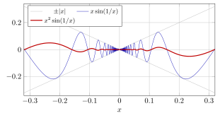
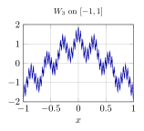
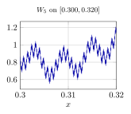
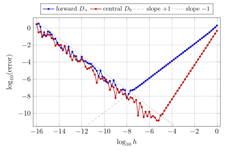
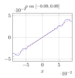
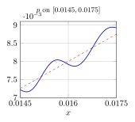

# 第 9 讲　导数与微分：线性逼近 — (The derivative as linear approximation)

第 8 讲结束时留下的问题是：连续 (continuity) 只保证“$x$ 靠近 $x_0$ 时 $f(x)$ 靠近 $f(x_0)$”，却不说靠得*多快*、也不说靠近的方式。本讲要补上这个量。

在 $x_0$ 附近，用直线 $f(x_0)+Ah$ 近似 $f(x_0+h)$。本讲依次研究斜率 $A$ 是否存在、怎样求出它，以及近似误差比 $h$ 小多少。具体函数的误差表还会提示二阶项，为第 10 讲的 Taylor 公式提供例子。

最后反过来用差商 (difference quotient) 近似导数，比较截断误差与舍入误差，检验减小步长 $h$ 是否总能提高精度。三角函数均使用弧度 (radians)，浮点实验使用 IEEE 双精度 (double precision)。

## 从差商到导数 (From difference quotients to the derivative)

导数有两个古老的来源：曲线的切线斜率，和运动的瞬时速度 (instantaneous velocity)。两者是同一个计算：都先取一段有限的区间，算出一个平均量，再让区间收缩。先算，再定义。

> [!WARNING] 先猜一猜 (Guess first) — 两张表，一个数
>
>
> 自由落体下落 $s(t)=4.9t^2$ 米（$t$ 秒）。先猜：$t=2$ 秒时的瞬时速度是多少米每秒？再猜：$f(x)=\sqrt x$ 在 $x=4$ 处的切线斜率是多少？两个问题都先给一个数，再往下读。
>

> [!NOTE] 词语提示
>
>
> *cancellation*：相消；*denominator*：分母；*derivative*：导数；*rounding*：四舍五入；*rounded*：四舍五入后的；*tangent*：切线；*factor*：因子。
>

> [!NOTE] 词语提示
>
>
> *exact*：精确的；*slope*：斜率。
>

> [!NOTE] Example 9.1 — Two shrinking-interval tables
>
>
> **(a) Average speed.** For $s(t)=4.9t^2$ the average speed over $[2,2+h]$ is
> $$
> \frac{s(2+h)-s(2)}{h}=\frac{4.9\bigl((2+h)^2-4\bigr)}{h}=\frac{4.9(4h+h^2)}{h}=19.6+4.9h .
> $$
> The algebra is exact, so the table needs no rounding at all:
>
> |         $h$ |    $1$ |   $0.5$ |   $0.1$ |   $0.001$ |
> |--------------:|---------:|----------:|----------:|------------:|
> | average speed | $24.5$ | $22.05$ | $20.09$ | $19.6049$ |
>
> The excess over $19.6$ is exactly $4.9h$: it is proportional to $h$, so it can be made as small as we please. The limit is $19.6$.
>
> **(b) Average slope.** For $f(x)=\sqrt x$ the average slope over $[4,4+h]$ is $\bigl(\sqrt{4+h}-2\bigr)/h$. Here no cancellation is visible at first sight, so compute (values rounded to $10$ decimals):
>
> |     $h$ |    average slope | (average slope) $-\,0.25$ |
> |----------:|-----------------:|----------------------------:|
> |     $1$ | $0.2360679775$ |     $-1.393\times10^{-2}$ |
> |   $0.5$ | $0.2426406871$ |     $-7.359\times10^{-3}$ |
> |   $0.1$ | $0.2484567313$ |     $-1.543\times10^{-3}$ |
> |  $0.01$ | $0.2498439450$ |     $-1.561\times10^{-4}$ |
> | $0.001$ | $0.2499843770$ |     $-1.562\times10^{-5}$ |
>
> Each time $h$ shrinks by a factor of $10$, the last column shrinks by a factor of $10$ as well. This is the same behaviour as in (a): the discrepancy is proportional to $h$. Rationalizing confirms the guess,
> $$
> \frac{\sqrt{4+h}-2}{h}=\frac{(4+h)-4}{h\bigl(\sqrt{4+h}+2\bigr)}=\frac1{\sqrt{4+h}+2}\longrightarrow\frac14 ,
> $$
> so the tangent slope is $0.25$. Note the trick: the difference quotient looked like $0/0$, and the algebra removed the $h$ from the denominator before the limit was taken. This is what every derivative computation does.
>

两张表里发生的是同一件事：先做一个*有限*的比值，再让分母趋于零，而分子里恰好藏着一个可以抵消的 $h$。下面的定义只是把这件事写成 ε-δ 语言。

> [!IMPORTANT] 定义 9.2 — 导数 (Derivative)
>
>
> 设 $f$ 定义在包含 $x_0$ 的某个开区间 (open interval) 上。若极限 (limit)
> $$
> \lim_{h\to0}\frac{f(x_0+h)-f(x_0)}{h}
> $$
> 存在且为有限实数 $A$，则称 $f$ 在 $x_0$ 处可导 (differentiable at $x_0$)，称 $A$ 为 $f$ 在 $x_0$ 处的导数 (derivative)，记作 $f'(x_0)$。商 $\dfrac{f(x_0+h)-f(x_0)}{h}$ 称为差商 (difference quotient)。
>

按第 6 讲的函数极限 (limit of a function) 定义展开，“可导”就是：对每个 $\varepsilon>0$ 存在 $\delta>0$，使得 $0<|h|<\delta$ 时
$$
\Bigl|\frac{f(x_0+h)-f(x_0)}{h}-A\Bigr|<\varepsilon .
$$
把分母乘过去，这句话立刻变成本讲的主角：$|f(x_0+h)-f(x_0)-Ah|<\varepsilon|h|$。请记住这个变形，第 3 节会把它提升成定义的等价形式。

> [!IMPORTANT] 定义 9.3 — 单侧导数 (One-sided derivatives)
>
>
> 若 $h\to0^+$ 时差商 (difference quotient) 的极限存在，称为右导数 (right derivative)，记 $f'_+(x_0)$；$h\to0^-$ 时的极限称为左导数 (left derivative)，记 $f'_-(x_0)$。由第 6 讲的单侧极限 (one-sided limits) 与极限的关系：$f$ 在 $x_0$ 可导 if and only if $f'_+(x_0)$ 与 $f'_-(x_0)$ 都存在*且相等*。
>

下面比较三种不可导的情形：左右导数不同、差商无界，以及差商振荡而无极限。

> [!NOTE] 词语提示
>
>
> *differentiable*：可导的；*oscillation*：振荡；*arbitrarily*：任意地；*vertical*：竖直的；*finite*：有限的。
>

> [!NOTE] Example 9.4 — Three ways to fail
>
>
> **(a) A corner.** $f(x)=|x|$ at $x_0=0$. The difference quotient is $|h|/h$, which equals $+1$ for every $h>0$ and $-1$ for every $h<0$. So $f'_+(0)=1$, $f'_-(0)=-1$, and $f$ is not differentiable at $0$. Nothing gets better as $h$ shrinks: the two one-sided values are already exact.
>
> **(b) A vertical tangent.** $q(x)=\sqrt{|x|}$ at $x_0=0$. For $h>0$ the difference quotient is $\sqrt h/h=1/\sqrt h$:
> $$
> h=10^{-2}\Rightarrow 10,\qquad h=10^{-4}\Rightarrow 100,\qquad h=10^{-6}\Rightarrow 1000 .
> $$
> It blows up. The limit does not exist as a finite number, so $q$ is not differentiable at $0$ — even though the graph has a perfectly good (vertical) tangent line there. Differentiability is about a *finite* slope.
>
> **(c) Endless oscillation.** $g(x)=x\sin(1/x)$ for $x\ne0$, $g(0)=0$. The difference quotient at $0$ is
> $$
> \frac{h\sin(1/h)-0}{h}=\sin(1/h),
> $$
> which takes the value $+1$ at $h=1/(\tfrac\pi2+2k\pi)$ and $-1$ at $h=1/(-\tfrac\pi2+2k\pi)$, for every $k$. Two such pairs:
> $$
> h=0.12732395\Rightarrow+1,\qquad h=0.09094568\Rightarrow-1,
> $$
> $$
> h=0.01552731\Rightarrow+1,\qquad h=0.01632358\Rightarrow-1 .
> $$
> Since both $+1$ and $-1$ occur at arbitrarily small $h$, the limit does not exist. Here shrinking $h$ never settles anything, and a table of a few values would be actively misleading: at $h=0.1,0.01,0.001$ one reads $-0.544021$, $-0.506366$, $+0.826880$, which is just noise.
>
> **(d) One extra power saves it.** $G(x)=x^2\sin(1/x)$, $G(0)=0$. Now the difference quotient is $h\sin(1/h)$, and $|h\sin(1/h)|\le|h|\to0$. So $G'(0)=0$ exists — by squeezing, not by any cancellation. The tiny extra factor $x$ converted an oscillation of constant amplitude into one of vanishing amplitude.
>

\(c\) 与 (d) 相差一个因子 $x$。前者的差商仍然振荡，后者的差商趋于零。下图同时画出曲线及其包络 (envelope)。

蓝色曲线满足 $|f(x)|\le|x|$，但 $f(x)/x$ 仍在 $[-1,1]$ 内振荡；红色曲线满足 $|f(x)|\le x^2$，故 $|f(x)/x|\le|x|\to0$。两者在原点都连续，只有后者在那里可导。

可导比连续强。下面这个定理的内容已经写在上面的 ε-δ 变形里了。

> [!NOTE] 定理 9.5 — 可导蕴含连续 (Differentiability implies continuity)
>
>
> 若 $f$ 在 $x_0$ 处可导 (differentiable)，则 $f$ 在 $x_0$ 处连续 (continuous)。更精确地说，存在 $\delta>0$，使得 $|h|<\delta$ 时
> $$
> |f(x_0+h)-f(x_0)|\le\bigl(|f'(x_0)|+1\bigr)|h| .
> $$
>

> [!NOTE] 证明
>
>
> 在差商 (difference quotient) 的定义里取 $\varepsilon=1$：存在 $\delta>0$，使得 $0<|h|<\delta$ 时 $\bigl|\frac{f(x_0+h)-f(x_0)}{h}-f'(x_0)\bigr|<1$，因而
> $$
> \Bigl|\frac{f(x_0+h)-f(x_0)}{h}\Bigr|<|f'(x_0)|+1 .
> $$
> 两边乘 $|h|$ 得到所要的不等式（$h=0$ 时两边都是 $0$，也成立）。右端随 $h\to0$ 趋于 $0$，故 $f(x_0+h)\to f(x_0)$。
>

这个证明给出的不只是连续性，而是一个*定量*的连续性：在 $x_0$ 附近，$f$ 的振幅被 $|h|$ 的一个常数倍 bound 住。这条 Lipschitz 型估计以后会反复出现。

反过来完全不成立，而且失败得比 $|x|$ 那样的“一个角”严重得多。下图画的是
$$
W_K(x)=\sum_{k=0}^{K}2^{-k}\cos(7^k\pi x)
$$
的图像：左边 $K=3$，右边把 $[0.300,0.320]$ 这一小段放大并取 $K=5$。

两图分别显示有限截断和及其局部放大。相应极限函数处处连续而处处不可导，这一结论本课不证；有限幅图像本身不能证明它。

## 求导法则 (The rules of differentiation)

本节从线性逼近推导求导法则，并检查每条法则的适用条件。先把上一节的误差估计写成增量公式。

> [!NOTE] 引理 9.6 — 增量公式 (The increment formula)
>
>
> $f$ 在 $x_0$ 处可导 (differentiable) 且 $f'(x_0)=A$ if and only if 存在定义在 $0$ 的某个邻域 (neighbourhood) 上的函数 $\omega$，满足 $\omega(0)=0$、$\lim_{h\to0}\omega(h)=0$，使得
> $$
> f(x_0+h)=f(x_0)+A\,h+\omega(h)\,h .
> $$
>

> [!NOTE] 证明
>
>
> 若 $f$ 可导，令 $\omega(0)=0$，而 $h\ne0$ 时令 $\omega(h)=\frac{f(x_0+h)-f(x_0)}{h}-A$。导数的定义恰好说 $\omega(h)\to0$，等式则是定义的移项。反之，若这样的 $\omega$ 存在，则 $h\ne0$ 时 $\frac{f(x_0+h)-f(x_0)}{h}=A+\omega(h)\to A$。
>

增量公式的好处是*没有分母*。凡是要在极限里除以某个可能为零的量的地方，用它就能绕开。链式法则 (chain rule) 就是最典型的例子：朴素写法 $\frac{\Delta y}{\Delta x}=\frac{\Delta y}{\Delta u}\cdot\frac{\Delta u}{\Delta x}$ 在 $\Delta u=0$ 时没有意义，而 $\Delta u$ 完全可能为零（例如 $u=x^2\sin(1/x)$ 在任意小的区间上都取到 $0$）。下面是本讲给出的唯一一个完整法则证明。

> [!NOTE] 定理 9.7 — 链式法则 (Chain rule)
>
>
> 设 $u=\varphi(x)$ 在 $x_0$ 处可导 (differentiable)，$y=f(u)$ 在 $u_0=\varphi(x_0)$ 处可导，则复合函数 (composite function) $f\circ\varphi$ 在 $x_0$ 处可导，且
> $$
> (f\circ\varphi)'(x_0)=f'(u_0)\,\varphi'(x_0).
> $$
>

> [!NOTE] 证明
>
>
> 对 $\varphi$ 在 $x_0$、对 $f$ 在 $u_0$ 分别用增量公式 (increment formula)：存在 $\omega_1,\omega_2$，在 $0$ 处取值 $0$ 并以 $0$ 为极限，使得
> $$
> \varphi(x_0+h)=u_0+\bigl(\varphi'(x_0)+\omega_1(h)\bigr)h,\qquad
>  f(u_0+k)=f(u_0)+\bigl(f'(u_0)+\omega_2(k)\bigr)k .
> $$
> 记 $k(h)=\varphi(x_0+h)-u_0=\bigl(\varphi'(x_0)+\omega_1(h)\bigr)h$。注意第二个等式对 $k=0$ 也成立（两边都是 $f(u_0)$），这正是我们需要绕开的那一点。代入：
> $$
> f\bigl(\varphi(x_0+h)\bigr)-f(u_0)
>  =\bigl(f'(u_0)+\omega_2(k(h))\bigr)\bigl(\varphi'(x_0)+\omega_1(h)\bigr)h .
> $$
> 当 $h\to0$ 时 $k(h)\to0$（由可导蕴含连续），故 $\omega_2(k(h))\to0$。于是圆括号的乘积趋于 $f'(u_0)\varphi'(x_0)$，除以 $h$ 取极限即得结论。
>

其余法则的证法完全相同，本讲不再重复。下表就是它们的全部内容。

@l l@l l@ &\
$c$ & $0$ & $(f\pm g)'$ & $f'\pm g'$\
$x^{\mu}\ (\mu\in\mathbb{R})$ & $\mu x^{\mu-1}$ & $(cf)'$ & $cf'$\
$a^{x}\ (a>0)$ & $a^{x}\ln a$ & $(fg)'$ & $f'g+fg'$\
$e^{x}$ & $e^{x}$ & $\bigl(f/g\bigr)'$ & $\dfrac{f'g-fg'}{g^{2}}\quad(g\ne0)$\
$\log_a x$ & $\dfrac1{x\ln a}$ & $(f\circ\varphi)'(x)$ & $f'(\varphi(x))\,\varphi'(x)$\
$\ln|x|$ & $1/x$ & $(f^{-1})'(y_0)$ & $\dfrac1{f'(x_0)}$, $y_0=f(x_0)$, $f'(x_0)\ne0$\
$\sin x$ & $\cos x$ &\
$\cos x$ & $-\sin x$ &\
$\tan x$ & $1/\cos^{2}x$ &\
$\cot x$ & $-1/\sin^{2}x$ &\
$\arcsin x$ & $1/\sqrt{1-x^{2}}$ &\
$\arctan x$ & $1/(1+x^{2})$ &\
$\sinh x,\ \cosh x$ & $\cosh x,\ \sinh x$ &\

使用这些法则时，须核对各函数在所讨论点的可导性与定义域。

> [!NOTE] 注 9.8 — 法则何时失效 (When the rules break)
>
>
> \(i\) 每一条法则都带着一个*假设*：$f$ 与 $g$ 在*该点*可导。$(fg)'=f'g+fg'$ 对 $f(x)=g(x)=|x|$ 在 $x=0$ 处无从谈起。尽管 $fg=x^2$ 在那里可导。“乘积可导”推不出“因子可导”。
>
> \(ii\) 反函数法则要求 $f'(x_0)\ne0$。$f(x)=x^3$ 在 $0$ 处可导且严格递增，但 $f^{-1}(y)=y^{1/3}$ 在 $0$ 处不可导（切线竖直）。
>
> \(iii\) 分段定义的函数在接缝处必须回到*定义*去算左右导数，不能对每一段分别求导再拼起来。
>
> \(iv\) 符号求导给出的公式只在它自己的定义域上有效。$\frac{\mathrm{d}}{\mathrm{d} x}\ln x=1/x$ 与 $\frac{\mathrm{d}}{\mathrm{d} x}\ln|x|=1/x$ 形式相同，适用范围却不同。
>

数值差商可用于检查求导结果，但几个点的吻合不能证明公式对整个区间成立。

> [!NOTE] 词语提示
>
>
> *sanity check*：合理性检查。
>

> [!NOTE] Example 9.9 — Check a symbolic answer with one number
>
>
> Let $f(x)=x^{x}$ for $x>0$. Write $x^{x}=e^{x\ln x}$; by the chain rule and the product rule,
> $$
> f'(x)=e^{x\ln x}\cdot(\ln x+1)=x^{x}(\ln x+1).
> $$
> At $x=2$ this predicts $f'(2)=4(\ln 2+1)=4(0.693147180560+1)=6.772588722240$.
>
> Now test it without using any symbolic rule at all, by the symmetric difference quotient $\frac{f(2+h)-f(2-h)}{2h}$ (the reason for choosing the symmetric one is §4):
>
> |       $h$ | symmetric quotient | $|{\cdot}-6.772588722240|$ |
> |------------:|-------------------:|-----------------------------:|
> | $10^{-3}$ |   $6.7725934846$ |        $4.76\times10^{-6}$ |
> | $10^{-4}$ |   $6.7725887699$ |        $4.76\times10^{-8}$ |
> | $10^{-5}$ |   $6.7725887228$ |       $5.52\times10^{-10}$ |
>
> The error falls by a factor of about $100$ each time $h$ falls by $10$. Two independent computations agree to $9$ digits, and they agree in the *pattern* of their disagreement as well. That is a sanity check worth running on every symbolic derivative you did not compute yourself.
>

> [!NOTE] 词语提示
>
>
> *certify*：给出严格保证；*audit*：核查。
>

> [!NOTE] AI Lab — Make the machine differentiate, then audit it
>
>
> Ask an AI for the derivative of
> $$
> F(x)=\frac{\arctan(x^{2})}{\sqrt{1+x^{4}}}\,e^{-x}
> $$
> and for a numerical value of $F'(1)$.
>
> 1.  Independently compute the symmetric difference quotient of $F$ at $x=1$ for $h=10^{-2},10^{-3},10^{-4},10^{-5}$, using only evaluations of $F$ itself. Do the quotients converge to the number the AI reported?
>
> 2.  Now ask the same AI for the derivative of $H(x)=|x|^{3}$ at $x=0$, and for the derivative of $H$ at a general $x$. Check its general formula at $x=-1$ against a difference quotient. Many symbolic engines answer $3x^{2}$, which has the wrong sign for $x<0$. Did yours?
>
> 3.  Write one sentence stating what the difference quotient can and cannot certify: it can certify a *value* at a point; it cannot certify a *formula*.
>

## 微分：线性逼近与它的误差 (The differential: linear approximation and its error)

现在回到本讲的主问题。设 $f$ 在 $x_0$ 处可导，取直线
$$
l(x)=f(x_0)+f'(x_0)(x-x_0),
$$
即过点 $(x_0,f(x_0))$、斜率 $f'(x_0)$ 的那条直线（切线 (tangent line)）。增量公式说
$$
f(x_0+h)-l(x_0+h)=\omega(h)\,h,\qquad \omega(h)\to0 ,
$$
用第 6 讲的记号就是 $f(x_0+h)=f(x_0)+f'(x_0)h+o(h)$。

> [!IMPORTANT] 定义 9.10 — 微分 (Differential)
>
>
> 设 $f$ 在 $x_0$ 处可导 (differentiable)。称 $h\mapsto f'(x_0)h$ 为 $f$ 在 $x_0$ 处的微分 (differential)，记作 $\mathrm{d} f=f'(x_0)\,\mathrm{d} x$，其中 $\mathrm{d} x$ 就是自变量的增量 $h$。微分是增量 $\Delta f=f(x_0+h)-f(x_0)$ 的*线性主部* (principal linear part)：两者之差是 $o(h)$。
>

请注意“可导”与“可微 (differentiable)”在一元情形是同一件事。增量公式就是这个等价性的全部内容。多元情形下它们会分开，那是以后的事。

> [!WARNING] 先猜一猜 (Guess first) — 误差有多大？
>
>
> $\sqrt{4.01}$：用切线近似给出 $2+0.01/4=2.0025$。先猜这个值与真值差多少。写下一个数量级（$10^{-3}$？$10^{-5}$？$10^{-7}$？）。再猜 $\sqrt{4.5}\approx2+0.5/4=2.125$ 的误差。两次的 $h$ 相差 $50$ 倍，误差相差几倍？
>

> [!NOTE] 词语提示
>
>
> *linear*：线性的。
>

> [!NOTE] Example 9.11 — The error of $\sqrt{4.01}$, and then the pattern
>
>
> With $f(x)=\sqrt x$, $x_0=4$, $f(4)=2$, $f'(4)=1/4$:
> $$
> \sqrt{4.01}\approx 2+\tfrac{0.01}{4}=2.0025,\qquad
>  \sqrt{4.01}=2.002498439450079\ldots
> $$
> so the linear value is too large by $1.5605\times10^{-6}$. For $h=0.5$,
> $$
> \sqrt{4.5}\approx2.125,\qquad \sqrt{4.5}=2.121320343560\ldots,
> $$
> too large by $3.6797\times10^{-3}$. Multiplying $h$ by $50$ multiplied the error by about $2360$, and $50^2=2500$. That is the clue. Set
> $$
> E(h)=f(x_0+h)-\bigl[f(x_0)+f'(x_0)h\bigr]
> $$
> and tabulate $E(h)$ together with $E(h)/h$ and $E(h)/h^{2}$:
>
> |     $h$ |                 $E(h)$ |               $E(h)/h$ |  $E(h)/h^{2}$ |
> |----------:|-------------------------:|-------------------------:|----------------:|
> |   $0.5$ | $-3.6797\times10^{-3}$ | $-7.3593\times10^{-3}$ | $-0.01471863$ |
> |   $0.2$ | $-6.0985\times10^{-4}$ | $-3.0492\times10^{-3}$ | $-0.01524617$ |
> |   $0.1$ | $-1.5433\times10^{-4}$ | $-1.5433\times10^{-3}$ | $-0.01543269$ |
> |  $0.05$ | $-3.8820\times10^{-5}$ | $-7.7640\times10^{-4}$ | $-0.01552810$ |
> |  $0.02$ | $-6.2344\times10^{-6}$ | $-3.1172\times10^{-4}$ | $-0.01558606$ |
> |  $0.01$ | $-1.5605\times10^{-6}$ | $-1.5605\times10^{-4}$ | $-0.01560550$ |
> | $0.001$ | $-1.5623\times10^{-8}$ | $-1.5623\times10^{-5}$ | $-0.01562305$ |
>
> Read the columns, not the rows. Column $E(h)/h$ tends to $0$ — that is exactly the statement $E(h)=o(h)$, i.e. the definition of the derivative, and nothing more. Column $E(h)/h^{2}$ does *not* tend to $0$: it settles down at $-0.015625=-1/64$. The linear approximation is not merely better than first order; it fails at a definite second-order rate.
>

同样的实验换一个函数，换一个点：

> [!NOTE] 词语提示
>
>
> *decimal places*：小数位数。
>

> [!NOTE] Example 9.12 — $\sin 31^{\circ}$, and the same phenomenon
>
>
> Work in radians: $x_0=\pi/6$ (that is $30^{\circ}$), $\sin x_0=1/2$, $\cos x_0=\sqrt3/2=0.866025403784$, and $h=\pi/180=0.017453292520$ for one degree. Then
> $$
> \sin31^{\circ}\approx\tfrac12+\tfrac{\sqrt3}2\cdot\tfrac{\pi}{180}=0.515114994702,
>  \qquad \sin31^{\circ}=0.515038074910 ,
> $$
> an error of $-7.6920\times10^{-5}$: the approximation is good to four decimal places, which is already better than most printed tables of the past.
>
> | $h$ (degrees) |  $h$ (radians) |                 $E(h)$ |  $E(h)/h^{2}$ |
> |----------------:|-----------------:|-------------------------:|----------------:|
> |          $10$ | $0.1745329252$ | $-8.3623\times10^{-3}$ | $-0.27451934$ |
> |           $5$ | $0.0872664626$ | $-1.9985\times10^{-3}$ | $-0.26243242$ |
> |           $2$ | $0.0349065850$ | $-3.1073\times10^{-4}$ | $-0.25501264$ |
> |           $1$ | $0.0174532925$ | $-7.6920\times10^{-5}$ | $-0.25251278$ |
> |         $0.5$ | $0.0087266463$ | $-1.9134\times10^{-5}$ | $-0.25125799$ |
> |         $0.1$ | $0.0017453293$ | $-7.6231\times10^{-7}$ | $-0.25025185$ |
>
> Again the last column settles: this time at $-0.25=-1/4$.
>

两次实验都得到了同一句话：*二阶项存在，而且它的系数可以从数据里读出来*。两个极限值分别是 $-1/64$ 和 $-1/4$。你能从 $f$ 本身认出它们吗？算一下：
$$
f(x)=\sqrt x:\quad f''(x)=-\tfrac14x^{-3/2},\quad \tfrac{f''(4)}2=-\tfrac1{64};
 \qquad
 f(x)=\sin x:\quad \tfrac{f''(\pi/6)}2=-\tfrac{\sin(\pi/6)}2=-\tfrac14 .
$$
两次都对上了。于是数值实验把一个我们还没有证明的公式*猜*了出来：
$$
f(x_0+h)=f(x_0)+f'(x_0)h+\tfrac{f''(x_0)}2h^2+(\text{更高阶}) .
$$
这里仅把二阶展开作为数值观察提示的猜想。第 10 讲将证明 Taylor 公式 (Taylor’s theorem)，并给出余项条件。

线性逼近是“最好的”，这句话可以精确化，而且证明只用增量公式。

> [!NOTE] 定理 9.13 — 切线是局部最优的直线 (The tangent line is the locally best line)
>
>
> 设 $f$ 在 $x_0$ 处可导 (differentiable)，$l(x)=f(x_0)+f'(x_0)(x-x_0)$。若直线 $L(x)=ax+b$ 与 $l$ 不是同一条直线，则存在 $\delta>0$，使得 $0<|x-x_0|<\delta$ 时
> $$
> |f(x)-l(x)|<|f(x)-L(x)| .
> $$
>

> [!NOTE] 证明
>
>
> 分两种情形。
>
> 情形一：$L(x_0)\ne f(x_0)$。记 $c=|f(x_0)-L(x_0)|>0$。$f-L$ 在 $x_0$ 处连续（$f$ 可导故连续，$L$ 是多项式），所以存在 $\delta_1>0$ 使 $|x-x_0|<\delta_1$ 时 $|f(x)-L(x)|>c/2$。另一方面 $f(x)-l(x)=o(x-x_0)\to0$，故存在 $\delta_2>0$ 使 $|x-x_0|<\delta_2$ 时 $|f(x)-l(x)|<c/2$。取 $\delta=\min(\delta_1,\delta_2)$ 即可。
>
> 情形二：$L(x_0)=f(x_0)$。此时可把 $L$ 写成 $L(x)=f(x_0)+a(x-x_0)$，而 $L\ne l$ 迫使 $d:=|a-f'(x_0)|>0$。记 $h=x-x_0$。由增量公式 (increment formula)，
> $$
> f(x)-l(x)=\omega(h)h,\qquad
>  f(x)-L(x)=\omega(h)h+\bigl(f'(x_0)-a\bigr)h .
> $$
> 取 $\delta>0$ 使 $0<|h|<\delta$ 时 $|\omega(h)|<d/2$。那么 $|f(x)-l(x)|<\tfrac d2|h|$，而由三角不等式 (triangle inequality)
> $$
> |f(x)-L(x)|\ge d|h|-|\omega(h)h|>d|h|-\tfrac d2|h|=\tfrac d2|h| .
> $$
> 两式合起来即得结论。
>

注意这个定理的形状：它*不*说切线的误差比别的直线小多少倍，只说“最终”更小。下面的数值让“最终”这个词具体起来。

> [!NOTE] 词语提示
>
>
> *ratio*：比值。
>

> [!NOTE] Example 9.14 — How much better, and from where on
>
>
> Take $f(x)=\sqrt x$, $x_0=4$, $l(x)=2+(x-4)/4$. Compare it with two competitors: $L_1(x)=2+0.26(x-4)$ (right point, slightly wrong slope) and $L_2(x)=2.001+0.25(x-4)$ (right slope, slightly wrong point). Writing $x=4+h$:
>
> | $h$ | $|f-l|$ | $|f-L_1|$ | $|f-L_2|$ |
> |---:|---:|---:|---:|
> | $0.5$ | $3.680\times10^{-3}$ | $8.680\times10^{-3}$ | $4.680\times10^{-3}$ |
> | $0.1$ | $1.543\times10^{-4}$ | $1.154\times10^{-3}$ | $1.154\times10^{-3}$ |
> | $0.01$ | $1.561\times10^{-6}$ | $1.016\times10^{-4}$ | $1.002\times10^{-3}$ |
> | $0.001$ | $1.562\times10^{-8}$ | $1.002\times10^{-5}$ | $1.000\times10^{-3}$ |
>
> The two competitors lose in different ways. $L_1$ has the right value at $x_0$, so its error still tends to $0$ — but only like $|h|$, while the tangent’s error goes like $h^{2}$; the ratio of the two errors is itself proportional to $h$. $L_2$ has the right slope but the wrong height, so its error does not tend to $0$ at all: it stalls at $10^{-3}$. Being tangent means getting *both* numbers right, and only then does the error acquire the extra power of $h$.
>

线性逼近有一个非常实用的读法：如果只关心*相对*误差 (relative error)，那么幂函数的指数就是误差的放大倍数。这是测量工作里每天都在用的一条规则。

> [!WARNING] 先猜一猜 (Guess first) — Propagation of measurement error
>
>
> 单摆周期 $T=2\pi\sqrt{L/g}$。若要把 $T$ 算准到 $0.1\%$，摆长 $L$ 必须测准到百分之几？先猜：比 $0.1\%$ 更严，还是更松？再猜球的体积 $V=\frac43\pi r^3$ 要准到 $0.6\%$ 时，半径要准到多少。
>

> [!NOTE] Example 9.15 — Relative error propagates by the exponent
>
>
> Suppose $y=Cx^{p}$ with $C>0$ and $p\ne0$. Then $y'=Cpx^{p-1}$, so the differential gives
> $$
> \frac{\Delta y}{y}\approx\frac{y'(x)\,\Delta x}{y}=\frac{Cpx^{p-1}}{Cx^{p}}\Delta x=p\,\frac{\Delta x}{x}.
> $$
> The relative error is multiplied by the exponent $p$ — *whatever* the constant $C$ is. Two checks with real numbers (taking $g=9.80665\ \mathrm{m/s^2}$):
>
> | quantity | $p$ | input | exact relative change | $p\cdot(\Delta x/x)$ |
> |:---|:---|:---|:---|:---|
> | $T=2\pi\sqrt{L/g}$ | $1/2$ | $L:1.000\to1.002$ | $9.995005\times10^{-4}$ | $1.0\times10^{-3}$ |
> | $V=\frac43\pi r^{3}$ | $3$ | $r:5.00\to5.01$ | $6.012008\times10^{-3}$ | $6.0\times10^{-3}$ |
>
> (For the pendulum, $T$ goes from $2.006409293$ s to $2.008414700$ s.) So to get $T$ to within $0.1\%$ you may let $L$ be off by $0.2\%$ — with $L=1.000$ m that is a generous $2$ mm. The square root *damps* the error. The cube does the opposite: to get $V$ to $0.6\%$ you must measure $r$ to $0.2\%$. Before you buy a better instrument, find the exponent.
>

下面回到第 1 讲的开平方问题：用一次近似值更新基点，再作线性逼近，比较两次误差。

> [!NOTE] Example 9.16 — {Move the base point: $\sqrt[3]{10}$ by hand}
>
>
> Let $f(x)=x^{1/3}$, $f'(x)=\tfrac13x^{-2/3}$. The nearest convenient cube is $8$, so take $x_{0}=8$, $h=2$:
> $$
> \sqrt[3]{10}\approx 2+\frac{2}{3\cdot 4}=2+\tfrac16=2.166666666667 .
> $$
> The true value is $2.154434690032$, so the error is $1.223\times10^{-2}$ — poor, because $h=2$ is not small compared with $x_{0}=8$.
>
> Now bootstrap. Keep the two leading digits $2.15$ and cube them: $2.15^{3}=9.938375$. Use that as the new base point, so $h=10-9.938375=0.061625$, and $3\cdot 2.15^{2}=13.8675$:
> $$
> \sqrt[3]{10}\approx 2.15+\frac{0.061625}{13.8675}=2.15+0.0044438435=2.154443843519 ,
> $$
> with error $9.15\times10^{-6}$. Repeat once more from $2.1544$ (whose cube is $9.99951696$, so $h=0.00048304$):
> $$
> \sqrt[3]{10}\approx 2.154434690590,\qquad \text{error } 5.6\times10^{-10}.
> $$
> Errors: $1.2\times10^{-2}\to 9.2\times10^{-6}\to 5.6\times10^{-10}$. Each step roughly *squares* the previous error, so the number of correct digits doubles: $2\to5\to9$. You have seen this before — it is Newton’s iteration from Lecture 1, and the reason for the doubling is exactly the $E(h)\approx\frac{f''}{2}h^{2}$ discovered two pages ago. Lecture 11 will make this a theorem.
>

## 数值微分：$h$ 越小越好吗？ (Numerical differentiation: is smaller $h$ always better?)

上一节用导数近似函数值；本节给定函数值，用差商近似导数，并检查浮点计算中步长的影响。

> [!WARNING] 先猜一猜 (Guess first) — Predict before computing
>
>
> 用 $\dfrac{f(x+h)-f(x)}{h}$ 近似 $f'(x)$。先猜：$h$ 取得越小，结果是不是越准？如果你认为是，请再想一想 $h=10^{-20}$ 时计算机里究竟发生了什么。请在读下一页之前写下你的答案。
>

两个候选公式：
$$
D_{+}(h)=\frac{f(x+h)-f(x)}{h}\quad(\text{前向差商 (forward difference)}),
$$
$$
D_{0}(h)=\frac{f(x+h)-f(x-h)}{2h}\quad(\text{中心差商 (central difference)}).
$$
两者在 $h\to0$ 时都趋于 $f'(x)$（后者恰是前者在 $\pm h$ 处的平均：$\tfrac12\bigl(D_{+}(h)+D_{+}(-h)\bigr)=D_{0}(h)$，展开即见）。差别在于*速度*。用上一节的记号 $E(h)=f(x+h)-f(x)-f'(x)h$，直接代入可得
$$
D_{+}(h)-f'(x)=\frac{E(h)}{h}\approx\frac{f''(x)}2\,h ,
 \qquad
 D_{0}(h)-f'(x)=\frac{E(h)-E(-h)}{2h} .
$$
第二个式子是关键：$E(h)\approx\frac{f''(x)}2h^2$ 是 $h$ 的*偶*函数，所以 $E(h)$ 与 $E(-h)$ 的二阶部分大小相同、符号相同，相减时被消掉 (cancellation)，剩下的是三阶的东西。所以理论上的误差（截断误差 (truncation error)）应当是
$$
|D_{+}(h)-f'(x)|\sim \tfrac{|f''(x)|}{2}h,\qquad
 |D_{0}(h)-f'(x)|\sim \tfrac{|f'''(x)|}{6}h^{2}.
$$
这两句话第 10 讲才能证明；现在先把它们当成猜测，用数据检验。取 $f=\exp$，$x=1$，$f'(1)=e=2.718281828459045$。

> [!NOTE] 词语提示
>
>
> *precision*：计算精度。
>

> [!NOTE] Example 9.17 — Reading the order off the table
>
>
> All values computed in IEEE double precision.
>
> | $h$ | $|D_{+}-e|$ | $|D_{+}-e|/h$ | $|D_{0}-e|$ | $|D_{0}-e|/h^{2}$ |
> |---:|---:|---:|---:|---:|
> | $10^{-1}$ | $1.406\times10^{-1}$ | $1.405601$ | $4.533\times10^{-3}$ | $0.453274$ |
> | $10^{-2}$ | $1.364\times10^{-2}$ | $1.363683$ | $4.530\times10^{-5}$ | $0.453049$ |
> | $10^{-3}$ | $1.360\times10^{-3}$ | $1.359594$ | $4.530\times10^{-7}$ | $0.453047$ |
> | $10^{-4}$ | $1.359\times10^{-4}$ | $1.359186$ | $4.531\times10^{-9}$ | $0.453057$ |
> | $10^{-5}$ | $1.359\times10^{-5}$ | $1.359150$ | $5.859\times10^{-11}$ | $0.585869$ |
> | $10^{-6}$ | $1.359\times10^{-6}$ | $1.358972$ | $1.635\times10^{-10}$ | $163.457$ |
> | $10^{-7}$ | $1.399\times10^{-7}$ | $1.399467$ | $5.859\times10^{-11}$ | $5858.7$ |
> | $10^{-8}$ | $6.603\times10^{-9}$ | $0.660275$ | $6.603\times10^{-9}$ | $6.6\times10^{7}$ |
>
> Columns $3$ and $5$ are the interesting ones. Column $3$ sits at $1.3592$, and $e/2=1.359141$. Column $5$ sits at $0.45305$, and $e/6=0.453047$. The two guessed orders are confirmed to five digits — and, better, the *constants* are confirmed too.
>
> Then both columns break. Column $5$ breaks at $h=10^{-5}$, column $3$ at $h=10^{-8}$. Something that has nothing to do with calculus has taken over.
>

接管计算的是浮点数的有限精度。IEEE 双精度在 $1$ 附近的相邻两个可表示数相差 $2^{-52}=2.2204\times10^{-16}$；换句话说，$f(x)$ 存进机器时就已经带了一个大小约 $\varepsilon_{\mathrm{mach}}|f(x)|$ 的误差，$\varepsilon_{\mathrm{mach}}=2^{-52}$。当 $h$ 很小时，$f(x+h)$ 与 $f(x)$ 的前十几位完全相同，相减时这些相同的位全部抵消，留下来的几乎只有舍入误差；再除以一个很小的 $h$，误差被放大 $1/h$ 倍：
$$
\text{舍入误差 (round-off error)}\ \approx\ \frac{\varepsilon_{\mathrm{mach}}|f(x)|}{h} .
$$
极端情形一望即知：$h=10^{-16}$ 时机器里 $x+h$ 与 $x$ 是同一个数，前向差商 $D_{+}$ 返回 $0$，误差是 $e=2.718$。比 $h=0.1$ 时还差二十倍。于是总误差是两项之和，一项随 $h$ 减小，一项随 $h$ 增大：
$$
\text{total}(h)\ \approx\ \underbrace{\tfrac{|f''|}2 h}_{\text{截断}}+\underbrace{\tfrac{\varepsilon_{\mathrm{mach}}|f|}{h}}_{\text{舍入}} .
$$
在 log–log 坐标下这是两条斜率分别为 $+1$ 和 $-1$ 的直线，合起来是一个 V 形。

图中每十倍频程取 $6$ 个 $h$，全部用双精度实算。请看三件事：右半边蓝线的斜率是 $1$、红线的斜率是 $2$（红线更陡，所以在同样的 $h$ 下更准）；左半边两条线*一起*沿着斜率 $-1$ 的虚线爬升，而且变得毛糙。舍入误差不是一个确定的函数，它是噪声；两条线的最低点位置不同，红线的谷底出现在远大于蓝线的 $h$ 处。

把 $\mathrm{total}(h)=Ah+B/h$ 的两项配平（$Ah=B/h$，即 $h=\sqrt{B/A}$），得到最优步长的量级。对 $f=\exp$、$x=1$：
$$
D_{+}:\ h^{*}\approx\sqrt{2\varepsilon_{\mathrm{mach}}}=2.11\times10^{-8},\quad
 \text{预测误差}\ \approx5.7\times10^{-8};
$$
$$
D_{0}:\ h^{*}\approx(3\varepsilon_{\mathrm{mach}})^{1/3}=8.73\times10^{-6},\quad
 \text{预测误差}\ \approx1.0\times10^{-10}.
$$
实测（在上图那套 $h$ 上）：前向的最小误差 $6.6\times10^{-9}$ 出现在 $h=10^{-8}$，中心的最小误差 $1.5\times10^{-11}$ 出现在 $h=10^{-5.17}=6.8\times10^{-6}$。位置对得很准，误差值只对到量级。这是应该的，因为舍入部分是噪声，不是公式。

> [!NOTE] 注 9.18 — Choosing a step size
>
>
> \(i\) “$h$ 越小越准”是错的；正确的说法是“存在一个最优的 $h$，大约在 $\sqrt{\varepsilon_{\mathrm{mach}}}$（前向）或 $\varepsilon_{\mathrm{mach}}^{1/3}$（中心）的量级”。 (ii) 中心差商不仅更准，而且更省心：它的最优 $h$ 大得多，离噪声区更远。 (iii) 一切“两个几乎相等的数相减”的计算都有这个毛病。cancellation 是数值计算里最常见的事故来源，而它在纯符号的世界里根本不存在。
>

> [!NOTE] 词语提示
>
>
> *floating-point*：浮点的；*comparison*：比较；*minimum*：最小值；*stored*：存储的。
>

> [!NOTE] AI Lab — The V-shaped error curve
>
>
> Reproduce and extend the figure above.
>
> 1.  Ask an AI to compute $D_{+}(h)$ and $D_{0}(h)$ for $f(x)=e^{x}$ at $x=1$, for $h=10^{-k}$, $k=1,\dots,16$, in double precision, and to plot $\log_{10}|D-f'(1)|$ against $\log_{10}h$ for both. Insist that it print the numbers, not only the picture.
>
> 2.  From your plot, read off the slope of each right-hand branch and the location of each minimum. Do they match $1$, $2$, and the predictions $h^{*}\approx2\times10^{-8}$, $h^{*}\approx9\times10^{-6}$?
>
> 3.  Repeat with $f(x)=e^{100x}$ at $x=1$ — but scale the plotted error by $f'(1)$ so the comparison is fair. Where does the minimum move, and why? (Think about which of $A$ and $B$ in $Ah+B/h$ changed.)
>
> 4.  Repeat with $f(x)=\sqrt{x}$ at $x=10^{-6}$. Explain the result using the same two-term model.
>
> 5.  Write two sentences: one explaining the right branch to someone who knows calculus, one explaining the left branch to someone who knows how floating-point numbers are stored.
>

## 1 Fermat’s theorem

最后研究导数与局部极值的关系。先区分一点处的导数符号与整个区间上的单调性。

> [!WARNING] 先猜一猜 (Guess first) — 两个问题
>
>
> \(a\) 若 $f'(x_0)>0$，$f$ 在 $x_0$ 附近是否一定递增 (increasing)？ (b) 若 $f$ 在区间内部的一点 $x_0$ 取到最大值且在该点可导，$f'(x_0)$ 一定是 $0$ 吗？ 其中一个问题的答案是“是”，另一个是“否”。先决定哪个是哪个。
>

> [!NOTE] 引理 9.19 — 导数的符号（在一点） (Sign of the derivative at a point)
>
>
> 设 $f$ 在 $x_0$ 处可导 (differentiable)。 若 $f'(x_0)>0$，则存在 $\delta>0$，使得
> $$
> x_0<x<x_0+\delta\ \Rightarrow\ f(x)>f(x_0),\qquad
>  x_0-\delta<x<x_0\ \Rightarrow\ f(x)<f(x_0).
> $$
> 若 $f'(x_0)<0$，两个不等号同时反向。
>

> [!NOTE] 证明
>
>
> 设 $f'(x_0)>0$，在差商 (difference quotient) 的定义里取 $\varepsilon=f'(x_0)/2>0$：存在 $\delta>0$，使 $0<|x-x_0|<\delta$ 时
> $$
> \frac{f(x)-f(x_0)}{x-x_0}>f'(x_0)-\varepsilon=\frac{f'(x_0)}2>0 .
> $$
> 商为正，故分子与分母同号：$x>x_0$ 时 $f(x)-f(x_0)>0$，$x<x_0$ 时 $f(x)-f(x_0)<0$。$f'(x_0)<0$ 的情形同理。
>

请极其小心地读这条引理的结论：它比较的永远是 $f(x)$ 与 $f(x_0)$，也就是说，它只拿 $x_0$ *这一个点*当参照。它*没有*说 $f$ 在 $(x_0-\delta,x_0+\delta)$ 上递增。那需要比较区间内任意两点。这两句话看起来只差一点点，实际差了一整个第 10 讲。

> [!NOTE] 词语提示
>
>
> *neighbourhood*：邻域；*strictly*：严格地。
>

> [!NOTE] Example 9.20 — A positive derivative without any interval of increase
>
>
> Let
> $$
> p(x)=\tfrac{x}{2}+x^{2}\sin(1/x)\ (x\ne0),\qquad p(0)=0 .
> $$
> At $0$ the difference quotient is $\tfrac12+h\sin(1/h)\to\tfrac12$, so $p'(0)=\tfrac12>0$. For $x\ne0$ the rules give
> $$
> p'(x)=\tfrac12+2x\sin(1/x)-\cos(1/x).
> $$
> At the points $x_{k}=1/(2k\pi)$ we have $\sin(1/x_k)=0$ and $\cos(1/x_k)=1$, so $p'(x_{k})=-\tfrac12$ *exactly*, for every $k$. Since $x_{k}\to0$, every neighbourhood of $0$ contains points where $p$ is strictly decreasing. Numerically, here are pairs $u<v$ with $p(u)>p(v)$, found in shrinking windows around $x_{k}$:
>
> |    $k$ | $u$          | $v$          | $p(u)-p(v)$          |
> |---------:|:---------------|:---------------|:-----------------------|
> |    $1$ | $0.14130970$ | $0.19894368$ | $2.306\times10^{-2}$ |
> |   $10$ | $0.01566204$ | $0.01619362$ | $1.740\times10^{-4}$ |
> |  $100$ | $0.00158892$ | $0.00159422$ | $1.735\times10^{-6}$ |
> | $1000$ | $0.00015913$ | $0.00015918$ | $1.729\times10^{-8}$ |
>
> So $p$ is not increasing on *any* interval around $0$, however short. The lemma is not contradicted: it only promised $p(x)>p(0)$ for small $x>0$, and that is true. What fails is the extra step people take without noticing.
>

左图蓝色是 $p$，红色虚线是它在 $0$ 处的切线 $y=x/2$：整体上曲线确实沿着切线上升。右图把表中 $k=10$ 那一行所在的小窗口 $[0.0145,0.0175]$ 放大。在这里 $p$ 明明白白地*下降*了一段（从约 $0.00894$ 降到约 $0.00716$），而这个窗口离 $0$ 已经只有 $0.016$。越靠近 $0$，这样的下降段越密、越短，但永远不会消失。“一点上的斜率为正”与“一段上单调上升”是两件事；把前者升级成后者，需要一个能把*整段*信息和*一点*的导数连起来的工具。那就是第 10 讲的中值定理 (mean value theorem)。

引理的一个直接推论是本讲的最后一个定理。

> [!NOTE] 定理 9.21 — Fermat 定理 (Fermat's theorem)
>
>
> 设 $f$ 定义在开区间 (open interval) $(a,b)$ 上，$x_0\in(a,b)$。若 $f$ 在 $x_0$ 处取到局部极值 (local extremum)。即存在 $\eta>0$ 使 $|x-x_0|<\eta$ 时恒有 $f(x)\le f(x_0)$（局部最大 (local maximum)），或恒有 $f(x)\ge f(x_0)$（局部最小 (local minimum)）。且 $f$ 在 $x_0$ 处可导 (differentiable)，则
> $$
> f'(x_0)=0 .
> $$
>

> [!NOTE] 证明
>
>
> 设 $x_0$ 是局部最大点。若 $f'(x_0)>0$，由引理存在 $\delta>0$ 使 $x_0<x<x_0+\delta$ 时 $f(x)>f(x_0)$；取 $x$ 同时满足 $|x-x_0|<\eta$，就与局部最大矛盾。若 $f'(x_0)<0$，引理给出 $x_0-\delta<x<x_0$ 时 $f(x)>f(x_0)$，同样矛盾。故只剩 $f'(x_0)=0$。局部最小的情形把 $f$ 换成 $-f$。
>

三个假设一个都不能丢，而且每一个都对应一种真实的失败。

> [!NOTE] 词语提示
>
>
> *counterexample*：反例；*hypotheses*：假设；*endpoint*：端点；*attained*：能取到的；*maximum*：最大值。
>

> [!NOTE] Example 9.22 — The three hypotheses, each with a counterexample
>
>
> Take $f(x)=x^{3}-6x^{2}+9x+2$, whose derivative factors: $f'(x)=3x^{2}-12x+9=3(x-1)(x-3)$.
>
> |     $x$ | $0$ | $1$ | $3$ | $4$ |
> |----------:|------:|------:|------:|------:|
> |  $f(x)$ | $2$ | $6$ | $2$ | $6$ |
> | $f'(x)$ | $9$ | $0$ | $0$ | $9$ |
>
> On $[0,4]$ the maximum value $6$ is attained *twice*: at the interior point $x=1$, where indeed $f'=0$, and at the endpoint $x=4$, where $f'(4)=9\ne0$. Fermat’s theorem says nothing at $x=4$, and it is right not to: at an endpoint the function is only compared with points on one side, and the lemma needs both sides. This is why maximizing a function on a closed interval means checking stationary points *and* endpoints.
>
> **Interior but not differentiable:** $f(x)=|x|$ has a strict local minimum at $0$, an interior point, and no derivative there.
>
> **Stationary but not extremal (the converse is false):** $f(x)=x^{3}$ has $f'(0)=0$, yet $f(-0.1)=-0.001<0<0.001=f(0.1)$, so $0$ is neither a local maximum nor a local minimum. A vanishing derivative is a *suspect list*, not a verdict.
>

> [!NOTE] 词语提示
>
>
> *extrema*：极值。
>

> [!IMPORTANT] Exercise 9.23 — Read the theorem backwards
>
>
> A student writes: “$f$ is differentiable on $[0,4]$ and $f'(1)=f'(3)=0$, so the maximum of $f$ on $[0,4]$ is $\max\{f(1),f(3)\}$.” Using the table above, find the exact place where this argument is wrong, and write the corrected sentence. Then state which of the two errors — forgetting the endpoints, or forgetting that stationary points need not be extrema — your corrected sentence guards against.
>

> [!IMPORTANT] Exercise 9.24 — Where is the suspect list short?
>
>
> For $f(x)=x+2\sin x$ on $[0,2\pi]$, first *guess* how many interior stationary points there are by sketching $f'(x)=1+2\cos x$ by eye. Then solve $\cos x=-1/2$ exactly, evaluate $f$ at the stationary points and at the two endpoints, and report the maximum and minimum to $6$ decimals. Which of the stationary points are genuine extrema?
>

## 2 Exercises

> [!NOTE] 词语提示
>
>
> *significant digits*：有效数字；*truncation error*：截断误差；*continuous*：连续的；*hypothesis*：假设；*magnitude*：数量级；*estimate*：估计；*at least*：至少。
>

> [!NOTE] 词语提示
>
>
> *predict*：预测；*exhibit*：给出具体例子；*verify*：核实；*smooth*：光滑的。
>

1. **9.1**  $\bigstar$ **(homework)** Before computing anything, guess the order of magnitude of the error of the linear approximation $\sqrt[4]{16+h}\approx2+h/32$ at $h=0.1$ and at $h=1$. Then compute $E(h)=\sqrt[4]{16+h}-(2+h/32)$ for $h=1,\,0.1,\,0.01,\,0.001$ to $10$ significant digits, and tabulate $E(h)/h$ and $E(h)/h^{2}$. Read off $\lim E(h)/h^{2}$ from your table, then identify that number as a simple fraction and say which derivative of $\sqrt[4]{x}$ at $16$ produces it. How far off were your two guesses?

1. **9.2**  $\bigstar$ For each of the following, decide *by eye* (looking at the formula, not at a graph) whether the function is differentiable at $0$, and only then verify by computing the difference quotient: (a) $x|x|$, (b) $\sqrt[3]{x}$, (c) $x^{2}\cos(1/x^{2})$ with value $0$ at $0$, (d) $x\sqrt{|x|}$, (e) $|x|^{3/2}\sin(1/x)$ with value $0$ at $0$. For each one that is differentiable, give $f'(0)$; for each one that is not, name which of the three failure modes of §1 occurs.

1. **9.3**  $\bigstar$ The symmetric quotient $D_{0}(h)$ can exist even when $f'$ does not. Compute $D_{0}(h)$ at $x=0$ for $f(x)=|x|$ and for $f(x)=\operatorname{sgn}(x)$ (with $\operatorname{sgn}(0)=0$). What does $D_{0}$ report in each case? Formulate, in one sentence, the warning this gives about numerical differentiation of experimental data, and say what cheap test would have caught the problem.

1. **9.4**  $\bigstar$$\bigstar$ **(homework)** A quantity is computed as $R=\dfrac{V^{2}}{P}$ from a measured voltage $V$ and a measured power $P$. Without computing anything, guess which measurement needs to be more accurate, and by what factor. Then derive the relative-error rule for $R$ from the differential, and verify it numerically at $V=12.00$ V, $P=36.00$ W by perturbing $V$ by $+0.5\%$ with $P$ fixed, and then $P$ by $+0.5\%$ with $V$ fixed. Report the exact relative changes of $R$ to $6$ significant digits and compare with your rule. Finally: if you can afford to halve the error of exactly one of the two instruments, which do you choose?

1. **9.5**  $\bigstar$$\bigstar$ Estimate $\ln(1.2)$ by linear approximation at $x_0=1$, and record the error. Now bootstrap in the style of the $\sqrt[3]{10}$ example: use your first estimate $t_1$ to form the new base point $e^{t_1}$, and linearize $\ln$ there. Do it twice. Tabulate the three errors and check whether each is roughly the square of the previous one (as it was for $\sqrt[3]{10}$). If it is not, explain which feature of $\ln$ near $1$ is responsible. True value: $\ln 1.2=0.182321556794$.

1. **9.6**  $\bigstar$$\bigstar$ Guess first: for $f(x)=\sin x$ at $x=1$, which gives a better estimate of $f'(1)$, the forward quotient with $h=10^{-6}$ or the central quotient with $h=10^{-3}$? Then compute both in double precision, together with $f'(1)=\cos1=0.540302305868$. Explain the outcome using the two-term model $Ah^{r}+B/h$, giving the values of $r$, $A$ and $B$ in each case.

1. **9.7**  $\bigstar$$\bigstar$ **(homework)** Build your own V-curve for a quotient we did not study: the *second-order forward* formula
    $$
    D_{2}(h)=\frac{-3f(x)+4f(x+h)-f(x+2h)}{2h}.
    $$
     (a) Verify numerically, with $f=\exp$ at $x=1$ and $h=10^{-1},\dots,10^{-4}$, that its truncation error behaves like $Ch^{2}$, and estimate $C$; compare $C$ with the constant $e/6$ of the central quotient. (b) Predict, from the two-term model, where the minimum of the total error should sit, and then locate it by computing down to $h=10^{-12}$. (c) State one practical reason you might prefer $D_{2}$ to $D_{0}$ even though its constant is worse.

1. **9.8**  $\bigstar$$\bigstar$ Decide by eye, then prove. For which of the following does the tangent line at $x_{0}=0$ approximate $f$ with an error that is $O(h^{3})$ rather than only $O(h^{2})$? (a) $\sin x$, (b) $\cos x$, (c) $e^{x}$, (d) $\tan x$, (e) $\ln(1+x)$. Support each answer with a table of $E(h)/h^{2}$ and $E(h)/h^{3}$ at $h=10^{-1},10^{-2},10^{-3}$, and say what feature of the function at $0$ decides the matter.

1. **9.9**  $\bigstar$$\bigstar$$\bigstar$ Sharpen the “tangent is best” theorem. With $f(x)=\sqrt{x}$, $x_{0}=4$ and the competitor $L_{a}(x)=2+a(x-4)$, find, for $a=0.26$ and for $a=0.2501$, the exact largest $\delta$ such that $|f-l|<|f-L_{a}|$ on $0<|x-4|<\delta$. (Do it numerically first, to two digits, then exactly.) How does $\delta$ behave as $a\to1/4$? Conclude with one sentence on what “locally best” does and does not promise to someone who must choose a step size in advance.

1. **9.10** $\bigstar$$\bigstar$$\bigstar$ Design a function $f$, differentiable on $\mathbb{R}$, with $f'(0)=1$, such that $f$ takes every value in $(-\eta,\eta)$ at least three times for every $\eta>0$. Start from the example $p(x)=x/2+x^{2}\sin(1/x)$ of §5 and modify it; compute $f'$ away from $0$ and exhibit explicit points where it is negative. Then answer: can such an $f$ have a *continuous* derivative at $0$? Explain using the lemma on the sign of the derivative, and say exactly which hypothesis of the mean value theorem (Lecture 10 will supply it) your example is designed to make interesting.

1. **9.11** $\bigstar$$\bigstar$$\bigstar$ The function $W_{K}(x)=\sum_{k=0}^{K}2^{-k}\cos(7^{k}\pi x)$ of §1 is a finite sum of smooth functions, hence differentiable. Compute $W_{K}'(0)$ exactly for every $K$ (it is easy), and then compute the central quotient $D_{0}(h)$ of $W_{K}$ at $x=1/3$ for $K=1,3,5,7$ and $h=10^{-2},10^{-3},10^{-4},10^{-5}$. Tabulate. For which $K$ does the table look like it is converging, and for which does it not? Estimate how small $h$ must be, as a function of $K$, before the table settles — and use that estimate to say, in one sentence, what goes wrong as $K\to\infty$.

> [!NOTE] 回望 (Looking back)
>
>
> 可导性等价于 $f(x_0+h)=f(x_0)+f'(x_0)h+o(h)$。Fermat 定理给出内点极值的必要条件，但一点处导数为正不保证邻域内单调。下一讲用中值定理比较两点函数值，并推导 Taylor 余项。
>
