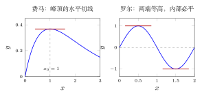
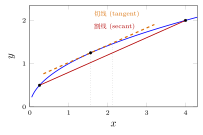
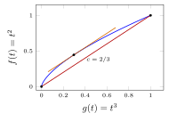
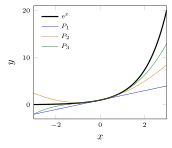
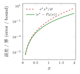

# 第 10 讲　从中值定理到 Taylor 公式 — (From the mean value theorem to Taylor's theorem)

第 9 讲定义了导数 (derivative)，并用它作线性逼近。本讲先研究导数怎样控制两点之间的函数增量 $f(b)-f(a)$，再用高次多项式改进线性逼近。

从 Fermat 定理出发，依次证明 Rolle、Lagrange 与 Cauchy 中值定理。减去割线使 Rolle 定理适用于端点值不同的函数；Cauchy 中值定理则比较两个函数的增量，并用于证明 Taylor 公式的余项。Taylor 公式在 $n=0$ 时就是 Lagrange 中值定理。

本周的问题是可以用数字回答的：一个多项式能把 $\mathrm{e}^x$ 模仿到多远？ 把 $\mathrm{e}$ 算准到 $5$ 位小数要几项，算准到 $15$ 位呢？

## 1 费马定理：内点极值处的水平切线 (Fermat: a flat tangent at an interior extremum)

先回顾第 9 讲的 Fermat 定理：可导函数在内点取局部极值 (local extremum) 时，导数为零。随后将把它用于 Rolle 定理。

> [!WARNING] 先猜一猜 (Guess first) — Locating the maximum
>
>
> 取 $f(x)=x\mathrm{e}^{-x}$，只允许你在 $x=0.6,0.8,1.0,1.2,1.4$ 这五个点上 按计算器。先猜：最大值落在哪两个点之间？再猜：把 $x$ 移动 $0.1$，函数值 大约改变多少？在峰顶附近和在 $x=0.6$ 附近，这个“改变多少”一样吗？ 先写下你的两个猜测，再看下面的表。
>

> [!NOTE] Example 10.1 — Reading a peak off a table
>
>
> Tabulate $f(x)=x\mathrm{e}^{-x}$:
>
> | $x$ | 0.6 | 0.8 | 0.9 | 1.0 | 1.1 | 1.2 |
> |---:|---:|---:|---:|---:|---:|---:|
> | $f(x)$ | 0.3292869817 | 0.3594631713 | 0.3659126938 | 0.3678794412 | 0.3661581921 | 0.3614330543 |
>
> Two things are visible. First, the peak sits at $x=1$, where $f(1)=1/\mathrm{e}=0.367879441171$. Second, and more interesting: moving $0.1$ away from the peak costs only $0.0017$ on the left and $0.0019$ on the right, whereas the step from $0.6$ to $0.8$ gains $0.0302$. Near the top the function is *flat*: a first-order change in $x$ produces only a second-order change in $f$. That flatness is exactly the statement $f'(1)=0$, and indeed $f'(x)=(1-x)\mathrm{e}^{-x}$.
>

表中极值点附近的差商接近零。下面用局部极值两侧的符号证明导数为零。

> [!NOTE] 定理 10.2 — 费马定理 (Fermat's theorem)
>
>
> 设 $f$ 定义在开区间 (open interval) $(a,b)$ 上，$x_0\in(a,b)$。 若 $f$ 在 $x_0$ 处可导 (differentiable)，且 $f$ 在 $x_0$ 处取到局部极大值 或局部极小值 (local maximum or local minimum)，则
> $$
> f'(x_0)=0 .
> $$
>

> [!NOTE] 证明
>
>
> 设 $x_0$ 是局部极大值点，即存在 $\delta>0$，使 $(x_0-\delta,x_0+\delta)\subseteq(a,b)$ 且该邻域内恒有 $f(x)\le f(x_0)$。对 $0<h<\delta$，
> $$
> \frac{f(x_0+h)-f(x_0)}{h}\le 0 ,
> $$
> 因为分子 $\le 0$、分母 $>0$。令 $h\to0^+$，由第 6 讲的极限保序性得 $f'(x_0)\le0$。对 $-\delta<h<0$，同一个分子仍 $\le0$，而分母 $<0$，故商 $\ge0$； 令 $h\to0^-$ 得 $f'(x_0)\ge0$。可导意味着左右两个极限是同一个数，因此 $f'(x_0)=0$。极小值的情形把不等号全部反向即可。
>

> [!NOTE] 注 10.3
>
>
> 定理的三个条件一个都不能省。$(1)$ *内点*：$f(x)=x$ 在 $[1,2]$ 上于 $x=2$ 取到最大值，但 $f'(2)=1$；端点不受管。$(2)$ *可导*：$f(x)=|x|$ 在 $0$ 处取到最小值，那里没有导数。$(3)$ 反过来不成立：$f(x)=x^3$ 有 $f'(0)=0$，而 $0$ 既非极大也非极小。$f'(x_0)=0$ 只是一条线索，不是结论。
>

> [!NOTE] 词语提示
>
>
> *predict*：预测。
>

> [!IMPORTANT] Exercise 10.4 — Flatness is a second-order statement
>
>
> Using only a calculator, tabulate $g(x)=x\mathrm{e}^{-x}$ at $x=1\pm0.01$ and at $x=1\pm0.001$. Before computing, predict the two differences $g(1)-g(1\pm h)$. Then compute the ratios $(g(1)-g(1\pm h))/h^{2}$ for both values of $h$ and say what they appear to converge to. Which lecture will explain that constant?
>

## 2 罗尔定理 (Rolle’s theorem)

由第 8 讲的最值定理，闭区间上的连续函数取到最大值与最小值。若函数不恒定且两端值相等，至少一个最值在内点取到，因而可以使用 Fermat 定理。

> [!WARNING] 先猜一猜 (Guess first) — 水平切线有几条？
>
>
> 在 $[0,2]$ 上画一条从 $(0,0)$ 出发、回到 $(2,0)$ 的光滑曲线。先猜： 水平切线至少有几条？最多可能有几条？你能画出恰好 $2$ 条的例子吗？$17$ 条呢？ 无穷多条呢？先画再读。
>

> [!NOTE] 定理 10.5 — 罗尔定理 (Rolle's theorem)
>
>
> 设 $f$ 在闭区间 (closed interval) $[a,b]$ 上连续 (continuous)，在开区间 $(a,b)$ 内可导 (differentiable)，且 $f(a)=f(b)$。则存在 $\xi\in(a,b)$ 使
> $$
> f'(\xi)=0 .
> $$
>

> [!NOTE] 证明
>
>
> 由第 8 讲的最值定理 (Extreme Value Theorem)，$f$ 在 $[a,b]$ 上取到最大值 $M$ 与最小值 $m$。
>
> 若 $M=m$，则 $f$ 是常值函数，$(a,b)$ 内任何一点都满足 $f'(\xi)=0$。
>
> 若 $M>m$，则 $M$ 与 $m$ 不可能都等于公共端点值 $f(a)=f(b)$。不妨设 $M\ne f(a)$（另一种情形把 $M$ 换成 $m$，论证逐字相同）。取 $\xi\in[a,b]$ 使 $f(\xi)=M$；由 $M\ne f(a)=f(b)$ 知 $\xi\ne a$ 且 $\xi\ne b$，所以 $\xi\in(a,b)$ 是内点。$f$ 在该内点取到全局最大值，当然也取到局部最大值， 且 $f$ 在那里可导，费马定理给出 $f'(\xi)=0$。
>

> [!WARNING] 欠条 (IOU) — \#3（沿用，本讲没有新债）
>
>
> 证明里唯一没有自证的事实是第 8 讲的最值定理，它建立在 Bolzano–Weierstrass 定理“越来越小的闭区间套住一个点”这一步上，即欠条 \#3，第 14 讲还。本讲之后所有定理都经由罗尔定理间接使用它，我们不再重复 记账。
>

图 1：左边是 $f(x)=x\mathrm{e}^{-x}$，峰顶 $x_0=1$ 处切线水平。这是费马定理 的全部内容。右边是 $f(x)=\sin(\pi x)$ 在 $[0,2]$ 上，$f(0)=f(2)=0$，水平切线 出现在 $x=0.5$ 与 $x=1.5$ 两处。请注意：罗尔定理只保证“至少一条”，它从不 告诉你有几条，也不告诉你在哪里。

罗尔定理的第一批用处与切线无关，而是*数根*。若 $f$ 有两个零点 (zeros)，则 $f'$ 在它们之间至少有一个零点；反过来，若 $f'$ 的零点很少， $f$ 的零点也不可能多。这是“用导数控制函数”的最原始形式。

> [!NOTE] 词语提示
>
>
> *contradiction*：矛盾；*sanity check*：合理性检查；*intermediate*：中间的；*at least*：至少。
>

> [!NOTE] Example 10.6 — Counting real roots with Rolle
>
>
> How many real solutions does $p(x)=x^{3}-3x+1=0$ have? Guess first from a short table, then prove the guess.
>
> *Guess.* $p(-2)=-1$, $p(-1)=3$, $p(0)=1$, $p(1)=-1$, $p(2)=3$. Three sign changes, so at least three roots by the intermediate value theorem of Lecture 7.
>
> *Proof that there are no more.* If $p$ had four distinct real roots, Rolle’s theorem applied to the three gaps would give three distinct zeros of $p'(x)=3x^{2}-3$. But $p'$ has exactly two zeros, $x=\pm1$. Contradiction. Hence there are exactly three, and to twelve digits they are
> $$
> -1.879385241572,\qquad 0.347296355334,\qquad 1.532088886238 .
> $$
> *Sanity check.* $p(-1)=3>0$ and $p(1)=-1<0$: the two critical values have opposite signs, which is precisely the condition for a cubic to have three real roots. A cubic whose two critical values have the same sign has only one.
>

## 3 拉格朗日中值定理与它的四个后果 (Lagrange’s MVT and four consequences)

当 $f(a)\ne f(b)$ 时，减去连接两端的割线，便得到端点值相等的辅助函数。对它应用 Rolle 定理即可比较割线斜率与导数。

> [!NOTE] 定理 10.7 — 拉格朗日中值定理 (Lagrange's Mean Value Theorem)
>
>
> 设 $f$ 在闭区间 $[a,b]$ 上连续 (continuous)，在开区间 $(a,b)$ 内可导 (differentiable)。则存在 $\xi\in(a,b)$ 使
> $$
> f(b)-f(a)=f'(\xi)\,(b-a) .
> $$
>

> [!NOTE] 证明
>
>
> 令
> $$
> \varphi(x)=f(x)-f(a)-\frac{f(b)-f(a)}{b-a}\,(x-a) ,
> $$
> 即从 $f$ 中减去那条连接两端点的割线。$\varphi$ 在 $[a,b]$ 上连续、在 $(a,b)$ 内可导，且 $\varphi(a)=\varphi(b)=0$。罗尔定理给出 $\xi\in(a,b)$ 使 $\varphi'(\xi)=0$，即 $f'(\xi)=\dfrac{f(b)-f(a)}{b-a}$。
>

图 2：$f(x)=\sqrt{x}$ 在 $[1/4,4]$ 上。割线（红）斜率 $(2-\frac12)/(4-\frac14)=0.4$；与它平行的切线（橙）切于 $\xi$，由 $1/(2\sqrt\xi)=0.4$ 解得 $\xi=1.5625$，$f(\xi)=1.25$。 请看清楚：$\xi$ 离区间中点 $2.125$ 很远。中值定理里的 $\xi$ 通常不是中点， 而且通常*算不出来*。这正是它有用的方式：我们只用它的存在性， 再对 $f'$ 取一个与 $\xi$ 无关的界。

> [!NOTE] 词语提示
>
>
> *asymptotically*：渐近地；*midpoint*：中点；*ratio*：比值。
>

> [!NOTE] Example 10.8 — Where is $\xi$, really?
>
>
> Take $f(x)=\mathrm{e}^{x}$ on $[0,h]$. The mean value theorem says $\mathrm{e}^{h}-1=\mathrm{e}^{\xi}h$ for some $\xi\in(0,h)$, so $\xi=\xi(h)=\log\!\big((\mathrm{e}^{h}-1)/h\big)$. Compute:
>
> |    $h$ |     $\xi(h)$ |   $\xi(h)/h$ |
> |---------:|---------------:|---------------:|
> |    $2$ | 1.161439361571 | 0.580719680786 |
> |    $1$ | 0.541324854613 | 0.541324854613 |
> |  $0.5$ | 0.260395050993 | 0.520790101986 |
> |  $0.1$ | 0.050416631950 | 0.504166319500 |
> | $0.01$ | 0.005004166663 | 0.500416666319 |
>
> The ratio $\xi(h)/h$ drifts towards $1/2$. So on a short interval $\xi$ is *asymptotically* the midpoint, but never exactly the midpoint — at $h=1$ the point is $0.5413\ldots$, not $0.5$. Guess the rate at which $\xi(h)/h-\tfrac12$ goes to zero from the table; Lecture 11 will prove it in one line from an expansion.
>

四个后果。前三个是把“一点的导数”翻译成“一整段的行为”，第四个把第 4 讲的 压缩映射原理 (Contraction Mapping Theorem) 从“手工验证的不等式”升级为 “可以微分检验的条件”。

> [!NOTE] 推论 10.9 — 常数判别 (Constancy test)
>
>
> 设 $f$ 在区间 $I$ 上连续、在 $I$ 的内部可导。若 $f'\equiv0$，则 $f$ 在 $I$ 上 是常值函数 (constant function)。
>

> [!NOTE] 证明
>
>
> 任取 $x<y$ 属于 $I$。在 $[x,y]$ 上用拉格朗日中值定理： $f(y)-f(x)=f'(\xi)(y-x)=0$。
>

> [!NOTE] 推论 10.10 — 单调性判别 (Monotonicity test)
>
>
> 设 $f$ 在区间 $I$ 上连续、在内部可导。若内部恒有 $f'>0$，则 $f$ 在 $I$ 上 严格递增 (strictly increasing)；若恒有 $f'\ge0$，则 $f$ 递增；$f'<0$、$f'\le0$ 的情形对称。
>

> [!NOTE] 证明
>
>
> $x<y$ 时 $f(y)-f(x)=f'(\xi)(y-x)$，右边的符号由 $f'(\xi)$ 决定。
>

> [!NOTE] 推论 10.11 — Lipschitz 估计 (Lipschitz bound)
>
>
> 设 $f$ 在区间 $I$ 上连续、在内部可导，且 $|f'|\le M$。则对一切 $x,y\in I$，
> $$
> |f(x)-f(y)|\le M\,|x-y| .
> $$
>

> [!NOTE] 推论 10.12 — 微分判别的压缩 (A differentiable contraction)
>
>
> 设 $f:[A,B]\to[A,B]$ 连续、在 $(A,B)$ 内可导，且存在 $0\le q<1$ 使 $|f'|\le q$。则 $f$ 是 $[A,B]$ 上的压缩映射 (contraction mapping)，压缩常数 为 $q$；于是第 4 讲的一维压缩映射原理的全部结论（唯一不动点、任意初值收敛、 先验与后验误差界）都适用。
>

第 4 讲里我们是用代数不等式逐个验证压缩条件的；现在只要求一次导数、取一个 上界就够了。下面这个例子把第 4 讲第一个实验（反复按 $\cos$ 键）从“看起来 收敛”变成“有证书的收敛”。

> [!NOTE] 词语提示
>
>
> *invariant interval*：迭代后仍留在其中的区间；*conservative*：偏保守的；*certificate*：可核验的误差保证；*fixed point*：不动点；*certified*：有严格保证的；*a priori*：先验的（计算前给出的）；*certify*：给出严格保证。
>

> [!NOTE] 词语提示
>
>
> *factor*：因子；*bound*：界；估计；*orbit*：迭代轨迹。
>

> [!NOTE] Example 10.13 — Certifying the cosine iteration
>
>
> In Lecture 4 we pressed the cosine button from $x_1=1$ and watched the orbit oscillate towards a number near $0.739$. Now we can certify it.
>
> Take $I=[0.6,0.9]$. Since $\cos$ is decreasing there, $\cos(I)=[\cos 0.9,\cos 0.6]=[0.6216099683,\,0.8253356149]\subseteq I$, so $I$ is invariant. Also $|\cos'x|=|\sin x|\le\sin 0.9=0.7833269096$ on $I$, so $q=0.7833269096$ works and $q/(1-q)=3.61524778$.
>
> Start at $x_0=0.75$, $d=|f(x_0)-x_0|=0.0183111311$. The a priori bound $q^{n}d/(1-q)<10^{-6}$ first holds at $n=47$ (bound $8.7545\cdot10^{-7}$). The actual error first drops below $10^{-6}$ at $n=24$ ($8.3438\cdot10^{-7}$). The certificate is conservative by roughly a factor of two in the step count — exactly the behaviour Lecture 4 warned about. The fixed point is $0.739085133215715$.
>
> *Why the wider interval is worse.* On $[0,1]$ the same argument only gives $q=\sin 1=0.8414709848$, hence $q/(1-q)=5.3$ and a slower certified rate. Shrinking the invariant interval costs nothing and buys a better constant. Getting a good $q$ is an estimation skill, not a theorem.
>

> [!NOTE] 词语提示
>
>
> *differentiable*：可导的；*contraction*：压缩；*identity*：恒等式。
>

> [!NOTE] Example 10.14 — Newton's $\sqrt2$: the contraction constant collapses
>
>
> Lecture 1 iterated $g(x)=\tfrac12\!\left(x+\dfrac2x\right)$ and Lecture 4 explained its speed by an algebraic identity. The differentiable contraction test explains it a second way. Here
> $$
> g'(x)=\frac12-\frac1{x^{2}},\qquad\text{so}\qquad g'(\sqrt2)=\frac12-\frac12=0 .
> $$
> The contraction constant at the fixed point is not merely $<1$; it is $0$. Tabulate the orbit from $x_0=1$:
>
> | $k$ | $x_k$ | $x_k-\sqrt2$ | $g'(x_k)$ |
> |---:|:---|---:|---:|
> | 0 | 1.00000000000000000000 | $-4.1421\cdot10^{-1}$ | $-5.0000\cdot10^{-1}$ |
> | 1 | 1.50000000000000000000 | $8.5786\cdot10^{-2}$ | $5.5556\cdot10^{-2}$ |
> | 2 | 1.41666666666666666667 | $2.4531\cdot10^{-3}$ | $1.7301\cdot10^{-3}$ |
> | 3 | 1.41421568627450980392 | $2.1239\cdot10^{-6}$ | $1.5018\cdot10^{-6}$ |
> | 4 | 1.41421356237468991063 | $1.5949\cdot10^{-12}$ | $1.1277\cdot10^{-12}$ |
> | 5 | 1.41421356237309504880 | $8.9929\cdot10^{-25}$ | $6.3590\cdot10^{-25}$ |
>
> On $[1.4,1.45]$ the certified constant is already $q=0.02437574$; on $[1.41,1.42]$ it is $q=0.00406665$. As the interval shrinks onto $\sqrt2$, $q\to0$. A contraction with a *vanishing* constant is not merely fast; it is a different species of fast. Lecture 11 will name the species and give the general formula. For now, note the omen: $f'=0$ at the fixed point is the signature of the doubling of digits you saw in Lecture 1.
>

> [!NOTE] 词语提示
>
>
> *hypothesis*：假设。
>

> [!IMPORTANT] Exercise 10.15 — A constancy test with a trap
>
>
> Let $h(x)=\arctan x+\arctan(1/x)$ on $\mathbb{R}\setminus\{0\}$. Differentiate and simplify. Before evaluating anything, predict whether $h$ is constant. Then compute $h$ at $x=0.5,\,2,\,10$ and at $x=-0.5,\,-2$. Explain the discrepancy in one sentence, naming the hypothesis of the constancy test that fails.
>

## 4 柯西中值定理与 L’Hôpital 法则 (Cauchy’s MVT and L’Hôpital’s rule)

拉格朗日中值定理比较的是 $f$ 与 $x$。若要比较 $f$ 与另一个函数 $g$。 两个量一起变化时谁快谁慢。就需要一个同时容纳两者的版本。它是下一步 （Taylor 余项）唯一用到的工具，顺手还给出 L’Hôpital 法则。

> [!NOTE] 定理 10.16 — 柯西中值定理 (Cauchy's Mean Value Theorem)
>
>
> 设 $f,g$ 在闭区间 $[a,b]$ 上连续 (continuous)，在开区间 $(a,b)$ 内可导 (differentiable)。则存在 $\xi\in(a,b)$ 使
> $$
> \big(f(b)-f(a)\big)\,g'(\xi)=\big(g(b)-g(a)\big)\,f'(\xi) .
> $$
> 若进一步假设 $g'$ 在 $(a,b)$ 内处处非零，则 $g(b)\ne g(a)$，且可以写成
> $$
> \frac{f(b)-f(a)}{g(b)-g(a)}=\frac{f'(\xi)}{g'(\xi)} .
> $$
>

> [!NOTE] 证明
>
>
> 令
> $$
> h(x)=\big(f(b)-f(a)\big)\big(g(x)-g(a)\big)-\big(g(b)-g(a)\big)\big(f(x)-f(a)\big).
> $$
> $h$ 在 $[a,b]$ 上连续、$(a,b)$ 内可导，且 $h(a)=0$， $h(b)=\big(f(b)-f(a)\big)\big(g(b)-g(a)\big)-\big(g(b)-g(a)\big)\big(f(b)-f(a)\big)=0$。 罗尔定理给出 $\xi$ 使 $h'(\xi)=0$，即所要的等式。
>
> 若 $g'$ 在 $(a,b)$ 内处处非零，则由罗尔定理 $g(b)\ne g(a)$（否则 $g'$ 会有零点）， 于是可以两边同除 $\big(g(b)-g(a)\big)g'(\xi)$。
>

> [!NOTE] 注 10.17
>
>
> 乘积形式不需要除以 $g'(\xi)$ 或 $g(b)-g(a)$；改写成分式前，须另行确认这两个量非零。
>

图 3：把 $t\mapsto\big(g(t),f(t)\big)=(t^{3},t^{2})$，$t\in[0,1]$，画成平面 上的一条曲线（蓝）。连接两端的弦（红）斜率为 $1$。柯西中值定理断言曲线上 有一点的切向量与弦平行；解 $f'(c)/g'(c)=2c/(3c^{2})=2/(3c)=1$ 得 $c=2/3$， 对应曲线上的点 $(8/27,4/9)=(0.2962962963,\,0.4444444444)$，切线为橙色。 拉格朗日中值定理是这张图在 $g(t)=t$ 时的特例。

柯西中值定理最广为人知的推论是 L’Hôpital 法则。我们只取最基本的一条， 只给一个例子，然后就把它放下：第 11 讲会用 Taylor 展开取代它，那种方法 更快、更可靠，而且顺手给出误差。

> [!NOTE] 定理 10.18 — L'Hôpital 法则（基本形 (basic form)）
>
>
> 设 $f,g$ 在 $[a,b]$ 上连续、在 $(a,b)$ 内可导，$f(a)=g(a)=0$，且 $g'$ 在 $(a,b)$ 内处处非零。若 $\displaystyle\lim_{x\to a^{+}}\frac{f'(x)}{g'(x)}=L$ 存在，则 $g(x)\ne0$ 对一切 $x\in(a,b]$ 成立，并且
> $$
> \lim_{x\to a^{+}}\frac{f(x)}{g(x)}=L .
> $$
>

> [!NOTE] 证明
>
>
> 若某个 $x\in(a,b]$ 有 $g(x)=0$，则由 $g(a)=0$ 与罗尔定理，$g'$ 在 $(a,x)$ 内 有零点，与假设矛盾；故 $g$ 在 $(a,b]$ 上不取零。对固定的 $x\in(a,b]$，在 $[a,x]$ 上用柯西中值定理并利用 $f(a)=g(a)=0$：存在 $\xi_x\in(a,x)$ 使
> $$
> \frac{f(x)}{g(x)}=\frac{f(x)-f(a)}{g(x)-g(a)}=\frac{f'(\xi_x)}{g'(\xi_x)} .
> $$
> 当 $x\to a^{+}$ 时 $a<\xi_x<x$ 迫使 $\xi_x\to a^{+}$，右边趋于 $L$。
>

> [!NOTE] 词语提示
>
>
> *denominator*：分母；*numerator*：分子。
>

> [!NOTE] Example 10.19 — One use, and its price
>
>
> Guess first: tabulate $\displaystyle F(x)=\frac{\mathrm{e}^{x}-1-x}{1-\cos x}$ at $x=0.5,\,0.1,\,0.01$:
> $$
> 1.214869980917,\qquad 1.035045865890,\qquad 1.003350044584 .
> $$
> The limit looks like $1$. Now prove it. Both numerator and denominator vanish at $0$; differentiating gives $(\mathrm{e}^{x}-1)/\sin x$, still $0/0$; differentiating again gives $\mathrm{e}^{x}/\cos x\to1$. Applying the rule twice (on a small interval $(0,b]$ where $\sin x\ne0$) yields $\lim_{x\to0^{+}}F(x)=1$.
>
> *The price.* Each round of differentiation makes the expressions longer, and nothing in the answer tells you *how fast* $F(x)$ approaches $1$ — the table shows the error is roughly $0.33x$, but the rule did not produce that. Lecture 11 will write $\mathrm{e}^{x}-1-x=\tfrac{x^{2}}2+\tfrac{x^{3}}6+\cdots$ and $1-\cos x=\tfrac{x^{2}}2-\tfrac{x^{4}}{24}+\cdots$, divide, and read off both the limit $1$ and the rate $1+\tfrac x3+\cdots$ in two lines.
>

## Taylor 公式：$n$ 阶的中值定理 (Taylor: the mean value theorem of order $n$)

现在把链条收拢。拉格朗日中值定理说：$f(x)$ 等于零次多项式 $f(a)$ 加上一个 用某个 $\xi$ 处的一阶导数写出的余项。如果 $f$ 有更多阶导数，为什么不用更高 次的多项式，把余项推到更高阶去？这就是 Taylor 公式，而它的 $n=0$ 情形 逐字就是拉格朗日中值定理。

> [!IMPORTANT] 定义 10.20 — Taylor 多项式 (Taylor polynomial) 与余项 (remainder)
>
>
> 设 $f$ 在点 $a$ 附近有直到 $n$ 阶的导数。称
> $$
> P_n(x)=\sum_{k=0}^{n}\frac{f^{(k)}(a)}{k!}(x-a)^{k}
> $$
> 为 $f$ 在 $a$ 处的 $n$ 次 Taylor 多项式，称 $R_n(x)=f(x)-P_n(x)$ 为余项 (remainder)。$P_n$ 是唯一一个在 $a$ 处与 $f$ 的函数值及前 $n$ 阶导数全部 吻合的 $n$ 次多项式。
>

> [!NOTE] 定理 10.21 — 带 Lagrange 余项的 Taylor 公式 (Taylor's theorem with Lagrange remainder)
>
>
> 设 $I$ 是区间，$a\in I$。若 $f,f',\dots,f^{(n)}$ 在 $I$ 上连续 (continuous)， 且 $f^{(n+1)}$ 在 $I$ 的内部存在，则对每个 $x\in I$，$x\ne a$，存在严格介于 $a$ 与 $x$ 之间的 $\xi$，使
> $$
> f(x)=\sum_{k=0}^{n}\frac{f^{(k)}(a)}{k!}(x-a)^{k}
> +\frac{f^{(n+1)}(\xi)}{(n+1)!}(x-a)^{n+1} .
> $$
>

> [!NOTE] 证明
>
>
> 不妨设 $x>a$（$x<a$ 时把下面所有区间 $[a,x]$ 换成 $[x,a]$，论证逐字相同）。 把 $x$ *固定*，让展开点变成自由变量 $t$，定义 $[a,x]$ 上的两个函数
> $$
> F(t)=\sum_{k=0}^{n}\frac{f^{(k)}(t)}{k!}(x-t)^{k},
> \qquad
> G(t)=(x-t)^{n+1}.
> $$
> 两者都在 $[a,x]$ 上连续、在 $(a,x)$ 内可导。先算 $F'$：对每一项用乘积法则，
> $$
> F'(t)=\sum_{k=0}^{n}\left[\frac{f^{(k+1)}(t)}{k!}(x-t)^{k}
> -\frac{f^{(k)}(t)}{(k-1)!}(x-t)^{k-1}\right],
> $$
> 其中 $k=0$ 的第二项按约定为 $0$。第一个和式的第 $k$ 项与第二个和式的第 $k+1$ 项逐项相消（telescoping cancellation），只剩最后一个：
> $$
> F'(t)=\frac{f^{(n+1)}(t)}{n!}(x-t)^{n} .
> $$
> 而 $G'(t)=-(n+1)(x-t)^{n}$，它在 $(a,x)$ 内处处非零。于是柯西中值定理适用： 存在 $\xi\in(a,x)$ 使
> $$
> \frac{F(x)-F(a)}{G(x)-G(a)}=\frac{F'(\xi)}{G'(\xi)}
> =\frac{f^{(n+1)}(\xi)(x-\xi)^{n}/n!}{-(n+1)(x-\xi)^{n}}
> =-\frac{f^{(n+1)}(\xi)}{(n+1)!}.
> $$
> 左边可以直接算出来：$F(x)=f(x)$，$F(a)=P_n(x)$，$G(x)=0$， $G(a)=(x-a)^{n+1}$，所以左边 $=\dfrac{f(x)-P_n(x)}{-(x-a)^{n+1}} =-\dfrac{R_n(x)}{(x-a)^{n+1}}$。两边比较即得 $R_n(x)=\dfrac{f^{(n+1)}(\xi)}{(n+1)!}(x-a)^{n+1}$。
>

> [!NOTE] 注 10.22 — $n=0$ 的情形
>
>
> 取 $n=0$，公式成为 $f(x)=f(a)+f'(\xi)(x-a)$，即 Lagrange 中值定理。
>

> [!NOTE] 注 10.23 — 余项的另外两种形式：只预告
>
>
> Lagrange 余项要求 $f^{(n+1)}$ 存在，回报是一个*可以取上界*的显式表达式， 这正是本讲下一节的全部数值工作所需要的。另有两种常用形式：Peano 余项 $R_n(x)=o\big((x-a)^{n}\big)$，只要求 $f^{(n)}(a)$ 存在，是算极限的利器 （第 11 讲）；积分形式的余项要用到定积分，是最精确的一种（第 16 讲）。 本讲只用 Lagrange 余项。
>

## 5 Numerical estimates from Taylor polynomials

到这里为止，Taylor 公式还只是一个等式。它的价值要到*取上界*这一步才 出现：$\xi$ 我们不知道，但只要能对 $f^{(n+1)}$ 在整段上取一个界 $M$，就得到
$$
|R_n(x)|\le\frac{M}{(n+1)!}\,|x-a|^{n+1} ,
$$
而右边是一个可以按计算器的数。这一节把这个界用四次，每次都先猜后算。

> [!WARNING] 先猜一猜 (Guess first) — 要几项？
>
>
> 要用 $\mathrm{e}=\sum_{k=0}^{n}\dfrac1{k!}+R_n$ 把 $\mathrm{e}$ 算准到小数点后 $5$ 位（即 $|R_n|<10^{-5}$），先猜 $n$ 是多少：$5$？$8$？$20$？$100$？ 再猜：要算准到 $15$ 位，$n$ 会变成多少。是刚才那个数的三倍，还是只多几项？ 把两个猜测写下来。多数人第二个猜测会猜得太大。
>

> [!NOTE] 词语提示
>
>
> *decimal places*：小数位数；*error bound*：误差上界；*comparison*：比较；*magnitude*：数量级；*remainder*：余项；*rounding*：四舍五入；*sharp*：不能改进的；最优的。
>

> [!NOTE] Example 10.24 — $\mathrm{e}$ to five and to fifteen decimals
>
>
> Apply Taylor’s theorem to $f(x)=\mathrm{e}^{x}$ at $a=0$, $x=1$. All derivatives are $\mathrm{e}^{x}$, so
> $$
> \mathrm{e}=\sum_{k=0}^{n}\frac1{k!}+\frac{\mathrm{e}^{\xi}}{(n+1)!},
> \qquad 0<\xi<1 .
> $$
> Since $\mathrm{e}^{\xi}<\mathrm{e}<3$, the remainder satisfies $0<R_n<\dfrac3{(n+1)!}$. Note the honest logic: we do not know $\xi$, and we do not need to.
>
> | $n$ | $\sum_{k\le n}1/k!$ | $3/(n+1)!$            | actual $R_n$          |
> |------:|:----------------------|:------------------------|:------------------------|
> |     4 | 2.7083333333333333    | $2.5000\cdot10^{-2}$  | $9.9485\cdot10^{-3}$  |
> |     6 | 2.7180555555555556    | $5.9524\cdot10^{-4}$  | $2.2627\cdot10^{-4}$  |
> |     7 | 2.7182539682539683    | $7.4405\cdot10^{-5}$  | $2.7860\cdot10^{-5}$  |
> |     8 | 2.7182787698412698    | $8.2672\cdot10^{-6}$  | $3.0586\cdot10^{-6}$  |
> |     9 | 2.7182815255731922    | $8.2672\cdot10^{-7}$  | $3.0289\cdot10^{-7}$  |
> |    17 | 2.718281828459045071  | $4.6858\cdot10^{-16}$ | $1.6484\cdot10^{-16}$ |
>
> The bound first drops below $10^{-5}$ at $\boxed{n=8}$ and first drops below $10^{-15}$ at $\boxed{n=17}$. For comparison, $\mathrm{e}=2.718281828459045235$.
>
> Three things deserve attention. *(i)* Ten extra digits cost nine extra terms, not ten times as many: factorials beat decimal places badly, and most people’s first guess for $n=15$ digits is far too large. *(ii)* The bound overestimates the true error by a factor between $2.5$ and $2.9$ throughout the table — not sharp, but the right order of magnitude, which is all an error bound has to be. *(iii)* If you insist on “5 correct decimals” in the rounding sense, i.e. $|R_n|<0.5\cdot10^{-5}$, the *bound* only certifies this at $n=9$, while the *actual* error already satisfies it at $n=8$. Always state which criterion you are using.
>

图 4：左图是 $\mathrm{e}^x$ 与 $P_1,P_2,P_3$ 在 $[-3,3]$ 上的对照。请看 三件事：在 $x=0$ 附近三条曲线都贴住 $\mathrm{e}^x$；离开原点后误差按次数 分层；在 $x=-3$ 处 $P_1=-2$、$P_3=-2$ 都是负数，而 $\mathrm{e}^{-3}=0.049787>0$ 多项式逼近是*局部*的。右图（纵轴对数）是 $n=3$ 时真实误差与 Lagrange 上界 $\mathrm{e}^xx^4/4!$ 的对照：两条线平行（同阶），上界始终在上方 （合法），间距随 $x$ 增大而拉开（不紧）。这三句话正是一个误差界该被怎样 使用的全部内容。

> [!WARNING] 先猜一猜 (Guess first) — $\sin x\approx x$ 能用到几度？
>
>
> 所有角度用弧度。先猜：要让 $\sin x\approx x$ 的误差小于 $10^{-4}$，$x$ 最大 能取到多少度？$1^\circ$？$5^\circ$？$30^\circ$？再猜：改用 $\sin x\approx x-x^{3}/6$ 之后，这个上限会扩大几倍？
>

> [!NOTE] 词语提示
>
>
> *derivative*：导数；*tolerance*：允许的误差。
>

> [!NOTE] Example 10.25 — $\sin 0.5$ with three terms, and how far the formulas reach
>
>
> For $f(x)=\sin x$ at $a=0$, every derivative is $\pm\sin$ or $\pm\cos$, so $|f^{(n+1)}|\le1$ everywhere and $|R_n(x)|\le|x|^{n+1}/(n+1)!$ with no further thought.
>
> *Three terms at $x=0.5$.* With $P_5(x)=x-\dfrac{x^{3}}6+\dfrac{x^{5}}{120}$ (the degree-$6$ term vanishes, so we may use $n=6$):
> $$
> P_5(0.5)=0.479427083333333333,\qquad \sin 0.5=0.479425538604203000 .
> $$
> The actual error is $1.5447\cdot10^{-6}$; the bound $0.5^{7}/7!=1.5501\cdot10^{-6}$. Their ratio is $1.003$: here the Lagrange bound is essentially *sharp*. Compare with the $\mathrm{e}$ table, where it was off by a factor $2.7$. Sharpness is a property of the particular function and point, not of the theorem.
>
> *Reach of each formula* (tolerance $10^{-4}$):
>
> | approximation | condition | largest $x$ |
> |:---|:---|:---|
> | $\sin x\approx x$ | $|x|^{3}/6<10^{-4}$ | $0.08434327\ (4.8325^{\circ})$ |
> | $\sin x\approx x-x^{3}/6$ | $|x|^{5}/120<10^{-4}$ | $0.41289179\ (23.6570^{\circ})$ |
> | $\sin x\approx x-x^{3}/6+x^{5}/120$ | $|x|^{7}/5040<10^{-4}$ | $0.90675525\ (51.9532^{\circ})$ |
>
> One extra term multiplies the usable range by about $5$, then by about $2.2$. The returns diminish in range but the accuracy at a *fixed* $x$ keeps improving fast — two different questions, often confused.
>

> [!NOTE] Example 10.26 — Where a degree-4 polynomial fails: $\cos$ at $\pi/2$
>
>
> Guess first: $\cos(\pi/2)=0$ exactly. How far off is $P_4(x)=1-\dfrac{x^{2}}2+\dfrac{x^{4}}{24}$ there? Guess before reading: $0.2$? $0.02$? $0.002$?
>
> Compute. $\pi/2=1.570796326794897$ and
> $$
> P_4(\pi/2)=0.019968957765 ,
> $$
> so the error is $1.9969\cdot10^{-2}$, against the bound $(\pi/2)^{6}/6!=2.0863\cdot10^{-2}$ (sharp to $4.5\%$). Adding one more term, $P_6(\pi/2)=-0.000894522998$, error $8.9452\cdot10^{-4}$, bound $(\pi/2)^{8}/8!=9.1926\cdot10^{-4}$. The sign has flipped: successive Taylor polynomials of $\cos$ straddle the true value. A two-percent error at $90^{\circ}$ from a degree-$4$ polynomial is neither impressive nor a disaster — it is simply what $(\pi/2)^{6}/720$ is, and you could have predicted it before computing anything.
>

> [!WARNING] 先猜一猜 (Guess first) — 二项式的第三项值多少？
>
>
> $\sqrt{1.1}$ 用 $1+\tfrac{x}{2}$ 估计是 $1.05$，真值是 $1.0488\ldots$， 差了 $1.2\cdot10^{-3}$。先猜：加上 $-x^{2}/8$ 这一项之后，误差会掉到哪个 数量级？$10^{-4}$？$10^{-5}$？$10^{-6}$？再猜：把 $x$ 从 $0.1$ 换成 $0.5$， 误差会放大多少倍？
>

> [!NOTE] 词语提示
>
>
> *upper bound*：上界；*estimate*：估计。
>

> [!NOTE] Example 10.27 — The binomial expansion with a certified error
>
>
> Let $f(x)=\sqrt{1+x}$ on $x\ge0$. Then $f'=\tfrac12(1+x)^{-1/2}$, $f''=-\tfrac14(1+x)^{-3/2}$, $f'''=\tfrac38(1+x)^{-5/2}$, so $f(0)=1$, $f'(0)=\tfrac12$, $f''(0)=-\tfrac14$ and
> $$
> \sqrt{1+x}=1+\frac{x}{2}-\frac{x^{2}}{8}+R_2(x),
> \qquad
> R_2(x)=\frac{f'''(\xi)}{6}x^{3}=\frac{x^{3}}{16\,(1+\xi)^{5/2}} .
> $$
> For $x>0$ we have $\xi>0$, hence $(1+\xi)^{-5/2}<1$ and $0<R_2(x)<x^{3}/16$ — the bound costs one line and no knowledge of $\xi$.
>
> | $x$ | $1+\frac x2-\frac{x^2}8$ | $\sqrt{1+x}$ | actual $R_2$ | bound $x^{3}/16$ |
> |---:|:---|:---|:---|:---|
> | 0.1 | 1.048750000000 | 1.048808848170 | $5.8848\cdot10^{-5}$ | $6.2500\cdot10^{-5}$ |
> | 0.5 | 1.218750000000 | 1.224744871392 | $5.9949\cdot10^{-3}$ | $7.8125\cdot10^{-3}$ |
> | 1 | 1.375000000000 | 1.414213562373 | $3.9214\cdot10^{-2}$ | $6.2500\cdot10^{-2}$ |
>
> At $x=0.1$ the bound is within $6\%$ of the truth; at $x=1$ it is off by $59\%$ — because $(1+\xi)^{-5/2}$ is no longer close to $1$ when $\xi$ may be as large as $1$. A bound degrades exactly where the estimate that produced it was crude. Note also $R_2>0$ always: $1+\frac x2-\frac{x^2}8$ is a *lower* bound for $\sqrt{1+x}$ on $x\ge0$, while $1+\frac x2$ is an upper bound. Two-sided information, for free.
>

这些估计都用区间上的导数上界消去未知点 $\xi$。下面比较所得上界与实际误差。

> [!NOTE] 词语提示
>
>
> *counterexample*：反例；*vertical*：竖直的；*bounded*：有界的；*odd*：奇数的。
>

> [!NOTE] AI Lab — How far can a polynomial imitate $\mathrm{e}^{x}$?
>
>
> Ask an AI to produce code as well as pictures; you must be able to re-run everything yourself.
>
> 1.  Plot $\mathrm{e}^{x}$ together with $P_n(x)=\sum_{k\le n}x^{k}/k!$ for $n=1,\dots,6$ on $[-3,3]$. Before looking: on which side of the origin do the odd-degree polynomials fail first, and why?
>
> 2.  On the same interval plot $|\mathrm{e}^{x}-P_n(x)|$ and the Lagrange bound $\mathrm{e}^{|x|}|x|^{n+1}/(n+1)!$ on a logarithmic vertical axis, for $n=1,3,5$. Report the ratio bound/error at $x=0.5,1,2,3$ for each $n$. Is the bound ever below the error? (It must not be — if your output says otherwise, you have a code bug, not a counterexample.)
>
> 3.  The ratio grows with $x$ but stays bounded for fixed $x$ as $n$ grows. Explain the first fact from the proof of the bound. State the second as a conjecture and say what you would compute to test it.
>
> 4.  Now the honest question: find, for each $n=1,\dots,10$, the largest $x>0$ with $|\mathrm{e}^{x}-P_n(x)|<10^{-3}$. Tabulate. Does this “usable range” grow linearly in $n$, like $\sqrt n$, or like $\log n$? Answer from your own table, and say how many data points you would need before you would defend the answer.
>

> [!NOTE] 词语提示
>
>
> *precision*：计算精度。
>

> [!NOTE] AI Lab — Where does $\xi$ actually sit?
>
>
> For $f(x)=\mathrm{e}^{x}$, $a=0$, $x=1$, the Lagrange remainder is $\mathrm{e}^{\xi_n}/(n+1)!$ with $\xi_n\in(0,1)$, so $\xi_n$ can be recovered exactly: $\xi_n=\log\big(R_n\cdot(n+1)!\big)$. Have an AI compute $\xi_n$ to $8$ digits for $n=1,\dots,30$ using high-precision arithmetic (ask it to say which library it used and why plain floating point would fail beyond $n\approx17$). Before running: guess whether $\xi_n$ tends to $0$, to $1/2$, to $1$, or to nothing at all. Then plot $\xi_n$ and $n\xi_n$. State what you observe, and identify the one inequality in this lecture that your observation makes look wasteful.
>

## 6 Exercises

> [!NOTE] 词语提示
>
>
> *significant digits*：有效数字；*factorial*：阶乘；*geometric*：等比的；*bisection*：二分法；*finite*：有限的；*bounds*：上下界；*deduce*：推出。
>

> [!NOTE] 词语提示
>
>
> *exact*：精确的；*least*：最小的；*index*：下标。
>

1. **10.1**  $\star$ **Count the roots before finding them.** Consider $q(x)=x^{4}-4x+1$. From the values $q(-2)=25$, $q(0)=1$, $q(1)=-2$, $q(2)=9$, guess how many real roots $q$ has. Then use Rolle’s theorem and the zeros of $q'$ to prove an upper bound on that number, and combine the two to settle it exactly. Finally locate the roots to $6$ decimals by bisection. Explain why the argument would collapse if $q'$ had three real zeros.

1. **10.2**  $\star\star$ **(homework) $\mathrm{e}$ to ten decimals, two ways.** Before computing: guess the smallest $n$ with $|R_n|<10^{-10}$ in $\mathrm{e}=\sum_{k\le n}1/k!+R_n$. Then (a) find the smallest $n$ for which the crude bound $3/(n+1)!$ certifies it; (b) prove the sharper bound $R_n<\dfrac1{n!\,n}$ by summing a geometric series, and find the smallest $n$ it certifies; (c) compute the actual error at your $n$ with at least $20$ significant digits. Do (a) and (b) give the same $n$? Explain why the two bounds are so close even though one looks much better.

1. **10.3**  $\star$ **$\xi$ is not the midpoint.** For $f(x)=x^{3}$ on $[0,1]$, solve for the mean value point $\xi$ exactly. Guess first whether it lies left or right of $0.5$. Then do the same for $f(x)=x^{3}$ on $[0,h]$ and for $f(x)=x^{2}$ on $[0,h]$, and say for which of the two the mean value point is exactly the midpoint for every $h$. Which feature of the function is responsible?

1. **10.4**  $\star\star$ **(homework) Certifying an old friend.** Return to Lecture 1’s iteration $b_{n+1}=1+1/b_n$. Use the differentiable contraction test to certify it: find an interval $I$ with $f(I)\subseteq I$ for $f(x)=1+1/x$, compute $q=\max_{I}|f'|$, and check that $q<1$. Starting from $x_0=1.6$, predict from the a priori bound how many steps guarantee error below $10^{-8}$; then compute the orbit and find the first index that actually achieves it. Report both numbers and the ratio between them. Finally: what happens to $q$ if you enlarge $I$ to $[1,2]$, and what does that say about the value of a well-chosen interval?

1. **10.5**  $\star\star$ **A quotient rule that is not a rule.** Take $f(t)=t^{2}$ and $g(t)=t^{3}$ on $[-1,1]$. Show that there is *no* $c\in(-1,1)$ with $\dfrac{f(1)-f(-1)}{g(1)-g(-1)}=\dfrac{f'(c)}{g'(c)}$, yet the product form of Cauchy’s mean value theorem holds with $c=0$. Identify precisely which hypothesis of the quotient form fails. Then construct your own pair $f,g$ on $[0,1]$ for which the quotient form fails for a *different* reason.

1. **10.6**  $\star\star$ **When L’Hôpital tells you nothing.** Let $f(x)=x^{2}\sin(1/x)$ for $x\ne0$ and $f(0)=0$, and $g(x)=x$. Show $f'(0)$ exists and compute it. Show that $\lim_{x\to0}f(x)/g(x)$ exists and find it. Then show that $\lim_{x\to0}f'(x)/g'(x)$ does *not* exist (tabulate $f'/g'$ at $x=1/(k\pi)$ and at $x=1/(2k\pi+\pi/2)$ for a few $k$). Which hypothesis of the rule stated in this lecture is violated, and what is the general lesson about a rule whose conclusion is “if the right-hand limit exists”?

1. **10.7**  $\star\star\star$ **(homework) Hunting $\xi$ in Taylor’s formula.** For $f(x)=\mathrm{e}^{x}$, $a=0$, $x=1$, write $\mathrm{e}=\sum_{k\le n}1/k!+\mathrm{e}^{\xi_n}/(n+1)!$ with $\xi_n\in(0,1)$. Compute $\xi_n$ for $n=1,\dots,8$ to $8$ decimals and guess its limit from the table alone. Then prove your guess, using only $R_n=\sum_{k>n}1/k!$ and a comparison with a geometric series. Finally, guess the behaviour of $n\xi_n$ from your data and say what you would need in order to prove it.

1. **10.8**  $\star\star$ **Two-sided estimates from one remainder.** Prove that for all $x\ge0$,
    $$
    1+\frac{x}{2}-\frac{x^{2}}{8}\;\le\;\sqrt{1+x}\;\le\;1+\frac{x}{2},
    $$
    by identifying the sign of the appropriate Lagrange remainder in each case. Before computing: at $x=1$, which of the two bounds is closer to the truth? Then measure both errors and say by what factor your guess was wrong (or right). For which $x$ do the two errors become comparable?

1. **10.9**  $\star\star$ **A constancy test that needs its interval.** Let $h(x)=\arctan x+\arctan(1/x)$ for $x\ne0$. Show $h'\equiv0$ on the domain. Compute $h(0.5)$, $h(2)$, $h(10)$, $h(-0.5)$, $h(-2)$ to $12$ decimals. State the exact value of $h$ on each of the two components and prove it. Which word in the statement of the constancy test does this example defend?

1. **10.10** $\star\star\star$ **How large can $f'$ be if $f$ and $f''$ are small?** Guess first: can a function on $(0,\infty)$ satisfy $|f|\le1$ and $|f''|\le1$ everywhere while $f'(x_0)=100$ for some $x_0$? Now prove it cannot: with $M_j=\sup_{x>0}|f^{(j)}(x)|$ assumed finite for $j=0,2$, apply Taylor’s formula to $f(x+t)$ for $t>0$, bound $|t f'(x)|$, optimise over $t$, and deduce $M_1\le2\sqrt{M_0M_2}$. Test your inequality on $f(x)=\sin x$: compute $M_0,M_1,M_2$ and the ratio between the two sides. Is the constant $2$ plausibly the best possible on a half-line? What would you compute to find out?

1. **10.11** $\star\star$ **Budget the terms before spending them.** You must compute $\mathrm{e}^{3}$ to within $10^{-6}$ from $P_n(3)=\sum_{k\le n}3^{k}/k!$. Guess $n$ first. Then derive the bound $|R_n(3)|\le\mathrm{e}^{3}\,3^{n+1}/(n+1)!$, find the smallest certified $n$, and compare with the actual error at that $n$. Now compare with the number of terms needed for $\mathrm{e}^{1}$ to the same tolerance, and explain the difference in one sentence about where the factorial finally wins. Propose (no proof needed) a cheaper strategy using $\mathrm{e}^{3}=(\mathrm{e})^{3}$ and say what it costs in accuracy.

> [!NOTE] 回望 (Looking back)
>
>
> Taylor 公式把函数值写成多项式与余项；区间上的导数界给出可计算的误差保证。下一讲用 Peano 余项求极限、分析迭代，并区分固定次数下的局部展开与次数趋于无穷的多项式极限。
>
