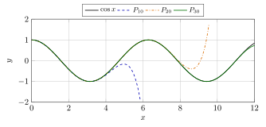
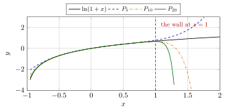
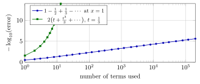
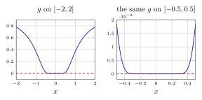

# 第 11 讲　Taylor 公式的运用 — (Using Taylor's theorem)

第 10 讲把中值定理一路推到带 Lagrange 余项的 Taylor 公式： 在 $x$ 与 $a$ 之间存在某个 $\xi$，使得
$$
f(x)=\sum_{k=0}^{n}\frac{f^{(k)}(a)}{k!}(x-a)^k+\frac{f^{(n+1)}(\xi)}{(n+1)!}(x-a)^{n+1}.
$$
Lagrange 余项中的点 $\xi$ 虽未指定，但区间上的导数上界可以给出数值误差保证。若只研究 $x\to a$ 时的局部行为，则可用 $o((x-a)^n)$ 表示余项。

本讲先建立 Peano 余项及其运算法则，再用于求极限、分析牛顿法的收敛速度和判别极值。最后固定 $x$、让多项式次数 $n$ 增大，分别检验误差是否趋于零。此时不能直接使用只对固定 $n$ 成立的局部展开。

## 1 Peano 余项与 $o$ 的代数 (The Peano remainder and the algebra of $o$)

第 6 讲引入过无穷小的阶 (orders of smallness) 与记号 $o$、$O$。 先把它在本讲要用的形式重述一次。

> [!IMPORTANT] 定义 11.1 — $o$ 记号 ($o$-notation)
>
>
> 设 $g$ 在 $a$ 的某去心邻域 (punctured neighbourhood) 内不取零值。 记号
> $$
> h(x)=o\big(g(x)\big)\quad(x\to a)
> $$
> 表示 $\lim_{x\to a}h(x)/g(x)=0$。 本讲中 $g$ 几乎总是 $(x-a)^n$；$a=0$ 时就写 $o(x^n)$。 记号 $h(x)=O(g(x))$ 表示 $h/g$ 在 $a$ 附近 bounded。
>

> [!WARNING] 先猜一猜 (Guess first) — 三次项到哪里去了
>
>
> 把 $e^{\sin x}$ 与二次多项式 $1+x+\tfrac{x^2}{2}$ 作差。 先猜：这个差是 $x$ 的几次方量级？（大多数人会说三次。） 然后用计算器在 $x=0.2,\,0.1,\,0.05$ 上算一算，看差缩小的倍数是多少： 从 $0.1$ 到 $0.05$，若是三次量级应当缩小约 $8$ 倍，四次量级则约 $16$ 倍。
>

> [!NOTE] Example 11.2 — Where did the cubic term go?
>
>
> With 80-digit arithmetic:
>
> | $x$ | $e^{\sin x}$ | $e^{\sin x}-\left(1+x+\frac{x^2}{2}\right)$ | $-x^4/8$ |
> |---:|---:|---:|---:|
> | $0.20$ | $1.219778556001$ | $-2.214440\times10^{-4}$ | $-2.000000\times10^{-4}$ |
> | $0.10$ | $1.104986830332$ | $-1.316967\times10^{-5}$ | $-1.250000\times10^{-5}$ |
> | $0.05$ | $1.051249197860$ | $-8.021395\times10^{-7}$ | $-7.812500\times10^{-7}$ |
>
> Halving $x$ divides the difference by about $16$, not by $8$: the difference is of fourth order, so the cubic coefficient is exactly $0$. The last column shows which fourth-order quantity it is. Nothing here is an accident, and by the end of this section we will read the coefficient $-1/8$ off a two-line computation instead of differentiating $e^{\sin x}$ four times.
>

下面证明表中误差比值所提示的局部展开。

> [!NOTE] 定理 11.3 — Taylor 公式的 Peano 余项形式 (Taylor's theorem with the Peano remainder)
>
>
> 设 $n\ge1$，$f$ 在点 $a$ 的某个邻域 (neighbourhood) 内有直到 $n-1$ 阶的导数 (derivative)，并且 $n$ 阶导数 $f^{(n)}(a)$ 在 $a$ 处存在。记
> $$
> P_n(x)=\sum_{k=0}^{n}\frac{f^{(k)}(a)}{k!}(x-a)^k
> $$
> 为 $f$ 在 $a$ 处的 $n$ 次 Taylor 多项式 (Taylor polynomial)。则
> $$
> f(x)=P_n(x)+o\big((x-a)^n\big)\qquad(x\to a).
> $$
>

> [!NOTE] 证明
>
>
> 记 $r(x)=f(x)-P_n(x)$。多项式 $P_n$ 的构造保证
> $$
> r(a)=r'(a)=\cdots=r^{(n-1)}(a)=0,\qquad r^{(n)}(a)=0,
> $$
> 最后一式是因为 $P_n^{(n)}(a)=f^{(n)}(a)$。要证的是 $r(x)/(x-a)^n\to0$。
>
> $n=1$ 时这就是可导的定义：$\big(f(x)-f(a)-f'(a)(x-a)\big)/(x-a)\to0$。
>
> 设 $n\ge2$。分子分母在 $x\to a$ 时同趋于 $0$，且在 $a$ 的去心邻域内 $\big((x-a)^n\big)'=n(x-a)^{n-1}\ne0$。对 $r(x)/(x-a)^n$ 用第 10 讲的 L’Hôpital 法则 (L’Hôpital’s rule)， 连用 $n-1$ 次，每一次分子分母仍同趋于 $0$（因为 $r^{(j)}(a)=0$， $j\le n-1$），得到：只要
> $$
> \lim_{x\to a}\frac{r^{(n-1)}(x)}{n!\,(x-a)}
> $$
> 存在，原极限就等于它。而 $r^{(n-1)}(a)=0$，所以
> $$
> \frac{r^{(n-1)}(x)}{n!\,(x-a)}
> =\frac1{n!}\cdot\frac{r^{(n-1)}(x)-r^{(n-1)}(a)}{x-a}
> \xrightarrow[x\to a]{}\frac{r^{(n)}(a)}{n!}=0 ,
> $$
> 最后一步正是 $r^{(n-1)}$ 在 $a$ 处可导（导数为 $r^{(n)}(a)=0$）。 这里只用到 $f^{(n)}$ 在 $a$ 这一点存在，不需要它在邻域内存在， 更不需要 $f^{(n+1)}$。
>

> [!NOTE] 注 11.4
>
>
> 两种余项各有各的用处，不可互相取代。Lagrange 余项是*定量*的： 它在一个给定的 $x$ 上给出可计算的误差上界，代价是要求 $f^{(n+1)}$ 存在。 Peano 余项是*定性*的：它对固定的 $x$ 什么也没说， 只描述 $x\to a$ 时的行为，代价极小。 算极限用 Peano，认证精度用 Lagrange。本讲第 [5](#l11-sec:bign) 节两者都要用。
>

### 1.1 唯一性：为什么可以“比较系数” (Uniqueness: why matching coefficients is legal)

> [!NOTE] 命题 11.5 — 展开的唯一性 (Uniqueness of the expansion)
>
>
> 设 $p(x)=\sum_{k=0}^{n}a_k(x-a)^k$ 与 $q(x)=\sum_{k=0}^{n}b_k(x-a)^k$ 满足 $p(x)-q(x)=o\big((x-a)^n\big)$ $(x\to a)$，则 $a_k=b_k$ 对一切 $k\le n$ 成立。
>

> [!NOTE] 证明
>
>
> 设不然，令 $m$ 是使 $c_m:=a_m-b_m\ne0$ 的最小下标。于是
> $$
> p(x)-q(x)=(x-a)^m\Big(c_m+c_{m+1}(x-a)+\cdots\Big),
> $$
> 括号内的量在 $x\to a$ 时趋于 $c_m\ne0$。 两边除以 $(x-a)^n$（$m\le n$）：左端按假设趋于 $0$， 右端等于 $(x-a)^{m-n}\big(c_m+o(1)\big)$，其绝对值在 $x\to a$ 时 趋于 $|c_m|>0$（若 $m=n$）或趋于 $+\infty$（若 $m<n$）。矛盾。
>

在 Peano 定理的可导性假设下，若次数不超过 $n$ 的多项式 $p$ 满足 $f-p=o((x-a)^n)$，则由唯一性知 $p=P_n$。因此可通过乘法、除法与复合计算 Taylor 系数。

### 1.2 $o$ 的运算法则 ($o$-calculus) 与标准展开表

> [!NOTE] 命题 11.6 — $o$ 的运算法则 (Rules of the $o$-calculus)
>
>
> 以下等式都在 $x\to0$ 的意义下成立，其中 $m,n\ge0$ 为整数，$c\ne0$ 为常数。 等号读作“左端是右端所描述的一类量之一”，不可从右往左读。
>
> 1.  $o(x^n)\pm o(x^n)=o(x^n)$，且 $c\cdot o(x^n)=o(x^n)$；
>
> 2.  若 $m\le n$ 则 $o(x^n)=o(x^m)$（高阶的更小）；
>
> 3.  $x^m\cdot o(x^n)=o(x^{m+n})$，且 $o(x^m)\cdot o(x^n)=o(x^{m+n})$；
>
> 4.  $O(x^m)\cdot o(x^n)=o(x^{m+n})$；
>
> 5.  （复合）若 $u(x)\to0$ 且 $u(x)=O(x)$，则 $o(u(x)^n)=o(x^n)$。
>

> [!NOTE] 证明
>
>
> \(1\) 两个趋于 $0$ 的商之和仍趋于 $0$。 (2) $h/x^m=(h/x^n)\cdot x^{n-m}\to0\cdot0=0$（$m<n$ 时），$m=n$ 时显然。 (3) 若 $h/x^n\to0$，则 $(x^mh)/x^{m+n}=h/x^n\to0$；第二式同理， 把 $h_1h_2/x^{m+n}$ 写成 $(h_1/x^m)(h_2/x^n)$。 (4) 把 $(h_1h_2)/x^{m+n}$ 写成 $(h_1/x^m)\cdot(h_2/x^n)$，前者 bounded，后者 $\to0$。 (5) 设 $|u(x)|\le M|x|$ 且 $h(u)/u^n\to0$。则 $|h(u(x))/x^n|=|h(u(x))/u(x)^n|\cdot|u(x)/x|^n\le M^n|h(u(x))/u(x)^n|\to0$ （$u(x)=0$ 的点上左端为零，不影响结论）。
>

把定理 [11.3](#l11-thm:peano) 用在几个常见函数上，就得到本讲随身携带的一张表。 表中每一行都在 $x\to0$ 时成立。

| 函数 | 在 $0$ 处的展开 (expansion at $0$) |
|:---|:---|
| $e^{x}$ | $1+x+\dfrac{x^2}{2}+\dfrac{x^3}{6}+\dfrac{x^4}{24}+\dfrac{x^5}{120}+o(x^5)$ |
| $\sin x$ | $x-\dfrac{x^3}{6}+\dfrac{x^5}{120}+o(x^6)$ |
| $\cos x$ | $1-\dfrac{x^2}{2}+\dfrac{x^4}{24}-\dfrac{x^6}{720}+o(x^7)$ |
| $\ln(1+x)$ | $x-\dfrac{x^2}{2}+\dfrac{x^3}{3}-\dfrac{x^4}{4}+\dfrac{x^5}{5}+o(x^5)$ |
| $\arctan x$ | $x-\dfrac{x^3}{3}+\dfrac{x^5}{5}+o(x^6)$ |
| $\tan x$ | $x+\dfrac{x^3}{3}+\dfrac{2x^5}{15}+o(x^6)$ |
| $(1+x)^{\alpha}$ | $1+\alpha x+\dfrac{\alpha(\alpha-1)}{2}x^2+\dfrac{\alpha(\alpha-1)(\alpha-2)}{6}x^3+o(x^3)$ |
| $\sqrt{1+x}$ | $1+\dfrac{x}{2}-\dfrac{x^2}{8}+\dfrac{x^3}{16}-\dfrac{5x^4}{128}+\dfrac{7x^5}{256}+o(x^5)$ |

> [!NOTE] 注 11.7
>
>
> 前六行的 $f^{(k)}(0)$ 都由第 9、10 讲的求导法则直接得到； $(1+x)^\alpha$ 一行是 $f^{(k)}(0)=\alpha(\alpha-1)\cdots(\alpha-k+1)$。 奇函数 (odd function) 与偶函数 (even function) 多给出一阶： $\sin,\tan,\arctan$ 的偶次系数全为 $0$，所以写 $o(x^6)$ 而不是 $o(x^5)$； $\cos$ 是偶函数，写到 $x^6$ 时余项是 $o(x^7)$。 这一点在算 $x^7$ 量级的极限时会省下一整轮工作。
>

$\tan x$ 一行*不需要*对 $\tan$ 连续求五次导数。 下面这个例子展示怎样用除法得到它，用的只是命题 [11.5](#l11-prop:uniq) 与 [11.6](#l11-prop:ocalc)。

> [!NOTE] 词语提示
>
>
> *sanity check*：合理性检查；*remainder*：余项；*odd*：奇数的。
>

> [!NOTE] Example 11.8 — The expansion of $\tan x$ by division
>
>
> Write $\tan x=\sin x/\cos x$ and look for coefficients $a_1,a_3,a_5$ with
> $$
> \sin x=(a_1x+a_3x^3+a_5x^5)\cos x+o(x^6).
> $$
> Both sides are odd, so only odd powers can occur. Multiply out, using Proposition [11.6](#l11-prop:ocalc)(3) to absorb every product of a power with a remainder:
> $$
> \begin{aligned}
> (a_1x+a_3x^3+a_5x^5)\Big(1-\tfrac{x^2}{2}+\tfrac{x^4}{24}\Big)
> &=a_1x+\Big(a_3-\tfrac{a_1}{2}\Big)x^3
> +\Big(a_5-\tfrac{a_3}{2}+\tfrac{a_1}{24}\Big)x^5+o(x^6).
> \end{aligned}
> $$
> Matching this against $\sin x=x-\frac{x^3}{6}+\frac{x^5}{120}+o(x^6)$, which is legitimate by Proposition [11.5](#l11-prop:uniq), gives
> $$
> a_1=1,\qquad a_3-\tfrac12=-\tfrac16\ \Rightarrow\ a_3=\tfrac13,\qquad
> a_5-\tfrac16+\tfrac1{24}=\tfrac1{120}\ \Rightarrow\ a_5=\tfrac2{15}.
> $$
> *Sanity check.* At $x=0.3$ the polynomial $x+x^3/3+2x^5/15$ and $\tan x$ agree to four decimals (the difference is $1.2250\times10^{-5}$); running the same method one step further gives the next coefficient $17/315$.
>

> [!NOTE] 词语提示
>
>
> *cancellation*：相消；*discarding*：舍去。
>

> [!NOTE] Example 11.9 — The expansion of $e^{\sin x}$, and the missing cubic term
>
>
> Substitute $u=\sin x=x-\frac{x^3}{6}+o(x^4)$ into $e^{u}=1+u+\frac{u^2}{2}+\frac{u^3}{6}+\frac{u^4}{24}+o(u^4)$. Since $u=O(x)$, Proposition [11.6](#l11-prop:ocalc)(5) turns $o(u^4)$ into $o(x^4)$. Now compute the powers, discarding everything past $x^4$:
> $$
> u=x-\tfrac{x^3}{6}+o(x^4),\quad
> u^2=x^2-\tfrac{x^4}{3}+o(x^4),\quad
> u^3=x^3+o(x^4),\quad
> u^4=x^4+o(x^4).
> $$
> Therefore
> $$
> e^{\sin x}=1+x+\frac{x^2}{2}
> +\Big(-\frac16+\frac16\Big)x^3
> +\Big(-\frac16+\frac1{24}\Big)x^4+o(x^4)
> =1+x+\frac{x^2}{2}+0\cdot x^3-\frac{x^4}{8}+o(x^4).
> $$
> The cubic coefficient is $0$ because two contributions of size $1/6$ cancel exactly: one from $u$ itself, one from $u^3/6$. This is the cancellation the table in the first example detected numerically, and by Proposition [11.5](#l11-prop:uniq) it also says $\big(e^{\sin x}\big)^{(4)}\big|_{0}=4!\cdot(-1/8)=-3$, obtained without ever differentiating four times.
>

## 2 用展开算极限 (Computing limits by expansion)

求商的极限时，可把分子、分母分别展开，比较最低阶非零项。下面从第 6 讲的一个例子开始。

> [!WARNING] 先猜一猜 (Guess first) — 从第 6 讲的表读出的那个 $1/2$
>
>
> 第 6 讲算过 $\tan x-\sin x$ 在 $x=0.1,\,0.01,\,0.001$ 处的值： $5.013\times10^{-4}$、$5.000\times10^{-7}$、$5.000\times10^{-10}$。 先猜：$\lim_{x\to0}\dfrac{\tan x-\sin x}{x^3}$ 是多少？ 再猜：如果有人把分子里的 $\tan x$ 与 $\sin x$ 都换成等价无穷小 $x$， 他会得到什么答案？哪一个是对的？
>

> [!NOTE] 词语提示
>
>
> *numerator*：分子；*summand*：求和式中的一项；*ratio*：比值。
>

> [!NOTE] Example 11.10 — Two lines, and one warning
>
>
> Using the table,
> $$
> \tan x-\sin x=\Big(x+\frac{x^3}{3}+o(x^4)\Big)-\Big(x-\frac{x^3}{6}+o(x^4)\Big)
> =\frac{x^3}{2}+o(x^4),
> $$
> so the quotient is $\frac12+o(x)\to\frac12$. Two lines, no differentiation.
>
> *The warning.* Replacing $\tan x$ by $x$ and $\sin x$ by $x$ separately — each replacement being correct as a statement about ratios — turns the numerator into $0$. It is wrong because in a *difference* the leading terms cancel, and what survives is exactly the information the replacement threw away. The numbers say so plainly: the true numerator at $x=0.1$ is $5.012554\times10^{-4}$, not $0$, and its ratio to $x^3/2$ is $1.00251088$. The rule to carry away is: **expand until something survives**, and never replace one summand of a difference by a coarser approximation than the other.
>

于是同一个 $1/2$ 有了两条来路：第 6 讲从数值表上把它*看*出来， 现在从展开式上把它*算*出来。接下来看一个 L’Hôpital 会越走越乱的例子。

> [!NOTE] 词语提示
>
>
> *derivative*：导数；*factor*：因子；*gap*：两项之差的绝对值。
>

> [!NOTE] Example 11.11 — Where L'Hôpital spirals
>
>
> Compute
> $$
> L=\lim_{x\to0}\frac{e^{x^2}-\cos x-\tfrac32x^2}{x^4}.
> $$
> *By expansion.* Substituting $u=x^2$ into the exponential row of the table, $e^{x^2}=1+x^2+\frac{x^4}{2}+o(x^4)$, while $\cos x=1-\frac{x^2}{2}+\frac{x^4}{24}+o(x^4)$. Hence
> $$
> e^{x^2}-\cos x-\tfrac32x^2
> =\Big(1+\tfrac12\Big)x^2-\tfrac32x^2+\Big(\tfrac12-\tfrac1{24}\Big)x^4+o(x^4)
> =\frac{11}{24}x^4+o(x^4),
> $$
> so $L=11/24=0.4583\overline{3}$.
>
> *By L’Hôpital.* Four successive differentiations are needed. The second derivative of the numerator already reads $2e^{x^2}+4x^2e^{x^2}+\cos x-3$, the third $12xe^{x^2}+8x^3e^{x^2}-\sin x$, the fourth $12e^{x^2}+48x^2e^{x^2}+16x^4e^{x^2}-\cos x$; each round must also be checked to be still of type $0/0$ before the next one is applied. The answer $12-1$ over $4!$ is the same $11/24$, but the bookkeeping grew at every step while the expansion route never left one line.
>
> *Numerical confirmation* (80-digit arithmetic):
>
> |    $x$ | $\big(e^{x^2}-\cos x-\frac32x^2\big)/x^4$ |
> |---------:|:--------------------------------------------|
> | $0.10$ | $0.460018061423$                          |
> | $0.05$ | $0.458753732614$                          |
> | $0.01$ | $0.458350139305$                          |
>
> The values approach $0.458333\ldots$ from above, and the gap shrinks by a factor of about $4$ when $x$ is halved — consistent with the next term being of order $x^2$ relative to the leading one. Indeed the expansion carried two steps further gives $\frac{11}{24}x^4+\frac{121}{720}x^6+o(x^6)$, and $121/720\approx0.16806$ predicts the observed gap $0.460018-0.458333=1.68\times10^{-3}$ at $x=0.1$.
>

下例需要保留到七阶。复合展开可避免反复计算高阶导数。

> [!NOTE] 词语提示
>
>
> *precision*：计算精度；*verify*：核实。
>

> [!NOTE] Example 11.12 — Seven derivatives, or seven lines of algebra
>
>
> Compute
> $$
> M=\lim_{x\to0}\frac{\tan(\sin x)-\sin(\tan x)}{x^{7}}.
> $$
> First, why the exponent is $7$. Both functions are odd, so only odd powers occur; substituting the table into itself (Proposition [11.6](#l11-prop:ocalc)(5) again) gives
> $$
> \begin{aligned}
> \tan(\sin x)&=x+\frac{x^3}{6}-\frac{x^5}{40}-\frac{107}{5040}x^{7}+o(x^{8}),\\
> \sin(\tan x)&=x+\frac{x^3}{6}-\frac{x^5}{40}-\frac{55}{1008}x^{7}+o(x^{8}).
> \end{aligned}
> $$
> The two agree through $x^5$ — three coefficients cancel, one after another — and separate only at $x^7$:
> $$
> \tan(\sin x)-\sin(\tan x)
> =\Big(\frac{55}{1008}-\frac{107}{5040}\Big)x^{7}+o(x^{8})
> =\frac{x^{7}}{30}+o(x^{8}),
> $$
> since $\frac{55}{1008}=\frac{275}{5040}$ and $275-107=168=\frac{5040}{30}$. Hence $M=1/30$.
>
> *What L’Hôpital would ask for.* Seven differentiations of $\tan(\sin x)-\sin(\tan x)$. The first already contains $\sec^2(\sin x)\cos x-\cos(\tan x)\sec^2x$; every further round applies the chain rule and the product rule to every term, and the count of terms roughly doubles each time. One must also verify at each of the seven stages that the expression is still of type $0/0$ — and if any stage is mishandled, the error is silent.
>
> *Numerical confirmation.*
>
> |    $x$ | $\big(\tan(\sin x)-\sin(\tan x)\big)/x^{7}$ |
> |---------:|:----------------------------------------------|
> | $0.20$ | $0.034909049013$                            |
> | $0.10$ | $0.033719474549$                            |
> | $0.05$ | $0.033429391157$                            |
>
> The limit $1/30=0.03333\overline{3}$ is being approached, but slowly: this is a place where a purely numerical guess would be hard to trust to three digits, and the algebra is what settles it. Note also that computing the table itself requires care — at $x=0.05$ the numerator is $2.611671\times10^{-11}$ while the two terms being subtracted are both about $0.05$, a ratio of $1.91\times10^{9}$: roughly nine digits cancel. In ordinary double precision only a few correct digits would survive.
>

> [!NOTE] 词语提示
>
>
> *finite*：有限的。
>

> [!IMPORTANT] Exercise 11.13 — Decide the exponent before computing
>
>
> For each of
> $$
> \frac{\sqrt{1+x}-1-\frac{x}{2}}{x^{?}},\qquad
> \frac{\ln(1+x)-\sin x}{x^{?}},\qquad
> \frac{e^{x}-1-\sin x}{x^{?}},\qquad
> \frac{\arctan x-\sin x}{x^{?}},
> $$
> first *guess* the smallest exponent that gives a finite nonzero limit, using only the shape of the table; then compute the limit by expansion; then check your value numerically at $x=10^{-2}$ and $x=10^{-3}$. One of the four requires expanding one order further than a first glance suggests — identify which, and say what caused the cancellation.
>

## 3 Why Newton’s method is quadratic

第 4 讲用纯代数证明了一件事：对 $a_{n+1}=\frac12\big(a_n+\frac2{a_n}\big)$， 误差满足 $E_{n+1}=E_n^2/(2a_n)$，因此比值 $E_{n+1}/E_n^2\to\frac1{2\sqrt2}$。 对一般函数，Taylor 公式可以在适当的光滑性与单根条件下推导误差递推式；代入 $f(x)=x^2-2$ 后，将得到同一个常数 $1/(2\sqrt2)$。

回忆牛顿法：为求 $f$ 的零点，从 $x_n$ 出发，用切线代替曲线，取切线与 $x$ 轴的 交点作为 $x_{n+1}$：
$$
x_{n+1}=x_n-\frac{f(x_n)}{f'(x_n)}.
$$

> [!WARNING] 先猜一猜 (Guess first) — 两种根，两种速度
>
>
> 方程 $x^3-3x+2=0$ 在 $x=1$ 处有根，而且 $x^3-3x+2=(x-1)^2(x+2)$， 所以这是一个*重根* (double root)。在该点曲线与 $x$ 轴相切。 先猜：从 $x_0=2$ 出发的牛顿迭代会不会收敛到 $1$？如果会， 它的误差是像 $\sqrt2$ 那样每步平方，还是别的样子？ 把 $x_1=14/9$ 与 $x_2=806/621$ 算出来（都是精确分数），看看误差比 $E_1/E_0$、 $E_2/E_1$ 像什么数。
>

> [!NOTE] 定理 11.14 — 牛顿法的二次收敛 (Quadratic convergence of Newton's method)
>
>
> 设 $f$ 在含根 $x^{*}$ 的某闭区间 $I$ 上二阶连续可导 (twice continuously differentiable)，$f(x^{*})=0$，且 $f'(x^{*})\ne0$（称 $x^{*}$ 为*单根* (simple root)）。则存在 $\delta>0$，使得只要 $x_0\in[x^{*}-\delta,x^{*}+\delta]$， 牛顿迭代 well-defined，且 $x_n\to x^{*}$。记 $e_n=x_n-x^{*}$。 此时对每个 $n$ 存在介于 $x_n$ 与 $x^{*}$ 之间的 $\xi_n$，使
> $$
> e_{n+1}=\frac{f''(\xi_n)}{2f'(x_n)}\,e_n^{2},
> $$
> 从而当 $e_n\ne0$ 时
> $$
> \lim_{n\to\infty}\frac{e_{n+1}}{e_n^{2}}=\frac{f''(x^{*})}{2f'(x^{*})} .
> $$
> 特别地，若 $f''(x^{*})\ne0$，迭代是二次收敛 (quadratic convergence)， 常数为 $\big|f''(x^{*})/(2f'(x^{*}))\big|$。
>

> [!NOTE] 证明
>
>
> 因 $f'$ 连续且 $f'(x^{*})\ne0$，取 $\delta_0>0$ 使 $|f'|\ge m>0$ 于 $J=[x^{*}-\delta_0,x^{*}+\delta_0]\subset I$；又取 $M=\max_J|f''|$。
>
> *一步的误差*。设 $x_n\in J$。在 $x_n$ 处对 $f$ 用第 10 讲带 Lagrange 余项的 Taylor 公式（$n=1$ 阶），在点 $x^{*}$ 求值：存在介于 $x_n,x^{*}$ 之间的 $\xi_n$ 使
> $$
> 0=f(x^{*})=f(x_n)+f'(x_n)(x^{*}-x_n)+\frac{f''(\xi_n)}{2}(x^{*}-x_n)^2 .
> $$
> 两边除以 $f'(x_n)\ne0$ 并移项：
> $$
> \frac{f(x_n)}{f'(x_n)}-x_n+x^{*}=-\frac{f''(\xi_n)}{2f'(x_n)}e_n^{2},
> $$
> 左端恰是 $x^{*}-x_{n+1}=-e_{n+1}$。这就是所要的等式。
>
> *收敛性*。由上式 $|e_{n+1}|\le\frac{M}{2m}e_n^2$。 取 $\delta=\min\{\delta_0,\ m/M\}$（若 $M=0$ 则取 $\delta=\delta_0$， 此时 $f$ 是一次多项式，一步即到）。若 $|e_n|\le\delta$，则
> $$
> |e_{n+1}|\le\frac{M}{2m}|e_n|\cdot|e_n|\le\frac12|e_n|\le\delta ,
> $$
> 所以 $x_{n+1}$ 仍在 $J$ 内，且误差至少减半。归纳得 $|e_n|\le2^{-n}|e_0|\to0$。
>
> *极限常数*。$x_n\to x^{*}$ 迫使 $\xi_n\to x^{*}$（它被夹在 $x_n$ 与 $x^{*}$ 之间）。由 $f',f''$ 连续， $\frac{f''(\xi_n)}{2f'(x_n)}\to\frac{f''(x^{*})}{2f'(x^{*})}$。
>

> [!NOTE] 注 11.15
>
>
> 误差式中的二阶导数来自线性近似的余项。第 12 讲将进一步研究它的符号与凸性的关系。
>

> [!NOTE] 词语提示
>
>
> *identity*：恒等式；*exact*：精确的。
>

> [!NOTE] Example 11.16 — The $\sqrt2$ constant, recovered from the general formula
>
>
> Take $f(x)=x^2-2$, so $x^{*}=\sqrt2$, $f'(x)=2x$, $f''(x)=2$. The theorem predicts
> $$
> \frac{f''(x^{*})}{2f'(x^{*})}=\frac{2}{2\cdot2\sqrt2}=\frac{1}{2\sqrt2}
> =0.3535533906\ldots
> $$
> This is exactly the constant obtained in Lecture 4 from the algebraic identity $a_{n+1}-\sqrt2=(a_n-\sqrt2)^2/(2a_n)$, whose ratio $1/(2a_n)$ tends to $1/(2\sqrt2)$. The two routes agree, but only one of them generalises.
>
> Iterating from $a_1=1$ with $80$-digit arithmetic:
>
> | $n$ | $E_n=|a_n-\sqrt2|$       | $E_{n+1}/E_n^{2}$ |
> |------:|:---------------------------|:--------------------|
> | $1$ | $4.142136\times10^{-1}$  | $0.5000000000$    |
> | $2$ | $8.578644\times10^{-2}$  | $0.3333333333$    |
> | $3$ | $2.453104\times10^{-3}$  | $0.3529411765$    |
> | $4$ | $2.123901\times10^{-6}$  | $0.3535528596$    |
> | $5$ | $1.594862\times10^{-12}$ | $0.3535533906$    |
> | $6$ | $8.992928\times10^{-25}$ | $0.3535533906$    |
>
> The early ratios $1/2$, $1/3$, $6/17$ are the exact values of $1/(2a_n)$ for $a_1=1$, $a_2=3/2$, $a_3=17/12$; they converge to $1/(2\sqrt2)$ from below.
>

> [!NOTE] 词语提示
>
>
> *fixed point*：不动点；*contraction*：压缩；*linear*：线性的。
>

> [!NOTE] Example 11.17 — The cosine fixed point again, now solved by Newton
>
>
> Lecture 4 reached $r$ with $\cos r=r$ by plain iteration $x_{n+1}=\cos x_n$, which is a contraction with linear speed. Solve the same equation by Newton’s method instead: $f(x)=\cos x-x$, $f'(x)=-\sin x-1$, $f''(x)=-\cos x$. Since $f'(r)\ne0$, the root is simple, and the predicted constant is
> $$
> \left|\frac{f''(r)}{2f'(r)}\right|=\frac{\cos r}{2(1+\sin r)}=0.2208053959\ldots,
> \qquad r=0.7390851332151606\ldots
> $$
> Starting from $x_1=1$:
>
> | $n$ | $x_n$              | $E_n=|x_n-r|$            | $E_{n+1}/E_n^{2}$ |
> |------:|:---------------------|:---------------------------|:--------------------|
> | $1$ | $1.00000000000000$ | $2.609149\times10^{-1}$  | $0.1656771927$    |
> | $2$ | $0.75036386784024$ | $1.127873\times10^{-2}$  | $0.2182039769$    |
> | $3$ | $0.73911289091136$ | $2.775770\times10^{-5}$  | $0.2207989652$    |
> | $4$ | $0.73908513338528$ | $1.701233\times10^{-10}$ | $0.2208053958$    |
> | $5$ | $0.73908513321516$ | $6.390538\times10^{-21}$ | $0.2208053959$    |
>
> Four Newton steps beat several dozen steps of the contraction $x_{n+1}=\cos x_n$, and the third column locks onto the predicted constant to ten digits. Note that the constant is a property of the *equation*, not of the starting point: the first ratio is far from it, the later ones are not.
>

> [!NOTE] 词语提示
>
>
> *convergence*：收敛；*hypothesis*：假设；*quadratic*：二次的；*iterates*：迭代项；*bounded*：有界的；*tangent*：切线。
>

> [!NOTE] Example 11.18 — A double root: the hypothesis $f'(x^{*})\ne0$ is not decoration
>
>
> Take $f(x)=x^3-3x+2=(x-1)^2(x+2)$ and $x_0=2$. Here $f'(1)=0$, so Theorem [11.14](#l11-thm:newton) does not apply. The exact iterates are
> $$
> x_1=\frac{14}{9},\quad x_2=\frac{806}{621},\quad x_3=\frac{3071606}{2658501},\quad
> x_4=1.0795622104\ldots
> $$
> and the two diagnostic ratios behave as follows:
>
> |  $n$ | $E_n=|x_n-1|$           | $E_{n+1}/E_n$  | $E_{n+1}/E_n^{2}$     |
> |-------:|:--------------------------|:-----------------|:------------------------|
> |  $0$ | $1.000000\times10^{0}$  | $0.5555555556$ | $5.5556\times10^{-1}$ |
> |  $2$ | $2.979066\times10^{-1}$ | $0.5216071011$ | $1.7509\times10^{0}$  |
> |  $4$ | $7.956221\times10^{-2}$ | $0.5063765192$ | $6.3645\times10^{0}$  |
> |  $6$ | $2.027681\times10^{-2}$ | $0.5016727749$ | $2.4741\times10^{1}$  |
> |  $8$ | $5.094741\times10^{-3}$ | $0.5004234830$ | $9.8224\times10^{1}$  |
> | $10$ | $1.275305\times10^{-3}$ | $0.5001062077$ | $3.9215\times10^{2}$  |
>
> The third column settles at $1/2$: convergence is *linear*, gaining about $0.30$ decimal digits per step instead of doubling them. The fourth column, the one that would have to stay bounded for quadratic convergence, doubles every step and blows up. Two lessons. First, a diagnosis must be made from the right ratio: a table of iterates alone looks like convergence in both cases. Second, the loss of speed is explained by the same Taylor argument — at a double root the linear term of $f$ at $x^{*}$ vanishes, so the tangent line is a much worse stand-in for the curve than usual.
>

> [!NOTE] 词语提示
>
>
> *significant digits*：有效数字。
>

> [!NOTE] AI Lab — Measure the constant, do not trust the label
>
>
> Pick three equations with simple roots, for instance $x^3-x-1=0$ near $x=1.3$, $\ \ e^{x}=3x$ near $x=1.5$, and $\ x\ln x=1$ near $x=1.8$. For each one:
>
> 1.  Ask an AI for the root to $50$ decimals and for a table of $x_n$, $E_n$, $E_{n+1}/E_n$, $E_{n+1}/E_n^{2}$ over six Newton steps at $60$ significant digits. Insist on the precision: in double precision the last two rows are pure noise, because $E_n$ drops below the precision of $x_n$ itself.
>
> 2.  *Before* reading the table, compute $\big|f''(x^{*})/(2f'(x^{*}))\big|$ by hand from your own derivatives.
>
> 3.  Compare. How many steps does it take for the measured ratio to match your predicted constant to four digits?
>
> Then break it deliberately: run the same experiment on $f(x)=(x-1)^2(x+2)$ and on $f(x)=(x-1)^3$. Which column stays bounded in each case? From the numbers alone, what would you conjecture the linear rate to be for a root of multiplicity $m$? (State it as a conjecture; you are not asked to prove it here.)
>

## 4 高阶导数与极值 (Higher derivatives and extrema)

第 10 讲给出的极值判别只走到二阶：$f'(x_0)=0$ 且 $f''(x_0)>0$ 时是极小 (local minimum)，$f''(x_0)<0$ 时是极大 (local maximum)。 $f''(x_0)=0$ 的情形被留白。Peano 余项把这块留白一次填满， 而且填法完全是“读最低阶的那一项”。

> [!WARNING] 先猜一猜 (Guess first) — 只给数值，判断极值
>
>
> 下面五个函数在 $x=0$ 处都取值 $0$，且一阶导数都为 $0$。 表里是它们在 $x=\pm0.2$ 与 $x=\pm0.1$ 的值。 先不看公式，只看数字：哪几个在 $0$ 处取极小值？哪几个根本不是极值点？ 再看每一行“对折”时数值缩小的倍数（$4$、$8$、$16$、$32$）， 猜每一行是 $x$ 的几次方量级。
>
> |  | $x=0.2$ | $x=-0.2$ | $x=0.1$ | $x=-0.1$ |
> |:---|---:|---:|---:|---:|
> | $A(x)=\cosh x-\cos x$ | $+4.0000\times10^{-2}$ | $+4.0000\times10^{-2}$ | $+1.0000\times10^{-2}$ | $+1.0000\times10^{-2}$ |
> | $B(x)=\sin x-x$ | $-1.3307\times10^{-3}$ | $+1.3307\times10^{-3}$ | $-1.6658\times10^{-4}$ | $+1.6658\times10^{-4}$ |
> | $C(x)=\cos x-1+\frac{x^2}{2}$ | $+6.6578\times10^{-5}$ | $+6.6578\times10^{-5}$ | $+4.1653\times10^{-6}$ | $+4.1653\times10^{-6}$ |
> | $D(x)=\sin x-x+\frac{x^3}{6}$ | $+2.6641\times10^{-6}$ | $-2.6641\times10^{-6}$ | $+8.3313\times10^{-8}$ | $-8.3313\times10^{-8}$ |
> | $E(x)=e^{x}+e^{-x}-2-x^2$ | $+1.3351\times10^{-4}$ | $+1.3351\times10^{-4}$ | $+8.3361\times10^{-6}$ | $+8.3361\times10^{-6}$ |
>

> [!NOTE] 定理 11.19 — 高阶导数的极值判别 (The higher-order test for extrema)
>
>
> 设 $m\ge2$，$f$ 在 $x_0$ 的邻域内有 $m-1$ 阶导数，$f^{(m)}(x_0)$ 存在，且
> $$
> f'(x_0)=f''(x_0)=\cdots=f^{(m-1)}(x_0)=0,\qquad f^{(m)}(x_0)\ne0 .
> $$
> 则：
>
> 1.  若 $m$ 为奇数 (odd)，$x_0$ 不是极值点 (extremum)。$f-f(x_0)$ 在 $x_0$ 两侧异号；
>
> 2.  若 $m$ 为偶数 (even) 且 $f^{(m)}(x_0)>0$，$x_0$ 是严格极小值点 (strict local minimum)；
>
> 3.  若 $m$ 为偶数且 $f^{(m)}(x_0)<0$，$x_0$ 是严格极大值点 (strict local maximum)。
>

> [!NOTE] 证明
>
>
> 由定理 [11.3](#l11-thm:peano)，在 $x\to x_0$ 时
> $$
> f(x)-f(x_0)=\frac{f^{(m)}(x_0)}{m!}(x-x_0)^m+o\big((x-x_0)^m\big)
> =(x-x_0)^m\left[\frac{f^{(m)}(x_0)}{m!}+\eta(x)\right],
> $$
> 其中 $\eta(x)\to0$（$x\to x_0$，$x\ne x_0$）。记 $c=f^{(m)}(x_0)/m!\ne0$。 取 $\delta>0$ 使 $0<|x-x_0|<\delta$ 时 $|\eta(x)|<|c|/2$； 于是方括号内的量与 $c$ 同号，且绝对值 $\ge|c|/2>0$。 因此在这个去心邻域内，$f(x)-f(x_0)$ 的符号等于 $c$ 的符号乘以 $(x-x_0)^m$ 的符号。
>
> $m$ 为奇数时 $(x-x_0)^m$ 在两侧异号，故 $f(x)-f(x_0)$ 异号，不是极值点。 $m$ 为偶数时 $(x-x_0)^m>0$，故 $f(x)-f(x_0)$ 与 $c$ 同号且非零， $c>0$ 给出严格极小，$c<0$ 给出严格极大。
>

> [!NOTE] 注 11.20
>
>
> $m=2$ 就是第 10 讲的二阶判别。证明里真正起作用的只有一句话： *最低阶的非零项决定符号*。这也解释了判别法为什么必须找“第一个非零导数”， 而不是随便找一个非零导数。
>

> [!NOTE] 词语提示
>
>
> *extremum*：极值；*minimum*：最小值。
>

> [!NOTE] Example 11.21 — Reading the guess table
>
>
> For each function, expand and locate the first surviving power.
>
> |  | expansion at $0$ | $m$ | $f^{(m)}(0)$ | verdict |
> |:---|:---|---:|:---|:---|
> | $A=\cosh x-\cos x$ | $x^2+\frac{x^6}{360}+o(x^{7})$ | $2$ | $2$ | strict minimum |
> | $B=\sin x-x$ | $-\frac{x^3}{6}+o(x^{4})$ | $3$ | $-1$ | no extremum |
> | $C=\cos x-1+\frac{x^2}{2}$ | $\frac{x^4}{24}+o(x^{5})$ | $4$ | $1$ | strict minimum |
> | $D=\sin x-x+\frac{x^3}{6}$ | $\frac{x^5}{120}+o(x^{6})$ | $5$ | $1$ | no extremum |
> | $E=e^{x}+e^{-x}-2-x^2$ | $\frac{x^4}{12}+o(x^{5})$ | $4$ | $2$ | strict minimum |
>
> The table of numbers in the guess box contains the same information. Rows $A$, $C$, $E$ are symmetric in $x$ and positive: even order, minimum. Rows $B$ and $D$ change sign with $x$: odd order, no extremum. The shrinking factors identify $m$ exactly — for instance in row $C$, $6.6578\times10^{-5}$ divided by $4.1653\times10^{-6}$ is $15.984$, close to $2^4=16$; in row $D$ the same quotient is $31.98$, close to $2^5=32$.
>
> Finally, compare each value with its leading term. At $x=0.1$: row $C$ predicts $x^4/24=4.1667\times10^{-6}$ against the true $4.1653\times10^{-6}$; row $D$ predicts $x^5/120=8.3333\times10^{-8}$ against $8.3313\times10^{-8}$; row $E$ predicts $x^4/12=8.3333\times10^{-6}$ against $8.3361\times10^{-6}$. The leading term is not merely the right *order*; it is already the right *number* to four digits.
>

> [!NOTE] 词语提示
>
>
> *predict*：预测。
>

> [!IMPORTANT] Exercise 11.22 — Build your own case $m=6$
>
>
> Find a function, built from the table of standard expansions, whose first nonvanishing derivative at $0$ is of order $6$ and is negative. Predict the values at $x=\pm0.1$ from the leading term before computing them, then compute and compare. (Hint: subtract from $\cos x$ the polynomial that kills its expansion through $x^4$.)
>

若所有阶导数都为零，上述判别法不适用。下一节给出这样的函数。

## 5 Increasing the degree of the Taylor polynomial

到此为止 $n$ 一直是固定的，问题是 $x\to a$。现在把两个变量的角色对调： 固定 $x$，让 $n\to\infty$。这时 Peano 余项一句话也帮不上忙。它只描述 $x\to a$。必须回到第 10 讲的 Lagrange 余项，因为只有它给出*可计算的* 误差上界。我们要问的问题非常朴素：

*给定 $x$，要几项才够准？还是根本不够？*

本节完全不进入级数 (series) 理论；“$\sum_{k=0}^{\infty}$”这个记号一次也不会出现。 出现的只有 $P_n(x)$ 与 $f(x)-P_n(x)$ 这两个具体的数，以及 $n\to\infty$ 时 后者的行为。

### 5.1 Approximating the exponential function

> [!NOTE] 命题 11.23 — $e^{x}$ 的 Taylor 多项式处处收敛
>
>
> 对每个固定的 $x\in\mathbb{R}$，
> $$
> \left|e^{x}-\sum_{k=0}^{n}\frac{x^k}{k!}\right|
> \le\frac{|x|^{n+1}}{(n+1)!}\,e^{|x|}\xrightarrow[n\to\infty]{}0 .
> $$
>

> [!NOTE] 证明
>
>
> Lagrange 余项给出 $R_n(x)=\frac{e^{\xi}}{(n+1)!}x^{n+1}$，$\xi$ 介于 $0$ 与 $x$ 之间，故 $e^{\xi}\le e^{|x|}$，第一式成立。对固定的 $x$，取整数 $N>2|x|$； 当 $n\ge N$ 时
> $$
> \frac{|x|^{n+1}}{(n+1)!}
> =\frac{|x|^{N}}{N!}\cdot\prod_{j=N+1}^{n+1}\frac{|x|}{j}
> \le\frac{|x|^{N}}{N!}\left(\frac12\right)^{n+1-N}\to0 ,
> $$
> 这是第 2 讲证过的 $a^n/n!\to0$ 的同一个论证（比值最终小于 $1/2$）。
>

“处处收敛”并不等于“处处好用”。$x$ 大的时候，代价体现在*项数*上。

> [!NOTE] 词语提示
>
>
> *absolute error*：绝对误差；*partial sums*：部分和；*conservative*：偏保守的；*magnitude*：数量级；*growing*：不断增加的；*bound*：界；估计。
>

> [!NOTE] Example 11.24 — How many terms for $e^{10}$?
>
>
> The true value is $e^{10}=22026.4657948067\ldots$. Partial sums $P_n(10)=\sum_{k\le n}10^k/k!$ behave as follows.
>
> |  $n$ |      $P_n(10)$ | absolute error          | relative error           |
> |-------:|-----------------:|:------------------------|:-------------------------|
> |  $5$ |  $1477.666667$ | $2.0549\times10^{4}$  | $9.3291\times10^{-1}$  |
> | $10$ | $12842.305115$ | $9.1842\times10^{3}$  | $4.1696\times10^{-1}$  |
> | $20$ | $21991.482026$ | $3.4984\times10^{1}$  | $1.5883\times10^{-3}$  |
> | $25$ | $22026.076361$ | $3.8943\times10^{-1}$ | $1.7680\times10^{-5}$  |
> | $30$ | $22026.464036$ | $1.7585\times10^{-3}$ | $7.9838\times10^{-8}$  |
> | $35$ | $22026.465791$ | $3.6712\times10^{-6}$ | $1.6667\times10^{-10}$ |
> | $40$ | $22026.465795$ | $3.9149\times10^{-9}$ | $1.7773\times10^{-13}$ |
>
> Three correct significant digits ($\text{relative error}<5\times10^{-4}$) need $n=22$; three correct *decimals* ($\text{absolute error}<10^{-3}$) need $n=31$. The Lagrange bound $10^{n+1}e^{10}/(n+1)!$ equals $8.37$ at $n=31$ and $1.60\times10^{-2}$ at $n=36$: it is a genuine guarantee, but a conservative one, overestimating the true error by four orders of magnitude here. This is the expected behaviour of a bound that replaces $e^{\xi}$ by its worst case $e^{10}$.
>
> Note where the work goes: nothing useful happens before $n\approx10$, because the terms $10^k/k!$ keep *growing* until $k=10$. The computation must climb to a largest term of $10^{10}/10!\approx2755.73$ before it can begin to converge.
>

### 5.2 $\cos x$ 在 $x=10$ 的逼近 (Approximating cos at 10)

> [!WARNING] 先猜一猜 (Guess first) — 远处的余弦
>
>
> $\cos$ 的 Taylor 多项式在 $0$ 处展开。先猜：要把 $\cos 10$ 算到三位小数， 需要多少次的多项式？$10$ 次？$20$ 次？$30$ 次？$100$ 次？ 再猜：$10$ 次多项式在 $x=10$ 处给出的值大概是多少。它还在 $[-1,1]$ 里吗？
>

> [!NOTE] 词语提示
>
>
> *least*：最小的。
>

> [!NOTE] Example 11.25 — $\cos 10$ term by term
>
>
> Exact rational partial sums, compared with $\cos10=-0.839071529076452\ldots$:
>
> | degree | $P_{\text{deg}}(10)$ | absolute error           |
> |-------:|-----------------------:|:-------------------------|
> |  $4$ |         $367.666667$ | $3.6851\times10^{2}$   |
> | $10$ |       $-1296.795414$ | $1.2960\times10^{3}$   |
> | $14$ |        $-356.194275$ | $3.5536\times10^{2}$   |
> | $20$ |           $6.664564$ | $7.5036\times10^{0}$   |
> | $24$ |          $-0.620489$ | $2.1858\times10^{-1}$  |
> | $30$ |          $-0.839420$ | $3.4868\times10^{-4}$  |
> | $34$ |          $-0.839074$ | $2.5086\times10^{-6}$  |
> | $40$ |          $-0.839072$ | $6.7586\times10^{-10}$ |
>
> The answer to the guess is: **degree $30$** — that is the least even degree whose error is below $5\times10^{-4}$ and stays below it. Because only even powers occur, degree $30$ means $16$ nonzero terms. And $P_{10}(10)=-1296.795414$: the degree-$10$ polynomial is off by more than a thousand, while the function it is imitating never leaves $[-1,1]$.
>
> A useful way to see why so many terms are needed: the largest term of the computation is $10^{10}/10!\approx2755.73$, and the answer is smaller than $1$. Some $2755$ has to cancel down to $0.84$, so about eight significant digits are destroyed by cancellation. Every entry in the table above was therefore computed with exact rational arithmetic; a naive double-precision evaluation of the same polynomial loses most of its digits.
>

图 1：$\cos x$ 与它在 $0$ 处的 $10$、$20$、$30$ 次 Taylor 多项式。每条曲线都在某处 *离开画面*：$P_{10}$ 跟住 $\cos$（误差 $<0.01$）到 $x=3.62$，$P_{20}$ 到 $7.37$， $P_{30}$ 到 $11.11$。加项数确实有用，但*每一项只买来一小段距离*； 而且多项式一旦失控就单调冲出去，不会摇摆回来。

### 5.3 $\ln(1+x)$：收敛范围与速度 (Range and rate of convergence)

> [!WARNING] 先猜一猜 (Guess first) — $\ln2$ 要算多少项
>
>
> 把 $x=1$ 代进 $\ln(1+x)$ 的展开式，得到 $1-\frac12+\frac13-\frac14+\cdots$。先猜：要让部分和与 $\ln2=0.6931471805\ldots$ 相差小于 $5\times10^{-4}$（也就是三位小数对）， 需要多少项？$30$？$300$？$3000$？ 再猜：如果要五位小数，项数会变成多少倍？
>

> [!NOTE] Example 11.26 — The crawl at $x=1$
>
>
> With $60$-digit arithmetic, $S_n=\sum_{k=1}^{n}(-1)^{k+1}/k$:
>
> |      $n$ | $S_n$            | $|S_n-\ln2|$          |
> |-----------:|:-------------------|:------------------------|
> |     $10$ | $0.645634920635$ | $4.7512\times10^{-2}$ |
> |    $100$ | $0.688172179310$ | $4.9750\times10^{-3}$ |
> |    $500$ | $0.692148180558$ | $9.9900\times10^{-4}$ |
> |   $1000$ | $0.692647430560$ | $4.9975\times10^{-4}$ |
> |  $10000$ | $0.693097183060$ | $4.9998\times10^{-5}$ |
> | $100000$ | $0.693142180585$ | $5.0000\times10^{-6}$ |
>
> The least $n$ with error below $5\times10^{-4}$ is exactly $n=1000$; for $5\times10^{-6}$ it is exactly $n=100000$. The pattern is brutal and easy to read off the table: the error is about $1/(2n)$, so **every extra decimal digit costs a factor of ten in work**, and the thousand terms that buy three digits buy nothing more. This is a genuinely bad algorithm for computing $\ln2$.
>

用一个恒等式可以彻底改变局面。对 $|t|<1$，
$$
\ln\frac{1+t}{1-t}=\ln(1+t)-\ln(1-t)
=2\left(t+\frac{t^3}{3}+\frac{t^5}{5}+\cdots\right),
$$
（把表中 $\ln(1+x)$ 一行分别在 $x=t$ 与 $x=-t$ 处相减，偶次项全部相消）。 取 $t=1/3$ 使 $\frac{1+t}{1-t}=2$，于是误差按 $t^{2k+1}=3^{-(2k+1)}$ 衰减。 每一项把误差除以约 $9$，也就是每一项买来约 $0.95$ 位小数。

> [!NOTE] 词语提示
>
>
> *alternating*：交替的。
>

> [!NOTE] Example 11.27 — Ten digits in ten terms
>
>
> With $t=1/3$ and $T_m=2\sum_{k=0}^{m-1}\frac{t^{2k+1}}{2k+1}$:
>
> | $m$ (terms) | $T_m$                    | $|T_m-\ln2|$           |
> |--------------:|:---------------------------|:-------------------------|
> |         $1$ | $0.66666666666666666667$ | $2.6481\times10^{-2}$  |
> |         $2$ | $0.69135802469135802469$ | $1.7892\times10^{-3}$  |
> |         $4$ | $0.69313475733228819649$ | $1.2423\times10^{-5}$  |
> |         $6$ | $0.69314707375978523669$ | $1.0680\times10^{-7}$  |
> |         $8$ | $0.69314717954824131552$ | $1.0117\times10^{-9}$  |
> |        $10$ | $0.69314718054981171974$ | $1.0134\times10^{-11}$ |
> |        $12$ | $0.69314718055984005520$ | $1.0525\times10^{-13}$ |
>
> Reference value: $\ln2=0.69314718055994530942\ldots$ Ten terms give ten correct decimals; the alternating series needs about $10^{10}$ terms for the same accuracy. **Same function, same theorem, a different point of evaluation: a factor of a billion in work.** The moral is not that Taylor’s theorem is weak, but that *where you sit matters*, and moving the evaluation point is often the cheapest optimisation available.
>

图 2：$\ln(1+x)$ 与它的 $5$、$10$、$20$ 次 Taylor 多项式。左边 $x\to-1^{+}$ 处函数本身 跑向 $-\infty$；右边是本讲要看的现象：过了 $x=1$ 这条红线，**加项数反而更糟** （$P_{20}(1.5)=-96.83$ 而 $\ln2.5=0.9163$；$P_{20}(2)=-34359.71$ 而 $\ln3=1.0986$）。 在 $x=1$ 上三条曲线都还在，只是极慢：$P_5(1)=0.7833$，$P_{10}(1)=0.6456$， $P_{20}(1)=0.6688$，$\ln2=0.6931$。

图 3：同一个数 $\ln2$，两种算法；纵轴是正确的小数位数，横轴是项数（对数刻度）。 蓝线说明位数与项数的*对数*成正比（每多一位要十倍的项）；绿线在对数横轴上 向上弯折，因为它的位数与项数成正比（每项约 $0.95$ 位）。

### 5.4 $e^{-1/x^{2}}$：Taylor 公式是局部的 (Taylor’s theorem is local)

下面的函数在原点的各阶导数都为零，但在其他点取正值。因此增加 Taylor 多项式的次数并不能减小这些点的误差。

> [!NOTE] 命题 11.28 — 一个所有导数都为零的非零函数
>
>
> 令
> $$
> g(x)=\begin{cases}e^{-1/x^{2}},&x\ne0,\\[2pt]0,&x=0.\end{cases}
> $$
> 则 $g$ 在 $\mathbb{R}$ 上无穷次可导 (infinitely differentiable)，且 $g^{(k)}(0)=0$ 对一切整数 $k\ge0$ 成立。 因此 $g$ 在 $0$ 处的每个 Taylor 多项式都是零多项式：$P_n\equiv0$。
>

> [!NOTE] 证明
>
>
> $x\ne0$ 时反复求导可见，$g^{(k)}(x)=Q_k(1/x)\,e^{-1/x^2}$，其中 $Q_k$ 是多项式： $k=0$ 时 $Q_0=1$；若 $g^{(k)}(x)=Q_k(1/x)e^{-1/x^2}$，则求导得
> $$
> g^{(k+1)}(x)=\left[-\frac{1}{x^2}Q_k'\!\left(\frac1x\right)
> +\frac{2}{x^{3}}Q_k\!\left(\frac1x\right)\right]e^{-1/x^{2}},
> $$
> 方括号内确是 $1/x$ 的多项式，记作 $Q_{k+1}(1/x)$。
>
> 其次，对任意多项式 $Q$ 有 $\lim_{t\to\pm\infty}Q(t)e^{-t^{2}}=0$： 只需对每个单项 $t^{j}e^{-t^2}$ 验证，而由 $e^{s}\ge s^{m}/m!$（$s>0$，取 $m>j/2$）得 $|t|^{j}e^{-t^{2}}\le m!\,|t|^{j}/|t|^{2m}\to0$。 令 $t=1/x$，即得 $\lim_{x\to0}Q(1/x)e^{-1/x^{2}}=0$。
>
> 最后用归纳法证 $g^{(k)}(0)=0$。$k=0$ 时是定义。设 $g^{(k)}(0)=0$，则
> $$
> \frac{g^{(k)}(x)-g^{(k)}(0)}{x-0}=\frac1x\,Q_k\!\left(\frac1x\right)e^{-1/x^2}
> =\tilde Q(1/x)e^{-1/x^{2}}\xrightarrow[x\to0]{}0,
> $$
> 其中 $\tilde Q(t)=tQ_k(t)$ 仍是多项式。故 $g^{(k+1)}(0)$ 存在且等于 $0$。 （$x\ne0$ 处 $g$ 的光滑性由链式法则直接给出。）
>

> [!NOTE] 词语提示
>
>
> *eventually*：从某一项起始终。
>

> [!NOTE] Example 11.29 — A function that no polynomial can see
>
>
> $g$ is positive for every $x\ne0$, yet flatter at $0$ than *every* power of $x$. With $60$-digit arithmetic:
>
> | $x$ | $g(x)=e^{-1/x^{2}}$ | $x^{10}$ | $g(x)/x^{10}$ |
> |---:|:---|:---|:---|
> | $1.00$ | $3.678794\times10^{-1}$ | $1.000000\times10^{0}$ | $3.678794\times10^{-1}$ |
> | $0.50$ | $1.831564\times10^{-2}$ | $9.765625\times10^{-4}$ | $1.875521\times10^{1}$ |
> | $0.30$ | $1.494534\times10^{-5}$ | $5.904900\times10^{-6}$ | $2.531006\times10^{0}$ |
> | $0.20$ | $1.388794\times10^{-11}$ | $1.024000\times10^{-7}$ | $1.356245\times10^{-4}$ |
> | $0.10$ | $3.720076\times10^{-44}$ | $1.000000\times10^{-10}$ | $3.720076\times10^{-34}$ |
> | $0.05$ | $1.915170\times10^{-174}$ | $9.765625\times10^{-14}$ | $1.961134\times10^{-161}$ |
>
> Read the last column downwards. It is not small at first — at $x=0.5$ the function is nearly twenty times *larger* than $x^{10}$ — and then it collapses. Against $x^{20}$ the same happens, only later: $g(x)/x^{20}$ is $1.3245\times10^{3}$ at $x=0.2$ and $3.7201\times10^{-24}$ at $x=0.1$. Every power of $x$ eventually loses, so for every $n$,
> $$
> g(x)-P_n(x)=g(x)-0=g(x)=o(x^{n})\qquad(x\to0),
> $$
> which means Theorem [11.3](#l11-thm:peano) is *telling the truth*: the zero polynomial really is the best polynomial approximation to $g$ near $0$ of every degree. The theorem is not violated here. What fails is the hope that letting $n\to\infty$ recovers the function.
>

图 4：$g(x)=e^{-1/x^{2}}$（蓝）与它在 $0$ 处的 Taylor 多项式 $P_n\equiv0$（红虚线）。 $n$ 取任何值都是同一条红线。左图看得见函数抬起来；右图纵轴放大 $45$ 倍后， 蓝线在 $|x|\le0.3$ 上仍与红线不可分辨（$g(0.25)=1.13\times10^{-7}$）， 要到 $|x|\approx0.45$ 才抬得起来。这就是“局部”：$g$ 在 $0$ 这一点上的全部导数信息 与零函数完全相同。

> [!NOTE] 注 11.30 — 固定点处的误差
>
>
> 对固定 $x$，$e^x$ 的 Taylor 多项式收敛到函数值；$\ln(1+x)$ 在 $(-1,1]$ 内有这一性质。对补充定义 $g(0)=0$ 的 $g(x)=e^{-1/x^2}$，所有 Taylor 多项式均为零，故在 $x\ne0$ 时不收敛到 $g(x)$。每个例子都须单独检验 $R_n(x)\to0$。
>

> [!NOTE] 词语提示
>
>
> *vertical*：竖直的。
>

> [!NOTE] AI Lab — Draw the three fates
>
>
> Reproduce and extend the two key pictures of this section, then answer the questions from your own output.
>
> 1.  Plot $\ln(1+x)$ together with $P_5$, $P_{10}$, $P_{20}$ on $[-0.99,2]$, clipping the vertical axis to $[-4,3]$. Ask for the plot, and separately for the numbers $P_n(0.9)$, $P_n(1)$, $P_n(1.1)$ for $n=5,10,20,40$ computed with exact rational arithmetic. At which of the three points does increasing $n$ help, help only slowly, and actively hurt? Where exactly does the behaviour change, and can you see that point in the picture?
>
> 2.  Plot $g(x)=e^{-1/x^2}$ (with $g(0)=0$) together with the constant $0$ on $[-2,2]$, then on $[-0.5,0.5]$, then on $[-0.1,0.1]$ with an honest vertical scale each time. Ask also for $g(x)/x^{N}$ at $x=0.3,0.2,0.1,0.05$ for $N=10,20,40$. State the general claim these numbers support.
>
> 3.  A trap worth springing on purpose: have the AI evaluate $\sum_{k=0}^{40}(-10)^k/k!$ in ordinary floating point and compare with $e^{-10}=4.539992976248485\times10^{-5}$. The relative error is about $3\times10^{-9}$: eight of the sixteen available digits are gone. Explain where they went, using the largest term of the sum, then find a way to compute $e^{-10}$ that does not lose them.
>
> Write down, in one sentence each, the three different things that can go wrong when a Taylor polynomial is pushed far from its centre.
>

## 6 Exercises

> [!NOTE] 词语提示
>
>
> *differentiable*：可导的；*contradiction*：矛盾；*logarithms*：对数；*comparison*：比较；*estimate*：估计；*at least*：至少；*maximum*：最大值。
>

> [!NOTE] 词语提示
>
>
> *justify*：给出理由；*sketch*：草图；画草图。
>

1. **11.1**  $\bigstar$ **Guess the order, then find it.** For each of $\ \sqrt{1+x^2}-\cos x$, $\ \tan x-\arctan x$, and $\ (1+x)^{1/3}-1-\frac{x}{3}$, first guess the leading power of $x$ from the shape of the standard table alone, without computing. Then evaluate each expression at $x=0.1$ and $x=0.05$ and read the order off the ratio of the two values. Only then compute the expansion and compare the leading coefficient with the number you measured.

1. **11.2**  $\bigstar$ **Build a table entry yourself.** Obtain the expansion of $\dfrac{1}{\cos x}$ through $x^4$ by the division method used for $\tan x$, and the expansion of $\ln(\cos x)$ through $x^{6}$ by substitution. Check both numerically at $x=0.2$. Which one could you also have obtained from the other in one line, and how?

1. **11.3**  $\bigstar\bigstar$ **(homework) The exponent is not what it looks like.** Consider $\ \dfrac{\sin(\tan x)-\tan(\sin x)+\frac{x^{7}}{30}}{x^{p}}$. Guess the largest $p$ for which this has a finite limit — the guess requires you to decide how many coefficients have already been cancelled. Then compute the limit. Finally evaluate the quotient numerically at $x=0.2$ and $x=0.1$ using at least $40$ significant digits, and explain why fewer digits would make the experiment meaningless.

1. **11.4**  $\bigstar\bigstar$ **Two routes, one answer, very different effort.** Guess first: is $(1+x)^{1/x}$ larger or smaller than $e$ for small $x>0$, and by roughly how much at $x=0.01$? Then evaluate
    $$
    \lim_{x\to0}\frac{(1+x)^{1/x}-e+\frac{e}{2}x}{x^{2}}
    $$
    by expansion. (Hint: write $(1+x)^{1/x}=\exp\big(\frac1x\ln(1+x)\big)$, expand the exponent first, and note that its constant term is $1$.) Then attempt the same limit with L’Hôpital’s rule, and stop as soon as you can say precisely why you stopped: how many terms does the second derivative of the numerator contain? Report the answer, the comparison, and how well your initial guess did.

1. **11.5**  $\bigstar\bigstar$ **Predict a Newton constant, then measure it.** The equation $x^{5}-x-3=0$ has a root near $x^{*}=1.34$. Before iterating, compute $\big|f''(x^{*})/(2f'(x^{*}))\big|$ approximately, using $1.34$ in place of $x^{*}$. Starting from $x_1=1.3$, the first error is $E_1\approx4.1\times10^{-2}$; predict $E_2$ and $E_3$ from the constant alone. Then run Newton’s method from $x_1=1.3$ with at least $40$ significant digits and compare. Which of your two predictions is the more accurate, and why should that have been expected?

1. **11.6**  $\bigstar\bigstar$ **(homework) A deliberately bad starting point.** Apply Newton’s method to $f(x)=\arctan x$, whose only root is $x^{*}=0$, from $x_1=1$, $x_1=1.3$, and $x_1=1.5$. Guess first, from a sketch of the graph and of one tangent line, which of the three will converge. Then compute six steps of each. Theorem [11.14](#l11-thm:newton) promises convergence for $x_1$ close enough to $0$; find numerically, to two decimals, where the boundary between the two behaviours lies, and explain why no contradiction with the theorem arises.

1. **11.7**  $\bigstar\bigstar$ **Which one is an extremum?** For $f(x)=x^{4}\ln(1+x)-\frac{x^{5}}{5}$ and $h(x)=1-\cos(x^{2})-\frac{x^{4}}{2}$ at $x_0=0$: predict, from the sign pattern of the values at $x=\pm0.2$ and $\pm0.1$, whether $0$ is a maximum, a minimum, or neither. Then find the first nonvanishing derivative at $0$ by expansion and confirm your prediction with Theorem [11.19](#l11-thm:extremum).

1. **11.8**  $\bigstar\bigstar\bigstar$ **Estimate the cost before paying it.** You want $\sin(20)$ to six correct decimals from the Taylor polynomial of $\sin$ at $0$. Before computing, estimate the required degree from $|R_n(20)|\le20^{n+1}/(n+1)!$, and estimate the digits lost to cancellation by locating the largest term of the sum. Verify both estimates by exact rational computation. Then get the same answer with fewer than ten terms, and say what property of $\sin$ you used.

1. **11.9**  $\bigstar\bigstar$ **(homework) Accelerate a logarithm of your own.** Design a fast computation of $\ln3$ from $\ln\frac{1+t}{1-t}=2\big(t+\frac{t^3}{3}+\frac{t^5}{5}+\cdots\big)$. Guess first, from the ratio $t^2$ alone, how many terms give ten correct decimals; then compute and check. Do the same for $\ln10$ by writing it as a combination of two such logarithms, and compare with the naive expansion of $\ln(1+9)$, which does not converge at all. Say in one sentence what makes an evaluation point good.

1. **11.10** $\bigstar\bigstar\bigstar$ **Flat, but not that flat.** Let $u(x)=e^{-1/|x|}$ for $x\ne0$ and $u(0)=0$. Guess before computing: is $u$ differentiable at $0$? Twice? Infinitely often? Compute $u(x)/x^{N}$ at $x=0.2,0.1,0.05$ for $N=3,6$ and compare with the same numbers for $e^{-1/x^{2}}$. Then decide which function is "flatter" at $0$, in a precise sense you state yourself, and justify it by an inequality rather than by a table.

1. **11.11** $\bigstar$ **Where does the polynomial stop tracking?** For $f(x)=e^{x}$ and $n=4$, find numerically the largest $X>0$ with $|e^{x}-P_4(x)|<0.01$ throughout $[0,X]$. Guess $X$ first from the Lagrange bound, then measure it; repeat for $n=8$ and $n=12$. Does $X$ grow linearly with $n$, faster, or slower?

> [!NOTE] 回望 (Looking back)
>
>
> Peano 余项可用于求极限与判别极值；牛顿误差递推式解释了适当条件下单根附近的二次收敛。固定点处是否有 $R_n(x)\to0$ 仍须另证。下一讲从弦和切线的位置关系研究凸性。
>
