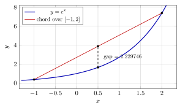
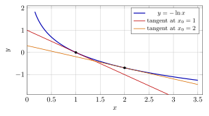
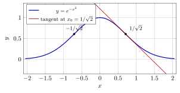

# 第 12 讲　凸函数 — (Convex functions)

第 11 讲的误差公式包含二阶导数。本讲从图像与弦的位置关系出发研究凸性 (convexity)，再证明它与导数符号的联系。

先计算割线斜率，并比较算术平均与几何平均。随后定义凸函数，证明可导情形的判别法，再用支撑线 (supporting line) 推出 Jensen 不等式。将不同函数代入 Jensen，得到加权 AM–GM、幂平均及 Young 不等式。做例题前，请先猜不等号方向并估计两边之差。

## 1 弦、割线斜率与凸的定义 (Chords, secant slopes, and the definition)

> [!WARNING] 先猜一猜 (Guess first) — Two means of three numbers
>
>
> 取三个正数 $1,\ 2,\ 4$。它们的算术平均 (arithmetic mean) 是 $\frac{1+2+4}{3}$，几何平均 (geometric mean) 是 $\sqrt[3]{1\cdot2\cdot4}$。
>
> 先猜：哪个大？大多少？再猜：如果把 $4$ 换成 $40$，两者的*比值*会变大还是变小？
>
> （算出来之前别往下看。答案在本节末尾的第一个例子里，证明在第 5 节。）
>

要比较几何平均与算术平均，可取对数，把乘积化为和。下面研究 $-\ln$ 的图像所满足的凸性条件。

设 $f$ 定义在区间 $I$ 上。对 $I$ 中两个不同的点 $u\ne v$，记
$$
\operatorname{k}(u,v)=\frac{f(v)-f(u)}{v-u}
$$
为 $f$ 在这两点之间的**割线斜率 (secant slope)**。注意 $\operatorname{k}(u,v)=\operatorname{k}(v,u)$：交换两点不改变斜率。割线斜率是本讲唯一的计算工具，它只用到减法和除法，不需要 $f$ 可导，甚至不需要 $f$ 连续。

> [!IMPORTANT] 定义 12.1 — 凸函数 (Convex function)
>
>
> 设 $I\subset\mathbb{R}$ 是区间，$f:I\to\mathbb{R}$。若对 $I$ 中任意三点 $x_1<x_2<x_3$ 都成立
> 
> $$
>   \operatorname{k}(x_1,x_2)\ \le\ \operatorname{k}(x_1,x_3)\ \le\ \operatorname{k}(x_2,x_3),
> $$
> 则称 $f$ 在 $I$ 上**凸 (convex)**。若 [(12.1)](#l12-eq:three-chord) 中的两个不等号都是严格的，则称 $f$ **严格凸 (strictly convex)**。若 $-f$ 凸，则称 $f$ **凹 (concave)**。
>

[(12.1)](#l12-eq:three-chord) 就是"割线斜率随端点右移而变大"这句话的完整写法：固定左端点把右端点往右挪（第一个不等号），或者固定右端点把左端点往右挪（第二个不等号），斜率都只增不减。

> [!NOTE] 注 12.2 — 术语 (Terminology)
>
>
> 中文教材里常把这里的"凸"叫做**下凸**，把"凹"叫做**上凸**；英文文献一律是 convex 与 concave，没有上下之分。本讲只用凸 (convex) 与凹 (concave)，但你在别处读到"下凸"时要知道它说的是同一件事。$f$ 凹 $\iff$ 把 [(12.1)](#l12-eq:three-chord) 里所有 $\le$ 换成 $\ge$。
>

三个割线斜率满足下面的加权平均恒等式，因此只需比较两侧相邻区间的斜率。

> [!NOTE] 引理 12.3 — 长割线是两条短割线的加权平均
>
>
> 设 $x_1<x_2<x_3$ 在 $I$ 中，记 $\lambda=\dfrac{x_2-x_1}{x_3-x_1}\in(0,1)$。则
> $$
> \operatorname{k}(x_1,x_3)=(1-\lambda)\,\operatorname{k}(x_1,x_2)+\lambda\,\operatorname{k}(x_2,x_3).
> $$
>

> [!NOTE] 证明
>
>
> 右端通分：$(1-\lambda)=\frac{x_3-x_2}{x_3-x_1}$，于是
> $$
> (1-\lambda)\operatorname{k}(x_1,x_2)+\lambda\operatorname{k}(x_2,x_3)
> =\frac{x_3-x_2}{x_3-x_1}\cdot\frac{f(x_2)-f(x_1)}{x_2-x_1}+\frac{x_2-x_1}{x_3-x_1}\cdot\frac{f(x_3)-f(x_2)}{x_3-x_2}.
> $$
> 两项各自约掉一个因子，得 $\dfrac{(f(x_2)-f(x_1))+(f(x_3)-f(x_2))}{x_3-x_1}=\dfrac{f(x_3)-f(x_1)}{x_3-x_1}=\operatorname{k}(x_1,x_3)$。
>

一个加权平均总是夹在被平均的两个数之间。所以只要知道 $\operatorname{k}(x_1,x_2)\le\operatorname{k}(x_2,x_3)$，中间那个 $\operatorname{k}(x_1,x_3)$ 自动被夹住，[(12.1)](#l12-eq:three-chord) 的两个不等号同时成立。这就是下面这个命题里"三个条件是一个"的来源。

> [!NOTE] 命题 12.4 — 凸的三种说法 (Three formulations)
>
>
> 设 $f$ 定义在区间 $I$ 上。考虑三个条件：
>
> 1.  （割线斜率单调）对任意 $x_1<x_2<x_3$ 成立 [(12.1)](#l12-eq:three-chord)；
>
> 2.  （弦在图上方，chord above the graph）对任意 $x,y\in I$ 与任意 $\lambda\in[0,1]$，
>     
>     $$
>       f\bigl((1-\lambda)x+\lambda y\bigr)\ \le\ (1-\lambda)f(x)+\lambda f(y);
>     $$
>
> 3.  （中点凸，midpoint convexity）对任意 $x,y\in I$，$f\bigl(\frac{x+y}2\bigr)\le\frac{f(x)+f(y)}2$。
>
> 则 (i) $\iff$ (ii) $\Rightarrow$ (iii)；若再假设 $f$ 在 $I$ 上连续 (continuous)，则 (iii) $\Rightarrow$ (ii)，三者等价。
>

> [!NOTE] 证明
>
>
> **(i) $\Rightarrow$ (ii)。**$\lambda=0,1$ 时 [(12.2)](#l12-eq:chord) 是等式。设 $x<y$，$\lambda\in(0,1)$，令 $z=(1-\lambda)x+\lambda y$，则 $x<z<y$ 且 $\lambda=\frac{z-x}{y-x}$。由 $\operatorname{k}(x,z)\le\operatorname{k}(x,y)$ 得
> $$
> \frac{f(z)-f(x)}{z-x}\le\frac{f(y)-f(x)}{y-x}
>   \ \Longrightarrow\
>   f(z)-f(x)\le\lambda\bigl(f(y)-f(x)\bigr),
> $$
> （两边同乘正数 $z-x$，并用 $\frac{z-x}{y-x}=\lambda$），即 $f(z)\le(1-\lambda)f(x)+\lambda f(y)$。$x>y$ 的情形把 $\lambda$ 换成 $1-\lambda$ 即可。
>
> **(ii) $\Rightarrow$ (i)。**设 $x_1<x_2<x_3$，取 $\lambda=\frac{x_2-x_1}{x_3-x_1}$，则 $x_2=(1-\lambda)x_1+\lambda x_3$，[(12.2)](#l12-eq:chord) 给出 $f(x_2)\le(1-\lambda)f(x_1)+\lambda f(x_3)$。把它整理一下：两边减 $f(x_1)$ 得 $f(x_2)-f(x_1)\le\lambda(f(x_3)-f(x_1))$，除以 $x_2-x_1=\lambda(x_3-x_1)>0$，得 $\operatorname{k}(x_1,x_2)\le\operatorname{k}(x_1,x_3)$。再由引理 [12.3](#l12-lem:avg)，$\operatorname{k}(x_1,x_3)$ 是 $\operatorname{k}(x_1,x_2)$ 与 $\operatorname{k}(x_2,x_3)$ 的加权平均，既然它 $\ge$ 前者，就必 $\le$ 后者。[(12.1)](#l12-eq:three-chord) 得证。
>
> **(ii) $\Rightarrow$ (iii)** 是取 $\lambda=\frac12$。
>
> **(iii) $+$ 连续 $\Rightarrow$ (ii)。**先对二进有理数 (dyadic rationals) $\lambda=j/2^m$ 用 $m$ 归纳。$m=1$ 即 (iii)。设 [(12.2)](#l12-eq:chord) 对一切分母为 $2^m$ 的 $\lambda$ 与一切 $x,y\in I$ 成立。取 $\lambda=j/2^{m+1}$，$j$ 为奇数，$0<j<2^{m+1}$。令 $\lambda^-=\frac{j-1}{2^{m+1}}$，$\lambda^+=\frac{j+1}{2^{m+1}}$，两者分母约分后都是 $2^m$ 的因子形式，故归纳假设适用；又 $\lambda=\frac{\lambda^-+\lambda^+}2$。记 $z^\pm=(1-\lambda^\pm)x+\lambda^\pm y$，则 $(1-\lambda)x+\lambda y=\frac{z^-+z^+}{2}$，于是
> $$
> \begin{aligned}
>   f\Bigl(\frac{z^-+z^+}2\Bigr)&\le\frac{f(z^-)+f(z^+)}2
>   \\&\le\frac{\bigl[(1-\lambda^-)+(1-\lambda^+)\bigr]f(x)+\bigl[\lambda^-+\lambda^+\bigr]f(y)}{2}
>   \\&=(1-\lambda)f(x)+\lambda f(y).
> \end{aligned}
> $$
> 第一步用 (iii)，第二步用归纳假设。归纳完成。最后，二进有理数在 $[0,1]$ 中稠密 (dense)，而 $\lambda\mapsto f((1-\lambda)x+\lambda y)$ 与 $\lambda\mapsto(1-\lambda)f(x)+\lambda f(y)$ 都是 $\lambda$ 的连续函数，一个处处 $\le$ 另一个的关系在稠密子集上成立就在整个 $[0,1]$ 上成立（第 7 讲关于连续函数取极限保持不等号的讨论）。
>

> [!NOTE] 注 12.5
>
>
> 由中点凸性推出凸性时，这里使用了连续性。不能因为函数有显式表达式就略去这项检查；应用该判别法时应分别验证中点不等式与连续性。
>

下面先把定义*当成算法*用一次：给一个函数，直接列割线斜率表看它单不单调。这是本讲所有理论之前应该先做的事。

> [!NOTE] 词语提示
>
>
> *consecutive*：相邻的；*derivative*：导数；*convexity*：凸性；*endpoint*：端点；*strictly*：严格地；*concave*：凹的；*secant*：割线。
>

> [!NOTE] Example 12.6 — Reading convexity off a table of secant slopes
>
>
> Take $f(x)=e^x$ and the nodes $-1,-0.5,0,0.5,1,1.5,2$. The secant slopes of consecutive nodes are
>
> | $[u,v]$ | $[-1,-0.5]$ | $[-0.5,0]$ | $[0,0.5]$ | $[0.5,1]$ | $[1,1.5]$ | $[1.5,2]$ |
> |:---|---:|---:|---:|---:|---:|---:|
> | $\operatorname{k}(u,v)$ | $0.477302$ | $0.786939$ | $1.297443$ | $2.139121$ | $3.526814$ | $5.814734$ |
>
> Strictly increasing. But the definition asks for more than consecutive nodes, so test the two moves separately. Fix the left endpoint at $0$ and push the right one out:
>
> | $v$ | $0.25$ | $0.5$ | $1$ | $1.5$ | $2$ | $3$ |
> |:---|---:|---:|---:|---:|---:|---:|
> | $\operatorname{k}(0,v)$ | $1.136102$ | $1.297443$ | $1.718282$ | $2.321126$ | $3.194528$ | $6.361846$ |
>
> Fix the right endpoint at $2$ and push the left one right:
>
> | $u$ | $-1$ | $-0.5$ | $0$ | $0.5$ | $1$ | $1.5$ |
> |:---|---:|---:|---:|---:|---:|---:|
> | $\operatorname{k}(u,2)$ | $2.340392$ | $2.713010$ | $3.194528$ | $3.826890$ | $4.670774$ | $5.814734$ |
>
> Both columns increase, as the definition demands. A table is of course not a proof — it tests finitely many triples — but it is the right first move: it tells you *which way to guess*.
>
> Now the same test on $g(x)=\sin x$ over $[0,\pi]$:
> $$
> \operatorname{k}(0,1)=0.841471,\qquad \operatorname{k}(1,2)=0.067826,\qquad \operatorname{k}(2,3)=-0.768177 .
> $$
> Decreasing, and decisively so. So $\sin$ is not convex on $[0,\pi]$; the table suggests it is concave there, and in §2 we will confirm it in one line. Note how cheap the diagnosis was: three subtractions and three divisions, no derivative.
>

把 $\operatorname{k}(x_1,x_2)\le\operatorname{k}(x_1,x_3)$ 乘开，得到的正是命题 [12.4](#l12-prop:three) 里的 [(12.2)](#l12-eq:chord)：*弦落在图像上方*。这是凸性最容易记住的画面，下面这张图就是它。

图中要看的是那条虚线段：在 $x=0.5$ 处，弦的高度是 $3.878468$，曲线的高度是 $e^{0.5}=1.648721$，差 $2.229746$。凸性说的就是这段虚线*永远向上*。在 $[-1,2]$ 内任何位置取，弦都不会掉到曲线下面。下一个例子把三个位置的这个差算出来，让你看到它是怎么随位置变化的。

> [!NOTE] 词语提示
>
>
> *midpoint*：中点；*maximum*：最大值；*chord*：弦；*gap*：两项之差的绝对值。
>

> [!NOTE] Example 12.7 — How big is the gap?
>
>
> For $f(x)=e^x$ on $[-1,2]$, write $z=(1-t)\cdot(-1)+t\cdot 2$ and compare the chord height with $f(z)$:
>
> |    $t$ |               $z$ | chord height |     $f(z)$ |
> |---------:|--------------------:|-------------:|-------------:|
> | $0.25$ |           $-0.25$ | $2.123174$ | $0.778801$ |
> | $0.50$ | $\phantom{-}0.50$ | $3.878468$ | $1.648721$ |
> | $0.75$ | $\phantom{-}1.25$ | $5.633762$ | $3.490343$ |
>
> The gaps are $1.344373$, $2.229746$, $2.143419$: positive everywhere, largest near the middle, and shrinking to $0$ at both ends (where chord and graph meet). Two things to take away. First, the gap is a *quantity*, not just a sign — §4’s AI Lab will study its size systematically. Second, the maximum gap is not at $t=0.5$ here; it sits a little to the right of the midpoint, because $e^x$ bends much harder on the right. Convexity fixes the sign of the gap and says nothing about where it peaks.
>

这个"差"现在还只是一个观察。它的第一个用处马上就到：本节开头那个关于三个数的猜测，就是同一个差在 $-\ln$ 上的表现。

> [!NOTE] 词语提示
>
>
> *geometric*：等比的；*ratio*：比值。
>

> [!NOTE] Example 12.8 — The guess, settled numerically
>
>
> Back to $1,2,4$. The arithmetic mean is $\frac{7}{3}=2.333333$ and the geometric mean is $\sqrt[3]{8}=2$ exactly. So $\mathrm{AM}-\mathrm{GM}=0.333333$ and $\mathrm{AM}/\mathrm{GM}=1.166667$. Replacing $4$ by $40$: $\mathrm{AM}=\frac{43}{3}=14.333333$, $\mathrm{GM}=\sqrt[3]{80}=4.308869$, ratio $3.326472$ — the ratio grew, and grew a lot. The spread of the numbers is what drives the gap; this is the numerical shadow of a second-order phenomenon we will pin down in §4.
>

上面的数值比较提示凸性。下一节在可导的条件下给出导数判别法。

## 可导时的三个判别 (Three tests when $f$ is differentiable)

上一节的定义完全不提导数，这是优点（适用面广）也是缺点（验证起来要检查无穷多个三元组）。这一节把第 10 讲的中值定理 (Mean Value Theorem) 接进来，把凸性换成三个一眼可查的条件。先猜一个。

> [!WARNING] 先猜一猜 (Guess first) — 两种平均，差多少
>
>
> 对两个正数 $a,b$，比较*平方平均* (quadratic mean) $\sqrt{\dfrac{a^2+b^2}2}$ 与算术平均 $\dfrac{a+b}2$。
>
> 先猜方向：哪个大？再猜大小：取 $a=1,b=9$，两者相差多少？$0.1$ 量级？$1$ 量级？$10$ 量级？
>
> 写下你的两个猜测，再看本节的第二个例子。
>

> [!NOTE] 定理 12.9 — 可导函数的凸性判别 (Convexity tests for differentiable functions)
>
>
> 设 $f$ 在区间 $I$ 上可导 (differentiable)。则以下三条等价：
>
> 1.  $f$ 在 $I$ 上凸 (convex)；
>
> 2.  $f'$ 在 $I$ 上单调递增 (increasing，允许相等)；
>
> 3.  对任意 $x_0,x\in I$，$f(x)\ \ge\ f(x_0)+f'(x_0)(x-x_0)$，即*图像落在每一条切线 (tangent line) 的上方*。
>
> 把三条中的"$\le/\ge$"全部换成严格不等（$x\ne x_0$ 时），并把 (b) 换成"$f'$ 严格递增"，则三条仍然等价，刻画的是严格凸 (strictly convex)。
>

> [!NOTE] 证明
>
>
> **(a) $\Rightarrow$ (b)。**设 $x_1<x_2$ 同属 $I$。对任意 $t\in(x_1,x_2)$，由 [(12.1)](#l12-eq:three-chord)（取三点 $x_1<t<x_2$）得
> $$
> \operatorname{k}(x_1,t)\ \le\ \operatorname{k}(x_1,x_2)\ \le\ \operatorname{k}(t,x_2).
> $$
> 令 $t\to x_1^+$，左端的差商 (difference quotient) 趋于 $f'(x_1)$，得 $f'(x_1)\le\operatorname{k}(x_1,x_2)$；令 $t\to x_2^-$，右端趋于 $f'(x_2)$，得 $\operatorname{k}(x_1,x_2)\le f'(x_2)$。两式合并即 $f'(x_1)\le f'(x_2)$。
>
> **(b) $\Rightarrow$ (c)。**设 $x>x_0$。由第 10 讲的 Lagrange 中值定理 (Lagrange’s Mean Value Theorem)，存在 $\xi\in(x_0,x)$ 使 $f(x)-f(x_0)=f'(\xi)(x-x_0)$。因 $\xi>x_0$ 而 $f'$ 递增，$f'(\xi)\ge f'(x_0)$；又 $x-x_0>0$，故 $f(x)-f(x_0)\ge f'(x_0)(x-x_0)$。设 $x<x_0$。同样取 $\xi\in(x,x_0)$，此时 $f'(\xi)\le f'(x_0)$ 而 $x-x_0<0$，乘上去不等号翻转，仍得 $f(x)-f(x_0)\ge f'(x_0)(x-x_0)$。$x=x_0$ 时是等式。
>
> **(c) $\Rightarrow$ (a)。**设 $x_1<x_2<x_3$。在 (c) 中取 $x_0=x_2$：
> $$
> f(x_1)\ge f(x_2)+f'(x_2)(x_1-x_2)\ \Longrightarrow\ \operatorname{k}(x_1,x_2)=\frac{f(x_2)-f(x_1)}{x_2-x_1}\le f'(x_2),
> $$
> （把 $f(x_2)$ 移到左边，再除以 $x_2-x_1>0$；注意 $x_1-x_2<0$），以及
> $$
> f(x_3)\ge f(x_2)+f'(x_2)(x_3-x_2)\ \Longrightarrow\ \operatorname{k}(x_2,x_3)\ge f'(x_2).
> $$
> 于是 $\operatorname{k}(x_1,x_2)\le f'(x_2)\le\operatorname{k}(x_2,x_3)$，再由引理 [12.3](#l12-lem:avg)，$\operatorname{k}(x_1,x_3)$ 被夹在这两者之间，[(12.1)](#l12-eq:three-chord) 成立。
>
> 严格的情形：上面每一步的不等号在 $f'$ 严格递增时都变成严格的（(b) $\Rightarrow$ (c) 中 $f'(\xi)>f'(x_0)$ 当 $\xi\ne x_0$），逐条照抄即可。
>

> [!NOTE] 推论 12.10 — 二阶判别 (The second-derivative test)
>
>
> 设 $f$ 在区间 $I$ 上二阶可导 (twice differentiable)。则
> $$
> f\ \text{在}\ I\ \text{上凸 (convex)}\iff f''(x)\ge0\ \text{对一切}\ x\in I.
> $$
> 若 $f''>0$ 在 $I$ 上处处成立，则 $f$ 严格凸 (strictly convex)；反之不真。
>

> [!NOTE] 证明
>
>
> 由定理 [12.9](#l12-thm:diff)，凸 $\iff$ $f'$ 递增；而由第 10 讲中值定理的单调性判别，可导函数 $f'$ 递增 $\iff$ $(f')'=f''\ge0$。若 $f''>0$ 则 $f'$ 严格递增，故 $f$ 严格凸。反例说明"反之不真"：$f(x)=x^4$ 在 $\mathbb{R}$ 上严格凸（$f'=4x^3$ 严格递增），但 $f''(0)=0$。
>

> [!NOTE] 注 12.11
>
>
> 请注意三条判别的分工。(a) 是**定义**，最原始、最广（不要求可导）；(b) 是**证明凸性**时最好用的（只要看 $f'$ 单调，或者直接看 $f''$ 的符号）；(c) 是**使用凸性**时最好用的。它给出一个对所有 $x$ 都成立的下界，而"一个到处成立的下界"正是不等式的原料。第 4、5 节全部靠 (c)。
>

下面列出后续不等式所用函数的二阶导数及其符号。

> [!NOTE] 词语提示
>
>
> *sanity check*：合理性检查；*continuity*：连续性；*convex*：凸的。
>

> [!NOTE] Example 12.12 — The working library
>
>
> **(a) $f(x)=e^x$ on $\mathbb{R}$.** $f''(x)=e^x>0$: strictly convex on all of $\mathbb{R}$. This is the source of Young’s inequality (§5).
>
> **(b) $f(x)=-\ln x$ on $(0,\infty)$.** $f'(x)=-1/x$, $f''(x)=1/x^2>0$: strictly convex. Equivalently $\ln x$ is strictly concave. This is the source of AM–GM (§5).
>
> **(c) $f(x)=x^p$ on $(0,\infty)$.** $f''(x)=p(p-1)x^{p-2}$. The sign of $f''$ is the sign of $p(p-1)$, so
> $$
> p\ge1\ \text{or}\ p\le 0\ \Rightarrow\ \text{convex};\qquad 0<p<1\ \Rightarrow\ \text{concave}.
> $$
> A numerical sanity check on $[1,4]$ with midpoint $2.5$:
>
> | $p$   |    $f(2.5)$ | chord height at $2.5$ | chord $-\,f$ |
> |:--------|--------------:|------------------------:|---------------:|
> | $0.5$ |  $1.581139$ |            $1.500000$ |  $-0.081139$ |
> | $1.5$ |  $3.952847$ |            $4.500000$ |  $+0.547153$ |
> | $3$   | $15.625000$ |           $32.500000$ | $+16.875000$ |
>
> The sign of the last column flips exactly where $p$ crosses $1$, as predicted. $x^p$ is the source of the power-mean inequality (§5).
>
> **(d) $f(x)=x\ln x$ on $(0,\infty)$.** $f'(x)=\ln x+1$, $f''(x)=1/x>0$: strictly convex. (At $x\to0^+$ we set $f(0)=0$ by continuity; $f$ is then convex on $[0,\infty)$.) This function is the engine behind entropy inequalities; Exercise **12.6** uses it.
>
> **(e) $f(x)=\sqrt{1+x^2}$ on $\mathbb{R}$.** Here
> $$
> f'(x)=\frac{x}{\sqrt{1+x^2}},\qquad
>   f''(x)=\frac{\sqrt{1+x^2}-x\cdot\frac{x}{\sqrt{1+x^2}}}{1+x^2}=\frac{1}{(1+x^2)^{3/2}}>0 ,
> $$
> strictly convex on all of $\mathbb{R}$. Values of $f''$: $1.000000$ at $x=0$, $0.715542$ at $x=0.5$, $0.353553$ at $x=1$, $0.089443$ at $x=2$, $0.031623$ at $x=3$. The function is convex everywhere but becomes very nearly straight for large $|x|$ — which is visible in the graph ($f(x)\to|x|$) and is exactly what the shrinking $f''$ says. *Convex* and *strongly curved* are not the same adjective.
>
> **(f) Not convex: $\sin$ on $[0,\pi]$.** $f''=-\sin x\le0$ there, so $\sin$ is concave on $[0,\pi]$ — confirming the table in §1 — and convex on $[\pi,2\pi]$. On all of $\mathbb{R}$ it is neither.
>

对 $x^p$，指数 $p$ 的范围决定二阶导数的符号，因而决定凸凹性及不等号方向。

> [!NOTE] 词语提示
>
>
> *quadratic*：二次的；*estimate*：估计。
>

> [!NOTE] Example 12.13 — Quadratic mean versus arithmetic mean
>
>
> Apply the chord inequality [(12.2)](#l12-eq:chord) with $\lambda=\frac12$ to the convex function $f(t)=t^2$:
> $$
> \Bigl(\frac{a+b}2\Bigr)^{2}\le\frac{a^2+b^2}{2}
>   \qquad\Longrightarrow\qquad
>   \frac{a+b}2\le\sqrt{\frac{a^2+b^2}2}\quad(a,b\ge0).
> $$
> So the quadratic mean always wins. Now the size. For $a=1$, $b=9$:
> $$
> \sqrt{\frac{1+81}{2}}=\sqrt{41}=6.403124,\qquad \frac{1+9}{2}=5,\qquad \text{difference }1.403124 .
> $$
> That is an $O(1)$ gap, not an $O(0.1)$ one — if you guessed "a little bit", the guess was wrong, and the reason is worth naming. Compare three pairs with the *same* arithmetic mean $5$:
>
> | $(a,b)$      |    $(4,6)$ |    $(1,9)$ | $(0.5,9.5)$ |
> |:---------------|-------------:|-------------:|--------------:|
> | quadratic mean | $5.099020$ | $6.403124$ |  $6.726812$ |
> | difference     | $0.099020$ | $1.403124$ |  $1.726812$ |
>
> The gap is controlled by the *spread*, not by the size of the numbers: a direct computation gives $\bigl(\frac{a^2+b^2}{2}\bigr)-\bigl(\frac{a+b}{2}\bigr)^2=\bigl(\frac{a-b}{2}\bigr)^2$ exactly, which is $1$, $16$, $20.25$ in the three columns. Spread squared: remember this, it is the shape of every gap estimate in §4.
>

判别 (c) 说图在每条切线上方。把这句话画出来，就是下一节支撑线的原型；先看两条切线。

图里要看的是：两条直线都*整条*压在曲线下面，只在切点碰一下。把 $x_0=1$ 那条写出来就是 $-\ln x\ge 1-x$，也就是人人都背过的 $\ln x\le x-1$。它不是一个孤立的技巧，它只是"$-\ln$ 是凸的"这句话在一个点上的投影。下表给出这个投影的实际数值。

> [!NOTE] 词语提示
>
>
> *tangent*：切线。
>

> [!NOTE] Example 12.14 — $\ln x\le x-1$, and what it is worth
>
>
> The tangent at $x_0=1$ to the convex function $-\ln$ gives $\ln x\le x-1$ for all $x>0$, with equality only at $x=1$. The slack:
>
> | $x$ | $0.5$ | $0.8$ | $1$ | $1.5$ | $2$ | $3$ |
> |:---|---:|---:|---:|---:|---:|---:|
> | $(x-1)-\ln x$ | $0.193147$ | $0.023144$ | $0$ | $0.094535$ | $0.306853$ | $0.901388$ |
>
> The slack vanishes at $x=1$ and grows on both sides. Near $x=1$ it grows *quadratically*: writing $x=1\pm h$, the slack at $h=0.2$ is $0.0231436$ and $0.0176784$, at $h=0.1$ it is $0.0053605$ and $0.0046898$, at $h=0.05$ it is $0.0012933$ and $0.0012098$ — in every row the two values straddle $h^2/2$ ($0.02$, $0.005$, $0.00125$), and they close in on it as $h$ shrinks. Far from $1$ the slack grows only linearly. Already this one line proves AM–GM for two numbers: put $x=a/b$ with $a,b>0$, so $\ln a-\ln b\le a/b-1$. A cleaner route, and the one that generalises, is in §5.
>

请记住表里的那个规律：*切线与曲线的缝隙在切点附近是二阶小的*。第 4 节的 AI Lab 会把这个二阶再量一次，第 13 讲把它写成定理。

## 2 开区间上的凸函数:连续与单侧导数 (Convex functions on open intervals)

即使不预先假设连续或可导，开区间上的凸函数也有以下性质。

> [!NOTE] 命题 12.15 — 凸函数的自动正则性 (Automatic regularity)
>
>
> 设 $f$ 在开区间 (open interval) $(a,b)$ 上凸，$x_0\in(a,b)$。则
>
> 1.  左导数 (left derivative) $f'_-(x_0)$ 与右导数 (right derivative) $f'_+(x_0)$ 都存在且有限，且 $f'_-(x_0)\le f'_+(x_0)$；
>
> 2.  $f$ 在 $(a,b)$ 的每个闭子区间上是 Lipschitz 的，特别地 $f$ 在 $(a,b)$ 上连续 (continuous)；
>
> 3.  $x<y$ 时 $f'_+(x)\le\operatorname{k}(x,y)\le f'_-(y)$，于是 $f'_-$ 与 $f'_+$ 都在 $(a,b)$ 上递增。
>

> [!NOTE] 证明
>
>
> 固定 $x_0$，取 $w,W$ 使 $a<w<x_0<W<b$。
>
> \(1\) 由定义，$v\mapsto\operatorname{k}(x_0,v)$ 在 $v>x_0$ 上递增（这正是 [(12.1)](#l12-eq:three-chord) 的第一个不等号，取三点 $x_0<v<v'$）；又对任意 $v\in(x_0,W)$，把 $w<x_0<v$ 代入 [(12.1)](#l12-eq:three-chord) 得 $\operatorname{k}(w,x_0)\le\operatorname{k}(x_0,v)$。所以 $\{\operatorname{k}(x_0,v):v\in(x_0,W)\}$ 是有下界的集合，它的下确界 (infimum) 存在（这里用到确界存在，那张欠条自第 3 讲起就记着，第 14 讲一起还）。记这个下确界为 $A$；由 $\operatorname{k}(x_0,v)$ 关于 $v$ 递增，$v\to x_0^+$ 时 $\operatorname{k}(x_0,v)\downarrow A$，即 $f'_+(x_0)=A$ 存在且 $\ge\operatorname{k}(w,x_0)$。同理 $u\mapsto\operatorname{k}(u,x_0)$ 在 $u<x_0$ 上递增且以 $\operatorname{k}(x_0,W)$ 为上界，故 $f'_-(x_0)$ 存在。最后，对 $u<x_0<v$ 有 $\operatorname{k}(u,x_0)\le\operatorname{k}(x_0,v)$，两边分别取 $u\to x_0^-$、$v\to x_0^+$ 的极限，得 $f'_-(x_0)\le f'_+(x_0)$。
>
> \(2\) 取 $[c,d]\subset(a,b)$，再取 $a<w<c$ 与 $d<W<b$。对 $c\le u<v\le d$，把五个点 $w<u<v<W$ 中的三元组代入 [(12.1)](#l12-eq:three-chord) 两次，得
> $$
> \operatorname{k}(w,c)\ \le\ \operatorname{k}(w,u)\ \le\ \operatorname{k}(u,v)\ \le\ \operatorname{k}(v,W)\ \le\ \operatorname{k}(d,W).
> $$
> 令 $M=\max\{|\operatorname{k}(w,c)|,\ |\operatorname{k}(d,W)|\}$，则 $|\operatorname{k}(u,v)|\le M$，即 $|f(v)-f(u)|\le M|v-u|$：$f$ 在 $[c,d]$ 上以 $M$ 为 Lipschitz 常数，因而连续。由于 $[c,d]$ 任取，$f$ 在 $(a,b)$ 上连续。
>
> \(3\) 对 $x<t<y$，[(12.1)](#l12-eq:three-chord) 给 $\operatorname{k}(x,t)\le\operatorname{k}(x,y)\le\operatorname{k}(t,y)$；令 $t\to x^+$ 得 $f'_+(x)\le\operatorname{k}(x,y)$，令 $t\to y^-$ 得 $\operatorname{k}(x,y)\le f'_-(y)$。于是 $x<y$ 时 $f'_+(x)\le f'_-(y)\le f'_+(y)$，两个单侧导函数都递增。
>

> [!NOTE] 注 12.16
>
>
> "开"字不能去掉。在闭区间 $[0,1]$ 上定义 $f(0)=1$、$f(x)=0\ (0<x\le1)$，逐个验证 [(12.2)](#l12-eq:chord) 可知 $f$ 是凸的，但它在端点 $0$ 处不连续。凸性只管住内部，端点可以往上跳（往下跳则会破坏凸性）。
>

> [!NOTE] 注 12.17
>
>
> 命题 [12.15](#l12-prop:reg)(1) 允许 $f'_-(x_0)<f'_+(x_0)$，即图像可以有"角"。最简单的例子是 $f(x)=|x|$：它在 $\mathbb{R}$ 上凸（三点不等式直接验证），而 $f'_-(0)=-1<1=f'_+(0)$。所以*凸函数不一定可导*，但由 (3)，不可导的点处两个单侧导数仍然夹着一整段斜率 $[f'_-(x_0),f'_+(x_0)]$ 可供使用。下一节的支撑线就从这一段里挑一个斜率。
>

## 3 支撑线与 Jensen 不等式 (Supporting lines and Jensen’s inequality)

定理 [12.9](#l12-thm:diff)(c) 说：可导时图像在每条切线上方。命题 [12.15](#l12-prop:reg) 说：不可导时"切线"虽然不唯一，却仍然有一整族直线能起同样的作用。给它一个名字。

> [!IMPORTANT] 定义 12.18 — 支撑线 (Supporting line)
>
>
> 设 $f$ 在区间 $I$ 上有定义，$x_0\in I$。若直线 $\ell(x)=f(x_0)+c\,(x-x_0)$ 满足
> $$
> f(x)\ \ge\ \ell(x)\qquad\text{对一切 } x\in I,
> $$
> 则称 $\ell$ 是 $f$ 在 $x_0$ 处的一条**支撑线 (supporting line)**，$c$ 称为一个**支撑斜率 (supporting slope)**。
>

仿射函数满足 $\ell(\sum\lambda_ix_i)=\sum\lambda_i\ell(x_i)$。在加权平均点处取支撑线，再对各点的支撑不等式加权求和，即可得到 Jensen 不等式。

> [!NOTE] 命题 12.19 — 支撑线的存在性 (Existence)
>
>
> 设 $f$ 在区间 $I$ 上凸，$x_0$ 是 $I$ 的内点 (interior point)。则任何满足 $f'_-(x_0)\le c\le f'_+(x_0)$ 的 $c$ 都是支撑斜率；特别地，支撑线存在。若 $f$ 在 $x_0$ 可导，唯一的选择是 $c=f'(x_0)$，支撑线就是切线。
>

> [!NOTE] 证明
>
>
> 设 $x>x_0$。由命题 [12.15](#l12-prop:reg)(3)（取 $x_0<x$）有 $\operatorname{k}(x_0,x)\ge f'_+(x_0)\ge c$，两边乘以 $x-x_0>0$ 得 $f(x)-f(x_0)\ge c(x-x_0)$。设 $x<x_0$。同理 $\operatorname{k}(x,x_0)\le f'_-(x_0)\le c$，两边乘以 $x_0-x>0$ 得 $f(x_0)-f(x)\le c(x_0-x)$，移项即 $f(x)\ge f(x_0)+c(x-x_0)$。$x=x_0$ 时取等。
>

> [!WARNING] 先猜一猜 (Guess first) — Jensen 的方向
>
>
> 设 $f$ 凸，$x_1,\dots,x_n$ 是 $I$ 中的点，$\lambda_1,\dots,\lambda_n\ge0$ 且 $\sum\lambda_i=1$。记 $\bar x=\sum\lambda_ix_i$。
>
> 先猜：$f(\bar x)$ 与 $\sum\lambda_if(x_i)$ 哪个大？（提示：$n=2$ 时这就是 [(12.2)](#l12-eq:chord)，先在那里看清楚方向，再推广。）
>
> 再猜：取 $f=-\ln$，五个点 $0.4,\ 1.2,\ 2.5,\ 4.0,\ 7.5$，权重 $0.10,\ 0.25,\ 0.30,\ 0.20,\ 0.15$，两边差多少？量级是 $0.01$、$0.1$ 还是 $1$？
>

> [!NOTE] 定理 12.20 — Jensen 不等式，有限形式 (Jensen's inequality, finite form)
>
>
> 设 $f$ 在区间 $I$ 上凸 (convex)，$x_1,\dots,x_n\in I$，$\lambda_1,\dots,\lambda_n\ge0$ 且 $\sum_{i=1}^n\lambda_i=1$。则 $\bar x:=\sum_{i=1}^n\lambda_ix_i\in I$，并且
> 
> $$
>   f\Bigl(\sum_{i=1}^n\lambda_ix_i\Bigr)\ \le\ \sum_{i=1}^n\lambda_i f(x_i).
> $$
> 若 $f$ 严格凸 (strictly convex)，则等号成立 if and only if 所有满足 $\lambda_i>0$ 的 $x_i$ 彼此相等。$f$ 凹时不等号反向。
>

> [!NOTE] 证明
>
>
> $\bar x$ 介于 $\min x_i$ 与 $\max x_i$ 之间，故属于区间 $I$。
>
> 若 $\bar x$ 是 $I$ 的内点：取 $f$ 在 $\bar x$ 处的一条支撑线 $\ell$（命题 [12.19](#l12-prop:support)）。对每个 $i$ 有 $f(x_i)\ge\ell(x_i)$；乘以 $\lambda_i\ge0$ 并求和，再用 $\ell$ 是仿射函数：
> $$
> \sum_i\lambda_if(x_i)\ \ge\ \sum_i\lambda_i\ell(x_i)\ =\ \ell\Bigl(\sum_i\lambda_ix_i\Bigr)\ =\ \ell(\bar x)\ =\ f(\bar x).
> $$
> 若 $\bar x$ 是 $I$ 的端点，则所有 $\lambda_i>0$ 的 $x_i$ 必须都等于 $\bar x$（否则加权平均会落进内部），[(12.3)](#l12-eq:jensen) 取等。
>
> 等号的讨论：设 $f$ 严格凸且等号成立。上面的推导中唯一可能"丢掉"的正是 $\sum\lambda_i\bigl(f(x_i)-\ell(x_i)\bigr)=0$；每一项非负，故 $\lambda_i>0$ 时必有 $f(x_i)=\ell(x_i)$。但严格凸时支撑线只在切点与图像相交。若 $x_i\ne\bar x$ 而 $f(x_i)=\ell(x_i)$，则 $f$ 在 $x_i$ 与 $\bar x$ 之间与直线重合，与严格凸矛盾。故所有这样的 $x_i$ 都等于 $\bar x$。反之显然。
>

> [!NOTE] 注 12.21
>
>
> 第 17 讲将对同一个支撑不等式积分，得到 Jensen 不等式的积分形式。
>

动手之前先把定理在一组具体的数上跑一遍，顺便兑现刚才那个关于量级的猜测。

> [!NOTE] 词语提示
>
>
> *weighted*：加权的；*weights*：权重。
>

> [!NOTE] Example 12.22 — Jensen, checked
>
>
> Take $f=-\ln$ (strictly convex on $(0,\infty)$ — item (b) of the working library in §2), the five points $0.4,\,1.2,\,2.5,\,4.0,\,7.5$ and the weights $0.10,\,0.25,\,0.30,\,0.20,\,0.15$ (they sum to $1$). Then
> $$
> \bar x=\sum\lambda_ix_i=3.015000,\qquad f(\bar x)=-\ln 3.015=-1.103600,
> $$
> $$
> \sum\lambda_i f(x_i)=-\sum\lambda_i\ln x_i=-0.808333 .
> $$
> Indeed $-1.103600\le-0.808333$, with gap $0.295267$. Exponentiating, the same statement reads
> $$
> \prod x_i^{\lambda_i}=2.244164\ \le\ 3.015000=\sum\lambda_ix_i ,
> $$
> i.e. weighted AM–GM, gap $0.770836$, ratio $1.343485$. So one application of Jensen to $-\ln$ has already produced the inequality we guessed at in §1. §5 does it in general.
>

上面这一次验证只是一个点。下面的实验把它做成一千次，并且顺手量出"差有多大"。那个量会在第 13 讲被解释清楚。

> [!NOTE] 词语提示
>
>
> *uniformly*：一致地；*factor*：因子；*shrink*：缩小；*width*：宽度；*tail*：从某项开始的尾段。
>

> [!NOTE] AI Lab — Jensen's gap: sign, size, and what governs it
>
>
> Work with $f(x)=-\ln x$ on $(0,\infty)$ and the *Jensen gap*
> $$
> D=\sum_{i=1}^{5}\lambda_i f(x_i)-f\Bigl(\sum_{i=1}^{5}\lambda_ix_i\Bigr).
> $$
>
> **Part 1 (sign).** Ask the AI to run $1000$ trials: in each trial draw $x_1,\dots,x_5$ uniformly from $[0.5,5]$, draw five uniform numbers on $(0,1)$ and normalise them to weights $\lambda_i$, then compute $D$. Report how many trials gave $D<0$, and plot a histogram of $D$.
>
> One run (Python’s `random`, seed $12$) gave: **0 negatives**; $\min D=0.00029$, $\max D=0.415283$, mean $0.112389$, median $0.094169$; counts in bins of width $0.1$:
>
> | bin   | $[0,0.1)$ | $[0.1,0.2)$ | $[0.2,0.3)$ | $[0.3,0.4)$ | $[0.4,0.5)$ |
> |:------|------------:|--------------:|--------------:|--------------:|--------------:|
> | count |     $530$ |       $324$ |       $114$ |        $30$ |         $2$ |
>
> Your numbers will differ (different random draws), but the count of negatives must be $0$ and the shape must be the same: piled up near $0$, with a thin tail. *Question 1: why is the distribution so lopsided — what do the trials with $D$ near $0$ have in common?*
>
> **Part 2 (size).** Now shrink the window: draw the $x_i$ from $[2-s,2+s]$ and let $s$ decrease. For each $s$, average $D$ over $2000$ trials, and also average the quantity
> $$
> P=\tfrac12\,f''(\bar x)\sum_i\lambda_i(x_i-\bar x)^2=\frac{1}{2\bar x^{2}}\sum_i\lambda_i(x_i-\bar x)^2 .
> $$
> One run (seed $7$) gave:
>
> | $s$ | $1.0$ | $0.5$ | $0.2$ | $0.1$ | $0.05$ | $0.02$ |
> |:---|---:|---:|---:|---:|---:|---:|
> | mean $D$ | $0.033298$ | $0.007706$ | $0.001209$ | $0.000301$ | $0.0000753$ | $0.0000120$ |
> | mean $P$ | $0.031946$ | $0.007644$ | $0.001208$ | $0.000301$ | $0.0000753$ | $0.0000120$ |
> | ratio | $1.0423$ | $1.0081$ | $1.0007$ | $1.0000$ | $0.9999$ | $0.9999$ |
>
> *Question 2: as $s$ is halved, by what factor does the mean gap shrink — and what does that factor tell you about the order of $D$ in the spread of the points? Question 3: the ratio tends to $1$. Write down, in one line, the formula for $D$ that the table is proposing.*
>
> Your answer to Question 3 is the statement we will prove in Lecture 13 (the second-order estimate of the Jensen gap). Do not look it up; read it off the table.
>

第 13 讲将证明 Question 3 中差值的二阶估计。以下先用 Jensen 推导几个不等式。

## 4 Inequalities from convexity

分别将 $-\ln x$、$x^p$ 与 $e^x$ 代入 Jensen，再作代数整理。每次都需核对定义域、凸性和取等条件。

### 5.1 加权 AM–GM（取 $f=-\ln$）

> [!NOTE] 定理 12.23 — 加权算术–几何平均不等式 (Weighted AM–GM)
>
>
> 设 $x_1,\dots,x_n>0$，$\lambda_1,\dots,\lambda_n>0$ 且 $\sum\lambda_i=1$。则
> $$
> \prod_{i=1}^n x_i^{\lambda_i}\ \le\ \sum_{i=1}^n\lambda_ix_i,
> $$
> 等号成立 if and only if $x_1=\dots=x_n$。取 $\lambda_i=\frac1n$ 即得通常的 $\sqrt[n]{x_1\cdots x_n}\le\frac{x_1+\dots+x_n}{n}$。
>

> [!NOTE] 证明
>
>
> $f=-\ln$ 在 $(0,\infty)$ 上严格凸（例子库 (b)）。Jensen [(12.3)](#l12-eq:jensen) 给
> $$
> -\ln\Bigl(\sum\lambda_ix_i\Bigr)\le-\sum\lambda_i\ln x_i
>   \ \Longrightarrow\
>   \ln\Bigl(\sum\lambda_ix_i\Bigr)\ \ge\ \sum\lambda_i\ln x_i=\ln\prod x_i^{\lambda_i}.
> $$
> $\exp$ 严格递增，作用到两边即得结论；等号条件由定理 [12.20](#l12-thm:jensen) 的严格凸情形给出。
>

下面计算三组数的两种平均值，并检查第三组为何取等。

> [!NOTE] 词语提示
>
>
> *equality case*：取等情形；*variance*：方差。
>

> [!NOTE] Example 12.24 — AM–GM with numbers
>
>
> **(a) Equal weights, $(1,2,4)$.** $\mathrm{GM}=2$, $\mathrm{AM}=2.333333$. Gap $0.333333$, as guessed in §1.
>
> **(b) Unequal weights, $(1,2,4)$ with $\lambda=(\tfrac12,\tfrac13,\tfrac16)$.** The weighted mean is $\tfrac12+\tfrac23+\tfrac23=\tfrac{11}{6}=1.833333$ and the weighted geometric mean is $1^{1/2}2^{1/3}4^{1/6}=2^{1/3+1/3}=2^{2/3}=1.587401$. Gap $0.245932$. Note the weighted GM came out in closed form here because the weights were nice; in general it does not.
>
> **(c) A sanity check on the equality case.** Take $(3,3,3)$ with any weights: both sides equal $3$. Perturb to $(3,3,3.3)$ with equal weights: $\mathrm{AM}=3.1$, $\mathrm{GM}=3.096840$, gap $0.003160$ — tiny, and predicted by the second-order rule the AI Lab measured. Indeed the variance of $(3,3,3.3)$ about $3.1$ is $0.020000$, so the Jensen gap for $f=-\ln$ should be about $\frac{1}{2\bar x^{2}}\cdot0.02=0.00104058$; the true logarithmic gap $\ln\mathrm{AM}-\frac13\sum\ln x_i$ is $0.00101976$. Multiplying by $\bar x=3.1$ converts it to a gap in $x$: predicted $0.003226$, actual $0.003160$. Second order, again, and quantitatively right.
>

把 $x^p$ 代入 Jensen，可以比较不同指数的幂平均。

### 5.2 幂平均的单调性（取 $f=x^p$）

> [!IMPORTANT] 定义 12.25 — 幂平均 (Power mean)
>
>
> 设 $x_1,\dots,x_n>0$，权重 $\lambda_i>0$，$\sum\lambda_i=1$。对 $r\ne0$ 令
> $$
> M_r=\Bigl(\sum_{i=1}^n\lambda_ix_i^{\,r}\Bigr)^{1/r},\qquad\text{并令}\quad M_0=\prod_{i=1}^n x_i^{\lambda_i}.
> $$
> $M_{-1}$ 是调和平均 (harmonic mean)，$M_0$ 是几何平均，$M_1$ 是算术平均，$M_2$ 是平方平均。
>

> [!NOTE] 定理 12.26 — 幂平均不等式 (Power mean inequality)
>
>
> $r<s\ \Longrightarrow\ M_r\le M_s$，等号成立 if and only if 所有 $x_i$ 相等。
>

> [!NOTE] 证明
>
>
> **情形 $0<r<s$。**令 $y_i=x_i^{\,r}>0$ 与 $p=s/r>1$。由例子库 (c)，$t\mapsto t^p$ 在 $(0,\infty)$ 上严格凸，Jensen 给
> $$
> \Bigl(\sum\lambda_iy_i\Bigr)^{p}\le\sum\lambda_iy_i^{\,p}
>   \quad\text{即}\quad
>   \Bigl(\sum\lambda_ix_i^{\,r}\Bigr)^{s/r}\le\sum\lambda_ix_i^{\,s}.
> $$
> 两边取 $1/s>0$ 次幂（$t\mapsto t^{1/s}$ 递增），得 $M_r\le M_s$。
>
> **情形 $r=0<s$。**这正是定理 [12.23](#l12-thm:amgm) 用于 $x_i^{\,s}$：$\prod (x_i^{\,s})^{\lambda_i}\le\sum\lambda_ix_i^{\,s}$，即 $M_0^{\,s}\le M_s^{\,s}$，开 $s$ 次方即可。
>
> **负指数由倒代换 (reciprocal substitution) 归约。**直接验证 $M_r(x)=1/M_{-r}(1/x)$（对 $r\ne0$）与 $M_0(x)=1/M_0(1/x)$，其中 $1/x$ 表示数组 $(1/x_1,\dots,1/x_n)$，权重不变。于是 $r<0$ 时 $M_r(x)=1/M_{-r}(1/x)\le 1/M_0(1/x)=M_0(x)$（用了已证的 $M_0\le M_{-r}$）；而 $r<s<0$ 时 $0<-s<-r$，已证部分给 $M_{-s}(1/x)\le M_{-r}(1/x)$，取倒数翻转即 $M_r(x)\le M_s(x)$。把三段拼起来，任意 $r<s$ 都有 $M_r\le M_s$。等号条件在每一段都来自定理 [12.20](#l12-thm:jensen) 的严格凸情形。
>

定理说的是一整条链。先把这条链在一组数上排出来看看它有多整齐。

> [!NOTE] 词语提示
>
>
> *bounded below*：有下界的；*monotone*：单调的。
>

> [!NOTE] Example 12.27 — The ladder of means
>
>
> For $(1,2,4)$ with equal weights $\tfrac13$:
>
> | $r$ | $-3$ | $-2$ | $-1$ | $0$ | $1$ | $2$ | $3$ |
> |:---|---:|---:|---:|---:|---:|---:|---:|
> | $M_r$ | $1.380361$ | $1.511858$ | $1.714286$ | $2.000000$ | $2.333333$ | $2.645751$ | $2.897792$ |
>
> Monotone, as promised. Two further data points: $M_5=3.231400$ and $M_{10}=3.584184$, creeping towards $\max x_i=4$; and the ladder is bounded below by $\min x_i=1$. So the whole family interpolates between $\min$ and $\max$, and picking $r$ is picking how much weight to give to the large entries. *One line of Jensen ordered the entire ladder.*
>

最后一个取法把两个点、两个权重放进 $e^x$。它看起来最不起眼，却是第 13 讲 Hölder 与 Minkowski 的唯一入口。

### 5.3 Young 不等式（取 $f=e^x$）

> [!NOTE] 定理 12.28 — Young 不等式 (Young's inequality)
>
>
> 设 $p,q>1$ 满足 $\dfrac1p+\dfrac1q=1$（称为共轭指数，conjugate exponents）。则对一切 $a,b> 0$，
> $$
> ab\ \le\ \frac{a^p}{p}+\frac{b^q}{q},
> $$
> 等号成立 if and only if $a^p=b^q$。
>

> [!NOTE] 证明
>
>
> 令 $u=p\ln a$，$v=q\ln b$。由 $e^x$ 凸（例子库 (a)）与 [(12.2)](#l12-eq:chord)，取 $\lambda=1/q$、$1-\lambda=1/p$：
> $$
> e^{\frac up+\frac vq}\ \le\ \frac1p e^{u}+\frac1q e^{v}.
> $$
> 左端 $=e^{\ln a+\ln b}=ab$，右端 $=\frac1pa^p+\frac1qb^q$。$e^x$ 严格凸，故等号成立 if and only if $u=v$，即 $a^p=b^q$。
>

> [!NOTE] Example 12.29 — Young, numerically
>
>
> Take $p=4$, so $q=p/(p-1)=4/3$.
> $$
> a=2,\ b=3:\qquad ab=6,\qquad \frac{2^4}{4}+\frac{3^{4/3}}{4/3}=4+3.245062=7.245062,
> $$
> slack $1.245062$. The equality case predicts equality at $b=a^{p-1}=2^3=8$:
> $$
> a=2,\ b=8:\qquad ab=16,\qquad \frac{16}{4}+\frac{8^{4/3}}{4/3}=4+12=16 . \checkmark
> $$
> With $p=q=2$ the inequality is $ab\le\frac{a^2+b^2}{2}$, i.e. $(a-b)^2\ge0$: the familiar case is just one point of the family. And $p=3$, $q=3/2$, $a=1.5$, $b=2.5$ gives $ab=3.75$ against $3.760231$ — slack $0.010231$, small because $a^p=3.375$ and $b^q=3.952847$ are already close.
>

第 13 讲将由 Young 不等式进一步推导 Hölder 与 Minkowski 不等式。

## 5 拐点与作图 (Inflection points; light)

最后补上一个记号性的概念，作图时会用到。

> [!IMPORTANT] 定义 12.30 — 拐点 (Inflection point)
>
>
> 设 $f$ 在 $x_0$ 的某个邻域上有定义且在 $x_0$ 处有切线。若存在 $\delta>0$ 使得 $f$ 在 $(x_0-\delta,x_0)$ 上凸而在 $(x_0,x_0+\delta)$ 上凹，或者反过来，则称点 $(x_0,f(x_0))$ 是 $y=f(x)$ 的一个**拐点 (inflection point)**。
>

由推论 [12.10](#l12-cor:second)，二阶可导时拐点就是 $f''$ *变号*的点。请特别注意"变号"，不是"为零"：$f''(x_0)=0$ 是必要条件，不是充分条件。$f(x)=x^4$ 有 $f''(0)=0$，但 $f''(x)=12x^2\ge0$ 在 $x=0$ 两侧都取 $3$（$x=\pm0.5$）、都取 $12$（$x=\pm1$），根本不变号，$x=0$ 不是拐点。这和第 11 讲里"$f'(x_0)=0$ 不保证是极值点"是同一类警告。

> [!NOTE] 词语提示
>
>
> *sampled*：抽取来观察的；*slope*：斜率。
>

> [!NOTE] Example 12.31 — The bell curve and its two inflection points
>
>
> Let $f(x)=e^{-x^2}$. Then $f'(x)=-2xe^{-x^2}$ and
> $$
> f''(x)=(4x^2-2)e^{-x^2},
> $$
> whose sign is the sign of $4x^2-2$. So $f''<0$ on $\bigl(-\tfrac1{\sqrt2},\tfrac1{\sqrt2}\bigr)$ and $f''>0$ outside: concave in the middle, convex in the two tails, with inflection points at
> $$
> x_0=\pm\tfrac{1}{\sqrt2}=\pm0.707107,\qquad f(x_0)=e^{-1/2}=0.606531 .
> $$
> Sampled values of $f''$: $-1.158916$ at $x=0.4$, $-0.390699$ at $x=0.6$, $0$ at $x=0.707107$, $+0.295284$ at $x=0.8$, $+0.890848$ at $x=1.2$ — a clean sign change.
>
> The tangent at the right-hand inflection point has slope $f'(x_0)=-\sqrt2\,e^{-1/2}=-0.857764$, so it is the line $y=0.606531-0.857764\,(x-0.707107)$. At $x=0$ this line is at height $1.213061$, *above* $f(0)=1$; at $x=1.6$ it is at $-0.159361$, *below* $f(1.6)=0.077305$. The tangent crosses the graph at the inflection point — that is the visual signature of an inflection, and it is what the figure below shows.
>

图中的切线在切点左侧位于曲线上方（那一侧 $f$ 凹），右侧位于曲线下方（那一侧 $f$ 凸），穿过去了。对比第 2 节那张 $-\ln x$ 的图：那里的切线*从不*穿过曲线，因为 $-\ln$ 处处凸，没有拐点。作图时先定 $f''$ 的符号区间，再画，形状就不会出错。

## 6 Exercises

先猜方向、再算数、最后证。每一题都按这个顺序做。标 $\bigstar$ 的是基础，$\bigstar\bigstar$ 需要组合两个想法，$\bigstar\bigstar\bigstar$ 需要自己找切入点。标 **(homework)** 的三题请交。

> [!NOTE] 词语提示
>
>
> *supporting line*：支撑线；*counterexample*：反例；*continuous*：连续的；*magnitude*：数量级；*induction*：数学归纳法；*justify*：给出理由；*at most*：至多。
>

> [!NOTE] 词语提示
>
>
> *linear*：线性的；*verify*：核实；*deduce*：推出；*sharp*：不能改进的；最优的；*bound*：界；估计；*grid*：网格。
>

1. **12.1**  ($\bigstar$) For the three numbers $2,\,3,\,10$: guess first whether $\mathrm{AM}-\mathrm{GM}$ is closer to $0.1$, $1$, or $10$; then compute both means to $6$ decimals and check your guess. Now repeat with the weights $\lambda=(\tfrac12,\tfrac14,\tfrac14)$ and compare the two gaps. Which weighting makes the gap smaller, and can you say why before computing?

1. **12.2**  ($\bigstar$) Is $f(x)=x^3$ convex on $\mathbb{R}$? Decide by eye first, then compute the six secant slopes $\operatorname{k}(-2,-1)$, $\operatorname{k}(-1,0)$, $\operatorname{k}(0,1)$, $\operatorname{k}(1,2)$, $\operatorname{k}(-2,1)$, $\operatorname{k}(-1,2)$ and use the definition to settle it. Finally, name the largest intervals on which $f$ *is* convex, and prove it with Corollary [12.10](#l12-cor:second).

1. **12.3**  ($\bigstar\bigstar$) **(homework)** Let $f(x)=\sqrt{1+x^2}$. (i) Guess whether $\frac{f(a)+f(b)}{2}-f\bigl(\frac{a+b}{2}\bigr)$ is bigger for $(a,b)=(0,4)$ or for $(a,b)=(10,14)$ — same spread, different location — and by roughly what factor. (ii) Compute both. (iii) Explain the answer using the values of $f''$ from item (e) of the working library in §2. (iv) Prove the inequality $\frac{f(a)+f(b)}{2}\ge f\bigl(\frac{a+b}{2}\bigr)$ for all $a,b$.

1. **12.4**  ($\bigstar\bigstar$) The tangent line trick. Use a supporting line of a suitable convex function to prove each of
    $$
    e^x\ge 1+x\ (x\in\mathbb{R}),\qquad \ln x\le x-1\ (x>0),\qquad x^p\ge 1+p(x-1)\ (x>0,\ p\ge1).
    $$
    For the third one, first guess what happens when $0<p<1$, then check at $x=4$, $p=0.6$, then prove your guess.

1. **12.5**  ($\bigstar\bigstar$) For $(1,3,9)$ with equal weights, guess the four numbers $M_{-1},M_0,M_1,M_2$ to one decimal *before* computing — you know they interpolate between $1$ and $9$. Then compute them to $6$ decimals. Finally prove $M_1\le M_2$ directly (without Theorem [12.26](#l12-thm:power)) by expanding $\bigl(\sum\lambda_ix_i\bigr)^2\le\sum\lambda_ix_i^2$, and identify exactly what quantity the difference equals.

1. **12.6**  ($\bigstar\bigstar$) **(homework)** Let $f(x)=x\ln x$ on $(0,\infty)$. (i) Verify convexity. (ii) For the points $0.5,\,1,\,2,\,5$ with weights $0.2,\,0.3,\,0.4,\,0.1$, guess the sign and the order of magnitude of the Jensen gap, then compute it. (iii) Deduce from Jensen that for any $p_1,\dots,p_n\ge0$ with $\sum p_i=1$ one has $\sum_i p_i\ln p_i\ge-\ln n$, i.e. the entropy $-\sum p_i\ln p_i$ is at most $\ln n$. (Hint: apply Jensen to $f$ at the points $p_i$ with weights $\frac1n$.) Check numerically for $n=4$ and $p=(0.5,0.3,0.15,0.05)$.

1. **12.7**  ($\bigstar\bigstar\bigstar$) Carry out the dyadic induction in Proposition [12.4](#l12-prop:three) explicitly for $\lambda=\tfrac38$: starting only from midpoint convexity, write down the chain of at most three midpoint steps that proves $f\bigl(\tfrac58x+\tfrac38y\bigr)\le\tfrac58f(x)+\tfrac38f(y)$. Then explain in two sentences where continuity is needed and where it is not.

1. **12.8**  ($\bigstar\bigstar\bigstar$) From Young to Cauchy–Schwarz. Let $a_1,a_2,b_1,b_2>0$. Apply Young’s inequality with $p=q=2$ to the pairs $\bigl(\frac{a_i}{A},\frac{b_i}{B}\bigr)$ where $A=\sqrt{a_1^2+a_2^2}$ and $B=\sqrt{b_1^2+b_2^2}$, sum over $i$, and deduce $a_1b_1+a_2b_2\le AB$. Test the sharpness first: guess how close $(1,2)\cdot(3,2)$ is to the bound, then compute both sides. (This is the two-term case of the Hölder inequality of Lecture 13.)

1. **12.9**  ($\bigstar$) Find all inflection points of $f(x)=x^4-6x^2$, first by sketching (guess how many there are from the shape), then by computing $f''$. Give the coordinates exactly, and state on which intervals $f$ is convex.

1. **12.10** ($\bigstar\bigstar$) **(homework)** In a triangle with angles $A,B,C$ (in radians, $A+B+C=\pi$), guess whether $\sin A+\sin B+\sin C$ is largest for the equilateral triangle or for a very flat one. Compute the sum for the angle triples $(60^\circ,60^\circ,60^\circ)$, $(90^\circ,45^\circ,45^\circ)$, $(100^\circ,40^\circ,40^\circ)$, $(120^\circ,30^\circ,30^\circ)$. Then prove your guess using the concavity of $\sin$ on $[0,\pi]$, and identify the maximum exactly.

1. **12.11** ($\bigstar\bigstar$) Quantitative Lipschitz bound. Let $f(x)=-\ln x$ on $(0.25,4)$ and $[c,d]=[0.5,2]$. (i) Compute the bound $M=\max\{|\operatorname{k}(0.25,0.5)|,|\operatorname{k}(2,4)|\}$ furnished by the proof of Proposition [12.15](#l12-prop:reg)(2). (ii) Compute the true best Lipschitz constant of $f$ on $[0.5,2]$. (iii) Test with $u=0.7$, $v=1.9$: compute $|f(v)-f(u)|/|v-u|$ and check it against both numbers. (iv) Explain in one sentence why the proof’s bound is not sharp, and what would make it sharper.

1. **12.12** ($\bigstar\bigstar\bigstar$) A converse question. Suppose $f$ is continuous on $[0,1]$ and satisfies the chord inequality [(12.2)](#l12-eq:chord) for the single value $\lambda=\tfrac13$ (and all $x,y$). Is $f$ necessarily convex? Experiment first: try to build a counterexample numerically out of a piecewise linear function on a coarse grid, and report what goes wrong. Then decide, and justify your answer as far as you can.

> [!NOTE] 回望 (Looking back)
>
>
> 凸性可由割线斜率定义；可导时与导数单调、切线支撑条件相联系。Jensen 不等式给出 AM–GM、幂平均和 Young 不等式。下一讲比较这些方法与配方、排序及 Taylor 估计，并估计 Jensen 两边之差。
>
