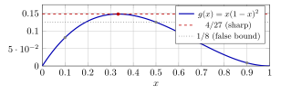
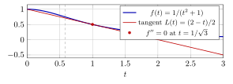
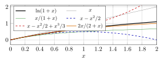
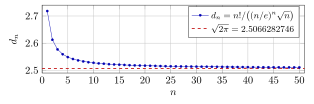

# 第 13 讲　不等式：估计的艺术 — (Inequalities: the art of estimation)

第 12 讲用凸性证明了几类不等式。本讲比较 AM–GM、Cauchy–Schwarz、Hölder、排序、切线及 Taylor 估计的适用条件。对每种方法，同时检查它给出的界与取等条件。

例题先在端点、对称点及邻近位置作数值检验，再选择证明方法。最后估计 $n!$，证明 $\dfrac{n!}{\sqrt n(n/e)^n}$ 有正极限；极限的具体值留待第 16 讲用 Wallis 公式确定。

## 1 证明前的数值检验 (Numerical checks before a proof)

几个点上的检验不能证明不等式，但可能给出反例，或提示取等位置。下面比较不同测试点提供的信息。

> [!WARNING] 先猜一猜 (Guess first) — 三个点够不够？
>
>
> 在 $[0,1]$ 上考虑 $g(x)=x(1-x)^2$。有人猜：$g(x)\le \dfrac18$ 在 $[0,1]$ 上恒成立。先别算，凭感觉给一个判断：对，还是错？再想一想，如果要验证它，你会代哪三个数进去？
>

> [!NOTE] 词语提示
>
>
> *attained*：能取到的；*maximum*：最大值；*exact*：精确的；*sharp*：不能改进的；最优的；*bound*：界；估计。
>

> [!NOTE] Example 13.1 — Three points are not enough
>
>
> Take $g(x)=x(1-x)^2$ on $[0,1]$ and the claim $g(x)\le 1/8=0.125$.
>
> **Step 1: the boundary.** $g(0)=0$ and $g(1)=0$. Both fine.
>
> **Step 2: three interior points** (the first block below). The three points almost everybody picks first are $0.1$, $0.5$, $0.9$; all three pass, and $x=0.5$ even gives equality — which looks like strong evidence that $1/8$ is the exact bound, attained at $x=1/2$. The claim now looks not merely true but sharp.
>
> **Step 3: test *near* the suspected equality point, on both sides** (the second block). This is the step that pays:
>
> | $x$ | $0.1$ | $0.5$ | $0.9$ |  | $0.2$ | $0.3$ | $1/3$ | $0.4$ |
> |---:|---:|---:|---:|:--:|---:|---:|---:|---:|
> | $g(x)$ | $0.081$ | $0.125$ | $0.009$ |  | $0.128$ | $0.147$ | $0.148148\ldots$ | $0.144$ |
>
> The claim is false. It fails already at $x=0.2$, and the true maximum sits near $x=1/3$, not at $x=1/2$.
>
> **What went wrong with Step 2.** $g(0.5)=0.125$ was a coincidence: $1/8$ is a value of $g$, not its maximum. A point where the two sides agree is the most dangerous test point of all, because agreement there is evidence for *sharpness*, not for *truth*. Once a test point produces equality, move a little to each side of it and look again.
>

于是有了本模块的固定动作，四条：

1.  **先看边界**（区间端点、某变量趋于 $0$ 或 $\infty$、变量相等或某个为 $0$）：错误的不等式多半死在边界上。

2.  **再取三个内点**，至少一个取在"对称点"（所有变量相等处）附近。

3.  **凡出现等号处，向两侧各挪一点再算一次**。上例说明了原因。

4.  **把等号的位置记下来**：等号在"所有变量相等"处提示 AM–GM、Jensen 或切线法；在"两列数成比例"处提示 Cauchy–Schwarz 或 Hölder；只在端点出现则提示单调性法。

前三条防错，第 4 条*选工具*。本讲剩下的部分就是对它的展开。

## 2 AM–GM and equality cases

第 12 讲已经从 $-\ln x$ 的凸性得到了加权平均值不等式。这里重新陈述它，因为本讲要反复用它的取等条件。

> [!NOTE] 定理 13.2 — 加权算术–几何平均值不等式 (Weighted AM–GM inequality)
>
>
> 设 $x_1,\dots,x_n\ge 0$，权重 (weights) $\lambda_1,\dots,\lambda_n>0$ 满足 $\sum_{k=1}^n\lambda_k=1$。则
> $$
> x_1^{\lambda_1}x_2^{\lambda_2}\cdots x_n^{\lambda_n}\ \le\ \lambda_1x_1+\lambda_2x_2+\cdots+\lambda_nx_n ,
> $$
> 且等号成立 if and only if $x_1=x_2=\cdots=x_n$。取 $\lambda_k=1/n$ 即得通常的形式 $\sqrt[n]{x_1\cdots x_n}\le\frac1n\sum_k x_k$。
>

> [!NOTE] 证明
>
>
> 若有某个 $x_k=0$，左边为 $0$，右边 $\ge0$，结论显然（此时等号成立当且仅当全部 $x_k=0$）。设全部 $x_k>0$。函数 $\varphi(u)=-\ln u$ 在 $(0,\infty)$ 上严格凸 (strictly convex)（$\varphi''(u)=1/u^2>0$，用第 12 讲的二阶判别法）。对它用第 12 讲的 Jensen 不等式 (Jensen’s inequality)：
> $$
> -\ln\Bigl(\sum_k\lambda_kx_k\Bigr)\ \le\ \sum_k\lambda_k(-\ln x_k)=-\ln\bigl(x_1^{\lambda_1}\cdots x_n^{\lambda_n}\bigr).
> $$
> 两边取相反数再取指数即得。严格凸时 Jensen 的等号成立当且仅当所有 $x_k$ 相同。
>

应用 AM–GM 时，可按预计的取等位置拆分各项，使这些项在那里相等。下面不用求导，重新估计第 1 节的表达式。

> [!NOTE] 词语提示
>
>
> *equality case*：取等情形；*sanity check*：合理性检查。
>

> [!NOTE] Example 13.3 — The maximum of $x(1-x)^2$, without derivatives
>
>
> We want $\max_{0\le x\le 1}g(x)$, $g(x)=x(1-x)^2$.
>
> **Why a naive split fails.** AM–GM on $x,\;1-x,\;1-x$ gives $x(1-x)^2\le\bigl(\frac{2-x}{3}\bigr)^3$, whose right-hand side still contains $x$: the three parts do not have constant sum. Equality would need $x=1/2$ — exactly the wrong location, as §1 showed.
>
> **The right split.** Insert a constant so that the parts add up to something independent of $x$. Multiply by $2$ and split as $2x,\;1-x,\;1-x$; now the sum is $2$, a constant, and AM–GM gives
> $$
> 2x(1-x)^2\le\Bigl(\frac{2x+(1-x)+(1-x)}{3}\Bigr)^3=\Bigl(\frac23\Bigr)^3=\frac{8}{27},
> $$
> so $g(x)\le \frac{4}{27}=0.148148\ldots$, with equality if and only if $2x=1-x$, that is $x=\frac13$. And indeed $g(1/3)=\frac13\cdot\frac49=\frac4{27}$.
>
> **Sanity check against §1.** $4/27=0.148148\ldots>0.125$, and the maximizer is $1/3$, not $1/2$ — exactly what the table said; the false claim was off by $0.0231\ldots$, about $18.5\%$ of $1/8$.
>
> **The moral.** The multiplier $2$ was not pulled out of the air; it was forced. We needed the parts to have constant sum *and* to be equal at the true maximizer, and running the equality condition backwards — "$ax=1-x$ there" — *determines* the split. The equality case is the method.
>

下图把这件事画出来：水平线 $4/27$ 与曲线相切于 $x=1/3$，而 $1/8$ 割进了曲线里面。

灰色的三个点是第 1 节的测试点；$x=0.5$ 那个*落在灰线上*。这正是让人误以为 $1/8$ 精确的原因，而只要从 $0.5$ 往左挪，曲线立刻出现灰线。AM–GM 的第二类用法是把数列的单调性变成一次不等式；下面把第 3 讲关于 $e$ 的那件事用纯代数重做。

> [!NOTE] 词语提示
>
>
> *logarithms*：对数；*strictly*：严格地。
>

> [!NOTE] Example 13.4 — $(1+1/n)^n$ increases, by AM–GM alone
>
>
> Lecture 3 proved that $a_n=(1+1/n)^n$ increases by a binomial expansion. Here is a two-line proof. Apply AM–GM to the $n+1$ numbers consisting of $n$ copies of $1+\frac1n$ and one copy of $1$:
> $$
> \sqrt[n+1]{\Bigl(1+\frac1n\Bigr)^{n}\cdot 1}\ \le\ \frac{n\bigl(1+\frac1n\bigr)+1}{n+1}=1+\frac1{n+1}.
> $$
> Raise to the power $n+1$: $a_n\le a_{n+1}$, strictly since the numbers are not all equal. The same trick on $n$ copies of $1-\frac1n$ shows $b_n=(1+\frac1n)^{n+1}$ *decreases*; at $n=10$, $a_{10}=2.593742460<e=2.718281828<b_{10}=2.853116706$, and at $n=50$, $2.691588029<e<2.745419790$. Taking logarithms in $a_n<e<b_n$ gives exactly the pair $\frac{x}{1+x}\le\ln(1+x)\le x$ of §6 at $x=1/n$ — the pair §8 runs on.
>

两个例子的共同点：AM–GM 给出*不等号*，而"何时取等"给出*位置*。在最优化里位置往往比界本身更有用。

> [!IMPORTANT] Exercise 13.5 — Guess, then split
>
>
> For $x\in[0,1]$ find $\max x^2(1-x)^3$ without differentiating. First guess the maximizer from the shape of the exponents (which of $x$ and $1-x$ should be smaller?); then test your guess numerically at three points; then choose multipliers $a,b$ so that AM–GM applied to $\underbrace{ax,\dots}_{2}$, $\underbrace{b(1-x),\dots}_{3}$ has constant sum, and read off both the maximum and the maximizer. (The answer is $0.03456$, attained at $x=2/5$; get there by the method, not by the answer.)
>

## 3 Cauchy–Schwarz：两个证明，两种用法 (Cauchy–Schwarz: two proofs, two uses)

AM–GM 处理"乘积与和"；下一件工具处理"两列数的配对求和"。

> [!WARNING] 先猜一猜 (Guess first) — 差多少？
>
>
> 取 $a=(1,2,3)$ 与 $b=(3,2,1)$。内积 $a\cdot b=1\cdot3+2\cdot2+3\cdot1$ 与 $\sqrt{(1^2+2^2+3^2)(3^2+2^2+1^2)}$ 哪个大？先猜它们相差多少（给一个具体的数，不要只说"差一点"）。再猜：如果把 $b$ 换成 $(1,2,3)$，差多少？
>

> [!NOTE] 定理 13.6 — Cauchy–Schwarz 不等式 (Cauchy–Schwarz inequality)
>
>
> 对任意实数 $a_1,\dots,a_n$ 与 $b_1,\dots,b_n$，
> $$
> \Bigl(\sum_{k=1}^na_kb_k\Bigr)^{2}\ \le\ \Bigl(\sum_{k=1}^na_k^2\Bigr)\Bigl(\sum_{k=1}^nb_k^2\Bigr),
> $$
> 等号成立 if and only if 两个数组成比例 (proportional)，即存在不全为零的 $\lambda,\mu$ 使 $\lambda a_k=\mu b_k$ 对一切 $k$ 成立。
>

它有两个标准证明，不是同一个证明的两种写法：一个给出等号条件的*显式形状*，另一个给出可推广的*机制*。

> [!NOTE] 证明 — 证明一（Lagrange 恒等式 (Lagrange's identity)）
>
>
> 直接展开可以验证恒等式
> $$
> \Bigl(\sum_ka_k^2\Bigr)\Bigl(\sum_kb_k^2\Bigr)-\Bigl(\sum_ka_kb_k\Bigr)^{2}
>  =\sum_{1\le i<j\le n}\bigl(a_ib_j-a_jb_i\bigr)^{2}.
> $$
> （左边的双重求和 $\sum_{i,j}a_i^2b_j^2-\sum_{i,j}a_ib_ia_jb_j$ 中，$i=j$ 的项彼此抵消，$i\ne j$ 的项两两配对成 $a_i^2b_j^2+a_j^2b_i^2-2a_ib_ja_jb_i$。）右边是平方和，故非负，不等式得证；且等号成立当且仅当一切 $a_ib_j-a_jb_i=0$，这正是成比例。
>

> [!NOTE] 证明 — 证明二（二次型 (quadratic form)）
>
>
> 对任意 $\lambda\in\mathbb{R}$，$Q(\lambda):=\sum_k(\lambda a_k-b_k)^2=\lambda^2\sum_ka_k^2-2\lambda\sum_ka_kb_k+\sum_kb_k^2\ge0$。若 $\sum a_k^2=0$ 则全部 $a_k=0$，结论平凡。否则 $Q$ 是首项系数为正的二次三项式 (quadratic trinomial) 且处处非负，故判别式 (discriminant) 非正，即 $\bigl(\sum a_kb_k\bigr)^2\le\bigl(\sum a_k^2\bigr)\bigl(\sum b_k^2\bigr)$。等号成立当且仅当 $Q$ 有实根 $\lambda_0$，即 $\lambda_0a_k=b_k$ 对一切 $k$ 成立。
>

> [!NOTE] 词语提示
>
>
> *identity*：恒等式；*ratio*：比值；*gap*：两项之差的绝对值。
>

> [!NOTE] Example 13.7 — The gap, measured
>
>
> With $a=(1,2,3)$, $b=(3,2,1)$:
> $$
> a\cdot b=3+4+3=10,\qquad \textstyle\sum a_k^2=\sum b_k^2=14,\qquad \sqrt{14\cdot14}=14 .
> $$
> So the gap is $14-10=4$, and the ratio $(a\cdot b)/\|a\|\|b\|=10/14=0.7142857143$. The *squared* gap is $196-100=96$, and Lagrange’s identity accounts for it term by term: the three determinants $a_ib_j-a_jb_i$ are $-4$, $-8$, $-4$ for the pairs $(1,2)$, $(1,3)$, $(2,3)$, whose squares $16+64+16$ add up to exactly $96$. This is what the first proof buys: the gap is a sum of explicit squares, and the biggest contribution ($64$) comes from the pair $(1,3)$, the one furthest from being proportional. If instead $b=(1,2,3)$, every $2\times2$ determinant vanishes and the gap is exactly $0$.
>

下面把 Cauchy–Schwarz 用于分式之和，得到常用的下界。

> [!NOTE] 推论 13.8 — Engel 形式 / "配方"形式 (Engel form)
>
>
> 设 $u_1,\dots,u_n\in\mathbb{R}$，$v_1,\dots,v_n>0$。则
> $$
> \frac{u_1^2}{v_1}+\frac{u_2^2}{v_2}+\cdots+\frac{u_n^2}{v_n}\ \ge\ \frac{(u_1+u_2+\cdots+u_n)^2}{v_1+v_2+\cdots+v_n},
> $$
> 等号成立 if and only if $u_1/v_1=u_2/v_2=\cdots=u_n/v_n$。
>

> [!NOTE] 证明
>
>
> 在 Cauchy–Schwarz 中取 $a_k=u_k/\sqrt{v_k}$、$b_k=\sqrt{v_k}$，则三个和分别是 $\sum u_k$、$\sum u_k^2/v_k$、$\sum v_k$；成比例条件 $a_k=\lambda b_k$ 即 $u_k=\lambda v_k$。
>

> [!NOTE] 词语提示
>
>
> *bounds*：上下界；*factor*：因子。
>

> [!NOTE] Example 13.9 — Two uses of Cauchy–Schwarz
>
>
> **(a) A sum of fractions, from below.** For $x,y,z>0$,
> $$
> \frac1x+\frac4y+\frac9z=\frac{1^2}{x}+\frac{2^2}{y}+\frac{3^2}{z}\ \ge\ \frac{(1+2+3)^2}{x+y+z}=\frac{36}{x+y+z},
> $$
> with equality if and only if $x:y:z=1:2:3$. Check: at $(1,1,1)$ the sides are $14$ and $12$; at $(0.5,1,2)$, $10.5$ and $10.285714$; at $(1,2,3)$ both are $6$. The symmetric point $(1,1,1)$, the one everybody tries first, is *not* the sharp case here.
>
> **(b) A sum of square roots, from above.** How big is $\sum_{k=1}^n\sqrt k$? Cauchy–Schwarz with $a_k=\sqrt k$, $b_k=1$ gives
> $$
> \sum_{k=1}^n\sqrt k\ \le\ \sqrt{n\sum_{k=1}^nk}=\sqrt{\frac{n^2(n+1)}2}.
> $$
> At $n=10,100,1000$ the true sums are $22.46827819$, $671.4629471$, $21097.45589$ and the bounds are $23.45207880$, $710.6335202$, $22371.85732$, so the ratios are $0.95805060$, $0.94487936$, $0.94303551$. The ratio does not tend to $1$: it settles near $\tfrac{2\sqrt2}{3}=0.9428090416$. The equality condition says why — equality would need all the $k$ equal, which is as false as it can be. Cauchy–Schwarz gets the *order* $n^{3/2}$ right but loses a fixed factor. (Lecture 15 explains where $\tfrac23n^{3/2}$ comes from.)
>

例 (b) 是一次有用的失败：Cauchy–Schwarz 便宜、无条件，代价是两列数离成比例越远丢掉的常数越大。固定动作第 4 条在这里就是诊断：看一眼取等条件，就知道能不能指望它 sharp。

## 4 Hölder 与 Minkowski 不等式 (Hölder and Minkowski inequalities)

Cauchy–Schwarz 配的是平方与平方。把平方换成 $p$ 次幂，另一侧就必须换成 $q$ 次幂，其中 $\frac1p+\frac1q=1$（共轭指数 (conjugate exponents)）。本课不做 $L^p$ 空间，本节只给陈述、一个三行证明和一个例子：这些不等式在这里的用处是"指数不是 $2$ 时该怎么配"。一切从下面这条一元不等式来。

> [!NOTE] 引理 13.10 — Young 不等式 (Young's inequality)
>
>
> 设 $p>1$，$q>1$，$\frac1p+\frac1q=1$。则对一切 $a,b\ge0$，
> $$
> ab\ \le\ \frac{a^p}{p}+\frac{b^q}{q},
> $$
> 等号成立 if and only if $a^p=b^q$。
>

> [!NOTE] 证明
>
>
> 先证一元形式：对 $0<\alpha<1$ 与 $u\ge0$，
> 
> $$
>  u^{\alpha}-\alpha u\ \le\ 1-\alpha ,
> $$
> 等号仅在 $u=1$ 处成立。令 $h(u)=u^\alpha-\alpha u$；则 $h'(u)=\alpha(u^{\alpha-1}-1)$，在 $0<u<1$ 上为正、在 $u>1$ 上为负，故 $h$ 在 $u=1$ 处取最大值 $h(1)=1-\alpha$。
>
> 现在设 $b>0$（$b=0$ 时不等式显然），在 [(13.1)](#l13-eq:powerbound) 中取 $\alpha=1/p$ 与 $u=a^p/b^q$：
> $$
> \frac{a}{b^{q/p}}-\frac1p\cdot\frac{a^p}{b^q}\ \le\ \frac1q .
> $$
> 两边乘以 $b^q>0$。由 $\frac1p+\frac1q=1$ 得 $1-\frac1p=\frac1q$，故 $q-\frac qp=q\bigl(1-\frac1p\bigr)=q\cdot\frac1q=1$，即 $b^{\,q-q/p}=b$。于是 $ab-\frac{a^p}{p}\le\frac{b^q}{q}$。等号条件 $u=1$ 即 $a^p=b^q$。
>

> [!NOTE] 定理 13.11 — Hölder 不等式 (Hölder's inequality)
>
>
> 设 $p>1$，$\frac1p+\frac1q=1$，$x_k,y_k\ge0$。则
> $$
> \sum_{k=1}^nx_ky_k\ \le\ \Bigl(\sum_{k=1}^nx_k^p\Bigr)^{1/p}\Bigl(\sum_{k=1}^ny_k^q\Bigr)^{1/q},
> $$
> 等号成立 if and only if 数组 $x_1^p,\dots,x_n^p$ 与 $y_1^q,\dots,y_n^q$ 成比例。$p=q=2$ 时即 Cauchy–Schwarz。
>

> [!NOTE] 证明
>
>
> 记 $A=\bigl(\sum x_k^p\bigr)^{1/p}$，$B=\bigl(\sum y_k^q\bigr)^{1/q}$；若 $A=0$ 或 $B=0$ 则左边为零，结论成立。否则对每个 $k$ 用 Young 不等式于 $a=x_k/A$，$b=y_k/B$：
> $$
> \frac{x_ky_k}{AB}\le\frac{x_k^p}{pA^p}+\frac{y_k^q}{qB^q}.
> $$
> 对 $k$ 求和，右边成为 $\frac1p+\frac1q=1$，故 $\sum x_ky_k\le AB$。等号要求每个 $k$ 都取等，即 $x_k^p/A^p=y_k^q/B^q$。
>

证明先归一化，再逐项应用 Young 不等式并求和。

> [!NOTE] 定理 13.12 — Minkowski 不等式 (Minkowski's inequality)
>
>
> 设 $p\ge1$，$x_k,y_k\ge0$。则
> $$
> \Bigl(\sum_{k=1}^n(x_k+y_k)^p\Bigr)^{1/p}\ \le\ \Bigl(\sum_{k=1}^nx_k^p\Bigr)^{1/p}+\Bigl(\sum_{k=1}^ny_k^p\Bigr)^{1/p}.
> $$
>

> [!NOTE] 证明 — 证明（要点）
>
>
> 设 $p>1$，$S=\sum_k(x_k+y_k)^p>0$。把 $S$ 拆成 $\sum_kx_k(x_k+y_k)^{p-1}+\sum_ky_k(x_k+y_k)^{p-1}$，对两项各用一次 Hölder（指数 $p$ 与 $q=\frac p{p-1}$，$(p-1)q=p$），再除以 $S^{1/q}$ 并用 $1-\frac1q=\frac1p$。
>

> [!NOTE] 词语提示
>
>
> *quadratic*：二次的。
>

> [!NOTE] Example 13.13 — Hölder at $p=3$: where the equality lives
>
>
> Take $p=3$, so $q=3/2$, and $x=(1,2,3)$.
>
> **A generic pair.** With $y=(4,1,2)$: $\sum x_ky_k=12$, while $(\sum x_k^3)^{1/3}=36^{1/3}=3.301927249$ and $(\sum y_k^{3/2})^{2/3}=(11.82842712)^{2/3}=5.191402067$, so the right-hand side is $17.14163194$ and LHS/RHS $=0.70005003$. A large gap.
>
> **The equality pair.** The condition is $x_k^3\propto y_k^{3/2}$, i.e. $y_k=c\,x_k^2$. Take $y=(1,4,9)$: then $\sum x_ky_k=36$ and the right-hand side is $36^{1/3}\cdot36^{2/3}=36$. Ratio $1.000000000000$.
>
> **Near-equality is quadratic.** Perturb the last entry, $y=(1,4,9+\varepsilon)$, and record the deficit $1-\text{LHS}/\text{RHS}$: at $\varepsilon=0.1,\,0.3,\,1.0$ it is $5.697\times10^{-6}$, $4.971\times10^{-5}$, $4.971\times10^{-4}$. Tripling $\varepsilon$ multiplies the deficit by about $9$: the loss is *second order* in the distance from the equality configuration — a general fact about sharp inequalities, and §9 proves the version of it that belongs to Jensen.
>

> [!NOTE] 词语提示
>
>
> *uniform*：一致的；*slope*：斜率。
>

> [!NOTE] AI Lab — Hölder at $p=3$: hunting for equality
>
>
> Ask an AI to do the following, and answer the two questions from its output.
>
> 1.  Fix $p=3$, $q=3/2$, $n=5$. Draw $1000$ random pairs $x,y$ with entries uniform in $(0,1)$ and compute $R=\bigl(\sum x_ky_k\bigr)\big/\bigl[(\sum x_k^3)^{1/3}(\sum y_k^{3/2})^{2/3}\bigr]$; plot a histogram. *Question 1: is $R\le1$ in all $1000$ trials, and where does the histogram pile up — near $1$, or well below?*
>
> 2.  Now generate $y$ from $x$ by $y_k=x_k^2(1+\delta_k)$, $\delta_k$ uniform in $(-\delta,\delta)$, for $\delta=10^{-1},10^{-2},10^{-3}$, $200$ trials each. Plot $\log_{10}(1-R)$ against $\log_{10}\delta$. *Question 2: what is the slope, and what does it say about how hard failure of equality is to detect numerically?*
>
> 3.  Find, among the $1000$ pairs of part 1, the one with the *largest* $R$, and check by hand whether its $y$ is close to a multiple of $x^2$ componentwise.
>

Minkowski 在本课只再出现一次（第 17 讲的积分形式）。给出它是为了一件结构性的事：Hölder 是"配对"的不等式，Minkowski 是"三角形"的不等式，后者由前者推出。

## 5 排序与 Chebyshev 和不等式 (Rearrangement and Chebyshev’s sum inequality)

前面三件工具都不关心数的*次序*；这一节的工具只关心次序。

> [!WARNING] 先猜一猜 (Guess first) — 怎么配对最大？
>
>
> 把 $1,2,3$ 与 $2,5,7$ 两两配对相乘再相加，共有 $6$ 种配法。先猜：最大的和是多少？最小的呢？它们相差多大？（把你的三个猜测写下来再往下看。）
>

> [!NOTE] Example 13.14 — All six pairings
>
>
> With $a=(1,2,3)$ fixed and $b$ running over the six permutations of $(2,5,7)$, the sums $\sum a_kb_k$ are
> $$
> (2,5,7)\!:\,33,\quad (2,7,5)\!:\,31,\quad (5,2,7)\!:\,30,\quad (7,2,5)\!:\,26,\quad (5,7,2)\!:\,25,\quad (7,5,2)\!:\,23 .
> $$
> The largest, $33$, is the *similarly ordered* pairing (smallest with smallest, largest with largest); the smallest, $23$, is the *reversed* one. The spread is $10$, and the four middle values are strictly between, because all the $a_k$ and all the $b_k$ are distinct.
>

> [!NOTE] 定理 13.15 — 排序不等式 (Rearrangement inequality)
>
>
> 设 $a_1\le a_2\le\cdots\le a_n$ 与 $b_1\le b_2\le\cdots\le b_n$ 是两组实数，$\sigma$ 是 $\{1,\dots,n\}$ 的任一排列 (permutation)。则
> $$
> \sum_{k=1}^na_kb_{n+1-k}\ \le\ \sum_{k=1}^na_kb_{\sigma(k)}\ \le\ \sum_{k=1}^na_kb_k .
> $$
> （反序和最小，同序和最大。）
>

> [!NOTE] 证明
>
>
> 只证右边（左边把 $b$ 换成 $-b$ 同理）。关键是两项交换引理：若 $a_i\le a_j$ 且 $b_s\le b_t$，则 $(a_ib_t+a_jb_s)-(a_ib_s+a_jb_t)=-(a_j-a_i)(b_t-b_s)\le0$，即把这两项"改成同序"不会使和变小。给定排列 $\sigma$，若它不是同序排列，则存在 $i<j$ 使 $\sigma(i)>\sigma(j)$；交换这两个位置，和不减，而逆序对 (inversions) 的个数严格减少。逆序对个数是非负整数，故有限次交换后必到达同序排列。
>

最重要的推论：两列*同向变化*的数，乘积的平均不小于平均的乘积。

> [!NOTE] 推论 13.16 — Chebyshev 和不等式 (Chebyshev's sum inequality)
>
>
> 设 $a_1\le\cdots\le a_n$ 且 $b_1\le\cdots\le b_n$。则
> $$
> \frac1n\sum_{k=1}^na_kb_k\ \ge\ \Bigl(\frac1n\sum_{k=1}^na_k\Bigr)\Bigl(\frac1n\sum_{k=1}^nb_k\Bigr).
> $$
> 若 $a$ 递增而 $b$ 递减，则不等号反向。
>

> [!NOTE] 证明
>
>
> 两个同向的数组满足 $(a_i-a_j)(b_i-b_j)\ge0$ 对一切 $i,j$。求和：
> $$
> 0\le\sum_{i=1}^n\sum_{j=1}^n(a_i-a_j)(b_i-b_j)=2n\sum_ka_kb_k-2\Bigl(\sum_ka_k\Bigr)\Bigl(\sum_kb_k\Bigr).
> $$
> 除以 $2n^2$ 即得。
>

> [!NOTE] Example 13.17 — Chebyshev on the same data
>
>
> For $a=(1,2,3)$, $b=(2,5,7)$: $\frac13\sum a_kb_k=11$ against $\bigl(\frac13\sum a_k\bigr)\bigl(\frac13\sum b_k\bigr)=2\cdot\frac{14}3=9.333333333$. Reversing $b$ to $(7,5,2)$ makes the two sequences oppositely ordered and flips it: $\frac{23}3=7.666666667\le9.333333333$.
>

使用场合很好辨认：出现"$a_k$ 与 $b_k$ 同增"或"分子递增、分母递减"时，它往往是最短的路。弱点同样明显。它要求你能*排序*，对次序未知的对称表达式帮不上忙。

## 6 切线法与单调性法 (The tangent-line trick and the monotonicity method)

到此为止的工具都是"代数的"；下面两件来自导数，是第 9–11 讲的收获在本讲的兑现。先说最朴素也最常用的一件。

> [!NOTE] 命题 13.18 — 单调性法 (The monotonicity method)
>
>
> 设 $f$ 在 $[a,b)$ 上连续、在 $(a,b)$ 上可导，$f(a)=0$，且 $f'(x)\ge0$ 对一切 $x\in(a,b)$ 成立。则 $f(x)\ge0$ 在 $[a,b)$ 上成立；若 $f'>0$ 则 $x>a$ 时 $f(x)>0$。
>

> [!NOTE] 证明
>
>
> 对 $a<x<b$ 用第 10 讲的 Lagrange 中值定理 (Lagrange’s Mean Value Theorem)：存在 $\xi\in(a,x)$ 使 $f(x)-f(a)=f'(\xi)(x-a)\ge0$。
>

它把"证明不等式"变成"算导数、判符号"，而后者是机械的。唯一的技巧是：**把不等式移项成 $f\ge0$ 的形状，并选对那个使 $f(a)=0$ 的端点 $a$**。

> [!NOTE] 词语提示
>
>
> *logarithm*：对数。
>

> [!NOTE] Example 13.19 — The two logarithm bounds
>
>
> For $x>-1$ we prove
> $$
> \frac{x}{1+x}\ \le\ \ln(1+x)\ \le\ x ,
> $$
> with equality only at $x=0$.
>
> **Right-hand side.** Put $f(x)=x-\ln(1+x)$. Then $f(0)=0$ and $f'(x)=1-\frac1{1+x}=\frac{x}{1+x}$, which is $>0$ for $x>0$ and $<0$ for $-1<x<0$; so $f>0$ on both sides of $0$.
>
> **Left-hand side.** Put $g(x)=\ln(1+x)-\frac{x}{1+x}$; then $g(0)=0$ and $g'(x)=\frac1{1+x}-\frac1{(1+x)^2}=\frac{x}{(1+x)^2}$, of the same sign pattern. Same conclusion.
>
> **How far apart are they?** At $x=0.1$ the three numbers are $0.09090909091$, $0.09531017980$, $0.1$: each bound is within $5\times10^{-3}$ of the truth. At $x=5$ they are $0.8333333333$, $1.791759469$, $5$: useless. Both bounds are *local* statements dressed as global ones — sharp at $0$ and only at $0$. (§7 compares all the competing bounds, numerically and in a picture.)
>

同一台机器换一个函数，就给出本讲第二条最常用的一元不等式；它的指数允许是任意实数。

> [!NOTE] 命题 13.20 — Bernoulli 不等式 (Bernoulli's inequality)
>
>
> 设 $x>-1$，$\alpha\in\mathbb{R}$。若 $\alpha\ge1$ 或 $\alpha\le0$，则 $(1+x)^{\alpha}\ge1+\alpha x$；若 $0\le\alpha\le1$，则 $(1+x)^{\alpha}\le1+\alpha x$。$\alpha\ne0,1$ 时，两种情形的等号都只在 $x=0$ 处成立。
>

> [!NOTE] 证明
>
>
> 令 $h(x)=(1+x)^{\alpha}-1-\alpha x$，则 $h(0)=0$，$h'(x)=\alpha\bigl[(1+x)^{\alpha-1}-1\bigr]$。当 $\alpha>1$ 时 $\alpha>0$ 且 $\alpha-1>0$，故 $(1+x)^{\alpha-1}-1$ 与 $x$ 同号，$h'$ 也与 $x$ 同号：$h$ 在 $x=0$ 处取最小值 $0$。当 $\alpha<0$ 时 $\alpha$ 与 $\alpha-1$ 同为负，两个符号各翻转一次，结论不变。当 $0<\alpha<1$ 时 $\alpha>0$ 而 $\alpha-1<0$，$h'$ 与 $x$ 反号，$h$ 在 $x=0$ 处取最大值 $0$。$\alpha=0,1$ 时两边恒等。
>

> [!NOTE] 词语提示
>
>
> *tangent*：切线。
>

> [!NOTE] Example 13.21 — Bernoulli: exact at $0$, generous far away
>
>
> The bound is a tangent line at $x=0$, so it is only as good as $x$ is small.
>
> | $\alpha$ |    $x$ | $(1+x)^{\alpha}$ | $1+\alpha x$ |
> |-----------:|---------:|-------------------:|---------------:|
> |     $10$ | $0.01$ |    $1.104622125$ |        $1.1$ |
> |     $10$ |  $0.1$ |    $2.593742460$ |          $2$ |
> |    $1/2$ |    $3$ |              $2$ |        $2.5$ |
> |      $3$ | $-0.5$ |          $0.125$ |       $-0.5$ |
>
> Rows 1–2: at $x=0.01$ the relative error is $4.2\times10^{-3}$, at $x=0.1$ already $23\%$. Row 3 is the direction flip at $0<\alpha<1$. Row 4 is true but useless — the right-hand side is negative while the left is not; a correct bound can still carry no information, and only numbers tell you which case you are in.
>

在 [(13.1)](#l13-eq:powerbound) 中令 $u=1+x$，便得到 $0<\alpha<1$ 时的 Bernoulli 不等式。

下一个例子是单调性法的经典用途：被估计的不是 $f$ 本身，而是一个商。

> [!WARNING] 先猜一猜 (Guess first) — $\sin x/x$ 能小到多少？
>
>
> 在 $\bigl(0,\frac\pi2\bigr)$ 上，$\dfrac{\sin x}{x}$ 的最小值（下确界）是多少？先猜一个两位小数。提示：$x\to0^+$ 时它趋于 $1$；那么另一头呢？
>

> [!NOTE] 词语提示
>
>
> *monotonicity*：单调性；*endpoint*：端点；*infimum*：下确界；*minimum*：最小值。
>

> [!NOTE] Example 13.22 — Jordan's inequality
>
>
> **Claim.** $\sin x\ \ge\ \dfrac{2}{\pi}x$ for $0\le x\le\dfrac\pi2$, with equality only at $x=0$ and $x=\pi/2$.
>
> **Test first.** $\sin x/x$ at $x=0.1,\,0.5,\,1.0,\,\pi/2$ equals $0.9983341665$, $0.9588510772$, $0.8414709848$, $0.636619772368$. The values decrease steadily and the endpoint value is $2/\pi=0.636619772368$. So the guess is: $\sin x/x$ *decreases* on $(0,\pi/2]$, its infimum is the endpoint value, and the inequality to prove says exactly that the minimum sits at the boundary.
>
> **Proof.** Let $F(x)=\dfrac{\sin x}{x}$ on $\bigl(0,\frac\pi2\bigr]$. Then
> $$
> F'(x)=\frac{x\cos x-\sin x}{x^2}.
> $$
> Put $u(x)=x\cos x-\sin x$. Then $u(0)=0$ and $u'(x)=\cos x-x\sin x-\cos x=-x\sin x<0$ on $\bigl(0,\frac\pi2\bigr]$. By the monotonicity method (applied to $-u$), $u(x)<0$ there, hence $F'<0$ and $F$ is strictly decreasing. Therefore $F(x)\ge F(\pi/2)=2/\pi$ on $\bigl(0,\frac\pi2\bigr]$, which is the claim. At $x=0$ both sides vanish.
>
> **Remark: the same machine, one more turn.** From $\sin t<t$ $(t>0)$: $v(x)=\cos x-1+\frac{x^2}2$ has $v(0)=0$ and $v'(x)=x-\sin x>0$, so $\cos x>1-\frac{x^2}2$ for $x>0$. Feeding *that* back in, $w(x)=\sin x-x+\frac{x^3}6$ has $w(0)=0$ and $w'(x)=\cos x-1+\frac{x^2}2>0$, so $\sin x>x-\frac{x^3}6$. Each turn of the crank buys one more order — and this route never needed Taylor at all.
>

单调性法处理"一个变量、等号在端点"；对称的不等式（多个变量、等号在"全部相等"处）需要另一件工具。

> [!NOTE] 定理 13.23 — 切线法 (The tangent line trick)
>
>
> 设 $I$ 是区间，$f:I\to\mathbb{R}$ 可导，$a\in I$，且
> 
> $$
>  f(t)\ \ge\ f(a)+f'(a)(t-a)\qquad\text{对一切 }t\in I .
> $$
> 则对任意 $x_1,\dots,x_n\in I$ 与权重 $\lambda_k>0$，$\sum_k\lambda_k=1$，只要 $\sum_k\lambda_kx_k=a$，就有
> $$
> \sum_{k=1}^n\lambda_kf(x_k)\ \ge\ f(a).
> $$
>

> [!NOTE] 证明
>
>
> 把 [(13.2)](#l13-eq:tangent) 用在 $t=x_k$ 上，乘以 $\lambda_k$ 求和：
> $$
> \sum_k\lambda_kf(x_k)\ \ge\ f(a)\sum_k\lambda_k+f'(a)\Bigl(\sum_k\lambda_kx_k-a\Bigr)=f(a)+0 .\qquad\blacksquare
> $$
>

若 $f$ 在整个 $I$ 上凸，则 [(13.2)](#l13-eq:tangent) 自动成立（第 12 讲的支撑线 (supporting line) 命题），结论就是 Jensen 不等式，没有新东西。切线法真正的价值在于：**$f$ 可以不凸**。需要的只是"图像在*某一条*切线之上"，而这可以逐点验证。通常的验证方式是把 $f(t)-f(a)-f'(a)(t-a)$ 因式分解，让 $(t-a)^2$ 掉出来。

> [!NOTE] 词语提示
>
>
> *nonnegative*：非负的；*admissible*：允许的；*numerator*：分子；*remaining*：剩余的；*concave*：凹的；*verify*：核实；*convex*：凸的。
>

> [!NOTE] Example 13.24 — A non-convex tangent line trick
>
>
> **Claim.** If $a,b,c\ge0$ and $a+b+c=3$, then
> $$
> \frac{1}{a^2+1}+\frac{1}{b^2+1}+\frac{1}{c^2+1}\ \ge\ \frac32 .
> $$
>
> **Test first** (three points and the boundary; the symmetric point is $(1,1,1)$): the sum equals $1.5$ at $(1,1,1)$, $1.607692308$ at $(0.5,1,1.5)$, $1.8$ at $(2,0.5,0.5)$, $2.093320192$ at $(0.1,0.1,2.8)$ and $2.1$ at the boundary point $(3,0,0)$. The minimum really does look like the symmetric point, where $3/2$ is attained. Equality at the symmetric point is the signature of AM–GM, Jensen, or the tangent line.
>
> **Why Jensen is unavailable.** For $f(t)=\frac1{t^2+1}$ one finds $f''(t)=\frac{6t^2-2}{(t^2+1)^3}$, which is *negative* for $0\le t<1/\sqrt3=0.5773502692$. So $f$ is concave near $0$ and convex further out; it is not convex on $[0,3]$, and Jensen in the direction we want does not apply. (The test point $(0.1,0.1,2.8)$ lives partly in the concave region — which is why one computes it.)
>
> **The tangent line at $t=1$.** $f(1)=\frac12$, $f'(t)=\frac{-2t}{(t^2+1)^2}$, $f'(1)=-\frac12$. The tangent line is $L(t)=\frac12-\frac{t-1}2=\frac{2-t}{2}$. Now verify [(13.2)](#l13-eq:tangent) *by factoring*:
> $$
> f(t)-L(t)=\frac1{t^2+1}-\frac{2-t}2=\frac{2-(2-t)(t^2+1)}{2(t^2+1)}=\frac{t^3-2t^2+t}{2(t^2+1)}=\frac{t(t-1)^2}{2(t^2+1)}\ \ge\ 0
> $$
> for every $t\ge0$. (Check at $t=2$: both sides equal $0.2$.) Summing $f(a)+f(b)+f(c)\ge L(a)+L(b)+L(c)=\frac{6-(a+b+c)}2=\frac32$. Done.
>
> **What made it work.** The numerator factored as $t(t-1)^2$: the double root at $t=1$ is forced (the tangent touches there), and the remaining factor $t$ happened to be nonnegative on the whole admissible range. That last point is where such proofs usually fail — exactly what the boundary test $(3,0,0)$ was probing.
>

图中虚线左边 $f$ 凹、右边凸，但整条曲线都在那条切线之上。这就是切线法与 Jensen 的区别：Jensen 要求处处凸（全局条件），切线法只要求"在这一条直线之上"（一条可以手算验证的不等式）。

## Taylor 估计法与方法比较 (Taylor estimates and comparison of methods)

单调性法一次买一阶精度；Taylor 公式一次买 $n$ 阶，代价是必须控制余项的符号。第 10 讲带 Lagrange 余项 (Lagrange remainder) 的 Taylor 公式说：若 $f$ 在包含 $0$ 与 $x$ 的区间上 $n+1$ 次可导，则存在 $\xi$ 介于 $0$ 与 $x$ 之间使 $f(x)=\sum_{k=0}^{n}\frac{f^{(k)}(0)}{k!}x^k+\frac{f^{(n+1)}(\xi)}{(n+1)!}x^{n+1}$。要把它变成不等式，只需判断最后一项的符号。这就是全部技巧。

> [!NOTE] 命题 13.25 — 两条 Taylor 估计 (Two Taylor estimates)
>
>
> 对一切 $x\ge0$：(1) $e^x\ge1+x+\frac{x^2}2$，更一般地 $e^x\ge\sum_{k=0}^n\frac{x^k}{k!}$；(2) $x-\frac{x^2}2\le\ln(1+x)\le x-\frac{x^2}2+\frac{x^3}3$。
>

> [!NOTE] 证明
>
>
> \(1\) 取 $f=\exp$，$n=2$：余项 $\frac{e^{\xi}}{6}x^3\ge0$；一般情形同理，余项 $\frac{e^\xi}{(n+1)!}x^{n+1}\ge0$。 (2) 取 $f(x)=\ln(1+x)$：$f'''(t)=\frac{2}{(1+t)^3}$，故 $n=2$ 的余项 $\frac{x^3}{3(1+\xi)^3}\ge0$，给出左边；$f^{(4)}(t)=-\frac{6}{(1+t)^4}$，故 $n=3$ 的余项 $-\frac{x^4}{4(1+\xi)^4}\le0$，给出右边。
>

为什么这里没有三角函数？因为**Taylor 估计法只在余项符号可判时才管用**：$\cos$ 的 $n=2$ 余项是 $\frac{\sin\xi}{6}x^3$，$\xi>\pi$ 时可能为负；$n=3$ 的余项 $\frac{\cos\xi}{24}x^4$ 符号仍不定。$e^x$ 与 $\ln(1+x)$ 的各阶导数符号规整，所以听话；三角函数的导数循环变号，对大的 $x$ 就不听话。第 6 节末尾的单调性论证给出的 $\cos x>1-\frac{x^2}2$ 与 $\sin x>x-\frac{x^3}6$ 对一切 $x>0$ 有效。遇到三角函数，回到单调性法。

> [!NOTE] 词语提示
>
>
> *finite*：有限的。
>

> [!NOTE] Example 13.26 — Taylor bounds are *local* bounds
>
>
> **The exponential.** $e^x$ against $1+x+\frac{x^2}2$: at $x=0.1$, $1.105170918$ against $1.105$ (relative error $1.5\times10^{-4}$); at $x=1$, $2.718281828$ against $2.5$; at $x=3$, $20.08553692$ against $8.5$ — off by a factor $2.363$.
>
> **The logarithm.** At $x=0.1$ the four bounds $\frac{x}{1+x}$, $x-\frac{x^2}2$, $x-\frac{x^2}2+\frac{x^3}3$, $x$ are $0.09090909091$, $0.095$, $0.09533333333$, $0.1$, against $\ln(1.1)=0.09531017980$: the Taylor sandwich pins the truth to within $3.3\times10^{-4}$, the crude pair only to within $9.1\times10^{-3}$. At $x=2$ the same four are $0.6666666667$, $0$, $2.666666667$, $2$, against $\ln3=1.098612289$: the Taylor bounds are now worthless while the crude pair, weak as it is, still holds.
>
> **The moral.** Taylor bounds live *near a point*: the further you go, the more orders you must buy, and past some distance no finite number of them helps. *Different bounds are good in different places* — the reason for owning several. This is also why §8 needs its bound only at $x=1/n$ with $n$ large, where two or three orders are plenty. The figure shows all four at once.
>

图中橙色那条 $2x/(2+x)$ 还没出现过：它与 $\ln(1+x)$ 在 $0$ 处相切到*二阶*（$2x/(2+x)=x-\frac{x^2}2+\frac{x^3}4-\cdots$），却在整个 $x>0$ 上始终位于 $\ln(1+x)$ 之下。这两件事 $x-\frac{x^2}2$ 只做到第一件。第 8 节正需要这样一条曲线。

### 同一个不等式，四种工具 (One inequality, four tools)

最有用的一次练习是把同一个不等式用不同工具各证一遍，再比较它们分别"要求你知道什么"。下面的例子从一次"先猜再算"开始：对正数 $a,b,c$，$P=(a+b+c)\bigl(\frac1a+\frac1b+\frac1c\bigr)$ 能有多小？先猜一个下界，再往下读。

> [!NOTE] 词语提示
>
>
> *rearrangement*：重新排列；*comparison*：比较；*convexity*：凸性；*harmonic*：调和的；*diagonal*：对角线；*at least*：至少；*weights*：权重。
>

> [!NOTE] 词语提示
>
>
> *at most*：至多。
>

> [!NOTE] Example 13.27 — $(a+b+c)\bigl(\frac1a+\frac1b+\frac1c\bigr)\ge9$, four ways
>
>
> **Numerics first.** $P(1,1,1)=9$; $P(1,2,3)=11$; $P(1,1,4)=13.5$; $P(1,1,100)=205.02$; $P(1,1,0.001)=2005.002$. So $P$ blows up at the boundary and the symmetric point gives exactly $9$ — the natural conjecture for the minimum, with equality at the symmetric point, so all four tools below have a chance.
>
> **Tool 1: AM–GM, twice.** $a+b+c\ge3\sqrt[3]{abc}$ and $\frac1a+\frac1b+\frac1c\ge3\sqrt[3]{1/abc}$; multiply. Equality needs $a=b=c$ in both, which is consistent, so $9$ is attained.
>
> **Tool 2: Cauchy–Schwarz, Engel form.** $\frac{1^2}a+\frac{1^2}b+\frac{1^2}c\ge\frac{(1+1+1)^2}{a+b+c}$; multiply by $a+b+c$. Equality needs $1/a=1/b=1/c$.
>
> **Tool 3: rearrangement.** $P=\sum_{i,j}a_i/a_j$ with $(a_1,a_2,a_3)=(a,b,c)$. The $3\times3$ array splits into three permutation sums $\sum_ia_i/a_{\sigma(i)}$ (the diagonal and the two cyclic shifts). Since $(a_i)$ and $(1/a_i)$ are oppositely ordered, each is at least the reversed one, namely $\sum_ia_i/a_i=3$. Hence $P\ge9$.
>
> **Tool 4: convexity (Jensen).** $t\mapsto1/t$ is convex on $(0,\infty)$, so $\frac13\sum\frac1{a}\ge\frac{3}{a+b+c}$ — the harmonic mean is at most the arithmetic mean — which is $P\ge9$.
>
> **Comparison.** Tool 1 needs only $a,b,c>0$. Tool 2 generalizes instantly to $n$ variables and to weights. Tool 3 needs an ordering, so it is the least flexible, but it is the only one that says anything about *individual* permutation sums. Tool 4 generalizes to arbitrary convex $f$ — what you would reach for if $1/t$ were replaced by something else. Four proofs, four different generalizations: that is the real reason to do this.
>

下表列出这些方法的适用线索；它们用于选择证明方向，不能代替对假设的核对。

| **你看到的特征** | **先伸手拿的工具** |
|:---|:---|
| 和固定求积的最大，或积固定求和的最小；等号在"各份相等"处 | AM–GM，把式子拆成*在极值点处相等*的几份 |
| 两列数的内积、平方和、或分式之和 $\sum u_k^2/v_k$ | Cauchy–Schwarz（必要时用 Engel 形式） |
| 指数不是 $2$，出现 $p$ 次幂 | Hölder（$\frac1p+\frac1q=1$）；三角形式用 Minkowski |
| 两列数同增或一增一减，题目自带次序 | 排序不等式、Chebyshev 和不等式 |
| 一个变量，等号只在区间端点 | 单调性法：移项成 $f\ge0$，算 $f'$ 的符号 |
| 多个变量，约束是"和固定"，等号在对称点，但函数不凸 | 切线法：验证 $f(t)\ge f(a)+f'(a)(t-a)$，把 $(t-a)^2$ 因式分解出来 |
| 需要*带阶*的精确估计，$x$ 离展开点不远 | Taylor 估计，判断 Lagrange 余项的符号 |
| 权重和为 $1$ 的凸组合，函数处处凸 | Jensen（第 12 讲）；定量就用 §9 的二阶估计 |

## 7 Bounding factorials

$n!$ 是分析里最难"感觉"大小的量之一：它比任何指数函数快，但究竟快多少？本节把它夹住，工具全部来自第 6、7 节。一条不等式都不新。

> [!WARNING] 先猜一猜 (Guess first) — 先猜两个数
>
>
> （a）$10!=3628800$。先猜 $(10/e)^{10}$ 是几位数，再猜比值 $\dfrac{10!}{(10/e)^{10}}$ 大约是多少。\
> （b）现在再除以 $\sqrt{10}$：猜 $\dfrac{10!}{(10/e)^{10}\sqrt{10}}$ 的值，精确到小数点后一位。把你的两个猜测写下来。
>

### 第一步：$\ln(1+x)$ 的两条界给出 $n!$ 的两条界

> [!NOTE] 命题 13.28 — $n!$ 的初等夹逼 (Elementary bounds for $n!$)
>
>
> 对一切 $n\ge1$，
> $$
> \Bigl(\frac ne\Bigr)^{n}\ \le\ n!\ \le\ \frac{(n+1)^{n+1}}{e^{n}} ,
> $$
> 且 $n\ge2$ 时 $n!<n^n$。
>

> [!NOTE] 证明
>
>
> 关键是一个 telescoping 恒等式（约定 $0\ln0=0$，中间项全部相消）：
> $$
> n\ln n-n=\sum_{k=1}^{n}\bigl[k\ln k-(k-1)\ln(k-1)-1\bigr].
> $$
> 把它与 $\ln n!=\sum_{k=1}^n\ln k$ 逐项比较。对 $k\ge2$，记 $m=k-1$：
> $$
> \ln k-\bigl[k\ln k-(k-1)\ln(k-1)-1\bigr]=1-m\ln\Bigl(1+\frac1m\Bigr)\ \ge\ 0,
> $$
> 最后一步正是第 6 节的 $\ln(1+x)\le x$（取 $x=1/m$）；$k=1$ 时左边为 $1>0$。求和得 $\ln n!\ge n\ln n-n$。
>
> 另一侧同法：$\sum_{k=1}^{n}\bigl[(k+1)\ln(k+1)-k\ln k-1\bigr]=(n+1)\ln(n+1)-n$，而对 $k\ge1$
> $$
> \bigl[(k+1)\ln(k+1)-k\ln k-1\bigr]-\ln k=(k+1)\ln\Bigl(1+\frac1k\Bigr)-1\ \ge\ 0,
> $$
> 因为第 6 节的 $\ln(1+x)\ge\frac{x}{1+x}$ 在 $x=1/k$ 处就是 $\ln(1+\frac1k)\ge\frac1{k+1}$。求和得 $\ln n!\le(n+1)\ln(n+1)-n$。最后 $n!<n^n$（$n\ge2$）是显然的。
>

两条界出自*同一个*估计 $\frac{x}{1+x}\le\ln(1+x)\le x$ 的两侧。

> [!NOTE] 词语提示
>
>
> *magnitude*：数量级；*growing*：不断增加的。
>

> [!NOTE] Example 13.29 — How good are these bounds?
>
>
> | $n$ | $(n/e)^n$ | $n!$ | $(n+1)^{n+1}/e^n$ | $n^n$ |
> |---:|---:|---:|---:|---:|
> | $5$ | $21.056084$ | $120$ | $314.36566$ | $3125$ |
> | $10$ | $453999.30$ | $3628800$ | $12953130$ | $1.0000000\times10^{10}$ |
> | $50$ | $1.7130740\times10^{63}$ | $3.0414093\times10^{64}$ | $2.3515536\times10^{65}$ | $8.8817842\times10^{84}$ |
>
> The bound $n^n$ is hopeless — at $n=50$ it is off by $20$ orders of magnitude. The other two get the exponential part $(n/e)^n$ exactly right: $n!/(n/e)^n$ equals $5.699,\,7.993,\,11.257,\,17.754$ at $n=5,10,20,50$, growing very slowly — and growing like $\sqrt n$, since $17.754/5.699=3.115$ against $\sqrt{50/5}=3.162$. That observation is the whole of the next step.
>

### Step 2: identifying the square-root factor

表提示 $n!\approx C\,(n/e)^n\sqrt n$。把它变成定义 $d_n:=\dfrac{n!}{(n/e)^n\sqrt n}$，要证的是 $d_n$ 递减且有正下界，因而收敛。只用两条不等式：一条来自第 6 节的单调性法，一条来自第 7 节的 Taylor 估计。

> [!NOTE] 引理 13.30 — 比 Taylor 更好的一条下界 (A sharper lower bound)
>
>
> 对一切 $x>0$：$\ \ln(1+x)\ >\ \dfrac{2x}{2+x}$。
>

> [!NOTE] 证明
>
>
> 令 $g(x)=\ln(1+x)-\frac{2x}{2+x}$，则 $g(0)=0$，且
> $$
> g'(x)=\frac1{1+x}-\frac{2(2+x)-2x}{(2+x)^2}=\frac1{1+x}-\frac4{(2+x)^2}
>  =\frac{(2+x)^2-4(1+x)}{(1+x)(2+x)^2}=\frac{x^2}{(1+x)(2+x)^2}>0
> $$
> 对 $x>0$。由单调性法即得。
>

> [!NOTE] 注 13.31
>
>
> 为什么不能用第 7 节的 $\ln(1+x)\ge x-\frac{x^2}2$？因为 $\frac{2x}{2+x}-\bigl(x-\frac{x^2}2\bigr)=\frac{x^3}{2(2+x)}>0$ 对一切 $x>0$ 成立：二阶 Taylor 下界*严格更弱*，弱掉的恰是三阶项，而下面的论证正需要它（$x=1$ 时三个数是 $0.5$、$0.6666666667$、$0.6931471806$）。这是"Taylor 不总是最好的工具"的干净例子：$\frac{2x}{2+x}$ 在 $0$ 处也与 $\ln(1+x)$ 相切到二阶，却是*全局*有效的。
>

> [!NOTE] 定理 13.32 — Stirling 公式的前一半 (The first half of Stirling's formula)
>
>
> 数列 $d_n=\dfrac{n!}{(n/e)^n\sqrt n}$ 严格递减，且对一切 $n$ 有 $\sqrt e<d_n\le e$。因此 $\lim_{n\to\infty}d_n$ 存在，记为 $L$，且 $\sqrt e\le L\le e$，即
> $$
> n!\ =\ L\,\Bigl(\frac ne\Bigr)^{n}\sqrt n\,(1+o(1)),\qquad 1.648\ldots\le L\le 2.719\ldots
> $$
>

> [!NOTE] 证明
>
>
> **(i) 递减。** 直接计算比值：
> $$
> \frac{d_n}{d_{n+1}}=\frac{n!}{(n/e)^n\sqrt n}\cdot\frac{((n+1)/e)^{n+1}\sqrt{n+1}}{(n+1)!}
>  =\frac{(1+\frac1n)^{n}}{e}\sqrt{1+\frac1n}=\frac{\bigl(1+\frac1n\bigr)^{n+\frac12}}{e},
> $$
> 故
> $$
> \ln\frac{d_n}{d_{n+1}}=\Bigl(n+\tfrac12\Bigr)\ln\Bigl(1+\frac1n\Bigr)-1 .
> $$
> 在引理 [13.30](#l13-lem:sharplog) 中取 $x=1/n$：$\ \ln(1+\frac1n)>\frac{2/n}{2+1/n}=\frac2{2n+1}=\frac1{n+\frac12}$，于是上式 $>0$。所以 $d_n>d_{n+1}$。
>
> **(ii) 每一步减少得有多少。** 用第 7 节的 $\ln(1+x)\le x-\frac{x^2}2+\frac{x^3}3$（$x\ge0$），取 $x=1/n$：
> $$
> \ln\frac{d_n}{d_{n+1}}\le\Bigl(n+\tfrac12\Bigr)\Bigl(\frac1n-\frac1{2n^2}+\frac1{3n^3}\Bigr)-1=\frac1{12n^2}+\frac1{6n^3}.
> $$
> （展开后 $1$ 与 $\pm\frac1{2n}$ 全部消去，剩下 $(\frac13-\frac14)\frac1{n^2}+\frac1{6n^3}$。）
>
> **(iii) 下界。** 求和并 telescoping：对 $N\ge2$，
> $$
> \ln d_1-\ln d_N=\sum_{n=1}^{N-1}\ln\frac{d_n}{d_{n+1}}\ \le\ \sum_{n=1}^{N-1}\Bigl(\frac1{12n^2}+\frac1{6n^3}\Bigr)\ \le\ \frac14\sum_{n=1}^{N-1}\frac1{n^2},
> $$
> 其中用了 $\frac1{n^3}\le\frac1{n^2}$ 与 $\frac1{12}+\frac16=\frac14$。而对任意 $M\ge1$，
> $$
> \sum_{n=1}^{M}\frac1{n^2}\le 1+\sum_{n=2}^{M}\frac1{n(n-1)}=1+\sum_{n=2}^{M}\Bigl(\frac1{n-1}-\frac1n\Bigr)=2-\frac1M<2 .
> $$
> 故 $\ln d_1-\ln d_N<\frac12$。由 $d_1=\frac{1!}{(1/e)^1\sqrt1}=e$ 得 $d_N>e\cdot e^{-1/2}=\sqrt e=1.648721271$。
>
> **(iv)** $d_n$ 递减、有正下界 $\sqrt e$，由单调有界定理极限存在；又 $d_n\le d_1=e$。
>

> [!WARNING] 欠条 (IOU) — 旧欠条 \#2 的使用：第 14 讲还
>
>
> 最后一步用了第 3 讲的单调有界定理 (Monotone Convergence Theorem)：递减有下界的实数列必收敛。它的根据是确界存在性 (existence of suprema)，正是第 3 讲借下的欠条 \#2。本讲没有借新债，这一步与第 3、4、5 讲的每次使用记在同一张账上，第 14 讲一并还清。
>

> [!NOTE] Example 13.33 — The numbers, and the two guesses
>
>
> |  $n$ | $d_n$         |    $n$ | $d_n$         |
> |-------:|:----------------|---------:|:----------------|
> |  $1$ | $2.718281828$ |   $20$ | $2.517093475$ |
> |  $2$ | $2.612425837$ |   $50$ | $2.510809416$ |
> |  $3$ | $2.576975589$ |  $100$ | $2.508717995$ |
> |  $5$ | $2.548699488$ | $1000$ | $2.506837169$ |
> | $10$ | $2.527597120$ |          |                 |
>
> So $d_{10}=2.527597120$: the second guess should have been "about $2.5$". And $(10/e)^{10}=453999.297625$, a six-digit number, with $10!/(10/e)^{10}=7.9929639=d_{10}\sqrt{10}$.
>
> The theorem guarantees only $L\in[\sqrt e,e]=[1.6487,2.7183]$. The table says much more: $L\approx2.5066$ — and $2.506628275$ is $\sqrt{2\pi}$. Where a $\pi$ could possibly come from, nothing in this lecture explains: every tool here is one-variable and algebraic, and none of them knows about circles. Lecture 16 will produce it, from Wallis’ product.
>

图中 $d_n$ 递减，数值接近 $2.5066\ldots$。本讲只证明其极限存在并不小于 $\sqrt e$；第 16 讲将求出该极限。

> [!NOTE] 词语提示
>
>
> *precision*：计算精度。
>

> [!NOTE] AI Lab — The Stirling ratio, and the next term
>
>
> 1.  Have an AI compute $d_n=n!/\bigl((n/e)^n\sqrt n\bigr)$ for $n=1,\dots,50$ (exact integer $n!$, high-precision floats) and plot it, with the line $y=\sqrt{2\pi}=2.5066282746$. *Question 1: at which $n$ does $d_n$ first come within $1\%$ of $\sqrt{2\pi}$? Within $0.1\%$?*
>
> 2.  Plot $n\bigl(d_n/\sqrt{2\pi}-1\bigr)$ for $n=5,\dots,50$. *Question 2: it is nearly constant — what constant? Compare with $1/12=0.0833333$.* (At $n=10,20,50$: $0.083653591$, $0.083500217$, $0.083401704$.)
>
> 3.  Ask the AI to fit $d_n\approx\sqrt{2\pi}\,e^{c/n}$ and report $c$; then ask whether the proof of Theorem [13.32](#l13-thm:stirling) says anything about $c$, and check its answer against step (ii), where $\frac1{12n^2}+\frac1{6n^3}$ appeared. *Question 3: of the two $\frac1{12}$’s — one in the proof, one in the data — which is a coincidence?*
>

## 8 Jensen 差的二阶估计 (The second-order size of the Jensen gap)

第 12 讲的 AI Lab 留下一个未解释的现象：对凸函数与随机点，Jensen 两边之差恒非负，而点彼此靠近时差*比距离更快地*趋于零。本节把它变成定量命题。它同时解释了第 4 节 Hölder 实验里"偏离取等条件时损失是二阶的"那组数。

> [!NOTE] 定理 13.34 — Jensen 差的二阶估计 (Second-order bounds for the Jensen gap)
>
>
> 设 $f$ 在区间 $I$ 上二阶可导，$m\le f''(t)\le M$ 对一切 $t\in I$ 成立。设 $x_1,\dots,x_n\in I$，权重 $\lambda_k>0$，$\sum_k\lambda_k=1$，记
> $$
> \bar x=\sum_k\lambda_kx_k,\qquad V=\sum_k\lambda_k(x_k-\bar x)^2 .
> $$
> 则
> $$
> \frac m2\,V\ \le\ \sum_{k=1}^n\lambda_kf(x_k)-f(\bar x)\ \le\ \frac M2\,V .
> $$
>

> [!NOTE] 证明
>
>
> 对每个 $k$ 在 $\bar x$ 处用带 Lagrange 余项的 Taylor 公式（第 10 讲，$n=1$）：存在 $\xi_k$ 介于 $\bar x$ 与 $x_k$ 之间，使
> $$
> f(x_k)=f(\bar x)+f'(\bar x)(x_k-\bar x)+\tfrac12f''(\xi_k)(x_k-\bar x)^2 .
> $$
> 乘以 $\lambda_k$ 并对 $k$ 求和。由 $\sum_k\lambda_k=1$ 与 $\sum_k\lambda_k(x_k-\bar x)=0$，一次项整体消失，得
> $$
> \sum_k\lambda_kf(x_k)-f(\bar x)=\tfrac12\sum_k\lambda_kf''(\xi_k)(x_k-\bar x)^2 .
> $$
> 把 $f''(\xi_k)$ 换成 $m$ 与 $M$ 即得两侧。
>

$V$ 就是这组带权点的方差 (variance)。Jensen 差的大小于是由两件事决定：函数的弯曲程度 $f''$ 与点的分散程度 $V$。第 12 讲"点靠近时差趋于零"的速率也就清楚了：差与 $V$ 同阶，而 $V$ 与距离的*平方*同阶。

> [!NOTE] Example 13.35 — The gap for $f=-\ln$, measured
>
>
> Take $f(t)=-\ln t$ on $(0,\infty)$, so $f''(t)=1/t^2$, and equal weights $\lambda_k=1/3$. The Jensen gap is then exactly $\ln(\text{AM})-\ln(\text{GM})$ for three numbers.
>
> | $(x_1,x_2,x_3)$ | $\bar x$ | gap | $V$ | gap$/V$ | $f''(\bar x)/2$ |
> |:---|---:|---:|---:|---:|---:|
> | $(1,2,4)$ | $2.3333333$ | $0.15415068$ | $1.5555556$ | $0.099096866$ | $0.091836735$ |
> | $(1.8,2,2.2)$ | $2$ | $0.0033501120$ | $0.026666667$ | $0.12562920$ | $0.125$ |
> | $(1.998,2,2.002)$ | $2$ | $3.3333350\times10^{-7}$ | $2.6666667\times10^{-6}$ | $0.12500006$ | $0.125$ |
>
> Read the last two columns. As the points cluster, gap$/V\to f''(\bar x)/2$: the bounds $m/2$ and $M/2$ close in on each other because $f''$ is nearly constant on a short interval. In row 1 the points are far apart and the theorem gives only the crude sandwich $0.0486\le\text{gap}\le0.7778$ (from $m=1/4^2$, $M=1/1^2$); the true gap sits inside, nearer the lower end. Note the scaling too: shrinking the spread by $100$ shrank $V$ and the gap by $10^4$ each. *The gap is quadratic in the spread* — the same phenomenon as the Hölder numbers of §4, and the reason near-equality is so hard to tell numerically from equality.
>

> [!IMPORTANT] Exercise 13.36 — Which direction, and how much?
>
>
> Let $f(t)=t\ln t$, so $f''(t)=1/t$. For $(x_1,x_2,x_3)=(1,2,4)$ with equal weights, first *guess* whether the Jensen gap is bigger or smaller than for $f=-\ln$ on the same points, and by roughly what factor — compare $f''$ on $[1,4]$. Then compute the gap, check it against $\frac m2V$ and $\frac M2V$, and say for which function the sandwich is tighter, and why.
>

这条定理把 Jensen 从"判断大小"的工具变成*估计误差*的工具；第 17 讲的积分不等式还会再用它。

## 9 Exercises

> [!NOTE] 词语提示
>
>
> *significant digits*：有效数字；*telescoping*：逐项相消的；*remainder*：余项；*variance*：方差；*predict*：预测；*bounded*：有界的。
>

1. **13.1**  $\bigstar$ **(homework)** Guess first, with no computation: which is larger, $300^{301}$ or $301^{300}$? Write the guess and the reason, then compute $\log_{10}$ of both to $12$ significant digits. Now prove the general statement by the monotonicity method applied to $\varphi(x)=\frac{\ln x}{x}$: for which $x$ is $\varphi$ decreasing, and what does that give for $n^{n+1}$ against $(n+1)^n$? Finally find *every* integer $n\ge1$ where the comparison flips (there is more than one), and say why the method misses them.

1. **13.2**  $\bigstar$ Run the fixed move of §1 on $\frac{a}{b+c}+\frac{b}{c+a}+\frac{c}{a+b}\ge\frac32$ for $a,b,c>0$. (a) Evaluate at $(1,1,1)$, $(1,2,3)$, $(1,1,0.001)$, $(1,0.001,0.001)$ to $10$ digits and say where the minimum sits. (b) Prove it with the Engel form applied to $\frac{a^2}{a(b+c)}+\cdots$. (c) Decide, with one test point, whether "$\ge2$" is true.

1. **13.3**  $\bigstar$$\bigstar$ §3 bounded $\sum_{k\le n}\sqrt k$ by Cauchy–Schwarz and lost a constant. Do the same for $\sum_{k=1}^n\frac1{\sqrt k}$: for $n=10,100,1000$ compute the true sum, the Cauchy–Schwarz bound $\sqrt{n\sum_{k\le n}1/k}$, and the telescoping bound $2\sqrt n-1$ from $\frac1{\sqrt k}\le2(\sqrt k-\sqrt{k-1})$ (prove that by rationalizing). Which wins, for which $n$? Predict from the equality condition *before* computing.

1. **13.4**  $\bigstar$$\bigstar$ **(homework)** Hölder with $p=4$, $q=4/3$, $n=3$, $x=(1,2,3)$. (a) Compute both sides for $y=(2,5,1)$ to $10$ digits and report LHS/RHS. (b) Predict from the equality condition the $y$ (up to a positive multiple) giving equality; verify ratio $1$ to $12$ digits. (c) Replace $y_3$ by $y_3(1+\delta)$, $\delta=10^{-1},10^{-2},10^{-3}$, and tabulate $1-\text{LHS}/\text{RHS}$. (d) What power of $\delta$ does the deficit follow, and how does §9 explain it?

1. **13.5**  $\bigstar$$\bigstar$ Tangent line practice. Let $a,b,c\ge0$, $a+b+c=3$. (a) Test $\sum\frac{a}{a^2+2}\le1$ at $(1,1,1)$, $(0.5,1,1.5)$, $(2,0.5,0.5)$ and the boundary $(3,0,0)$. (b) Compute the tangent to $f(t)=\frac t{t^2+2}$ at $t=1$ and prove $f(t)\le$ that line for $t\ge0$ by factoring the difference; a double root must appear — where, and why? (c) Is $f$ convex on $[0,3]$, and why does the answer rule Jensen out?

1. **13.6**  $\bigstar$$\bigstar$ Find the largest $c$ with $e^x\ge1+x+cx^2$ for all $x\ge0$. (a) Guess $c$ from $\bigl(e^x-1-x\bigr)/x^2$ at $x=5,1,0.1,0.01$ ($10$ digits each), watching $x\to0^+$. (b) Prove your $c$ works, via the Lagrange remainder, and (c) that no larger $c$ works. (d) Same question for $x\le0$: compute the quotient at $x=-1,-5,-10$ before deciding whether the answer changes.

1. **13.7**  $\bigstar$$\bigstar$$\bigstar$ **(homework)** The Jensen gap, experimentally then exactly. Take $f(t)=e^t$ on $[0,1]$, $n=4$, equal weights. (a) Plot the gap $\frac14\sum e^{x_k}-e^{\bar x}$ against the variance $V$ for $500$ random quadruples uniform in $[0,1]$; the points fill a region between two lines through the origin, whose slopes predict from §9 *before* plotting. (b) Which quadruples sit near the upper line, which near the lower, and where is $f''$ largest? (c) Repeat with $x_k$ from $[0,0.05]$: what happens to the region, and why is that the numerical signature of a *sharp* inequality?

1. **13.8**  $\bigstar$$\bigstar$$\bigstar$ Why the third-order term was needed. (a) Using the identity in the remark after Lemma [13.30](#l13-lem:sharplog), show that step (i) of the Stirling proof can *never* be run from $\ln(1+x)\ge x-\frac{x^2}2$ alone — not even for large $n$ — and say exactly which inequality fails. (b) Expand $\frac{2x}{2+x}$ to the $x^3$ term and check the comparison. (c) Find a rational function lying *above* $\ln(1+x)$ for all $x>0$ agreeing with it to second order at $0$, and prove it.

1. **13.9**  $\bigstar$$\bigstar$$\bigstar$ Design a trap. Invent an inequality in one variable on $[0,1]$ that is *false* yet survives all five test points $x=0,0.25,0.5,0.75,1$; give it, and the point where it fails, with numbers. Which of the four steps of §1 would have caught it, and how would you have known to look there? Then make the trap survive all $101$ points $x=0,0.01,\dots,1$, and say what that implies about numerical testing — what feature of a function must be controlled before such testing is trustworthy?

> [!NOTE] 回望 (Looking back)
>
>
> 取等条件有助于选择估计方法。对 $d_n=n!/(\sqrt n(n/e)^n)$，本讲证明了正极限存在；第 16 讲将确定其值。下一讲处理四张 IOU：实数约定、确界与单调收敛、区间套与子列存在性、实指数幂的构造。
>
