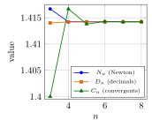
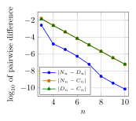
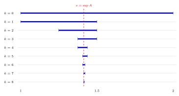
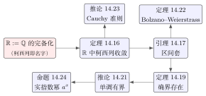

# 第 14 讲　实数：$\mathbb{Q}$ 的完备化 — (Real numbers: the completion of Q)

前十三讲使用了朴素实数约定，并把尚未证明的存在性结论记为四张欠条 (IOU)。本讲从有理数中的柯西列出发，说明实数的构造框架，再推导此前暂借的结论。

| 欠条 | 借走的东西 | 第一次借用 |
|:--:|:---|:--:|
| \#1 | 实数 (real number) 是什么：小数模型的运算合法性、$n$ 次根存在、$\mathbb{N}$ 无上界 | 第 2 讲 |
| \#2 | 确界存在性 (existence of suprema)，以及由它得到的单调有界定理 | 第 3 讲 |
| \#3 | Bolzano–Weierstrass 背后的区间套 (nested intervals) 共同点存在 | 第 5 讲 |
| \#4 | 实指数幂 (real exponent) $a^x$ 的定义与连续性 | 第 7 讲 |
| （无名） | “相邻项差几何衰减 $\Rightarrow$ 收敛”：第 4 讲用过，却没有名字 | 第 4 讲 |

第 4 讲当时是这样写的：*相邻项差几何衰减带来的这个现象，在第 14 讲会得到正式语言： 柯西列 (Cauchy sequence) 要求足够靠后的任意两项都接近*。这个名字今天给出。

本讲依次讨论有理数、柯西列、完备化，以及确界存在性等推论。构造数系所需的部分验证将明确列作已知背景；不证明各种完备性表述两两等价。

## 1 自然数、整数与有理数 (Natural numbers, integers, and rational numbers)

**自然数 (natural numbers) $\mathbb{N}$**：从 $0$ 出发，每个数有唯一的后继 (successor)， 不同的数后继不同，$0$ 不是任何数的后继，且凡是含 $0$ 并对后继封闭的性质对所有自然数成立 最后这一条就是数学归纳法 (mathematical induction)。加法与乘法按后继递归定义。

**整数 (integers) $\mathbb{Z}$**：一个整数是一对自然数的*形式差 (formal difference)* $a-b$；规定 $a-b$ 与 $c-d$ 表示同一个整数，if and only if $a+d=c+b$。由此可以 减法处处可行。

**有理数 (rational numbers) $\mathbb{Q}$**：一个有理数是一对整数的*形式商 (formal quotient)* $a/b$（$b\ne0$）；规定 $a/b$ 与 $c/d$ 表示同一个有理数，if and only if $ad=cb$。 这一步买到的新能力是除法（除以零除外）处处可行。

到这里为止，我们得到的 $\mathbb{Q}$ 具有下面这张**事实清单**，本讲全部当作已知：

1.  $\mathbb{Q}$ 是一个域 (field)：加减乘除（除数非零）封闭，交换律、结合律、分配律成立，有 $0$ 和 $1$。

2.  $\mathbb{Q}$ 是有序域 (ordered field)：任意两个有理数可比大小，且序与加法、与正数乘法相容； 三歧性 (trichotomy)：$x<y$、$x=y$、$x>y$ 恰有一个成立。

3.  绝对值 (absolute value) $|x|$ 有意义，三角不等式 (triangle inequality) $|x+y|\le|x|+|y|$ 成立。

4.  **Archimedes 性质 (Archimedean property)**：对任意有理数 $x$，存在自然数 $N>x$； 等价地，对任意有理数 $\varepsilon>0$，存在自然数 $N$ 使 $1/N<\varepsilon$。

5.  **稠密性 (density)**：$x<y$ 时 $(x+y)/2$ 是介于两者之间的有理数。

这张清单里*没有*“确界存在”，也没有“单调有界必收敛”。下面会看到，缺的正是这一条。

### 第 2 讲中可在有理数内证明的结论 (Rational versions of Lecture 2)

第 2 讲的极限定义、唯一性及基本运算法则可在 $\mathbb{Q}$ 中讨论：把各项、候选极限及误差参数限制为有理数即可。下表只核对这些条件式结论；根式的存在性及朴素实数约定仍属于欠条 \#1。

| 第 2 讲的内容 | 只需 $\mathbb{Q}$？ | 证明里真正用到的东西 |
|:---|:--:|:---|
| $\varepsilon$-$N$ 极限定义 | 是 | 绝对值与序 |
| 极限唯一性 | 是 | 三角不等式 + 三歧性 |
| 收敛 $\Rightarrow$ 有界 | 是 | 有限多项取最大 |
| 四则运算法则 | 是 | 三角不等式 + 有界性 |
| 夹逼定理 (squeeze theorem) | 是 | 序的传递性 |
| Stolz 定理 (Stolz’s theorem) | 是 | 有限求和 + 分母单调增大 |
| $1/n\to0$ | 是 | Archimedes 性质 |
| “$(1+1/n)^n$ 收敛” | **否** | 需要一个极限*存在*的理由（欠条 \#2） |

下面这个例子把最后一行和其余各行的区别摆清楚。

> [!NOTE] 词语提示
>
>
> *threshold*：门槛；*candidate*：候选值；*bounded*：有界的。
>

> [!NOTE] Example 14.1 — Everything in Lecture 2 lives inside $\mathbb{Q}$
>
>
> Work entirely inside $\mathbb{Q}$: all terms, all limits, all $\varepsilon$ are rational.
>
> **(a) A complete proof that $1/n\to0$.** Given a rational $\varepsilon>0$, the Archimedean property supplies a natural number $N$ with $1/N<\varepsilon$. For every integer $n>N$ we get $0<1/n<1/N<\varepsilon$. Nothing outside $\mathbb{Q}$ was used. Concretely, for $\varepsilon=10^{-3}$ the smallest threshold is $N=1000$: indeed $1/1001=0.000999000999\ldots<10^{-3}$, while $1/1000=10^{-3}$ is not $<\varepsilon$.
>
> **(b) The one statement that does *not* survive.** “The increasing bounded sequence $(1+1/n)^n$ converges” cannot even be *stated* inside $\mathbb{Q}$ without a target, and it is false inside $\mathbb{Q}$: Lecture 3 showed the sequence increases and stays below $3$, but its limit is $e$, and no rational number can serve as that limit (Lecture 3 proved $e$ is irrational). So the first seven rows of the table are theorems of $\mathbb{Q}$; the last row is a promise about a larger number system.
>
> **Read the difference.** Rows 1–7 are about *checking* a limit once a candidate is given. The last row is about *producing* a candidate. Only the second kind of statement needs $\mathbb{R}$.
>

这些法则在候选极限属于 $\mathbb{Q}$ 时仍然有效，却不保证有理柯西列在 $\mathbb{Q}$ 中有极限。第 2 讲的实数与开根约定仍需本讲说明。

## 2 Cauchy sequences

不指定候选极限时，可以比较数列自身任意两个充分靠后的项。第 4 讲用几何衰减的相邻差控制了这样的距离；下面把所需条件单独定义。

> [!WARNING] 先猜一猜 (Guess first) — 第 1 讲的数列，相邻两项差多大？
>
>
> 第 1 讲的牛顿迭代 (Newton iteration) $a_1=1$、$a_{n+1}=(a_n+2/a_n)/2$ 给出 $1,\ \tfrac32,\ \tfrac{17}{12},\ \tfrac{577}{408},\ \ldots$。 先猜 $|a_{n+1}-a_n|$ 在 $n=1,\dots,6$ 时各是多少*量级*（$10^{-1}$？$10^{-3}$？$10^{-12}$？）， 写在纸上再往下读。第二问更有意思：这六个差有没有可能*恰好*都是某个整数的倒数？
>

> [!IMPORTANT] 定义 14.2 — 柯西列 (Cauchy sequence)
>
>
> 设 $(a_n)$ 是 $\mathbb{Q}$ 中的数列。称它为柯西列 (Cauchy sequence)，if and only if
> $$
> \text{对每个有理数 }\varepsilon>0,\quad\text{存在 }N,\quad
>  \text{对所有 }m,n>N,\quad |a_m-a_n|<\varepsilon.
> $$
> 注意与第 2 讲的极限定义的区别：这里*没有出现极限 $L$*。条件只涉及数列自身的项。 $\mathbb{R}$ 中的柯西列同样定义，只把“有理数 $\varepsilon$”换成“实数 $\varepsilon$”。
>

> [!NOTE] 注 14.3
>
>
> 把定义读成一句话：*the tail of the sequence 的直径 (diameter) 趋于零*。 柯西条件涉及任意两个充分靠后的项；仅有相邻两项之差趋于零并不够，第 7 节给出反例。
>

现在回到第 1 讲。下面这个例子把上面的猜测变成精确的代数事实，而且完全在 $\mathbb{Q}$ 内完成。 不出现 $\sqrt2$，因为此刻我们还没有权利使用它。

> [!NOTE] 词语提示
>
>
> *in lowest terms*：已约成最简分数；*increments*：增量；*geometric*：等比的；*induction*：数学归纳法；*identity*：恒等式；*at most*：至多；*finite*：有限的。
>

> [!NOTE] 词语提示
>
>
> *exact*：精确的；*bound*：界；估计；*tail*：从某项开始的尾段。
>

> [!NOTE] Example 14.4 — The Newton sequence is Cauchy –- proved inside $\mathbb{Q}$
>
>
> Write $a_n=p_n/q_n$ in lowest terms and set $\delta_n=a_n^2-2\in\mathbb{Q}$.
>
> **(a) An exact identity.** From $a_{n+1}=(a_n^2+2)/(2a_n)$,
> $$
> \delta_{n+1}=a_{n+1}^2-2=\frac{(a_n^2+2)^2-8a_n^2}{4a_n^2}=\frac{(a_n^2-2)^2}{4a_n^2}
>  =\frac{\delta_n^2}{4a_n^2}.
> $$
> In particular $\delta_n\ge0$ for $n\ge2$, hence $a_n^2\ge2$ and $a_n\ge1$ for $n\ge 2$, and therefore
> $$
> \delta_{n+1}\le\frac{\delta_n^2}{8},\qquad n\ge2. \tag{$*$}
> $$
>
> **(b) A surprise: the increments are exact unit fractions.** With $p_{n+1}=p_n^2+2q_n^2$ and $q_{n+1}=2p_nq_n$ one computes
> $$
> p_{n+1}^2-2q_{n+1}^2=(p_n^2-2q_n^2)^2 .
> $$
> Since $p_2^2-2q_2^2=3^2-2\cdot2^2=1$, induction gives $p_n^2-2q_n^2=1$ for every $n\ge2$, i.e. $\delta_n=1/q_n^{\,2}$. Consequently
> $$
> |a_{n+1}-a_n|=\frac{|2-a_n^2|}{2a_n}=\frac{1/q_n^2}{2p_n/q_n}=\frac1{2p_nq_n}=\frac1{q_{n+1}} .
> $$
> So the answer to the guess is: *yes, exactly unit fractions*. The table is exact.
>
> | $n$ | $a_n$ | $q_{n+1}$ | $|a_{n+1}-a_n|=1/q_{n+1}$ |
> |---:|:---|---:|:---|
> | $1$ | $1$ | $2$ | $0.5$ |
> | $2$ | $3/2$ | $12$ | $8.333333\times10^{-2}$ |
> | $3$ | $17/12$ | $408$ | $2.450980\times10^{-3}$ |
> | $4$ | $577/408$ | $470832$ | $2.123900\times10^{-6}$ |
> | $5$ | $665857/470832$ | $627013566048$ | $1.594862\times10^{-12}$ |
> | $6$ | $886731088897/627013566048$ | $1111984844349868137938112$ | $8.992928\times10^{-25}$ |
>
> **(c) A geometric-of-geometric bound, and the Cauchy property.** From $\delta_2=1/4$ and $(*)$, induction gives
> $$
> \delta_n\le 8\cdot32^{-2^{\,n-2}},\qquad n\ge2,
> $$
> which the exact values confirm: $\delta_3=1/144=6.944\times10^{-3}$ against the bound $7.8125\times10^{-3}$, and $\delta_5=4.510950\times10^{-12}$ against $7.275958\times10^{-12}$. Since $|a_{n+1}-a_n|\le\delta_n/2$ and each bound is at most $1/32$ times the previous one, summing a finite geometric tail gives, for all $m>n\ge2$,
> $$
> |a_m-a_n|\le\sum_{k=n}^{m-1}|a_{k+1}-a_k|\le 8\cdot32^{-2^{\,n-2}} .
> $$
> Given a rational $\varepsilon>0$, the Archimedean property produces $n$ with the right-hand side below $\varepsilon$; e.g. $n=5$ already certifies $|a_m-a_n|<10^{-6}$ for all $m>5$, and $n=7$ certifies $10^{-30}$. Hence $(a_n)$ is a Cauchy sequence of rationals. *No square root was used anywhere.*
>

这就是第 4 讲那个无名现象的名字。它当时的形式是 $|x_{n+1}-x_n|\le q^nd$； 这里的形式更猛烈（指数上还有一个指数），但用法完全一样：由相邻差的快速衰减， 经有限求和控制住任意两项的距离。

> [!NOTE] 词语提示
>
>
> *truncating*：截断。
>

> [!NOTE] Example 14.5 — Decimal truncations are Cauchy, for a much duller reason
>
>
> Let $d_k$ be the first $k$ decimals of the decimal expansion used since Lecture 1:
> $$
> d_1=1.4=\tfrac75,\quad d_2=1.41=\tfrac{141}{100},\quad d_3=1.414=\tfrac{707}{500},
> $$
> $$
> d_4=1.4142,\quad d_5=1.41421,\quad d_6=1.414213,\ \ldots
> $$
> Every $d_k$ is rational. Truncating one more digit changes the number by at most $10^{-k}$, so for $m>k$,
> $$
> |d_m-d_k|\le 10^{-k}+10^{-k-1}+\cdots<\tfrac{10}{9}\,10^{-k}\le 2\cdot 10^{-k},
> $$
> a finite geometric sum at every stage. Given rational $\varepsilon>0$ choose $k$ with $2\cdot10^{-k}<\varepsilon$. So $(d_k)$ is Cauchy. Measured increments: $|d_2-d_1|=10^{-2}$, $|d_5-d_4|=10^{-5}$, $|d_8-d_7|=6\times10^{-8}$, $|d_{11}-d_{10}|=7\times10^{-11}$ — one new decimal digit per step, no more. Compare with Newton: at $n=6$ Newton is already at $9\times10^{-25}$. *Same property, wildly different speed.*
>

两个例子都是柯西列，快慢差了二十多个数量级。这说明柯西性是一个*定性*的条件： 它保证尾部收拢，不保证收拢得快。下面两个命题在 $\mathbb{Q}$ 内证明，不需要任何新东西。

> [!NOTE] 命题 14.6 — 收敛 $\Rightarrow$ 柯西 (Convergent implies Cauchy)
>
>
> 若 $\mathbb{Q}$ 中数列 $(a_n)$ 收敛 (converges) 到 $L\in\mathbb{Q}$，则它是柯西列 (Cauchy sequence)。
>

> [!NOTE] 证明
>
>
> 给定有理数 $\varepsilon>0$。取 $N$ 使 $n>N$ 时 $|a_n-L|<\varepsilon/2$。于是 $m,n>N$ 时 $|a_m-a_n|\le|a_m-L|+|L-a_n|<\varepsilon$。
>

> [!NOTE] 命题 14.7 — 柯西 $\Rightarrow$ 有界 (Cauchy implies bounded)
>
>
> $\mathbb{Q}$ 中的柯西列 (Cauchy sequence) 有界 (bounded)。
>

> [!NOTE] 证明
>
>
> 取 $\varepsilon=1$ 对应的 $N$，令 $m=N+1$。则 $n>N$ 时 $|a_n|\le|a_{N+1}|+1$。 再与前 $N$ 项这有限多个数的绝对值一起取最大值。
>

注意这两条的方向。它们都*不*说柯西列一定收敛。下一节说明：在 $\mathbb{Q}$ 里，那句话是假的。

## 3 有理柯西列未必有有理极限 (Rational Cauchy sequences without rational limits)

> [!WARNING] 先猜一猜 (Guess first) — Must a rational Cauchy sequence have a rational limit?
>
>
> $\mathbb{Q}$ 里有没有一个柯西列，它既不收敛到任何有理数，也不逼近任何我们说得出名字的数？ 换句话说：不收敛的柯西列，是不是可能“指向虚空”？ 先给一个判断，再往下读。（第 4 节会看到，答案是：没有。这件事正是 $\mathbb{R}$ 的定义要表达的。）
>

第 1 讲留下三个问题，第三个是：*每一项都是有理数，它逼近的到底是什么？* 第 4 讲回答了第二个（为什么这么快），第三个当时写着“留给第 14 讲”。现在它可以升级成一个 定理。注意，这不是“我们还没找到”，而是“不存在”。

> [!NOTE] 定理 14.8 — 牛顿数列在 $\mathbb{Q}$ 内没有极限 (No rational limit)
>
>
> 第 1 讲的牛顿数列 (Newton iteration) $a_1=1$、$a_{n+1}=(a_n+2/a_n)/2$ 是 $\mathbb{Q}$ 中的柯西列 (Cauchy sequence)，但不存在有理数 (rational number) $L$ 使 $a_n\to L$。
>

> [!NOTE] 证明
>
>
> 柯西性已证。设有理数 $L$ 满足 $a_n\to L$。由 $n\ge2$ 时 $a_n\ge1$ 及极限保序，$L\ge1>0$。 第 2 讲的四则运算法则（它只用 $\mathbb{Q}$）给出 $2/a_n\to2/L$，故 $a_{n+1}=(a_n+2/a_n)/2\to(L+2/L)/2$。另一方面去掉首项不改变极限，$a_{n+1}\to L$。 由极限唯一性 $L=(L+2/L)/2$，即 $L^2=2$。而第 1 讲的 $\sqrt2$ 的无理性定理 (Irrationality of $\sqrt2$) 说不存在平方为 $2$ 的有理数。矛盾。
>

> [!NOTE] 推论 14.9 — Cauchy 准则在 $\mathbb{Q}$ 中不成立
>
>
> 存在 $\mathbb{Q}$ 中的柯西列 (Cauchy sequence) 不收敛 (does not converge)。
>

同一个洞用“确界”的语言看是这样的。

> [!NOTE] 词语提示
>
>
> *bounded above*：有上界的；*upper bound*：上界；*supremum*：上确界；*strictly*：严格地；*least*：最小的。
>

> [!NOTE] Example 14.10 — A bounded set of rationals with no rational least upper bound
>
>
> Let
> $$
> A=\{x\in\mathbb{Q}:\ x>0,\ x^2<2\}.
> $$
> $A$ is nonempty ($1\in A$) and bounded above (if $x>0$ and $x^2<2$ then $x<2$). We show $A$ has *no* least upper bound inside $\mathbb{Q}$.
>
> **(a) No element of $A$ is an upper bound.** For $x\in A$ put
> $$
> x'=x+\frac{2-x^2}{2x+2}=\frac{x^2+2x+2}{2x+2}.
> $$
> Then $x'>x$, and a direct computation gives
> $$
> 2-x'^2=\frac{(2-x^2)(x^2+4x+2)}{(2x+2)^2}>0,
> $$
> so $x'\in A$. Numerically: $x=7/5$ ($x^2=1.96$) gives $x'=169/120=1.40833333$ with $x'^2=1.98340278$; $x=1.414$ gives $x'=1.41412510$ with $x'^2=1.99974981$.
>
> **(b) No upper bound is least.** If $y>0$ is a rational upper bound of $A$ then $y^2>2$ (if $y^2<2$ then $y\in A$ and (a) beats it; $y^2=2$ is impossible). Put $y'=(y^2+2)/(2y)$ — *Newton’s map again*. Then $y'<y$ and $y'^2-2=(y^2-2)^2/(4y^2)>0$, so $y'$ is again an upper bound, strictly smaller. Numerically: $y=3/2$ gives $y'=17/12=1.41666667$ with $y'^2=2.00694444$; $y=1.42$ gives $y'=1.414225352$ with $y'^2=2.000033347$.
>
> **Conclusion.** Every candidate is beaten from one side or the other. Inside $\mathbb{Q}$ the supremum of $A$ does not exist. The two improvement maps in (a) and (b) are exactly the two sides of the hole, and (b) is literally the iteration of Lecture 1.
>

所以，第 3 讲那张欠条 \#2 不是“暂时没证”，而是*在 $\mathbb{Q}$ 里根本不对*。 要让它成立，必须换一个更大的数系。而且要注意：洞的位置是被那个柯西列*指定*的。 不同的柯西列指向不同的洞。这就提示了唯一合理的做法。

## 4 定义实数 (Defining $\mathbb{R}$: the completion of $\mathbb{Q}$)

想法只有一句话：**把柯西列本身当作实数的名字**。

> [!IMPORTANT] 定义 14.11 — 实数 (Real number)
>
>
> 一个实数 (real number) 就是 $\mathbb{Q}$ 中一个柯西列 (Cauchy sequence) 所*命名*的对象。 $(a_n)$ 命名的实数记作 $\left\langle a_n\right\rangle$，并规定
> $$
> \left\langle a_n\right\rangle=\left\langle b_n\right\rangle\quad\Longleftrightarrow\quad a_n-b_n\to0 .
> $$
> 所有这些名字组成的集合记作 $\mathbb{R}$。常数列 $(q,q,q,\ldots)$ 命名的实数就记作 $q$； 这样 $\mathbb{Q}\subseteq\mathbb{R}$。
>

“$\mathbb{R}$ 是使 $\mathbb{Q}$ 的每个柯西列都收敛的最小扩张”这句话，就是上面这个定义的口语版本： 我们*恰好*为每个柯西列补上一个极限，不多补，也不少补； 两个柯西列该不该共用同一个极限，由“差趋于零”判定。第 3 节那个猜测的答案现在清楚了： 没有哪个柯西列会指向虚空，因为*它自己就是它所指向的那个数的名字*。

> [!WARNING] 先猜一猜 (Guess first) — Different sequences representing the same number
>
>
> $\left\langle a_n\right\rangle=\left\langle b_n\right\rangle$ 只要求 $a_n-b_n\to0$。那么一个实数有多少个不同的柯西列名字？ 一个、有限多个、还是无穷多个？给出理由再往下读。
>

答案是无穷多个：在任何一个名字上把第 $n$ 项改动 $10^{-n}$（甚至改动前一百项）， 差仍趋于零，得到的还是同一个数。下面是这件事最著名的一个特例。

> [!NOTE] Example 14.12 — $0.999\ldots=1$: two names, one number
>
>
> Take $b_n=1-10^{-n}$, that is $0.9,\ 0.99,\ 0.999,\ldots$, and the constant sequence $c_n=1$. Both are Cauchy in $\mathbb{Q}$. Their difference is
> $$
> c_n-b_n=10^{-n}:\qquad 0.1,\ 0.01,\ 0.001,\ \ldots,\ 10^{-6},\ \ldots,\ 10^{-10},\ \ldots\ \to0 .
> $$
> Hence $\left\langle b_n\right\rangle=\left\langle c_n\right\rangle$, i.e. $0.999\ldots=1$. This is not an approximation, a limiting convention, or a trick: the two sequences are two *names*, and the definition says when two names denote the same number. Asking “but is $0.999\ldots$ *really* equal to $1$?” is asking whether two spellings of one word are the same word.
>

> [!NOTE] 词语提示
>
>
> *iterates*：迭代项；*index*：下标。
>

> [!NOTE] Example 14.13 — Three names for $\sqrt2$
>
>
> Compare, at the same index $n$, three rational sequences built by completely different recipes:
> $$
> \begin{aligned}
>  N_n&:\ 1,\ \tfrac32,\ \tfrac{17}{12},\ \tfrac{577}{408},\ \ldots &&\text{(Newton)}\\
>  D_n&:\ 1.4,\ 1.41,\ 1.414,\ 1.4142,\ \ldots &&\text{(decimal truncations)}\\
>  C_n&:\ 1,\ \tfrac32,\ \tfrac75,\ \tfrac{17}{12},\ \tfrac{41}{29},\ \tfrac{99}{70},\
>  \tfrac{239}{169},\ \tfrac{577}{408},\ \ldots &&\text{(continued-fraction convergents)}
> \end{aligned}
> $$
> All three are Cauchy. The exact pairwise differences:
>
> | $n$ | $|N_n-D_n|$ | $|N_n-C_n|$ | $|D_n-C_n|$ |
> |---:|:---|:---|:---|
> | $3$ | $2.6667\times10^{-3}$ | $1.6667\times10^{-2}$ | $1.4000\times10^{-2}$ |
> | $5$ | $3.5624\times10^{-6}$ | $4.2046\times10^{-4}$ | $4.1690\times10^{-4}$ |
> | $7$ | $6.2373\times10^{-8}$ | $1.2379\times10^{-5}$ | $1.2317\times10^{-5}$ |
> | $10$ | $7.3095\times10^{-11}$ | $6.2522\times10^{-8}$ | $6.2595\times10^{-8}$ |
>
> All three columns tend to $0$, so $\left\langle N_n\right\rangle=\left\langle D_n\right\rangle=\left\langle C_n\right\rangle$: *one* real number with three names. Note also an exact curiosity worth checking by hand: $N_1=C_1$, $N_2=C_2$, $N_3=C_4=17/12$, $N_4=C_8=577/408$, $N_5=C_{16}=665857/470832$ — the Newton iterates are precisely the convergents with index $2^{\,n-1}$.
>

### 需要验证的事项清单 (Properties required by the construction)

要让上面的定义真正是一个数系，必须逐条验证下面这些事。本讲*只列清单，不做验证*。

|  |  |
|---:|:---|
| 1 | 两个柯西列逐项相加、相乘，结果仍是柯西列；于是可以定义 $\left\langle a_n\right\rangle+\left\langle b_n\right\rangle=\left\langle a_n+b_n\right\rangle$，乘法同理。 |
| 2 | 换成等价的名字（差趋于零），和与积命名的实数不变。即加法与乘法 well-defined。 |
| 3 | 序：定义 $\left\langle a_n\right\rangle>0$ 为“存在有理数 $c>0$ 与 $N$，使 $n\ge N$ 时 $a_n\ge c$”； |
|  | 验证它不依赖名字的选取，并验证三歧性。 |
| 4 | 嵌入：$q\mapsto\left\langle q,q,\ldots\right\rangle$ 保持加、乘与大小；两个有理数作为实数相等 if and only if 它们本来相等。 |
| 5 | 域公理与序公理在 $\mathbb{R}$ 上全部成立；非零实数有倒数（这一条最麻烦，要把名字换成远离 $0$ 的那种）。 |
| 6 | $\mathbb{Q}$ 在 $\mathbb{R}$ 中稠密 (dense)，且 Archimedes 性质在 $\mathbb{R}$ 上成立。 |
| 7 | **每个 $\mathbb{Q}$ 中的柯西列在 $\mathbb{R}$ 中收敛到它所命名的那个实数**：$a_n\to\left\langle a_n\right\rangle$。 |

> [!NOTE] 注 14.14
>
>
> 完整构造还须验证上述运算与次序性质。本讲以这些性质为背景，只展开后续分析所需的推论；构造细节可另行查阅参考材料。
>

> [!NOTE] 注 14.15 — 另一条路：分割
>
>
> 历史上还有一条经典路线，由 Dedekind 给出：把 $\mathbb{Q}$ 切成左右两个类（左类的每个数小于右类的 每个数），每一次这样的*分割 (cut)* 定义一个实数。洞由“切口”命名，而不是由柯西列命名。 两条路线给出同构的数系。本课只走柯西这一条，因为它与我们十三周里一直在做的事 （估计尾部、控制误差）是同一件事。
>

下一节以第 7 条为前提：有理柯西列在所构造的实数系中收敛于其等价类。

## 5 Consequences of completeness

> [!WARNING] 先猜一猜 (Guess first) — 二分法要多少步？
>
>
> 已知某个数落在 $[1,2]$ 中。每次取中点，判断它在左半还是右半。 先猜：要把它定位到 $10^{-6}$ 以内需要多少步？$10^{-12}$ 呢？ （提示：第 7 讲的二分法每步增加约 $0.3$ 位小数。）
>

> [!NOTE] 定理 14.16 — $\mathbb{R}$ 中的柯西列收敛 (Cauchy sequences of reals converge)
>
>
> $\mathbb{R}$ 中的每个柯西列 (Cauchy sequence) 都收敛 (converges) 到某个实数。
>

> [!NOTE] 证明 — 对角逼近，两行
>
>
> 设 $(x_n)$ 是 $\mathbb{R}$ 中柯西列。由清单第 6 条（$\mathbb{Q}$ 稠密），对每个 $n$ 取有理数 $a_n$ 使 $|x_n-a_n|<1/n$。于是
> $$
> |a_m-a_n|\le|a_m-x_m|+|x_m-x_n|+|x_n-a_n|<\tfrac1m+|x_m-x_n|+\tfrac1n ,
> $$
> 右边可以任意小，故 $(a_n)$ 是 $\mathbb{Q}$ 中柯西列。令 $L=\left\langle a_n\right\rangle$。由清单第 7 条 $a_n\to L$，于是 $|x_n-L|\le|x_n-a_n|+|a_n-L|\to0$。
>

这里为每个 $x_n$ 选取误差小于 $1/n$ 的有理数 $a_n$，先证明 $(a_n)$ 是柯西列，再由两列之差趋于零确定 $(x_n)$ 的极限。

> [!NOTE] 引理 14.17 — 区间套引理 (Nested Interval Lemma)
>
>
> 设 $I_n=[A_n,B_n]$ 是非空闭区间 (nonempty closed intervals)，$I_{n+1}\subseteq I_n$， 且长度 $B_n-A_n\to0$。则存在唯一的实数属于所有 $I_n$。
>

> [!NOTE] 证明
>
>
> $(A_n)$ 递增、$(B_n)$ 递减，且 $A_n\le B_n$。给定 $\varepsilon>0$，取 $N$ 使 $B_N-A_N<\varepsilon$； 则 $m,n\ge N$ 时 $A_m,A_n\in[A_N,B_N]$，故 $|A_m-A_n|<\varepsilon$。所以 $(A_n)$ 是柯西列， 由定理 [14.16](#l14-thm:A) 收敛到某个 $c$。固定 $n$，对 $m\ge n$ 有 $A_n\le A_m\le B_n$， 令 $m\to\infty$ 并用极限保序得 $A_n\le c\le B_n$，即 $c\in I_n$ 对每个 $n$ 成立。 若 $c'$ 也属于所有 $I_n$，则 $|c-c'|\le B_n-A_n\to0$，故 $c'=c$。
>

> [!NOTE] 注 14.18
>
>
> 两个条件都不能去掉，而且各管一件事。开区间 $(0,1/n)$ 前后相套、长度趋于零， 公共部分却是*空*的。闭性负责**存在**。闭区间 $[0,1+1/n]$ 前后相套、 每个都非空，但长度趋于 $1$ 而不是 $0$，公共部分是整个 $[0,1]$，不止一个点。 长度趋于零负责**唯一**。第 5 讲画的那张越缩越短的图，现在有了它所缺的那一句保证。
>

> [!NOTE] 定理 14.19 — 确界存在性 (Supremum Property)
>
>
> 非空且有上界 (bounded above) 的实数集合 $E\subseteq\mathbb{R}$ 有唯一的上确界 (supremum) $\sup E$。 对应地，非空且有下界的集合有下确界 (infimum)。
>

> [!NOTE] 证明 — 二分法，且二分法直接造出一个*有理*柯西列
>
>
> 由 $\mathbb{R}$ 上的 Archimedes 性质取整数 $A_0$ 使 $A_0$ 不是 $E$ 的上界，取整数 $B_0$ 使 $B_0$ 是上界。 递归地令 $m_k=(A_k+B_k)/2$：若 $m_k$ 是 $E$ 的上界，取 $A_{k+1}=A_k$、$B_{k+1}=m_k$； 否则取 $A_{k+1}=m_k$、$B_{k+1}=B_k$。于是恒有
> $$
> A_k\text{ 不是上界},\qquad B_k\text{ 是上界},\qquad B_k-A_k=(B_0-A_0)2^{-k}\to0 ,
> $$
> 并且所有 $A_k,B_k$ 都是**有理数**。区间 $[A_k,B_k]$ 前后相套，由引理 [14.17](#l14-lem:B) 有唯一公共点 $s$；而 $(B_k)$ 是 $\mathbb{Q}$ 中的柯西列，所以 $s=\left\langle B_k\right\rangle$。 上确界就是二分数据本身命名的那个实数。
>
> $s$ 是上界：对 $x\in E$ 与每个 $k$ 有 $x\le B_k$，令 $k\to\infty$ 得 $x\le s$。 $s$ 最小：设上界 $t<s$。因 $(B_k)$ 递减且收敛到 $s$，有 $B_k\ge s$；取 $k$ 使 $B_k-A_k<s-t$，则 $A_k>B_k-(s-t)\ge t$。但 $A_k$ 不是上界，故存在 $x\in E$ 使 $x>A_k>t$，与 $t$ 是上界矛盾。唯一性：两个最小上界互相 $\le$。 下确界的情形对 $-E$ 用同一结论。
>

> [!NOTE] 词语提示
>
>
> *bisection*：二分法；*midpoint*：中点；*certify*：给出严格保证。
>

> [!NOTE] Example 14.20 — The bisection, run 24 times
>
>
> Take $E=A=\{x\in\mathbb{Q}:x>0,\ x^2<2\}$ of §3 and start from $[A_0,B_0]=[1,2]$. The midpoint test is “$m^2<2$?”, pure rational arithmetic.
>
> | $k$ | $A_k$ | $B_k$ | $2^{-k}$ |
> |---:|:---|:---|---:|
> | $1$ | $1$ | $3/2=1.5$ | $5.000\times10^{-1}$ |
> | $2$ | $5/4=1.25$ | $3/2$ | $2.500\times10^{-1}$ |
> | $4$ | $11/8=1.375$ | $23/16=1.4375$ | $6.250\times10^{-2}$ |
> | $7$ | $181/128=1.4140625$ | $91/64=1.421875$ | $7.813\times10^{-3}$ |
> | $12$ | $181/128$ | $5793/4096=1.414306640625$ | $2.441\times10^{-4}$ |
> | $20$ | $741455/524288=1.4142131805$ | $1482911/1048576=1.4142141342$ | $9.537\times10^{-7}$ |
> | $24$ | $11863283/8388608$ | $23726567/16777216$ | $5.960\times10^{-8}$ |
>
> So $20$ steps certify $10^{-6}$ and $40$ steps certify $10^{-12}$: each step buys $\log_{10}2\approx0.301$ decimal digits, exactly as in the bisection of Lecture 7 and exactly *unlike* Newton, which needed $5$ steps for $10^{-6}$. Slow — but this slow algorithm is what *proves existence*, and Newton is what *computes*. Keep the two jobs apart.
>

> [!NOTE] 推论 14.21 — 单调有界定理 (Monotone Convergence Theorem)
>
>
> 有上界 (bounded above) 的单调递增实数列 (monotonically increasing sequence) 收敛， 且极限为 $\sup\{x_n\}$；有下界的单调递减数列收敛于 $\inf\{x_n\}$。
>

> [!NOTE] 证明
>
>
> 由定理 [14.19](#l14-thm:C) 取 $s=\sup\{x_n\}$。给定 $\varepsilon>0$，$s-\varepsilon$ 不是上界， 故有 $N$ 使 $x_N>s-\varepsilon$；单调性给出 $n\ge N$ 时 $s-\varepsilon<x_N\le x_n\le s$。 递减情形对 $-x_n$ 使用同一结论。
>

> [!NOTE] 定理 14.22 — Bolzano–Weierstrass 定理 (Bolzano–Weierstrass theorem)
>
>
> 每个有界实数列 (bounded real sequence) 都有一条收敛子列 (convergent subsequence)。
>

> [!NOTE] 证明
>
>
> 设所有项落在 $I_0=[A,B]$ 中。把 $I_0$ 二等分，至少有一半含有无穷多个*编号*的项 （否则两边编号都有限，合起来也有限）；取这一半为 $I_1$，重复。得到前后相套的闭区间 $I_0\supseteq I_1\supseteq\cdots$，$|I_j|=(B-A)2^{-j}\to0$，每个 $I_j$ 含无穷多个编号。 由引理 [14.17](#l14-lem:B) 存在唯一公共点 $c$。递归取 $n_1<n_2<\cdots$ 使 $a_{n_j}\in I_j$ （可行，因为每个 $I_j$ 含无穷多个编号）。则 $|a_{n_j}-c|\le|I_j|\to0$。
>

这正是第 5 讲画过的那张图。当时缺的那一句。“不断缩短、前后相套的非空闭区间， 若长度趋于零，必共同包含一个实数点”。就是引理 [14.17](#l14-lem:B)，现在它有证明了。

> [!NOTE] 推论 14.23 — Cauchy 收敛准则 (Cauchy criterion in $\mathbb{R}$)
>
>
> 实数列收敛 (converges) if and only if 它是柯西列 (Cauchy sequence)。
>

> [!NOTE] 证明
>
>
> 充分性就是定理 [14.16](#l14-thm:A)；必要性与第 2 节 $\mathbb{Q}$ 中的证明逐字相同。
>

最后把欠条 \#4 也还掉。

> [!NOTE] 命题 14.24 — 实指数幂 (Real exponents)
>
>
> 设 $a>1$。对每个实数 $x$，集合 $\{a^r:r\in\mathbb{Q},\ r\le x\}$ 非空且有上界， 故可定义 $a^x=\sup\{a^r:r\in\mathbb{Q},\ r\le x\}$。当 $x$ 本身是有理数时， 这个定义与有理指数幂一致；$x\mapsto a^x$ 单调递增。$0<a<1$ 时用 $a^x=(1/a)^{-x}$。
>

> [!NOTE] 证明 — 要点
>
>
> 非空由 $\mathbb{Q}$ 的 Archimedes 性质；有上界：取有理数 $R>x$，则 $r\le x<R$ 时 $a^r<a^R$。 定理 [14.19](#l14-thm:C) 给出上确界。与有理指数一致，是因为有理指数幂对有理数单调递增， 所以 $r\le x$ 中 $r=x$ 时取到最大。
>

图 3：在第 4 节所列构造性质的前提下，各结论的证明依赖如箭头所示。

## 6 The completeness results used earlier

| 欠条 | 借走的东西 | 在哪里还 | 状态 |
|:--:|:---|:---|:---|
| \#1 | 实数是什么；运算合法；$n$ 次根存在；$\mathbb{N}$ 无上界 | 第 4 节所列性质；正根见下文 | 已说明 |
| \#2 | 确界存在性；单调有界定理 | 定理 [14.19](#l14-thm:C)、推论 [14.21](#l14-cor:D) | 已销账 |
| \#3 | 区间套的共同点存在；Bolzano–Weierstrass | 引理 [14.17](#l14-lem:B)、定理 [14.22](#l14-thm:E) | 已销账 |
| \#4 | 实指数幂 $a^x$ | 命题 [14.24](#l14-prop:G) | 已销账 |
| （无名） | 相邻项差几何衰减 $\Rightarrow$ 收敛 | 第 2 节：柯西列；推论 [14.23](#l14-cor:F) | 已命名 |

欠条 \#1 里的“任意正数都有正的 $n$ 次根”，现在是确界存在性的一个直接推论： 设 $a>0$，$n\ge1$ 为整数，令 $E=\{x>0:x^n<a\}$。 取 $x=\min(1,a)/2$ 可知 $E$ 非空，而 $a+1$ 是上界；故 $s=\sup E>0$ 存在。 若 $s^n<a$，取 $0<h<1$ 且 $nh(s+1)^{n-1}<a-s^n$。由幂差分解，
$$
(s+h)^n-s^n
 =h\sum_{j=0}^{n-1}(s+h)^{n-1-j}s^j
 \le nh(s+1)^{n-1}<a-s^n,
$$
故 $s+h\in E$，矛盾。 若 $s^n>a$，取 $0<h<s$ 且 $nhs^{n-1}<s^n-a$；同样有 $s^n-(s-h)^n\le nhs^{n-1}<s^n-a$。 于是 $(s-h)^n>a$，从而 $s-h$ 也是 $E$ 的上界，仍矛盾。 因此 $s^n=a$；正数的 $n$ 次幂严格递增，故这个正根唯一。 欠条 \#1 里的“$\mathbb{N}$ 在 $\mathbb{R}$ 中无上界”，是清单第 6 条。

表中四张欠条所需的结论已由上述构造性质与推论得到。

## 7 Decimal expansions and the Cauchy condition

给定实数 $x>0$，令 $u_k$ 为 $x$ 的前 $k$ 位截断 (truncation)，即满足 $u_k\le x<u_k+10^{-k}$ 的那个 $k$ 位有限小数。每个 $u_k$ 是有理数， $|u_m-u_k|\le10^{-k}$（$m>k$），所以 $(u_k)$ 是柯西列，且 $\left\langle u_k\right\rangle=x$。 反过来，每个柯西列都命名一个实数。于是：

*“无限小数”不是实数的定义，而是实数的一种书写方式； 它是一个特别规整的柯西列名字。*

第 2 讲使用的无限小数约定现在可由截断数列解释。同一个实数可以有不同的小数表示，例如 $0.999\ldots=1$。

> [!WARNING] 先猜一猜 (Guess first) — 位数会不会一直翻？
>
>
> 下面这列数在小数点后第一位上永远地在 $4$ 与 $5$ 之间翻来翻去：
> $$
> 0.49,\quad 0.501,\quad 0.4999,\quad 0.50001,\quad 0.499999,\quad 0.5000001,\ \ldots
> $$
> 先猜：它收敛吗？如果收敛，极限是多少？如果“位数稳定下来”是收敛的必要条件， 那这个例子怎么办？
>

> [!NOTE] 词语提示
>
>
> *display*：显示结果。
>

> [!NOTE] Example 14.25 — Stabilising digits is NOT the Cauchy condition
>
>
> Define, for $n\ge1$,
> $$
> c_n=\frac12+\frac{(-1)^n}{10^{\,n+1}} .
> $$
> Exact values and the first decimal digit:
>
> | $n$ | $c_n$ (exact fraction) | decimal        | first digit after the point |
> |------:|:-------------------------|:---------------|:---------------------------:|
> | $1$ | $49/100$               | $0.49$       |            $4$            |
> | $2$ | $501/1000$             | $0.501$      |            $5$            |
> | $3$ | $4999/10000$           | $0.4999$     |            $4$            |
> | $4$ | $50001/100000$         | $0.50001$    |            $5$            |
> | $5$ | $499999/1000000$       | $0.499999$   |            $4$            |
> | $6$ | $5000001/10^7$         | $0.5000001$  |            $5$            |
> | $7$ | $49999999/10^8$        | $0.49999999$ |            $4$            |
>
> The first decimal digit never settles: it is $4,5,4,5,4,5,4,\ldots$ forever, and so is every digit further right. Yet $|c_n-\tfrac12|=10^{-(n+1)}$, so $c_n\to\tfrac12$, and for $m>n$,
> $$
> |c_m-c_n|\le 10^{-(m+1)}+10^{-(n+1)}\le 2\cdot10^{-(n+1)} .
> $$
> The sequence is Cauchy. **Moral:** the Cauchy condition is about *distance between terms*, not about *agreement of digit strings*. A decimal display can disagree in every printed position and still be within $10^{-9}$. When an AI prints a table of iterates and you compare digit strings by eye, you are measuring the wrong thing.
>

> [!NOTE] 词语提示
>
>
> *consecutive*：相邻的；*shrink*：缩小；*decay*：衰减。
>

> [!NOTE] Example 14.26 — And the opposite mistake: small steps are not enough
>
>
> Let $H_n=1+\tfrac12+\cdots+\tfrac1n$. The steps shrink: $H_{n+1}-H_n=1/n\to0$, e.g. $1/2048=4.8828\times10^{-4}$. But the sequence is not Cauchy, because grouping the terms between $n$ and $2n$ gives $H_{2n}-H_n\ge n\cdot\frac1{2n}=\frac12$ for every $n$:
> $$
> \begin{aligned}
>  &H_{16}-H_8=0.662872, &&H_{128}-H_{64}=0.689256,\\
>  &H_{1024}-H_{512}=0.692659, &&H_{4096}-H_{2048}=0.693025 .
>  \end{aligned}
> $$
> These never fall below $\tfrac12$; in fact they climb towards $\ln 2=0.693147\ldots$, so $\varepsilon=\tfrac12$ has no $N$ at all. Another witness: $b_n=\sqrt n$ has $b_{n+1}-b_n=4.99999875\times10^{-4}$ at $n=10^6$, while $b_{4n}-b_n=1000$ exactly. **Moral:** “consecutive differences $\to0$” is strictly weaker than Cauchy. What Lecture 4 actually used was not “$|x_{n+1}-x_n|\to0$” but “$|x_{n+1}-x_n|\le q^n d$ with $q<1$”, which sums to a controllable tail. The geometric decay was doing the work all along.
>

> [!NOTE] 词语提示
>
>
> *iterate*：迭代项；*verify*：核实。
>

> [!IMPORTANT] Exercise 14.27 — Which of the three conditions is which?
>
>
> For each sequence decide, before computing, whether (i) consecutive differences tend to $0$, (ii) the sequence is Cauchy, (iii) the sequence converges (in $\mathbb{R}$), and, for the two sequences whose terms are all rational, (iv) whether it converges *in $\mathbb{Q}$*:
> $$
> x_n=\ln n,\qquad y_n=\sum_{k=1}^n\frac1{k^2},\qquad
>  z_n=\text{the }n\text{-th Newton iterate for }\sqrt3,\qquad w_n=(-1)^n .
> $$
> Then verify each answer numerically with at most six computed values, and say which of your four verdicts a finite table could never establish.
>

> [!NOTE] 词语提示
>
>
> *denominator*：分母；*convergence*：收敛；*benchmarks*：核对用的参考结果；*predict*：预测；*valid*：有效的；*slope*：斜率。
>

> [!NOTE] AI Lab — Three roads to one number, and one road to $\pi$
>
>
> **Part 1 — three names for $\sqrt2$.** Ask an AI to generate, with *exact rational arithmetic* (Python’s `fractions.Fraction`, never floats), the first $10$ terms of
> $$
> \begin{aligned}
>  &N_{n+1}=\tfrac12\Bigl(N_n+\tfrac2{N_n}\Bigr),\ N_1=1;
>   &&D_n=\text{the first }n\text{ decimals of the expansion};\\[2pt]
>  &C_{n+1}=\frac{p_n+2q_n}{p_n+q_n}\quad\Bigl(C_n=\tfrac{p_n}{q_n},\ C_1=1\Bigr).
>  \end{aligned}
> $$
> Then plot $\log_{10}|N_n-D_n|$, $\log_{10}|N_n-C_n|$, $\log_{10}|D_n-C_n|$ against $n$.
>
> **Before running it:** predict which of the three curves falls fastest, and predict whether all three must fall at all. Predict the *sign* of the slope change between $n=5$ and $n=10$.
>
> **Benchmarks from an actual run** (exact rational arithmetic; the numbers below are the true values, so your run must reproduce them):
> $$
> \begin{array}{rlll}
> n=3: & |N-D|=2.6667\times10^{-3} & |N-C|=1.6667\times10^{-2} & |D-C|=1.4000\times10^{-2}\\
> n=7: & |N-D|=6.2373\times10^{-8} & |N-C|=1.2379\times10^{-5} & |D-C|=1.2317\times10^{-5}\\
> n=10:& |N-D|=7.3095\times10^{-11}& |N-C|=6.2522\times10^{-8} & |D-C|=6.2595\times10^{-8}
> \end{array}
> $$
> Also check the exact coincidences $N_3=C_4=17/12$, $N_4=C_8=577/408$, $N_5=C_{16}=665857/470832$.
>
> **Answer from the output.** Why do the two curves involving $C$ lie almost on top of each other? (Hint: a difference is dominated by the *slower* of the two sequences.) Does the picture prove that the three sequences name the same real number, or only make it plausible? Which single line of your table would you have to replace by an inequality valid for all $n$ to turn the picture into a proof?
>
> **Part 2 — a rational Cauchy sequence for $\pi$.** Ask the AI to compute $\pi$ to $50$ decimals from a formula it states explicitly (do not let it recite digits from memory), and to produce the continued-fraction convergents $P_i=h_i/k_i$. Plot the number of digits of the denominator $k_i$ against $i$, and $\log_{10}|P_{i+1}-P_i|$ against $i$. Benchmarks: $P_1=3$, $P_2=22/7$, $P_3=333/106$, $P_4=355/113$, $P_5=103993/33102$, $P_8=312689/99532$; and
> $$
> \begin{aligned}
>  &|P_2-P_1|=\tfrac1{1\cdot7}=1.429\times10^{-1},
>   &&|P_4-P_3|=\tfrac1{106\cdot113}=8.349\times10^{-5},\\[2pt]
>  &|P_8-P_7|=\tfrac1{66317\cdot99532}=1.515\times10^{-10}.
>  \end{aligned}
> $$
> **Answer from the output.** The identity $|P_{i+1}-P_i|=1/(k_ik_{i+1})$ holds exactly. Use it to explain why denominator growth *is* the convergence rate here, and why $355/113$ is unusually good. Finally: your plot is evidence that $(P_i)$ is Cauchy in $\mathbb{Q}$; what does this lecture then let you conclude about $\pi$ — and what does it *not* let you conclude about whether $\pi$ is rational?
>

## 8 Exercises

> [!NOTE] 词语提示
>
>
> *subsequence*：子列；*truncation*：截断；*eventually*：从某一项起始终；*convergent*：收敛的；*hypothesis*：假设；*magnitude*：数量级；*monotone*：单调的。
>

> [!NOTE] 词语提示
>
>
> *harmonic*：调和的；*estimate*：估计；*exhibit*：给出具体例子；*nested*：逐层包含的。
>

1. **14.1**  $\bigstar$ **(homework)** Before computing anything, guess the order of magnitude of $|a_{n+1}-a_n|$ for $n=1,\dots,5$ for the Newton iteration of $\sqrt3$ ($a_1=1$, $a_{n+1}=(a_n+3/a_n)/2$). Then compute the five values as exact fractions. Is the analogue of $p_n^2-2q_n^2=1$ true here? State what you find as an identity and prove it. Finally, write down an explicit $N$ such that $|a_m-a_n|<10^{-9}$ for all $m>n\ge N$, using only rational arithmetic.

1. **14.2**  $\bigstar$ Decide by eye, then prove: which of these are Cauchy sequences of rationals?
    $$
    \frac{n}{n+1},\qquad (-1)^n\frac{n}{n+1},\qquad \sum_{k=1}^{n}\frac1{k(k+1)},\qquad
     \sum_{k=1}^{n}\frac1{\sqrt k}.
    $$
    For the two that are Cauchy, give an explicit $N(\varepsilon)$; for the others, exhibit one $\varepsilon_0$ for which no $N$ works, and say which of the two failure modes of §7 occurs.

1. **14.3**  $\bigstar$ Give three different Cauchy sequences of rationals naming the number $1/3$, one of which is not eventually constant and takes values on both sides of $1/3$. Prove that your three are pairwise equivalent by exhibiting the differences explicitly. How many such sequences are there?

1. **14.4**  $\bigstar\bigstar$ **(homework)** Estimate first: to locate a number in $[0,1]$ to within $10^{-9}$, how many bisection steps are needed, and how many Newton steps (assume the error squares each time, starting from $10^{-1}$)? Compute both answers exactly. Then explain, in two sentences, why the *slow* method is the one used to prove Theorem [14.19](#l14-thm:C) and the fast one is not.

1. **14.5**  $\bigstar\bigstar$ Let $E=\{x\in\mathbb{Q}:x>0,\ x^3<5\}$. Show $E$ is nonempty and bounded above. Guess $\sup E$ to two decimals before computing. Then imitate §3: produce a map that strictly improves any element of $E$ inside $E$, and a map that strictly improves any rational upper bound. Conclude that $E$ has no least upper bound inside $\mathbb{Q}$. Run six bisection steps on $[1,2]$ and report the interval.

1. **14.6**  $\bigstar\bigstar$ Construct a sequence of nonempty nested *open* intervals with empty intersection, and a sequence of nested closed intervals whose lengths do not tend to $0$ and whose intersection contains more than one point. For each, say exactly which hypothesis of the Nested Interval Lemma fails. Then decide: is “lengths tend to $0$” needed for *existence* of a common point, for *uniqueness*, or for both?

1. **14.7**  $\bigstar\bigstar$ The sequence $s_n=\sum_{k=1}^n\frac{(-1)^{k+1}}{k}$ has $s_1=1$, $s_2=0.5$, $s_3=0.833333$, $s_4=0.583333$. Guess whether it is Cauchy before computing more. Then prove $|s_m-s_n|\le 1/(n+1)$ for $m>n$ and find $N$ making this $<10^{-3}$. Compare with the harmonic example of §7: same terms up to signs, opposite verdict. Which feature of the signs is doing the work?

1. **14.8**  $\bigstar\bigstar$ **(homework)** Two students name a real number. Student A writes $1.4,\ 1.41,\ 1.414,\ 1.4142,\ldots$; student B writes $1.5,\ 1.42,\ 1.4143,\ 1.41422,\ldots$ (each term of B is A’s term with the last digit raised by one). Prove they named the same number. Now let student C write A’s sequence with the $n$-th term increased by $1/n$. Does C name the same number? Does $1/\sqrt n$ instead of $1/n$ change the answer? State the exact criterion you are using.

1. **14.9**  $\bigstar\bigstar\bigstar$ For each statement decide whether it is a theorem of $\mathbb{Q}$, a theorem of $\mathbb{R}$ only, or false in both: (a) every bounded monotone sequence converges; (b) every convergent sequence is Cauchy; (c) every Cauchy sequence is bounded; (d) between any two distinct numbers lies a third; (e) every bounded sequence has a convergent subsequence; (f) if $x>0$ then there is $N\in\mathbb{N}$ with $1/N<x$. Give a one-line reason for each, and for the “$\mathbb{R}$ only” ones point at the exact place in §5 where it is proved.

1. **14.10** $\bigstar\bigstar\bigstar$ Prove the Nested Interval Lemma *without* using Theorem [14.16](#l14-thm:A), using instead the Supremum Property applied to $\{A_n\}$. Then explain why this does *not* show the two statements are equivalent, and why this lecture nevertheless chose the other order. (One paragraph; this is a question about the architecture of the lecture, not about analysis.)

1. **14.11** $\bigstar\bigstar\bigstar$ Let $(a_n)$ be a Cauchy sequence of rationals with $a_n>0$ for all $n$. Must $\left\langle a_n\right\rangle>0$? Give an example settling this, then formulate the correct condition on $(a_n)$ that does characterise $\left\langle a_n\right\rangle>0$, and check your condition against your example and against $a_n=10^{-n}$.

1. **14.12** $\bigstar\bigstar\bigstar$ (a) Design a rational sequence naming $\pi$ whose $n$-th term agrees with $\pi$ in its first $n$ decimals but which is *not* the truncation sequence; give the exact terms for $n\le4$. (b) Now try to imitate §7 at $\pi$: find a sequence naming $\pi$ whose first decimal digit flips forever. Try it, fail, and then explain the failure. (c) From (b), decide exactly which real numbers admit a flipping-digit approximating sequence, and prove your answer. (Guess first: is the set of such numbers big or small?)

> [!NOTE] 回望 (Looking back)
>
>
> 在列明的数系构造性质下，完备化给出实数中的柯西收敛、区间套、确界与单调收敛等结论。前述四张 IOU 的依赖已明确。下一讲以确界为基础定义上下积分，并用矩形和计算面积。
>
