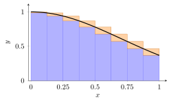
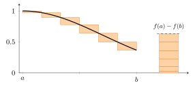
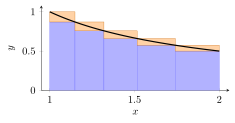
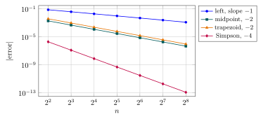

# 第 15 讲　定积分的定义：面积、和式与数值积分 (The definite integral: area, sums, and numerical integration)

第 14 讲建立了实数完备性的构造框架，并证明确界存在与柯西列收敛。本讲用这些结论定义定积分。

第 2 讲算过一个纯粹的数列极限
$$
\frac1n\sum_{k=1}^n\Bigl(\frac kn\Bigr)^p\longrightarrow\frac1{p+1},
$$
当时只在结尾说了一句：每个加数是一块宽 $1/n$、高 $(k/n)^p$ 的长方形面积。 本讲把那句话兑现。并且反过来，把“面积”这个词本身定义清楚。

本讲先用矩形的上下和定义面积，再讨论可积性。随后估计 $\int_0^1e^{-x^2}\,\mathrm{d}x$，比较数值积分方法及其误差。这一积分没有初等原函数 (elementary antiderivative)，仍可用数值方法计算。

积分与原函数的关系留到第 16 讲；本讲的定义和估计均从上下和出发。

## 1 从矩形和到面积 (From rectangle sums to area)

对曲边图形，可先用矩形面积给出上下界，再检查两种界能否任意接近。

> [!WARNING] 先猜一猜 (Guess first)
>
>
> $f(x)=e^{-x^2}$ 在 $[0,1]$ 上从 $1$ 降到 $1/e\approx0.3679$。 $\int_0^1e^{-x^2}\,\mathrm{d}x$ 一定落在 $0.3679$ 与 $1$ 之间。请把范围缩小： 你猜它在 $0.7$ 与 $0.8$ 之间的哪个位置? 写下三位小数再往下读。 把 $[0,1]$ 四等分、用左端点高度搭四个长方形，得到的数会比真值大还是小?
>

> [!IMPORTANT] 定义 15.1 — 分割与 Riemann 和 (Partition and Riemann sum)
>
>
> 设 $a<b$。$[a,b]$ 的一个**分割 (partition)** $P$ 是一组点
> $$
> a=x_0<x_1<\cdots<x_n=b .
> $$
> 记 $\Delta x_i=x_i-x_{i-1}$，称 $\|P\|=\max_{1\le i\le n}\Delta x_i$ 为该分割的**网格 (mesh)**。 在每个小区间上任取一个**标记点 (tag)** $\xi_i\in[x_{i-1},x_i]$， 称
> $$
> S(f,P,\xi)=\sum_{i=1}^n f(\xi_i)\,\Delta x_i
> $$
> 为 $f$ 关于 $P$ 和标记 $\xi$ 的 **Riemann 和 (Riemann sum)**。 若 $\Delta x_i$ 全部相等，称 $P$ 为**等距分割 (uniform partition)**。
>

标记点的自由度是整件事的困难所在：同一个分割，换一组标记点就换一个数。 定义积分，就是要求这些数在网格变细时*挤到同一个地方*。 第一步是不去管标记点，直接取每个小区间上的最大与最小高度。

> [!NOTE] 词语提示
>
>
> *partition*：分割；*rounding*：四舍五入；*uniform*：一致的；*exact*：精确的。
>

> [!NOTE] Example 15.2 — The parabola, re-read as an area
>
>
> Take $f(x)=x^2$ on $[0,1]$ and the uniform partition into $n$ pieces, $x_i=i/n$. Since $f$ increases, the smallest height on $[x_{i-1},x_i]$ is $f(x_{i-1})$ and the largest is $f(x_i)$. The two extreme Riemann sums are
> $$
> L_n=\frac1n\sum_{i=1}^n\Bigl(\frac{i-1}n\Bigr)^2=\frac{(n-1)(2n-1)}{6n^2},
>  \qquad
>  U_n=\frac1n\sum_{i=1}^n\Bigl(\frac in\Bigr)^2=\frac{(n+1)(2n+1)}{6n^2}.
> $$
> Exact values (ordinary fractions, no rounding):
>
> |    $n$ |     $L_n$      |      $U_n$      | $U_n-L_n$ |
> |---------:|:----------------:|:-----------------:|:-----------:|
> |    $4$ | $7/32=0.21875$ | $15/32=0.46875$ |  $0.25$   |
> |    $8$ |  $0.2734375$   |   $0.3984375$   |  $0.125$  |
> |   $16$ | $0.302734375$  |  $0.365234375$  | $0.0625$  |
> |  $100$ |   $0.32835$    |    $0.33835$    |  $0.01$   |
> | $1000$ |  $0.3328335$   |   $0.3338335$   |  $0.001$  |
>
> Every column obeys $U_n-L_n=1/n$ exactly, and $L_n<1/3<U_n$ throughout. Whatever the area under the parabola is, it is trapped in an interval of length $1/n$ around $1/3$; and $1/n$ can be made as small as we please. This is the whole idea of the lecture, seen on the one example where the arithmetic is free.
>

第 2 讲证明的极限 $\frac1n\sum(k/n)^p\to\frac1{p+1}$，现在有了名字： 它说的是 $y=x^p$ 在 $[0,1]$ 上围出的面积等于 $1/(p+1)$。 当时是一个关于数列的命题，现在是一个关于图形的命题。但请注意， *先有极限，后有面积*，我们没有用任何面积公式去证极限。

下图把同样的两侧夹逼画在 $f(x)=e^{-x^2}$ 上，$n=8$。

图中蓝色部分为下和，蓝色与橙色合起来为上和。橙色面积等于两者之差；对本例，加细分割可使这个差趋于零。

## 2 达布上下和与可积性 (Darboux sums and integrability)

> [!IMPORTANT] 定义 15.3 — 上下和与上下积分 (Darboux sums; upper and lower integrals)
>
>
> 设 $f:[a,b]\to\mathbb{R}$ 有界 (bounded)，$P:a=x_0<\cdots<x_n=b$ 是一个分割 (partition)。令
> $$
> m_i=\inf_{[x_{i-1},x_i]}f,\qquad M_i=\sup_{[x_{i-1},x_i]}f,\qquad
>  \omega_i=M_i-m_i,
> $$
> $\omega_i$ 称为 $f$ 在第 $i$ 个小区间上的**振幅 (oscillation)**。 **下和 (lower sum)** 与**上和 (upper sum)** 是
> $$
> L(f,P)=\sum_{i=1}^n m_i\,\Delta x_i,\qquad
>  U(f,P)=\sum_{i=1}^n M_i\,\Delta x_i,\qquad
>  U(f,P)-L(f,P)=\sum_{i=1}^n\omega_i\,\Delta x_i .
> $$
> **下积分 (lower integral)** 与**上积分 (upper integral)** 是
> $$
> \underline{\int_a^b}f=\sup_P L(f,P),\qquad
>  \overline{\int_a^b}f=\inf_P U(f,P),
> $$
> 其中 sup 与 inf 取遍 $[a,b]$ 的一切分割。
>

有界性保证每个 $m_i,M_i$ 都是实数；上下积分的存在则要用第 14 讲的确界存在定理 (existence of suprema and infima)。这已经是定理，不再是欠条。

> [!NOTE] 引理 15.4 — 加细只会变好 (Refinement)
>
>
> 设 $P\subset P'$（即 $P'$ 由 $P$ 添加分点得到，称 $P'$ 是 $P$ 的**加细 (refinement)**）。则
> $$
> L(f,P)\le L(f,P')\le U(f,P')\le U(f,P).
> $$
> 进而对任意两个分割 $P_1,P_2$ 有 $L(f,P_1)\le U(f,P_2)$，从而 $\underline{\int_a^b}f\le\overline{\int_a^b}f$。
>

> [!NOTE] 证明
>
>
> 只需看添加一个分点的情形，其余用归纳。设在 $[x_{i-1},x_i]$ 内插入 $c$。 在更小的区间上取 sup 只会变小：$\sup_{[x_{i-1},c]}f\le M_i$， $\sup_{[c,x_i]}f\le M_i$，于是
> $$
> \sup_{[x_{i-1},c]}f\cdot(c-x_{i-1})+\sup_{[c,x_i]}f\cdot(x_i-c)\le M_i\,\Delta x_i .
> $$
> 其余各项不变，故 $U(f,P')\le U(f,P)$。下和同理（取 inf 只会变大）。 中间的不等号由 $m_i\le M_i$ 得到。
>
> 对任意 $P_1,P_2$，取公共加细 $P_1\cup P_2$，则 $L(f,P_1)\le L(f,P_1\cup P_2)\le U(f,P_1\cup P_2)\le U(f,P_2)$。 固定 $P_2$ 对 $P_1$ 取 sup，再对 $P_2$ 取 inf，得最后一式。
>

> [!IMPORTANT] 定义 15.5 — 可积 (Riemann integrable)
>
>
> 有界函数 $f:[a,b]\to\mathbb{R}$ 称为**（Riemann）可积 (Riemann integrable)**， if and only if $\underline{\int_a^b}f=\overline{\int_a^b}f$； 此时这个公共值记作 $\int_a^b f(x)\,\mathrm{d}x$，称为 $f$ 在 $[a,b]$ 上的 **定积分 (definite integral)**。全体可积函数记作 $R[a,b]$。
>

判断可积，不必真去算两个确界。下面这条判别法是本讲的主力工具： 它把“两个确界相等”换成“*存在一个*分割使上下和足够接近”。 注意“存在一个”这三个字：证明可积时，我们可以自己挑分割。

> [!NOTE] 定理 15.6 — 可积性判别法 (Riemann's criterion)
>
>
> 设 $f:[a,b]\to\mathbb{R}$ 有界 (bounded)。则 $f$ 可积 (Riemann integrable) if and only if
> $$
> \text{对每个 }\varepsilon>0,\ \text{存在 }[a,b]\text{ 的一个分割 }P,\ \text{使}\quad
>  U(f,P)-L(f,P)=\sum_i\omega_i\,\Delta x_i<\varepsilon .
> $$
>

> [!NOTE] 证明
>
>
> ($\Leftarrow$) 由引理，对任意 $P$ 有 $L(f,P)\le\underline{\int}f\le\overline{\int}f\le U(f,P)$。 故 $0\le\overline{\int}f-\underline{\int}f\le U(f,P)-L(f,P)<\varepsilon$ 对每个 $\varepsilon>0$ 成立， 只能是 $0$。
>
> ($\Rightarrow$) 设两者相等，记公共值为 $I$。由 sup 的定义，存在 $P_1$ 使 $L(f,P_1)>I-\varepsilon/2$；由 inf 的定义，存在 $P_2$ 使 $U(f,P_2)<I+\varepsilon/2$。 取 $P=P_1\cup P_2$，加细引理给出 $L(f,P)\ge L(f,P_1)>I-\varepsilon/2$ 且 $U(f,P)\le U(f,P_2)<I+\varepsilon/2$，故 $U(f,P)-L(f,P)<\varepsilon$。
>

> [!NOTE] 命题 15.7 — Riemann 和被上下和夹住 (Riemann sums are trapped)
>
>
> 对任意分割 $P$ 和任意标记 (tags) $\xi$，
> $$
> L(f,P)\le S(f,P,\xi)\le U(f,P).
> $$
> 特别地，若 $f$ 可积 (Riemann integrable) 且 $U(f,P)-L(f,P)<\varepsilon$，则 $\bigl|S(f,P,\xi)-\int_a^bf\bigr|<\varepsilon$，*无论标记点怎么取*。
>

> [!NOTE] 证明
>
>
> $m_i\le f(\xi_i)\le M_i$，逐项乘以 $\Delta x_i>0$ 再相加。 第二句：$S(f,P,\xi)$ 与 $\int_a^bf$ 都落在区间 $[L(f,P),U(f,P)]$ 中， 而这个区间长度小于 $\varepsilon$。
>

这个命题是本讲所有数值工作的许可证：只要能把某个分割的 $U-L$ 算小， 那一个分割上*随便*取的 Riemann 和就已经是一个带保证的近似值。

> [!WARNING] 先猜一猜 (Guess first)
>
>
> 对 $f(x)=e^{-x^2}$、$[0,1]$ 的 $n$ 等分，上和减下和等于多少? 先别算，先想： $f$ 递减，所以每个 $\omega_i=f(x_{i-1})-f(x_i)$。把这些数加起来会发生什么? 再猜：要让 $U-L<10^{-3}$，$n$ 要取到几百还是几万?
>

## 3 三类可积函数 (Three classes of integrable functions)

### 3.1 Integrability of monotone functions

上一个 guess 的答案是：那些 $\omega_i$ 会*望远镜式地相消 (telescope)*。 把所有橙色小块沿水平方向推到一起，它们正好叠成一根柱子：宽 $(b-a)/n$， 高 $|f(b)-f(a)|$。这就是下面这张图。

六块橙色矩形平移后，组成宽 $(b-a)/n$、高 $|f(b)-f(a)|$ 的矩形，给出上和与下和之差。

> [!NOTE] 定理 15.8 — 单调函数可积 (Monotone functions are integrable)
>
>
> 设 $f:[a,b]\to\mathbb{R}$ 单调 (monotone，即单调增或单调减)。则 $f$ 可积 (Riemann integrable)，且对 $n$ 等分 (uniform partition) $P_n$ 有
> $$
> U(f,P_n)-L(f,P_n)=\frac{|f(b)-f(a)|\,(b-a)}{n}.
> $$
>

> [!NOTE] 证明
>
>
> 设 $f$ 单调增（减的情形把 $f$ 换成 $-f$）。单调函数自动有界： $f(a)\le f(x)\le f(b)$。取 $n$ 等分，$\Delta x_i=(b-a)/n$。 单调性给出 $m_i=f(x_{i-1})$、$M_i=f(x_i)$，故
> $$
> U(f,P_n)-L(f,P_n)=\frac{b-a}{n}\sum_{i=1}^n\bigl(f(x_i)-f(x_{i-1})\bigr)
>  =\frac{(b-a)\bigl(f(b)-f(a)\bigr)}{n},
> $$
> 因为中间的和望远镜式相消。给定 $\varepsilon>0$，取 $n>\dfrac{(b-a)|f(b)-f(a)|}{\varepsilon}$，判别法即给出可积。
>

这个估计只用单调性，不要求函数连续。

> [!NOTE] 词语提示
>
>
> *certified*：有严格保证的；*certify*：给出严格保证；*bracket*：夹住目标的区间；*bound*：界；估计；*gap*：两项之差的绝对值。
>

> [!NOTE] Example 15.9 — A certified bracket for $\int_0^1e^{-x^2}\,\mathrm{d}x$
>
>
> $f(x)=e^{-x^2}$ is decreasing on $[0,1]$, so on the uniform partition the upper sum uses left endpoints and the lower sum uses right endpoints, and the theorem predicts
> $$
> U_n-L_n=\frac{f(0)-f(1)}{n}=\frac{1-e^{-1}}{n}=\frac{0.6321205588\ldots}{n}.
> $$
> Computed values (all digits below were produced by a Python script, not recalled):
>
> | $n$ | $L_n$ (right endpoints) | $U_n$ (left endpoints) | $U_n-L_n$ |
> |---:|:---|:---|:---|
> | $4$ | $0.663969027947$ | $0.821999167654$ | $0.158030139707$ |
> | $8$ | $0.706358079919$ | $0.785373149772$ | $0.079015069854$ |
> | $16$ | $0.726830829325$ | $0.766338364252$ | $0.039507534927$ |
>
> Each difference is exactly $0.6321205588\ldots/n$, as predicted. So the integral is *certified* to lie in $[0.7268,0.7664]$ already at $n=16$: one decimal digit, $0.7$, is now proved. (Three decimals, i.e. $U_n-L_n<10^{-3}$, need $n\ge633$ — so the guess above should have said *hundreds*, not tens of thousands.)
>
> Now the bad news. To certify six decimals this way we would need $0.6321205588\ldots/n<10^{-6}$, that is $n\ge632\,121$ — more than half a million evaluations of $e^{-x^2}$ for six digits. The crude bound is honest but expensive. Section 6 buys the same six digits with $16$ panels. The gap between $632\,121$ and $16$ is the reason numerical integration is a subject.
>

### 3.2 Integrability of continuous functions

单调性控制的是 $\omega_i$ 的*总和*；连续性控制的是每一个 $\omega_i$。 但只有逐点连续还不够。我们需要*同一个* $\delta$ 对所有小区间都管用。 这正是第 8 讲的一致连续 (uniform continuity)：闭区间上的连续函数一致连续 (Cantor 定理)。

> [!NOTE] 定理 15.10 — 连续函数可积 (Continuous functions are integrable)
>
>
> 设 $f:[a,b]\to\mathbb{R}$ 连续 (continuous)。则 $f$ 可积 (Riemann integrable)， 且对任意网格 (mesh) 足够小的分割，上下和之差可以任意小。
>

> [!NOTE] 证明
>
>
> 闭区间上连续函数有界（第 8 讲的最值定理，Extreme Value Theorem）， 故上下和有意义，且每个小区间上的 sup 与 inf 都被取到： $M_i=f(s_i)$、$m_i=f(t_i)$，其中 $s_i,t_i\in[x_{i-1},x_i]$。
>
> 给定 $\varepsilon>0$。由第 8 讲的一致连续性 (uniform continuity)，存在 $\delta>0$， 使得 $|u-v|<\delta$ 时 $|f(u)-f(v)|<\dfrac{\varepsilon}{2(b-a)}$。 取任意网格 $\|P\|<\delta$ 的分割。此时 $|s_i-t_i|\le\Delta x_i<\delta$，故 $\omega_i=f(s_i)-f(t_i)<\dfrac{\varepsilon}{2(b-a)}$，于是
> $$
> U(f,P)-L(f,P)=\sum_i\omega_i\,\Delta x_i
>  <\frac{\varepsilon}{2(b-a)}\sum_i\Delta x_i=\frac\varepsilon2<\varepsilon .
> $$
> 判别法给出可积。
>

请注意这里 $\delta$ 只依赖 $\varepsilon$，不依赖位置。如果只有逐点连续， 每个点给一个自己的 $\delta$，取不到统一的下界，上面这行就断了。 第 8 讲那条看起来技术性的定理，用处在这里。

### 3.3 有限个间断点 (Finitely many jumps) 与不可积的例子

> [!NOTE] 定理 15.11 — 有界且间断点有限则可积 (Bounded with finitely many discontinuities)
>
>
> 设 $f:[a,b]\to\mathbb{R}$ 有界 (bounded)，且在 $[a,b]$ 上只有有限个间断点 (points of discontinuity)。则 $f$ 可积 (Riemann integrable)。
>

> [!NOTE] 证明
>
>
> 设 $|f|\le M$（可设 $M>0$），间断点为 $c_1<\cdots<c_r$。给定 $\varepsilon>0$， 令 $\eta=\dfrac{\varepsilon}{8M(r+1)}$，并把每个 $c_j$ 装进一个长度 $\le2\eta$ 的小区间里。 （若 $\eta$ 太大以致这些区间相交或超出 $[a,b]$，把 $\eta$ 再减小即可。） 这些“坏区间”的总长度不超过 $2\eta r$，而 $f$ 在其上的振幅不超过 $2M$， 所以它们对 $\sum\omega_i\Delta x_i$ 的贡献不超过 $4M\eta r<\varepsilon/2$。
>
> 余下的部分是有限多个闭区间 $[u_1,v_1],\ldots,[u_s,v_s]$（$s\le r+1$）， $f$ 在每个上连续，故一致连续。对每个 $j$ 取分割使该段上 $\sum\omega_i\Delta x_i<\dfrac{\varepsilon}{2s}$。把所有分点合起来得到 $[a,b]$ 的一个分割 $P$， 则 $U(f,P)-L(f,P)<\varepsilon/2+\varepsilon/2=\varepsilon$。
>

> [!NOTE] 词语提示
>
>
> *oscillation*：振荡；*continuous*：连续的；*continuity*：连续性；*monotone*：单调的；*bounded*：有界的；*at most*：至多；*width*：宽度。
>

> [!NOTE] Example 15.12 — Two functions with one bad point each
>
>
> Let
> $$
> g(x)=\begin{cases}1,&0\le x<\tfrac12,\\[2pt] 3,&\tfrac12\le x\le1,\end{cases}
>  \qquad
>  h(x)=\begin{cases}\sin(1/x),&0<x\le1,\\[2pt] 0,&x=0.\end{cases}
> $$
> $g$ is monotone, so it is integrable by the monotone theorem; a uniform partition into $n$ pieces has a single bad interval, of oscillation $2$ and width $1/n$, so $U-L\le2/n$. Its integral is $\tfrac12\cdot1+\tfrac12\cdot3=2$ — already computable from the definition, since $g$ is constant on each half.
>
> $h$ oscillates infinitely often near $0$, yet it is bounded and continuous except at the single point $x=0$, so it is integrable. Trap $[0,\eta]$ inside one subinterval: its contribution to $\sum\omega_i\Delta x_i$ is at most $2\eta$; on $[\eta,1]$ use uniform continuity. **Infinitely many wiggles are harmless; what matters is how much length the bad set occupies.**
>

> [!NOTE] 词语提示
>
>
> *dense*：稠密的。
>

> [!NOTE] Example 15.13 — Dirichlet's function is not integrable
>
>
> Let $D(x)=1$ for rational $x$ and $D(x)=0$ for irrational $x$, on $[0,1]$. Every interval of positive length contains both a rational and an irrational number (Lecture 14: $\mathbb{Q}$ is dense in $\mathbb{R}$). Hence for *every* partition $P$ and every $i$,
> $$
> M_i=1,\qquad m_i=0,\qquad \omega_i=1 .
> $$
> Therefore $U(D,P)=1$ and $L(D,P)=0$ for every $P$, so
> $$
> \overline{\int_0^1}D=1\ne0=\underline{\int_0^1}D,
> $$
> and $D\notin R[0,1]$. Note what fails: not the size of $D$ (it is bounded by $1$), but the fact that the bad set is *everywhere*. A Riemann sum for $D$ can be made $1$ or $0$ at will, by choosing rational or irrational tags — the tags never stop mattering.
>

> [!NOTE] 注 15.14
>
>
> 上述证明分别控制各小区间的振幅，或把间断点放进总长度足够小的区间。这里不再引入更一般的可积性判别。
>

## 4 基本性质 (Basic properties)

下面五条是以后一切积分估计的语法。证明都短，因为上下和已经把工作做完了。 先约定方向 (orientation)：$\int_a^a f=0$，且当 $a<b$ 时 $\int_b^a f=-\int_a^b f$。

> [!NOTE] 定理 15.15 — 积分的基本性质 (Basic properties of the integral)
>
>
> 设 $f,g\in R[a,b]$，$c\in\mathbb{R}$。则
>
> 1.  （线性 linearity）$f+g,\ cf\in R[a,b]$，且 $\int_a^b(f+g)=\int_a^bf+\int_a^bg$，$\int_a^b cf=c\int_a^bf$；
>
> 2.  （单调性 monotonicity）若 $f\le g$，则 $\int_a^bf\le\int_a^bg$；
>
> 3.  （粗界 crude bounds）若 $m\le f\le M$，则 $m(b-a)\le\int_a^bf\le M(b-a)$；
>
> 4.  （绝对值 absolute value）$|f|\in R[a,b]$，且 $\bigl|\int_a^bf\bigr|\le\int_a^b|f|$；
>
> 5.  （区间可加 additivity）设 $a<c<b$。则 $f\in R[a,b]$ if and only if $f\in R[a,c]$ 且 $f\in R[c,b]$；此时 $\int_a^bf=\int_a^cf+\int_c^bf$。
>

> [!NOTE] 证明
>
>
> \(i\) 在每个小区间上 $\sup(f+g)\le\sup f+\sup g$，$\inf(f+g)\ge\inf f+\inf g$， 故 $\omega_i(f+g)\le\omega_i(f)+\omega_i(g)$。对 $\varepsilon>0$ 各取分割使两者的 $\sum\omega_i\Delta x_i<\varepsilon/2$，再取公共加细，判别法给出 $f+g$ 可积。 等式：对该公共加细 $P$， $L(f,P)+L(g,P)\le L(f+g,P)\le U(f+g,P)\le U(f,P)+U(g,P)$， 而两端之差 $<\varepsilon$，且 $\int f+\int g$ 也落在两端之间；令 $\varepsilon\to0$。 $cf$ 的情形：$c\ge0$ 时上下和同乘 $c$；$c=-1$ 时上下和互换。
>
> \(ii\) 每个 $m_i(f)\le m_i(g)$，故 $L(f,P)\le L(g,P)$，对 $P$ 取 sup。
>
> \(iii\) 取平凡分割 $P=\{a,b\}$：$m(b-a)\le L(f,P)\le\int_a^bf\le U(f,P)\le M(b-a)$。
>
> \(iv\) 关键是 $\bigl||f(u)|-|f(v)|\bigr|\le|f(u)-f(v)|$，故 $\omega_i(|f|)\le\omega_i(f)$，判别法给出 $|f|$ 可积。 再由 $-|f|\le f\le|f|$ 与 (ii)、(i) 得 $-\int|f|\le\int f\le\int|f|$。
>
> \(v\) 设 $f\in R[a,b]$，$\varepsilon>0$，取 $P$ 使 $U-L<\varepsilon$；把 $c$ 加进去只会更小。 $P\cup\{c\}$ 被 $c$ 截成 $[a,c]$ 与 $[c,b]$ 的分割，两段的 $\sum\omega_i\Delta x_i$ 都 $<\varepsilon$，故 $f$ 在两段上可积。反之亦然（把两段的分割拼起来）。 等式：上下和本身就是可加的，$L(f,P_1)+L(f,P_2)=L(f,P_1\cup P_2)$，两边取 sup。
>

> [!NOTE] 词语提示
>
>
> *arbitrarily*：任意地。
>

> [!IMPORTANT] Exercise 15.16 — How lossy is $|\int f|\le\int|f|$?
>
>
> Take $f(x)=\sin(2\pi x)$ on $[0,1]$. Without computing anything, say what $\int_0^1 f$ is and why (symmetry). Then decide whether $\int_0^1|f|$ is $0$, small, or of size comparable to $1$. Conclude that inequality (iv) can be arbitrarily lossy. Next, find a nonzero $f$ for which (iv) is an *equality*, and state the general rule: equality holds exactly when $f$ does not change sign. Finally, explain in one sentence why (iv) is nevertheless the single most used inequality in all of analysis.
>

不等式 (iv) 会在第 17、18 讲被反复使用：凡是要 bound 一个积分， 第一步几乎总是把绝对值搬进去，把“抵消 (cancellation)”这个不可控的因素先丢掉， 然后在必要的地方再把它找回来。

## 5 把和式变成积分 (Turning sums into integrals)

现在反过来用积分。很多看起来毫无头绪的数列极限，是某个 Riemann 和。

> [!NOTE] 定理 15.17 — 等距和收敛到积分 (Equidistant sums converge to the integral)
>
>
> 设 $f$ 在 $[a,b]$ 上连续 (continuous)。则
> $$
> \lim_{n\to\infty}\frac{b-a}{n}\sum_{k=1}^{n}f\Bigl(a+k\cdot\frac{b-a}{n}\Bigr)
>  =\int_a^b f(x)\,\mathrm{d}x .
> $$
> 特别地，$\displaystyle\lim_{n\to\infty}\frac1n\sum_{k=1}^nf\Bigl(\frac kn\Bigr)=\int_0^1f(x)\,\mathrm{d}x$。 标记点换成左端点、中点或任何 $\xi_k\in[x_{k-1},x_k]$，结论不变。
>

> [!NOTE] 证明
>
>
> 左边是 $f$ 关于 $n$ 等分 $P_n$ 的一个 Riemann 和，网格 $\|P_n\|=(b-a)/n$。 给定 $\varepsilon>0$，连续函数可积的证明给出 $\delta>0$，使 $\|P\|<\delta$ 时 $U(f,P)-L(f,P)<\varepsilon$。取 $N>(b-a)/\delta$。对 $n>N$， 由 Riemann 和被夹住的命题，该和与 $\int_a^bf$ 之差小于 $\varepsilon$。 标记点的选取从未进入这个论证。
>

> [!NOTE] 注 15.18
>
>
> 定理对一切可积 (Riemann integrable) 的 $f$ 都成立，证明要多花一点力气； 本讲只需要连续的情形，就不展开了。
>

> [!WARNING] 先猜一猜 (Guess first)
>
>
> $\displaystyle S_n=\frac1{n+1}+\frac1{n+2}+\cdots+\frac1{2n}$。 它有 $n$ 项，每项约 $1/n$ 到 $1/(2n)$ 之间，所以 $S_n$ 介于 $1/2$ 与 $1$ 之间。 $S_n$ 收敛吗? 收敛到哪里? 很多人第一反应是 $0$（每项趋于零）或 $1$（项数趋于无穷）。 先算 $S_1,S_2,S_5$，再猜。
>

要把这个和认成积分，我们需要知道 $1/x$ 下面的面积。 本讲没有原函数可用，但双曲线有一个特殊结构：它的面积对*乘法*是齐次的， 所以应该用*几何分割 (geometric partition)* 而不是等距分割。

> [!NOTE] 定理 15.19 — 双曲线下的面积 (The area under the hyperbola)
>
>
> 设 $0<a<b$。则 $1/x$ 在 $[a,b]$ 上可积 (Riemann integrable)，且
> $$
> \int_a^b\frac{\mathrm{d}x}{x}=\ln\frac ba .
> $$
>

> [!NOTE] 证明
>
>
> 令 $q=(b/a)^{1/n}>1$，取分点 $x_k=a\,q^k$（$k=0,\ldots,n$），这是一个分割， 因为 $x_0=a$、$x_n=b$ 且 $q>1$。$1/x$ 递减，故
> $$
> M_k=\frac1{x_{k-1}},\qquad m_k=\frac1{x_k},\qquad
>  \Delta x_k=a\,q^{k-1}(q-1).
> $$
> 于是每一项的上和贡献都相同：
> $$
> U_n=\sum_{k=1}^n\frac{a\,q^{k-1}(q-1)}{a\,q^{k-1}}=n(q-1)
>  =n\Bigl(\bigl(\tfrac ba\bigr)^{1/n}-1\Bigr),
>  \qquad L_n=\frac{U_n}{q}.
> $$
> 第 6 讲给出 $\lim_{u\to0}\dfrac{e^u-1}{u}=1$。把 $t^h$ 写成 $e^{h\ln t}$、令 $u=h\ln t$，即得 $\lim_{h\to0}\dfrac{t^h-1}{h}=\ln t$（$t>0$，$t\ne1$；$t=1$ 时两边都是 $0$）。取 $t=b/a$、$h=1/n$ 得 $U_n\to\ln(b/a)$。又 $q=(b/a)^{1/n}\to1$，故 $L_n=U_n/q\to\ln(b/a)$， 且 $U_n-L_n\to0$。由判别法 $1/x$ 可积，并且 $L_n\le\int_a^b\frac{\mathrm{d}x}x\le U_n$ 对每个 $n$ 成立，夹逼给出结论。
>

下图是 $[1,2]$ 上的 $5$ 段几何分割：小区间越靠右越宽，正好补偿高度的下降， 使每个橙色块的面积都相等。这是“为什么对数会从面积里出现来”的图形理由。

请比较五个橙色块：它们的宽高都不同，面积却完全相等，各为 $(q-1)/q$ 的同一个数。 上和因此就是 $n(q-1)$，一个可以直接求极限的式子。

> [!NOTE] 词语提示
>
>
> *geometric*：等比的。
>

> [!NOTE] Example 15.20 — The geometric partition, numerically
>
>
> With $b/a=2$ the upper and lower sums are $U_n=n(2^{1/n}-1)$ and $L_n=U_n/2^{1/n}$:
>
> |  $n$ | $L_n$            | $U_n$            | $U_n-L_n$        |
> |-------:|:-------------------|:-------------------|:-------------------|
> |  $4$ | $0.636414338985$ | $0.756828460011$ | $0.120414121026$ |
> |  $8$ | $0.663967654363$ | $0.724061861322$ | $0.060094206959$ |
> | $16$ | $0.678347508823$ | $0.708380518839$ | $0.030033010016$ |
>
> And $U_n=n(2^{1/n}-1)$ decreases to $\ln2=0.693147180560$:
> $$
> \begin{aligned}
>  U_{10}&=0.717734625363, & U_{100}&=0.695555005672,\\
>  U_{1000}&=0.693387462581, & U_{10^6}&=0.693147420787 .
>  \end{aligned}
> $$
> The last one agrees with $\ln 2$ to six decimals. Note the pattern of the errors $2.459\times10^{-2}$, $2.408\times10^{-3}$, $2.403\times10^{-4}$, $2.402\times10^{-7}$: each error is about $0.24/n$. A first-order method — Section 6 will name this.
>

> [!NOTE] Example 15.21 — $\frac1{n+1}+\cdots+\frac1{2n}\to\ln2$
>
>
> Rewrite the sum as an equidistant Riemann sum on $[1,2]$:
> $$
> S_n=\sum_{k=1}^n\frac1{n+k}
>  =\frac1n\sum_{k=1}^n\frac1{1+k/n}
>  =\frac{2-1}{n}\sum_{k=1}^n f\Bigl(1+k\cdot\frac{2-1}{n}\Bigr),\qquad f(x)=\frac1x .
> $$
> $f$ is continuous on $[1,2]$, so by the equidistant-sum theorem and the hyperbola theorem
> $$
> S_n\longrightarrow\int_1^2\frac{\mathrm{d}x}{x}=\ln 2=0.693147180560\ldots
> $$
> Numerically:
>
> |    $n$ | $S_n$            | $\ln2-S_n$           | $n(\ln2-S_n)$ |
> |---------:|:-------------------|:-----------------------|:----------------|
> |    $1$ | $0.500000000000$ | $1.931\times10^{-1}$ | $0.193147$    |
> |    $5$ | $0.645634920635$ | $4.751\times10^{-2}$ | $0.237561$    |
> |   $10$ | $0.668771403175$ | $2.438\times10^{-2}$ | $0.243758$    |
> |  $100$ | $0.690653430482$ | $2.494\times10^{-3}$ | $0.249375$    |
> | $1000$ | $0.692897243060$ | $2.499\times10^{-4}$ | $0.249938$    |
> | $10^5$ | $0.693144680566$ | $2.500\times10^{-6}$ | $0.249999$    |
>
> The last column is doing something the theorem never promised: it converges, to $1/4$. So $S_n=\ln2-\frac1{4n}+o(1/n)$. Guessing the *rate* from a table, then proving it, is Exercise [**15.4**](#l15-ex:rate) below. This is the habit to build: never stop at “the limit exists”.
>

> [!NOTE] 词语提示
>
>
> *upper bound*：上界；*lower bound*：下界；*convergence*：收敛；*finite*：有限的；*ratio*：比值；*index*：下标。
>

> [!NOTE] Example 15.22 — {$\sqrt[n]{n!}/n\to1/e$, a second proof}
>
>
> Lecture 3 proved this from the ratio $a_{n+1}/a_n$. Here is a proof made of areas. Put
> $$
> A_n=\ln\frac{n}{\sqrt[n]{n!}}=\frac1n\sum_{k=1}^n\ln\frac nk .
> $$
> By the hyperbola theorem, $\ln\frac nk=\int_{k/n}^{1}\frac{\mathrm{d}x}{x}$ for $1\le k\le n$. Splitting each of these integrals at the points $j/n$ (additivity) and exchanging the two finite sums — for a fixed $j$, the index $k$ runs over $1,\dots,j$ — gives
> $$
> A_n=\frac1n\sum_{k=1}^n\sum_{j=k}^{n-1}\int_{j/n}^{(j+1)/n}\frac{\mathrm{d}x}{x}
>  =\sum_{j=1}^{n-1}\frac jn\int_{j/n}^{(j+1)/n}\frac{\mathrm{d}x}{x}.
> $$
> On $[\frac jn,\frac{j+1}n]$ we have $\frac{n}{j+1}\le\frac1x\le\frac nj$, so the crude bound (iii) gives $\frac1{j+1}\le\int_{j/n}^{(j+1)/n}\frac{\mathrm{d}x}{x}\le\frac1j$. Hence
> $$
> \frac1n\sum_{j=1}^{n-1}\frac{j}{j+1}\ \le\ A_n\ \le\ \frac1n\sum_{j=1}^{n-1}1=\frac{n-1}n .
> $$
> The left side equals $\frac{n-1}{n}-\frac{H_n-1}{n}$ with $H_n=\sum_{k\le n}1/k$, and $H_n/n\to0$ (Lecture 3: $H_n-\ln n\to\gamma$). Both sides tend to $1$, so $A_n\to1$ and, $\exp$ being continuous, $\sqrt[n]{n!}/n=e^{-A_n}\to e^{-1}$. Check the squeeze numerically:
>
> |    $n$ | lower bound     | $A_n$            | upper bound | $\sqrt[n]{n!}/n$ |
> |---------:|:----------------|:-------------------|:------------|:-------------------|
> |   $10$ | $0.707103170$ | $0.792143835686$ | $0.9$     | $0.452872868812$ |
> |  $100$ | $0.948126225$ | $0.967776430432$ | $0.99$    | $0.379926893448$ |
> | $1000$ | $0.992514529$ | $0.995627100494$ | $0.999$   | $0.369491663472$ |
>
> ($1/e=0.367879441171$.) The convergence is slow — the squeeze costs about $H_n/n$ — but every step above used only this lecture’s tools.
>

把和式认作 Riemann 和后，可以用积分的比较性质估计其极限。第 17 讲将继续比较和与积分之间的误差。

## 6 数值积分 (Numerical integration)

$\int_0^1e^{-x^2}\,\mathrm{d}x$ 没有初等原函数，所以只能近似算。 上下和给了一个带保证的近似，但代价是 $632\,121$ 次求值。 本节换一批更聪明的 Riemann 和。设 $h=(b-a)/n$，$x_i=a+ih$， $\bar x_i=\frac{x_{i-1}+x_i}2$（中点 midpoint）。五条规则是

$$
\begin{aligned}
 L_n&=h\sum_{i=1}^n f(x_{i-1}) &&\text{左端点 (left endpoint)},\\
 R_n&=h\sum_{i=1}^n f(x_i) &&\text{右端点 (right endpoint)},\\
 M_n&=h\sum_{i=1}^n f(\bar x_i) &&\text{中点 (midpoint)},\\
 T_n&=\tfrac12(L_n+R_n)=h\Bigl(\tfrac{f(a)}2+\!\!\sum_{i=1}^{n-1}\!\!f(x_i)+\tfrac{f(b)}2\Bigr)
 &&\text{梯形 (trapezoid)},\\
 S_n&=\tfrac13\bigl(T_n+2M_n\bigr)
 =\frac h6\sum_{i=1}^n\bigl(f(x_{i-1})+4f(\bar x_i)+f(x_i)\bigr)
 &&\text{Simpson}.
\end{aligned}
$$

前三条是 Riemann 和，所以自动被上下和夹住。后两条不是（$T_n$ 是两条的平均， $S_n$ 是加权平均），但它们仍是有限个函数值的线性组合。 $T_n$ 用直线段替代曲线，$S_n$ 用过三点的抛物线替代曲线。这就是 Simpson 规则的来历， 系数 $1:4:1$ 正是抛物线插值 (parabolic interpolation) 的结果。

> [!WARNING] 先猜一猜 (Guess first)
>
>
> $\int_0^1e^{-x^2}\,\mathrm{d}x=0.746824132812\ldots$（这个数我们马上会自己算出来）。 取 $n=4$：梯形法 $T_4$ 能对到小数点后第几位? Simpson $S_4$ 呢? 更重要的一问：把 $n$ 从 $4$ 加倍到 $8$，五种方法的误差各会缩小到几分之一? 对每一种分别写下你的猜测，再看下一张表。
>

参考值可用有限 Taylor 多项式独立计算。对 $0\le x\le1$，将 $e^{-x^2}$ 展开并逐项积分有限和，得到
$$
I=\lim_{m\to\infty}\sum_{k=0}^{m}\frac{(-1)^k}{k!(2k+1)}.
$$
Taylor 余项的绝对值在 $[0,1]$ 上不超过 $1/(m+1)!$，故积分误差也不超过此数。这只用有限和的积分与误差估计，不依赖无穷级数逐项积分。

> [!NOTE] 词语提示
>
>
> *trapezoid*：梯形；*midpoint*：中点；*rounded*：四舍五入后的。
>

> [!NOTE] Example 15.23 — Five rules on $\int_0^1e^{-x^2}\mathrm{d}x$
>
>
> All entries below were computed in $50$-digit decimal arithmetic and then rounded. Write $I=0.746824132812\ldots$ and $E=(\text{rule})-I$.
>
> | $n$ | $L_n$ | $R_n$ | $M_n$ | $T_n$ | $S_n$ |
> |---:|:---|:---|:---|:---|:---|
> | $4$ | $0.821999167654$ | $0.663969027947$ | $0.748747131891$ | $0.742984097800$ | $0.746826120527$ |
> | $8$ | $0.785373149772$ | $0.706358079919$ | $0.747303578731$ | $0.745865614846$ | $0.746824257436$ |
> | $16$ | $0.766338364252$ | $0.726830829325$ | $0.746943912516$ | $0.746584596788$ | $0.746824140607$ |
>
> | $n$ | $E(L_n)$ | $E(R_n)$ | $E(M_n)$ | $E(T_n)$ | $E(S_n)$ |
> |---:|:---|:---|:---|:---|:---|
> | $4$ | $+7.518\times10^{-2}$ | $-8.286\times10^{-2}$ | $+1.923\times10^{-3}$ | $-3.840\times10^{-3}$ | $+1.988\times10^{-6}$ |
> | $8$ | $+3.855\times10^{-2}$ | $-4.047\times10^{-2}$ | $+4.794\times10^{-4}$ | $-9.585\times10^{-4}$ | $+1.246\times10^{-7}$ |
> | $16$ | $+1.951\times10^{-2}$ | $-1.999\times10^{-2}$ | $+1.198\times10^{-4}$ | $-2.395\times10^{-4}$ | $+7.795\times10^{-9}$ |
>
> Error ratios on doubling $n$ (each entry is $|E(n)|/|E(2n)|$):
>
> |   $n\to2n$ |   $L$   |   $R$   |   $M$   |   $T$   |   $S$    |
> |-------------:|:---------:|:---------:|:---------:|:---------:|:----------:|
> |    $4\to8$ | $1.950$ | $2.048$ | $4.011$ | $4.006$ | $15.950$ |
> |   $8\to16$ | $1.975$ | $2.024$ | $4.003$ | $4.002$ | $15.989$ |
> |  $16\to32$ | $1.988$ | $2.012$ | $4.001$ | $4.000$ | $15.997$ |
> |  $32\to64$ | $1.994$ | $2.006$ | $4.000$ | $4.000$ | $15.999$ |
> | $64\to128$ | $1.997$ | $2.003$ | $4.000$ | $4.000$ | $16.000$ |
>
> **The three numbers $2$, $4$, $16$ are the content of this table.** They say
> $$
> E(L_n),E(R_n)\sim C_1h,\qquad E(M_n),E(T_n)\sim C_2h^2,\qquad E(S_n)\sim C_4h^4,
>  \qquad h=1/n,
> $$
> because halving $h$ divides $h^p$ by $2^p$. We call $p$ the **order** of the rule: $1$, $2$, $4$. Two further readings of the same table: (a) $E(M_n)$ and $E(T_n)$ have opposite signs and $|E(T_n)|\approx2|E(M_n)|$ — the midpoint rule is twice as good as the trapezoid rule, which is not what most people guess; (b) the certified computation of Section 3 at $n=632\,121$ actually achieves error $5.000\times10^{-7}$, while $S_8$ — seventeen function values — achieves $1.246\times10^{-7}$.
>

阶不是观察出来的，是可以算出来的。把单个小区间上的误差用第 10 讲的 Taylor 公式展开。

> [!NOTE] 命题 15.24 — 单块的误差 (One-panel error)
>
>
> 设 $f$ 在 $[u,u+h]$ 上有连续的二阶导数 (twice continuously differentiable)， $\bar u=u+h/2$。则存在 $\eta,\zeta\in[u,u+h]$ 使
> $$
> \int_u^{u+h}\!\!f-h\,f(\bar u)=\frac{h^3}{24}f''(\eta),
>  \qquad
>  \int_u^{u+h}\!\!f-\frac h2\bigl(f(u)+f(u+h)\bigr)=-\frac{h^3}{12}f''(\zeta).
> $$
>

> [!NOTE] 证明 — 证明（中点情形；梯形情形同法）
>
>
> 对 $x\in[u,u+h]$ 用带 Lagrange 余项的 Taylor 公式（第 10 讲）在 $\bar u$ 处展开： $f(x)=f(\bar u)+f'(\bar u)(x-\bar u)+\frac12f''(c_x)(x-\bar u)^2$。 两边在 $[u,u+h]$ 上积分。第一项给 $h f(\bar u)$；第二项给 $0$， 因为 $\int_u^{u+h}(x-\bar u)\,\mathrm{d}x=0$（$x-\bar u$ 关于中点是奇的， 正负两块面积相等）。第三项：令 $m=\min f''$、$M=\max f''$，则
> $$
> \frac m2\int_u^{u+h}\!(x-\bar u)^2\mathrm{d}x\le\int_u^{u+h}\!\frac{f''(c_x)}2(x-\bar u)^2\mathrm{d}x
>  \le\frac M2\int_u^{u+h}\!(x-\bar u)^2\mathrm{d}x,
> $$
> 而 $\int_u^{u+h}(x-\bar u)^2\mathrm{d}x=h^3/12$（平移后即第 2 讲的 $\int x^2$）。 故误差等于 $\frac{h^3}{24}\lambda$，其中 $m\le\lambda\le M$； 由 $f''$ 连续与第 7 讲的介值定理 (Intermediate Value Theorem)， $\lambda=f''(\eta)$ 对某个 $\eta$ 成立。
>

把 $n$ 块相加，每块 $h^3$，共 $n=(b-a)/h$ 块，总误差就是 $h^2$ 量级：这就是阶 $2$。 Simpson 把中点与梯形按 $2:1$ 混合，正好*抵消 (cancel)* 了 $h^3$ 项 （注意 $2\cdot\frac1{24}-\frac1{12}=0$），下一个不为零的项是四阶的：
$$
\int_u^{u+h}\!\!f-\frac h6\bigl(f(u)+4f(\bar u)+f(u+h)\bigr)=-\frac{h^5}{2880}f^{(4)}(\theta),
$$
对有连续四阶导数的 $f$ 成立（证明用 Hermite 插值 + Taylor 余项，见习题 [**15.9**](#l15-ex:simpson)）。 总误差于是是 $h^4$ 量级：阶 $4$。

> [!NOTE] 注 15.25 — Checking the error constant
>
>
> 其一：$f^{(4)}\equiv0$ 时 Simpson 无误差，所以它对不超过三次的多项式是*精确*的。 直接验证：$n=1$ 时 $S_1=\frac16(0+4\cdot\frac14+1)=\frac13=\int_0^1x^2$， $S_1=\frac16(0+4\cdot\frac18+1)=\frac14=\int_0^1x^3$。 其二：对 $f(x)=x^4$ 有 $f^{(4)}\equiv24$，余项公式预言误差恰为 $24/2880=1/120$； 而 $S_1=\frac16(0+4\cdot\frac1{16}+1)=\frac5{24}$，$\frac5{24}-\frac15=\frac1{120}$。 公式里的 $2880$ 不是记忆，是可以当场验证的。
>

> [!NOTE] 注 15.26 — 常数从哪里来。以及一个交给第 16 讲的预测
>
>
> 把梯形的单块误差相加：$I-T_n=-\frac{h^2}{12}\sum_i h\,f''(\zeta_i)$。 括号里的 $\sum_i h f''(\zeta_i)$ 是 $f''$ 的一个 Riemann 和， 按本讲的定理它趋于 $\int_a^bf''$。于是
> $$
> T_n-I\approx\frac{h^2}{12}\int_a^bf''.
> $$
> 对 $f=e^{-x^2}$、$[0,1]$，第 16 讲将证明 $\int_0^1f''=f'(1)-f'(0)=-2/e=-0.735758882343$， 预言 $T_n-I\approx-0.061313240195\,h^2$，即 $n=4$ 时 $-3.832\times10^{-3}$。 表中的实际值是 $-3.840\times10^{-3}$。同样地中点法预言 $+1.916\times10^{-3}$ （实际 $+1.923\times10^{-3}$），Simpson 预言 $+1.9959\times10^{-6}$ （实际 $+1.9877\times10^{-6}$）。三个预测都对到三位。*但其中一步我们还不会证*。 那一步就是第 16 讲。
>

下图把误差对 $n$ 画在双对数坐标上。直线的斜率就是阶的相反数。

请用尺子量这四条直线的斜率：从 $n=4$ 到 $n=256$ 横跨 $6$ 个倍频程 (octaves)， 左端点线下降约 $6$ 格（以 $2$ 为底），中点与梯形约 $12$ 格，Simpson 约 $24$ 格。 $1:2:4$ 就是阶。注意 Simpson 在 $n=256$ 处已经到 $10^{-13}$， 再加密下去，双精度浮点的舍入误差 (rounding error) 就会盖过截断误差 (truncation error)， 曲线会掉头向上。本讲的数据用 $50$ 位算术，所以没有看到这个现象。

> [!NOTE] 词语提示
>
>
> *precision*：计算精度；*endpoint*：端点。
>

> [!NOTE] AI Lab — Read the slopes, then break the method
>
>
> **Part 1.** Ask an AI to implement the five rules for a general $f$, $[a,b]$, $n$, and to produce a log–log plot of $|$error$|$ against $n=4,8,\ldots,4096$ for $f(x)=e^{-x^2}$ on $[0,1]$, using a high-precision reference value that it computes *itself* from the series $\sum(-1)^k/(k!(2k+1))$ — do not let it quote a constant. Have it fit a straight line to each set of points and print the slopes. You should see $-1,-1,-2,-2,-4$. Then ask it to redo the computation in ordinary double precision and go up to $n=10^6$: at which $n$ does each curve stop going down, and why does Simpson turn around first?
>
> **Part 2.** Now run exactly the same experiment on $f(x)=\sqrt x$ over $[0,1]$, where the answer $2/3$ is known exactly. Report the four slopes. One of them will surprise you. Here are the ratios you should get:
>
> |    $n\to2n$ |   $L$   |   $M$   |   $T$   |   $S$   |
> |--------------:|:---------:|:---------:|:---------:|:---------:|
> |   $16\to32$ | $2.069$ | $2.719$ | $2.767$ | $2.828$ |
> | $128\to256$ | $2.028$ | $2.792$ | $2.807$ | $2.828$ |
>
> $2.828\ldots=2^{3/2}$, so midpoint, trapezoid and *Simpson* all have order $3/2$ here. Simpson has lost $2.5$ orders.
>
> **The question to answer from the output.** Why? Look back at the one-panel error formulas: they require $f''$ (resp. $f^{(4)}$) to be bounded on the panel. For $f=\sqrt x$, $f''(x)=-\frac14x^{-3/2}$ blows up at $0$. Test the following explanation numerically: *the first panel $[0,h]$ alone already produces an error of order $h^{3/2}$, and it dominates everything else.* On $[0,h]$ compute by hand that $\int_0^h\sqrt x\,\mathrm{d}x=\frac23h^{3/2}$ while Simpson gives $\frac h6\bigl(0+4\sqrt{h/2}+\sqrt h\,\bigr)=\frac{4/\sqrt2+1}{6}h^{3/2}$, so the first-panel error is $\bigl(\tfrac{4/\sqrt2+1}{6}-\tfrac23\bigr)h^{3/2} =-0.0285954792\,h^{3/2}$. Then have the AI compute $|E(S_n)|\cdot n^{3/2}$ for $n=4$ and $n=256$: you should get $0.0286991$ and $0.0287031$. *Essentially the entire Simpson error comes from the single panel touching the singularity.* Finally: propose a fix, implement it, and check that the order returns to $4$ away from the bad endpoint. (Hint: what happens if you split $[0,1]$ at $10^{-6}$ and treat the two pieces differently? Or if you substitute $x=t^2$ first?)
>

Part 2 检查高阶误差公式的假设。若 $f^{(4)}$ 不连续，不能直接引用 Simpson 的四阶误差保证；此时须重新估计或用不同网格作核验。

## 7 Exercises

> [!NOTE] 词语提示
>
>
> *in lowest terms*：已约成最简分数；*comparison*：比较；*hypothesis*：假设；*remainder*：余项；*unbounded*：无界的；*integrand*：被积函数；*brackets*：夹住目标的区间。
>

> [!NOTE] 词语提示
>
>
> *estimate*：估计；*predict*：预测；*rescale*：重新缩放；*factor*：因子；*verify*：核实；*smooth*：光滑的。
>

1. **15.1**  $\bigstar$ **(homework)** Before computing, rank these three numbers from smallest to largest, by looking at graphs only: $\int_0^1e^{-x^2}\mathrm{d}x$, $\int_0^1e^{-x}\mathrm{d}x$, $\int_0^1\frac{\mathrm{d}x}{1+x^2}$. Then bracket each one by the monotone-function theorem with $n=8$, and check your ranking. For any pair whose brackets overlap, increase $n$ until they separate, and report the smallest such $n$. Which comparison was hardest, and why could you have predicted that?

1. **15.2**  $\bigstar$ A function $f$ on $[0,1]$ takes the value $1$ at the $100$ points $1/k$, $k=1,\dots,100$, and $0$ elsewhere. Guess its integral before reading on. Now prove your guess from the definition by exhibiting, for each $\varepsilon>0$, one explicit partition with $U-L<\varepsilon$. Then answer: what if $f=1$ at *all* points $1/k$, $k\in\mathbb{N}$, and $0$ elsewhere? Does anything in your argument break?

1. **15.3**  $\bigstar\bigstar$ Let $f(x)=x-x^3$ for rational $x$ and $f(x)=0$ for irrational $x$, on $[0,1]$. Compute $\overline{\int_0^1}f$ and $\underline{\int_0^1}f$. (For the upper integral, first guess the answer from the picture of $x-x^3$; Lecture 2’s power sums give you the value.) Is $f$ integrable? Compare with Dirichlet’s function and say precisely what is different.

1. **15.4**  $\bigstar\bigstar$  **(homework)** For $S_n=\sum_{k=1}^n\frac1{n+k}$ the table in the lecture suggests $n(\ln2-S_n)\to\frac14$. First test this prediction at $n=10^4$ yourself. Then prove it, as follows: $S_n$ is the right-endpoint sum for $1/x$ on $[1,2]$; the midpoint sum $M_n$ has error of order $n^{-2}$, and $R_n-M_n$ can be computed to leading order. Where exactly does the $\frac14$ come from — is it $\frac{f(2)-f(1)}{2}$ for $f(x)=1/x$? Check that guess numerically on $\int_1^3\mathrm{d}x/x$ before proving anything.

1. **15.5**  $\bigstar\bigstar$ Estimate, *before* computing, how many subintervals the monotone bracket needs to pin $\int_1^2\frac{\mathrm{d}x}{x}$ to $4$ decimals, and how many the geometric partition of the lecture needs. Then compute both. Explain the difference in one sentence about where the oscillation $\omega_i$ is large. Does the same trick help for $\int_0^1e^{-x^2}\mathrm{d}x$?

1. **15.6**  $\bigstar\bigstar$ Decide by eye which of the following are integrable on $[0,1]$, then prove each answer: (a) $f(x)=\lfloor 1/x\rfloor^{-1}$ for $x>0$, $f(0)=0$; (b) $f(x)=1/q$ if $x=p/q$ in lowest terms with $q\ge1$, and $f(x)=0$ for irrational $x$; (c) $f(x)=1/x$ for $x>0$, $f(0)=0$; (d) $f(x)=1$ if $x=p/q$ in lowest terms with $q\le10$, else $0$. For the one that fails, say which hypothesis of which theorem it violates.

1. **15.7**  $\bigstar\bigstar$ Guess, then compute: for $f(x)=e^{-x^2}$ on $[0,1]$, which is closer to $I$ — the average $\frac12(L_n+R_n)$ or the midpoint sum $M_n$? By what factor? Use the table in the lecture to answer, then explain the factor from the one-panel error formulas. Finally design a rule of the form $\alpha T_n+(1-\alpha)M_n$ whose $h^2$ term vanishes, and identify the rule you obtain.

1. **15.8**  $\bigstar\bigstar\bigstar$ **(homework)** Recover the order of a method from data alone. You are told only these errors for an unknown rule applied to an unknown smooth $f$: $n=4$: $1.2\times10^{-3}$; $n=8$: $1.5\times10^{-4}$; $n=16$: $1.875\times10^{-5}$. What is the order? Predict the error at $n=64$ and at $n=1000$. Now the same rule is applied to a second integrand and gives $n=4$: $1.2\times10^{-3}$; $n=8$: $4.2\times10^{-4}$; $n=16$: $1.5\times10^{-4}$. What do you conclude about the second integrand? Name a concrete $f$ that would do this.

1. **15.9**  $\bigstar\bigstar\bigstar$  Prove the Simpson remainder $\int_u^{u+h}f-\frac h6(f(u)+4f(\bar u)+f(u+h))=-\frac{h^5}{2880}f^{(4)}(\theta)$ for $f\in C^4$. Suggested route: let $P$ be the cubic agreeing with $f$ at $u,\bar u,u+h$ and with $f'$ at $\bar u$ (Hermite interpolation); check that Simpson’s rule integrates $P$ exactly; then apply the Taylor-type remainder for Hermite interpolation. Before proving anything, verify the constant $2880$ numerically on $f(x)=x^4$ and $f(x)=\cos x$ with $h=1$, $h=\frac12$, $h=\frac14$.

1. **15.10** $\bigstar\bigstar$ Use the sum-to-integral conversion to evaluate
    $$
    \lim_{n\to\infty}\sum_{k=1}^{n}\frac{n}{n^2+k^2},\qquad
     \lim_{n\to\infty}\frac1n\sum_{k=1}^{n}\frac{1}{\sqrt{1+k/n}},\qquad
     \lim_{n\to\infty}\frac{1}{n}\sum_{k=1}^{n}\frac{n}{n+3k}.
    $$
    For each, first compute the sum at $n=100$ numerically and guess the answer to two decimals; only then identify the integrand and the interval. The third one you can finish completely: rescale so that the geometric partition of the hyperbola theorem applies again. The other two you may leave as integrals (Lecture 16 will evaluate them), but state the value you expect for the first one — you have seen it before.

1. **15.11** $\bigstar\bigstar\bigstar$ A rule is called *exact of degree $d$* if it integrates every polynomial of degree $\le d$ exactly. Determine $d$ for each of $L_n,R_n,M_n,T_n,S_n$ by testing $1,x,x^2,x^3,x^4$ on $[0,1]$ with $n=1$, and tabulate. You will find that the midpoint rule beats the trapezoid rule here too. Then: is a rule’s order always $d+1$? Test this guess against the five rules, and against $\sqrt x$ from the AI Lab. Formulate the correct statement, including the hypothesis that makes it true.

1. **15.12** $\bigstar\bigstar$ The function $f(x)=\sqrt{1-x^2}$ on $[0,1]$ has $\int_0^1f=\pi/4$. Compute $S_n$ for $n=4,16,64,256$ and the error ratios. Predict the order before computing — where is $f''$ unbounded? Then propose and test the substitution that repairs it. (This is how $\pi$ is *not* computed in practice; after you see the numbers, say what you would do instead.)

> [!NOTE] 回望 (Looking back)
>
>
> 上下和定义定积分，并给出可积性判别和误差界。Riemann 和用于求极限，数值积分方法则在光滑性条件下提高精度。下一讲证明积分与导数的关系，解释何时可以用原函数计算积分。
>
