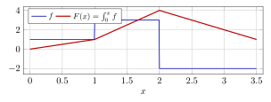
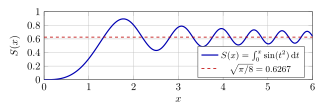
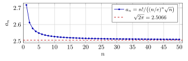

# 第 16 讲　微积分基本定理与积分中值定理 — (The fundamental theorem of calculus and the mean value theorems for integrals；不定积分速览)

第 15 讲用上下和定义积分，并比较了数值近似。本讲研究积分与导数的关系。固定下限，令
$$
F(x)=\int_a^x f(t)\,\mathrm{d} t.
$$
若 $f$ 可积，$F$ 连续；若 $f$ 在 $x$ 处连续，则 $F'(x)=f(x)$。反过来，若可积函数 $f$ 有原函数，Newton–Leibniz 公式用端点值计算其积分。

随后讨论换元、分部积分与积分中值定理，并推导 Taylor 的积分余项及 Stirling 常数。不定积分部分保留常用法则，着重核对原函数的导数与定义域。

## 1 变限积分：把积分变成函数 (The integral as a function of its upper limit)

第 15 讲证明了：连续函数可积，单调函数可积，有界且只有有限个间断点的函数可积。现在设 $f$ 在 $[a,b]$ 上可积 (Riemann integrable)，定义
$$
F(x)=\int_a^xf(t)\,\mathrm{d} t,\qquad x\in[a,b].
$$
积分变量写成 $t$，是为了不与上限 $x$ 混淆。积分的值与积分变量的名字无关。

> [!WARNING] 先猜一猜 (Guess first) — Integrating a step function
>
>
> 取 $f(t)=\operatorname{sgn}(t)$（$t>0$ 时为 $1$，$t<0$ 时为 $-1$，$f(0)=0$），令 $F(x)=\int_{-1}^xf(t)\,\mathrm{d} t$。先猜三件事，再往下读：(1) $F$ 在 $x=0$ 处连续吗？(2) $F$ 在 $x=0$ 处可导吗？(3) $F(1)$ 等于多少？被积函数在 $0$ 处有一个高度为 $2$ 的跳跃，这个跳跃在 $F$ 身上会留下什么痕迹？
>

第一条性质几乎不需要证明，但它的*定量*形式可用于后续计算：$F$ 不只是连续，而是 Lipschitz 连续的，Lipschitz 常数就是 $f$ 的界。

> [!NOTE] 定理 16.1 — 变限积分的连续性 (Continuity of the integral as a function of its upper limit)
>
>
> 设 $f$ 在 $[a,b]$ 上可积 (Riemann integrable)，$M$ 是 $|f|$ 的一个上界。则对任意 $x,y\in[a,b]$，
> $$
> |F(y)-F(x)|\le M\,|y-x| .
> $$
> 特别地 $F$ 在 $[a,b]$ 上一致连续 (uniformly continuous)。
>

> [!NOTE] 证明
>
>
> 不妨设 $x\le y$（WLOG）。由区间可加性 $F(y)-F(x)=\int_x^yf$，再由第 15 讲的估计 $\bigl|\int_x^yf\bigr|\le\int_x^y|f|\le M(y-x)$ 即得。取 $\delta=\varepsilon/(M+1)$ 就得到一致连续。
>

$f$ 可积时必有界，但未必处处连续；即使 $f$ 有间断点，变限积分 $F$ 仍连续。下面确定 $F$ 在哪些点可导。

> [!NOTE] 定理 16.2 — 微积分第一基本定理 (First fundamental theorem of calculus)
>
>
> 设 $f$ 在 $[a,b]$ 上可积 (Riemann integrable)，$x_0\in[a,b]$。若 $f$ 在 $x_0$ 处连续 (continuous at $x_0$)，则 $F$ 在 $x_0$ 处可导 (differentiable)，且
> $$
> F'(x_0)=f(x_0).
> $$
> （在端点处理解为单侧导数。）
>

> [!NOTE] 证明
>
>
> 关键是下面这一行估计。对任意 $y\in[a,b]$，因为常数 $f(x_0)$ 的积分是 $f(x_0)(y-x_0)$，有
> 
> $$
>  \bigl|F(y)-F(x_0)-f(x_0)(y-x_0)\bigr|
>  =\Bigl|\int_{x_0}^{y}\bigl(f(t)-f(x_0)\bigr)\,\mathrm{d} t\Bigr|
>  \le \sup_{t\,\text{介于}\,x_0,y}\bigl|f(t)-f(x_0)\bigr|\cdot|y-x_0| .
> $$
> 现在用连续性。给定 $\varepsilon>0$，取 $\delta>0$ 使得 $|t-x_0|<\delta$ 且 $t\in[a,b]$ 时 $|f(t)-f(x_0)|\le\varepsilon$。于是 $|y-x_0|<\delta$ 时 [(16.1)](#l16-eq:keyline) 的右端 $\le\varepsilon|y-x_0|$，即
> $$
> \Bigl|\frac{F(y)-F(x_0)}{y-x_0}-f(x_0)\Bigr|\le\varepsilon\qquad(0<|y-x_0|<\delta).
> $$
> 按第 9 讲的导数定义，这正是 $F'(x_0)=f(x_0)$。
>

请看 [(16.1)](#l16-eq:keyline)：整个定理就是这一行。左端是“$F$ 与它在 $x_0$ 处的线性逼近 (linear approximation) 之差”，右端是“$f$ 在 $x_0$ 附近的振幅乘以区间长”。连续性让振幅任意小，于是差是 $o(|y-x_0|)$。第 9 讲“可导就是误差比 $h$ 高一阶”的逐字验证。

> [!NOTE] 词语提示
>
>
> *differentiable*：可导的；*continuous*：连续的；*hypothesis*：假设；*integrand*：被积函数；*jump*：跳跃。
>

> [!NOTE] Example 16.3 — The jump goes into the corner
>
>
> Take $f=\operatorname{sgn}$ on $[-1,1]$ and $F(x)=\int_{-1}^x\operatorname{sgn}(t)\,\mathrm{d} t$. For $x\le0$ the integrand is $-1$ on $(-1,x)$, so $F(x)=-(x+1)$. For $x\ge0$,
> $$
> F(x)=\int_{-1}^0(-1)\,\mathrm{d} t+\int_0^x1\,\mathrm{d} t=-1+x .
> $$
> So $F(x)=|x|-1$ on $[-1,1]$; in particular $F(1)=0$, $F(0)=-1$.
>
> Read off the three answers. $F$ *is* continuous at $0$ (Theorem [16.1](#l16-thm:cont) with $M=1$, and indeed $|F(y)-F(x)|=\bigl||y|-|x|\bigr|\le|y-x|$). $F$ is *not* differentiable at $0$: $F'_+(0)=1$, $F'_-(0)=-1$, a corner of opening exactly $2$, the height of the jump. Theorem [16.2](#l16-thm:ftc1) is not violated: its hypothesis fails at exactly that one point.
>
> The rule to remember: *a jump of $f$ of height $h$ becomes a corner of $F$ whose two one-sided slopes differ by $h$.* Integration raises smoothness by exactly one notch, no more.
>

下图把这条规则画出来。

这里 $f=1$ 于 $[0,1)$、$f=3$ 于 $[1,2)$、$f=-2$ 于 $[2,3.5]$。请看三件事：$F$ 处处连续（蓝线的两次跳跃没传给红线）；$F$ 在 $x=1,2$ 处有折角，开口分别是 $3-1=2$ 与 $-2-3=-5$；每段内部 $F$ 是直线，斜率恰是 $f$ 的值。端点值 $F(1)=1$、$F(2)=4$、$F(3.5)=1$ 都可心算。

下面这张表用一个没有初等原函数的例子做数值验证：只用 $F$ 的值，不用任何 $f$ 的信息。

> [!NOTE] 词语提示
>
>
> *derivative*：导数；*factor*：因子；*slope*：斜率。
>

> [!NOTE] Example 16.4 — Recovering the integrand from areas alone
>
>
> Let $F(x)=\int_0^xe^{-t^2}\,\mathrm{d} t$. Lecture 15 computed $F(1)=0.7468241328$ by Simpson’s rule. Compute the difference quotients of $F$ at $x=1$ and compare with $e^{-1}=0.3678794412$:
>
> |       $h$ | $\bigl(F(1+h)-F(1)\bigr)/h$ | difference from $e^{-1}$ |
> |------------:|------------------------------:|---------------------------:|
> | $10^{-1}$ |              $0.3323729976$ |    $-3.551\times10^{-2}$ |
> | $10^{-2}$ |              $0.3642129701$ |    $-3.666\times10^{-3}$ |
> | $10^{-3}$ |              $0.3675116844$ |    $-3.678\times10^{-4}$ |
> | $10^{-4}$ |              $0.3678426545$ |    $-3.679\times10^{-5}$ |
>
> The last column shrinks by a factor of $10$ each time (at $h=10^{-5}$ it is $-3.679\times10^{-6}$): the error is proportional to $h$, exactly as in the difference-quotient tables of Lecture 9, and the limit is $e^{-1}$ to every digit shown. The point is that *nothing about the integrand was used*: the table is built from areas, and the areas give back the height. The constant of proportionality, $\approx-0.368=\tfrac12F''(1)=\tfrac12(-2e^{-1})$, says the second derivative of an area is the slope of the integrand.
>

由第一基本定理，可得到连续函数的原函数存在性。

> [!NOTE] 推论 16.5 — 原函数存在定理 (Existence of antiderivatives)
>
>
> 设 $f$ 在 $[a,b]$ 上连续 (continuous)，则 $F(x)=\int_a^xf(t)\,\mathrm{d} t$ 在 $[a,b]$ 上处处可导且 $F'=f$。特别地，$[a,b]$ 上的每个连续函数都有原函数 (antiderivative)。
>

“每个连续函数都有原函数”与“每个连续函数的原函数都写得出来”是完全不同的两句话。第二句是假的：$e^{-x^2}$ 连续，因而由推论 [16.5](#l16-cor:exist) 有原函数，而且我们已经把它的值算到十位；但可以证明（本课不证）它没有由初等函数 (elementary functions) 表示的原函数。第 15 讲的疑问到此有了答案：$\int_0^1e^{-x^2}$ 算不出来，不是因为面积不存在，而是因为*初等函数这个函数库太小*。

反过来的一条也要说清楚，否则“可积”与“有原函数”会被混为一谈。这两个概念互不包含。

> [!NOTE] 注 16.6 — 两个概念互不包含 (Neither implies the other)
>
>
> \(1\) $f=\operatorname{sgn}$ 在 $[-1,1]$ 上可积，但*没有*原函数：设 $G'=\operatorname{sgn}$，则由第 10 讲的中值定理推论，$G=x+c_1$ 于 $(0,1)$、$G=-x+c_2$ 于 $(-1,0)$；$G$ 连续迫使 $c_1=c_2$，于是 $G=|x|+c$，而 $|x|$ 在 $0$ 处不可导，矛盾。
>
> \(2\) 反向：$H(x)=x^2\sin(1/x^3)$（$H(0)=0$）处处可导（在 $0$ 处由 $|H|\le x^2$ 夹逼），故 $H'$ 有原函数；但 $H'(x)=2x\sin\frac1{x^3}-\frac3{x^2}\cos\frac1{x^3}$ 在 $0$ 附近无界，因而不可积。
>
> 两个概念在**连续函数**这一类上同时成立，而本讲余下的内容都活在这一类里。
>

## 2 Newton–Leibniz 公式 (The Newton–Leibniz formula)

第一基本定理说“先积分再求导，还原”。第二基本定理说反向的那句：“先求导再积分，也还原”。

> [!IMPORTANT] 定义 16.7 — 原函数与不定积分 (Antiderivative and indefinite integral)
>
>
> 设 $f$ 定义在区间 $I$ 上。若 $F$ 在 $I$ 上可导 (differentiable) 且 $F'(x)=f(x)$ 对一切 $x\in I$ 成立，称 $F$ 为 $f$ 在 $I$ 上的一个原函数 (antiderivative)。$f$ 的全体原函数构成的集合记作 $\int f(x)\,\mathrm{d} x$，称为 $f$ 的不定积分 (indefinite integral)。
>

> [!NOTE] 命题 16.8 — 相差一个常数 (Antiderivatives differ by a constant)
>
>
> 设 $F,G$ 都是 $f$ 在**区间** $I$ 上的原函数 (antiderivatives)，则存在常数 $C$ 使得 $F=G+C$ 于 $I$ 上。
>

> [!NOTE] 证明
>
>
> $(F-G)'=0$ 于 $I$ 上，由第 10 讲 Lagrange 中值定理 (Lagrange’s mean value theorem) 的推论，$F-G$ 在区间 $I$ 上恒为常数。
>

区间假设不可略去。若定义域由两个不相交的区间组成，$F-G$ 可以在两个区间上取不同的常数。

> [!NOTE] 定理 16.9 — 微积分第二基本定理，Newton–Leibniz 公式 (Second fundamental theorem of calculus)
>
>
> 设 $f$ 在 $[a,b]$ 上可积 (Riemann integrable)，$F$ 是 $f$ 在 $[a,b]$ 上的一个原函数 (antiderivative)。则
> $$
> \int_a^bf(x)\,\mathrm{d} x=F(b)-F(a)=:F\Big|_a^b .
> $$
>

> [!NOTE] 证明
>
>
> 取 $[a,b]$ 的任一分割 $P:\,a=x_0<x_1<\cdots<x_n=b$。把 $F(b)-F(a)$ 裂成望远镜和 (telescoping sum)，再对每一段用 Lagrange 中值定理：存在 $\xi_i\in(x_{i-1},x_i)$ 使
> $$
> F(b)-F(a)=\sum_{i=1}^n\bigl(F(x_i)-F(x_{i-1})\bigr)=\sum_{i=1}^nF'(\xi_i)\,\Delta x_i=\sum_{i=1}^nf(\xi_i)\,\Delta x_i .
> $$
> 右端是 $f$ 对分割 $P$ 的一个 Riemann 和 (Riemann sum)。左端与 $P$ 无关，是一个固定的数。而 $f$ 可积意味着：当 $\|P\|\to0$ 时，*任何*介点取法下的 Riemann 和都趋于 $\int_a^bf$。于是这个固定的数只能等于 $\int_a^bf$。
>

证明先把端点增量拆成有限和，再用中值定理把各项改写为函数值乘以区间长度，得到 Riemann 和。

> [!NOTE] 词语提示
>
>
> *antiderivative*：原函数。
>

> [!NOTE] Example 16.10 — Three integrals, and one that resists
>
>
> **(a)** $\int_0^1x^2\,\mathrm{d} x$. Lecture 15 obtained $\tfrac13$ as the limit of $\sum_{k=1}^nk^2/n^3$. Now: $F(x)=x^3/3$ has $F'=x^2$, so the integral is $F(1)-F(0)=\tfrac13$. One line instead of a limit computation.
>
> **(b)** $\int_1^2\dfrac{\mathrm{d} x}{x}=\ln2=0.6931471806$, because $[1,2]$ lies inside $(0,\infty)$, where $\ln x$ is a genuine antiderivative of $1/x$. Keep an eye on that interval; §3 shows what goes wrong when one forgets it.
>
> **(c)** $\int_0^1xe^{-x^2}\mathrm{d} x$: guess an antiderivative and check by differentiating, $\bigl(-\tfrac12e^{-x^2}\bigr)'=xe^{-x^2}$. So the integral is $\tfrac12(1-e^{-1})=0.3160602794$.
>
> **(d)** $\int_0^1e^{-x^2}\mathrm{d} x$: the same trick fails, there is no elementary $F$ with $F'=e^{-x^2}$. Corollary [16.5](#l16-cor:exist) still guarantees an antiderivative exists, and Lecture 15 got $0.7468241328$ numerically. The difference between (c) and (d) is the factor $x$ — exactly the derivative of the inner function $-x^2$, up to a constant. That coincidence is the whole content of the substitution rule, and it is rare.
>

（c）与（d）比较了有初等原函数和没有初等原函数的情形。下面列出常用积分法则，并练习验证候选原函数。

## 3 不定积分与原函数核验 (Antiderivatives and their verification)

核验分两步：在候选表达式的定义域内求导，再确认所得导数等于被积函数。不同表达式可能表示同一个原函数，也可能在不同区间上相差不同常数。

下表每一行都可以（也应该）由读者*求导*验证，这就是它唯一需要的证明。

| $f(x)$ | $\int f(x)\,\mathrm{d} x$ | $f(x)$ | $\int f(x)\,\mathrm{d} x$ |
|:---|:---|:---|:---|
| $x^{\alpha}\ (\alpha\ne-1)$ | $\dfrac{x^{\alpha+1}}{\alpha+1}+C$ | $a^{x}\,(a>0,a\ne1)$ | $\dfrac{a^{x}}{\ln a}+C$ |
| $\dfrac1x$ | $\ln|x|+C$ *(on an interval)* | $\dfrac1{1+x^2}$ | $\arctan x+C$ |
| $e^{x}$ | $e^{x}+C$ | $\dfrac1{\sqrt{1-x^2}}$ | $\arcsin x+C$ |
| $\sin x$ | $-\cos x+C$ | $\dfrac{1}{x^2-1}$ | $\dfrac12\ln\Bigl|\dfrac{x-1}{x+1}\Bigr|+C$ |
| $\tan x$ | $-\ln|\cos x|+C$ | $\cot x$ | $\ln|\sin x|+C$ |
| $\ln x$ | $x\ln x-x+C$ | $\dfrac1{\sqrt{1+x^2}}$ | $\ln\bigl(x+\sqrt{1+x^2}\bigr)+C$ |
| $\sec^2x$ | $\tan x+C$ | $\cos x$ | $\sin x+C$ |

两条法则，各一个例子，然后本节的技巧部分就结束了。

> [!NOTE] 定理 16.11 — 换元与分部 (Substitution and integration by parts)
>
>
> 设 $u,v$ 在区间 $I$ 上可导 (differentiable)。
>
> 1.  （换元 (substitution)）若 $\int f(u)\,\mathrm{d} u=F(u)+C$ 且 $u=u(x)$ 可导，则 $\displaystyle\int f\bigl(u(x)\bigr)u'(x)\,\mathrm{d} x=F\bigl(u(x)\bigr)+C$。
>
> 2.  （分部 (integration by parts)）$\displaystyle\int u(x)v'(x)\,\mathrm{d} x=u(x)v(x)-\int u'(x)v(x)\,\mathrm{d} x$。
>

> [!NOTE] 证明
>
>
> 两条都是求导法则倒过来读：链式法则 (chain rule) $\bigl(F(u(x))\bigr)'=f(u(x))u'(x)$ 给出 (1)，乘积法则 (product rule) $(uv)'=u'v+uv'$ 移项给出 (2)。
>

> [!NOTE] 词语提示
>
>
> *numerator*：分子。
>

> [!NOTE] Example 16.12 — One substitution, one by parts
>
>
> **Substitution.** $\displaystyle\int\frac{x}{1+x^4}\,\mathrm{d} x$. The numerator $x\,\mathrm{d} x$ is half of $\mathrm{d}(x^2)$, so with $u=x^2$,
> $$
> \int\frac{x\,\mathrm{d} x}{1+x^4}=\frac12\int\frac{\mathrm{d} u}{1+u^2}=\frac12\arctan(x^2)+C .
> $$
> Check: $\bigl(\tfrac12\arctan(x^2)\bigr)'=\tfrac12\cdot\frac{2x}{1+x^4}=\frac{x}{1+x^4}$.
>
> **By parts.** $\int\ln x\,\mathrm{d} x$ on $(0,\infty)$, with $u=\ln x$, $v'=1$, $v=x$: $\int\ln x\,\mathrm{d} x=x\ln x-\int x\cdot\frac1x\,\mathrm{d} x=x\ln x-x+C$. Check: $(x\ln x-x)'=\ln x+1-1=\ln x$.  This gives $\int_1^n\ln x\,\mathrm{d} x=n\ln n-n+1$; at $n=10$ that is $14.0258509299$, against $\ln(10!)=15.1044125731$.
>

有理函数 (rational function) 可经多项式除法与部分分式分解 (partial fractions)，化为一次、二次因子对应的基本积分。这里只说明方法，分解细节不展开。

> [!WARNING] 先猜一猜 (Guess first) — AI 说 $\int\frac{\mathrm{d} x}{x}=\ln x+C$，错在哪？
>
>
> 几乎每个符号计算系统、每个聊天模型都会这样回答。先别看下文：这个答案*在什么范围内*是对的？如果有人要用它算 $\int_{-3}^{-1}\frac{\mathrm{d} x}{x}$，会发生什么？再猜一个更刁的：在集合 $\mathbb{R}\setminus\{0\}$ 上，$1/x$ 的全体原函数是不是都形如 $\ln|x|+C$（$C$ 是*一个*常数）？
>

下面检查四个候选原函数，分别核对导数与有效区间。

> [!NOTE] 词语提示
>
>
> *logarithm*：对数；*audit*：核查。
>

> [!NOTE] Example 16.13 — Auditing four answers, all produced by an AI
>
>
> Each item below is a genuine answer type one gets from a chat model. The audit is always the same: differentiate, compare, and check the domain.
>
> **(a) Domain error.** Claim: $\displaystyle\int\frac{\mathrm{d} x}{x}=\ln x+C$. Differentiating gives $1/x$ — correct, *but only where $\ln x$ is defined*, i.e. on $(0,\infty)$. On $(-\infty,0)$ the claim is meaningless. The repaired answer is $\ln|x|+C$; numerically, at $x=-2$ the symmetric difference quotient of $\ln|x|$ with $h=10^{-6}$ gives $-0.5000000000$, and $1/(-2)=-0.5$.
>
> Now the sharper half of the guess box. On $\mathbb{R}\setminus\{0\}$ — which is *not* an interval — Proposition [16.8](#l16-prop:plusC) does not apply: there the general antiderivative of $1/x$ is $\ln x+C_1$ on $x>0$ and $\ln(-x)+C_2$ on $x<0$, with *two* independent constants. Writing “$+C$” hides the second one, and that is exactly what makes the next item wrong.
>
> **(b) Absolute value dropped.** Claim: $\displaystyle\int\frac{\mathrm{d} x}{x^2-1}=\frac12\ln\frac{x-1}{x+1}+C$. Formal differentiation gives $\tfrac12\bigl(\tfrac1{x-1}-\tfrac1{x+1}\bigr)=\tfrac1{x^2-1}$, so the derivative is right — but at $x=0$ the logarithm’s argument is $-1$ and the formula returns nothing. With the absolute value, $\tfrac12\ln\bigl|\tfrac{x-1}{x+1}\bigr|+C$, the audit succeeds off $\{\pm1\}$: at $x=0,\,0.5,\,2,\,-3$ the numerical derivative is $-1.00000000$, $-1.33333333$, $0.33333333$, $0.12500000$, against $1/(x^2-1)$.
>
> **(c) A difference that is not an error.** Two systems return $\int2\sin x\cos x\,\mathrm{d} x=\sin^2x+C$ and $=-\tfrac12\cos2x+C$. Differentiate both: $2\sin x\cos x$ and $\sin2x$ — both correct, and indeed $\sin^2x+\tfrac12\cos2x=\tfrac12$ identically (checked at $x=0,\,0.3,\,1,\,2.7$). Proposition [16.8](#l16-prop:plusC) predicted exactly this. *Moral: never audit by comparing two answers; audit by differentiating each one.*
>
> **(d) A plain slip.** Claim: $\displaystyle\int x^2e^{x}\,\mathrm{d} x=(x^2-2x-2)e^{x}+C$. Differentiate: $(2x-2)e^x+(x^2-2x-2)e^x=(x^2-4)e^x$. Not $x^2e^x$. At $x=1$ the claimed derivative is $-8.1548454854$ while $x^2e^x=2.7182818285$ — off by a mile, and one evaluation caught it. The correct answer is $(x^2-2x+2)e^x+C$, obtained by two integrations by parts; audit at $x=0,1,2$: derivative $0$, $2.7182818285$, $29.5562243957$ against $x^2e^x=0$, $2.7182818285$, $29.5562243957$.
>

核验须同时检查定义域、绝对值和积分常数。两个表达式外形不同，不足以判定其中一个错误。

> [!NOTE] 词语提示
>
>
> *central difference*：中心差商；*valid*：有效的。
>

> [!NOTE] AI Lab — Six antiderivatives, six audits
>
>
> Ask a chat model (not a dedicated computer-algebra system — the point is to see the failure modes) for these six indefinite integrals in one request, with no work shown: $\int\frac{\mathrm{d} x}{x\ln x}$, $\int\frac{\mathrm{d} x}{1-x^2}$, $\int\sqrt{1-x^2}\,\mathrm{d} x$, $\int\frac{\mathrm{d} x}{\sin x}$, $\int x\arctan x\,\mathrm{d} x$, $\int\frac{\mathrm{d} x}{x^2+2x+5}$. Then audit each answer *yourself*: (1) differentiate it by hand until you either match the integrand or find a mismatch; (2) check numerically at three interior points, comparing the central difference quotient ($h=10^{-5}$) of the proposed answer with the integrand — agreement to $8$ digits is a pass; (3) state the largest interval on which the formula is valid and whether the printed answer warns you (item 1 breaks at $x=1$, item 2 at $x=\pm1$, item 4 at every multiple of $\pi$).
>
> **Questions to answer from your table.** How many were wrong *as functions*, and how many were right as functions but printed without the domain restriction or the absolute value? Which failure would have survived a careless “looks right” reading? Finally, re-run the request in a fresh conversation: do the answers change, and what does that say about using a chat model as an integral table?
>

## 4 定积分的换元与分部 (Substitution and parts for definite integrals)

把上一节的两条法则与 Newton–Leibniz 公式合起来，就得到定积分版本。区别只有一处，但那一处是全部的风险所在：定积分的换元要*同时换限*，而换限是否合法，取决于代换函数在整段上的行为。

> [!NOTE] 定理 16.14 — 定积分换元公式 (Change of variables)
>
>
> 设 $\varphi$ 在 $[\alpha,\beta]$ 上有连续导数 (continuously differentiable)，$\varphi(\alpha)=a$，$\varphi(\beta)=b$，且 $f$ 在一个包含 $\varphi([\alpha,\beta])$ 的区间上连续 (continuous)。则
> $$
> \int_a^bf(x)\,\mathrm{d} x=\int_{\alpha}^{\beta}f\bigl(\varphi(t)\bigr)\varphi'(t)\,\mathrm{d} t .
> $$
>

> [!NOTE] 证明
>
>
> 设 $F$ 是 $f$ 的原函数（由推论 [16.5](#l16-cor:exist) 存在）。则 $\bigl(F\circ\varphi\bigr)'(t)=f(\varphi(t))\varphi'(t)$，它在 $[\alpha,\beta]$ 上连续，故由 Newton–Leibniz 公式右端 $=F(\varphi(\beta))-F(\varphi(\alpha))=F(b)-F(a)$，而这正是左端。
>

请注意定理没有要求 $\varphi$ 单调 (monotone)：$\varphi$ 可以来回走，只要它在整个 $[\alpha,\beta]$ 上有定义且 $C^1$。真正的要求是这最后一句。下面的事故就发生在它被忽略时。

> [!NOTE] 词语提示
>
>
> *sanity check*：合理性检查；*identity*：恒等式；*bounded*：有界的。
>

> [!NOTE] Example 16.15 — A substitution that proves $\pi/2=0$
>
>
> Consider $I=\displaystyle\int_{-1}^{1}\frac{\mathrm{d} x}{1+x^2}=\arctan1-\arctan(-1)=\frac{\pi}{2}=1.5707963268$ (numerically, Simpson with $2\times10^6$ subintervals gives $1.5707963268$).
>
> Now substitute $x=1/t$, i.e. $\varphi(t)=1/t$, $\mathrm{d} x=-\mathrm{d} t/t^2$. The limits transform as $x=-1\leftrightarrow t=-1$ and $x=1\leftrightarrow t=1$, so one writes
> $$
> I=\int_{-1}^{1}\frac{1}{1+1/t^{2}}\cdot\Bigl(-\frac{\mathrm{d} t}{t^{2}}\Bigr)
>   =-\int_{-1}^{1}\frac{\mathrm{d} t}{t^{2}+1}=-I .
> $$
> Hence $I=0$. But $I=\pi/2\ne0$.
>
> **Where is the mistake?** Not in the algebra — every manipulation above is a correct identity *wherever both sides are defined*. The mistake is that $\varphi(t)=1/t$ is not defined at $t=0$, which lies inside $[-1,1]$; so Theorem [16.14](#l16-thm:sub) simply does not apply, and the middle expression is not an integral of a bounded function over $[-1,1]$ at all. The substitution is legitimate on $[1,T]$ or on $[-T,-1]$, never across $0$.
>
> **The habit.** Before changing variables, state $[\alpha,\beta]$ and check that $\varphi$ is defined and $C^1$ on all of it. And a sanity check costs one line: both sides must have the same sign, and here the left side is positive while the right is $-I<0$.
>

> [!NOTE] 定理 16.16 — 定积分分部积分公式 (Integration by parts)
>
>
> 设 $u,v$ 在 $[a,b]$ 上有连续导数 (continuously differentiable)。则
> $$
> \int_a^bu(x)v'(x)\,\mathrm{d} x=u(x)v(x)\Big|_a^b-\int_a^bu'(x)v(x)\,\mathrm{d} x .
> $$
>

> [!NOTE] 证明
>
>
> $(uv)'=u'v+uv'$ 在 $[a,b]$ 上连续，对它用 Newton–Leibniz 公式并移项。
>

分部积分在本讲之后的三节里都是主角：它推出第二中值定理、推出 Taylor 公式的积分余项、推出 Wallis 公式。先用它做一件具体的事。把一整族积分压缩成一个递推。

> [!NOTE] 词语提示
>
>
> *infinite*：无穷的；*strictly*：严格地；*odd*：奇数的。
>

> [!NOTE] Example 16.17 — A recursion for $\int_0^{\pi/2}\sin^nx\,\mathrm{d} x$
>
>
> Write $I_n=\displaystyle\int_0^{\pi/2}\sin^nx\,\mathrm{d} x$ for $n\ge0$. Directly, $I_0=\pi/2$ and $I_1=1$. For $n\ge2$ take $u=\sin^{n-1}x$, $v'=\sin x$, so $v=-\cos x$:
> $$
> I_n=-\sin^{n-1}x\cos x\Big|_0^{\pi/2}+(n-1)\int_0^{\pi/2}\sin^{n-2}x\cos^2x\,\mathrm{d} x
>    =0+(n-1)\bigl(I_{n-2}-I_n\bigr),
> $$
> using $\cos^2=1-\sin^2$. Solving for $I_n$:
> 
> $$
>  I_n=\frac{n-1}{n}\,I_{n-2}\qquad(n\ge2).
> $$
> One formula replaces an infinite list of integrals. Running it:
>
> | $n$ | $0$ | $1$ | $2$ | $4$ | $8$ | $10$ |
> |---:|---:|---:|---:|---:|---:|---:|
> | $I_n$ | $1.5707963268$ | $1.0000000000$ | $0.7853981634$ | $0.5890486225$ | $0.4295146206$ | $0.3865631585$ |
>
> Two things we will use in §8. First, $I_n$ is strictly decreasing, since $0\le\sin x\le1$ forces $\sin^{n+1}x\le\sin^nx$. Second, it decreases *slowly*: from $n=0$ to $n=10$ only by a factor of $4$. Iterating [(16.2)](#l16-eq:rec) separates even from odd:
> $$
> I_{2m}=\frac{(2m-1)!!}{(2m)!!}\cdot\frac{\pi}{2},\qquad
>  I_{2m+1}=\frac{(2m)!!}{(2m+1)!!},
> $$
> where $(2m)!!=2\cdot4\cdots(2m)$ and $(2m-1)!!=1\cdot3\cdots(2m-1)$. Both are checked against the table: $I_{10}=\frac{945}{3840}\cdot\frac\pi2=0.3865631585$.
>

> [!WARNING] 先猜一猜 (Guess first) — $\int_0^{\pi}\sin^{10}x\,\mathrm{d} x$ 有多大？
>
>
> 先猜一个数再往下算。两个参照点：$\int_0^\pi\sin x\,\mathrm{d} x=2$，$\int_0^\pi\sin^{2}x\,\mathrm{d} x=\pi/2\approx1.5708$。$\sin^{10}$ 只在 $x=\pi/2$ 附近的窄峰上不算小（$\sin^{10}(1.2)=0.4947$，$\sin^{10}(0.8)=0.0361$），所以答案明显小于 $1.57$。但小多少？写下精确到一位小数的猜测。
>

> [!NOTE] 词语提示
>
>
> *maximum*：最大值；*width*：宽度。
>

> [!NOTE] Example 16.18 — The value, and why guessing it is hard
>
>
> By symmetry about $x=\pi/2$, $\displaystyle\int_0^{\pi}\sin^{10}x\,\mathrm{d} x=2I_{10}=\frac{63}{256}\,\pi=0.7731263171$.
>
> Most first guesses land near $0.3$–$0.5$, i.e. too small. The reason is instructive: the eye sees the tall narrow peak and forgets how *fat* it still is. The half-width of $\sin^{10}$ at half maximum is the $x$ with $\sin^{10}x=\tfrac12$, i.e. $\sin x=2^{-1/10}=0.9330$, giving $x=1.2027526$ and $x=1.9388400$: a peak of width $0.7360874$ and height $1$. That crude rectangle already predicts $0.7360874$, which is $4.8\%$ below the truth. Guessing integrals by “height $\times$ effective width” is a skill worth building; Lecture 17 is entirely about it.
>

## 5 积分第一中值定理 (The first mean value theorem for integrals)

面积等于“某个高度乘以底”听上去是废话。有内容的是下一句：*那个高度是被积函数实际取到的一个值*，而且取值点可以要求在开区间内部。这就是积分第一中值定理，本讲后面三节的共同工具。

> [!WARNING] 先猜一猜 (Guess first) — 平均高度在哪里取到
>
>
> $\int_0^1x^2\,\mathrm{d} x=\tfrac13$，而底是 $1$，所以“平均高度”是 $1/3$。函数 $x\mapsto x^2$ 在 $[0,1]$ 上哪一点取到 $1/3$？先猜：这个 $\xi$ 比 $0.5$ 大还是小？给一个两位小数的猜测。再猜第二个：如果把面积改成*加权*平均，权重 $g(x)=x$（即计算 $\int_0^1x^2\cdot x\,\mathrm{d} x\big/\int_0^1x\,\mathrm{d} x$），$\xi$ 会往哪边移动，移到哪里？
>

先给一条极其有用的小引理。它本身就是一件“估计”的活，且后面反复要用。

> [!NOTE] 引理 16.19 — 非负连续函数的积分为零则函数为零 (A nonnegative continuous function with zero integral vanishes)
>
>
> 设 $h$ 在 $[a,b]$ 上连续 (continuous)，$h\ge0$，且 $\int_a^bh=0$。则 $h\equiv0$ 于 $[a,b]$。
>

> [!NOTE] 证明
>
>
> 反证：设 $h(p)=c>0$。由连续性取 $\delta>0$ 使 $J=[p-\delta,p+\delta]\cap[a,b]$ 上 $h\ge c/2$，$J$ 长 $\ell\ge\delta>0$。由单调性与区间可加性（$h\ge0$ 保证区间外不减少总量）$\int_a^bh\ge\int_Jh\ge\frac{c}{2}\ell>0$，矛盾。
>

> [!NOTE] 定理 16.20 — 积分第一中值定理 (First mean value theorem for integrals)
>
>
> 设 $f$ 在 $[a,b]$ 上连续 (continuous)，$g$ 在 $[a,b]$ 上可积 (integrable) 且 $g\ge0$（或处处 $g\le0$，即 $g$ 在 $[a,b]$ 上*不变号*）。则存在 $\xi\in[a,b]$ 使
> 
> $$
>  \int_a^bf(x)g(x)\,\mathrm{d} x=f(\xi)\int_a^bg(x)\,\mathrm{d} x .
> $$
> 若进一步 $\int_a^bg\ne0$，则 $\xi$ 可以取在开区间 $(a,b)$ 内。特别地，取 $g\equiv1$：存在 $\xi\in(a,b)$ 使
> $$
> \int_a^bf(x)\,\mathrm{d} x=f(\xi)\,(b-a).
> $$
>

> [!NOTE] 证明
>
>
> 只需处理 $g\ge0$（否则把 $g$ 换成 $-g$，两端同时变号）。记 $m=\min_{[a,b]}f$，$M=\max_{[a,b]}f$（第 8 讲的最值定理保证它们存在）。由 $mg\le fg\le Mg$ 及积分的单调性，
> 
> $$
>  m\int_a^bg\ \le\ \int_a^bfg\ \le\ M\int_a^bg .
> $$
>
> 若 $\int_a^bg=0$，则 [(16.4)](#l16-eq:sandwich) 给出 $\int_a^bfg=0$，[(16.3)](#l16-eq:mvt1) 对任何 $\xi$ 都成立。
>
> 设 $\int_a^bg=:A>0$，令 $\mu=\frac1A\int_a^bfg$。由 [(16.4)](#l16-eq:sandwich)，$m\le\mu\le M$。由第 7 讲的介值定理 (Intermediate Value Theorem) 立刻得到某个 $\xi\in[a,b]$ 使 $f(\xi)=\mu$，这就是 [(16.3)](#l16-eq:mvt1)。
>
> 剩下把 $\xi$ 保证位于开区间。注意由 $\mu$ 的定义有
> 
> $$
>  \int_a^b\bigl(f(x)-\mu\bigr)g(x)\,\mathrm{d} x=0 .
> $$
> 断言：不可能对一切 $x\in(a,b)$ 都有 $f(x)>\mu$。设若如此。$g$ 可积故有界，设 $|g|\le K$；取 $\delta\in\bigl(0,\tfrac{b-a}{2}\bigr)$ 使 $2K\delta<A/2$，则 $\int_{a+\delta}^{b-\delta}g\ge A-2K\delta>A/2>0$。而 $f-\mu$ 在闭区间 $[a+\delta,b-\delta]$ 上连续且处处为正，故有正的最小值 $c>0$（第 8 讲最值定理）。于是（$(f-\mu)g\ge0$ 使区间外的部分不减少总量）
> $$
> \int_a^b(f-\mu)g\ \ge\ c\int_{a+\delta}^{b-\delta}g\ >\ \frac{cA}{2}>0,
> $$
> 与 [(16.5)](#l16-eq:zeroint) 矛盾。同理不可能对一切 $x\in(a,b)$ 都有 $f(x)<\mu$。
>
> 于是存在 $p,q\in(a,b)$ 使 $f(p)\le\mu\le f(q)$。若其中有一个取等号，该点就是所要的 $\xi\in(a,b)$。否则 $f(p)<\mu<f(q)$，介值定理给出严格介于 $p,q$ 之间的 $\xi$，而 $p,q\in(a,b)$ 蕴含 $\xi\in(a,b)$。
>

“$\xi$ 可以取在开区间内”这一句看上去只是修饰，实际上在 §6 里是必需的：那里要对一个只在端点之间才有信息的对象用中值定理。把它一次证清楚，后面就不必再绕。

> [!NOTE] 词语提示
>
>
> *horizontal*：水平的；*convexity*：凸性；*attained*：能取到的；*weighted*：加权的；*midpoint*：中点；*concave*：凹的。
>

> [!NOTE] Example 16.21 — Where the mean height is attained
>
>
> For $g\equiv1$ on $[0,1]$ the theorem says $\int_0^1f=f(\xi)$; solve for $\xi$ in three cases.
>
> | $f$       |    $\int_0^1f$ |          $\xi$ | determined by      |
> |:------------|-----------------:|-----------------:|:-------------------|
> | $x^2$     | $0.3333333333$ | $0.5773502692$ | $\xi=1/\sqrt3$   |
> | $\sqrt x$ | $0.6666666667$ | $0.4444444444$ | $\xi=4/9$        |
> | $x^{10}$  | $0.0909090909$ | $0.7867934422$ | $\xi=11^{-1/10}$ |
>
> Every $\xi$ is strictly inside $(0,1)$, as promised. The picture to keep in mind: the horizontal line $y=\int_0^1f$ cuts off a rectangle of the same area as the region under the graph, and it must cross the graph — at an interior point. For the convex $x^2$ the answer $0.577>0.5$; for the concave $\sqrt x$, $\xi=0.444<0.5$. *Convexity decides which side of the midpoint $\xi$ falls on* — Lecture 17 turns this into the Hermite–Hadamard inequality.
>
> **Weighted version.** With $g(x)=x$ on $[0,1]$: $\int_0^1x^3\,\mathrm{d} x\big/\int_0^1x\,\mathrm{d} x=(1/4)/(1/2)=1/2$, so $\xi^2=1/2$ and $\xi=0.7071067812$. With $g(x)=x^2$: $(1/5)/(1/3)=3/5$ and $\xi=0.7745966692$. The weight pulls $\xi$ towards where the weight is large — here, towards $x=1$.
>

第一中值定理最常见的用法不是求 $\xi$（通常求不出来），而是*把一个含参数的积分的极限算出来*。下面是范例。

> [!NOTE] 词语提示
>
>
> *geometric*：等比的；*linear*：线性的。
>

> [!NOTE] Example 16.22 — A weight that concentrates: $n\int_0^1x^nf(x)\,\mathrm{d} x$
>
>
> Take $f(x)=1/(1+x)$, continuous on $[0,1]$. Guess first: as $n\to\infty$, the weight $x^n$ becomes tiny everywhere except very near $x=1$. What should $n\int_0^1x^nf(x)\,\mathrm{d} x$ tend to? Numerically:
>
> | $n$ | $1$ | $2$ | $5$ | $10$ | $50$ |
> |---:|---:|---:|---:|---:|---:|
> | $n\int_0^1x^nf$ | $0.3068528194$ | $0.3862943611$ | $0.4509307639$ | $0.4751225993$ | $0.4950009992$ |
>
> (at $n=200$ the value is $0.4987500156$). The limit is evidently $\tfrac12=f(1)$.
>
> **Proof.** Fix $\delta\in(0,1)$. On $[0,1-\delta]$ one has $\bigl|\int_0^{1-\delta}x^nf\bigr|\le(1-\delta)^{n+1}/(n+1)$, so $n$ times it tends to $0$ (geometric beats linear). On $[1-\delta,1]$ the weight $x^n$ is $\ge0$, so Theorem [16.20](#l16-thm:mvt1) gives $\eta_n\in(1-\delta,1)$ with $\int_{1-\delta}^{1}x^nf=f(\eta_n)\frac{1-(1-\delta)^{n+1}}{n+1}$. Multiplying by $n$: every limit point of $n\int_0^1x^nf$ lies within $\sup_{|x-1|\le\delta}|f(x)-f(1)|$ of $f(1)$, and $\delta$ was arbitrary. So the limit is $f(1)=\tfrac12$.  *A weight concentrating at a point reads off the value of $f$ there* — a mechanism Lecture 17 meets again.
>

## 6 积分第二中值定理 (The second mean value theorem, Bonnet’s form)

第一中值定理要求权重 $g$ 不变号。可是实践中最需要估计的恰恰是*振荡*的权重：$\int_a^b f(x)\sin x\,\mathrm{d} x$ 里的 $\sin x$ 一会儿正一会儿负，第一中值定理一个字也说不上。第二中值定理把要求换了个位置：不再要求 $g$ 不变号，改为要求另一个因子 $f$ *单调*。这是一个非常划算的交换，因为振荡带来的 cancellation 恰好是我们想利用的东西。

> [!NOTE] 定理 16.23 — 积分第二中值定理 (Second mean value theorem for integrals; Bonnet)
>
>
> 设 $g$ 在 $[a,b]$ 上可积 (integrable)，$f$ 在 $[a,b]$ 上单调 (monotone)。则存在 $\xi\in[a,b]$ 使
> 
> $$
>  \int_a^bf(x)g(x)\,\mathrm{d} x=f(a)\int_a^{\xi}g(x)\,\mathrm{d} x+f(b)\int_{\xi}^{b}g(x)\,\mathrm{d} x .
> $$
> 特别地（Bonnet 形式）：若 $f$ 非负单调递减 (nonnegative and decreasing)，则存在 $\xi\in[a,b]$ 使
> $$
> \int_a^bfg=f(a)\int_a^{\xi}g;
> $$
> 若 $f$ 非负单调递增 (nonnegative and increasing)，则存在 $\xi\in[a,b]$ 使 $\displaystyle\int_a^bfg=f(b)\int_{\xi}^bg$。
>

先看 $f$ 还有连续导数时的证明，它是三行，而且用的正是上一节那个“$\xi$ 在开区间内”的加强。

> [!NOTE] 证明 — 证明（$f$ 单调且有连续导数的情形）
>
>
> 令 $G(x)=\int_a^xg$。由定理 [16.1](#l16-thm:cont)，$G$ 在 $[a,b]$ 上连续，且 $G(a)=0$。对 $\int_a^bfg=\int_a^bfG'$ 用分部积分（定理 [16.16](#l16-thm:parts)）：
> $$
> \int_a^bf(x)g(x)\,\mathrm{d} x=f(b)G(b)-\int_a^bf'(x)G(x)\,\mathrm{d} x .
> $$
> $f$ 单调意味着 $f'$ 在 $[a,b]$ 上不变号，而 $G$ 连续，于是第一中值定理（定理 [16.20](#l16-thm:mvt1)，$f'$ 作权重）给出 $\xi\in[a,b]$ 使
> $$
> \int_a^bf'G=G(\xi)\int_a^bf'=G(\xi)\bigl(f(b)-f(a)\bigr).
> $$
> 代回并整理：
> $$
> \int_a^bfg=f(b)G(b)-G(\xi)\bigl(f(b)-f(a)\bigr)=f(a)G(\xi)+f(b)\bigl(G(b)-G(\xi)\bigr),
> $$
> 这正是 [(16.6)](#l16-eq:bonnet)。至于 Bonnet 形式：设 $f\ge0$ 递减。若 $f(a)=0$ 则 $f\equiv0$，结论平凡。否则把 [(16.6)](#l16-eq:bonnet) 重排成
> $$
> \int_a^bfg=\bigl(f(a)-f(b)\bigr)G(\xi)+f(b)G(b)=f(a)\Bigl[\lambda G(\xi)+(1-\lambda)G(b)\Bigr],
>  \qquad \lambda=\frac{f(a)-f(b)}{f(a)}\in[0,1].
> $$
> 方括号内是 $G(\xi)$ 与 $G(b)$ 的凸组合 (convex combination)，故介于二者之间；$G$ 连续，由介值定理存在 $\eta\in[a,b]$ 使 $G(\eta)$ 等于它。于是 $\int_a^bfg=f(a)G(\eta)=f(a)\int_a^{\eta}g$。递增的情形对 $x\mapsto f(a+b-x)$ 重复上述论证。
>

> [!NOTE] 注 16.24 — 一般单调 $f$ 的证明草图 (Proof sketch without differentiability)
>
>
> 去掉 $f\in C^1$ 后分部积分不能用了，但它的离散版本。Abel 变换 (Abel summation)。可以。取分割 $a=x_0<\cdots<x_n=b$，把 $\int_a^bfg$ 近似成 $\sigma=\sum_{i=0}^{n-1}f(x_i)\bigl(G(x_{i+1})-G(x_i)\bigr)$（误差由 $f$ 在各小区间上的振幅之和控制，$\|P\|\to0$ 时趋于零），再重新分组：
> $$
> \sigma=\sum_{i=1}^{n-1}G(x_i)\bigl(f(x_{i-1})-f(x_i)\bigr)+f(x_{n-1})G(b).
> $$
> $f$ 单调使所有系数 $f(x_{i-1})-f(x_i)$ 同号，于是 $\sigma$ 被夹在 $G$ 的最小值与最大值分别乘同一个数之间；令 $\|P\|\to0$ 并用 $G$ 的连续性与介值定理即得 [(16.6)](#l16-eq:bonnet)。要点是：*单调性把一串系数变成同号的一串*。
>

第二中值定理的价值全在一个推论上：它把“振荡因子的积分很小”这句直觉变成一条不等式。

> [!NOTE] 词语提示
>
>
> *cancellation*：相消；*oscillation*：振荡；*monotone*：单调的；*estimate*：估计；*uniform*：一致的；*bound*：界；估计；*tail*：从某项开始的尾段。
>

> [!NOTE] Example 16.25 — The oscillation estimate that Lecture 18 runs on
>
>
> Let $0<a<b$. Apply Theorem [16.23](#l16-thm:mvt2) with $f(x)=1/x$ (positive, decreasing) and $g(x)=\sin x$:
> $$
> \int_a^b\frac{\sin x}{x}\,\mathrm{d} x=\frac1a\int_a^{\xi}\sin x\,\mathrm{d} x=\frac{\cos a-\cos\xi}{a},
>  \qquad\text{hence}\qquad
>  \Bigl|\int_a^b\frac{\sin x}{x}\,\mathrm{d} x\Bigr|\le\frac2a .
> $$
> Read what this says: the bound does not involve $b$ at all. No matter how long the interval, the tail integral stays below $2/a$. Numerically (Simpson, $4\times10^5$ subintervals):
>
> | $[a,b]$      | $\int_a^b\frac{\sin x}{x}\,\mathrm{d} x$ | bound $2/a$ |
> |:---------------|-------------------------------------------:|--------------:|
> | $[10,100]$   |                          $-0.0961221273$ |       $0.2$ |
> | $[10,1000]$  |                          $-0.0881144723$ |       $0.2$ |
> | $[100,1000]$ |                $\phantom{-}0.0080076551$ |      $0.02$ |
>
> The bound is off by a factor of about $2$, but it is *uniform in $b$*, and that is what makes it useful. Note that $\int_a^b|\sin x|/x\,\mathrm{d} x$ has no such bound: it grows like $\frac{2}{\pi}\ln(b/a)$. All the gain comes from cancellation between the humps of $\sin$, and the monotone factor $1/x$ is what keeps the humps from being re-weighted in a way that destroys it.
>
> **Same idea, stranger consequence.** Substituting $u=x^2$ turns $\int_a^b\sin(x^2)\,\mathrm{d} x$ into $\int_{a^2}^{b^2}\frac{\sin u}{2\sqrt u}\,\mathrm{d} u$, and the same argument gives $\bigl|\int_a^b\sin(x^2)\,\mathrm{d} x\bigr|\le1/a$ — on $[10,1000]$ the actual value is $0.0425177927$ against the bound $0.1$. Yet $\sin(x^2)$ does *not* tend to $0$: it keeps taking the values $\pm1$. An integral over an infinite interval can settle down while its integrand refuses to die out; the oscillation does the work.
>

> [!NOTE] 注 16.26 — A bound for oscillatory tails
>
>
> 第 18 讲要判别 $\int_1^{\infty}\frac{\sin x}{x}\,\mathrm{d} x$ 这类反常积分 (improper integral) 的收敛性。Dirichlet 判别法 (Dirichlet’s test) 的形状是：若 $\int_a^Xg$ 对一切 $X$ 一致有界且 $f$ 单调趋于 $0$，则 $\int_a^{\infty}fg$ 收敛。证明就是把 Cauchy 准则用在 $\int_{b_1}^{b_2}fg$ 上，再对它用定理 [16.23](#l16-thm:mvt2)：$\bigl|\int_{b_1}^{b_2}fg\bigr|\le2\bigl(|f(b_1)|+|f(b_2)|\bigr)\sup_X\bigl|\int_a^Xg\bigr|\to0$。所以本节这条定理是第 18 讲那一整套判别法唯一的动力来源。记住它的形状：*单调因子被拿到积分号外，振荡因子的积分被一致有界性控制住*。
>

> [!NOTE] 词语提示
>
>
> *quadrature*：数值积分；*at least*：至少；*predict*：预测；*extrema*：极值；*shrink*：缩小。
>

> [!NOTE] AI Lab — Plot an integral you cannot evaluate
>
>
> The function $S(x)=\displaystyle\int_0^x\sin(t^2)\,\mathrm{d} t$ has no elementary closed form, but Corollary [16.5](#l16-cor:exist) says it exists, and Theorem [16.2](#l16-thm:ftc1) says $S'(x)=\sin(x^2)$. Use an AI (or any plotting tool it writes for you) to do the following, and answer the questions from the output.
>
> 1.  Plot $S(x)$ for $x\in[0,6]$, using at least $2000$ sample points and a genuine numerical quadrature (Simpson) at each one. Overlay the horizontal line $y=\sqrt{\pi/8}=0.6266570687$.
>
> 2.  From the plot alone, read off the $x$-coordinates of the first four local extrema of $S$. Then *predict* them from Theorem [16.2](#l16-thm:ftc1) — they are the zeros of $\sin(x^2)$ — and compare. (Answers: $\sqrt{k\pi}$ for $k=1,2,3,4$, i.e. $1.7724539$, $2.5066283$, $3.0699801$, $3.5449077$.)
>
> 3.  Compute $S$ at those four points and tabulate: $0.8948315$, $0.4304077$, $0.7882590$, $0.4862470$. Is the sequence of local maxima decreasing? Is the sequence of local minima increasing? By how much does the oscillation shrink each time?
>
> 4.  Ask the AI what $\lim_{x\to\infty}S(x)$ is, and check its answer against your plot and against the bound $\bigl|\int_a^b\sin(t^2)\mathrm{d} t\bigr|\le1/a$ proved above.
>
> **The question to answer.** The integrand $\sin(t^2)$ does not tend to $0$; it takes the value $1$ at $t=\sqrt{\pi/2+2k\pi}$ for every $k$. Explain, in two sentences and using item (3), how an integral over an infinite interval can settle down even though the thing being integrated does not. Keep your answer — Lecture 18 will ask for it again.
>

曲线在 $x=\sqrt{k\pi}$（$k\ge1$）处有局部极值，因为 $S'(x)=\sin(x^2)$ 在这些点变号。极值不等于拐点。相邻半周期的积分逐渐抵消，使累积积分的振幅减小。

## 7 The integral form of the Taylor remainder

第 10 讲证明了带 Lagrange 余项 (Lagrange remainder) 的 Taylor 公式，并预告余项还有别的写法。工具就是分部积分。这一次得到的不是“存在某个 $\xi$”，而是一个*等式*：余项写成一个确定的积分，可直接计算、直接估计，不含未知点。

> [!NOTE] 定理 16.27 — Taylor 公式的积分余项 (Taylor's theorem with integral remainder)
>
>
> 设 $f$ 在包含 $x_0$ 与 $x$ 的区间上有连续的 $n+1$ 阶导数 (continuous $(n+1)$-st derivative)。则
> 
> $$
>  f(x)=\sum_{k=0}^{n}\frac{f^{(k)}(x_0)}{k!}(x-x_0)^k+R_n(x),
>  \qquad
>  R_n(x)=\frac1{n!}\int_{x_0}^{x}f^{(n+1)}(t)\,(x-t)^n\,\mathrm{d} t .
> $$
>

> [!NOTE] 证明
>
>
> 对 $n$ 归纳。$n=0$ 时 [(16.7)](#l16-eq:taylorint) 就是 Newton–Leibniz 公式 $f(x)=f(x_0)+\int_{x_0}^xf'(t)\,\mathrm{d} t$。
>
> 设结论对 $n-1$ 成立，即 $f(x)=\sum_{k\le n-1}\frac{f^{(k)}(x_0)}{k!}(x-x_0)^k+R_{n-1}(x)$，其中 $R_{n-1}(x)=\frac1{(n-1)!}\int_{x_0}^x f^{(n)}(t)(x-t)^{n-1}\mathrm{d} t$。对它分部积分，取 $u=f^{(n)}(t)$，$v'=\frac{(x-t)^{n-1}}{(n-1)!}$，于是 $v=-\frac{(x-t)^{n}}{n!}$（注意求导是对 $t$）：
> $$
> R_{n-1}(x)=-f^{(n)}(t)\frac{(x-t)^n}{n!}\Big|_{t=x_0}^{t=x}+\frac1{n!}\int_{x_0}^{x}f^{(n+1)}(t)(x-t)^n\,\mathrm{d} t
>  =\frac{f^{(n)}(x_0)}{n!}(x-x_0)^n+R_n(x),
> $$
> 因为 $t=x$ 时 $(x-t)^n=0$。把它代回归纳假设，就得到 $n$ 的情形。
>

在本节的光滑性假设下，对积分余项应用第一中值定理，可以得到 Lagrange 与 Cauchy 两种余项形式。

> [!NOTE] 推论 16.28 — Cauchy 余项与 Lagrange 余项 (Cauchy and Lagrange remainders)
>
>
> 在定理 [16.27](#l16-thm:taylorint) 的假设下：
>
> 1.  （Cauchy 余项）存在介于 $x_0$ 与 $x$ 之间的 $c$，使 $\displaystyle R_n(x)=\frac{f^{(n+1)}(c)}{n!}\,(x-c)^n\,(x-x_0)$；
>
> 2.  （Lagrange 余项）存在介于 $x_0$ 与 $x$ 之间的 $\xi$，使 $\displaystyle R_n(x)=\frac{f^{(n+1)}(\xi)}{(n+1)!}\,(x-x_0)^{n+1}$。
>

> [!NOTE] 证明
>
>
> (1)：被积函数 $t\mapsto f^{(n+1)}(t)(x-t)^n$ 连续，对它用定理 [16.20](#l16-thm:mvt1) 的 $g\equiv1$ 情形（不带权重），得到 $c$ 使积分等于该函数在 $c$ 处的值乘以区间长 $x-x_0$。
>
> (2)：这一次把 $(x-t)^n$ 当*权重*。当 $t$ 介于 $x_0$ 与 $x$ 之间时 $(x-t)^n$ 不变号（$x>x_0$ 时非负，$x<x_0$ 时符号恒为 $(-1)^n$），于是定理 [16.20](#l16-thm:mvt1) 给出 $\xi$ 使
> $$
> R_n(x)=\frac{f^{(n+1)}(\xi)}{n!}\int_{x_0}^{x}(x-t)^n\,\mathrm{d} t=\frac{f^{(n+1)}(\xi)}{n!}\cdot\frac{(x-x_0)^{n+1}}{n+1}. \qquad\blacksquare
> $$
>

同一个积分，两种“把谁当权重”的读法，生出两条经典余项。

> [!NOTE] 词语提示
>
>
> *intermediate*：中间的；*remainder*：余项；*exact*：精确的。
>

> [!NOTE] Example 16.29 — Three remainders for $\ln(1+x)$, and a numerical audit
>
>
> Let $f(x)=\ln(1+x)$, $x_0=0$. Then $f^{(n+1)}(t)=(-1)^n n!/(1+t)^{n+1}$, so [(16.7)](#l16-eq:taylorint) reads
> $$
> R_n(x)=(-1)^n\int_0^{x}\frac{(x-t)^n}{(1+t)^{n+1}}\,\mathrm{d} t .
> $$
> At $x=0.5$ (where $\ln1.5=0.4054651081$) the exact remainder $\ln(1+x)-P_n(x)$ and the integral [(16.7)](#l16-eq:taylorint) evaluated numerically agree to all ten digits — as they must, since [(16.7)](#l16-eq:taylorint) is an identity, not an estimate: $R_1=-0.0945348919$, $R_3=-0.0112015586$, $R_5=-0.0018265586$. Solving for the intermediate points gives $\xi=0.1498970,\,0.0867644,\,0.0608953$ (Lagrange) and $c=0.2190340,\,0.1574226,\,0.1250712$ (Cauchy): genuinely different points, both drifting towards $0$ as $n$ grows.
>

下面这个例子说明为什么值得多要一种余项：Lagrange 余项在某些地方*给不出任何信息*，积分余项（及由它推出的 Cauchy 余项）给得出。

> [!NOTE] Example 16.30 — Where the Lagrange remainder is useless
>
>
> Same $f=\ln(1+x)$, but now $x=-0.9$ (so $\ln0.1=-2.3025850930$). The Lagrange form gives
> $$
> |R_n|=\frac{0.9^{\,n+1}}{(n+1)(1+\xi)^{n+1}},\qquad \xi\in(-0.9,0),
> $$
> and all we know about $\xi$ is its range, so the only available bound takes the worst case $1+\xi\to0.1$: $|R_n|\le 9^{\,n+1}/(n+1)$, which *grows* without bound. The estimate is true but empty.
>
> The Cauchy form gives $R_n=(-1)^n x\,(x-c)^n/(1+c)^{n+1}$ with $c\in(-0.9,0)$, and for $x<c<0$ one has $\frac{c-x}{1+c}\le|x|$, whence $|R_n|\le|x|^{n+1}/(1-|x|)$. Compare:
>
> |  $n$ | $|R_n|$ (true) |        Lagrange bound | Cauchy bound |
> |-------:|-----------------:|----------------------:|-------------:|
> |  $1$ |     $1.402585$ |  $4.05\times10^{1}$ | $8.100000$ |
> |  $3$ |     $0.754585$ |  $1.64\times10^{3}$ | $6.561000$ |
> | $10$ |     $0.183837$ |  $2.85\times10^{9}$ | $3.138106$ |
> | $20$ |     $0.039235$ | $5.21\times10^{18}$ | $1.094190$ |
> | $40$ |     $0.002737$ | $3.24\times10^{37}$ | $0.133028$ |
>
> The Lagrange column is a catastrophe; the Cauchy column is crude (it is about $50$ times too big at $n=40$) but it does tend to $0$, which is all one needs to conclude that the Taylor polynomials converge at $x=-0.9$. *One theorem, three faces: which face to use is decided by the point you are standing at.* This is why Lecture 10 promised a second form and this lecture delivers it.
>

Wallis 公式与 Stirling 常数 $\sqrt{2\pi}$\
(Wallis’ formula and Stirling’s constant)
============================================

第 13 讲证明了数列
$$
a_n=\frac{n!}{(n/e)^n\sqrt n}
$$
单调递减且有正下界，因而收敛到某个 $c>0$；也就是说 $n!\sim c\,(n/e)^n\sqrt n$。当时那个常数 $c$ 的值被挂了账：单调有界只给存在性，不给值。本节把它还上，而且还账的工具就是 §4 的递推 [(16.2)](#l16-eq:rec)。

> [!WARNING] 先猜一猜 (Guess first) — Stirling 在 $n=10$ 准到什么程度
>
>
> 已知 $10!=3628800$。先猜：$\sqrt{2\pi\cdot10}\,(10/e)^{10}$ 与它相差百分之几。百分之十几、百分之几、还是千分之几？再猜：$n$ 从 $10$ 加到 $100$，相对误差缩小到大约几分之一？
>

> [!NOTE] 定理 16.31 — Wallis 公式 (Wallis' formula)
>
>
> $$
> \frac{\pi}{2}=\lim_{n\to\infty}\frac{1}{2n+1}\left[\frac{(2n)!!}{(2n-1)!!}\right]^{2}.
> $$
>

> [!NOTE] 证明
>
>
> 在 $[0,\pi/2]$ 上 $0\le\sin x\le1$，故 $\sin^{2n+1}x\le\sin^{2n}x\le\sin^{2n-1}x$，积分得 $I_{2n+1}\le I_{2n}\le I_{2n-1}$，即
> $$
> \frac{(2n)!!}{(2n+1)!!}\ \le\ \frac{(2n-1)!!}{(2n)!!}\cdot\frac{\pi}{2}\ \le\ \frac{(2n-2)!!}{(2n-1)!!}.
> $$
> 记 $W_n=\dfrac{(2n)!!}{(2n-1)!!}$，把三项同乘以 $\dfrac{(2n)!!}{(2n-1)!!}=W_n$。左端用 $(2n+1)!!=(2n+1)(2n-1)!!$ 得 $\dfrac{W_n^2}{2n+1}$；右端用 $(2n)!!=2n\,(2n-2)!!$ 得 $\dfrac{W_n^2}{2n}$。于是
> 
> $$
>  \frac{W_n^2}{2n+1}\ \le\ \frac{\pi}{2}\ \le\ \frac{W_n^2}{2n}\qquad(n\ge1).
> $$
> 两端之差是 $\dfrac{W_n^2}{2n(2n+1)}$，而 [(16.8)](#l16-eq:wsand) 的左半给出 $W_n^2\le\frac{\pi}{2}(2n+1)$，故这个差 $\le\dfrac{\pi}{4n}\to0$。夹逼即得结论。
>

> [!NOTE] Example 16.32 — Wallis converges, but slowly
>
>
> The two sides of the sandwich, computed from $W_n=(2n)!!/(2n-1)!!$:
>
> |    $n$ | $W_n^2/(2n+1)$ |   $W_n^2/(2n)$ | $\pi/2-W_n^2/(2n+1)$ |
> |---------:|-----------------:|-----------------:|-----------------------:|
> |    $1$ | $1.3333333333$ | $2.0000000000$ | $2.375\times10^{-1}$ |
> |   $10$ | $1.5338519033$ | $1.6105444985$ | $3.694\times10^{-2}$ |
> |  $100$ | $1.5668937453$ | $1.5747282140$ | $3.903\times10^{-3}$ |
> | $1000$ | $1.5704038730$ | $1.5711890750$ | $3.925\times10^{-4}$ |
>
> ($\pi/2=1.5707963268$.) The last column halves when $n$ doubles: the error is of order $1/n$, so $6$ correct digits of $\pi$ would need $n\approx10^{6}$. As a way of *computing* $\pi$ this is hopeless; its value is theoretical — an exact expression for $\pi/2$ in terms of factorials, and factorials are what Stirling’s formula is about.
>

> [!NOTE] 定理 16.33 — Stirling 常数 (The constant in Stirling's formula)
>
>
> 设 $a_n=\dfrac{n!}{(n/e)^n\sqrt n}\to c$（第 13 讲：极限存在且 $c>0$）。则 $c=\sqrt{2\pi}$，即
> $$
> n!\sim\sqrt{2\pi n}\,\Bigl(\frac ne\Bigr)^{n},\qquad n\to\infty .
> $$
>

> [!NOTE] 证明
>
>
> 关键是一个把 $a_n$ 与 $a_{2n}$ 连起来的恒等式。直接代入定义：
> $$
> \frac{a_n^2}{a_{2n}}
>  =\frac{(n!)^2}{n^{2n}e^{-2n}\,n}\cdot\frac{(2n)^{2n}e^{-2n}\sqrt{2n}}{(2n)!}
>  =\frac{(n!)^2\,2^{2n}\sqrt{2n}}{n\,(2n)!}
>  =\frac{\sqrt2}{\sqrt n}\cdot\frac{4^n(n!)^2}{(2n)!} .
> $$
> 而 $4^n(n!)^2=(2n)!!\cdot(2n)!!$ 且 $(2n)!=(2n)!!\,(2n-1)!!$，所以最后一个分式正是 $W_n=\dfrac{(2n)!!}{(2n-1)!!}$：
> 
> $$
>  \frac{a_n^2}{a_{2n}}=\sqrt2\cdot\frac{W_n}{\sqrt n}.
> $$
> 左端当 $n\to\infty$ 时趋于 $c^2/c=c$（用到 $c>0$）。右端：由定理 [16.31](#l16-thm:wallis)，$\dfrac{W_n}{\sqrt{2n+1}}\to\sqrt{\pi/2}$，而 $\sqrt{(2n+1)/n}\to\sqrt2$，故 $\dfrac{W_n}{\sqrt n}\to\sqrt{\pi/2}\cdot\sqrt2=\sqrt\pi$。于是 $c=\sqrt2\cdot\sqrt\pi=\sqrt{2\pi}$。
>

> [!NOTE] 词语提示
>
>
> *refinement*：加细分割。
>

> [!NOTE] Example 16.34 — The identity and the constant, checked
>
>
> Identity [(16.9)](#l16-eq:aident) checks out numerically: at $n=10$ both sides equal $2.5381445967$, at $n=50$ both equal $2.5129025804$, while $a_{10}=2.5275971204$ and $a_{50}=2.5108094160$ are still visibly above $\sqrt{2\pi}=2.5066282746$. Now the formula itself:
>
> | $n$ | $n!$ | $\sqrt{2\pi n}\,(n/e)^n$ | relative error |
> |---:|---:|---:|---:|
> | $5$ | $120$ | $118.0191679576$ | $-1.651\times10^{-2}$ |
> | $10$ | $3628800$ | $3598695.6187410$ | $-8.296\times10^{-3}$ |
> | $20$ | $2.4329020082\times10^{18}$ | $2.4227868468\times10^{18}$ | $-4.158\times10^{-3}$ |
> | $100$ | $9.3326215444\times10^{157}$ | $9.3248476253\times10^{157}$ | $-8.330\times10^{-4}$ |
>
> At $n=10$ the relative error is $-0.8296\%$ — under one percent, from a formula containing no factorials at all. The error column halves when $n$ doubles, so it behaves like $\text{const}/n$, and the constant reads off as $\approx-0.0833\approx-1/12$. (The refinement $n!=\sqrt{2\pi n}(n/e)^ne^{\theta_n/(12n)}$, $\theta_n\in(0,1)$, explains the $-1/12$; not proved here.) Note the sign: Stirling always *underestimates* $n!$.
>

第 13 讲只证明了蓝色点列单调下降且有下界。图上看得见它在降，却看不出停在哪里；Wallis 公式给出了那条红线的位置。注意收敛之慢：$a_{50}=2.5108$ 与 $\sqrt{2\pi}=2.5066$ 还差 $0.17\%$。

## 8 Exercises

> [!NOTE] 词语提示
>
>
> *magnitude*：数量级；*necessary*：必要的；*exhibit*：给出具体例子；*bounds*：上下界；*period*：周期；*decay*：衰减。
>

1. **16.1**  $\bigstar$ **(homework)** Let $f(t)=t-\lfloor t\rfloor-\tfrac12$ (the sawtooth, period $1$) and $F(x)=\int_0^xf$. *Guess first, in writing:* as $x\to\infty$, does $F(x)$ grow like $x$, like $\sqrt x$, or stay between two fixed bounds? Then compute $F$ explicitly on $[0,1]$, show $F(x+1)=F(x)$, and find $\max F$ and $\min F$ exactly. Where is $F$ not differentiable, and what does Theorem [16.2](#l16-thm:ftc1) say there? Finally: the integrand has mean $0$ over each period — explain in one sentence why that is exactly the reason your correct answer is correct.

1. **16.2**  $\bigstar$ Audit five claimed antiderivatives *by differentiating*, classifying each as (i) correct on the stated domain, (ii) correct as a formula but printed without the necessary domain restriction or absolute value, or (iii) simply wrong. For each item in class (ii) or (iii), exhibit one numerical point at which the claim visibly fails.
    $$
    \text{(a) }\int\frac{\mathrm{d} x}{x\ln x}=\ln|\ln x|+C;
    $$
    $$
    \text{(b) }\int\frac{x\,\mathrm{d} x}{x^2+1}=\tfrac12\ln(x^2+1)+C;
    $$
    $$
    \text{(c) }\int\sec x\,\mathrm{d} x=\ln|\sec x+\tan x|+C;
    $$
    $$
    \text{(d) }\int\frac{\mathrm{d} x}{1-x^2}=\tfrac12\ln\frac{1+x}{1-x}+C;\qquad
    \text{(e) }\int e^{x^2}\mathrm{d} x=\frac{e^{x^2}}{2x}+C .
    $$

1. **16.3**  $\bigstar$$\bigstar$ *Guess, then compute.* (a) Guess $\int_0^{\pi}\sin^{20}x\,\mathrm{d} x$ to one decimal, using the “height $\times$ effective width” heuristic of §4 *before* touching [(16.2)](#l16-eq:rec); then compute the exact value and report your error. (b) The $I_n$ go to $0$ — how fast? Guess the exponent $\alpha$ in $I_n\approx Cn^{-\alpha}$ from $I_{10},I_{50},I_{100},I_{500}$, then compute $I_n\sqrt n$ at those $n$, identify the limit as a familiar constant, and prove the identification from Theorem [16.31](#l16-thm:wallis).

1. **16.4**  $\bigstar$$\bigstar$ **(homework)** Applied blindly to $\int_0^{2\pi}\frac{\mathrm{d} x}{2+\cos x}$, the substitution $t=\tan(x/2)$ returns $0$. *Before* hunting for the error, explain in one sentence why $0$ must be wrong without computing anything. Then locate the precise hypothesis of Theorem [16.14](#l16-thm:sub) that fails, repair the computation by splitting the interval, and confirm against the numerical value $3.6275987285$ (closed form $2\pi/\sqrt3$). Which of the two accidents — this one or the $x=1/t$ accident of §4 — would a numerical sanity check have caught faster?

1. **16.5**  $\bigstar$$\bigstar$ For $f(x)=x^n$ on $[0,1]$ the first mean value theorem gives $\xi_n$ with $\xi_n^n=\frac1{n+1}$. (a) Guess before computing: does $\xi_n\to0$, $\to1$, or to something in between? (b) Compute $\xi_n$ for $n=1,2,3,10$ and revise. (c) Find $\lim\xi_n$ exactly, then the rate: show $1-\xi_n\sim\frac{\ln n}{n}$ and check the constant at $n=10^3$ and $n=10^6$. (d) Say in one sentence what makes the answer to (a) counter-intuitive on first sight.

1. **16.6**  $\bigstar$$\bigstar$ *Estimate before computing.* Let $J=\int_{100}^{10000}\frac{\sin x}{1+\ln x}\,\mathrm{d} x$. (a) Guess its order of magnitude: $10^{3}$, $10^{0}$, $10^{-1}$ or $10^{-4}$? (b) Give a rigorous bound from Theorem [16.23](#l16-thm:mvt2) and state its numerical value. (c) Compute $J$ to $6$ decimals and say by what factor your bound is off. (d) Replace $\sin x$ by $|\sin x|$ and redo (a), explaining which step of (b) collapses.

1. **16.7**  $\bigstar$$\bigstar$ Take $f(x)=\sqrt{1+x}$, $x_0=0$, $x=-0.8$ (so $f(x)=0.4472135955$). (a) Write out the integral remainder [(16.7)](#l16-eq:taylorint) for this $f$. (b) Compute the true $R_n$ for $n=2,5,10,20,40$. (c) Tabulate alongside the Lagrange bound (worst case over $\xi\in(-0.8,0)$) and the Cauchy bound. (d) Which bound proves $R_n\to0$ and which fails? (e) State in one sentence the structural reason the Lagrange form loses here, naming the factor of the integrand that gets replaced by its worst value.

1. **16.8**  $\bigstar$$\bigstar$$\bigstar$ **(homework)** (a) Guess: is $\binom{20}{10}$ closer to $10^{5}$ or $10^{6}$? (b) Derive $\binom{2n}{n}\sim\frac{4^n}{\sqrt{\pi n}}$ from Theorem [16.33](#l16-thm:stirling), showing every step. (c) Tabulate the exact value, the approximation and the relative error at $n=10,50,200$. (d) The relative error is *positive* here but was negative in the Stirling table of §8; explain the sign flip from how the $1/(12n)$ corrections of $n!$ and $(2n)!$ combine. (e) Estimate the probability of exactly $500$ heads in $1000$ fair tosses.

1. **16.9**  $\bigstar$$\bigstar$$\bigstar$ A classic “proof” that $0=1$: integrating $\int\frac{\mathrm{d} x}{x}$ by parts with $u=1/x$, $v'=1$, $v=x$ gives $\int\frac{\mathrm{d} x}{x}=1+\int\frac{\mathrm{d} x}{x}$. (a) Identify the illegitimate step, and show that the corresponding *definite* computation on $[1,2]$ is perfectly sound (both sides $=\ln2=0.6931471806$). (b) State in one sentence the rule about “$+C$” that the paradox violates. (c) Build a second paradox of the same species from a different integral, and show how the definite version repairs it.

1. **16.10** $\bigstar$$\bigstar$$\bigstar$ (Preview of Lecture 17.) Let $f$ be monotone on $[a,b]$. Prove $\int_a^bf(x)\sin(nx)\,\mathrm{d} x\to0$ using Theorem [16.23](#l16-thm:mvt2) and nothing else. (a) First the numerics: for $f(x)=\ln(2+x)$ on $[0,2\pi]$ compute the integral at $n=1,2,5,10,50,200$ and guess the decay rate $Cn^{-\alpha}$. (b) Then prove it, and read off the $\alpha$ your proof predicts. (c) Do the two agree? If the numerical decay is faster, say which feature of this $f$ is responsible.

> [!NOTE] 回望 (Looking back)
>
>
> 微积分基本定理联系变限积分与导数；Newton–Leibniz 公式在适用条件下给出端点计算法。积分中值定理、Taylor 积分余项及 Wallis 公式分别用于估计、误差分析和确定 Stirling 常数。下一讲直接估计积分，并检查极限交换条件。
>
