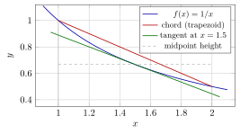
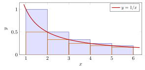
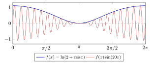
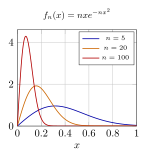
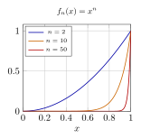

# 第 17 讲　积分的估计与极限交换 — (Estimating integrals; sums vs. integrals; limits vs. integrals)

对 $\int_0^1 e^{-x^2}\mathrm{d} x$、$\int_0^1(1+x^4)^{-1}\mathrm{d} x$ 等积分，原函数未必能用初等函数表示，即使能表示，也未必便于估计。本讲直接用积分的单调性、可加性和凸性建立界，并研究和式与积分的误差。最后讨论极限与积分的交换条件。

答案分三层，也是本讲的三节主线：

1.  **估计 (bound / estimate)**。从最粗的 $m(b-a)\le\int_a^bf\le M(b-a)$ 开始，一级一级 加细；凸性 (convexity) 会告诉我们*误差的符号*，这正是第 15 讲数值积分实验里那个 一直没有解释的现象。

2.  **互化 (converting)**。和与积分互相估计：$\sum_{k\le n}f(k)$ 与 $\int_1^nf$ 相差多少？ 这一节要还第 3 讲的账（$H_n=\ln n+\gamma+O(1/n)$），并第三次遇见 Stirling 公式。

3.  **交换 (interchanging)**。$\lim_n\int f_n$ 与 $\int\lim_n f_n$ 什么时候相等？ 本讲给出三个具体的、可以亲手算的反例，和一个充分条件。

每个例子先估计数量级，再与计算或证明得到的界比较。

## 1 Estimating an integral

一切估计的出发点是积分的单调性 (monotonicity of the integral)：若 $f\le g$，则 $\int_a^bf\le\int_a^bg$。把 $f$ 夹在两个常数之间，立刻得到

> [!NOTE] 命题 17.1 — 最粗的界 (The crudest bound)
>
>
> 设 $f$ 在 $[a,b]$ 上可积 (integrable)，$m\le f(x)\le M$，则
> $$
> m(b-a)\ \le\ \int_a^bf(x)\mathrm{d} x\ \le\ M(b-a).
> $$
>

这个界几乎不用力气，代价是通常很松。加细它的第一个办法也几乎不用力气：把区间切开， 在每一小段上分别用它。若 $f$ 单调 (monotone)，每一小段上的 $m$ 与 $M$ 就是两个端点值， 于是第 15 讲那张图重新出场。对单调函数，$n$ 等分的上下和之差恰好是
$$
U_n-L_n=\frac{\bigl|f(b)-f(a)\bigr|(b-a)}{n},
$$
因为所有的小矩形横向平移后叠成一个宽 $(b-a)/n$、高 $|f(b)-f(a)|$ 的矩形。这句话的用处是： 它*事先*告诉你要取多少段才能达到指定精度，不需要知道积分的值。

> [!WARNING] 先猜一猜 (Guess first) — $\int_0^1\frac{\mathrm{d} x}{1+x^4}$ 落在哪里
>
>
> 被积函数在 $[0,1]$ 上从 $1$ 单调降到 $\tfrac12$。先猜：这个积分在 $0.8$ 与 $0.9$ 之间的 什么位置？把你的猜测精确到两位小数写下来。再猜：要用多少个等分小区间，单调性给出的 上下界才能把它夹到宽度 $0.01$ 以内？
>

下面这个例子把"粗界—加细—代价"三件事一次做完。请注意：全过程没有用到任何原函数。

> [!NOTE] 词语提示
>
>
> *monotonicity*：单调性；*sanity check*：合理性检查；*convergence*：收敛；*quadrature*：数值积分；*strictly*：严格地；*bracket*：夹住目标的区间；*bounds*：上下界。
>

> [!NOTE] 词语提示
>
>
> *width*：宽度。
>

> [!NOTE] Example 17.2 — A ladder of bounds for $I=\int_0^1\dfrac{\mathrm{d} x}{1+x^4}$
>
>
> Write $f(x)=1/(1+x^4)$. It is strictly decreasing on $[0,1]$, with $f(0)=1$ and $f(1)=\tfrac12$.
>
> **Rung 0 (crudest).** $\tfrac12\le I\le 1$. Useless, but free.
>
> **Rung 1 (split into $n$ equal pieces).** Because $f$ is decreasing, the lower sum uses right endpoints and the upper sum uses left endpoints, and $U_n-L_n=\bigl(f(0)-f(1)\bigr)/n=1/(2n)$. Computed values:
>
> |  $n$ |          $L_n$ |          $U_n$ | $U_n-L_n$ |
> |-------:|-----------------:|-----------------:|------------:|
> |  $2$ | $0.7205882353$ | $0.9705882353$ |    $0.25$ |
> |  $4$ | $0.7992323342$ | $0.9242323342$ |   $0.125$ |
> |  $8$ | $0.8344188703$ | $0.8969188703$ |  $0.0625$ |
> | $16$ | $0.8510223394$ | $0.8822723394$ | $0.03125$ |
> | $50$ | $0.8619396527$ | $0.8719396527$ |    $0.01$ |
>
> So $n=50$ is what monotonicity alone needs for a bracket of width $0.01$, and it gives $0.8619\le I\le0.8720$. The convergence is only of order $1/n$: to gain one more decimal digit you must multiply $n$ by $10$. That is expensive, and it is the price of using *nothing but* monotonicity.
>
> **Sanity check.** A high-order quadrature gives $I=0.8669729873$ (ten digits), which sits inside every bracket above. We will keep using this number as the target; the point of the lecture is how close we can get *without* it.
>

表中 $(L_n+U_n)/2$ 在 $n=50$ 时与参考值之差约为 $3.3\times10^{-5}$，小于上下和给出的误差保证。下一节用凸性分别判断中点法与梯形法的误差符号；这两种方法不能与上下和的平均混同。

## 2 凸性决定误差的符号：Hermite–Hadamard (Convexity fixes the sign of the error)

第 15 讲给出了数值积分误差的例子。本节证明：对凸函数，中点法低估积分，梯形法高估积分。误差大小及其比值还需额外的光滑性条件。

> [!WARNING] 先猜一猜 (Guess first) — 误差在哪一侧
>
>
> 取 $\int_1^2\frac{\mathrm{d} x}{x}=\ln 2$。不查表、不计算：中点法 $M_n$ 与梯形法 $T_n$ 中，哪一个 比真值大？两个误差的绝对值之比大约是多少？先写下答案再往下读。
>

第 12 讲把凸函数 (convex function) 的两个特征做成了随手可用的工具：**弦在图上方** (the chord lies above the graph)，以及**图在任一条支撑线上方** (the graph lies above any supporting line)。把这两句话各积分一次，就是本节的定理。

> [!NOTE] 定理 17.3 — Hermite–Hadamard 不等式 (The Hermite–Hadamard inequality)
>
>
> 设 $f$ 在 $[a,b]$ 上凸 (convex)，$a<b$。则
> $$
> f\Bigl(\frac{a+b}2\Bigr)\ \le\ \frac1{b-a}\int_a^bf(x)\mathrm{d} x\ \le\ \frac{f(a)+f(b)}2 .
> $$
> 若 $f$ 在 $[a,b]$ 上凹 (concave)，两个不等号同时反向。
>

> [!NOTE] 证明
>
>
> 记 $c=\frac{a+b}2$。左边：由第 12 讲的支撑线 (supporting line) 命题，存在 $k$ 使得 $f(x)\ge f(c)+k(x-c)$ 对一切 $x\in[a,b]$ 成立。两边在 $[a,b]$ 上积分，注意 $\int_a^b(x-c)\mathrm{d} x=0$（区间关于 $c$ 对称），得 $\int_a^bf\ge f(c)(b-a)$。
>
> 右边：弦在图上方，即对 $x=(1-t)a+tb$（$t\in[0,1]$）有 $f(x)\le(1-t)f(a)+tf(b)$。作代换 $x=(1-t)a+tb$，$\mathrm{d} x=(b-a)\mathrm{d} t$，得
> $$
> \frac1{b-a}\int_a^bf(x)\mathrm{d} x=\int_0^1f\bigl((1-t)a+tb\bigr)\mathrm{d} t
>  \le\int_0^1\bigl[(1-t)f(a)+tf(b)\bigr]\mathrm{d} t=\frac{f(a)+f(b)}2 . \qquad\blacksquare
> $$
>

请把这个定理读成一句关于*误差符号*的话：中点法的那个矩形面积 $f(\frac{a+b}2)(b-a)$ 不超过积分，梯形面积 $\frac{f(a)+f(b)}2(b-a)$ 不小于积分。换言之，**凸函数使中点法 低估、梯形法高估**，而积分被夹在两者之间。这正是第 15 讲那个未解释的现象。

图中 $f(x)=1/x$ 在 $[1,2]$ 上凸。弦（红）整条位于曲线上方，所以梯形面积偏大；在中点 $x=1.5$ 处的切线（绿）整条位于曲线下方，而以它为顶的梯形面积恰好等于中点矩形的面积 （灰虚线的高度乘以宽度），所以中点法偏小。两条"偏"的方向都由凸性单独决定，与函数的 具体形状无关。

> [!NOTE] 词语提示
>
>
> *trapezoid*：梯形；*midpoint*：中点；*convex*：凸的；*ratio*：比值。
>

> [!NOTE] Example 17.4 — Midpoint below, trapezoid above –- and the ratio $1:2$
>
>
> Take $\int_1^2\frac{\mathrm{d} x}{x}=\ln 2=0.693147180560$. With $n$ equal subintervals let $M_n$ be the composite midpoint rule and $T_n$ the composite trapezoid rule. Since $1/x$ is convex, Hermite–Hadamard applied on each subinterval and added gives $M_n<\ln 2<T_n$ for every $n$. Computed:
>
> | $n$ | $M_n$ | $T_n$ | $\ln2-M_n$ | $T_n-\ln2$ | ratio |
> |---:|---:|---:|---:|---:|---:|
> | $1$ | $0.666666666667$ | $0.750000000000$ | $2.648\times10^{-2}$ | $5.685\times10^{-2}$ | $0.4658$ |
> | $2$ | $0.685714285714$ | $0.708333333333$ | $7.433\times10^{-3}$ | $1.519\times10^{-2}$ | $0.4895$ |
> | $4$ | $0.691219891220$ | $0.697023809524$ | $1.927\times10^{-3}$ | $3.877\times10^{-3}$ | $0.4972$ |
> | $8$ | $0.692660554043$ | $0.694121850372$ | $4.866\times10^{-4}$ | $9.747\times10^{-4}$ | $0.4993$ |
> | $16$ | $0.693025214331$ | $0.693391202208$ | $1.220\times10^{-4}$ | $2.440\times10^{-4}$ | $0.4998$ |
>
> Both signs are exactly as predicted, and the last column converges to $\tfrac12$: the midpoint error is half the trapezoid error and of the opposite sign. Therefore the combination that kills the leading error is $\frac{2M_n+T_n}{3}$, and indeed
> $$
> \frac{2M_1+T_1}{3}-\ln2=+1.297\times10^{-3},
> $$
> $$
> \frac{2M_4+T_4}{3}-\ln2=+7.350\times10^{-6},
> $$
> $$
> \frac{2M_8+T_8}{3}-\ln2=+4.723\times10^{-7}.
> $$
> That combination is Simpson’s rule from Lecture 15. So Simpson’s rule is not a separate idea: it is midpoint and trapezoid cancelling each other, and Hermite–Hadamard is the reason the two errors have opposite signs in the first place.
>

现在回到 $\int_0^1\frac{\mathrm{d} x}{1+x^4}$。它*不是*凸函数。这一点必须先查，不能想当然。

> [!NOTE] 词语提示
>
>
> *upper bound*：上界；*lower bound*：下界；*convexity*：凸性；*brackets*：夹住目标的区间；*predict*：预测；*concave*：凹的；*factor*：因子。
>

> [!NOTE] 词语提示
>
>
> *valid*：有效的。
>

> [!NOTE] Example 17.5 — Check convexity before using it
>
>
> For $f(x)=(1+x^4)^{-1}$ a direct computation gives
> $$
> f''(x)=\frac{4x^2\,(5x^4-3)}{(1+x^4)^3},
> $$
> so $f''<0$ on $(0,x_0)$ and $f''>0$ on $(x_0,1]$, where $x_0=(3/5)^{1/4}=0.8801117368$. The function is *concave* on most of $[0,1]$ and convex only on the last sliver.
>
> What happens if one forgets to check? Applying Hermite–Hadamard blindly on $[0,1]$ would predict $f(\tfrac12)\le I\le\frac{f(0)+f(1)}2$, i.e. $0.9411764706\le I\le0.75$ — which is not even a valid interval. The true value $I=0.8669729873$ violates both predicted inequalities, because on $[0,1]$ the function is mostly concave and the signs are reversed.
>
> **Done correctly.** Split at $x_0$. On $[0,x_0]$ the function is concave, so trapezoid $\le$ integral $\le$ midpoint; on $[x_0,1]$ it is convex, so midpoint $\le$ integral $\le$ trapezoid. Adding the two brackets:
>
> | pieces on $[0,x_0]$ | pieces on $[x_0,1]$ | lower bound | upper bound |
> |:--:|:--:|:--:|:--:|
> | $1$ | $1$ | $0.7824083978$ | $0.9157376173$ |
> | $2$ | $1$ | $0.8490132394$ | $0.8763074559$ |
> | $4$ | $1$ | $0.8626005795$ | $0.8692316565$ |
> | $8$ | $2$ | $0.8658866841$ | $0.8675316225$ |
>
> Five subintervals ($4+1$) already give $0.8626\le I\le0.8692$, a bracket of width $0.0066$. Compare rung 1 of the previous example: monotonicity alone needed $n=50$ subintervals for a worse bracket of width $0.01$. Convexity information is worth about a factor of ten here, and the bracket now shrinks like $1/n^2$ instead of $1/n$.
>

两个例子合起来是一条实用的纪律：**先查二阶导数的符号，再选估计工具**。使用凸性给出单侧估计时，必须满足相应的凸凹条件。

## 3 两个积分不等式：Jensen 与 Cauchy–Schwarz (Two integral inequalities)

第 12、13 讲的不等式都是关于*有限个数*的。把它们搬到积分上有两条路：一条是把离散 不等式对 Riemann 和使用，再取极限；另一条是把离散证明里的"求和"直接换成"积分"。 两条路都走得通，第二条更短。这里各给一个定理，都只到"陈述 + 一行证 + 一例"为止。 它们的完整威力要到以后的课程（Hölder、Minkowski、$L^p$ 空间）才显现。

> [!NOTE] 定理 17.6 — Jensen 不等式的积分形式 (Jensen's inequality, integral form)
>
>
> 设 $f$ 在 $[a,b]$ 上可积 (integrable) 且取值于区间 $[m,M]$，$\varphi$ 在 $[m,M]$ 上凸 (convex) 且 $\varphi\circ f$ 可积。则
> $$
> \varphi\Bigl(\frac1{b-a}\int_a^bf(x)\mathrm{d} x\Bigr)\ \le\ \frac1{b-a}\int_a^b\varphi\bigl(f(x)\bigr)\mathrm{d} x .
> $$
> $\varphi$ 凹 (concave) 时不等号反向。
>

> [!NOTE] 证明
>
>
> 记 $c=\frac1{b-a}\int_a^bf$，它落在 $[m,M]$ 内。取 $\varphi$ 在 $c$ 处的支撑线 (supporting line)： $\varphi(y)\ge\varphi(c)+k(y-c)$ 对一切 $y\in[m,M]$。令 $y=f(x)$ 并在 $[a,b]$ 上积分，右边的 线性项积分为 $k\bigl(\int_a^bf-c(b-a)\bigr)=0$，即得结论。
>

注意 Hermite–Hadamard 的左半边正是 $\varphi=f$、$f(x)=x$ 的特例：取恒等函数的平均值就是 中点。所以上一节的左不等式与本节的定理是同一条支撑线。

> [!NOTE] 词语提示
>
>
> *gap*：两项之差的绝对值。
>

> [!NOTE] Example 17.7 — Jensen in both directions
>
>
> **(a) $\varphi=\exp$ is convex.** With $f(x)=x^2$ on $[0,1]$, $\int_0^1x^2\mathrm{d} x=\tfrac13$, so
> $$
> e^{1/3}\le\int_0^1e^{x^2}\mathrm{d} x .
> $$
> Numerically $e^{1/3}=1.3956124251$ and $\int_0^1e^{x^2}\mathrm{d} x=1.4626517459$: the inequality holds with a gap of about $4.8\%$.
>
> **(b) $\varphi=\ln$ is concave.** With $f(x)=1+x$ on $[0,1]$, $\int_0^1(1+x)\mathrm{d} x=\tfrac32$, so
> $$
> \int_0^1\ln(1+x)\mathrm{d} x\le\ln\tfrac32 .
> $$
> Both sides are exactly computable: the left side is $2\ln2-1=0.3862943611$ and the right side is $\ln 1.5=0.4054651081$. Again true, with the expected direction.
>
> **What to remember.** Jensen converts a statement about an *average of values* into a statement about the *value at the average*. Whenever you see $\int e^{g}$, $\int\ln g$, $\int g^p$ and you only know $\int g$, Jensen is the first thing to try.
>

第二件工具在第 13 讲以离散形式出现过：Cauchy–Schwarz 不等式。它的积分形式的证明与 离散情形一字不差。把"$\sum$"读成"$\int$"即可。

> [!NOTE] 定理 17.8 — Cauchy–Schwarz 不等式的积分形式 (The Cauchy–Schwarz inequality, integral form)
>
>
> 设 $f,g$ 在 $[a,b]$ 上可积 (integrable)，则
> $$
> \Bigl(\int_a^bf(x)g(x)\mathrm{d} x\Bigr)^{2}\ \le\ \int_a^bf(x)^2\mathrm{d} x\cdot\int_a^bg(x)^2\mathrm{d} x .
> $$
>

> [!NOTE] 证明
>
>
> 对一切 $\lambda\in\mathbb{R}$ 有 $\int_a^b\bigl(\lambda f-g\bigr)^2\ge0$，即 $\lambda^2\int f^2-2\lambda\int fg+\int g^2\ge0$。若 $\int f^2>0$，这是一个恒非负的二次三项式 (quadratic)，其判别式 (discriminant) 必须 $\le0$，正是所要的不等式；若 $\int f^2=0$，则由 $\bigl|\int fg\bigr|\le\int\frac{f^2+g^2}{2}$ 的同样论证可知 $\int fg=0$，不等式平凡成立。
>

Cauchy–Schwarz 的用法有两种，方向相反：把一个难算的积分*拆*成两个好算的（得上界）， 或者把一个已知的乘积*合*起来（得下界）。下面的例子两种都做，并顺便回到第 1 节的积分。

> [!NOTE] 词语提示
>
>
> *estimate*：估计；*sharp*：不能改进的；最优的；*bound*：界；估计。
>

> [!NOTE] Example 17.9 — Two uses, and how lossy each one is
>
>
> **(a) Splitting for an upper bound.** Estimate $J=\int_0^1\sqrt{x}\,e^{-x}\mathrm{d} x$ without computing it. The obvious split $f=\sqrt x$, $g=e^{-x}$ gives
> $$
> J\le\Bigl(\int_0^1x\,\mathrm{d} x\Bigr)^{1/2}\Bigl(\int_0^1e^{-2x}\mathrm{d} x\Bigr)^{1/2}
>  =\bigl(0.5\bigr)^{1/2}\bigl(0.4323323584\bigr)^{1/2}=0.4649367475 .
> $$
> The true value is $J=0.3789446917$, so this bound overshoots by $22.7\%$. A smarter split $f=\sqrt x\,e^{-x/2}$, $g=e^{-x/2}$ gives $J\le(0.2642411177\cdot0.6321205588)^{1/2}=0.4086957829$, overshooting by only $7.9\%$. *Cauchy–Schwarz is sharp exactly when $f$ and $g$ are proportional*, so the closer your split makes them, the better the bound.
>
> **(b) Combining for a lower bound.** Let $h>0$ be integrable on $[a,b]$. Taking $f=\sqrt h$ and $g=1/\sqrt h$ makes $fg\equiv1$, so
> $$
> (b-a)^2\le\int_a^bh(x)\mathrm{d} x\cdot\int_a^b\frac{\mathrm{d} x}{h(x)} .
> $$
> Apply this to $h(x)=1+x^4$ on $[0,1]$: since $\int_0^1(1+x^4)\mathrm{d} x=1+\tfrac15=\tfrac65$ exactly,
> $$
> I=\int_0^1\frac{\mathrm{d} x}{1+x^4}\ \ge\ \frac{1}{6/5}=\frac56=0.8333\ldots
> $$
> A lower bound for $I$ obtained from a *polynomial* integral, with no quadrature at all. Compare: the true value is $0.8669729873$, and the crude bound of §1 only gave $I\ge0.5$.
>

\(b\) 是一个可用于后续计算的模式：当被积函数是一个倒数时，把它和它的倒数配成一对， Cauchy–Schwarz 就把问题换成了一个你会算的积分。第 13 讲的离散版本 $\bigl(\sum a_k\bigr)\bigl(\sum 1/a_k\bigr)\ge n^2$ 是同一句话。

## 4 和与积分互化 (Sums and integrals)

第 15 讲里我们把和变成积分（$\frac1n\sum f(k/n)\to\int_0^1f$），那是让 $n\to\infty$ 取极限。 本节要做的是*有限 $n$ 的双向估计*：一个和与一个积分究竟差多少？答案对单调函数 特别干净，而且只需要一张图。

> [!WARNING] 先猜一猜 (Guess first) — Estimating a large sum
>
>
> $H_n=1+\frac12+\cdots+\frac1n$。先猜：$H_{10^9}$ 是多少？给一个精确到小数点后一位的数。 （提示：第 3 讲说过 $H_n-\ln n\to\gamma$。）再猜：你的答案的误差有多大？
>

> [!NOTE] 命题 17.10 — 单调函数的和与积分 (Sums vs. integrals for a monotone function)
>
>
> 设 $f$ 在 $[1,n]$ 上单调 (monotone)，$n\ge2$ 为整数。则
> $$
> \min\bigl(f(1),f(n)\bigr)+\int_1^nf(x)\mathrm{d} x\ \le\ \sum_{k=1}^{n}f(k)
>  \ \le\ \max\bigl(f(1),f(n)\bigr)+\int_1^nf(x)\mathrm{d} x .
> $$
>

> [!NOTE] 证明
>
>
> 设 $f$ 递减 (decreasing)（递增情形同理，或对 $-f$ 用本结论）。在 $[k,k+1]$ 上 $f(k+1)\le f(x)\le f(k)$，积分得 $f(k+1)\le\int_k^{k+1}f\le f(k)$。对 $k=1,\dots,n-1$ 求和：
> $$
> \sum_{k=2}^{n}f(k)\ \le\ \int_1^nf\ \le\ \sum_{k=1}^{n-1}f(k).
> $$
> 左边加上 $f(1)$、右边加上 $f(n)$，即得所要的两个不等式。
>

图中红线是 $y=1/x$。高的（浅蓝）阶梯的面积是 $\sum_{k=1}^{5}\frac1k$，它盖住了曲线下的 面积 $\int_1^6\frac{\mathrm{d} x}{x}$；矮的（橙）阶梯的面积是 $\sum_{k=2}^{6}\frac1k$，被曲线盖住。 两条阶梯只差最左和最右的两小块，这就是上面命题的全部内容。

> [!NOTE] 词语提示
>
>
> *logarithm*：对数。
>

> [!NOTE] Example 17.11 — $H_n$, and $H_{10^9}$ by hand
>
>
> Apply the proposition to $f(x)=1/x$ on $[1,n]$: $\int_1^n\frac{\mathrm{d} x}{x}=\ln n$, $f(1)=1$, $f(n)=1/n$, so
> $$
> \ln n+\frac1n\ \le\ H_n\ \le\ \ln n+1 .
> $$
> This already pins $H_n$ to within $1$ for every $n$ — e.g. $H_{10^9}\in[20.7233,21.7233]$ — using no computation beyond a logarithm. Lecture 3 proved more: $H_n-\ln n$ decreases to a limit $\gamma$ with $0<H_n-\ln n-\gamma<1/n$. The next theorem sharpens *that* by another factor of $n$, and then
> $$
> H_{10^9}=\ln(10^9)+\gamma+\frac1{2\cdot10^9}+\theta,\qquad|\theta|\le1.25\times10^{-19},
> $$
> i.e. $H_{10^9}=21.3004815023$ — ten correct digits for a sum of a billion terms that we never performed. (Here $\ln(10^9)=20.7232658369$ and $\gamma=0.5772156649$.)
>

要把误差从 $O(1/n)$ 压到 $O(1/n^2)$，只需要把上面那个"阶梯与曲线"的比较*精确化*： 不估计每一块的面积差，而是把它写成一个积分。这就是 Euler–Maclaurin 公式的第一步， 也是本讲唯一需要的一步。

> [!NOTE] 定理 17.12 — Euler–Maclaurin 公式的一阶形式 (Euler–Maclaurin, first correction)
>
>
> 设 $f\in C^1[m,n]$，$m<n$ 为整数。记 $\{x\}$ 为 $x$ 的小数部分 (fractional part)， $\psi(x)=\{x\}-\tfrac12$。则
> $$
> \sum_{k=m}^{n}f(k)=\int_m^nf(x)\mathrm{d} x+\frac{f(m)+f(n)}2+\int_m^n\psi(x)f'(x)\mathrm{d} x,
> $$
> 且余项 (remainder) 满足 $\bigl|\int_m^n\psi f'\bigr|\le\tfrac12\int_m^n|f'|$；当 $f$ 单调时 右端等于 $\tfrac12|f(n)-f(m)|$。
>

> [!NOTE] 证明
>
>
> 在 $[k,k+1]$ 上对 $\int_k^{k+1}f(x)\cdot1\,\mathrm{d} x$ 分部积分 (integrate by parts)，取原函数 $x\mapsto x-k-\tfrac12$（它在该区间上恰为 $\psi(x)$）：
> $$
> \int_k^{k+1}f(x)\mathrm{d} x=\Bigl[f(x)\bigl(x-k-\tfrac12\bigr)\Bigr]_k^{k+1}-\int_k^{k+1}\psi(x)f'(x)\mathrm{d} x
>  =\frac{f(k)+f(k+1)}2-\int_k^{k+1}\psi(x)f'(x)\mathrm{d} x .
> $$
> 对 $k=m,\dots,n-1$ 求和，左端得 $\int_m^nf$，右端第一项得 $\sum_{k=m}^nf(k)-\frac{f(m)+f(n)}2$，移项即得公式。余项的估计来自 $|\psi|\le\tfrac12$。
>

这个公式把"和 $-$ 积分"的误差写成了一个具体的积分，误差不再是一个不透明的 $O(\cdot)$。 更好的是：$\psi$ 在每个整数区间上的积分为零，所以它的原函数是有界的，再分部积分一次 就又赚一阶。下面把这句话用在 $f(x)=1/x$ 上。

> [!NOTE] 定理 17.13 — $H_n$ 的二阶展开 (A second-order expansion of $H_n$)
>
>
> 存在常数 $\gamma$（即第 3 讲的 Euler 常数 (Euler’s constant)）使得
> $$
> H_n=\ln n+\gamma+\frac1{2n}+\theta_n,\qquad |\theta_n|\le\frac1{8n^2}\quad(n\ge1).
> $$
>

> [!NOTE] 证明
>
>
> 对 $f(x)=1/x$ 用上面的公式（$m=1$）：
> $$
> H_n=\ln n+\frac12\Bigl(1+\frac1n\Bigr)-\int_1^n\frac{\psi(x)}{x^2}\mathrm{d} x .
> $$
> 因为 $|\psi|\le\frac12$ 而 $\int_1^\infty\frac{\mathrm{d} x}{x^2}=1$ 有限，$\int_1^n\frac{\psi}{x^2}$ 当 $n\to\infty$ 时收敛（这一步用的是极限存在性，见下面的注）；记其极限为 $A$，并令 $\gamma:=\tfrac12-A$。于是
> $$
> H_n-\ln n-\gamma=\frac1{2n}+\int_n^{\infty}\frac{\psi(x)}{x^2}\mathrm{d} x=:\frac1{2n}+\theta_n .
> $$
> 再赚一阶：令 $\Psi(x)=\int_0^x\psi=\frac{\{x\}^2-\{x\}}2$。它连续、以 $1$ 为周期、 在整数处为零，且 $|\Psi|\le\frac18$。分部积分，
> $$
> \theta_n=\Bigl[\frac{\Psi(x)}{x^2}\Bigr]_n^{\infty}+2\int_n^{\infty}\frac{\Psi(x)}{x^3}\mathrm{d} x
>  =2\int_n^{\infty}\frac{\Psi(x)}{x^3}\mathrm{d} x,
> $$
> 因此 $|\theta_n|\le2\cdot\frac18\cdot\int_n^\infty x^{-3}\mathrm{d} x=\frac1{8n^2}$。
>

> [!NOTE] 注 17.14
>
>
> 证明里"$\int_1^n\psi(x)x^{-2}\mathrm{d} x$ 当 $n\to\infty$ 收敛"这一句，严格说是一个*无穷区间上的 积分*是否有意义的问题。正是第 18 讲的主题。这里只需要它最朴素的形式：数列 $u_n=\int_1^n\psi(x)x^{-2}\mathrm{d} x$ 不单调，但它是柯西列 (Cauchy sequence)，因为 $m<n$ 时
> $$
> |u_n-u_m|=\Bigl|\int_m^n\frac{\psi(x)}{x^2}\mathrm{d} x\Bigr|\le\frac12\int_m^n\frac{\mathrm{d} x}{x^2}
>  =\frac12\Bigl(\frac1m-\frac1n\Bigr)<\frac1{2m}\longrightarrow0 .
> $$
> 第 14 讲的柯西收敛准则 (Cauchy criterion) 给出极限存在。这是本讲唯一一处向第 18 讲 借的东西。
>

> [!NOTE] 词语提示
>
>
> *identity*：恒等式；*bounded*：有界的；*exact*：精确的。
>

> [!NOTE] Example 17.15 — Checking the $1/(2n)$ term numerically
>
>
> The theorem predicts that $n^2\bigl(H_n-\ln n-\gamma-\frac1{2n}\bigr)$ stays bounded by $1/8$. Computed (with $\gamma=0.57721566490151$, itself obtained from the identity $\gamma=\frac12-\int_1^\infty\psi(x)x^{-2}\mathrm{d} x$ of the proof):
>
> |    $n$ | $H_n-\ln n-\gamma-\frac1{2n}$ | $\times\,n^2$ |
> |---------:|--------------------------------:|----------------:|
> |    $5$ |      $-3.320244\times10^{-3}$ |  $-0.0830061$ |
> |   $10$ |      $-8.325039\times10^{-4}$ |  $-0.0832504$ |
> |   $50$ |      $-3.333200\times10^{-5}$ |  $-0.0833300$ |
> |  $100$ |      $-8.333250\times10^{-6}$ |  $-0.0833325$ |
> | $1000$ |      $-8.333331\times10^{-8}$ |  $-0.0833333$ |
>
> The scaled error is not merely bounded by $1/8=0.125$: it converges, to $-0.0833333\ldots=-\tfrac1{12}$. Our bound was correct but not sharp by a factor of $1.5$; the exact constant $-1/12$ comes out of the next correction term, which we are not computing here. Note also that the sign is negative: $H_n$ is slightly *below* $\ln n+\gamma+\frac1{2n}$, always.
>

同一台机器可以碾过任何单调函数。下面两个是最常用的。

> [!NOTE] 词语提示
>
>
> *endpoint*：端点。
>

> [!NOTE] Example 17.16 — The leading term of $\sum_{k\le n}k^p$
>
>
> Let $p>0$ and $S_n(p)=\sum_{k=1}^nk^p$. Since $x\mapsto x^p$ is increasing, the proposition gives $\int_1^nx^p\mathrm{d} x\le S_n(p)\le n^p+\int_1^nx^p\mathrm{d} x$, i.e.
> $$
> \frac{n^{p+1}-1}{p+1}\le S_n(p)\le n^p+\frac{n^{p+1}-1}{p+1},
> $$
> so $S_n(p)=\frac{n^{p+1}}{p+1}+O(n^p)$: **the leading term is $\frac{n^{p+1}}{p+1}$**, exactly the integral. Euler–Maclaurin refines the $O(n^p)$ to $\frac{n^p}{2}+O(n^{p-1})$. Numbers for $p=\tfrac12$:
>
> | $n$ | $S_n(\tfrac12)$ | $\tfrac23n^{3/2}$ | $S_n-\tfrac23n^{3/2}-\tfrac12\sqrt n$ |
> |---:|---:|---:|---:|
> | $10$ | $22.46827819$ | $21.08185107$ | $-0.19471171$ |
> | $100$ | $671.46294710$ | $666.66666667$ | $-0.20371956$ |
> | $1000$ | $21097.45588748$ | $21081.85106801$ | $-0.20656861$ |
> | $10000$ | $666716.45919711$ | $666666.66666667$ | $-0.20746956$ |
>
> The last column is settling down to about $-0.2079$: exactly as with $H_n$, subtracting the integral and the half-endpoint leaves a *constant*. (For $p=1$ this is visible with no analysis at all, since $S_n(1)=\frac{n^2}2+\frac n2$ exactly, and the constant is $0$; for $p=3$, $S_n(3)=\frac{n^4}4+\frac{n^3}2+\frac{n^2}4$, and again the pattern $\frac{n^{p+1}}{p+1}+\frac{n^p}2+\cdots$ is visible.)
>

最后一个应用是 Stirling 公式的第三次出现。第 13 讲用单调性证明了 $n!/\bigl((n/e)^n\sqrt n\bigr)$ 的极限存在，第 16 讲用 Wallis 公式算出那个极限是 $\sqrt{2\pi}$。现在我们用和与积分的比较，把*误差*也算出来。

> [!NOTE] 词语提示
>
>
> *logarithms*：对数。
>

> [!NOTE] Example 17.17 — $\ln n!$, crudely and then sharply (Stirling, third encounter)
>
>
> **Crude.** Apply the proposition to the increasing function $\ln x$ on $[1,n]$, using $\int_1^n\ln x\,\mathrm{d} x=n\ln n-n+1$ and $\ln1=0$:
> $$
> n\ln n-n+1\ \le\ \ln n!\ \le\ n\ln n-n+1+\ln n,
> $$
> i.e. $e\,(n/e)^n\le n!\le e\,n\,(n/e)^n$. For $n=10$ this reads $1.234098\times10^{6}\le3628800\le1.234098\times10^{7}$: correct, and the bracket is a factor of $n$ wide. Not good enough, but obtained in one line.
>
> **Sharp.** Euler–Maclaurin with $f=\ln x$ gives
> $$
> \ln n!=n\ln n-n+\tfrac12\ln n+C+\rho_n,\qquad
>  \rho_n=-\int_n^\infty\frac{\psi(x)}{x}\mathrm{d} x,
> $$
> and the same $\Psi$-trick as before bounds $|\rho_n|\le\frac1{8n}$. Lecture 16 identified $C=\ln\sqrt{2\pi}$, so
> $$
> n!=\sqrt{2\pi n}\Bigl(\frac ne\Bigr)^{n}e^{\rho_n},\qquad |\rho_n|\le\frac1{8n}.
> $$
> Check:
>
> |   $n$ |      $n!$ |   $\sqrt{2\pi n}(n/e)^n$ | relative error |
> |--------:|------------:|---------------------------:|---------------:|
> |   $5$ |     $120$ |             $118.019168$ |    $1.651\%$ |
> |  $10$ | $3628800$ |     $3.598696\times10^6$ |    $0.830\%$ |
> | $100$ |           — | $9.324848\times10^{157}$ |    $0.083\%$ |
>
> The relative error behaves like $1/(12n)$ — at $n=10$, $1/120=0.833\%$, matching the table to three digits — comfortably inside our bound $1/(8n)=1.25\%$. This is the whole content of Stirling’s formula: *a sum of logarithms differs from the corresponding integral by a half-endpoint, a universal constant, and nothing else that matters.*
>

> [!NOTE] 词语提示
>
>
> *precision*：计算精度；*at least*：至少；*stored*：存储的。
>

> [!NOTE] AI Lab — Sums against integrals
>
>
> **Part A.** Ask an AI to compute, with at least $30$ working digits, $H_n-\ln n-\gamma-\frac1{2n}$ for $n=10,20,40,\dots,1280$ and to print $n^2\times$ that quantity. Do *not* give it a stored value of $\gamma$; instead have it compute $\gamma$ from $\gamma=\frac12-\int_1^\infty(\{x\}-\frac12)x^{-2}\mathrm{d} x$ or from a high-precision library and state which it used. **Question:** the sequence converges; to what rational number, and how do you recognise it from $12$ digits?
>
> **Part B.** Now have it plot, on one picture, $\log_{10}$ of the three errors
> $$
> \Bigl|H_n-\ln n\Bigr|-\gamma,\qquad
>  \Bigl|H_n-\ln n-\gamma\Bigr|,\qquad
>  \Bigl|H_n-\ln n-\gamma-\tfrac1{2n}\Bigr|
> $$
> against $\log_{10}n$ for $n\le10^4$. **Question:** read the three slopes off the picture. What do they tell you about how much each extra term in the expansion is worth?
>

## 5 Cancellation from oscillation

到现在为止所有的估计都用到了被积函数的*大小*。但积分还有另一个来源的小： **正负抵消 (cancellation)**。一个不小的函数乘上一个快速振荡的因子，积分可以非常小， 而且小的程度与函数的大小几乎无关。只与"它变化得多快"有关。

> [!WARNING] 先猜一猜 (Guess first) — 一个五位数与一个零
>
>
> 先猜 $\displaystyle\int_0^{2\pi}\ln(2+\cos x)\sin(50x)\mathrm{d} x$ 的量级：是 $1$ 左右、$10^{-2}$ 左右， 还是 $10^{-5}$ 左右？再猜 $\displaystyle\int_{100\pi}^{200\pi}\frac{\sin x}{x}\mathrm{d} x$ 的量级。 两个猜测都写下来。
>

> [!NOTE] 词语提示
>
>
> *oscillation*：振荡；*integrand*：被积函数。
>

> [!NOTE] Example 17.18 — The oscillation ladder for $\displaystyle\int_a^b\frac{\sin x}{x}\mathrm{d} x$
>
>
> Take $a=100\pi$, $b=200\pi$. Three bounds, each using one more property of the integrand.
>
> 1.  **Size only:** $|\sin x/x|\le1$, so $|I|\le b-a=314.159265$. Hopeless.
>
> 2.  **First mean value theorem** (Lecture 16), with the positive weight $1/x$: $I=\sin\xi\int_a^b\frac{\mathrm{d} x}{x}$ for some $\xi$, so $|I|\le\ln(b/a)=\ln2=0.693147$. Better by a factor of $450$, because the weight, not $\sin$, is now doing the work.
>
> 3.  **Second mean value theorem** (Bonnet’s form, Lecture 16): $1/x$ is positive and decreasing, so $I=\frac1a\int_a^{\xi}\sin x\,\mathrm{d} x$ for some $\xi\in[a,b]$, and $\bigl|\int_a^{\xi}\sin\bigr|=|\cos a-\cos\xi|\le2$. Hence $|I|\le\frac2a=\frac2{100\pi}=0.00636620$.
>
> The true value is $I=1.591493\times10^{-3}$. So bound (3) is off by only a factor of $4$, while bound (1) is off by a factor of $2\times10^{5}$. The difference between (1) and (3) is entirely the difference between *using* and *not using* the sign changes of $\sin$.
>

第三个估计的机制可写成：$\int_a^{\xi}\sin x\mathrm{d} x$ 之所以被 $2$ 控制住，是因为 $\sin$ 的 原函数有界。振荡的积分*不累积*。这是本节所有结论的唯一来源。

> [!NOTE] 定理 17.19 — Riemann–Lebesgue 现象 (The Riemann–Lebesgue phenomenon)
>
>
> 设 $f$ 在 $[a,b]$ 上可积。若
>
> 1.  $f\in C^1[a,b]$，则 $\displaystyle\Bigl|\int_a^bf(x)\sin(nx)\mathrm{d} x\Bigr| \le\frac{|f(a)|+|f(b)|+\int_a^b|f'|}{n}$；
>
> 2.  $f$ 在 $[a,b]$ 上单调 (monotone)，则 $\displaystyle\Bigl|\int_a^bf(x)\sin(nx)\mathrm{d} x\Bigr| \le\frac{2\bigl(|f(a)|+|f(b)|\bigr)}{n}$。
>
> 两种情形下都有 $\int_a^bf(x)\sin(nx)\mathrm{d} x\to0$（$n\to\infty$），对 $\cos(nx)$ 同样成立。
>

> [!NOTE] 证明
>
>
> \(1\) 分部积分 (integration by parts)：
> $$
> \int_a^bf(x)\sin(nx)\mathrm{d} x=\Bigl[-\frac{f(x)\cos(nx)}{n}\Bigr]_a^b+\frac1n\int_a^bf'(x)\cos(nx)\mathrm{d} x,
> $$
> 两项分别被 $\frac{|f(a)|+|f(b)|}{n}$ 与 $\frac1n\int_a^b|f'|$ 控制。
>
> \(2\) 用第 16 讲的积分第二中值定理 (Second Mean Value Theorem for integrals)：$f$ 单调时存在 $\xi\in[a,b]$ 使
> $$
> \int_a^bf(x)\sin(nx)\mathrm{d} x=f(a)\int_a^{\xi}\sin(nx)\mathrm{d} x+f(b)\int_{\xi}^{b}\sin(nx)\mathrm{d} x .
> $$
> 而对任意 $u<v$ 有 $\bigl|\int_u^v\sin(nx)\mathrm{d} x\bigr|=\bigl|\frac{\cos(nu)-\cos(nv)}n\bigr|\le\frac2n$， 两项分别被 $\frac{2|f(a)|}n$ 与 $\frac{2|f(b)|}n$ 控制。
>

> [!NOTE] 注 17.20 — Oscillatory integrals
>
>
> 这里研究的积分与 Fourier 系数有关。本节的 $O(1/n)$ 估计来自一次分部积分；更快的衰减还需检查更高阶导数与边界项。
>

> [!NOTE] 词语提示
>
>
> *differentiable*：可导的；*geometric*：等比的；*verify*：核实；*decay*：衰减。
>

> [!NOTE] Example 17.21 — The guess, and a surprise
>
>
> **(a) The sine integral is exactly zero.** In $\displaystyle A_n=\int_0^{2\pi}\ln(2+\cos x)\sin(nx)\mathrm{d} x$ substitute $x\mapsto2\pi-x$: the weight $\ln(2+\cos x)$ is unchanged, while $\sin(n(2\pi-x))=-\sin(nx)$. Hence $A_n=-A_n$, so $A_n=0$ for *every* $n$ — not small, not $O(1/n)$, but exactly $0$. Numerically the quadrature returns $3.4\times10^{-16}$, $6.1\times10^{-17}$, $2.5\times10^{-16}$ for $n=1,5,50$: machine noise around zero, as it should be.
>
> *Moral: check symmetry before you estimate.* A symmetry can beat every inequality in this lecture.
>
> **(b) The cosine integral, and how fast it really decays.** Now let $B_n=\int_0^{2\pi}\ln(2+\cos x)\cos(nx)\mathrm{d} x$, which is not killed by symmetry. Computed:
>
> | $n$ |             $B_n$ | $B_n/B_{n-1}$ |
> |------:|--------------------:|----------------:|
> | $1$ | $+1.683574428954$ |               — |
> | $2$ | $-0.225556204318$ |   $-0.133975$ |
> | $3$ | $+0.040291735197$ |   $-0.178633$ |
> | $4$ | $-0.008097103431$ |   $-0.200962$ |
> | $5$ | $+0.001735689860$ |   $-0.214359$ |
> | $6$ | $-0.000387563914$ |   $-0.223291$ |
> | $7$ | $+0.000089012089$ |   $-0.229671$ |
> | $8$ | $-0.000020869378$ |   $-0.234456$ |
>
> The decay is *geometric*, not $1/n$: each step multiplies by roughly $-0.27$. In fact the computed values agree to twelve digits with
> $$
> B_n=-\frac{2\pi}{n}\bigl(-(2-\sqrt3)\bigr)^{n},\qquad 2-\sqrt3=0.2679491924 .
> $$
> (We verify this numerically here; proving it is a Fourier-series computation for a later course.) The theorem’s $1/n$ was correct but enormously pessimistic, because $\ln(2+\cos x)$ is infinitely differentiable: integrating by parts $k$ times gives $1/n^k$, and in this case one can go further still.
>

图中蓝线是 $f(x)=\ln(2+\cos x)$，红线是 $f(x)\sin(20x)$。红线在 $x$ 轴上下几乎等量地 摆动，相邻的正负两片面积几乎相消，只剩下 $f$ 在一个周期内的变化所造成的微小差额。 这就是"$f$ 变化得越慢、积分越小"的几何图像。

## 6 极限与积分可以交换吗 (Can limits and integrals be interchanged?)

最后一个问题。设 $f_n\to f$ 逐点收敛 (pointwise convergence)，即对每个固定的 $x$ 都有 $f_n(x)\to f(x)$。那么
$$
\lim_{n\to\infty}\int_a^bf_n \quad\overset{?}{=}\quad \int_a^b\lim_{n\to\infty}f_n
$$
成立吗？这个问题在实际中出现的频率远高于它在教科书里的分量：凡是"先近似、再积分"的 计算，都在默认这个交换是对的。

> [!WARNING] 先猜一猜 (Guess first) — Predict the limit of the integrals
>
>
> 令 $f_n(x)=n\,x\,e^{-nx^2}$，$x\in[0,1]$。先验证：对每个固定的 $x\in(0,1]$， $f_n(x)\to0$（指数压过多项式）。于是被积函数逐点趋于 $0$。先猜： $\displaystyle\lim_{n\to\infty}\int_0^1n\,x\,e^{-nx^2}\mathrm{d} x$ 等于多少？
>

> [!NOTE] 词语提示
>
>
> *antiderivative*：原函数；*interchange*：交换次序；*eventually*：从某一项起始终；*sufficient*：充分的；*necessary*：必要的；*pointwise*：逐点的；*maximum*：最大值。
>

> [!NOTE] 词语提示
>
>
> *uniform*：一致的；*spike*：尖峰；*bump*：局部凸起。
>

> [!NOTE] Example 17.22 — Three sequences, three lessons
>
>
> **(a) The moving bump.** $f_n(x)=nxe^{-nx^2}$ on $[0,1]$. Its antiderivative is elementary, so the integral is exact:
> $$
> \int_0^1nxe^{-nx^2}\mathrm{d} x=\Bigl[-\tfrac12e^{-nx^2}\Bigr]_0^1=\frac{1-e^{-n}}2 .
> $$
> Values: $0.316060279414$ ($n=1$), $0.496631026500$ ($n=5$), $0.499999998969$ ($n=20$), $0.500000000000$ ($n=100$, to twelve digits). So
> $$
> \lim_n\int_0^1f_n=\frac12,\qquad\text{but}\qquad\int_0^1\lim_nf_n=\int_0^10=0 .
> $$
> *Where did the area go?* Nowhere: it walked to the left. The maximum of $f_n$ sits at $x=1/\sqrt{2n}$ and has height $\sqrt{n/2}\,e^{-1/2}$:
>
> |   $n$ | peak position $1/\sqrt{2n}$ |  peak height |            $f_n(0.5)$ |
> |--------:|------------------------------:|-------------:|------------------------:|
> |   $5$ |                  $0.316228$ | $0.959009$ |  $7.163\times10^{-1}$ |
> |  $20$ |                  $0.158114$ | $1.918018$ |  $6.738\times10^{-2}$ |
> | $100$ |                  $0.070711$ | $4.288819$ | $6.944\times10^{-10}$ |
>
> Narrower and taller, with area $\approx\frac12$ always. Every fixed $x$ is eventually to the right of the bump and sees $0$ — but the bump never disappears.
>
> **(b) The rectangular spike.** $f_n=n\cdot\mathbf1_{(0,1/n)}$ on $[0,1]$: height $n$, width $1/n$. Then $\int_0^1f_n=1$ for every $n$, while $f_n(x)\to0$ for every $x\in[0,1]$ (given $x>0$, take $n>1/x$; and $f_n(0)=0$ always). So $\lim\int=1\ne0=\int\lim$. This is (a) with all the calculus removed: the same phenomenon, visible in one line.
>
> **(c) $x^n$ on $[0,1]$.** Here $\int_0^1x^n\mathrm{d} x=\frac1{n+1}\to0$, and the pointwise limit is $f(x)=0$ for $x<1$, $f(1)=1$, whose integral is $0$. **The interchange is valid** — $0=0$ — even though the convergence is badly non-uniform ($\sup_{[0,1]}|x^n-f(x)|=1$ for every $n$: take $x$ slightly below $1$). Lesson: non-uniform convergence does *not* automatically break the interchange. The sufficient condition below is sufficient, not necessary.
>

左图中峰值升高、宽度减小，积分趋于 $1/2$，但逐点极限为零。右图的 $x^n$ 也不一致收敛，其与极限函数之差的上确界始终为 $1$，积分与极限却仍可交换。下面给出一个充分条件。

> [!IMPORTANT] 定义 17.23 — 一致收敛 (Uniform convergence)
>
>
> 设 $f_n,f:[a,b]\to\mathbb{R}$。若
> $$
> \sup_{x\in[a,b]}\bigl|f_n(x)-f(x)\bigr|\longrightarrow0\qquad(n\to\infty),
> $$
> 即：对每个 $\varepsilon>0$ 存在 $N$，使得 $n>N$ 时对*一切* $x\in[a,b]$ 都有 $|f_n(x)-f(x)|<\varepsilon$， 则称 $f_n$ 在 $[a,b]$ 上一致收敛 (converges uniformly) 到 $f$。
>

请把它与逐点收敛对照着读：逐点收敛里 $N$ 可以依赖 $x$，一致收敛里 $N$ 必须对所有 $x$ 同时管用。与第 8 讲的连续 (continuity) 与一致连续 (uniform continuity) 之别完全平行。

> [!NOTE] 定理 17.24 — 一致收敛下可交换极限与积分 (Uniform convergence permits the interchange)
>
>
> 设 $f_n$ 在 $[a,b]$ 上可积 (integrable) 且一致收敛 (converges uniformly) 到 $f$。则 $f$ 可积， 且
> $$
> \lim_{n\to\infty}\int_a^bf_n(x)\mathrm{d} x=\int_a^bf(x)\mathrm{d} x .
> $$
>

> [!NOTE] 证明
>
>
> 记 $\varepsilon_n=\sup_{[a,b]}|f_n-f|\to0$。可积性：$f_n-\varepsilon_n\le f\le f_n+\varepsilon_n$，对同一个分割 (partition) 取上下和 (upper/lower sums)，$f$ 的上下和之差不超过 $f_n$ 的上下和之差加上 $2\varepsilon_n(b-a)$；先取 $n$ 使 $2\varepsilon_n(b-a)<\varepsilon/2$，再用 $f_n$ 可积取分割使其上下和之差 $<\varepsilon/2$，即得 $f$ 可积。结论：
> $$
> \Bigl|\int_a^bf_n-\int_a^bf\Bigr|\le\int_a^b|f_n-f|\le\varepsilon_n(b-a)\longrightarrow0. \qquad\blacksquare
> $$
>

> [!NOTE] 注 17.25
>
>
> 本节三个例子都不一致收敛，故不能直接应用上一定理；其中 $x^n$ 的积分仍趋于极限函数的积分。一致收敛因此是充分条件，不是必要条件。
>

不一致收敛并不意味着束手无策。当极限确实是 $0$ 时，常用的办法是**把区间拆开**： 一小块上用函数的界，剩下的一大块上用函数的小。下面是这个技巧的标准样板。

> [!NOTE] 词语提示
>
>
> *at most*：至多。
>

> [!NOTE] Example 17.26 — Splitting the interval: $\int_0^{\pi/2}\sin^n x\,\mathrm{d} x\to0$
>
>
> Here $\sin^nx\to0$ pointwise on $[0,\pi/2)$ but $\sin^n(\pi/2)=1$, and the convergence is not uniform. Fix $\varepsilon\in(0,\pi/2)$ and split:
> $$
> 0\le\int_0^{\pi/2}\sin^nx\,\mathrm{d} x=\int_0^{\pi/2-\varepsilon}+\int_{\pi/2-\varepsilon}^{\pi/2}
>  \le\frac\pi2\sin^n\Bigl(\frac\pi2-\varepsilon\Bigr)+\varepsilon .
> $$
> On the long piece the integrand is at most $\sin^n(\pi/2-\varepsilon)$ with $0<\sin(\pi/2-\varepsilon)<1$, so that term $\to0$; the short piece contributes at most its length $\varepsilon$. Given $\varepsilon$, choose $N$ so that the first term is $<\varepsilon$ for $n>N$; then the whole integral is $<2\varepsilon$. Computed values confirm it, and show the rate:
>
> | $n$ | $\int_0^{\pi/2}\sin^nx\,\mathrm{d} x$ | $\sqrt{\pi/(2n)}$ | ratio |
> |---:|---:|---:|---:|
> | $10$ | $0.3865631585$ | $0.3963327298$ | $0.975350$ |
> | $50$ | $0.1763614288$ | $0.1772453851$ | $0.995013$ |
> | $100$ | $0.1250184817$ | $0.1253314137$ | $0.997503$ |
> | $1000$ | $0.0396233659$ | $0.0396332730$ | $0.999750$ |
>
> The decay is like $\sqrt{\pi/(2n)}$ — slow. (That constant is Wallis’ formula from Lecture 16 showing up again.)
>
> **A warning about a tempting wrong proof.** One is tempted to write, by the first mean value theorem, $\int_0^{\pi/2}\sin^nx\,\mathrm{d} x=\frac\pi2\sin^n\xi$ with $0<\xi<\frac\pi2$, hence $\sin\xi<1$, hence the limit is $0$. This is *wrong*: the point $\xi$ produced by the theorem depends on $n$, so what one really has is $\frac\pi2\sin^n\xi_n$ with $\xi_n\to\pi/2$, and $\sin^n\xi_n$ is an indeterminate form of type $1^\infty$. A quantity $a_n$ with $0<a_n<1$ for every $n$ need not tend to $0$.
>

> [!NOTE] 词语提示
>
>
> *monotone*：单调的；*justify*：给出理由。
>

> [!NOTE] AI Lab — The moving bump, and a decay rate to read off a graph
>
>
> **Part A.** Ask an AI to plot $f_n(x)=nxe^{-nx^2}$ on $[0,1]$ for $n=5,20,100$ in one figure, and to shade the area under each curve. Then have it print $\int_0^1f_n$ for $n=1,2,5,10,20,50,100$. **Question:** the three curves look completely different, yet three of the printed numbers agree to six decimals. Explain what the plot is hiding, and say exactly for which $n$ the integral first agrees with its limit to six decimals.
>
> **Part B.** Ask an AI to compute $c_n=\int_0^1\frac{\sin(nx)}{1+x}\mathrm{d} x$ for $n=1,2,\dots,200$ (numerically, with enough quadrature points that the answer is stable to $10^{-10}$ — make it justify the choice), and to plot both $c_n$ and $n\,c_n$ against $n$. **Questions:** (i) Is $c_n$ eventually monotone? (ii) Does $n\,c_n$ converge, or just stay bounded? (iii) The theorem of §5 predicts $|c_n|\le C/n$; from your plot, what is the smallest $C$ that works for $n\le200$, and how does it compare with the constant $|f(0)|+|f(1)|+\int_0^1|f'|$ coming from the proof, where $f(x)=1/(1+x)$?
>

## 7 Exercises

星号表示难度：$\bigstar$ 基本、$\bigstar$$\bigstar$ 需要一个想法、$\bigstar$$\bigstar$$\bigstar$ 有挑战。标记 **(homework)** 的三题请书面提交。每一题都请*先猜后算*：把你的猜测写在解答的第一行。

> [!NOTE] 词语提示
>
>
> *oscillatory*：振荡的；*continuous*：连续的；*hypothesis*：假设；*magnitude*：数量级；*remaining*：剩余的；*uniformly*：一致地；*periodic*：周期的。
>

> [!NOTE] 词语提示
>
>
> *finite*：有限的；*tail*：从某项开始的尾段。
>

1. **17.1**  ($\bigstar$, **homework**) *Guess, bracket, then use convexity.* Let $I=\int_0^1\frac{\mathrm{d} x}{\sqrt{1+x^3}}$. (a) Guess $I$ to two decimals. (b) Using monotonicity alone, find the smallest $n$ for which the $n$-piece staircase bracket has width $<0.01$, and compute that bracket. (c) Show that the integrand has exactly one inflection point in $[0,1]$, at $x_0=(4/5)^{1/3}$, and use Hermite–Hadamard on the two pieces (subdividing as needed) to get a bracket of width $<0.01$ with at most $6$ subintervals. Compare the work in (b) and (c).

1. **17.2**  ($\bigstar$) *Which side?* For each of $\int_0^{\pi/2}\sin x\,\mathrm{d} x$, $\int_0^1e^{-x^2}\mathrm{d} x$, $\int_1^2\ln x\,\mathrm{d} x$, decide *by eye* whether the composite midpoint rule over- or under-estimates, before computing anything. Then compute $M_4$ and $T_4$ for each and check. For which of the three does the answer depend on the interval?

1. **17.3**  ($\bigstar$$\bigstar$) *A free inequality.* Let $f>0$ be continuous on $[0,1]$ with $\int_0^1f=1$. Prove $\int_0^1\frac{\mathrm{d} x}{f(x)}\ge1$, and determine when equality holds. Test with $f(x)=\tfrac12+x$: predict whether $\int_0^1\frac{\mathrm{d} x}{f}$ is closer to $1$ or to $1.5$, then compute it exactly.

1. **17.4**  ($\bigstar$$\bigstar$) *Jensen, chosen well.* Let $f$ be continuous and positive on $[0,1]$. Prove $\exp\bigl(\int_0^1\ln f\bigr)\le\int_0^1f$, and check it numerically for $f(x)=1+x$ and for $f(x)=e^{x^2}$. Which of the two gaps is larger, and why should you have been able to predict that from the graphs?

1. **17.5**  ($\bigstar$$\bigstar$, **homework**) *Estimating an oscillatory integral.* Guess the order of magnitude of $\int_{10}^{20}\sin(x^2)\mathrm{d} x$ before doing anything. Then substitute $t=x^2$ and apply the second mean value theorem to get an explicit bound. Finally compute the integral numerically and report the ratio (bound)/(true value).

1. **17.6**  ($\bigstar$$\bigstar$) *How fast does $H_{2n}-H_n$ approach $\ln2$?* Predict the sign and the size of $H_{2n}-H_n-\ln2$ for $n=1000$ *before* computing, using the expansion of §4. Then compute it for $n=10,100,1000$ and compare with your prediction.

1. **17.7**  ($\bigstar$$\bigstar$) *A second Euler-type constant.* Show from the proposition of §4 that $\sum_{k=1}^n\frac1{\sqrt k}-2\sqrt n$ is bounded, then compute it for $n=10^2,10^4,10^6$ and read off the limiting constant to four decimals. Use Euler–Maclaurin to predict the size of the remaining error at $n=10^6$ and check that your reading is that accurate.

1. **17.8**  ($\bigstar$$\bigstar$) *Tuning a bump.* For $\alpha>0$ set $f_n(x)=n^{\alpha}xe^{-nx^2}$ on $[0,1]$. Guess, for each of $\alpha=\tfrac12,1,2$, whether $\int_0^1f_n$ tends to $0$, to a positive finite number, or to $+\infty$. Then compute $\int_0^1f_n$ in closed form and decide for all $\alpha>0$. For which $\alpha$ does $f_n$ converge uniformly to $0$?

1. **17.9**  ($\bigstar$$\bigstar$, **homework**) *Make the area anything you like.* Construct an explicit sequence $f_n$ of continuous functions on $[0,1]$ with $f_n(x)\to0$ for every $x$ and $\int_0^1f_n\to7$. Then modify it so that $\int_0^1f_n$ does not converge at all. Draw $f_1,f_2,f_3$ for your first construction.

1. **17.10** ($\bigstar$$\bigstar$) *When the interchange survives.* For $f_n(x)=x^n$ on $[0,1]$ the interchange is valid although the convergence is not uniform. Find a sequence $g_n$ on $[0,1]$, uniformly bounded by $1$, converging pointwise to $0$, for which the interchange *fails*. If you cannot, explain what goes wrong — and formulate a guess at the extra hypothesis that rescues the situation.

1. **17.11** ($\bigstar$$\bigstar$$\bigstar$) *Oscillation with a general period.* Let $g$ be $2\pi$-periodic and integrable with mean $\mu=\frac1{2\pi}\int_0^{2\pi}g$, and let $f\in C^1[a,b]$. Guess the value of $\lim_{n\to\infty}\int_a^bf(x)g(nx)\mathrm{d} x$, then prove it by writing $g=\mu+(g-\mu)$ and using §5 on the second piece. Test numerically with $g=|\sin|$, $f(x)=e^x$, $[a,b]=[0,1]$: compute the integral for $n=10,50,200$ and compare with your predicted limit $\frac2\pi(e-1)$.

1. **17.12** ($\bigstar$$\bigstar$$\bigstar$) *The tail of a power weight.* Guess, for continuous $f$ on $[0,1]$, the size of $\int_0^1x^nf(x)\mathrm{d} x$ for large $n$ — is it like $1/n$, like $1/n^2$, or like $f(1)/n$? Test with $f=e^x$ by computing the integral for $n=5,10,20,50,100$ and tabulating $n\int_0^1x^ne^x\mathrm{d} x$. Then prove your guess by splitting the interval at $1-\delta$.

> [!NOTE] 回望 (Looking back)
>
>
> 凸性给出中点法与梯形法的误差符号；和与积分的比较给出渐近估计。一致收敛保证有限区间上积分与极限的交换，但不是必要条件。下一讲研究无限区间及无界端点处的反常积分。
>
