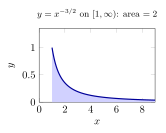
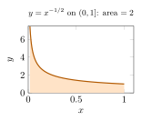
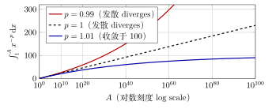
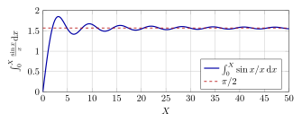
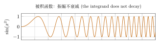
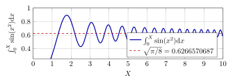
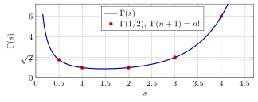

# 第 18 讲　反常积分：敛散性的判别 — (Improper integrals: convergence tests)

第 17 讲主要研究有限区间上有界函数的积分。本讲讨论无限区间，以及被积函数在端点附近无界的情形：先截取可积区间，再考察截断积分的极限。

敛散性将由 Cauchy 准则 (Cauchy criterion)、比较判别法 (comparison tests) 和振荡积分估计来判断。三角函数均使用弧度 (radians)；局部可积 (locally integrable) 指在定义区间的每个闭子区间上 Riemann 可积。

## 1 把积分定义成极限 (The integral as a limit)

反常积分 (improper integral) 的两种情形都通过极限定义：先避开无穷远或无界端点，计算截断积分，再检查相应极限是否存在且有限。

> [!WARNING] 先猜一猜 (Guess first)
>
>
> 先猜：$\displaystyle\int_1^\infty\frac{\mathrm{d}x}{x^{1.01}}$ 收敛吗？如果收敛，它大约是多少。个位数？几十？几百？再猜：如果只积到 $x=10^6$，你已经拿到了全部面积的百分之几？
>

> [!IMPORTANT] 定义 18.1 — 无穷限反常积分 (Improper integral over an infinite interval)
>
>
> 设 $f$ 在 $[a,+\infty)$ 上局部可积 (locally integrable)，即对每个 $A>a$，$f$ 在 $[a,A]$ 上 Riemann 可积。若极限 (limit)
> $$
> \lim_{A\to+\infty}\int_a^A f(x)\,\mathrm{d}x
> $$
> 存在且有限 (finite)，就称反常积分 (improper integral) $\int_a^{+\infty}f(x)\,\mathrm{d}x$ **收敛 (converges)**，并以该极限为它的值；否则称它 **发散 (diverges)**。
>

> [!IMPORTANT] 定义 18.2 — 瑕积分 (Improper integral with an unbounded integrand)
>
>
> 设 $f$ 在 $(a,b]$ 的每个闭子区间 $[a+\eta,b]$（$0<\eta<b-a$）上可积，而 $f$ 在 $a$ 的右邻域内无界。称 $a$ 为瑕点 (singular point)。若极限
> $$
> \lim_{\eta\to0^+}\int_{a+\eta}^{b}f(x)\,\mathrm{d}x
> $$
> 存在且有限，就称瑕积分 $\int_a^b f(x)\,\mathrm{d}x$ 收敛，否则发散。瑕点在右端或在区间内部时，把区间拆成每段只含一个瑕点（且瑕点在端点）的若干段，逐段要求收敛。
>

定义要求截断参数以任意方式趋于相应端点时，都得到同一个有限极限。讨论内部瑕点时，两侧极限必须分别存在；末节将与主值比较。

> [!NOTE] 词语提示
>
>
> *blow up*：无限增大。
>

> [!NOTE] Example 18.3 — The watershed at $p=1$, both kinds
>
>
> Fix $p>0$. On $[1,\infty)$, for $A>1$,
> $$
> \int_1^A x^{-p}\,\mathrm{d}x=
>  \begin{cases}
>  \dfrac{1-A^{1-p}}{p-1}, & p\neq1,\\[6pt]
>  \ln A, & p=1.
>  \end{cases}
> $$
> As $A\to\infty$ this tends to $1/(p-1)$ when $p>1$, and to $+\infty$ when $p\le1$. So
> $$
> \int_1^{\infty}\frac{\mathrm{d}x}{x^{p}}\ \text{converges}\iff p>1,\qquad \text{value } \frac1{p-1}.
> $$
> On $(0,1]$ the singular point is $0$, and for $0<\eta<1$,
> $$
> \int_\eta^1 x^{-p}\,\mathrm{d}x=\frac{1-\eta^{1-p}}{1-p}\ (p\neq1),\qquad \int_\eta^1\frac{\mathrm{d}x}{x}=\ln\frac1\eta .
> $$
> Now the exponent $1-p$ is positive exactly when $p<1$, so
> $$
> \int_0^{1}\frac{\mathrm{d}x}{x^{p}}\ \text{converges}\iff p<1,\qquad \text{value } \frac1{1-p}.
> $$
> The same number $p=1$ separates the two cases, but the inequality is reversed. A cheap way to remember it: near $\infty$ you want the function to be *small*, so you want $p$ large; near $0$ you want it to blow up *slowly*, so you want $p$ small. And $1/x$ fails on both sides — it is the one exponent that is too big at one end and too small at the other.
>

下面这张图把"面积有限而区域无界"这件事放在同一页上。左边的区域向右伸到无穷，右边的区域向上伸到无穷，两块的面积却都恰好等于 $2$。

两块阴影区域都无界，但面积均为 $2$。区域无界并不排除面积有限。

> [!NOTE] 词语提示
>
>
> *convergence*：收敛；*finite*：有限的；*exact*：精确的。
>

> [!NOTE] Example 18.4 — How reluctant is $p=1.01$?
>
>
> Take $p=1.01$. Then $\int_1^{\infty}x^{-1.01}\mathrm{d}x=1/0.01=100$, and for finite $A$,
> $$
> \int_1^A x^{-1.01}\,\mathrm{d}x=100\bigl(1-A^{-0.01}\bigr).
> $$
> The following values are exact to the digits shown.
>
> | $A$ | $10$ | $10^{2}$ | $10^{6}$ | $10^{10}$ | $10^{100}$ |
> |:---|---:|---:|---:|---:|---:|
> | $\int_1^A x^{-1.01}\mathrm{d}x$ | $2.2763$ | $4.5007$ | $12.9036$ | $20.5672$ | $90.0000$ |
> | % of the total $100$ | $2.28$ | $4.50$ | $12.90$ | $20.57$ | $90.00$ |
>
> Half the area sits beyond the $A$ with $100(1-A^{-0.01})=50$, i.e. $A=2^{100}\approx1.2677\times10^{30}$. So the integral converges, and any computer integrating to $A=10^{10}$ reports having collected about one fifth of it. *Convergence is a statement about the limit, not about any finite computation.*
>

这些数值提示了接近临界指数时的缓慢变化。下面比较 $p=0.99,1,1.01$ 的截断积分，敛散结论仍由公式与估计判断。

在 $A=10^6$ 时，三条曲线的值分别约为 $14.8154$、$13.8155$、$12.9036$。这样一张有限表格不足以区分敛散性，仍须分析任意大的 $A$。

> [!NOTE] 词语提示
>
>
> *quadrature*：数值积分；*bounded*：有界的；*tail*：从某项开始的尾段。
>

> [!NOTE] Example 18.5 — The Gaussian integral converges, fast
>
>
> Consider $\int_0^{\infty}e^{-x^{2}}\mathrm{d}x$. For $x\ge1$ we have $x^{2}\ge x$, hence $e^{-x^{2}}\le e^{-x}$, and
> $$
> \int_1^{A}e^{-x^{2}}\mathrm{d}x\le\int_1^{A}e^{-x}\mathrm{d}x=e^{-1}-e^{-A}<e^{-1}.
> $$
> The truncated integrals increase with $A$ and are bounded, so the limit exists. Numerically (Gauss–Legendre quadrature, checked by doubling the number of panels until successive values agree to $10^{-15}$):
>
> | $X$ | $1$ | $2$ | $3$ | $4$ | $5$ |
> |:---|---:|---:|---:|---:|---:|
> | $\int_0^X e^{-x^2}\mathrm{d}x$ | $0.746824$ | $0.882081$ | $0.886207$ | $0.8862269118$ | $0.8862269255$ |
>
> Compare with $p=1.01$: here $X=5$ already gives $10$ correct digits, because the tail is controlled by $e^{-x}$, not by a power. The exact value is $\int_0^{\infty}e^{-x^{2}}\mathrm{d}x=\frac{\sqrt\pi}{2}=0.8862269255\ldots$, which we only *state* — nothing in a one-variable course computes it, and the complex-analysis station of this three-year plan will. What this lecture supplies is the part that is genuinely ours: the proof that the number exists.
>

上面两个例子已经把本讲的分工说清楚了：*存在性*是分析的问题，我们做；*值*常常是另一门课的问题。下面把"存在性"这件事变成可操作的判别法。

## 2 The Cauchy criterion

Cauchy 条件不指定极限值，而要求充分靠后的任意两个截断积分之差都小。由实数完备性，这足以保证截断积分收敛。

> [!NOTE] 定理 18.6 — 反常积分的 Cauchy 准则 (Cauchy criterion for improper integrals)
>
>
> 设 $f$ 在 $[a,+\infty)$ 上局部可积 (locally integrable)。则 $\int_a^{+\infty}f$ 收敛 (converges) 的充分必要条件是：对每个 $\varepsilon>0$，存在 $A_0\ge a$，使得
> $$
> \text{只要 } A'>A\ge A_0,\qquad \left|\int_A^{A'}f(x)\,\mathrm{d}x\right|<\varepsilon .
> $$
> 瑕积分有完全平行的陈述：$\int_a^bf$（$a$ 为瑕点 singular point）收敛的充要条件是，对每个 $\varepsilon>0$ 存在 $\delta>0$，使得 $a<\eta'<\eta<a+\delta$ 时 $\bigl|\int_{\eta'}^{\eta}f\bigr|<\varepsilon$。
>

> [!NOTE] 证明
>
>
> 记 $F(A)=\int_a^Af$。由可加性 $\int_A^{A'}f=F(A')-F(A)$，所以待证的是：$F$ 在 $+\infty$ 处有有限极限 if and only if $F$ 满足上述 Cauchy 条件。
>
> 必要性：若 $F(A)\to L$，取 $A_0$ 使 $A\ge A_0$ 时 $|F(A)-L|<\varepsilon/2$，则 $A',A\ge A_0$ 时 $|F(A')-F(A)|<\varepsilon$。
>
> 充分性：任取一列 $A_n\to+\infty$。给定 $\varepsilon>0$ 取上述 $A_0$；存在 $N$ 使 $n\ge N$ 时 $A_n\ge A_0$，于是 $m,n\ge N$ 时 $|F(A_m)-F(A_n)|<\varepsilon$。故 $(F(A_n))$ 是柯西列 (Cauchy sequence)，由第 14 讲的完备性 (completeness of $\mathbb{R}$) 收敛，记极限为 $L$。再对任意 $A\ge A_0$ 取 $n$ 充分大使 $A_n\ge A_0$ 且 $|F(A_n)-L|<\varepsilon$，得
> $$
> |F(A)-L|\le|F(A)-F(A_n)|+|F(A_n)-L|<2\varepsilon ;
> $$
> $\varepsilon$ 任意，故 $\lim_{A\to+\infty}F(A)=L$（这同时说明 $L$ 与数列的选择无关）。瑕积分的情形把 $A\to+\infty$ 换成 $\eta\to0^+$，逐字相同。
>

这条准则的实际用法是：*把尾巴 (the tail of the integral) 的大小直接 bound 住*。

> [!NOTE] 词语提示
>
>
> *factor*：因子；*bound*：界；估计；*grid*：网格。
>

> [!NOTE] Example 18.7 — Bounding a tail without knowing the integral
>
>
> For $0<A<A'$, integrate by parts:
> $$
> \int_A^{A'}\frac{\sin x}{x}\,\mathrm{d}x=\left[\frac{-\cos x}{x}\right]_A^{A'}-\int_A^{A'}\frac{\cos x}{x^{2}}\,\mathrm{d}x,
> $$
> so
> $$
> \left|\int_A^{A'}\frac{\sin x}{x}\,\mathrm{d}x\right|\le\frac1{A'}+\frac1A+\int_A^{A'}\frac{\mathrm{d}x}{x^{2}}\le\frac{1}{A'}+\frac1A+\frac1A-\frac1{A'}=\frac2A .
> $$
> The bound $2/A$ does not mention $A'$ at all — which is exactly what the Cauchy criterion asks for. Numerically, maximising $\bigl|\int_A^{A'}\sin x/x\,\mathrm{d}x\bigr|$ over $A'\in(A,A+10]$ on a grid of step $0.05$:
>
> | $A$ | $\max_{A'}\bigl|\int_A^{A'}\frac{\sin x}{x}\mathrm{d}x\bigr|$ | bound $2/A$ |
> |---:|---:|---:|
> | $10$ | $0.16617570$ | $0.200000$ |
> | $20$ | $0.06784204$ | $0.100000$ |
> | $50$ | $0.03788982$ | $0.040000$ |
> | $100$ | $0.01821237$ | $0.020000$ |
>
> The bound is within a factor $1.5$ of the truth, and both go to $0$. Hence $\int_0^{\infty}\sin x/x\,\mathrm{d}x$ converges — and we have not produced one digit of its value.
>

这个论证只用了分部积分 (integration by parts) 和一个 crude 的不等式，而且*没有*用到 $\sin x/x\to0$。我们很快会看到那个条件既不充分也不必要。

> [!NOTE] 注 18.8 — 收敛不蕴含被积函数趋于 $0$ (Convergence does not force $f\to0$)
>
>
> 积分收敛不要求被积函数趋于零：尖峰的高度可以不减，只要其宽度足够小，面积仍可能有限。第 5 节将给出连续且无界的例子。
>

## 3 非负被积函数：比较判别法 (Comparison tests for non-negative integrands)

被积函数非负时，$F(A)=\int_a^Af$ 是 $A$ 的单调不减 (non-decreasing) 函数。于是"收敛"退化成"有界"。这是第 3 讲的单调有界定理 (Monotone Convergence Theorem) 在积分上的直接翻版，也是为什么非负情形比一般情形简单得多。

> [!NOTE] 命题 18.9 — 非负情形的有界判据 (Boundedness criterion)
>
>
> 设 $f\ge0$ 在 $[a,+\infty)$ 上局部可积。则 $\int_a^{+\infty}f$ 收敛 if and only if 存在常数 $L$ 使得对一切 $A>a$ 有 $\int_a^Af\le L$。此时积分的值等于 $\sup_{A>a}\int_a^Af$。
>

> [!NOTE] 证明
>
>
> $F(A)=\int_a^Af$ 单调不减（$A<A'$ 时 $F(A')-F(A)=\int_A^{A'}f\ge0$）。单调不减且有上界的函数在 $+\infty$ 处有有限极限，且极限等于上确界 (supremum)：给定 $\varepsilon>0$，由上确界的定义存在 $A_1$ 使 $F(A_1)>S-\varepsilon$，其中 $S=\sup_AF(A)$；于是 $A\ge A_1$ 时 $S-\varepsilon<F(A)\le S$。反之极限存在则 $F$ 有界。
>

> [!NOTE] 定理 18.10 — 比较判别法 (Comparison test)
>
>
> 设在 $[a,+\infty)$ 上 $0\le f(x)\le g(x)$，两者都局部可积。则
>
> 1.  $\int_a^{+\infty}g$ 收敛 $\Longrightarrow$ $\int_a^{+\infty}f$ 收敛；
>
> 2.  $\int_a^{+\infty}f$ 发散 $\Longrightarrow$ $\int_a^{+\infty}g$ 发散。
>
> 只要不等式对*充分大的* $x$ 成立，结论不变（改变有限区间上的被积函数不影响敛散性）。瑕积分有平行陈述。
>

> [!NOTE] 证明
>
>
> $\int_a^Af\le\int_a^Ag\le\int_a^{+\infty}g$，对一切 $A$ 成立，由命题 [18.9](#l18-prop:bdd) 得 (1)。(2) 是 (1) 的逆否命题 (contrapositive)。
>

> [!NOTE] 定理 18.11 — 极限形式 (Limit comparison test)
>
>
> 设 $f,g\ge0$ 在 $[a,+\infty)$ 上局部可积，$g>0$，且
> $$
> \lim_{x\to+\infty}\frac{f(x)}{g(x)}=c .
> $$
>
> 1.  若 $0<c<+\infty$，则 $\int_a^{+\infty}f$ 与 $\int_a^{+\infty}g$ 同时收敛或同时发散。
>
> 2.  若 $c=0$ 且 $\int^{+\infty}g$ 收敛，则 $\int^{+\infty}f$ 收敛。
>
> 3.  若 $c=+\infty$ 且 $\int^{+\infty}g$ 发散，则 $\int^{+\infty}f$ 发散。
>

> [!NOTE] 证明
>
>
> 情形 (1)：取 $\varepsilon=c/2$，存在 $X$ 使 $x\ge X$ 时 $c/2<f(x)/g(x)<3c/2$，即
> $$
> \tfrac{c}2\,g(x)<f(x)<\tfrac{3c}2\,g(x)\qquad(x\ge X).
> $$
> 两个不等式各配一次定理 [18.10](#l18-thm:comp)。情形 (2)：存在 $X$ 使 $x\ge X$ 时 $f(x)\le g(x)$。情形 (3)：存在 $X$ 使 $x\ge X$ 时 $f(x)\ge g(x)$。
>

实际操作时，比较对象永远先试 $g(x)=x^{-p}$：决定 $p$ 的办法是问"$f(x)$ 在 $x\to\infty$ 时是 $1/x$ 的几阶无穷小 (order of smallness)"。这正是第 6 讲练过的技术。瑕点处的对应问法是"$f(x)$ 在 $x\to a^+$ 时是 $1/(x-a)$ 的几阶无穷大"。

> [!WARNING] 先猜一猜 (Guess first)
>
>
> Before computing: which of these converge?
> $$
> \text{(a) }\int_1^{\infty}\frac{\mathrm{d}x}{\sqrt{x^{3}+1}},\quad
>  \text{(b) }\int_1^{\infty}\Bigl(1-\cos\frac1x\Bigr)\mathrm{d}x,
> $$
> $$
> \text{(c) }\int_2^{\infty}\frac{\mathrm{d}x}{x\ln x},\quad
>  \text{(d) }\int_2^{\infty}\frac{\mathrm{d}x}{x\ln^{2}x}.
> $$
> Decide each by eye in under ten seconds, then guess the *value* of the ones that converge to within a factor of two.
>

> [!NOTE] 词语提示
>
>
> *comparison*：比较；*logarithm*：对数；*ratio*：比值。
>

> [!NOTE] Example 18.12 — Four comparisons, done by order of smallness
>
>
> **(a)** $\dfrac{1}{\sqrt{x^{3}+1}}\Big/\dfrac{1}{x^{3/2}}=\dfrac{x^{3/2}}{\sqrt{x^{3}+1}}\to1$, and $\int_1^{\infty}x^{-3/2}\mathrm{d}x=2$ converges, so (a) converges by Theorem [18.11](#l18-thm:limcomp)(1). Numerically (quadrature on $[1,10]$ plus the substitution $x=1/t^{2}$ on the tail, panels doubled until agreement to $10^{-14}$): $\int_1^{\infty}\frac{\mathrm{d}x}{\sqrt{x^{3}+1}}=1.8947599680\ldots<2$, close to $2$ because the ratio is already $0.9999$ by $x=20$.
>
> **(b)** With $u=1/x$ and $1-\cos u=\frac{u^{2}}2+O(u^{4})$, the ratio $\bigl(1-\cos\frac1x\bigr)\big/\frac1{2x^{2}}\to1$ (sample values $0.97934$, $0.99917$, $0.99999$ at $x=2,10,100$). Since $\int_1^{\infty}\frac{\mathrm{d}x}{2x^{2}}=\frac12$ converges, (b) converges; the substitution $u=1/x$ turns it into the *proper* integral $\int_0^1\frac{1-\cos u}{u^{2}}\mathrm{d}u=0.486385376235\ldots$, slightly less than $1/2$, as predicted.
>
> **(c)** Here comparison with a power is useless: $1/(x\ln x)$ is smaller than $x^{-p}$ for every $p<1$ and larger than $x^{-p}$ for every $p>1$. Compute instead:
> $$
> \int_2^{A}\frac{\mathrm{d}x}{x\ln x}=\ln\ln A-\ln\ln2\longrightarrow+\infty .
> $$
> It diverges — but at the speed of $\ln\ln A$. At $A=10^{100}$ the integral is only $5.8057$.
>
> **(d)** One more logarithm fixes it:
> $$
> \int_2^{A}\frac{\mathrm{d}x}{x\ln^{2}x}=\frac1{\ln2}-\frac1{\ln A}\longrightarrow\frac1{\ln2}=1.4426950409\ldots
> $$
> So (a), (b), (d) converge and (c) diverges. The pair (c)/(d) shows that no single power $x^{-p}$ can be the universal test: between "converges" and "diverges" there is a whole scale of functions that powers cannot separate.
>

当 $x^{-p}$ 不能区分敛散性时，可进一步比较 $x^{-1}(\ln x)^{-q}$ 等函数。比较对象须与被积函数的实际大小相匹配。

> [!NOTE] 词语提示
>
>
> *integrand*：被积函数；*endpoint*：端点。
>

> [!NOTE] Example 18.13 — A singular point at the end of the interval
>
>
> For $\int_0^{1}\frac{\mathrm{d}x}{\sqrt{1-x^{4}}}$ the integrand blows up only at $x=1$. Since $1-x^{4}=(1-x)(1+x)(1+x^{2})$,
> $$
> \frac{1}{\sqrt{1-x^{4}}}\Big/\frac1{\sqrt{1-x}}=\frac1{\sqrt{(1+x)(1+x^{2})}}\longrightarrow\frac12\qquad(x\to1^{-}),
> $$
> with sample ratios $0.53924$, $0.50377$, $0.50038$ at $x=0.9,0.99,0.999$. As $\int_0^1(1-x)^{-1/2}\mathrm{d}x=2$ converges, so does the integral, and its size should be about $2\cdot\frac12=1$. Quadrature (splitting at $x=1/2$, substituting $x=1-t^{2}$ near the endpoint) gives $1.3110287771\ldots$ Guessing "about $1$" was right to within $35\%$ — a comparison test tells you the *order*, never the constant.
>

以上全部只适用于非负被积函数。下一步是变号 (sign-changing) 的情形。

## 4 绝对收敛与条件收敛 (Absolute and conditional convergence)

比较判别法用的是 $|f|\le g$ 这样的不等式，它根本看不见 $f$ 的符号。于是它证明的是一件更强的事。

> [!IMPORTANT] 定义 18.14 — 绝对收敛与条件收敛 (Absolute and conditional convergence)
>
>
> 若 $\int_a^{+\infty}|f(x)|\,\mathrm{d}x$ 收敛 (converges)，就称 $\int_a^{+\infty}f(x)\,\mathrm{d}x$ **绝对收敛 (absolutely convergent)**。若 $\int_a^{+\infty}f$ 收敛而 $\int_a^{+\infty}|f|$ 发散 (diverges)，就称它 **条件收敛 (conditionally convergent)**。瑕积分同。
>

> [!NOTE] 定理 18.15 — 绝对收敛蕴含收敛 (Absolute convergence implies convergence)
>
>
> 若 $\int_a^{+\infty}|f|$ 收敛，则 $\int_a^{+\infty}f$ 收敛，且
> $$
> \left|\int_a^{+\infty}f(x)\,\mathrm{d}x\right|\le\int_a^{+\infty}|f(x)|\,\mathrm{d}x .
> $$
>

> [!NOTE] 证明
>
>
> 用 Cauchy 准则（定理 [18.6](#l18-thm:cauchy)）。给定 $\varepsilon>0$，由 $\int|f|$ 收敛，存在 $A_0$ 使 $A'>A\ge A_0$ 时 $\int_A^{A'}|f|<\varepsilon$。于是
> $$
> \left|\int_A^{A'}f\right|\le\int_A^{A'}|f|<\varepsilon ,
> $$
> 故 $\int f$ 满足 Cauchy 条件，收敛。不等式则由 $\bigl|\int_a^Af\bigr|\le\int_a^A|f|$ 取 $A\to+\infty$ 得到。
>

> [!NOTE] 注 18.16
>
>
> 绝对收敛的逆命题不成立。下面用振荡积分说明条件收敛 (conditional convergence)。
>
> 还要注意定理 [18.15](#l18-thm:abs) 说明：*凡是靠比较判别法得到的收敛，都是绝对收敛*。所以条件收敛的积分，比较判别法一个也证不了。要处理它们必须换工具。换成能看见 cancellation 的工具。
>

## 5 Dirichlet 与 Abel 判别法 (The Dirichlet and Abel tests)

变号积分收敛的机理不是"被积函数小"，而是"正负相消 (cancellation)"。要把 cancellation 变成定量的不等式，需要一个能把 $\int fg$ 的估计转移到 $\int f$ 上去的工具。第 16 讲的第二中值定理 (Second Mean Value Theorem) 正是这件工具，这里把要用的形式重述一遍。

> [!NOTE] 引理 18.17 — 第二中值定理 (Second Mean Value Theorem)，第 16 讲
>
>
> 设 $f$ 在 $[\alpha,\beta]$ 上可积 (integrable)，$g$ 在 $[\alpha,\beta]$ 上单调 (monotone)。则存在 $\xi\in[\alpha,\beta]$ 使得
> $$
> \int_\alpha^\beta f(x)g(x)\,\mathrm{d}x=g(\alpha)\int_\alpha^{\xi}f(x)\,\mathrm{d}x+g(\beta)\int_{\xi}^{\beta}f(x)\,\mathrm{d}x .
> $$
>

读这个公式的方式是：右端只用到 $f$ 的*部分积分值* $\int_\alpha^\xi f$ 与 $\int_\xi^\beta f$，以及 $g$ 的*两个端点值*。所以只要 $f$ 的部分积分一致有界、$g$ 的端点值小，乘积的积分就小。不管 $f$ 本身有多大。

> [!NOTE] 定理 18.18 — Dirichlet 判别法 (Dirichlet's test)
>
>
> 设
>
> 1.  $f$ 在 $[a,+\infty)$ 上局部可积，且它的部分积分一致有界 (uniformly bounded)：存在常数 $K$ 使
>     $$
>     \left|\int_a^{A}f(x)\,\mathrm{d}x\right|\le K\qquad\text{对一切 }A\ge a;
>     $$
>
> 2.  $g$ 在 $[a,+\infty)$ 上单调 (monotone) 且 $\displaystyle\lim_{x\to+\infty}g(x)=0$。
>
> 则 $\displaystyle\int_a^{+\infty}f(x)g(x)\,\mathrm{d}x$ 收敛。
>

> [!NOTE] 证明
>
>
> 验证 Cauchy 准则。设 $A'>A\ge a$。$g$ 在 $[A,A']$ 上单调，由引理 [18.17](#l18-lem:2mvt)，存在 $\xi\in[A,A']$ 使
> $$
> \int_A^{A'}fg=g(A)\int_A^{\xi}f+g(A')\int_{\xi}^{A'}f .
> $$
> 记 $F(A)=\int_a^Af$。则 $\bigl|\int_A^{\xi}f\bigr|=|F(\xi)-F(A)|\le2K$，同理 $\bigl|\int_{\xi}^{A'}f\bigr|\le2K$。于是
> $$
> \left|\int_A^{A'}fg\right|\le2K\bigl(|g(A)|+|g(A')|\bigr)\le4K\sup_{x\ge A}|g(x)| .
> $$
> 给定 $\varepsilon>0$，由 $g(x)\to0$ 取 $A_0$ 使 $x\ge A_0$ 时 $|g(x)|<\varepsilon/(4K+1)$（$K$ 可设为正）。则 $A'>A\ge A_0$ 时上式小于 $\varepsilon$。由定理 [18.6](#l18-thm:cauchy)，积分收敛。
>

> [!NOTE] 定理 18.19 — Abel 判别法 (Abel's test)
>
>
> 设
>
> 1.  $\displaystyle\int_a^{+\infty}f(x)\,\mathrm{d}x$ 收敛（不必绝对收敛）；
>
> 2.  $g$ 在 $[a,+\infty)$ 上单调 (monotone) 且有界 (bounded)：$|g(x)|\le L$。
>
> 则 $\displaystyle\int_a^{+\infty}f(x)g(x)\,\mathrm{d}x$ 收敛。
>

> [!NOTE] 证明
>
>
> 仍用引理 [18.17](#l18-lem:2mvt) 与 Cauchy 准则。给定 $\varepsilon>0$，由 $\int_a^{+\infty}f$ 收敛取 $A_0$ 使 $A'>A\ge A_0$ 时 $\bigl|\int_A^{A'}f\bigr|<\varepsilon/(2L+1)$。注意这个估计对 $[A,A']$ 的*每一个*子区间也成立（子区间的端点也 $\ge A_0$）。于是对第二中值定理给出的 $\xi\in[A,A']$，
> $$
> \left|\int_A^{A'}fg\right|\le|g(A)|\left|\int_A^{\xi}f\right|+|g(A')|\left|\int_{\xi}^{A'}f\right|<L\cdot\frac{\varepsilon}{2L+1}+L\cdot\frac{\varepsilon}{2L+1}<\varepsilon .\qquad\blacksquare
> $$
>

> [!NOTE] 注 18.20
>
>
> 两条判别法的条件此消彼长：Dirichlet 对 $f$ 要求弱（部分积分有界即可，积分本身可以发散），对 $g$ 要求强（必须趋于 $0$）；Abel 反过来。事实上 Abel 可由 Dirichlet 推出：单调有界的 $g$ 有有限极限 $g(\infty)$（单调有界定理），写 $fg=f\cdot g(\infty)+f\cdot(g-g(\infty))$，第一项由条件 1 收敛，第二项中 $g-g(\infty)$ 单调趋于 $0$ 而 $\int_a^Af$ 有界，用 Dirichlet。上面仍给了直接证明，因为它更短。
>

> [!NOTE] 词语提示
>
>
> *uniformly*：一致地；*period*：周期。
>

> [!NOTE] Example 18.21 — Dirichlet's test in its standard habitat
>
>
> For every $\lambda>0$ the integral
> $$
> \int_1^{\infty}\frac{\sin x}{x^{\lambda}}\,\mathrm{d}x
> $$
> converges. Indeed $\bigl|\int_1^{A}\sin x\,\mathrm{d}x\bigr|=|\cos1-\cos A|\le2$ for all $A$, so $f=\sin$ has uniformly bounded partial integrals with $K=2$; and $g(x)=x^{-\lambda}$ decreases to $0$. Theorem [18.18](#l18-thm:dirichlet) applies. The same works with $\cos$ in place of $\sin$.
>
> Numerically, integrating period by period up to $A=399\pi=1253.50$:
>
> | $\lambda$ | $0.3$ | $0.5$ | $1$ |
> |:---|---:|---:|---:|
> | $\int_1^{399\pi}\sin x\,x^{-\lambda}\mathrm{d}x$ | $0.72959120$ | $0.66102233$ | $0.62551102$ |
>
> Note how small $\lambda=0.3$ is: $x^{-0.3}$ tends to $0$ so slowly that $\int_1^{\infty}x^{-0.3}\mathrm{d}x$ diverges violently, and $\int_1^\infty |\sin x| x^{-0.3}\mathrm{d}x$ diverges too. Only the sign changes save the integral. That is what Dirichlet’s test buys you and comparison never can.
>

> [!NOTE] 词语提示
>
>
> *monotonicity*：单调性；*monotone*：单调的。
>

> [!NOTE] Example 18.22 — Abel's test: switching on a bounded monotone factor
>
>
> We know $\int_1^{\infty}\frac{\sin x}{x}\mathrm{d}x$ converges (§2). Multiply by $g(x)=\arctan x$, which increases on $[1,\infty)$ with $|g|<\pi/2$. Abel’s test gives at once that $\int_1^{\infty}\frac{\sin x}{x}\arctan x\,\mathrm{d}x$ converges. Integrating period by period, the value up to $10\pi$, $100\pi$, $500\pi$, $999\pi$ is $0.49933910$, $0.54324237$, $0.54723254$, $0.54873254$: creeping up by smaller and smaller amounts, consistent with convergence to about $0.549$. The test required nothing about the *size* of $\arctan x$ — only that it is monotone and bounded. Replace $\arctan x$ by the bounded but wildly oscillating $\sin(x^{2})$ and the conclusion is no longer available: monotonicity is doing real work, not decoration.
>

单调性在这里不是技术性假设：它保证 $g$ 在任何子区间上"不折返"，第二中值定理才能把 $\int fg$ 压缩成两个端点值。

## $\int_0^\infty\frac{\sin x}{x}\mathrm{d}x$：收敛，但不绝对收敛 (The Dirichlet integral)

这是整个一元分析里最著名的条件收敛 (conditionally convergent) 积分。先把两件事分开：它收敛（第 2 节已经证了），以及它的绝对值积分发散（这一节要证）。在证明之前先猜一猜。

> [!WARNING] 先猜一猜 (Guess first)
>
>
> $\displaystyle\int_0^{\infty}\frac{\sin x}{x}\mathrm{d}x=\frac\pi2=1.5707963268\ldots$（值只陈述，本课不证）。现在猜：$\displaystyle\int_0^{100}\frac{\sin x}{x}\mathrm{d}x$ 与 $\pi/2$ 相差多少量级？$10^{-1}$？$10^{-2}$？$10^{-4}$？再猜：$\displaystyle\int_0^{X}\frac{|\sin x|}{x}\mathrm{d}x$ 随 $X$ 怎样增长。有界？像 $\ln X$？像 $\sqrt X$？
>

注意 $x=0$ 不是瑕点：$\sin x/x\to1$，补充定义 $f(0)=1$ 后被积函数在 $[0,1]$ 上连续。所以唯一的反常性来自 $+\infty$。

请看振荡的振幅：曲线在 $\pi/2$ 上下交替，每半个周期越过一次水平线，而振幅像 $1/X$ 一样缩小。收敛在这张图上是看得见的。但注意，看得见的是"振幅在缩小"，不是"极限存在"；后者仍然需要第 2 节的不等式。

> [!NOTE] 词语提示
>
>
> *oscillation*：振荡；*alternating*：交替的。
>

> [!NOTE] Example 18.23 — The oscillation, period by period
>
>
> Write $S_n=\int_0^{n\pi}\frac{\sin x}{x}\mathrm{d}x$ and let $p_n=\int_{(n-1)\pi}^{n\pi}\frac{\sin x}{x}\mathrm{d}x$ be the $n$-th piece. All values below come from Gauss–Legendre quadrature on each period separately, with panels doubled until successive values agree to $10^{-13}$.
>
> |  $n$ |           $p_n$ |          $S_n$ |           $S_n-\pi/2$ |
> |-------:|------------------:|-----------------:|------------------------:|
> |  $1$ | $+1.8519370520$ | $1.8519370520$ | $+2.811\times10^{-1}$ |
> |  $2$ | $-0.4337854758$ | $1.4181515761$ | $-1.526\times10^{-1}$ |
> |  $3$ | $+0.2566102228$ | $1.6747617990$ | $+1.040\times10^{-1}$ |
> |  $4$ | $-0.1826005734$ | $1.4921612256$ | $-7.864\times10^{-2}$ |
> | $10$ | $-0.0670478122$ | $1.5390290796$ | $-3.177\times10^{-2}$ |
> | $12$ | $-0.0553780800$ | $1.5443075223$ | $-2.649\times10^{-2}$ |
>
> Read off three things. (i) The signs of $p_n$ alternate and $|p_n|$ decreases — the alternating-series picture, which is why the partial values straddle the limit. (ii) $|S_n-\pi/2|$ is comparable to $|p_{n+1}|$, so the error after $n$ periods is $\approx2/(n\pi)$. (iii) Convergence is slow: $\int_0^{100}\frac{\sin x}{x}\mathrm{d}x=1.5622254669$, off by $8.5709\times10^{-3}$; at $X=1000$ the error is $5.632\times10^{-4}$. So error $\sim1/X$ — visible in the data, and provable from the tail bound $2/A$ of §2.
>

现在证明绝对值的积分发散。手法可用于后续计算：把 $|\sin x|$ 从下面用 $\sin^2x$ 顶住，再用倍角公式把 $\sin^2$ 拆成"一个不振荡的部分"加"一个振荡的部分"。

> [!NOTE] 定理 18.24 — 条件收敛 (Conditional convergence)
>
>
> $\displaystyle\int_0^{\infty}\frac{\sin x}{x}\mathrm{d}x$ 收敛，而 $\displaystyle\int_0^{\infty}\frac{|\sin x|}{x}\mathrm{d}x$ 发散。更精确地，
> $$
> \int_0^{X}\frac{|\sin x|}{x}\mathrm{d}x=\frac2\pi\ln X+C+o(1)\qquad(X\to+\infty)
> $$
> 对某个常数 $C$ 成立。
>

> [!NOTE] 证明
>
>
> 收敛已在第 2 节证明（也可以直接用 Dirichlet 判别法：$f=\sin$，$g(x)=1/x$）。
>
> 发散：在 $[1,+\infty)$ 上 $0\le|\sin x|\le1$，故 $|\sin x|\ge\sin^{2}x$，于是
> $$
> \int_1^{X}\frac{|\sin x|}{x}\mathrm{d}x\ \ge\ \int_1^{X}\frac{\sin^{2}x}{x}\mathrm{d}x
>  =\int_1^{X}\frac{1-\cos2x}{2x}\mathrm{d}x=\frac12\ln X-\frac12\int_1^{X}\frac{\cos2x}{x}\mathrm{d}x .
> $$
> 最后那个积分当 $X\to+\infty$ 时收敛（Dirichlet 判别法：$\bigl|\int_1^A\cos2x\,\mathrm{d}x\bigr|\le1$，$1/x$ 单调趋于 $0$），因而有界。于是左端 $\ge\frac12\ln X-M$，趋于 $+\infty$。
>
> 至于常数 $\frac2\pi$：在 $[k\pi,(k+1)\pi]$ 上 $\frac{2}{(k+1)\pi}\le\int_{k\pi}^{(k+1)\pi}\frac{|\sin x|}{x}\mathrm{d}x\le\frac{2}{k\pi}$（用 $\int_0^\pi\sin u\,\mathrm{d}u=2$）。对 $k=1,\dots,n-1$ 求和，两端都是 $\frac2\pi$ 乘以调和和 (harmonic sum)，而第 3 讲已知调和和 $=\ln n+\gamma+o(1)$。故 $\int_0^{n\pi}|\sin x|/x\,\mathrm{d}x=\frac2\pi\ln n+O(1)$。极限 $C$ 的存在需要再细一点的估计，这里只报告它的数值。
>

> [!NOTE] 词语提示
>
>
> *divergence*：发散。
>

> [!NOTE] Example 18.25 — The growth constant, measured
>
>
> Summing $\int_{k\pi}^{(k+1)\pi}\frac{|\sin x|}{x}\mathrm{d}x=\int_0^{\pi}\frac{\sin u}{u+k\pi}\mathrm{d}u$ with $32$-node Gauss–Legendre quadrature per period: at $n=10^{2}$, $10^{4}$, $10^{5}$ the integral $\int_0^{n\pi}|\sin x|/x\,\mathrm{d}x$ equals $4.7734250302$, $7.7051662807$, $9.1710374784$, while $\int_0^{n\pi}\frac{|\sin x|}{x}\mathrm{d}x-\frac2\pi\ln(n\pi)$ equals $1.1129249554$, $1.1129238104$, $1.1129238102$. The first quantity grows without bound; the second stabilises at $C=1.11292381\ldots$ to ten digits. So the divergence has a speed: to make $\int_0^X|\sin x|/x\,\mathrm{d}x$ exceed $10$ you need $X\approx e^{(10-C)\pi/2}\approx10^{6}$.
>

比较判别法在这里彻底无效：$|\sin x|/x$ 的积分发散，所以任何"用 $|f|$ 去 bound"的策略都只能给出"可能发散"的结论。要证明原积分收敛，必须使用 cancellation。这就是 Dirichlet 判别法存在的理由。

> [!NOTE] 词语提示
>
>
> *extrema*：极值；*axes*：坐标轴。
>

> [!NOTE] AI Lab — Two accumulation curves
>
>
> Ask an AI to compute and plot, on the same axes, the two functions
> $$
> S(X)=\int_0^{X}\frac{\sin x}{x}\,\mathrm{d}x,\qquad F(X)=\int_0^{X}\sin(x^{2})\,\mathrm{d}x,\qquad 0\le X\le50 .
> $$
> Insist that it (i) states which quadrature rule it used, (ii) prints a table of the values at $X=10,20,30,40,50$, and (iii) does *not* simply call a built-in `sici` or Fresnel routine.
>
> 1.  Check its numbers against this lecture’s: $S(50)=1.5516170725$, $F(50)=0.6190601187$. A disagreement in the fourth digit usually means a fixed-step rule applied to an oscillating integrand; ask it to integrate period by period (split at $x=k\pi$ for $S$, at $x=\sqrt{k\pi}$ for $F$) and see whether the numbers improve.
>
> 2.  From the plot, read off the amplitude of the oscillation of $S$ around its limit at $X=10,20,40$. Does it halve when $X$ doubles? What does that tell you about the tail bound?
>
> 3.  Now do the same for $F$. Two things differ: the spacing between successive extrema shrinks (they sit at $X=\sqrt{k\pi}$, not at $X=k\pi$), and the amplitude is smaller. Fit $\text{amplitude}\approx cX^{-\alpha}$ to each curve. You should find $\alpha=1$ for both, with $c\approx1$ for $S$ and $c\approx1/2$ for $F$. Which feature of the integrand produces the extra factor $1/2$?
>
> 4.  Finally, plot $\int_0^{X}\frac{|\sin x|}{x}\mathrm{d}x$ for $1\le X\le200$ together with $\frac2\pi\ln X+1.1129238102$. How large must $X$ be before the two curves are visually indistinguishable? Explain, in one sentence, why this third picture proves nothing by itself — and what *does* prove the divergence.
>

## 6 被积函数一定趋于 0 吗？(Must the integrand tend to zero?)

下面给出积分收敛、但被积函数不趋于零的例子。

> [!WARNING] 先猜一猜 (Guess first)
>
>
> $\displaystyle\int_0^{\infty}\sin(x^{2})\,\mathrm{d}x$ 收敛还是发散？被积函数 $\sin(x^{2})$ 在 $x\to+\infty$ 时*不*趋于 $0$。它一直在 $-1$ 与 $1$ 之间满幅振荡。先凭直觉给出答案，再往下读。
>

这个积分收敛；证明使用换元与 Dirichlet 判别法。

> [!NOTE] 定理 18.26 — Fresnel 积分收敛 (The Fresnel integral converges)
>
>
> $\displaystyle\int_0^{\infty}\sin(x^{2})\,\mathrm{d}x$ 收敛，尽管 $\sin(x^{2})\not\to0$，而且 $\limsup_{x\to\infty}\sin(x^2)=1$。
>

> [!NOTE] 证明
>
>
> $[0,1]$ 上是正常积分。在 $[1,+\infty)$ 上作代换 $t=x^{2}$，$x=\sqrt t$，$\mathrm{d}x=\frac{\mathrm{d}t}{2\sqrt t}$：
> $$
> \int_1^{A}\sin(x^{2})\,\mathrm{d}x=\int_1^{A^{2}}\frac{\sin t}{2\sqrt t}\,\mathrm{d}t .
> $$
> 右端是 Dirichlet 判别法的标准形状：$\bigl|\int_1^{B}\sin t\,\mathrm{d}t\bigr|\le2$，而 $1/(2\sqrt t)$ 单调递减趋于 $0$。故 $\int_1^{+\infty}\frac{\sin t}{2\sqrt t}\mathrm{d}t$ 收敛，从而 $A\to+\infty$ 时左端有极限。
>

代换把秘密说破了：$\sin(x^{2})$ 的振荡*越来越快*，相邻的正负两个鼓包越挤越窄。振幅不缩小，但*宽度*缩小，二者的乘积才是面积。

\

请把两张图上下对照着看：上图的振幅始终是 $1$，下图的振幅却在缩小。原因全在横向。上图相邻零点的间距 $\sqrt{(k+1)\pi}-\sqrt{k\pi}\approx\frac{\pi}{2\sqrt{k\pi}}\to0$。

> [!NOTE] 词语提示
>
>
> *tolerance*：允许的误差。
>

> [!NOTE] Example 18.27 — The extrema of the Fresnel accumulation
>
>
> $F(X)=\int_0^X\sin(x^{2})\mathrm{d}x$ has its local extrema exactly where $\sin(X^{2})=0$, i.e. at $X=\sqrt{k\pi}$. Computed values (quadrature period by period, tolerance $10^{-14}$):
>
> | $k$ | $X=\sqrt{k\pi}$ |         $F(X)$ | $F(X)-\sqrt{\pi/8}$ |
> |------:|------------------:|-----------------:|----------------------:|
> | $1$ |      $1.772454$ | $0.8948314695$ |        $+0.2681743$ |
> | $2$ |      $2.506628$ | $0.4304077247$ |        $-0.1962493$ |
> | $4$ |      $3.544908$ | $0.4862470233$ |        $-0.1404101$ |
> | $8$ |      $5.013257$ | $0.5270383398$ |        $-0.0996187$ |
>
> Check the last column against $1/(2X)$: at $k=8$, $1/(2X)=0.0997$ against the measured $0.0996$. So the deviation from the limit is $\approx1/(2X)$ — the same $1/(2\sqrt t)$ that appeared in the proof. The limit itself is
> $$
> \int_0^{\infty}\sin(x^{2})\,\mathrm{d}x=\sqrt{\frac\pi8}=0.6266570687\ldots,
> $$
> again a value we only state. Note how slowly the data approach it: at $X=50$ the integral is $0.6190601187$, still off by $7.6\times10^{-3}$.
>

下面构造连续且无界的被积函数，使其反常积分仍然收敛。

> [!NOTE] 词语提示
>
>
> *continuous*：连续的；*convergent*：收敛的；*unbounded*：无界的；*disjoint*：互不相交的；*width*：宽度；*spike*：尖峰。
>

> [!NOTE] Example 18.28 — A convergent integral whose integrand is unbounded
>
>
> Build a continuous $f\ge0$ on $[1,\infty)$ out of triangular spikes: for each integer $n\ge2$ a spike centred at $x=n$ of height $n$ and base width $2/n^{3}$ (disjoint, since $2/n^{3}<1$), with $f=0$ elsewhere. Each spike has area $\frac12\cdot\frac{2}{n^{3}}\cdot n=n^{-2}$, so $\int_1^{A}f\le\sum_{n\ge2}n^{-2}=\frac{\pi^{2}}6-1=0.6449340668\ldots$ for every $A$. Bounded and non-decreasing partial integrals, so $\int_1^{\infty}f$ converges — to exactly that number. Yet $f(n)=n\to+\infty$: the integrand is not merely non-vanishing, it is *unbounded*, and $f$ is continuous everywhere.
>
> Moral: for integrals, "the terms go to zero" is replaced by "the *tails* go to zero", and a tail can be small because the function is small *or* because the set where it is large is small.
>

那么什么时候"$f\to0$"才回来？加上单调性就回来了，而且回来得更强。连 $xf(x)\to0$ 都成立。

> [!NOTE] 定理 18.29 — 单调 + 收敛 $\Rightarrow$ $xf(x)\to0$
>
>
> 设 $f\ge0$ 在 $[a,+\infty)$ 上单调 (monotone) 且 $\int_a^{+\infty}f$ 收敛 (converges)。则
> $$
> \lim_{x\to+\infty}x\,f(x)=0 .
> $$
>

> [!NOTE] 证明
>
>
> $f\ge0$ 且积分收敛，$f$ 必单调不增：若 $f$ 单调不减且某处 $f(x_0)=c>0$，则 $\int_a^{A}f\ge c(A-x_0)\to+\infty$，矛盾。故 $f$ 不增。
>
> 设 $x>2a$。在 $[x/2,x]$ 上 $f(t)\ge f(x)$，故
> $$
> 0\le\frac x2\,f(x)\le\int_{x/2}^{x}f(t)\,\mathrm{d}t .
> $$
> 由 Cauchy 准则（定理 [18.6](#l18-thm:cauchy)），给定 $\varepsilon>0$ 存在 $A_0$ 使 $A'>A\ge A_0$ 时 $\int_A^{A'}f<\varepsilon/2$。取 $x\ge2A_0$，则 $x/2\ge A_0$，于是 $\frac x2f(x)<\varepsilon/2$，即 $xf(x)<\varepsilon$。
>

> [!NOTE] 注 18.30
>
>
> 单调性不能略去，前面的尖峰函数就是反例。非负性则可放宽：一般单调函数若积分收敛，其极限必为零，因而可按符号对 $f$ 或 $-f$ 应用上面的论证。反过来，$xf(x)\to0$ 不保证积分收敛，例如 $f(x)=1/(x\ln x)$。
>

## $\Gamma$ 函数：判别法的一次综合演练 (The Gamma function)

下面按 $s>0$ 分别检查 Gamma 积分在 $0$ 附近与无穷远处的可积性。$0<s<1$ 时被积函数在 $0$ 附近无界；$s\ge1$ 时左端不产生无界性。

> [!WARNING] 先猜一猜 (Guess first)
>
>
> $\Gamma(1/2)=\displaystyle\int_0^{\infty}x^{-1/2}e^{-x}\mathrm{d}x$ 是一个介于 $1$ 与 $2$ 之间的数。先猜它在这个区间里的哪个位置：靠近 $1$？中间？靠近 $2$？（提示：$\int_0^1x^{-1/2}\mathrm{d}x=2$，而 $e^{-x}$ 在 $[0,1]$ 上把被积函数压小。）
>

> [!IMPORTANT] 定义 18.31 — $\Gamma$ 函数 (The Gamma function)
>
>
> 对 $s>0$，定义
> $$
> \Gamma(s)=\int_0^{+\infty}x^{s-1}e^{-x}\,\mathrm{d}x .
> $$
>

> [!NOTE] 定理 18.32 — $\Gamma$ 的定义域 (Where the integral converges)
>
>
> 上述积分对每个 $s>0$ 收敛，对每个 $s\le0$ 发散。
>

> [!NOTE] 证明
>
>
> 把积分拆成 $\int_0^1+\int_1^{+\infty}$，两段分别判别。
>
> *右段对一切实数 $s$ 收敛。*被积函数非负，且 $x^{s-1}e^{-x}/x^{-2}=x^{s+1}e^{-x}\to0$（指数压倒任何幂，第 6 讲）。由极限比较判别法（定理 [18.11](#l18-thm:limcomp) 情形 2）与 $\int_1^{\infty}x^{-2}\mathrm{d}x=1$ 收敛，右段收敛。与 $s$ 的大小无关，$e^{-x}$ 是绝对的赢家。
>
> *左段 $\int_0^1x^{s-1}e^{-x}\mathrm{d}x$ 当且仅当 $s>0$ 时收敛。*在 $(0,1]$ 上 $e^{-1}\le e^{-x}\le1$，因此
> $$
> e^{-1}\int_\eta^1x^{s-1}\mathrm{d}x\ \le\ \int_\eta^{1}x^{s-1}e^{-x}\mathrm{d}x\ \le\ \int_\eta^{1}x^{s-1}\mathrm{d}x .
> $$
> 由第 1 节的分水岭例子，$\int_0^1x^{s-1}\mathrm{d}x=\int_0^1x^{-(1-s)}\mathrm{d}x$ 收敛 if and only if $1-s<1$，即 $s>0$，此时值为 $1/s$。两侧同时给出收敛与发散，故左段的敛散性与 $s>0$ 等价。
>
> 合起来：$s>0$ 时两段都收敛；$s\le0$ 时左段发散而右段有限，故整体发散。
>

> [!NOTE] 词语提示
>
>
> *bounds*：上下界。
>

> [!NOTE] Example 18.33 — Bracketing $\Gamma(1/2)$ before computing it
>
>
> Take $s=1/2$. The proof above gives free bounds:
> $$
> \frac{2}{e}=0.7357588823\ \le\ \int_0^{1}x^{-1/2}e^{-x}\mathrm{d}x\ \le\ 2,
> $$
> and for the right half, $x^{-1/2}\le1$ on $[1,\infty)$ gives
> $$
> 0\ \le\ \int_1^{\infty}x^{-1/2}e^{-x}\mathrm{d}x\ \le\ \int_1^{\infty}e^{-x}\mathrm{d}x=\frac1e=0.3678794412 .
> $$
> So $0.7358\le\Gamma(1/2)\le2.3679$ from two lines of estimation. The true split, by quadrature (substituting $x=t^{2}$ on $[0,1]$ to remove the singularity):
> $$
> \int_0^1x^{-1/2}e^{-x}\mathrm{d}x=1.4936482656,\qquad \int_1^{\infty}x^{-1/2}e^{-x}\mathrm{d}x=0.2788055853,
> $$
> summing to $1.7724538509$.
>

这个数大家应当认得：$\sqrt\pi=1.7724538509\ldots$ 下面说明它为什么必须是 $\sqrt\pi$。而这正好把第 1 节只陈述过的 Gauss 积分 cashed in。

> [!NOTE] 命题 18.34 — $\Gamma(1/2)=\sqrt\pi$
>
>
> 在 $\Gamma(1/2)=\int_0^{\infty}x^{-1/2}e^{-x}\mathrm{d}x$ 中作代换 $x=t^{2}$（$t>0$），则 $\mathrm{d}x=2t\,\mathrm{d}t$，$x^{-1/2}=1/t$，于是
> $$
> \Gamma\Bigl(\frac12\Bigr)=\int_0^{\infty}\frac1t e^{-t^{2}}\cdot2t\,\mathrm{d}t=2\int_0^{\infty}e^{-t^{2}}\mathrm{d}t=2\cdot\frac{\sqrt\pi}2=\sqrt\pi .
> $$
> （代换的合法性：先在 $[\eta,A]$ 上作代换，再令 $\eta\to0^+,A\to+\infty$；两端的极限都已知存在。）数值验证：$1.7724538509^{2}=3.1415926536=\pi$ 到十位小数。
>

> [!NOTE] 定理 18.35 — 递推与阶乘 (The functional equation)
>
>
> 对一切 $s>0$，$\Gamma(s+1)=s\,\Gamma(s)$。特别地 $\Gamma(1)=1$，从而对每个正整数 $n$，
> $$
> \Gamma(n+1)=n!\,.
> $$
>

> [!NOTE] 证明
>
>
> 在 $[\eta,A]$ 上分部积分 (integration by parts)：
> $$
> \int_\eta^{A}x^{s}e^{-x}\mathrm{d}x=\bigl[-x^{s}e^{-x}\bigr]_\eta^{A}+s\int_\eta^{A}x^{s-1}e^{-x}\mathrm{d}x
>  =\eta^{s}e^{-\eta}-A^{s}e^{-A}+s\int_\eta^{A}x^{s-1}e^{-x}\mathrm{d}x .
> $$
> $s>0$ 时 $\eta^{s}e^{-\eta}\to0$（$\eta\to0^+$），$A^{s}e^{-A}\to0$（$A\to+\infty$），而右端的积分由定理 [18.32](#l18-thm:gamma) 收敛。取极限得 $\Gamma(s+1)=s\Gamma(s)$。又 $\Gamma(1)=\int_0^{\infty}e^{-x}\mathrm{d}x=1$，归纳即得 $\Gamma(n+1)=n\Gamma(n)=\cdots=n!$。
>

请看三件事：$s\to0^+$ 时 $\Gamma(s)\to+\infty$（左段的瑕点终于赢了，$\Gamma(s)\sim1/s$）；$\Gamma(1)=\Gamma(2)=1$，中间必有最小值，数值上在 $s=1.46163216$ 处取到 $0.88560319$；$s\ge2$ 之后以阶乘的速度上升。红点是 $\Gamma(1/2)=\sqrt\pi$ 与 $\Gamma(n+1)=n!$。

> [!NOTE] 词语提示
>
>
> *sanity check*：合理性检查；*factorial*：阶乘；*convexity*：凸性；*smooth*：光滑的。
>

> [!NOTE] Example 18.36 — $\Gamma$ interpolates the factorial –- and the interpolation is not obvious
>
>
> | $s$ | $0.25$ | $0.5$ | $1.4616322$ | $1.5$ | $2.5$ | $3.5$ |
> |:---|---:|---:|---:|---:|---:|---:|
> | $\Gamma(s)$ | $3.62560991$ | $1.77245385$ | $0.88560319$ | $0.88622693$ | $1.32934039$ | $3.32335097$ |
>
> Sanity check with the functional equation: $\Gamma(3/2)=\tfrac12\Gamma(1/2)=\tfrac12\sqrt\pi=0.8862269255$, matching the table; $\Gamma(5/2)=\tfrac32\Gamma(3/2)=\tfrac34\sqrt\pi=1.3293403882$, matching; $\Gamma(7/2)=\tfrac52\Gamma(5/2)=\tfrac{15}8\sqrt\pi=3.3233509705$, matching. So half-integer values of $\Gamma$ are all rational multiples of $\sqrt\pi$, while $\Gamma(1/4)=3.6256099082$ is of a different nature entirely.
>
> Note that $\Gamma$ is *not* the only smooth interpolation of $n!$: adding $\sin(\pi s)$ times anything smooth preserves the integer values. What singles out $\Gamma$ is its convexity in $\log$ scale — a fact for another course.
>

这里已证明 $\Gamma(s)$ 对 $s>0$ 有定义，并建立递推关系及特殊值。复变量的延拓不在本讲讨论范围内。

## 7 The integral test

第 15 讲用有限和近似积分，第 17 讲比较和与积分的误差。本节用同样的比较判断部分和是否有界。

> [!NOTE] 定理 18.37 — 积分判别法 (Integral test)
>
>
> 设 $f$ 在 $[1,+\infty)$ 上非负 (non-negative) 且单调不增 (non-increasing)。则级数 $\sum_{n=1}^{\infty}f(n)$ 与积分 $\int_1^{+\infty}f(x)\,\mathrm{d}x$ 同时收敛或同时发散。此外，对每个整数 $N\ge1$，
> $$
> \int_1^{N+1}f(x)\,\mathrm{d}x\ \le\ \sum_{n=1}^{N}f(n)\ \le\ f(1)+\int_1^{N}f(x)\,\mathrm{d}x .
> $$
>

> [!NOTE] 证明
>
>
> $f$ 不增，故对 $x\in[n,n+1]$ 有 $f(n+1)\le f(x)\le f(n)$，积分得
> $$
> f(n+1)\ \le\ \int_n^{n+1}f(x)\,\mathrm{d}x\ \le\ f(n).
> $$
> 对 $n=1,\dots,N$ 求和得 $\sum_{n=2}^{N+1}f(n)\le\int_1^{N+1}f\le\sum_{n=1}^{N}f(n)$，即所要的双边不等式（第二个不等式把 $N+1$ 换成 $N$ 并补上 $f(1)$）。
>
> 若积分收敛，则 $\int_1^{N}f\le\int_1^{\infty}f$，故部分和有上界，非负项级数收敛。若积分发散，则 $\int_1^{N+1}f\to+\infty$，故部分和无界，级数发散。
>

> [!NOTE] 词语提示
>
>
> *estimate*：估计。
>

> [!NOTE] Example 18.38 — The $p$-series, and how slowly things happen near $p=1$
>
>
> With $f(x)=x^{-p}$ ($p>0$), Theorem [18.37](#l18-thm:inttest) says $\sum n^{-p}$ converges $\iff p>1$ — the same watershed as §1, now for sums. The inequality also gives a usable estimate. For $p=1.01$:
> $$
> \int_1^{\infty}x^{-1.01}\mathrm{d}x=100\ \Longrightarrow\ 100\le\sum_{n=1}^{\infty}n^{-1.01}\le101 .
> $$
> The true value is $\approx100.5779$ (computed by summing $10^{6}$ terms and adding the tail estimate $N^{-0.01}/0.01-\tfrac12N^{-1.01}+\tfrac{1.01}{12}N^{-2.01}$). Now compare with brute force:
>
> | $N$ | $10^{3}$ | $10^{5}$ | $10^{7}$ |
> |:---|---:|---:|---:|
> | $\sum_{n\le N}n^{-1.01}$ | $7.252980$ | $11.452854$ | $15.464140$ |
> | $1+\int_1^{N}x^{-1.01}\mathrm{d}x$ | $7.674570$ | $11.874906$ | $15.886196$ |
>
> Ten million terms deliver $15$ out of a total of $100.58$; to reach $50$ you need about $N=10^{29.6}$ terms. The integral answered in one line what no amount of summing could.
>

> [!NOTE] 词语提示
>
>
> *partial sums*：部分和；*non-negative*：非负的；*divergent*：发散的。
>

> [!NOTE] Example 18.39 — The last sum–integral example: $\sum\frac1{n\ln n}$
>
>
> Take $f(x)=1/(x\ln x)$ on $[2,\infty)$: non-negative and decreasing. We computed $\int_2^{A}f=\ln\ln A-\ln\ln2\to+\infty$, so
> $$
> \sum_{n=2}^{\infty}\frac1{n\ln n}\quad\text{diverges.}
> $$
> The integral test even predicts the speed: partial sums should behave like $\ln\ln N+\text{const}$. Direct summation:
>
> | $N$ | $\sum_{2\le n\le N}\frac1{n\ln n}$ | $\ln\ln N$ | difference |
> |:---|---:|---:|---:|
> | $10^{2}$ | $2.32294180$ | $1.52717963$ | $0.79576218$ |
> | $10^{3}$ | $2.72739575$ | $1.93264473$ | $0.79475101$ |
> | $10^{5}$ | $3.23814944$ | $2.44347036$ | $0.79467908$ |
> | $10^{7}$ | $3.57462124$ | $2.77994259$ | $0.79467865$ |
>
> The difference stabilises at $0.7946786\ldots$, exactly as the theorem’s two-sided inequality predicts. And now the punchline: to make this divergent sum exceed $5$ you need $N\approx10^{29.1}$; to make it exceed $10$ you need
> $$
> N\approx e^{\exp(10-0.7947)}=e^{9950}\approx10^{4321}.
> $$
> One more logarithm, and everything changes: $\sum_{n\ge2}1/(n\ln^{2}n)$ converges, because $\int_2^{\infty}\mathrm{d}x/(x\ln^{2}x)=1/\ln2$. Numerically, $\sum_{2\le n\le N}1/(n\ln^{2}n)+1/\ln N$ stabilises at $2.10974280$ for $N\ge10^{5}$, which is the value of the sum up to a controlled tail.
>

这两个例子是本学期"和 $\leftrightarrow$ 积分"这条线的终点，也是下学期级数 (series) 的起点：那时我们把级数当主角，把积分判别法当它的工具之一。

> [!NOTE] 注 18.40 — 主值 (Principal value)
>
>
> 最后补一句。$\int_{-1}^{1}\frac{\mathrm{d}x}{x}$ 按定义发散：瑕点 $0$ 两侧要*独立*取极限，而 $\int_{-1}^{-\eta}\frac{\mathrm{d}x}x+\int_{\eta'}^{1}\frac{\mathrm{d}x}x=\ln\frac{\eta}{\eta'}$，让 $\eta'=2\eta$ 就得到 $-\ln2$，换个比例就得到别的值。若强行规定两侧同步（$\eta'=\eta$），得到的公共值 $0$ 称为 Cauchy 主值 (Cauchy principal value)，记作 $\mathrm{p.v.}\int_{-1}^{1}\frac{\mathrm{d}x}x=0$；它不是积分，而是一个额外的约定，到复分析与 Fourier 分析里才以正式身份出现。
>

> [!NOTE] 词语提示
>
>
> *absolutely*：绝对地；*audit*：核查。
>

> [!NOTE] AI Lab — Audit an AI's convergence verdicts
>
>
> Ask an AI to decide, with a one-line justification each, whether these converge:
> $$
> \text{(a) }\int_1^{\infty}\frac{\ln x}{x^{2}}\mathrm{d}x,\quad
>  \text{(b) }\int_2^{\infty}\frac{\mathrm{d}x}{x(\ln x)^{1/2}},\quad
>  \text{(c) }\int_\pi^{\infty}\frac{\sin x}{x+\sin x}\mathrm{d}x,\quad
>  \text{(d) }\int_1^{\infty}\sin(x)\sin\Bigl(\frac1x\Bigr)\mathrm{d}x .
> $$
> Then: (i) for each verdict decide whether the *reason* is a proof or a slogan — name every item for which "the integrand tends to $0$, so it converges" gives the wrong answer; (ii) item (c) is the trap: compute $\int_\pi^{X}\bigl(\frac{\sin x}{x+\sin x}-\frac{\sin x}{x}\bigr)\mathrm{d}x$ for $X=10^{2},10^{3},10^{4}$, decide from the data whether that difference is absolutely integrable, then prove it; (iii) ask for a numerical verification of each verdict and use the $p=1.01$ table of §1 to say whether its numerics could possibly distinguish the cases.
>

## 8 Exercises

> [!NOTE] 词语提示
>
>
> *counterexample*：反例；*asymptotically*：渐近地；*conditionally*：条件地；*upper bound*：上界；*consecutive*：相邻的；*truncation*：截断；*optimistic*：偏乐观的。
>

> [!NOTE] 词语提示
>
>
> *hypothesis*：假设；*justify*：给出理由；*exhibit*：给出具体例子；*limsup*：上极限；*verify*：核实；*decay*：衰减。
>

1. **18.1**  $\bigstar$ **(homework)** Guess first, then compute, then prove. For each $p\in\{0.5,\,0.9,\,1,\,1.1,\,2\}$, guess whether $\int_1^{\infty}x^{-p}\mathrm{d}x$ converges and, if it does, guess its value; *then* compute $\int_1^{A}x^{-p}\mathrm{d}x$ exactly for $A=10,10^{3},10^{6},10^{12}$ and tabulate. For the convergent cases report what fraction of the total has been collected at each $A$; for the divergent cases report how large $A$ must be for the integral to exceed $20$. Finally: from your table alone, could you tell $p=0.9$ from $p=1.1$ at $A=10^{6}$? Answer in one sentence, and say what that means about numerical evidence for convergence.

1. **18.2**  $\bigstar$ Decide by eye, then justify with one comparison each:
    $$
    \int_1^{\infty}\frac{x\,\mathrm{d}x}{x^{3}+1},\quad
     \int_1^{\infty}\frac{\mathrm{d}x}{x+\sqrt x},\quad
     \int_0^{1}\frac{\mathrm{d}x}{\sqrt{x}+x},\quad
     \int_0^{1}\frac{\ln(1/x)}{\sqrt x}\,\mathrm{d}x,\quad
     \int_2^{\infty}\frac{\mathrm{d}x}{x^{1.001}\ln x}.
    $$
    For each convergent one, produce an explicit numerical upper bound from your comparison before computing anything. Then compute the value to six digits and report the ratio (true value)/(your bound). Which comparison was sharpest, and why?

1. **18.3**  $\bigstar$ Quantify two extremes of truncation. (a) Find the smallest $X$ with $\int_X^{\infty}e^{-x^{2}}\mathrm{d}x<10^{-10}$, using $e^{-x^{2}}\le e^{-Xx}$ for $x\ge X$, then check $X$ numerically. (b) Find the smallest $X$ with $\int_X^{\infty}x^{-1.01}\mathrm{d}x<10^{-10}$. Compare, and say in one sentence which quantity — the size of the integrand or the size of its tail — is the one that matters.

1. **18.4**  $\bigstar$$\bigstar$ **(homework)** Build the Cauchy criterion with your hands. For $f(x)=\sin x/x$ define
    $$
    T(A)=\sup_{A'>A}\left|\int_A^{A'}f(x)\,\mathrm{d}x\right| .
    $$
     (a) Compute $T(A)$ numerically for $A=5,10,20,50,100,200$ (search over $A'\in(A,A+2\pi]$ — explain why that range suffices). (b) Compare with the bound $2/A$ proved in §2 and with $1/A$. Which of the two is asymptotically right? Estimate the constant $c$ in $T(A)\approx c/A$ to two digits. (c) Now do the same for $g(x)=\sin(x^{2})$ and compare with $1/(2A)$. (d) Use your data to state, for each of the two integrals, how far you must integrate to guarantee an error below $10^{-3}$ — and then say why a plot of the accumulation curve would have given you a *wrong* (too optimistic) answer.

1. **18.5**  $\bigstar$$\bigstar$ Which of these converge, and which converge *absolutely*? Decide the absolute question first, by eye.
    $$
    \text{(a) }\int_1^{\infty}\frac{\sin x}{x^{2}}\mathrm{d}x,\quad
     \text{(b) }\int_1^{\infty}\frac{\sin x}{\sqrt x}\mathrm{d}x,
    $$
    $$
    \text{(c) }\int_2^{\infty}\frac{\cos x}{\ln x}\mathrm{d}x,\quad
     \text{(d) }\int_1^{\infty}\sin(x)\,e^{-1/x}\mathrm{d}x,
    $$
    $$
    \text{(e) }\int_1^{\infty}\frac{\sin x}{x}\sin\Bigl(\frac1x\Bigr)\mathrm{d}x .
    $$
    For each one name the test you use (comparison, Dirichlet, Abel, or "none applies"). For (b) and (c), adapt the $\sin^{2}x=(1-\cos2x)/2$ argument of §6 to prove non-absolute convergence, and verify numerically that $\int_1^{X}|\sin x|x^{-1/2}\mathrm{d}x$ grows like $c\sqrt X$ — find $c$ to three digits and identify it.

1. **18.6**  $\bigstar$$\bigstar$ **(homework)** Monotonicity in Abel’s test is not decoration. (a) $\int_1^{\infty}\frac{\sin x}{x}\mathrm{d}x$ converges and $g(x)=\sin(x^{2})$ is bounded by $1$; decide numerically, by computing $\int_1^{X}\frac{\sin x\,\sin(x^{2})}{x}\mathrm{d}x$ for $X$ up to $200$, whether the product integral appears to converge. (b) Repeat with $g(x)=2+\sin(x^{2})$. (c) Construct a bounded non-monotone $g$ and a conditionally convergent $\int f$ with $\int fg$ *divergent* (hint: let $g$ copy the sign of $f$ on a sparse set of intervals). (d) In one sentence: where exactly did monotonicity enter the proof?

1. **18.7**  $\bigstar$$\bigstar$ Does the integral test survive without monotonicity? (a) Find a continuous $f\ge0$ on $[1,\infty)$ with $\sum f(n)$ divergent but $\int_1^{\infty}f$ convergent; (b) one with $\sum f(n)$ convergent but $\int_1^{\infty}f$ divergent. (c) For $f(x)=|\sin(\pi x)|/x$ compare $\sum_{n\le N}f(n)$ with $\int_1^{N}f$ at $N=10,100,1000$ and explain. (d) What is the smallest hypothesis the proof actually used?

1. **18.8**  $\bigstar$$\bigstar$$\bigstar$ Theorem [18.29](#l18-thm:xf) says $f\ge0$ monotone with $\int^{\infty}f$ convergent forces $xf(x)\to0$. (a) Show the conclusion cannot be improved to $x\ln x\cdot f(x)\to0$: exhibit a monotone counterexample and compute $x\ln x\,f(x)$ at $x=10^{2},10^{6},10^{12}$. (b) Show no rate at all can be guaranteed: given any $\omega(x)\to+\infty$, construct a monotone $f\ge0$ with $\int_1^{\infty}f<\infty$ and $\limsup\omega(x)\,xf(x)=+\infty$. (c) In two sentences, why does (b) not contradict the theorem?

1. **18.9**  $\bigstar$$\bigstar$$\bigstar$ The Fresnel phenomenon, generalised. For which real $\beta>0$ does $\int_1^{\infty}\sin(x^{\beta})\,\mathrm{d}x$ converge? (a) Guess first from the $\beta=2$ case and the $\beta=1$ case. (b) Substitute $t=x^{\beta}$ and apply the tests of this lecture; state the answer as a condition on $\beta$. (c) For $\beta=1.2$ and $\beta=0.8$, compute $\int_1^{X}\sin(x^{\beta})\mathrm{d}x$ for $X$ up to $10^{4}$ (integrating between consecutive zeros) and say whether your numerics agree with (b) — and, if one of them does not, explain why the numerics are the ones at fault. (d) For the convergent cases, measure the decay exponent of the oscillation amplitude and compare with the prediction from your substitution.

> [!NOTE] 回望 (Looking back)
>
>
> 反常积分由截断积分的极限定义。非负情形可用比较判别法，振荡情形还可用 Dirichlet 与 Abel 判别法。绝对收敛强于收敛，被积函数趋于零既非一般的充分条件，也非必要条件。高斯、Dirichlet 与 Fresnel 积分的特殊值在本讲仍作为外部结果使用；下学期将继续研究级数与多元微积分。
>
